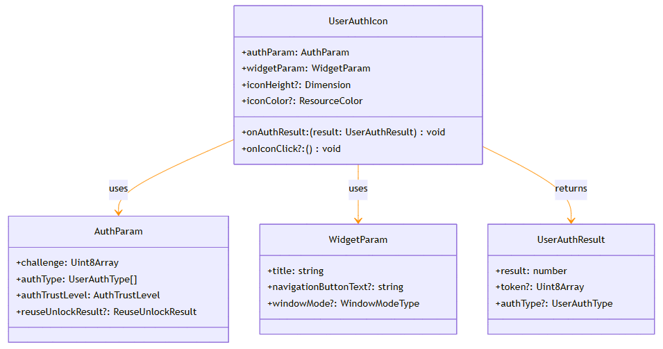

# @ohos.userIAM.userAuthIcon (嵌入式用户身份认证控件)

<!--Kit: User Authentication Kit-->
<!--Subsystem: UserIAM-->
<!--Owner: @WALL_EYE-->
<!--Designer: @lichangting518-->
<!--Tester: @jane_lz-->
<!--Adviser: @zengyawen-->

**userAuthIcon**模块是OpenHarmony用户身份认证体系（UserIAM）的UI组件模块，提供了一个开箱即用的身份认证图标组件（UserAuthIcon）。该组件用于在应用UI中展示人脸认证或指纹认证的图标，支持自定义图标颜色和尺寸，并可在点击图标时直接启动系统身份认证弹窗组件。

该模块主要用于以下场景：
- 在应用界面中快速集成人脸或指纹认证入口。
- 需要统一风格的生物特征认证图标展示。
- 点击图标即可触发系统级身份认证流程。


> **说明：**
>
> - 本模块同时支持ArkTS-Dyn、ArkTS-Sta。
> - 本模块首批接口从API version 12开始支持。后续版本的新增接口，采用上角标单独标记接口的起始版本。


## 关键Class/Interface介绍

### UserAuthIcon组件

`UserAuthIcon`是一个ArkTS自定义组件（@Component struct），封装了认证图标展示和认证触发逻辑。开发者只需传入认证参数和结果回调，即可快速实现认证功能。

主要属性包括：
- **authParam**：认证参数，定义认证类型、信任级别等。
- **widgetParam**：认证弹窗页面参数，定义标题、窗口模式等。
- **iconHeight**：图标高度（宽高比1:1）。
- **iconColor**：图标颜色。
- **onAuthResult**：认证结果回调。
- **onIconClick**：图标点击回调。



## API组合使用关系说明

使用userAuthIcon模块的典型流程如下：

```ts
// 以下为阐述调用逻辑的伪代码，仅提供步骤说明，不提供详细的可执行代码。
// 1. 在ArkTS页面中直接使用UserAuthIcon组件。
// 配置认证参数
let authParam = {
  challenge: new Uint8Array([]), // challenge用于防止重放攻击，必须使用安全随机数生成器获取。
  authType: [userAuth.UserAuthType.FACE, userAuth.UserAuthType.FINGERPRINT],
  authTrustLevel: userAuth.AuthTrustLevel.ATL3
};

// 配置弹窗页面参数。
let widgetParam = {
  title: '请进行身份认证'
};

// 2. 在页面布局中使用组件。
UserAuthIcon({
  authParam: authParam,
  widgetParam: widgetParam,
  iconHeight: '80fp',
  iconColor: Color.Blue,
  onAuthResult: (result) => {
    // 处理认证结果。
  },
  onIconClick: () => {
    // 可选：处理图标点击事件。
  }
})
```

## 导入模块

```ts
import { userAuth, UserAuthIcon } from '@kit.UserAuthenticationKit';
```

## 子组件

无

## 属性

不支持通用属性。

## UserAuthIcon

嵌入式用户身份认证控件。提供系统标准的人脸、指纹认证图标，点击图标后可自动触发身份认证流程。开发者只需配置认证参数和回调函数，即可在应用界面中集成身份认证入口。

```ts
UserAuthIcon({
  authParam: userAuth.AuthParam,
  widgetParam: userAuth.WidgetParam,
  iconHeight?: Dimension,
  iconColor?: ResourceColor,
  onIconClick?: ()=>void,
  onAuthResult: (result: userAuth.UserAuthResult)=>void
})
```

**装饰器类型：**\@Component

**原子化服务API（仅ArkTS-Dyn）：** 从API version 12开始，该接口支持在原子化服务中使用。

**模型约束：**此接口仅可在Stage模型下使用。

**系统能力：** SystemCapability.UserIAM.UserAuth.Core

**ArkTS-Dyn起始版本：** 12

**ArkTS-Sta起始版本：** 23

**参数：**

| 名称           | 类型                                                         | 必填 | 说明                                                         |
| -------------- | ----------------------------------------------------------- | ---- | ------------------------------------------------------------ |
| authParam      | [userAuth.AuthParam](js-apis-useriam-userauth.md#authparam10)        | 是   | 用户认证相关参数。包含挑战值(challenge)、认证类型列表(authType)、认证可信等级(authTrustLevel)等配置。挑战值用于防重放攻击，认证类型指定可用的认证方式（如人脸、指纹、PIN），认证可信等级决定认证的安全强度。 |
| widgetParam    | [userAuth.WidgetParam](js-apis-useriam-userauth.md#widgetparam10)    | 是   | 用户认证界面配置相关参数。包含认证界面标题(title)、导航按钮文本(navigationButtonText)等配置，用于自定义认证弹窗的显示内容。 |
| iconHeight     | [Dimension](../apis-arkui/arkui-ts/ts-types.md#dimension10) | 否   | 图标高度。设置认证图标的高度，宽高比为1:1（即高度和宽度相等）。默认值为64fp，不支持百分比字符串。建议根据界面布局选择合适的大小。<br>**默认值：** 64fp |
| iconColor      | [ResourceColor](../apis-arkui/arkui-ts/ts-types.md#resourcecolor) | 否   | 图标颜色。设置认证图标的颜色，支持颜色值、资源引用等多种格式。默认使用系统激活色，开发者可根据应用主题自定义颜色，如使用Color.Blue或$r('app.color.primary')。<br>**默认值：** $r('sys.color.ohos_id_color_activated') |
| onIconClick    | ArkTS-Dyn: ()=>void <br> ArkTS-Sta: [ClickCallbackFunc](#clickcallbackfunc23)  | 否   | 图标点击回调。用户点击认证图标时触发此回调，可在回调中执行点击前的准备工作或记录用户行为日志。如果未设置此回调，点击图标后直接触发认证流程。 |
| onAuthResult   | ArkTS-Dyn: (result: [userAuth.UserAuthResult](js-apis-useriam-userauth.md#userauthresult10))=>void <br> ArkTS-Sta: [userAuth.AuthCallbackOnResultFunc](js-apis-useriam-userauth.md#authcallbackonresultfunc23) | 是   | 认证结果回调。用户完成认证后触发此回调，回调参数包含认证结果码(result)、认证令牌(token)、认证类型(authType)等信息。应用需在此回调中处理认证结果，如认证通过时获取token用于后续安全操作，认证失败时提示用户重新尝试。<br>**注意：** 应用需申请`ohos.permission.ACCESS_BIOMETRIC`权限，否则应用将仅展示图标，无法正常拉起身份认证控件。 |

### build<sup>23+</sup>

build(): void

用于创建UserAuthIcon对象的构造函数。

**ArkTS模式：** 该接口仅适用于ArkTS-Sta。

**模型约束：**此接口仅可在Stage模型下使用。

**系统能力：** SystemCapability.UserIAM.UserAuth.Core

**ArkTS-Sta起始版本：** 23

## 事件

不支持通用事件。

## ClickCallbackFunc<sup>23+</sup>

type ClickCallbackFunc = () => void

回调函数，用户点击后通过该方法通知应用。

**ArkTS模式：** 该接口仅适用于ArkTS-Sta。

**模型约束：**此接口仅可在Stage模型下使用。

**系统能力：** SystemCapability.UserIAM.UserAuth.Core

**ArkTS-Sta起始版本：** 23

## 示例

ArkTS-Dyn示例：

```ts
import { cryptoFramework } from '@kit.CryptoArchitectureKit';
import { userAuth, UserAuthIcon } from '@kit.UserAuthenticationKit';

@Entry
@Component
struct Index {
  rand = cryptoFramework.createRandom();
  len: number = 16;
  randData: Uint8Array = this.rand?.generateRandomSync(this.len)?.data;
  authParam: userAuth.AuthParam = {
    challenge: this.randData,
    authType: [userAuth.UserAuthType.FACE, userAuth.UserAuthType.PIN],
    authTrustLevel: userAuth.AuthTrustLevel.ATL3
  };
  widgetParam: userAuth.WidgetParam = {
    title: '请进行身份认证'
  };

  build() {
    Row() {
      Column() {
        UserAuthIcon({
          authParam: this.authParam,
          widgetParam: this.widgetParam,
          iconHeight: 200,
          iconColor: Color.Blue,
          onIconClick: () => {
            console.info('The user clicked the icon.');
          },
          onAuthResult: (result: userAuth.UserAuthResult) => {
            console.info(`Get user auth result, result = ${result.result}`);
          }
        })
      }
    }
  }
}
```

ArkTS-Sta示例：

```ts
import { cryptoFramework } from '@kit.CryptoArchitectureKit';
import { userAuth, UserAuthIcon } from '@kit.UserAuthenticationKit';

@Entry
@Component
struct Index {
  rand: cryptoFramework.Random = cryptoFramework.createRandom();
  len: int = 16;
  randData: Uint8Array = this.rand.generateRandomSync(this.len).data;
  authParam: userAuth.AuthParam = {
    challenge: this.randData,
    authType: [userAuth.UserAuthType.FACE, userAuth.UserAuthType.PIN],
    authTrustLevel: userAuth.AuthTrustLevel.ATL3
  } as userAuth.AuthParam;
  widgetParam: userAuth.WidgetParam = {
    title: '请进行身份认证'
  } as userAuth.WidgetParam;

  build() {
    Row() {
      Column() {
        UserAuthIcon({
          authParam: this.authParam,
          widgetParam: this.widgetParam,
          iconHeight: 200,
          iconColor: Color.Blue,
          onIconClick: () => {
            console.info('The user clicked the icon.');
          },
          onAuthResult: (result: userAuth.UserAuthResult) => {
            console.info(`Get user auth result, result = ${result.result}`);
          }
        })
      }
    }
  }
}
```

调用onAuthResult可能会抛出错误码，错误码详细介绍请参见[通用错误码](../errorcode-universal.md)和[用户认证错误码](errorcode-useriam.md)。

**人脸认证图例：**


**指纹认证图例：**


