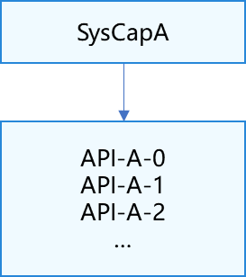
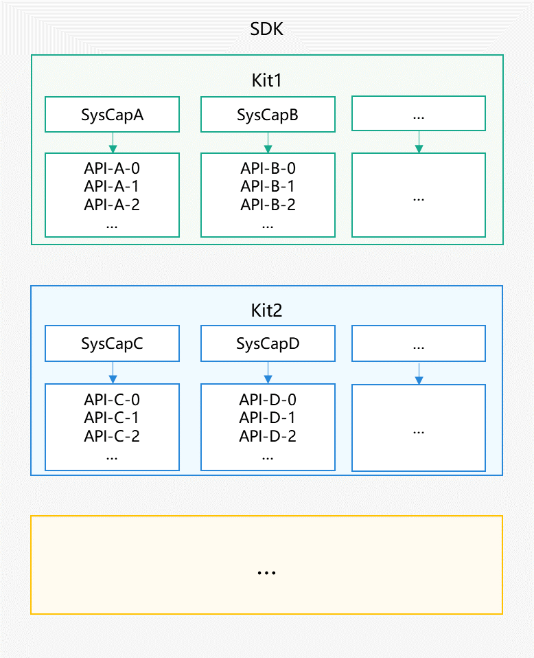
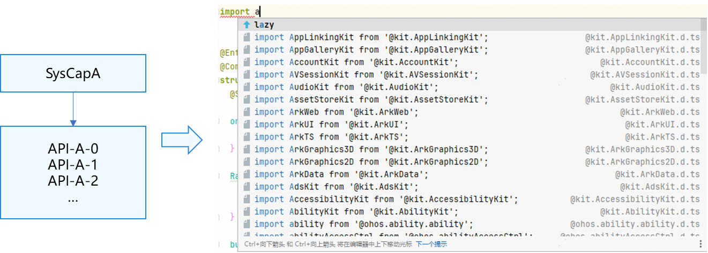
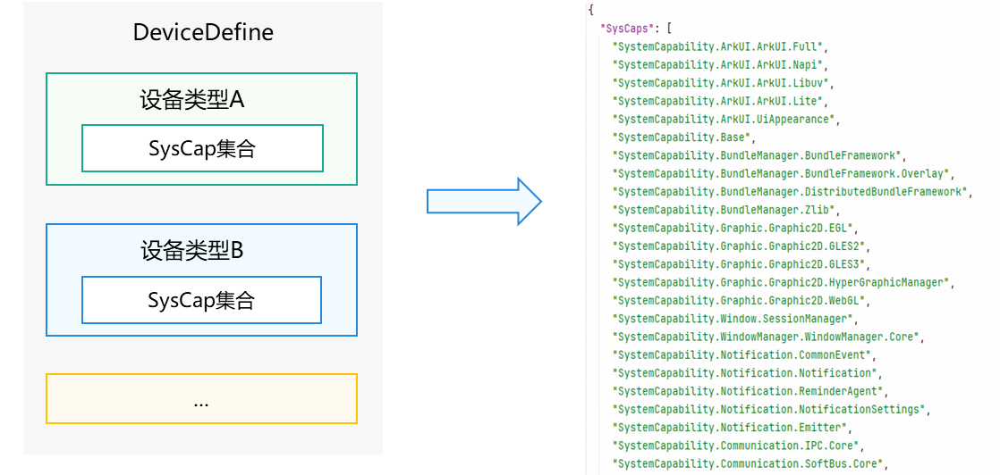
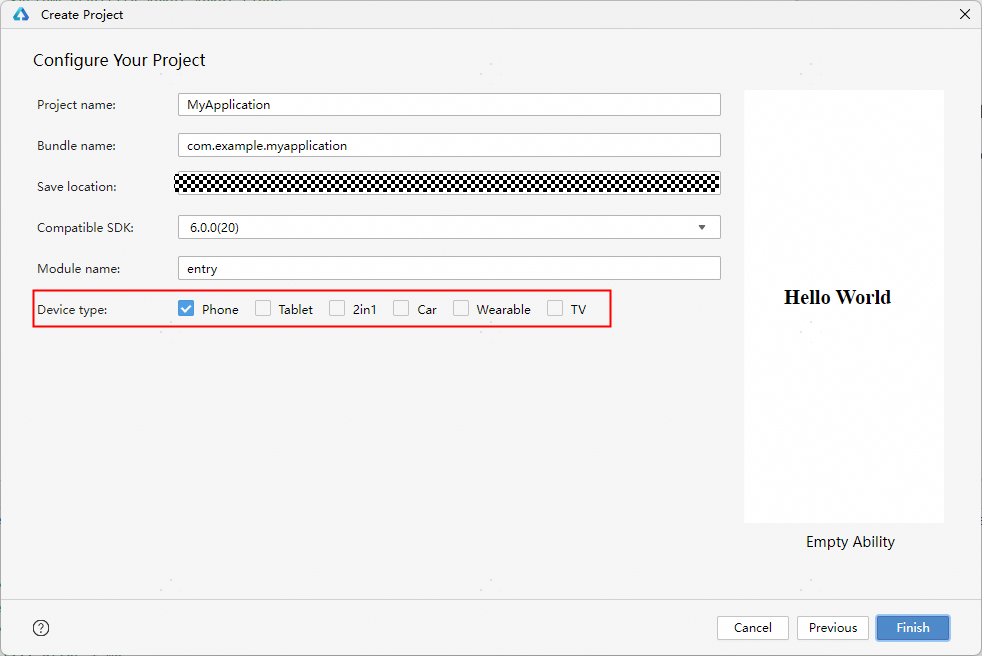
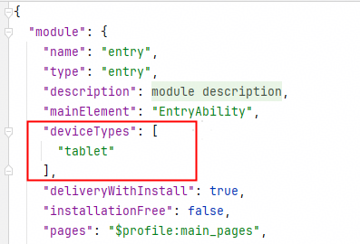
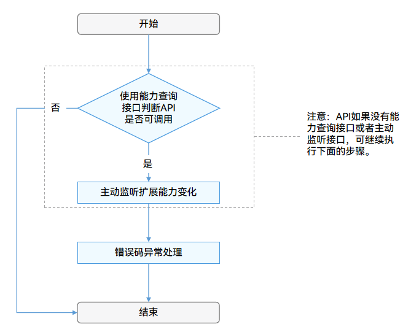
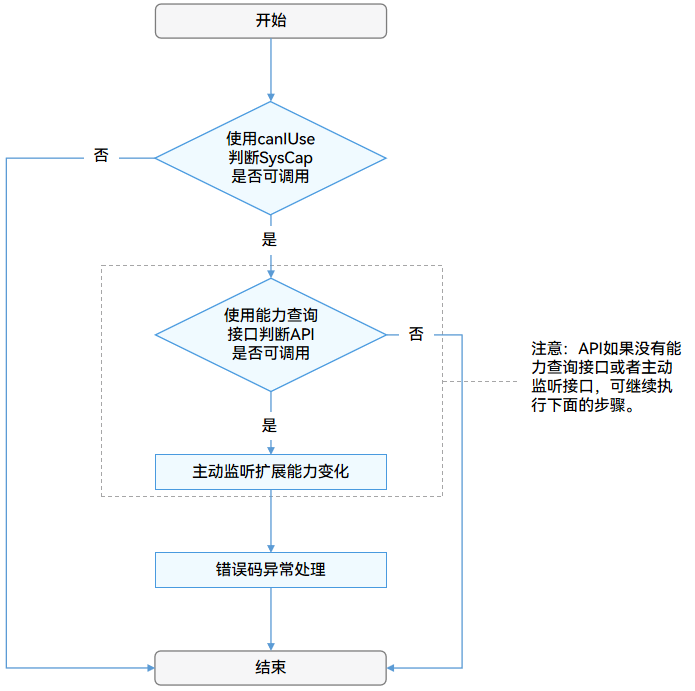

# 系统能力SystemCapability使用指南

<!--Kit: Common-->
<!--Subsystem: Common-->
<!--Owner: @mgy917-->
<!--Designer: @jiangwensai-->
<!--Tester: @Lyuxin-->
<!--Adviser: @RayShih-->

本文将系统阐述SystemCapability（SysCap）的定义、用途，以及在单设备与多设备应用开发场景下的适配开发策略。

## 什么是SystemCapability（SysCap）

SystemCapability，下文统一简称为SysCap，用于标识一组实现特定开放能力的API集合，如下图所示。



以名为SystemCapability.Communication.Bluetooth.Core的蓝牙SysCap为例，它代表了一组蓝牙能力相关的API，包括：

- 蓝牙设备扫描API

- 蓝牙设备配对与连接API

- 数据的发送与接收API

- 蓝牙状态管理API等


## SysCap的用途

SysCap的用途：

1. 首要职责：隔离不同设备类型之间的开放能力差异。

   仍以蓝牙为例，不同设备类型对蓝牙的支持情况有所不同，为便于开发者判断相关API是否可用，引入了SysCap机制。
   
   开发者可通过[canIUse](../reference/common/js-apis-syscap.md#caniuse)接口，判断指定SysCap所代表的开放能力API集合是否支持在目标设备类型上调用。
   
2. 次要职责：进行特性归类。

   每个SysCap所代表的开放能力API集合，对应操作系统中一个独立的功能特性。例如上述蓝牙SysCap标识的API集合，逻辑上均属于“蓝牙核心通信能力”。

> **注意**：
> 
> 同一设备类型下不同的产品型号，软硬件规格可能不一致，所以需要开发者通过canIUse和能力查询接口判断，以达到先查询后使用的目的。例如部分手机不支持POI功能，所以需要开发者先使用canIUse判断SystemCapability.Location.Location.Core在手机上是否可调用，接着还需使用[geoLocationManager.isPoiServiceSupported](apis-location-kit/js-apis-geoLocationManager.md#geolocationmanagerispoiservicesupported20)查询系统（即软件）是否支持POI服务，全部支持之后开发者才可正常使用POI相关接口。详情请参见[SysCap适配应用开发](#syscap适配应用开发)。

## SysCap与SDK和Kit的关系

SysCap与SDK、Kit形成结构化、层级化结构，如下图所示：

 

1. SDK由多个功能独立的Kit组成；

2. 每个Kit包含一个或多个SysCap，且每个SysCap仅属于一个 Kit；

3. 每个SysCap标识/代表了一个或多个API接口。


这一结构化设计，使得开发者在编写代码时，可通过开发工具（如 DevEco Studio）的智能提示与自动联想，精准、高效地定位和调用所需接口，显著降低误用风险，提升开发效率。

以Tablet设备为例，如果开发者在.ets文件上导入以“a”开头的某个模块的具体内容（例如：接口、类、函数、变量、对象等），DevEco Studio会联想出所有支持在Tablet上可用的某个模块的具体内容，如下图所示：

 

## SysCap与Device type的关系

在SDK的“device-define”文件夹下，以json文件定义了各设备类型支持的SysCap集合。例如：tablet.json文件定义了Tablet设备支持SystemCapability.ArkUI.ArkUI.Full、SystemCapability.Communication.NFC.Core等SysCap。如下图所示：

 

开发者在DevEco Studio创建工程时，需要选择应用的设备类型Device type：

 

也可在新建工程后，通过修改module.json5文件中的[deviceTypes](../quick-start/module-configuration-file.md#devicetypes标签)指定应用支持的设备类型：

 

DevEco Studio自动识别项目中的设备类型，定位SDK“device-define”下对应的SysCap集合，进而提取该设备支持的API，用于智能提示与自动联想，助力开发者精准、高效地调用所需接口。

> **注意**：
>
> 当设备类型为多个时，此时DevEco Studio识别的SysCap集合是这几个设备类型的并集。

## SysCap适配应用开发

如前文所述，SysCap是隔离设备类型间开放能力差异的机制；但在实际应用开发中，完成SysCap层面的隔离判断后，还需要关注：

1. 同一设备类型下的不同设备型号，可能因硬件配置差异等因素导致同一SysCap下的部分API调用异常；

2. 同一设备型号可能因硬件动态变更（可插拔等）导致同一SysCap下的部分API调用异常。


因此，在实际应用开发中，需要开发者进行相关代码适配开发，确保应用在各类设备上均能提供良好、稳定的用户体验。

适配开发主要包括以下4部分。

### 使用canIUse判断SysCap是否可调用

使用[canIUse](../reference/common/js-apis-syscap.md#caniuse)接口判断SysCap对应的API集合是否可调用：true表示可调用，false表示不可调用（该SysCap在对应设备类型中未包含）。

**ArkTS API使用示例**

```js
if (canIUse("SystemCapability.Location.Location.Core")) {
 console.info("The device supports SystemCapability.Location.Location.Core");
} else {
 console.info("The device does not support SystemCapability.Location.Location.Core");
}
```

**Native API使用示例**

```c++
#include <stdio.h>
#include <stdlib.h>
#include "syscap_ndk.h"

char syscap[] = "SystemCapability.ArkUI.ArkUI.Full";
bool result = canIUse(syscap);
if (result) {
 printf("SysCap: %s is supported!\n", syscap);
} else {
 printf("SysCap: %s is not supported!\n", syscap);
}
```

### 使用能力查询接口判断API是否可用

使用系统侧的isXXXAvailable()、isXXXSupported()、canMakeXXX()等接口判断API是否可用。

> **说明**：
>
> 并不是所有API都会有能力查询接口，若需要验证的API没有能力查询接口，可通过主动监听或错误码异常处理来判断API是否可用。

```javascript
import { geoLocationManager } from '@kit.LocationKit';

if (!canIUse("SystemCapability.Location.Location.Core")) { // 首先对能力集进行可用性判断，该步骤仅适用于多设备应用开发，单设备应用开发可忽略该步骤。
  return;
}
try {
  if (geoLocationManager.isPoiServiceSupported()) { // 然后进行POI服务能力的查询
    geoLocationManager.getPoiInfo().then((poiInfo) => { // 判断能力支持后，进行位置信息的获取接口调用
      if (poiInfo !== undefined) {
        console.info("get PoiInfo:" + JSON.stringify(poiInfo));
      }
    })
  }
} catch (error) {
  console.error("getPoiInfo errCode:" + error.code + ", errMessage:" + error.message);
}
```

### 主动监听扩展能力变化

在硬件动态扩展场景中，部分硬件插拔会导致能力变化，开发者可以主动监听扩展能力变化。

例如：对于USB类型的Camera，存在动态插拔的场景，系统侧提供了on的监听接口，支持开发者处理摄像头设备的动态变化。

```javascript
import { BusinessError } from '@kit.BasicServicesKit';
import { camera } from '@kit.CameraKit';

callback(err: BusinessError, cameraStatusInfo: camera.CameraStatusInfo): void {
  if (err !== undefined && err.code !== 0) {
    console.error('cameraStatus with errorCode = ' + err.code);
    return;
  }
  console.info(`camera : ${cameraStatusInfo.camera.cameraId}, status: ${cameraStatusInfo.status}`);
}
registerCameraStatus(cameraManager: camera.CameraManager): void {
  cameraManager.on('cameraStatus', this.callback); // 开发者通过监听Camera的状态，处理动态硬件设备
}
```

### 错误码异常处理

为应对调用接口可能出现的异常情况，开发者还需进行错误码异常处理。

1. 同步接口必须使用try...catch处理异常，避免应用功能崩溃。 

   ```javascript
   import { omapi } from '@kit.ConnectivityKit';
   import { hilog } from '@kit.PerformanceAnalysisKit';
   let seService : omapi.SEService;
   let seReaders : omapi.Reader[];
   
   // 在使用seService之前，需要对seService进行初始化
   function secureElementDemo() {
     // 获取readers
     try {
       seReaders = seService.getReaders();
     } catch (error) {
      if(error.code=== 801) {
       console.error('This device does not support this capability');
      }
     }
   }
   ```

2. 异步接口使用.catch的方式捕获异步的异常，开发者也可以不处理异常，应用不会崩溃。 

   ```javascript
   import { media } from '@kit.MediaKit';
   
   let avScreenCaptureRecorder: media.AVScreenCaptureRecorder | undefined;
   media.createAVScreenCaptureRecorder().then((captureRecorder: media.AVScreenCaptureRecorder) => {
     // 执行正常业务
     if (captureRecorder != null) {
       avScreenCaptureRecorder = captureRecorder;
       console.info('Succeeded in creating avScreenCaptureRecorder');
     } else {
       console.error('Failed to create avScreenCaptureRecorder');
     }
   }).catch((error: BusinessError) => {
     // 处理业务逻辑错误
     console.error(`createAVScreenCaptureRecorder catchCallback, error message:${error.message}`);
   });
   ```

3.  使用全局捕获，在全局添加异常捕获监听，能够捕获未被try...catch的异常，添加后应用抛出异常后不会主动退出，详情可参考[errorManager.on('error')](apis-ability-kit/js-apis-app-ability-errorManager.md#errormanageronerror)。

## 单设备及多设备应用开发场景下的适配开发

应用开发可分为：

1. 单设备应用开发：指应用工程的Device type只配置1个设备类型；

2. 多设备应用开发：指应用工程的Device type配置多个设备类型。


### 单设备应用开发场景下的适配开发

单设备应用开发时，DevEco Studio只识别到一种设备类型，适配开发过程如下图所示：

 

1. 如果存在API在同一设备类型下的不同设备型号存在能力不一致的情况，需使用能力查询接口判断接口能力可用性（注意：此处的能力查询机制并非canIUse，请参见[使用能力查询接口判断API是否可用](#使用能力查询接口判断api是否可用)）；

2. 为了避免调用接口出现的异常情况，需要开发者进行错误码异常处理。


### 多设备应用开发场景下的适配开发

多设备应用开发时，DevEco Studio需同时识别多种设备类型，适配开发过程如下图所示：

 

1. 使用canIUse判断并集内交集外的SysCap集合是否可用； 

   - canIUse仅适用于多设备应用开发，单设备应用开发可直接进行接口能力查询；

   - 多设备应用开发场景下，当SysCap所属设备类型处于[deviceTypes](../quick-start/module-configuration-file.md#devicetypes标签)选择范围与API支持范围的并集但不在其交集内时（如设备类型选Phone/Tablet，而API仅支持Phone/2in1），必须通过canIUse进行可用性校验。

2. 如果API在同一设备类型下的不同设备型号存在能力不一致的情况，需使用能力查询接口判断接口能力可用性（注意：此处的能力查询机制并非canIUse）；

3. 为了避免调用接口出现的异常情况，进行错误码异常处理。
