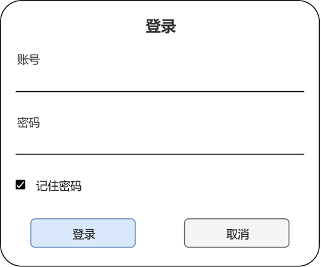
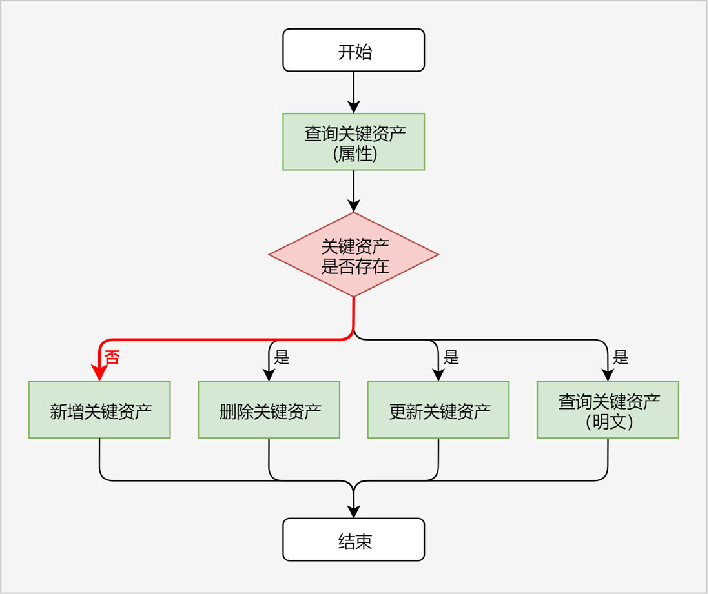

# 保护密码类数据

<!--Kit: Asset Store Kit-->
<!--Subsystem: Security-->
<!--Owner: @HarMonkey-->
<!--Designer: @wkr321_ent-->
<!--Tester: @nacyli-->
<!--Adviser: @zengyawen-->

> **说明：**
>
> 密码类数据可以是密码、登录令牌、信用卡号等用户敏感数据。

## 场景描述

用户在应用/浏览器中登录账号时，可以选择“记住密码”（如图）。针对此种场景，应用/浏览器可以将用户密码存储在ASSET中，由ASSET保证用户密码的安全性。

用户再次打开登录界面时，应用/浏览器可以从ASSET中查询用户密码，并将其自动填充到密码输入框，用户只需点击“登录”按钮即可完成账号登录，极大地提升了用户体验。

## 关键流程

业务调用ASSET保护密码类数据（后文统称为“关键资产”），可以参照以下流程进行开发。

1. 业务查询符合条件的关键资产属性，根据查询成功/失败，判断关键资产是否存在。

   - 开发步骤参考查询关键资产(ArkTS) / 查询关键资产(C/C++)，代码示例参考查询单条关键资产属性(ArkTS) / 查询单条关键资产属性(C/C++)。
2. 如果关键资产不存在，业务可选择：
    - 新增关键资产，开发步骤参考新增关键资产(ArkTS) / 新增关键资产(C/C++)。
3. 如果关键资产存在，业务可选择：
    - 删除关键资产，开发步骤参考删除关键资产(ArkTS) / 删除关键资产(C/C++)。
    - 更新关键资产，开发步骤参考更新关键资产(ArkTS) / 更新关键资产(C/C++)。
    - 查询关键资产明文，开发步骤参考查询关键资产(ArkTS) / 查询关键资产(C/C++)，代码示例参考查询单条关键资产明文(ArkTS) / 查询单条关键资产明文(C/C++)。
