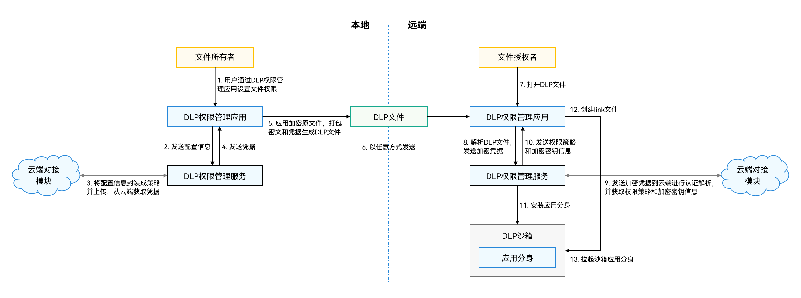

# 应用适配打开DLP文件(ArkTS)
<!--Kit: Data Protection Kit-->
<!--Subsystem: Security-->
<!--Owner: @winnieHuYu-->
<!--Designer: @QRF-->
<!--Tester: @nacyli-->
<!--Adviser: @zengyawen-->

## 开发流程

DLP文件所涉及的重要模块及其交互，如下图所示。文件所有者或者文件授权者通过DLP权限管理应用模块，调用对应接口，完成DLP文件的生成和打开等操作。



### DLP文件生成与发送

用户加密分享文件主要有两种方式：

- 方式一（系统分享）：以文件为起点，用户直接选择文件，加密分享到应用。

- 方式二（三方应用分享）：以应用为起点，用户在应用内通过文件Picker（[@ohos.file.picker (选择器)](../../reference/apis-core-file-kit/js-apis-file-picker.md)）的方式，选择文件并设置加密分享。

**系统分享：**

用户直接选择文件，加密分享到应用。用户在设备上的操作流程如下：

1. 在文件管理、图库等系统应用中，选择需要加密分享的文件。

2. 点击分享并选中底部功能区的“加密分享”功能，进入加密分享授权界面，添加访问方的华为账号，来指定可查看文件的用户。

3. 可以通过“系统分享”将加密后的文件发送到三方应用，如分享到聊天类应用后，再发送给他人。

为了支撑用户顺利完成上述流程，应用应满足以下要求：

- 支持从系统分享并发送.dlp后缀的加密文件到应用，应用不对.dlp文件进行过滤。

- 确保DLP文件内容不被损坏，并保持.dlp文件后缀不变。

**三方应用分享：**

在应用内通过文件Picker的方式，选择文件并设置加密分享。用户在设备上的操作流程如下：

1. 在应用内通过文件Picker选择文件。

2. 点击文件Picker底部的“加密分享”按钮进入加密分享授权界面，添加访问方的华为账号，来指定可查看文件的用户。

3. 添加完毕后，直接在三方应用内将加密文件分享给他人。

为了支撑用户顺利完成上述流程，应用应满足以下要求：

- 配置DocumentSelectOptions参数，在文件picker底部显示“加密分享”按钮。

- 通过DocumentViewPicker获取文件URI。

- 应用获取文件URI后即可发送DLP文件。

### 查看加密文件

用户查看加密文件有两种方式：

- 方式一：在应用内通过文件预览查看DLP文件。

- 方式二：将应用内的DLP文件保存到本地系统文件管理中查看。

**应用内使用文件预览查看DLP文件：**

用户在应用内点击要查看的DLP文件，应用直接拉起文件预览查看文件。

为支持用户顺利完成上述步骤，应用需进行以下适配：

- 打开DLP文件时，需要先获取待打开DLP文件的URI。

- 构造want参数。

- 通过startAbility将want参数传入，使用系统统一打开功能进行打开。

**将DLP文件保存到本地文件管理中查看：**

用户在设备上的操作流程如下：

1. 在应用内选择DLP文件。

2. 将文件保存到本地系统文件管理。

3. 在系统文件管理中点击DLP文件通过系统文件预览查看。

为支持用户顺利完成上述步骤，应用需进行以下适配：

- 应用支持下载或保存加密文件到系统文件管理。

- 下载或保存加密文件时不改变.dlp文件后缀。

## 开发步骤

本文档提供接口示例代码，如需要了解工程项目创建方式，可参考[工程创建](https://developer.huawei.com/consumer/cn/doc/harmonyos-guides/ide-project)。

1. 引入[dlpPermission](../../reference/apis-data-protection-kit/js-apis-dlppermission.md)模块。

    <!-- @[dlp_include_dlpPermission](https://gitcode.com/openharmony/applications_app_samples/blob/master/code/DocsSample/Security/DataProtectionKit/DLP/entry/src/main/ets/pages/Index.ets) -->
    
    ``` TypeScript
    import { dlpPermission } from '@kit.DataProtectionKit';
    ```

2. 应用内支持打开选定的DLP文件。

    使用该接口的前置条件：链接DLP凭据服务器。

    应用可以支持从最近打开列表、文件选择器中选择DLP文件，打开DLP文件的场景，按如下流程适配：

     2.1 设置[Want](../../reference/apis-ability-kit/js-apis-inner-ability-want.md)参数，指定action为"ohos.want.action.viewData"，uri为需要打开的DLP文件的URI，在parameters中设置fileName的name值为DLP文件的文件名。

    2.2 获取[UIAbilityContext](../../reference/apis-ability-kit/js-apis-app-ability-common.md#uiabilitycontext)的context。

    2.3 调用context的[startAbility](../../reference/apis-ability-kit/js-apis-inner-application-uiAbilityContext.md#startability)方法传入want参数，打开dlp文件。

    <!-- @[dlp_prepareForOpenDlpFile](https://gitcode.com/openharmony/applications_app_samples/blob/master/code/DocsSample/Security/DataProtectionKit/DLP/entry/src/main/ets/pages/Index.ets) -->
    
    ``` TypeScript
    openDlpFile(dlpUri: string, fileName: string, fd: number) {
      let want: Want = {
        'action': 'ohos.want.action.viewData',
        'uri': dlpUri,
        'parameters': {
          'fileName': {
            'name': fileName
          },
          'keyFd': {
            'type': 'FD',
            'value': fd
          }
        }
      }
    
      let context = new UIContext().getHostContext() as common.UIAbilityContext; // 获取当前UIAbilityContext
    
      try {
        console.info('openDLPFile:' + JSON.stringify(want));
        console.info('openDLPFile: delegator:' + JSON.stringify(context));
        hilog.info(HILOG_DLP_DOMAIN, HILOG_TAG, 'openDLPFile:' + JSON.stringify(want));
        hilog.info(HILOG_DLP_DOMAIN, HILOG_TAG, 'openDLPFile: delegator:' + JSON.stringify(context));
        context.startAbility(want);
      } catch (err) {
        console.error('openDLPFile startAbility failed' + (err as BusinessError).code);
        hilog.error(HILOG_DLP_DOMAIN, HILOG_TAG, 'openDLPFile startAbility failed' + (err as BusinessError).code);
        this.result = 'openDLPFile startAbility failed' + (err as BusinessError).code;
        return;
      }
    }
    
    prepareForOpenDlpFile() {
      let file = this.openFile(this.uri);
      if (!file) {
        return;
      }
      this.openDlpFile(this.uri, this.fileName, file.fd);
    
    }
    ```

    以上代码需要在module.json5文件中增加ohos.want.action.viewData：
   
    <!-- @[dlp_configurationModule](https://gitcode.com/openharmony/applications_app_samples/blob/master/code/DocsSample/Security/DataProtectionKit/DLP/entry/src/main/module.json5) -->
    
    ``` JSON5
    "skills": [
      {
        "entities": [
          "entity.system.home"
        ],
        "actions": [
          "action.system.home",
          "ohos.want.action.viewData"
        ]
      }
    ]
    ```
  
3. 应用内支持对DLP文件权限设置。

    使用该接口的前置条件：链接DLP凭据服务器。
   
    应用内可以集成权限设置按钮，当已打开一个普通文件后，点击权限设置按钮，拉起DLP管理应用的模态设置权限页面，生成DLP文件。也可以在DLP沙箱分身中查看当前正在打开的DLP文件的操作权限。

    该功能云端对接模块当前需要开发者自行搭建，并且该功能需要配置域账号环境。

    3.1 普通应用内权限设置。

    3.1.1 首先要有一个DLP权限应用有读写权限的（比如文件管理的文档目录下）。

    3.1.2 以无边框形式打开DLP权限管理应用。此方法只能在UIAbility上下文中调用。调用[startDLPManagerForResult](../../reference/apis-data-protection-kit/js-apis-dlppermission.md#dlppermissionstartdlpmanagerforresult11)，拉起DLP管理应用的设置权限页面，输入相关的授权账号信息，点击保存，在拉起的filepicker中选择DLP文件的保存路径，保存DLP文件。

    <!-- @[dlp_generateDlpFiles](https://gitcode.com/openharmony/applications_app_samples/blob/master/code/DocsSample/Security/DataProtectionKit/DLP/entry/src/main/ets/pages/Index.ets) -->
    
    ``` TypeScript
    generateDlpFiles() {
      try {
        let fileUri: string = this.uri;
        let fileName: string = this.fileName;
        let context = new UIContext().getHostContext() as common.UIAbilityContext; // 获取当前UIAbilityContext
        let want: Want = {
          'uri': fileUri,
          'parameters': {
            'displayName': fileName
          }
        }; // 请求参数
        if (canIUse('SystemCapability.Security.DataLossPrevention')) {
          dlpPermission.startDLPManagerForResult(context, want).then((res: dlpPermission.DLPManagerResult) => {
            this.result = 'startDLPManagerForResult result.resultCode:' + res.resultCode;
            console.info('startDLPManagerForResult res.resultCode:' + res.resultCode);
            console.info('startDLPManagerForResult res.want:' + JSON.stringify(res.want));
            hilog.info(HILOG_DLP_DOMAIN, HILOG_TAG, 'startDLPManagerForResult res.resultCode:' + res.resultCode);
            hilog.info(HILOG_DLP_DOMAIN, HILOG_TAG, 'startDLPManagerForResult res.want:' + JSON.stringify(res.want));
          });
        }
      } catch (err) {
        this.result = 'startDLPManagerForResult error:' + (err as BusinessError).code + (err as BusinessError).message;
        console.error('startDLPManagerForResult error:' + (err as BusinessError).code + (err as BusinessError).message);
        hilog.error(HILOG_DLP_DOMAIN, HILOG_TAG,
          'startDLPManagerForResult error:' + (err as BusinessError).code + (err as BusinessError).message);
      }
    }
    ```
    
    3.2. DLP沙箱分身内权限修改，查看和解除。
    
    使用该接口的前置条件：链接DLP凭据服务器。

    3.2.1 如果当前的账号是DLP文档的创建者，则该用户拥有修改这个DLP文件权限或者解除这个DLP文档权限还原为普通文件的能力，调用[startDLPManagerForResult](../../reference/apis-data-protection-kit/js-apis-dlppermission.md#dlppermissionstartdlpmanagerforresult11)，拉起DLP管理应用的设置权限页面，在该页面中选择更改加密进行权限修改或者解除加密；如果当前账号拥有DLP文档只读或者编辑权限，调用以下代码则可以查看当前用户权限内容。

    <!-- @[dlp_startDLPManagerForResult](https://gitcode.com/openharmony/applications_app_samples/blob/master/code/DocsSample/Security/DataProtectionKit/DLP/entry/src/main/ets/pages/Index.ets) -->
    
    ``` TypeScript
    startDLPManagerForResult() {
      if (canIUse('SystemCapability.Security.DataLossPrevention')) {
        try {
          let context = new UIContext().getHostContext() as common.UIAbilityContext; // 获取当前UIAbilityContext
          let want: Want = {
            'uri': this.uri,
            'parameters': {
              'displayName': this.fileName
            }
          }; // 请求参数
          dlpPermission.startDLPManagerForResult(context, want).then((res) => {
            this.result = 'startDLPManagerForResult resultCode: ' + res.resultCode;
            console.info('res.resultCode', res.resultCode);
            console.info('res.want', JSON.stringify(res.want));
            hilog.info(HILOG_DLP_DOMAIN, HILOG_TAG, 'res.resultCode' + res.resultCode);
            hilog.info(HILOG_DLP_DOMAIN, HILOG_TAG, 'res.want' + JSON.stringify(res.want));
          }); // 打开DLP权限管理应用
        } catch (err) {
          this.result = 'startDLPManagerForResult error' + err.code + err.message;
          console.error('error', err.code, err.message); // 失败报错
          hilog.error(HILOG_DLP_DOMAIN, HILOG_TAG,
            'error' + (err as BusinessError).code + (err as BusinessError).message);
        }
      }
    }
    ```

4. 查询当前应用是否在沙箱中。

    使用该接口的前置条件：由demo应用打开DLP文件。
   
    在应用中调用[isInSandbox](../../reference/apis-data-protection-kit/js-apis-dlppermission.md#dlppermissionisinsandbox)接口判断当前是否是DLP沙箱分身，如果是DLP沙箱分身则可以结合调用接口查询权限的结果进行对应功能按钮的置灰或屏蔽。比如：如果只有只读权限，则编辑保存入口可以置灰，如果是只读或者编辑权限，则修改权限入口可以置灰。

    <!-- @[dlp_isInSandBox](https://gitcode.com/openharmony/applications_app_samples/blob/master/code/DocsSample/Security/DataProtectionKit/DLP/entry/src/main/ets/pages/Index.ets) -->
    
    ``` TypeScript
    isInSandbox() {
      if (canIUse('SystemCapability.Security.DataLossPrevention')) {
        dlpPermission.isInSandbox().then((data) => {
          this.result = 'isInSandbox result: ' + JSON.stringify(data);
          console.info('isInSandbox result: ' + JSON.stringify(data));
          hilog.info(HILOG_DLP_DOMAIN, HILOG_TAG, 'isInSandbox result: ' + JSON.stringify(data));
        }).catch((err: BusinessError) => {
          this.result = 'isInSandbox error: ' + JSON.stringify(err);
          console.error('isInSandbox error: ' + JSON.stringify(err));
          hilog.error(HILOG_DLP_DOMAIN, HILOG_TAG, 'isInSandbox error: ' + JSON.stringify(err));
        });
      }
    }
    ```

5. 应用根据DLP文件的权限对界面进行适配。

    DLP沙箱分身中可以调用[getDLPPermissionInfo](../../reference/apis-data-protection-kit/js-apis-dlppermission.md#dlppermissiongetdlppermissioninfo)方法查询当前系统登录的域账号用户对本DLP文件的用户权限和操作权限，不同用户权限可以对应不同的对文档的操作权限。沙箱限制可见[数据防泄露（DLP）简介](dlp-guidelines.md)。
   
     使用该接口的前置条件：由demo应用打开DLP文件。

    <!-- @[dlp_getDLPPermissionInfo](https://gitcode.com/openharmony/applications_app_samples/blob/master/code/DocsSample/Security/DataProtectionKit/DLP/entry/src/main/ets/pages/Index.ets) -->
    
    ``` TypeScript
    getDLPPermissionInfo() {
      if (canIUse('SystemCapability.Security.DataLossPrevention')) {
        dlpPermission.getDLPPermissionInfo().then((data) => {
          this.result = 'getDLPPermissionInfo result: ' + JSON.stringify(data);
          console.info('getDLPPermissionInfo, result: ' + JSON.stringify(data));
          hilog.info(HILOG_DLP_DOMAIN, HILOG_TAG, 'getDLPPermissionInfo result: ' + JSON.stringify(data));
        }).catch((err: BusinessError) => {
          this.result = 'getDLPPermissionInfo error: ' + JSON.stringify(err);
          console.error('getDLPPermissionInfo: ' + JSON.stringify(err));
          hilog.error(HILOG_DLP_DOMAIN, HILOG_TAG, 'getDLPPermissionInfo error: ' + JSON.stringify(err));
        });
      }
    }
    ```

    getDLPPermissionInfo返回的data为[DLPPermissionInfo](../../reference/apis-data-protection-kit/js-apis-dlppermission.md#dlppermissioninfo)类型，其中dlpFileAccess表示用户权限，flags表示操作权限的按位组合的结果。可以根据返回的flags字段对照[ActionFlagType](../../reference/apis-data-protection-kit/js-apis-dlppermission.md#actionflagtype)判断DLP沙箱分身是否具有对应的操作权限，可以用于界面按钮置灰操作等。

6. 获取当前可支持DLP方案的文件扩展名类型列表。

    [getDLPSupportedFileTypes](../../reference/apis-data-protection-kit/js-apis-dlppermission.md#dlppermissiongetdlpsupportedfiletypes)用于应用判断当前文件能否生成进行加密。

    <!-- @[dlp_getDLPSupportedFileTypes](https://gitcode.com/openharmony/applications_app_samples/blob/master/code/DocsSample/Security/DataProtectionKit/DLP/entry/src/main/ets/pages/Index.ets) -->
    
    ``` TypeScript
    getDLPSupportedFileTypes() {
      if (canIUse('SystemCapability.Security.DataLossPrevention')) {
        dlpPermission.getDLPSupportedFileTypes((err, result) => {
          console.info('getDLPSupportedFileTypes: ' + JSON.stringify(err));
          console.info('getDLPSupportedFileTypes: ' + JSON.stringify(result));
          hilog.info(HILOG_DLP_DOMAIN, HILOG_TAG, 'getDLPSupportedFileTypes: ' + JSON.stringify(err));
          hilog.info(HILOG_DLP_DOMAIN, HILOG_TAG, 'getDLPSupportedFileTypes: ' + JSON.stringify(result));
          this.result = 'getDLPSupportedFileTypes result: ' + JSON.stringify(result);
        });
      }
    }
    ```

7. 判断当前打开文件是否是DLP文件。

    使用该接口的前置条件：需要dlp文件进行判断。

    [isDLPFile](../../reference/apis-data-protection-kit/js-apis-dlppermission.md#dlppermissionisdlpfile)用于判断当前打开文件是否是DLP文件。

    <!-- @[dlp_isCurrentDlpFile](https://gitcode.com/openharmony/applications_app_samples/blob/master/code/DocsSample/Security/DataProtectionKit/DLP/entry/src/main/ets/pages/Index.ets) -->
    
    ``` TypeScript
    isCurrentDlpFile() {
      let file = this.openFile(this.uri);
      if (!file) {
        this.result = '请打开一个文件！';
        return;
      }
      if (canIUse('SystemCapability.Security.DataLossPrevention')) {
        dlpPermission.isDLPFile(file.fd).then((res) => {
          if (res.valueOf()) {
            this.result = 'isDLPFile result: ' + JSON.stringify(res);
          } else {
            this.result = '请打开一个dlp文件! ';
          }
          console.info('res', res);
          hilog.info(HILOG_DLP_DOMAIN, HILOG_TAG, 'res' + res);
        }).catch((err: BusinessError) => {
          this.result = 'isDLPFile error: ' + (err as BusinessError).code + (err as BusinessError).message;
          console.error('error', (err as BusinessError).code, (err as BusinessError).message); // 失败报错
          hilog.error(HILOG_DLP_DOMAIN, HILOG_TAG,
            'error' + (err as BusinessError).code + (err as BusinessError).message);
        }).finally(() => {
          try {
            fileIo.closeSync(file);
          } catch (e) {
            console.error('closeSync failed', e);
          }
        });
      }
    }
    ```

8. 应用支持更新最近打开记录。

    当应用有最近打开记录场景时，可以使用DLP框架提供的接口适配最近打开记录。可从以下场景适配：
    
    8.1 普通应用未启动，无法感知到DLP沙箱分身打开的DLP文件。

    仅有DLP沙箱分身有打开DLP文件场景：普通应用启动时，可以通过[getDLPFileAccessRecords](../../reference/apis-data-protection-kit/js-apis-dlppermission.md#dlppermissiongetdlpfileaccessrecords)接口获取到历史通过本应用的DLP沙箱分身打开的DLP文件。

    使用该接口的前置条件：由demo应用打开DLP文件。

    <!-- @[dlp_getDLPFileAccessRecords](https://gitcode.com/openharmony/applications_app_samples/blob/master/code/DocsSample/Security/DataProtectionKit/DLP/entry/src/main/ets/pages/Index.ets) -->
    
    ``` TypeScript
    getDLPFileAccessRecords() {
      if (canIUse('SystemCapability.Security.DataLossPrevention')) {
        dlpPermission.getDLPFileAccessRecords().then((res) => {
          this.result = 'getDLPFileAccessRecords result: ' + JSON.stringify(res);
          console.info('res', JSON.stringify(res));
          hilog.info(HILOG_DLP_DOMAIN, HILOG_TAG, 'res' + JSON.stringify(res));
        }).catch((err: BusinessError) => {
          this.result = 'getDLPFileAccessRecords error: ' + (err as BusinessError).code + (err as BusinessError).message;
          console.error('error: ', (err as BusinessError).code, (err as BusinessError).message); // 失败报错
          hilog.error(HILOG_DLP_DOMAIN, HILOG_TAG,
            'error' + (err as BusinessError).code + (err as BusinessError).message);
        });
      }
    }
    ```

    8.2 普通应用已启动，可以感知到DLP沙箱分身打开的DLP文件。

    DLP沙箱分身有打开DLP文件场景：普通应用可以订阅[on](../../reference/apis-data-protection-kit/js-apis-dlppermission.md#dlppermissiononopendlpfile)或者取消[off](../../reference/apis-data-protection-kit/js-apis-dlppermission.md#dlppermissionoffopendlpfile)订阅本应用的DLP沙箱分身打开DLP文件的事件。

    <!-- @[dlp_subscribe](https://gitcode.com/openharmony/applications_app_samples/blob/master/code/DocsSample/Security/DataProtectionKit/DLP/entry/src/main/ets/pages/Index.ets) -->
    
    ``` TypeScript
    event(info: dlpPermission.AccessedDLPFileInfo) {
      console.info('openDlpFile event');
      hilog.info(HILOG_DLP_DOMAIN, HILOG_TAG, 'openDlpFile event');
    }
    
    unSubscribe() {
      if (canIUse('SystemCapability.Security.DataLossPrevention')) {
        try {
          dlpPermission.off('openDLPFile', this.event); // 取消订阅
          this.result = 'unSubscribe result: 已取消注册';
          hilog.info(HILOG_DLP_DOMAIN, HILOG_TAG, 'unSubscribe result: 已取消注册');
        } catch (err) {
          console.error('error', (err as BusinessError).code, (err as BusinessError).message); // 失败报错
          hilog.error(HILOG_DLP_DOMAIN, HILOG_TAG,
            'error' + (err as BusinessError).code + (err as BusinessError).message);
          this.result = 'unSubscribe error: 取消注册失败';
        }
      }
    }
    
    subscribe() {
      if (canIUse('SystemCapability.Security.DataLossPrevention')) {
        try {
          dlpPermission.on('openDLPFile', this.event); // 订阅
          this.result = 'subscribe result: 已注册';
          hilog.info(HILOG_DLP_DOMAIN, HILOG_TAG, 'subscribe result: 已注册');
        } catch (err) {
          console.error('error', (err as BusinessError).code, (err as BusinessError).message); // 失败报错
          hilog.error(HILOG_DLP_DOMAIN, HILOG_TAG,
            'error' + (err as BusinessError).code + (err as BusinessError).message);
          this.result = 'subscribe error: 注册失败';
        }
      }
    }
    ```

9. 保留沙箱。

    DLP沙箱分身关闭后会进行沙箱卸载，如果不希望DLP沙箱分身关闭时卸载该沙箱可以在沙箱中调用
  
    设置保留沙箱接口，只有当再次调用取消保留沙箱接口并关闭DLP沙箱分身才会触发沙箱的卸载。

    9.1 调用接口[setRetentionState](../../reference/apis-data-protection-kit/js-apis-dlppermission.md#dlppermissionsetretentionstate)设置保留沙箱，传入参数为本沙箱内打开的dlp文件的URI列表，该接口只允许在沙箱中调用。

    <!-- @[dlp_setRetentionState](https://gitcode.com/openharmony/applications_app_samples/blob/master/code/DocsSample/Security/DataProtectionKit/DLP/entry/src/main/ets/pages/Index.ets) -->
    
    ``` TypeScript
    async setRetentionState() {
      let docUris: string[]= ['file://docs/storage/Users/currentUser/Desktop/test.txt.dlp']
      try {
        if (canIUse('SystemCapability.Security.DataLossPrevention')) {
          await dlpPermission.setRetentionState(docUris); // 设置沙箱保留
          console.info('set RetentionState successful');
          this.result = 'set RetentionState successful';
          hilog.info(HILOG_DLP_DOMAIN, HILOG_TAG, 'set RetentionState successful');
        }
      } catch (err) {
        console.error('error message', err.message);
        this.result = 'error message' + err.message;
        hilog.error(HILOG_DLP_DOMAIN, HILOG_TAG, 'error message' + err.message);
      }
    }
    ```

   9.2 调用接口[cancelRetentionState](../../reference/apis-data-protection-kit/js-apis-dlppermission.md#dlppermissioncancelretentionstate)取消保留沙箱。

    <!-- @[dlp_cancelRetentionState](https://gitcode.com/openharmony/applications_app_samples/blob/master/code/DocsSample/Security/DataProtectionKit/DLP/entry/src/main/ets/pages/Index.ets) -->
    
    ``` TypeScript
    async cancelRetentionState() {
      let docUris: string[] = ['file://docs/storage/Users/currentUser/Desktop/test.txt.dlp']
      try {
        if (canIUse('SystemCapability.Security.DataLossPrevention')) {
          await dlpPermission.cancelRetentionState(docUris); // 取消保留沙箱
          console.info('cancel RetentionState successful');
          this.result = 'cancel RetentionState successful';
          hilog.info(HILOG_DLP_DOMAIN, HILOG_TAG, 'cancel RetentionState successful');
        }
      } catch (err) {
        console.error('error message', err.message);
        this.result = 'error message' + err.message;
        hilog.error(HILOG_DLP_DOMAIN, HILOG_TAG, 'error message' + err.message);
      }
    }
    ```

    9.3. 调用接口[getRetentionSandboxList](../../reference/apis-data-protection-kit/js-apis-dlppermission.md#dlppermissiongetretentionsandboxlist)获取保留沙箱记录。

    使用该接口的前置条件：由demo应用打开DLP文件。

    <!-- @[dlp_getRetentionSandboxList](https://gitcode.com/openharmony/applications_app_samples/blob/master/code/DocsSample/Security/DataProtectionKit/DLP/entry/src/main/ets/pages/Index.ets) -->
    
    ``` TypeScript
    getRetentionSandboxList() {
      if (canIUse('SystemCapability.Security.DataLossPrevention')) {
        dlpPermission.getRetentionSandboxList().then((res) => {
          this.result = 'getRetentionSandboxList result: ' + JSON.stringify(res);
          console.info('res', JSON.stringify(res));
          hilog.info(HILOG_DLP_DOMAIN, HILOG_TAG, 'res' + JSON.stringify(res));
        }).catch((err: BusinessError) => {
          this.result = 'getRetentionSandboxList error' + (err as BusinessError).code + (err as BusinessError).message;
          console.error('error', (err as BusinessError).code, (err as BusinessError).message); // 失败报错
          hilog.error(HILOG_DLP_DOMAIN, HILOG_TAG,
            'error' + (err as BusinessError).code + (err as BusinessError).message);
        });
      }
    }
    ```

10. 应用与DLP沙箱分身数据共享。

    DLP沙箱分身是普通应用的分身，所有数据都是全新的，如果二者之间有些数据需要实现共享，可以通过DLP框架提供的应用与DLP沙箱分身数据共享机制实现。一种典型的使用场景是原应用与DLP沙箱分身之间共用是否已经弹出过隐私声明弹框的配置信息。

    一般包括下面四种读写配置信息前后顺序组合：

    - 原应用写配置，原应用读配置。

    - 原应用写配置，DLP沙箱分身读配置。

    **应用与DLP沙箱分身数据共享**

    - 每次调用设置配置信息接口会覆盖上次调用的设置内容。

    - 出于数据防泄露考虑，DLP沙箱分身写配置需要在读取FUSE文件内容之前完成。
    
    **具体步骤**

    10.1 设置配置信息。

    把需要保存的配置信息转成string类型，调用[setSandboxAppConfig](../../reference/apis-data-protection-kit/js-apis-dlppermission.md#dlppermissionsetsandboxappconfig11)接口设置配置信息。

    <!-- @[dlp_setSandboxAppConfig](https://gitcode.com/openharmony/applications_app_samples/blob/master/code/DocsSample/Security/DataProtectionKit/DLP/entry/src/main/ets/pages/Index.ets) -->
    
    ``` TypeScript
    setSandboxAppConfig() {
      if (canIUse('SystemCapability.Security.DataLossPrevention')) {
        dlpPermission.setSandboxAppConfig('configInfo').then(() => {
          this.result = 'setSandboxAppConfig result: 设置沙箱应用配置信息成功';
          console.info('res', '设置沙箱应用配置信息成功');
          hilog.info(HILOG_DLP_DOMAIN, HILOG_TAG, 'setSandboxAppConfig result: 设置沙箱应用配置信息成功');
        }).catch((err: BusinessError) => {
          this.result = 'setSandboxAppConfig error: ' + (err as BusinessError).code + (err as BusinessError).message;
          console.error('error', (err as BusinessError).code, (err as BusinessError).message); // 失败报错
          hilog.error(HILOG_DLP_DOMAIN, HILOG_TAG,
            'error' + (err as BusinessError).code + (err as BusinessError).message);
        });
      }
    }
    ```

    10.2 清理配置信息。

    调用[cleanSandboxAppConfig](../../reference/apis-data-protection-kit/js-apis-dlppermission.md#dlppermissioncleansandboxappconfig11)接口清理该应用的所有配置信息。

    该接口只允许普通应用中调用。

    <!-- @[dlp_cleanSandboxAppConfig](https://gitcode.com/openharmony/applications_app_samples/blob/master/code/DocsSample/Security/DataProtectionKit/DLP/entry/src/main/ets/pages/Index.ets) -->
    
    ``` TypeScript
    cleanSandboxAppConfig() {
      if (canIUse('SystemCapability.Security.DataLossPrevention')) {
        dlpPermission.cleanSandboxAppConfig().then(() => {
          this.result = 'cleanSandboxAppConfig result: 清理沙箱成功';
          console.info('res', '清理沙箱成功');
          hilog.info(HILOG_DLP_DOMAIN, HILOG_TAG, 'cleanSandboxAppConfig result: 清理沙箱成功');
        }).catch((err: BusinessError) => {
          this.result = 'cleanSandboxAppConfig error: ' + (err as BusinessError).code + (err as BusinessError).message;
          console.error('error', (err as BusinessError).code, (err as BusinessError).message); // 失败报错
          hilog.error(HILOG_DLP_DOMAIN, HILOG_TAG,
            'error' + (err as BusinessError).code + (err as BusinessError).message);
        });
      }
    }
    ```


    10.3. 获取配置信息。

    调用[getSandboxAppConfig](../../reference/apis-data-protection-kit/js-apis-dlppermission.md#dlppermissiongetsandboxappconfig11)查询该应用的所有配置信息。

    普通应用和DLP沙箱分身都可以调用。

    <!-- @[dlp_getSandboxAppConfig](https://gitcode.com/openharmony/applications_app_samples/blob/master/code/DocsSample/Security/DataProtectionKit/DLP/entry/src/main/ets/pages/Index.ets) -->
    
    ``` TypeScript
    getSandboxAppConfig() {
      if (canIUse('SystemCapability.Security.DataLossPrevention')) {
        dlpPermission.getSandboxAppConfig().then((res) => {
          this.result = 'getSandboxAppConfig result: ' + JSON.stringify(res);
          console.info('res', JSON.stringify(res));
          hilog.info(HILOG_DLP_DOMAIN, HILOG_TAG, 'getSandboxAppConfig result: ' + JSON.stringify(res));
        }).catch((err: BusinessError) => {
          this.result = 'getSandboxAppConfig error: ' + (err as BusinessError).code + (err as BusinessError).message;
          console.error('error', (err as BusinessError).code, (err as BusinessError).message); // 失败报错
          hilog.error(HILOG_DLP_DOMAIN, HILOG_TAG,
            'error' + (err as BusinessError).code + (err as BusinessError).message);
        });
      }
    }
    ```

11. 查询当前系统是否提供DLP特性。

    使用该接口的前置条件：链接DLP凭据服务器。

    [isDLPFeatureProvided](../../reference/apis-data-protection-kit/js-apis-dlppermission.md#dlppermissionisdlpfeatureprovided12)用于查询当前系统是否提供DLP特性。
    
    <!-- @[dlp_isDLPFeature](https://gitcode.com/openharmony/applications_app_samples/blob/master/code/DocsSample/Security/DataProtectionKit/DLP/entry/src/main/ets/pages/Index.ets) -->
    
    ``` TypeScript
    isDLPFeature() {
      if (canIUse('SystemCapability.Security.DataLossPrevention')) {
        dlpPermission.isDLPFeatureProvided().then((res) => {
          this.result = 'isDLPFeatureProvided result: ' + JSON.stringify(res.valueOf());
          console.info('res', JSON.stringify(res.valueOf()));
          hilog.info(HILOG_DLP_DOMAIN, HILOG_TAG, 'isDLPFeatureProvided result: ' + JSON.stringify(res.valueOf()));
        }).catch((err: BusinessError) => {
          this.result = 'isDLPFeatureProvided error: ' + (err as BusinessError).code + (err as BusinessError).message;
          console.error('error: ', (err as BusinessError).code, (err as BusinessError).message); // 失败报错
          hilog.error(HILOG_DLP_DOMAIN, HILOG_TAG,
            'error' + (err as BusinessError).code + (err as BusinessError).message);
        });
      }
    }
    ```
    
12. 应用支持打开DLP文件绑定的FUSE文件。

    一般情况下，应用如果支持打开预置操作中指定文件类型的文件，没有对传入的Want做特定限制的情况下，不需要适配即可打开FUSE文件。

    12.1 打开DLP文件时，应用被安装为DLP沙箱分身应用（后续简称为分身），分身会收到want请求，分身可以对其中一些字段进行解析：

    <!-- @[dlp_PrepareOpenFuseFile](https://gitcode.com/openharmony/applications_app_samples/blob/master/code/DocsSample/Security/DataProtectionKit/DLP/entry/src/main/ets/pages/Index.ets) -->

    ``` TypeScript
    interface DLPUriObj {
      name: string
    };
    
    interface DLPWriteable {
      name: boolean
    };
    
    interface DLPNameObj {
      dateModified: string,
      displayName: string,
      relativePath: string,
    };
    
    interface DLPLinkNameObj {
      name: string
    };
    
    function getParams(want: Want) {
      // 接收打开DLP文件传过来的参数
      let dlpFuseUri: string = want.uri ? want.uri : ''; // FUSE文件的uri, 存放解密后的明文
      let dlpFuseWriteable: boolean = (want.parameters?.linkFileWriteable as DLPWriteable).name; // 对FUSE文件是否有写权限
      let dlpUri: string = (want.parameters?.dlpUri as DLPUriObj).name; // DLP文件的uri
      let dlpName: string = (want.parameters?.fileAsset as DLPNameObj).displayName; // DLP文件的文件名
      let dlpFuseName: string = (want.parameters?.linkFileName as DLPLinkNameObj).name; // FUSE文件的文件名
    }
    ```

    12.2 分身可以通过把want.uri打开为fd，获取FUSE文件的内容：

    <!-- @[dlp_OpenFuseFile](https://gitcode.com/openharmony/applications_app_samples/blob/master/code/DocsSample/Security/DataProtectionKit/DLP/entry/src/main/ets/pages/Index.ets) -->
    
    ``` TypeScript
    function readFileContent(dlpFuseUri: string): string {
      let content: string = '';
      let file: fileIo.File | undefined = undefined;
      try {
        file = fileIo.openSync(dlpFuseUri, fileIo.OpenMode.READ_ONLY);
      } catch (err) {
        console.error('error message', err.message);
        if (file) {
          try {
            fileIo.closeSync(file);
          } catch (e) {
            console.error('closeSync failed');
          }
        }
        return content;
      }
    
      try {
        let buffer = new ArrayBuffer(4096);
        let bytesRead = fileIo.readSync(file.fd, buffer);
        let actualBuffer = buffer.slice(0, bytesRead);
        content = bufferToString(actualBuffer);
      } catch (err) {
        console.error('error message', err.message);
      } finally {
        if (file) {
          try {
            fileIo.closeSync(file);
          } catch (e) {
            console.error('closeSync failed');
          }
        }
      }
      return content;
    }
    
    function bufferToString(buffer: ArrayBuffer): string {
      let textDecoder = new util.TextDecoder('utf-8', {
        ignoreBOM: true
      });
      return textDecoder.decodeToString(new Uint8Array(buffer), {
        stream: true
      });
    }
    ```
 
    12.3 如果有FUSE文件的读写权限，也可以更新FUSE文件内容：
 
    <!-- @[dlp_WriteFuseFile](https://gitcode.com/openharmony/applications_app_samples/blob/master/code/DocsSample/Security/DataProtectionKit/DLP/entry/src/main/ets/pages/Index.ets) -->
    
    ``` TypeScript
    function writeFileContent(dlpFuseUri: string, content: string): void {
      let file: fileIo.File | undefined = undefined;
    
      try {
        file = fileIo.openSync(dlpFuseUri, fileIo.OpenMode.CREATE | fileIo.OpenMode.READ_WRITE);
        // O_RDWR: 读写模式, O_CREAT: 文件不存在时创建
        let writeLen: number = fileIo.writeSync(file.fd, content);
    
      } catch (err) {
        console.error('error message', err.message);
      } finally {
        if (file) {
          try {
            fileIo.closeSync(file);
          } catch (e) {
            console.error('closeSync failed');
          }
        }
      }
    }
    ```

13. 获取dlp文件原始名。

    [getOriginalFileName](../../reference/apis-data-protection-kit/js-apis-dlppermission.md#dlppermissiongetoriginalfilename)用于获取dlp文件原始名。

    <!-- @[dlp_getOriginalFileName](https://gitcode.com/openharmony/applications_app_samples/blob/master/code/DocsSample/Security/DataProtectionKit/DLP/entry/src/main/ets/pages/Index.ets) -->
    
    ``` TypeScript
    getOriginalFileName() {
      if (canIUse('SystemCapability.Security.DataLossPrevention')) {
        try {
          this.result = dlpPermission.getOriginalFileName('test.txt.dlp');
          console.info('res', JSON.stringify(this.result));
          hilog.info(HILOG_DLP_DOMAIN, HILOG_TAG, 'getOriginalFileName result: ' + JSON.stringify(this.result));
        } catch (err) {
          console.error('error message', err.message);
          this.result = 'error message' + err.message;
          hilog.error(HILOG_DLP_DOMAIN, HILOG_TAG, 'error message' + err.message);
        }
      }
    }
    ```

14. 获取dlp文件的后缀名。

    [getDLPSuffix](../../reference/apis-data-protection-kit/js-apis-dlppermission.md#dlppermissiongetdlpsuffix)用于获取dlp文件的后缀名。

    <!-- @[dlp_getDLPSuffix](https://gitcode.com/openharmony/applications_app_samples/blob/master/code/DocsSample/Security/DataProtectionKit/DLP/entry/src/main/ets/pages/Index.ets) -->
    
    ``` TypeScript
    getDLPSuffix() {
      if (canIUse('SystemCapability.Security.DataLossPrevention')) {
        try {
          this.result = dlpPermission.getDLPSuffix();
          console.info('res', JSON.stringify(this.result));
          hilog.info(HILOG_DLP_DOMAIN, HILOG_TAG, 'getDLPSuffix result: ' + JSON.stringify(this.result));
        } catch (err) {
          console.error('error message', err.message);
          this.result = 'error message' + err.message;
          hilog.error(HILOG_DLP_DOMAIN, HILOG_TAG, 'error message' + err.message);
        }
      }
    }
    ```
