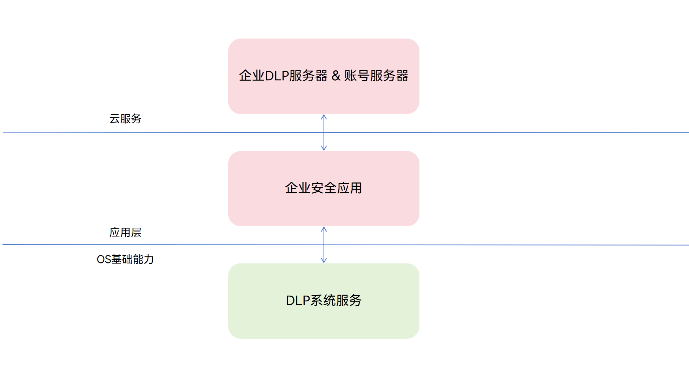

# 数据防泄露（DLP）简介
<!--Kit: Data Protection Kit-->
<!--Subsystem: Security-->
<!--Owner: @winnieHuYu-->
<!--Designer: @QRF-->
<!--Tester: @nacyli-->
<!--Adviser: @zengyawen-->

## 企业接入DLP文件适配

### 介绍

企业日常办公中大量敏感文档（合同、财务报表、设计稿等）需要在员工设备间流转和使用，面临被截屏泄露、未经授权复制或转发到非受控环境等数据泄露风险。

传统的企业数据保护方案需要开发者自行定义加密文件格式、实现权限管控逻辑和构建运行时隔离环境，开发成本高且难以与系统底层安全机制有效协同。

系统级的数据防泄露（Data Loss Prevention，DLP）是一种面向企业文档保护场景，提供文件加密、访问授权、权限管控和运行时防护的原生能力。基于系统统一的文件格式、授权机制和受控运行环境，企业安全应用开发者可在此基础上构建安全、可控的企业数据保护方案。

DLP的核心能力包括文件加密保护和文件权限管控。系统定义了统一的DLP文件格式，文件后缀为“原始文件名（包含原始文件后缀）.dlp”，例如 “test.docx.dlp”。DLP文件由文件通用信息、授权策略和原始文件密文组成，其中授权策略用于描述文件访问控制信息，原始文件密文则用于保护明文内容的机密性。基于统一定义的DLP文件格式，系统能够对DLP文件进行统一识别和处理，并在文件访问过程中结合授权信息完成鉴权和解密。企业安全应用无需自行定义受保护文件格式和相关处理逻辑，即可基于系统能力接入文件加密、权限管控等功能。

在企业场景下，DLP文件通常由企业安全应用基于相关接口完成加密生成。企业可在加密时为文件配置访问权限，当前支持设置只读和编辑两种类型，不同权限对应不同的文件访问和使用范围。DLP文件打开后，系统还会对DLP沙箱应用的运行环境施加限制，例如对蓝牙、网络、NFC等能力进行限制，以降低文件使用过程中的数据泄露风险。

面向企业安全应用，DLP提供接入能力，支持对原始文件进行加密生成DLP文件、恢复DLP文件中的原始文件、获取文件策略，以及向DLP服务注册企业安全应用插件。在企业场景下，企业安全应用客户端可通过该插件与DLP服务进行交互，并进一步与企业服务器通信，以获取加密公钥、重封装的策略密文等信息，用于支撑DLP文件生成、解密等流程。企业安全应用可基于这些能力，构建面向企业场景的数据保护、权限控制和策略管理能力。

企业接入DLP文件的层次结构如下图所示。企业安全应用基于系统DLP能力与云服务，实现文件加密和权限管控等数据保护能力。

### 基本概念

在接入企业场景下的DLP能力前，开发者需要先了解DLP文件、权限类型、DLP沙箱和企业安全应用通信插件等基本概念。

- **DLP文件**

    DLP文件是采用系统定义的受保护文件格式生成的文件，文件后缀为“原始文件名（包含原始文件后缀）.dlp”，例如test.docx.dlp。DLP文件由文件通用信息、授权策略和原始文件密文组成。其中，授权策略用于描述文件访问控制信息，主要包含可访问文件的用户范围及对应的权限类型，并通过保护机制确保相关信息的机密性和完整性。

- **权限类型**

    企业安全应用可在生成DLP文件时，为用户配置授权类型。当前支持只读和编辑两种类型，不同权限类型对应不同的用户操作管控范围。

    | 授权类型 | 修改 | 复制 | 打印 | 截屏/录屏 | 拖拽 |
    | -------- | -------- | -------- | -------- | -------- | -------- |
    | 只读 | 禁止 | 禁止 | 禁止 | 禁止 | 禁止 |
    | 编辑 | 允许 | 允许 | 允许 | 允许 | 允许 |

    当前版本中，不同权限类型对应的用户操作管控范围如上表所示，后续版本可能根据产品能力演进进行调整。

- **DLP沙箱**

    打开DLP文件时，系统会为目标应用安装并启动对应的沙箱应用。沙箱应用本质上是面向DLP文件访问场景创建的受控应用实例。系统会对该应用实例对应的运行身份施加能力限制，例如限制蓝牙、网络和NFC等能力，以降低文件使用过程中的数据泄露风险。

    | 权限名 | 说明 | 授权类型：只读 | 授权类型：编辑 |
    | -------- | -------- | -------- | -------- |
    | ohos.permission.USE_BLUETOOTH | 允许应用使用蓝牙。 | 禁止 | 禁止 |
    | ohos.permission.INTERNET |允许应用访问网络。 |  禁止 | 禁止 |
    | ohos.permission.DISTRIBUTED_DATASYNC | 允许应用与远程设备交换用户数据（如图片、音乐、视频、应用数据等）。 | 禁止 | 禁止 |
    | ohos.permission.WRITE_MEDIA | 应用读写用户媒体文件，如视频、音频、图片等，需要申请此权限。 | 禁止 | 允许 |
    | ohos.permission.NFC_TAG | 允许应用使用NFC。 | 禁止 | 允许 |

- **企业安全应用通信插件**
    
    企业安全应用通信插件是由企业安全应用客户端实现并注册到DLP服务中的插件，是企业场景下使能DLP服务的必要组件。企业安全应用完成插件注册后，DLP服务才能与企业安全应用客户端建立交互通道。在DLP文件生成、解密等流程中，DLP服务可通过该插件与企业安全应用客户端进行交互；企业安全应用客户端还可进一步与企业服务器通信，获取加密公钥等相关信息。

### 约束与限制

- 当前企业安全应用接入DLP的各项功能仅支持在PC/2in1设备上使用。
- 企业场景下，企业安全应用需先完成企业安全应用插件注册，才能使能相关DLP能力（具体可参考[企业接入DLP文件适配](./enterprise-dlp-file-integration.md)）。
- 企业场景下接入DLP能力时，需配套部署企业DLP服务器，用于支撑加密公钥获取、解密相关处理等流程。

## 应用适配打开DLP文件介绍

### 介绍
数据防泄露服务（Data Loss Prevention，简称为DLP），是系统级的数据防泄露解决方案，提供文件权限管理、加密存储、授权访问等能力，数据所有者可以基于账号认证对机密文件进行权限配置，允许设置只读、编辑、拥有者等权限，随后机密文件会通过密文存储，在支持DLP机制的设备上可以通过端云协调进行认证授权，获取对数据的访问和修改的能力。

应用适配建议：根据权限状态调整UI（如只读文件隐藏保存按钮）；避免主动触发被限制的功能；对用户进行友好提示。

### 文件格式
- 命名规则：原始文件名.扩展名.dlp（如 test.docx.dlp）
- 文件组成：文件通用信息 + 授权策略 + 原始文件密文

### 基本概念

- **沙箱机制**

    访问DLP文件时，系统会：
    - 创建应用的独立沙箱分身。
    - 解密文件供应用访问。
    - 限制外部访问权限（网络/剪贴板/截屏/蓝牙等）。
    - 关闭后自动清理分身和临时数据。

- **沙箱限制**

    当应用进入DLP沙箱状态时，可以申请的权限将受到限制，根据DLP文件授权类型不同，限制也不相同，如下表：

    | 权限名 | 说明 | 授权类型：只读 | 授权类型：编辑/文件拥有者 |
    | -------- | -------- | -------- | -------- |
    | ohos.permission.USE_BLUETOOTH | 允许应用使用蓝牙。 | 禁止 | 禁止 |
    | ohos.permission.INTERNET |允许应用访问网络。 |  禁止 | 禁止 |
    | ohos.permission.DISTRIBUTED_DATASYNC | 允许应用与远程设备交换用户数据（如图片、音乐、视频、应用数据等）。 | 禁止 | 禁止 |
    | ohos.permission.WRITE_MEDIA | 应用读写用户媒体文件，如视频、音频、图片等，需要申请此权限。 | 禁止 | 允许 |
    | ohos.permission.NFC_TAG | 允许应用使用NFC。 | 禁止 | 允许 |