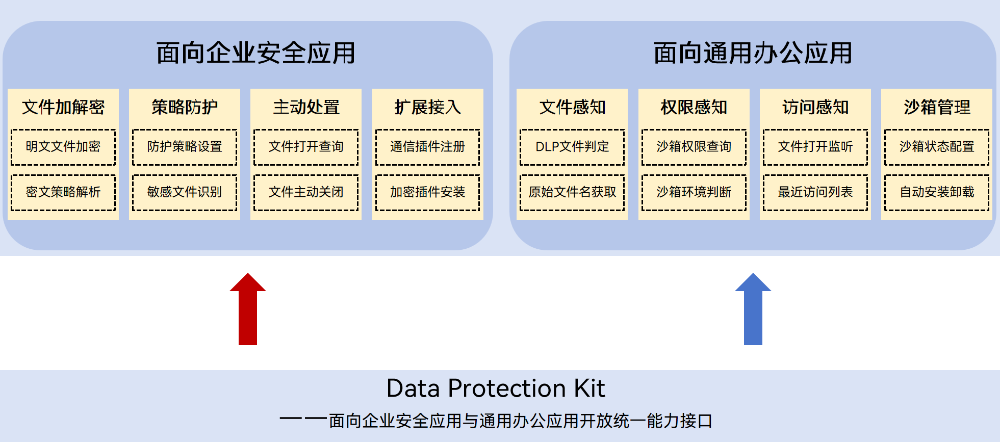

# Data Protection Kit简介
<!--Kit: Data Protection Kit-->
<!--Subsystem: Security-->
<!--Owner: @winnieHuYu-->
<!--Designer: @QRF-->
<!--Tester: @nacyli-->
<!--Adviser: @zengyawen-->

Data Protection Kit旨在为企业数据安全场景提供系统级的数据保护底座。该Kit支持开发者围绕文件全生命周期，构建涵盖敏感内容识别、文件数据加密、权限访问控制、沙箱动态回收、用户操作记录的端到端解决方案。通过深度协同系统底层的权限管控与文件加密机制，开发者无需从零构建复杂的安全体系，即可实现企业数据在终端的透明保护与合规治理，有效防范数据泄露风险，满足企业复杂多变的安全管控诉求。

## 能力范围

**面向企业安全应用：快速构建数据管控与防泄露解决方案**

适用于MDM应用、企业安全网盘或内部安全管控类应用。开发者可基于该Kit实现从“敏感数据发现”、“文件加密管控”到“文件操作记录”的全流程管理。

**亮点特征：**

- 敏感内容识别：根据开发者设置的扫描策略，对指定文件中的敏感内容进行识别，并返回匹配结果。开发者可基于该能力判断文件中是否包含敏感信息，为后续的加密或拦截提供触发依据。

- 加密文件生成与策略管控：根据开发者设置的授权用户列表与权限管控策略，将原始文件生成加密文件（DLP文件），并在用户打开文件时，判断是否允许其打开，以及拥有何种权限，如截屏、复制、打印等。开发者无需自行定义和维护加密文件格式，只需使用系统级的数据保护机制（DLP体系）对敏感文件进行系统级加密，并且支持与企业侧服务器协同实现文件权限的动态授予。

- 文件沙箱动态回收：企业安全应用可根据生成文件时设置的文件（沙箱）等级，回收指定的沙箱应用，从而关闭相同等级的全部文件。开发者可在监测到设备处于风险状态时，主动关闭高敏感文件，防止员工在风险环境下泄露公司机密数据。

- 用户操作与文件流转记录上报：用户访问文件，或进行文件内容的复制、修改操作时，系统会主动生成事件记录并通过特殊的事件id发布信息。开发者可主动订阅该事件id，从而获取到涉及加密文件的相关操作信息。另外，系统会在用户创建、复制保存、下载加密文件时，发布文件创建信息与文件流转信息，辅助开发者还原文件流转路径。

**面向通用办公应用：适配加密文件受控访问**

适用于文档编辑器、文件管理器或系统预览等普通应用。开发者可基于该Kit配合系统安全机制，完成加密文件的受控访问体验适配。

**亮点特征：**

- 加密文件感知与受控打开：应用可判断指定文件是否为系统级加密文件，监听加密文件打开事件，并获取当前应用对该文件的访问权限（如只读、可编辑等），以支持应用在授权范围内正常解析和展示文件内容，完成必要的 UI 适配。

- 沙箱状态查询与协同：应用可查询当前应用沙箱的运行状态，配合系统进行沙箱环境的保留与配置管理。

- 基础信息查询与格式适配：应用可获取加密文件关联的原始文件名信息，以便知道该文件原本的真实格式（比如原本是 Word 还是 PDF），从而正确地打开和展示文件。同时支持查询系统支持的受保护文件扩展名类型及系统相关能力状态，用于应用在处理文件前做基础判断。

## 基本概念

**DLP 文件：** 采用系统定义的受保护文件格式生成的文件，文件后缀为“原始文件名（包含原始文件后缀）.dlp”，例如test.docx.dlp。DLP文件由文件通用信息、授权策略和原始文件密文组成。

**DLP 沙箱：** 系统面向DLP文件访问场景提供的受控机制。打开DLP文件时，系统会为目标应用安装并启动对应的沙箱应用，并对该应用实例对应的运行身份施加能力限制，以降低文件使用过程中的数据泄露风险。

**敏感文件识别：** 根据开发者设置的扫描策略，对指定文件中的敏感内容进行检测并返回匹配结果的能力。

## 架构说明

DLP架构分为面向企业安全应用和面向通用办公应用，如下图所示。

<!--RP1--><!--RP1End-->