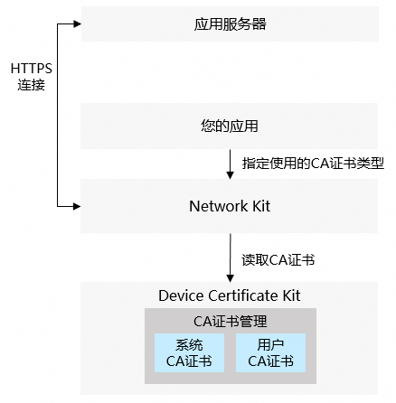
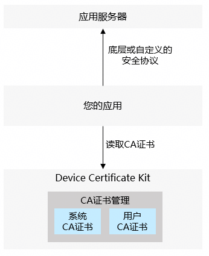

# CA证书开发指导

<!--Kit: Device Certificate Kit-->
<!--Subsystem: Security-->
<!--Owner: @chaceli-->
<!--Designer: @chande-->
<!--Tester: @zhangzhi1995-->
<!--Adviser: @zengyawen-->

在对其他实体（设备、服务器）的证书凭据进行校验时，您的应用需要使用CA证书。例如您的应用使用预置的CA证书对应用服务器的HTTPS证书链进行可信校验。根据通信实现方式的不同，证书信任的配置方案也存在差异，下面分两种典型场景说明：

场景1：通过网络通信服务进行HTTPS连接。

您的应用可以参考[Network Kit配置证书校验](../../network/http-request.md#配置证书校验)内容，利用Device Certificate Kit的系统CA证书、用户CA证书，对HTTPS证书链进行校验。



场景2：采用底层或自定义的安全协议进行通信。

如果您的应用需要采用底层或自定义的安全协议与应用服务器进行通信，则您的应用可能需要从Device Certificate Kit读取系统CA证书和用户CA证书对服务器的证书链进行校验。



Device Certificate Kit的CA证书管理功能包含如下能力：
- 系统CA证书管理：由操作系统预安装的CA证书，包括国密算法（SM算法）和国际算法（RSA和ECC算法）的CA证书。<!--RP1--><!--RP1End-->

  系统CA证书包含了业界常用的商业CA证书，可以覆盖绝大部分互联网应用和网站的证书链校验需求。

  设备的用户和应用只能读取系统CA证书，不能进行安装和更新。

- 用户CA证书管理：归属于设备用户的CA证书，由用户或MDM应用进行管理。仅当签发应用服务器证书的CA证书未包含在系统CA证书内，才需要安装用户CA证书，例如企业内部服务器使用的证书由企业自建CA证书颁发。

  用户CA证书划分为两个作用范围（Scope）：

  1. 当前用户级的CA证书：设备的用户间隔离，只有设备的当前登录用户才能访问和管理。设备用户可以通过系统设置应用进行管理，应用也可以通过API拉起证书管理服务的对话框（仅限PC/2in1设备支持），引导用户安装或卸载当前用户的CA证书。

  2. 所有用户级的CA证书：设备的所有用户都可以读取，当前只能通过MDM应用在企业设备上进行安装和管理。

  | 用户CA证书的作用范围（Scope）| 作用范围说明 | 证书管理方式 | 设备用户可执行的操作| 应用可执行的操作 | 典型应用场景|
  |-----|-------------------|-------|-------------------------------|----|---|
  | 当前用户  |    用户间隔离   |   由用户管理    |安装/卸载/查看| 读取，拉起安装/卸载对话框 | 在BYOD设备访问企业内部的服务器。 |
  | 所有用户  |    所有用户共享   |  由MDM应用管理 |查看| 读取 |在企业设备访问企业内部的服务器。 |

> **说明：**
>
> 本开发指导需使用API版本18及以上版本SDK。
>
> 使用并信任当前用户级的CA证书，设备的用户可以通过网络代理工具对您应用的通信消息进行中间人攻击，这可能导致您的应用产生安全风险。<!--RP2--><!--RP2End-->

## 基本概念

- 商业CA证书：由正规的第三方商业数字证书认证机构（CA）颁发和运营的商用CA证书，具备公开权威公信力。
- 自建CA证书：企业/组织自行搭建部署的私有数字证书颁发机构（CA）颁发的CA证书，一般用于企业/组织内网服务、测试环境等。
- MDM（Mobile Device Management）应用：也称企业设备管理应用，指集成了MDM功能的应用，能够集中管理、监控和保护企业内的移动设备（如智能手机、平板电脑、笔记本电脑等）。它允许IT管理员远程配置设备、强制执行安全策略、部署应用程序，并确保企业数据的安全。具体请参考[MDM Kit](../../mdm/mdm-kit-intro.md)相关资料。
- 企业设备：由企业MDM应用管理和控制的设备，该设备一般由企业进行采购并发放给企业员工进行日常办公。
- BYOD（Bring Your Own Device）：自带设备办公，指一些企业允许员工携带自己平板或智能手机到公司，并使用这些设备接入办公环境。例如用户企业办公或者外来访客携带设备访问工厂、实验室等场景。

## 开发步骤

1. 权限申请和声明。

   MDM应用调用安装和卸载CA证书接口需要申请权限：ohos.permission.ACCESS_ENTERPRISE_USER_TRUSTED_CERT

   调用其他接口需要申请权限：ohos.permission.ACCESS_CERT_MANAGER

   声明权限请参考：[声明权限](../AccessToken/declare-permissions.md)

2. 导入相关模块。

   ```ts
   import { certificateManager, certificateManagerDialog } from '@kit.DeviceCertificateKit';
   import { util } from '@kit.ArkTS';
   import { common } from '@kit.AbilityKit';
   import { UIContext } from '@kit.ArkUI';
   ```

3. 安装和卸载用户CA证书。

   - 场景1：在BYOD设备安装用户CA证书。
  
     应用调用openInstallCertificateDialog接口可拉起安装用户CA证书的对话框（certType参数设置为CA_CERT），安装页面需要对设备用户的身份进行认证。该接口只支持安装当前用户级的CA证书。
  
     > **说明：**
     >
     > 安装并信任用户CA证书，拥有CA证书的攻击者可能会获取到设备用户在访问网站或使用应用时传输的敏感信息。
     >
     > 拉起安装用户CA证书的对话框接口当前仅支持PC/2in1设备。

   - 场景2：MDM应用在企业设备安装和卸载用户CA证书。

     MDM应用可调用installUserTrustedCertificateSync接口安装用户CA证书，接口需要指定待安装的CA证书文件，并返回已安装的CA证书标识（certUri）。

     MDM应用可调用uninstallUserTrustedCertificateSync接口卸载已安装的用户CA证书，输入已安装的CA证书标识certUri。

4. 读取系统CA证书和用户CA证书。

   证书管理服务提供了共享目录供应用读取系统CA证书和用户CA证书文件，您的应用可以先通过getCertificateStorePath接口获取对应CA证书的存储目录，然后从目录中读取CA证书文件（为pem格式的证书文件）。

   系统CA证书按照国际和国密算法类型分别存储在两个目录，可以通过getCertificateStorePath接口的property.certAlg参数获取指定算法的证书存储目录。

   用户CA证书按照当前用户级和所有用户级分别存储在不同的目录，可以通过getCertificateStorePath接口的property.certScope参数获取指定级别的证书存储目录。

## 样例代码

<!-- @[certificate_management_user_ca](https://gitcode.com/openharmony/applications_app_samples/blob/master/code/DocsSample/Security/DeviceCertificateKit/CertificateManagement/entry/src/main/ets/samples/CertManagerUserCASample.ets) -->
