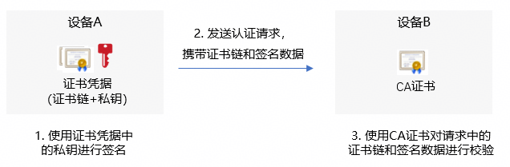
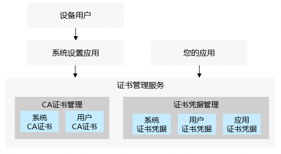

# 证书管理服务概述

<!--Kit: Device Certificate Kit-->
<!--Subsystem: Security-->
<!--Owner: @chaceli-->
<!--Designer: @chande-->
<!--Tester: @zhangzhi1995-->
<!--Adviser: @zengyawen-->

设备用户有一些需要安全存储的证书凭据，用于其他实体（设备、服务器、个人）对用户的身份进行认证和校验，例如企业内部网站为企业员工颁发证书凭据，用于企业员工登录内部网站时的身份认证。

证书管理服务API为用户和您的应用提供了证书凭据的管理能力，该能力可以把证书凭据中的私密数据（证书的私钥）进行加密并安全存储。

证书管理服务不仅限于存储证书凭据，还可以存储CA证书，用于对其他实体（设备、服务器、个人）的证书凭据进行校验。例如您的应用使用预置的CA证书对应用服务器的HTTPS证书链进行可信校验。

## 功能架构

证书管理服务提供了如下类型证书的管理功能：
- CA证书：
  1. 系统CA证书：由操作系统预安装的CA证书。<!--RPx--><!--RPxEnd-->
  2. 用户CA证书：归属于设备用户的CA证书，一般由设备的用户进行安装和管理。应用可以通过API拉起证书管理服务的对话框，引导用户安装或卸载用户CA证书。
- 证书凭据：
  1. 系统证书凭据：用于系统服务（如WLAN、VPN服务）连接服务器时，服务器对接入设备进行身份认证。一般由设备的用户进行安装和管理，应用可以通过API拉起证书管理服务的对话框，引导用户安装系统证书凭据。
  2. 用户证书凭据：归属于设备用户的证书凭据，由设备的用户进行安装和管理。应用可以通过API拉起证书管理服务的对话框，引导用户安装用户证书凭据。应用在使用用户证书凭据前，需要调用证书管理服务API获取用户的授权。
  3. 应用证书凭据：归属于应用的证书凭据，由应用通过证书管理服务API进行安装和管理。设备的用户不能查看和管理应用证书凭据。

> **说明：**
> 
> 设备用户可进入系统设置应用的“证书与凭据”页面，查看和管理CA证书和证书凭据。

|证书类型   | 证书归属 | 证书管理方式 | 设备用户可执行的操作| 应用可执行的操作 | 典型应用场景 |
|-----|-------------------|-------------------------------|--------|----|----------------|
| 系统CA证书  |    操作系统   |  由操作系统预置  |查看           | 读取 | 校验公开网站服务器的证书链。 |
| 用户CA证书  |    设备用户   |  由用户管理      |安装/卸载/查看 | 读取，拉起安装/卸载对话框 | 校验企业内部服务器的证书链。 |
| 系统证书凭据  |   操作系统   | 由用户管理       |安装/卸载/查看| 拉起安装对话框 | 设备连接企业内部WIFI/VPN服务时进行接入认证。 |
| 用户证书凭据  |   设备用户   |  由用户管理      |安装/卸载/取消授权/查看| 拉起安装/授权对话框 读取和签名 | 通过双向HTTPS登录企业内部服务器。 |
| 应用证书凭据  |   应用   |  由应用管理  | NA   | 读取/安装/卸载/签名 |应用服务器认证应用身份。 |

## 约束与限制

证书管理服务目前仅支持RSA、ECC及SM2算法类型的证书。

## 开发总览

证书管理服务为开发者提供了以下相关功能的开发指导，请开发者参照开发。

- [CA证书开发指导](certManager-ca-certs-guidelines.md)
- [应用证书凭据开发指导](certManager-private-credential-guidelines.md)
- [用户证书凭据开发指导](certManager-user-credential-guidelines.md)
- [系统证书凭据开发指导](certManager-system-credential-guidelines.md)