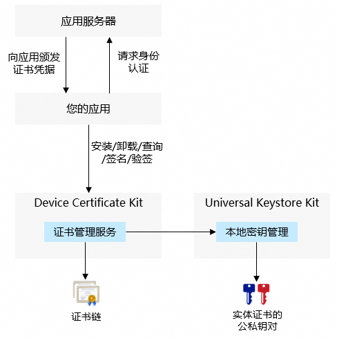

# 应用证书凭据开发指导

<!--Kit: Device Certificate Kit-->
<!--Subsystem: Security-->
<!--Owner: @chaceli-->
<!--Designer: @chande-->
<!--Tester: @zhangzhi1995-->
<!--Adviser: @zengyawen-->

如果您的应用服务器需要为您的应用颁发证书凭据，并在您的应用访问服务器接口时通过证书凭据进行身份认证，则您的应用可以使用本功能进行应用证书凭据的安装和使用。

应用证书凭据功能为应用提供了应用级别的证书凭据（包含证书链和私钥）的安全存储和管理能力，且支持应用间的访问隔离。

您的应用可以读取已安装应用证书凭据的证书链，及使用对应私钥进行签名，但不能读取私钥数据（保护私钥数据的安全）。应用证书凭据的公私钥对存储在[Universal Keystore Kit](../UniversalKeystoreKit/huks-overview.md)。



> **说明**
>
> 如需在不同应用间共享访问同一个证书凭据，请使用“[用户证书凭据](./certManager-user-credential-guidelines.md)”功能。


## 约束与限制
   - 应用证书凭据的安装和签名、验签操作，依赖[密钥管理服务](../UniversalKeystoreKit/huks-overview.md)（HUKS）能力。


## 开发步骤

1. 权限申请和声明。

   需要申请的权限：ohos.permission.ACCESS_CERT_MANAGER

   申请流程请参考：[申请应用权限](../AccessToken/determine-application-mode.md)

   声明权限请参考：[声明权限](../AccessToken/declare-permissions.md)

2. 导入相关模块。

   ```ts
   import { certificateManager } from '@kit.DeviceCertificateKit';
   import { BusinessError } from '@kit.BasicServicesKit';
   import { util } from '@kit.ArkTS';
   ```
   
3. 安装应用证书凭据。

   您的应用在接收到应用服务器颁发的证书凭据后，通常打包为密钥库文件（KeyStore文件），可调用installPrivateCertificate接口把证书凭据安装到证书管理服务，安装接口返回KeyUri用于后续的证书凭据查询和签名操作。

   installPrivateCertificate接口还需要输入证书凭据别名，用于区分不同的应用证书凭据。如果应用使用相同的别名再次安装应用证书凭据，证书管理服务将覆盖并更新已安装的应用证书凭据数据。
  
  > **说明**
  >
  > 本开发指导需使用API version 11及以上版本SDK。
  >
  > 应用证书凭据功能当前仅支持RSA、ECC及SM2算法类型的证书和私钥。
  >
  > installPrivateCertificate接口当前只支持P12格式的密钥库文件。

4. 使用应用证书凭据。

    在您的应用需要使用应用证书凭据进行应用的身份认证时，您可以通过如下步骤提供认证相关的数据：

  - 读取应用证书凭据的证书链。

    调用getPrivateCertificate接口，传入安装接口返回的KeyUri，从响应中的CMResult.credential.credentialData字段获取证书链（为pem格式的证书文件）。

  - 使用应用证书凭据的私钥对数据进行签名。
  
    1. 调用init接口初始化签名会话，传入安装接口返回的KeyUri和签名算法参数（如：填充方式和摘要算法），并返回签名会话的句柄handle。
    
    2. 调用update接口传入签名会话的句柄handle和待签名的数据。如果待签名的数据量比较大，可以调用多次update接口，每次传入部分数据。

    3. 调用finish接口结束签名会话并获取签名数据。

  > **说明**
  >
  > 签名、验签操作支持的参数组合，详见HUKS声明的[签名/验签介绍及算法规格](../UniversalKeystoreKit/huks-signing-signature-verification-overview.md)中RSA、ECC及SM2的描述。

5. 卸载已安装的应用证书凭据。
   
   当您的应用不再需要使用应用证书凭据时，可调用uninstallPrivateCertificate接口卸载已安装的应用证书凭据。例如您的应用证书凭据与登录用户绑定，在用户退出登录时卸载对应用户的应用证书凭据。

## 样例代码

<!-- @[certificate_management_development_guidance](https://gitcode.com/openharmony/applications_app_samples/blob/master/code/DocsSample/Security/DeviceCertificateKit/CertificateManagement/entry/src/main/ets/samples/CertManagerPrivateCredSample.ets) -->