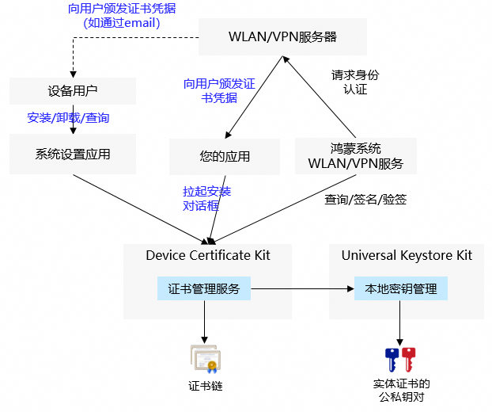

# 系统证书凭据开发指导

<!--Kit: Device Certificate Kit-->
<!--Subsystem: Security-->
<!--Owner: @chaceli-->
<!--Designer: @chande-->
<!--Tester: @zhangzhi1995-->
<!--Adviser: @zengyawen-->

系统证书凭据用于鸿蒙系统服务（如WLAN、VPN服务）连接服务器时，服务器对接入设备进行身份认证。系统证书凭据功能提供了系统级别的证书凭据（包含证书链和私钥）的安全存储和签名能力。系统证书凭据的公私钥对存储在[Universal Keystore Kit](../UniversalKeystoreKit/huks-overview.md)。



系统证书凭据可以由设备的用户进行安装和管理，也可以由鸿蒙应用通过API拉起证书管理服务的对话框，引导用户完成安装。

> **说明**
>
> 系统证书凭据只能由鸿蒙系统服务进行读取和使用。<br>
> 系统证书凭据安装成功后，用户需要到系统设置应用界面进行对应的配置，WLAN、VPN等系统服务才能使用安装的系统证书凭据。


## 约束与限制
   - 系统证书凭据的安装和签名、验签操作，依赖[密钥管理服务](../UniversalKeystoreKit/huks-overview.md)（HUKS）能力。

## 开发步骤


1. 权限申请和声明。

   需要申请的权限：ohos.permission.ACCESS_CERT_MANAGER

   申请流程请参考：[申请应用权限](../AccessToken/determine-application-mode.md)

   声明权限请参考：[声明权限](../AccessToken/declare-permissions.md)

2. 导入相关模块。

   ```ts
   import { certificateManagerDialog } from '@kit.DeviceCertificateKit';
   import { BusinessError } from '@kit.BasicServicesKit';
   import { common } from '@kit.AbilityKit';
   import { UIContext } from '@kit.ArkUI';
   ```

3. 安装系统证书凭据

   调用openInstallCertificateDialog接口可拉起系统证书凭据安装的对话框（certType参数设置为CREDENTIAL_SYSTEM），安装页面需要用户输入正确的密钥库文件密码。

  > **说明**
  >
  > 系统证书凭据功能当前仅支持RSA、ECC及SM2算法类型的证书和私钥。<br>
  > openInstallCertificateDialog接口当前只支持P12格式的密钥库文件。

## 样例代码

   <!-- @[certificate_management_system_cred_guidance](https://gitcode.com/openharmony/applications_app_samples/blob/master/code/DocsSample/Security/DeviceCertificateKit/CertificateManagement/entry/src/main/ets/samples/CertManagerSystemCredSample.ets) -->