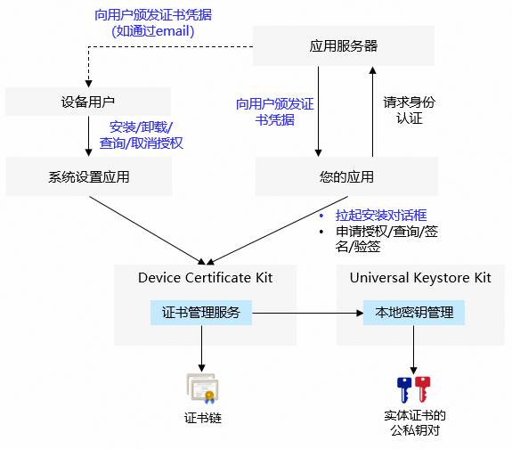

# 用户证书凭据开发指导

<!--Kit: Device Certificate Kit-->
<!--Subsystem: Security-->
<!--Owner: @chaceli-->
<!--Designer: @chande-->
<!--Tester: @zhangzhi1995-->
<!--Adviser: @zengyawen-->

如果您的应用在访问应用服务器时，应用服务器要求使用设备用户的证书凭据对用户进行身份认证，则您的应用可以使用本功能进行用户证书凭据的安装和使用，如您的应用通过双向HTTPS登录企业内部的应用服务器。

用户证书凭据功能提供了用户级别的证书凭据（包含证书链和私钥）的安全存储、授权管理和签名能力。用户证书凭据的公私钥对存储在[Universal Keystore Kit](../UniversalKeystoreKit/huks-overview.md)。



用户证书凭据归属于设备的用户，可以由设备的用户通过系统设置应用进行安装和管理，应用也可以通过API拉起证书管理服务的对话框，引导用户完成安装。

应用在使用用户证书凭据前，需要调用证书管理服务API获取用户的授权。

应用在获得用户授权后，可以读取对应用户证书凭据的证书链，及使用对应私钥进行签名，但不能读取私钥数据（保护私钥数据的安全）。

> **说明：**
>
> 本开发指导需使用API版本23及以上版本SDK。
>
> 用户证书凭据在用户授权后，可以被其他应用访问和使用，如您的应用安装的证书凭据不希望其他应用访问，请使用“[应用证书凭据](./certManager-private-credential-guidelines.md)”功能。

## 约束与限制

用户证书凭据的安装和签名、验签操作，依赖[密钥管理服务](../UniversalKeystoreKit/huks-overview.md)（HUKS）能力。

## 开发步骤

1. 权限申请和声明。

   需要申请的权限：ohos.permission.ACCESS_CERT_MANAGER

   声明权限请参考：[声明权限](../AccessToken/declare-permissions.md)

2. 导入相关模块。

   ```ts
   import { certificateManager } from '@kit.DeviceCertificateKit';
   import { certificateManagerDialog } from '@kit.DeviceCertificateKit';
   import { BusinessError } from '@kit.BasicServicesKit';
   import { common } from '@kit.AbilityKit';
   import { UIContext } from '@kit.ArkUI';
   import { JSON, util } from '@kit.ArkTS';
   ```

3. 安装用户证书凭据。

   调用openInstallCertificateDialog接口可拉起用户证书凭据安装的对话框（certType参数设置为CREDENTIAL_USER），安装页面需要用户输入正确的密钥库文件密码。

   > **说明：**
   >
   > 用户证书凭据功能当前仅支持RSA、ECC及SM2算法类型的证书和私钥。
   >
   > openInstallCertificateDialog接口当前只支持P12格式的密钥库文件。

4. 请求用户授权使用用户证书凭据。

   您的应用在首次使用用户证书凭据前，需要调用openAuthorizeDialog接口获取用户的授权。该接口会拉起用户证书凭据授权对话框，并展示当前用户已安装的用户证书凭据列表，用户选择指定的凭据并确认授权。

   授权成功后，openAuthorizeDialog接口返回已授权的用户证书凭据标识（KeyUri），您的应用可使用该KeyUri使用授权的用户证书凭据。

   > **说明：**
   >
   > 您的应用只需要请求用户进行一次授权，但用户可以在系统设置应用取消授权，因此在使用用户证书凭据前，可以先调用isAuthorizedApp接口判断指定的用户证书凭据授权是否仍然有效。

5. 使用用户证书凭据。

   您的应用在获得用户授权后，可以读取已授权用户证书凭据的证书链，及使用对应私钥进行签名。

- 读取用户证书凭据的证书链。

  调用getPublicCertificate接口，传入openAuthorizeDialog接口返回的KeyUri，从响应中的CMResult.credential.credentialData字段获取证书链（为pem格式的证书文件）。

- 使用用户证书凭据的私钥对数据进行签名。
  
  1. 调用init接口初始化签名会话，传入安装接口返回的KeyUri和签名算法参数（如：填充方式和摘要算法），并返回签名会话的句柄handle。
    
  2. 调用update接口传入签名会话的句柄handle和待签名的数据。如果待签名的数据量比较大，可以调用多次update接口，每次传入部分数据。

  3. 调用finish接口结束签名会话并获取签名数据。

  > **说明：**
  >
  > 签名、验签操作支持的参数组合，详见HUKS声明的[签名/验签介绍及算法规格](../UniversalKeystoreKit/huks-signing-signature-verification-overview.md)中RSA、ECC及SM2的描述。

## 样例代码

<!-- @[certificate_management_user_cred_guidance](https://gitcode.com/openharmony/applications_app_samples/blob/master/code/DocsSample/Security/DeviceCertificateKit/CertificateManagement/entry/src/main/ets/samples/CertManagerUserCredSample.ets) -->
