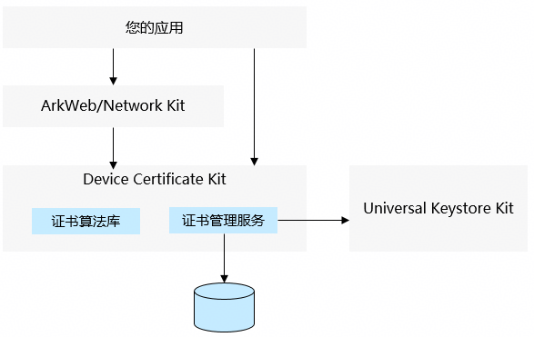

# Device Certificate Kit简介

<!--Kit: Device Certificate Kit-->
<!--Subsystem: Security-->
<!--Owner: @zxz--3-->
<!--Designer: @lanming-->
<!--Tester: @PAFT-->
<!--Adviser: @zengyawen-->

使用Device Certificate Kit（设备证书服务）来对应用的数字证书进行管理和校验。总体而言，Device Certificate Kit支持如下两个特性：
1. [证书算法库](./certificate-framework-overview.md)：数字证书文件的解析和属性读取，证书链的合法性校验。
2. [证书管理服务](./certManager-overview.md)：数字证书与私钥的存储和管理，包括导入、导出、查询、签名等。

数字证书的主要作用及目标场景：
1. 身份可信认证：证明实体身份真实性（个人、设备、服务器、机构），防止冒充、中间人攻击。
2. 数据传输加密：基于证书和非对称密钥体系，协商会话密钥，实现通信链路端到端加密（如HTTPS）。
3. 数据完整性校验：通过数字证书的私钥对数据进行签名，保证数据传输/存储中不被篡改。
4. 权限与访问控制：用数字证书做身份准入，替代账号密码，实现细粒度权限管控。

在应用开发中，使用Device Certificate Kit对数字证书进行处理的典型场景：
1. HTTPS网络连接：对HTTPS服务器的证书链进行校验，尤其是应用自定义证书链的校验处理。
2. 双向HTTPS认证：HTTPS服务器基于证书对请求连接的客户端进行身份认证。

## 整体架构

[ArkWeb](../../web/web-component-overview.md)和[Network Kit](../../network/net-mgmt-overview.md)等网络通信相关的服务基于Device Certificate Kit提供证书链校验、双向HTTPS认证等功能。

证书管理服务在对数字证书凭据的安装和使用时，依赖[Universal Keystore Kit](../UniversalKeystoreKit/huks-overview.md)的密钥存储和管理能力。

> **说明：**
>
> 建议优先使用高级别的API对证书进行处理，例如进行HTTPS网络通信时对服务器的证书链进行合法性校验，优先使用Network Kit的证书链校验和SSL Pinning能力。
>
> 只有当您的应用需要自定义证书链校验逻辑（如校验证书主题、证书扩展字段等）或访问更底层的安全协议功能时，才应直接使用Device Certificate Kit。

## 约束与限制

Device Certificate Kit不具备生成或签发证书及证书吊销列表的能力。生成或签发证书及证书吊销列表的能力由证书颁发机构（CA）来完成，不由单个应用签发。

<!--RP1--><!--RP1End-->
