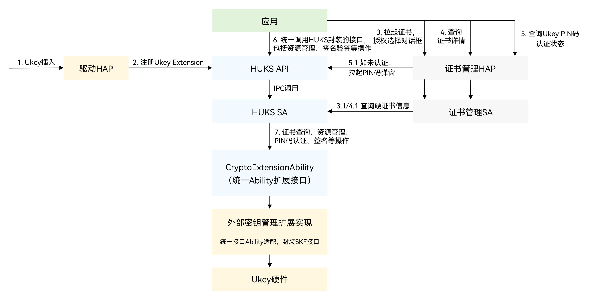

# 外部密钥管理扩展简介

<!--Kit: Universal Keystore Kit-->
<!--Subsystem: Security-->
<!--Owner: @wutiantian-gitee-->
<!--Designer: @HighLowWorld-->
<!--Tester: @wxy1234564846-->
<!--Adviser: @zengyawen-->

HUKS提供统一的Ability扩展接口，驱动HAP可基于此实现外部密钥管理扩展，注册、注销自定义的硬件密钥管理模块，满足金融领域Ukey证书的浏览器双向SSL认证等场景的身份认证需求。

Ukey：USB key，基于USB接口的硬件设备，可用于存储用户私钥、证书及身份认证等信息。

本指南将介绍应用如何基于Ukey证书的浏览器双向SSL认证等场景，完成身份认证的过程。

## 运作机制

应用调用接口进行身份认证的流程可参考下图。

在应用基于Ukey发起身份认证前，三方驱动HAP需完成：

- 根据业务场景设计并开发应用自身的外部密钥管理扩展能力。

  驱动HAP需继承HUKS提供的CryptoExtensionAbility，并完成能力接口实现。具体参考[CryptoExtensionAbility扩展能力](huks-extension-ability-support-overview.md)。

  CryptoExtensionAbility是Stage模型中扩展组件[ExtensionAbility](../../application-models/extensionability-overview.md)的派生类。开发者可以通过继承CryptoExtensionAbility并实现自定义接口，达成定制外部硬件密钥管理的行为，包括：调用外部硬件密钥管理的资源打开与关闭接口、外部硬件密钥管理的PIN认证实现、调用外部硬件密钥管理的通用接口等，可以参考[CryptoExtensionAbility适配开发指导](huks-extension-ability-support-dev.md)。
  
- 将密钥管理扩展能力注册到系统HUKS服务中。
  
  CryptoExtensionAbility可以隔离不同的Ukey驱动厂商实现的差异。驱动HAP实现的能力将通过HUKS和[证书管理](../DeviceCertificateKit/certManager-overview.md)的SDK开放给应用使用。

如此，浏览器等应用才能通过HUKS和[证书管理](../DeviceCertificateKit/certManager-overview.md)提供的API去使用驱动HAP提供的外部密钥管理能力，包括证书查询、PIN码认证、签名验签等操作。

- 标注1：Ukey设备插入。

- 标注2：驱动HAP通过Provider管理接口，注册外部密钥管理扩展能力（Ukey Extension）。

  通过Provider管理能力，驱动HAP可注册、注销外部密钥管理扩展能力。具体参考[Provider管理](huks-provider-management-overview.md)。

- 标注3：应用拉起证书授权选择弹框，弹框中展示证书列表，由用户进行选择。

- 标注4：用户选择具体证书后，应用将获取到证书索引标识KeyUri（即资源ID resourceId），用于打开资源、查询PIN码认证状态。

  HUKS提供PIN码认证能力和认证状态查询能力。应用PIN码认证之前，可以先查询认证状态。具体参考[Ukey PIN码认证](huks-ukey-pin-authentication-management-overview.md)。

  4.1：如果资源已认证，即PIN码已认证，应用将调用HUKS统一接口，执行资源管理、签名验签等操作。如：

  - 打开与关闭句柄资源：[资源管理](huks-resource-management-overview.md)
  - 验证消息内容以及消息发送者身份的真实性：[签名验签](huks-ukey-signing-signature-verification-overview.md)
  
  除此以外，HUKS支持应用查询Ukey的密钥相关属性，具体参考[通用查询](huks-ukey-general-query-overview.md)。

  4.2：如果资源未认证，应用需要调用证书管理能力，拉起PIN码认证弹窗，由用户输入PIN码完成认证。完成认证后，进入4.1的流程，调用HUKS统一接口，执行对应操作。
