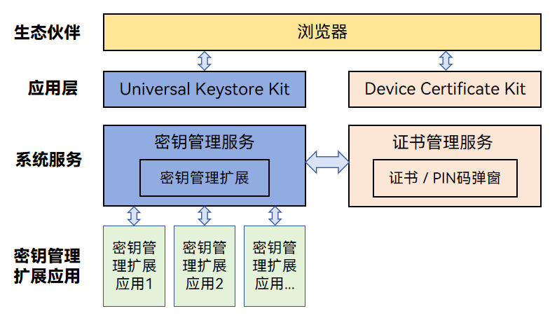

# 密钥管理扩展介绍

<!--Kit: Universal Keystore Kit-->
<!--Subsystem: Security-->
<!--Owner: @wutiantian-gitee-->
<!--Designer: @HighLowWorld-->
<!--Tester: @wxy1234564846-->
<!--Adviser: @zengyawen-->

应用在数字签名、证书认证等场景中需要使用外部密钥管理设备（如UKey）。不同厂商的外部密钥管理设备接口和实现差异较大，应用直接对接需要适配多种协议，开发成本高且难以维护。

HUKS提供统一的Ability扩展接口，让外部密钥管理能力能够接入OpenHarmony系统：通过CryptoExtensionAbility适配底层实现差异，向上层应用提供统一的密钥管理与证书管理API。

本文档面向密钥管理扩展能力的两类开发者：

- **实现方**：负责将外部密钥管理能力接入HUKS框架，通过实现CryptoExtensionAbility回调接口完成能力开放。

- **使用方**：通过调用HUKS提供的huksExternalCrypto和huks模块标准接口，配合调用证书管理模块的标准接口拉起证书选择与PIN码认证等弹窗流程，使用外部密钥管理扩展能力。

HUKS框架保持设备无关，既支持UKey物理设备，也支持软件形态，覆盖[浏览器双向SSL登录](huks-extension-ability-best-dev.md)等典型应用场景。

## 整体框架

密钥管理扩展采用分层架构，自上而下划分为生态伙伴层、应用层、系统服务层与密钥管理扩展应用层，各层之间通过IPC协同。

- 生态伙伴层：以上层应用（如浏览器）为代表，是密钥管理扩展能力的最终使用方。
- 应用层：包含Universal Keystore Kit与Device Certificate Kit，向应用提供统一的密钥管理与证书管理API。使用方通过Kit调用能力，无需感知底层密钥存放在何处、由谁提供。
- 系统服务层：以密钥管理服务与证书管理服务为核心，两者通过IPC协同，共同支撑上层Kit的能力。证书管理服务承载证书选择、PIN码认证等需要UI交互的弹窗能力。
- 密钥管理扩展应用层：由各外部密钥管理能力方实现并运行，是CryptoExtensionAbility实例的宿主。一个密钥管理扩展应用可根据业务需要注册一个或多个CryptoExtensionAbility实例，将厂商自有的外部密钥管理能力接入密钥管理服务。

## 能力开放总览

在应用或系统模块（如证书管理）使用外部密钥管理能力前，能力实现方需完成以下工作：

- 根据业务场景设计并开发应用自身的外部密钥管理能力。

  密钥管理扩展应用需继承HUKS提供的CryptoExtensionAbility，并按需完成能力接口实现。具体参考[CryptoExtensionAbility扩展能力介绍](huks-extension-ability-support-overview.md)。

- 将密钥管理扩展能力注册到系统HUKS服务中。

  CryptoExtensionAbility可以隔离不同外部密钥管理能力实现方的实现差异。密钥管理扩展应用完成接口实现后，需在设备或服务可用时将CryptoExtensionAbility注册到HUKS，**注册成功后能力即对外开放**；在设备拔出、服务停止等不可用场景下，需注销已注册的能力，避免资源残留。注册/注销的具体实现可参考[CryptoExtensionAbility注册与注销](huks-extension-registration-and-unregistration-arkts-ndk.md)。

  能力注册成功后，将通过HUKS和[证书管理](../DeviceCertificateKit/certManager-overview.md)的SDK开放给上层应用与系统模块使用，覆盖证书查询、PIN码认证、签名验签等典型操作。

如此，能力使用方才能通过HUKS和[证书管理](../DeviceCertificateKit/certManager-overview.md)提供的API去使用密钥管理扩展应用提供的外部密钥管理能力，包括证书查询、PIN码认证、签名验签等操作。

## 文档组织

以下文档按照开发流程编排，建议按顺序阅读：

- 对于能力实现方，文档将从能力介绍到接口实现再到注册上线，帮助您逐步完成能力开发全流程。
- 对于能力使用方，文档将从密钥操作到签名验签再到访问控制，帮助您由浅入深掌握各业务场景的调用方式。

请根据您的角色选择对应路径。

### 能力实现方

1. [CryptoExtensionAbility扩展能力介绍](huks-extension-ability-support-overview.md)：理解CryptoExtensionAbility扩展组件的定位、能力开放、能力生命周期及约束限制。

2. [CryptoExtensionAbility适配开发指导](huks-extension-ability-support-dev.md)：参考项目搭建、状态管理与功能接口的实现示例。

3. [CryptoExtensionAbility注册与注销](huks-extension-registration-and-unregistration-arkts-ndk.md)：在设备或服务可用时调用registerProvider将已实现的CryptoExtensionAbility注册到HUKS，以对外开放能力；不可用时调用unregisterProvider注销，避免资源残留。

### 能力使用方

1. [密钥生成与导入导出](huks-extension-key-generation-import-export.md)：密钥生成与导入导出的能力介绍与开发指导。

2. [签名/验签](huks-extension-ability-signing-signature-verification.md)：通过HUKS提供的密钥管理扩展场景下的三段式接口，提供签名验签的能力介绍与开发指导。

3. [PIN码访问控制](huks-extension-ability-pin-authentication-management.md)：密钥管理扩展场景下的PIN码访问控制能力与开发指导。

4. [通用操作](huks-extension-ability-general-operation.md)：介绍打开/关闭资源、查询、属性设置、获取错误信息等通用能力，并提供开发指导。

### 应用场景

[浏览器双向SSL登录](huks-extension-ability-best-dev.md)：以浏览器双向SSL登录为例，端到端串联证书选择、PIN码认证、签名验签的完整流程。
