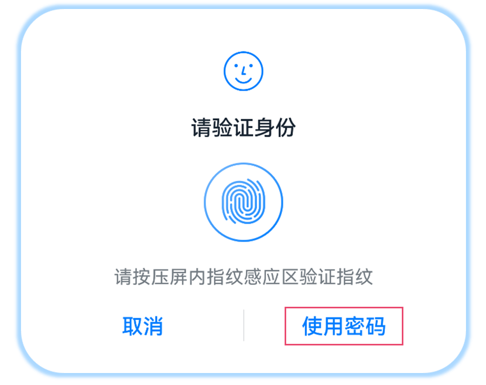

# 切换自定义认证

<!--Kit: User Authentication Kit-->
<!--Subsystem: UserIAM-->
<!--Owner: @WALL_EYE-->
<!--Designer: @lichangting518-->
<!--Tester: @jane_lz-->
<!--Adviser: @zengyawen-->

若开发者定义了自定义认证方式，则用户进行生物认证失败点击导航按钮时，统一用户认证框架会结束系统认证流程并通知调用者拉起自定义认证界面。

例如，在支付场景中，如果厂商自定义了支付密码认证的方式，当调用系统人脸或指纹认证失败后，用户可以选择切换支付密码认证。

支付密码认证不属于系统认证能力，因此业务在发起认证时需要传入导航键的显式信息，例如“使用支付密码”。这样，用户看到的认证界面便会包含一个“使用支付密码”的按钮。

当用户点击该按钮，发起认证的业务应用便会收到统一用户认证框架返回的一个特殊认证结果，提示业务系统认证结束，需要拉起业务自定义的认证界面。这样，用户在点击“使用支付密码”按钮后，便会看到系统认证控件消失，显示出业务自定义的支付密码认证界面。

<!--RP1-->

<!--RP1End-->

如图所示，框选区域为WidgetParam.navigationButtonText字段。开发者可配置此字段，引导用户从生物认证切换到应用自定义的业务密码认证。

> **说明：**
> 锁屏口令认证与业务自定义认证只能二选一，不能同时存在。

| 认证类型 | 支持切换业务自定义认证方式。<br>（√表示支持，x表示不支持。）| 
| -------- | -------- |
| 锁屏口令认证 | × | 
| 人脸认证 | √ | 
| 指纹认证 | √ | 
| 人脸+指纹<sup>18+</sup> | √ | 
| 人脸+锁屏口令认证 | × | 
| 指纹+锁屏口令认证 | × | 
| 人脸+指纹+锁屏口令认证 | × | 

## 开发示例

针对需要切换自定义认证方式的场景，发起认证请求的方式请参考[发起认证](start-authentication.md)，但传入的widgetParam必须包含navigationButtonText字段。

当前示例仅展示如何配置界面和选择切换到自定义认证界面。具体拉起的页面及对应页面的实现，请开发者自行实现，代码插入位置可参考注释提示。

<!-- @[custom_authentication](https://gitcode.com/openharmony/applications_app_samples/blob/master/code/DocsSample/UserAuthentication/entry/src/main/ets/pages/Index.ets) -->

``` TypeScript
  handleCustomAuthResult(userAuthInstance: userAuth.UserAuthInstance, exampleNumber: number) {
	// ···
      userAuthInstance.on('result', {
        onResult: (result: userAuth.UserAuthResult) => {
		// ···
              Logger.info(`userAuthInstance callback result: ${JSON.stringify(result)}`);
			// ···
            if (result.result == userAuth.UserAuthResultCode.CANCELED_FROM_WIDGET ||
              result.result == userAuth.UserAuthResultCode.NOT_ENROLLED) {
              // 请开发者自行完成拉起自定义认证界面的实现
			// ···
            }
			// ···
        }
      });
      // 启动认证
      userAuthInstance.start();
      Logger.info('auth start success');
	// ···
  }

  /*
   * apply-custom-authentication.md
   * 当前示例仅展示如何配置界面、选择切换到自定义认证界面，具体拉起的页面及对应页面的实现，请开发者自行实现
   * */
  applyingCustomAuthentication() {
    try {
      const randData = getRandData();
      if (!randData) {
        return;
      }
      const authParam: userAuth.AuthParam = {
        challenge: randData,
        authType: [userAuth.UserAuthType.FACE],
        authTrustLevel: userAuth.AuthTrustLevel.ATL3,
      };
      // 配置自定义认证，需设置导航键文本
      const widgetParam: userAuth.WidgetParam = {
        title: resourceToString($r('app.string.title')),
        navigationButtonText: resourceToString($r('app.string.navigationButtonText'))
      };
      // 获取认证对象
      const userAuthInstance = userAuth.getUserAuthInstance(authParam, widgetParam);
      Logger.info('get userAuth instance success');
      // 订阅认证结果
      this.handleCustomAuthResult(userAuthInstance, ResultIndex.CUSTOMIZE);
    } catch (error) {
      const err: BusinessError = error as BusinessError;
      Logger.error(`auth catch error, code is ${err?.code}, message is ${err?.message}`);
    }
  }

```


## 示例代码

  - [切换自定义认证](https://gitcode.com/openharmony/applications_app_samples/blob/master/code/DocsSample/UserAuthentication)
  