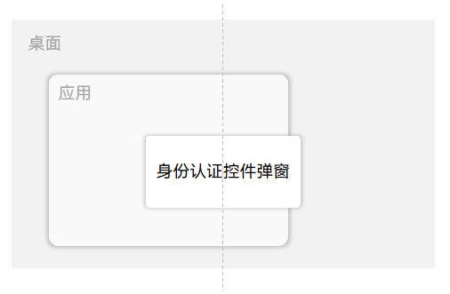
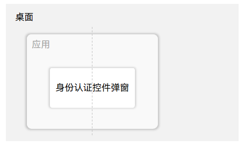

# User Authentication Kit术语

<!--Kit: User Authentication Kit-->
<!--Subsystem: UserIAM-->
<!--Owner: @WALL_EYE-->
<!--Designer: @lichangting518-->
<!--Tester: @jane_lz-->
<!--Adviser: @zengyawen-->

## 模系统弹窗

模系统弹窗是系统级的弹窗，由应用拉起后，将固定居中显示于桌面且位置与源应用无关。在用户完成与模系统弹窗的交互之前，整个系统将被“模住”，即无法进行其他操作。

示意图如下：

## 模应用弹窗

模应用弹窗，仅在应用范围内生效，由应用拉起后，将在应用界面居中显示。模应用弹窗被拉起后，在用户完成与模应用弹窗的交互之前，拉起弹窗的应用界面将被“模住”，无法进行应用内的操作。其余界面不受模应用弹窗影响，可正常操作。

示意图如下：

