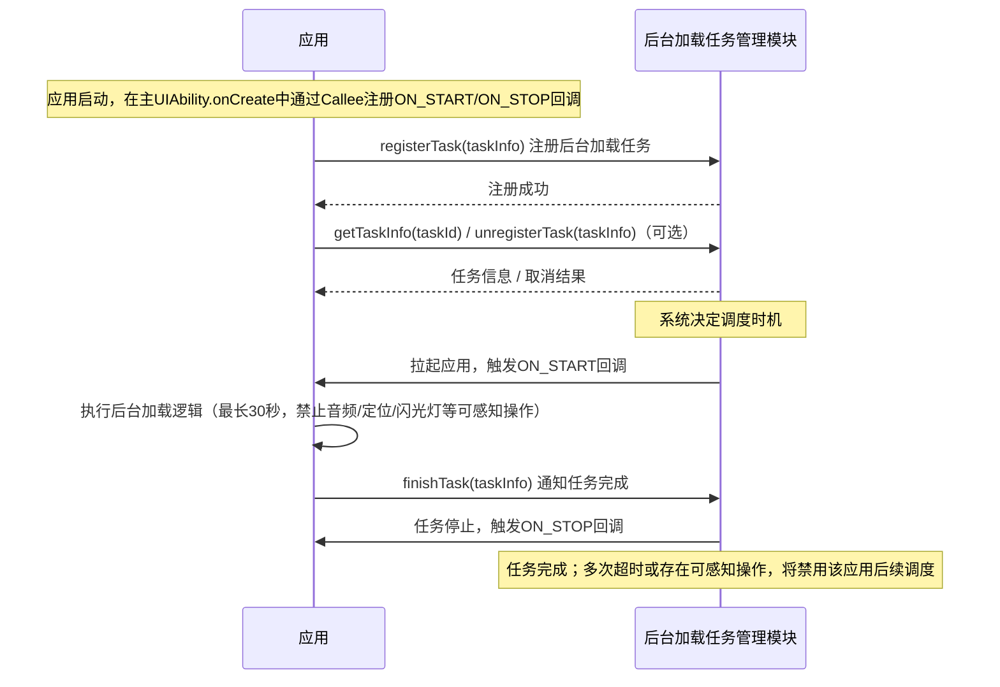

# 后台加载任务(ArkTS)

<!--Kit: Background Tasks Kit-->
<!--Subsystem: ResourceSchedule-->
<!--Owner: @xufu7-->
<!--Designer: @zhouben25-->
<!--Tester: @leetestnady-->
<!--Adviser: @HelloCrease-->

## 概述

从API版本26.1.0开始，系统提供后台加载任务能力，适用于期望通过后台预先加载应用数据以优化应用启动体验的场景（如资讯刷新、消息获取、视频缓存等），不适用于需要定时或条件触发的通用后台任务及长时间后台运行场景。如需定时或条件触发的后台任务，请使用[延迟任务](work-scheduler.md)；如需长时间后台运行，请使用[长时任务](continuous-task.md)。

## 实现原理

1. 需要启用后台加载任务功能的应用，可在前台启动时向系统注册任务。
2. 任务注册后，系统允许应用查询和取消注册任务。



## 约束与限制

**规格限制**

- 数量限制：一个应用只能注册一个后台加载任务，任务中只能指定唯一的主UIAbility。

- 超时：系统回调后台加载任务开始执行后，任务最长运行30秒。如果应用多次超时，系统将禁用该应用的后台加载任务调度，即使重新注册任务也不会再被调度。

- 禁止执行可感知操作：在UIAbility创建阶段和加载任务执行阶段，禁止应用执行音频播放、音频录制、定位、操作闪光灯等可感知行为。如果系统检测到应用存在此类操作，系统将禁用该应用的后台加载任务调度，取消后续的任务调度。


## 开发步骤

后台加载任务的开发步骤分为三步：

1. **实现后台加载任务回调能力：** 定义[ON_START](../reference/apis-backgroundtasks-kit/js-apis-resourceschedule-backgroundLoader.md#常量)和[ON_STOP](../reference/apis-backgroundtasks-kit/js-apis-resourceschedule-backgroundLoader.md#常量)回调函数，并注册到应用主UIAbility的[Callee](../reference/apis-ability-kit/js-apis-app-ability-uiAbility.md#callee)中。

2. **注册、取消注册及查询后台加载任务：** 调用[registerTask](../reference/apis-backgroundtasks-kit/js-apis-resourceschedule-backgroundLoader.md#backgroundloaderregistertask)接口注册任务，可通过[unregisterTask](../reference/apis-backgroundtasks-kit/js-apis-resourceschedule-backgroundLoader.md#backgroundloaderunregistertask)取消注册，通过[getTaskInfo](../reference/apis-backgroundtasks-kit/js-apis-resourceschedule-backgroundLoader.md#backgroundloadergettaskinfo)查询任务信息。

3. **完成后台加载任务：** 在ON_START回调中执行加载逻辑后，调用[finishTask](../reference/apis-backgroundtasks-kit/js-apis-resourceschedule-backgroundLoader.md#backgroundloaderfinishtask)接口通知系统任务完成。

### 实现后台加载任务回调能力

1. 声明ohos.permission.KEEP_BACKGROUND_RUNNING权限，配置方式请参见[声明权限](../security/AccessToken/declare-permissions.md#在配置文件中声明权限)。

2. 导入模块。

   ``` TypeScript
   import { backgroundLoader } from '@kit.BackgroundTasksKit';
   import { BusinessError } from '@kit.BasicServicesKit';
   ```

3. 在应用主UIAbility的[onCreate](../reference/apis-ability-kit/js-apis-app-ability-uiAbility.md#oncreate)生命周期中，通过[Callee](../reference/apis-ability-kit/js-apis-app-ability-uiAbility.md#callee)注册ON_START和ON_STOP回调函数。Callee回调注册随主UIAbility生命周期存在，随其销毁自动释放，无需手动注销。

   <!-- @[backgroundLoader_register_callee](https://gitcode.com/openharmony/applications_app_samples/blob/master/code/DocsSample/BackGroundTasksKit/BackgroundLoader/entry/src/main/ets/entryability/EntryAbility.ets) --> 
   

### 注册后台加载任务

若未声明ohos.permission.KEEP_BACKGROUND_RUNNING权限，调用将抛出201错误；系统服务异常时抛出9700003错误；taskInfo参数不合法时抛出9700004错误。错误码详情请参见[workScheduler错误码](../reference/apis-backgroundtasks-kit/errorcode-workScheduler.md)。

1. 注册后台加载任务。

   <!-- @[backgroundLoader_registerTask](https://gitcode.com/openharmony/applications_app_samples/blob/master/code/DocsSample/BackGroundTasksKit/BackgroundLoader/entry/src/main/ets/entryability/EntryAbility.ets) --> 


2. 取消注册后台加载任务。

   <!-- @[backgroundLoader_unregisterTask](https://gitcode.com/openharmony/applications_app_samples/blob/master/code/DocsSample/BackGroundTasksKit/BackgroundLoader/entry/src/main/ets/entryability/EntryAbility.ets) --> 
   
   ``` TypeScript
   const taskInfo: backgroundLoader.TaskInfo = {
     abilityname: abilityname,
     taskId: taskId
   };
   try {
     backgroundLoader.unregisterTask(taskInfo);
     hilog.info(DOMAIN, 'testTag', 'unregisterTask successes');
     return 'Success';
   } catch (err) {
     const errMsg = JSON.stringify(err);
     hilog.error(DOMAIN, 'testTag', 'unregisterTask failed: %{public}s', errMsg);
     return `Failed: ${(err as BusinessError).message ?? errMsg}`;
   }
   ```


3. 查询后台加载任务信息。

   <!-- @[backgroundLoader_getTaskInfo](https://gitcode.com/openharmony/applications_app_samples/blob/master/code/DocsSample/BackGroundTasksKit/BackgroundLoader/entry/src/main/ets/entryability/EntryAbility.ets) --> 
   
   ``` TypeScript
   try {
     const taskInfoData = backgroundLoader.getTaskInfo(taskId);
     const result = `taskId=${taskInfoData.taskId}, abilityName=${taskInfoData.abilityName}`;
     hilog.info(DOMAIN, 'testTag', 'getTaskInfo result: %{public}s', result);
     return result;
   } catch (err) {
     const errMsg = JSON.stringify(err);
     hilog.error(DOMAIN, 'testTag', 'getTaskInfo failed: %{public}s', errMsg);
     return `Failed: ${(err as BusinessError).message ?? errMsg}`;
   }
   ```


### 完成后台加载任务

1. 完成后台加载任务。

   <!-- @[backgroundLoader_finishTask](https://gitcode.com/openharmony/applications_app_samples/blob/master/code/DocsSample/BackGroundTasksKit/BackgroundLoader/entry/src/main/ets/entryability/EntryAbility.ets) --> 
   
   ``` TypeScript
   const taskInfo: backgroundLoader.TaskInfo = {
     abilityname: abilityname,
     taskId: taskId
   };
   try {
     backgroundLoader.finishTask(taskInfo);
     hilog.info(DOMAIN, 'testTag', 'finishTask successes');
     return 'Success';
   } catch (err) {
     const errMsg = JSON.stringify(err);
     hilog.error(DOMAIN, 'testTag', 'finishTask failed: %{public}s', errMsg);
     return `Failed: ${(err as BusinessError).message ?? errMsg}`;
   }
   ```

### 调测验证

后台加载任务注册成功后，需等待系统决策（依据使用习惯、内存、电量、温度等条件，见实现原理）满足才会执行回调。为快速验证回调功能是否正确，可通过以下[hidumper命令](../dfx/hidumper.md)手动触发回调执行。

执行命令后，系统将拉起应用并触发ON_START回调，可在hilog中过滤testTag查看回调触发与finishTask成功日志，确认回调执行与任务完成通知成功。

> **说明：**
>
> - `-s 1901`：指向ResourceSchedule系统服务发送命令（1901为该服务ID）。
> - `-a`：携带附加参数，需用引号包裹，格式为`backgroundLoader 包名 Ability名`，示例中的`com.example.myapplication`和`EntryAbility`需替换为实际值。

```shell
$ hidumper -s 1901 -a 'backgroundLoader com.example.myapplication EntryAbility'

-------------------------------[ability]-------------------------------


----------------------------------ResourceSched----------------------------------
```