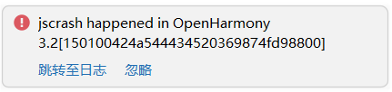
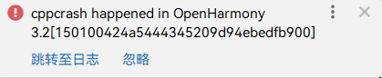

# 命令式节点常见问题
<!--Kit: ArkUI-->
<!--Subsystem: ArkUI-->
<!--Owner: @wangjunman1-->
<!--Designer: @sunbees-->
<!--Tester: @liuli0427-->
<!--Adviser: @Brilliantry_Rui-->

本文档介绍命令式节点的常见问题并提供参考。

## FrameNode节点运行时出现jscrash

**问题现象**

不规范地使用[FrameNode](../reference/apis-arkui/js-apis-arkui-frameNode.md)后出现[JS Crash](../dfx/jscrash-guidelines.md)。

<!--RP1-->

<!--RP1End-->

**解决措施**

根据提示跳转至报错日志，查看具体的报错原因，进行相应的修改，具体的跳转方法请参考下方示例代码。  

**示例代码**

该示例演示了FrameNode抛出[dispose](../reference/apis-arkui/js-apis-arkui-frameNode.md#dispose12)相关异常的场景。运行示例代码后会出现jscrash报错，参考下方的动图，跳转至具体的报错场景，发现报错的原因是调用dispose后不能调用[getMeasuredSize](../reference/apis-arkui/js-apis-arkui-frameNode.md#getmeasuredsize12)，在本示例中，删除dispose相关代码即可正常运行。

```ts
import { NodeController, FrameNode, typeNode } from '@kit.ArkUI';

// 继承NodeController实现自定义UI控制器
class MyNodeController extends NodeController {
  makeNode(uiContext: UIContext): FrameNode | null {
    let node = new FrameNode(uiContext);
    node.dispose(); // 删除本行可以让程序正常运行
    node.getMeasuredSize();
    return node;
  }
}

@Entry
@Component
struct FrameNodeTypeTest {
  private myNodeController: MyNodeController = new MyNodeController();

  build() {
    Row() {
      Text('Hello')
      NodeContainer(this.myNodeController);
    }
  }
}
```


## Native侧创建的ArkUI_NodeHandle执行disposeNode后出现cppcrash

**问题现象**

开发者对[ArkUI_NodeHandle](./../reference/apis-arkui/capi-arkui-nativemodule-arkui-node8h.md)执行[disposeNode](./../reference/apis-arkui/capi-arkui-nativemodule-arkui-nativenodeapi-1.md#disposenode)前，未清理节点相关的资源对象（如回调、捕获引用等），导致节点下树后高概率发生程序崩溃，崩溃原因为释放后使用（Use After Free）。

<!--RP2-->

<!--RP2End-->

下图为此类问题的典型故障日志，日志中的Reason:Signal字段为SIGSEGV(SEGV_MAPERR)，表示崩溃地址不固定，可能提示野指针或空指针解引用。此时崩溃栈内各个栈帧基本均为系统栈，如DetachFromMainTree、~FrameNode等系统函数，此类系统函数多与disposeNode接口和节点下树析构相关。


**解决措施**

调整资源释放顺序，优先释放节点衍生资源（依赖节点创建的对象与回调、捕获引用等），再释放节点。

下面提供一个cppcrash的示例。具体实现为创建[XComponent](./../reference/apis-arkui/arkui-ts/ts-basic-components-xcomponent.md)时调用BindNode，将TS侧XComponent传入Native侧并创建[OH_ArkUI_SurfaceCallback](./../reference/apis-arkui/capi-oh-nativexcomponent-native-xcomponent-oh-arkui-surfacecallback.md)，在XComponent下树时调用UnbindNode回收相关资源。BindNode通过XComponent节点创建[OH_ArkUI_SurfaceHolder](./../reference/apis-arkui/capi-oh-nativexcomponent-native-xcomponent-oh-arkui-surfaceholder.md)对象并注册[OH_ArkUI_SurfaceCallback_SetSurfaceDestroyedEvent](./../reference/apis-arkui/capi-native-interface-xcomponent-h.md#oh_arkui_surfacecallback_setsurfacedestroyedevent)事件。在UnbindNode中，由于XComponent的dispose在OH_ArkUI_SurfaceHolder调用dispose之前执行，导致后者释放时使用了已释放的XComponent节点，从而触发cppcrash。

针对上述示例，在UnbindNode函数中，把disposeNode移至函数末尾前执行，即可修复此问题。

<!-- @[dispose_in_wrong_sequence](https://gitcode.com/openharmony/applications_app_samples/blob/master/code/DocsSample/ArkUISample/DisposeNodeCrash/entry/src/main/cpp/BindCallback.cpp) -->

``` C++
void OnSurfaceDestroyedNative(OH_ArkUI_SurfaceHolder *holder)
{
    std::string *helloWorld = reinterpret_cast<std::string *>(OH_ArkUI_SurfaceHolder_GetUserData(holder));
    OH_LOG_Print(LOG_APP, LOG_INFO, 0xff00, "TestTag", "OnSurfaceDestroyed triggered, registered string is %{public}s",
                 helloWorld->c_str());
    delete helloWorld;
}

napi_value UnbindNode(napi_env env, napi_callback_info info)
{
    OH_LOG_Print(LOG_APP, LOG_INFO, 0xff00, "TestTag", "移除XComponent与衍生资源");
    size_t argc = 1;
    napi_value args[1] = {nullptr};
    napi_get_cb_info(env, info, &argc, args, nullptr, nullptr);
    if (!g_node1) {
        OH_LOG_Print(LOG_APP, LOG_ERROR, 0xff00, "TestTag", "NodeId does not exist error");
        return nullptr;
    }
    nodeAPI->disposeNode(g_node1); // 在销毁SurfaceCallback与SurfaceHolder前销毁node，会引发crash
    g_node1 = nullptr;
    if (g_holder) {
        OH_LOG_Print(LOG_APP, LOG_INFO, 0xff00, "TestTag", "Start Dispose SurfaceCallback");
        OH_ArkUI_SurfaceHolder_RemoveSurfaceCallback(g_holder, g_callback); // 移除SurfaceCallback
        OH_ArkUI_SurfaceCallback_Dispose(g_callback);                       // 销毁SurfaceCallback
        g_callback = nullptr;
    }
    OH_ArkUI_SurfaceHolder_Dispose(g_holder); // 销毁SurfaceHolder
    g_holder = nullptr;
    // 将nodeAPI->disposeNode(g_node1);移至此处即可修复crash
    
    return nullptr;
}

napi_value BindNode(napi_env env, napi_callback_info info)
{
    size_t argc = 2;
    napi_value args[2] = {nullptr};
    napi_get_cb_info(env, info, &argc, args, nullptr, nullptr);
    OH_ArkUI_GetNodeHandleFromNapiValue(env, args[1], &g_node1); // 获取nodeHandle
    g_holder = OH_ArkUI_SurfaceHolder_Create(g_node1);           // 获取SurfaceHolder
    g_callback = OH_ArkUI_SurfaceCallback_Create();              // 创建SurfaceCallback
    auto hello = new std::string("helloWorld");
    OH_ArkUI_SurfaceHolder_SetUserData(g_holder, hello); // 设置std::string至SurfaceHolder
    OH_ArkUI_SurfaceCallback_SetSurfaceDestroyedEvent(g_callback,
                                                      OnSurfaceDestroyedNative); // 注册OnSurfaceDestroyed回调
    OH_ArkUI_SurfaceHolder_AddSurfaceCallback(g_holder, g_callback);             // 注册SurfaceCallback回调
    return nullptr;
}
```