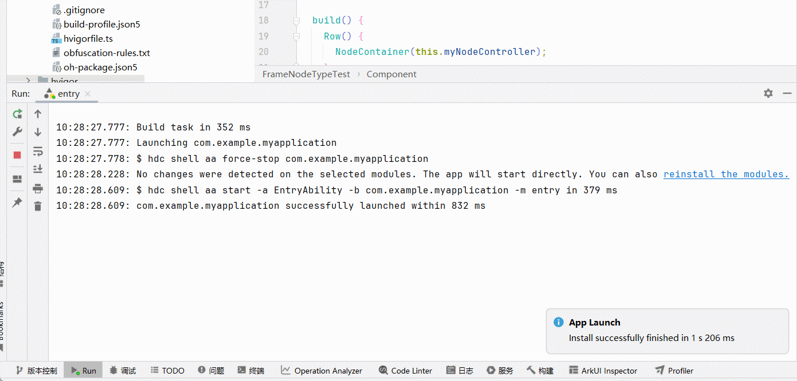

# 命令式节点常见问题
<!--Kit: ArkUI-->
<!--Subsystem: ArkUI-->
<!--Owner: @wangjunman1-->
<!--Designer: @sunbees-->
<!--Tester: @liuli0427-->
<!--Adviser: @Brilliantry_Rui-->

本文档介绍命令式节点的常见问题并提供参考。

## FrameNode节点运行时出现jscrash

**问题现象**

不规范地使用[FrameNode](../reference/apis-arkui/js-apis-arkui-frameNode.md)后出现[JS Crash](../dfx/jscrash-guidelines.md)。


**解决措施**

根据提示跳转至报错日志，查看具体的报错原因，进行相应的修改，具体的跳转方法请参考下方示例代码。  

**示例代码**

该示例演示了FrameNode抛出[dispose](../reference/apis-arkui/js-apis-arkui-frameNode.md#dispose12)相关异常的场景。运行示例代码后会出现jscrash报错，参考下方的动图，跳转至具体的报错场景，发现报错的原因是调用dispose后不能调用[getMeasuredSize](../reference/apis-arkui/js-apis-arkui-frameNode.md#getmeasuredsize12)，在本示例中，删除dispose相关代码即可正常运行。

```ts
import { NodeController, FrameNode, typeNode } from '@kit.ArkUI';

// 继承NodeController实现自定义UI控制器
class MyNodeController extends NodeController {
  makeNode(uiContext: UIContext): FrameNode | null {
    let node = new FrameNode(uiContext);
    node.dispose(); // 删除本行可以让程序正常运行
    node.getMeasuredSize();
    return node;
  }
}

@Entry
@Component
struct FrameNodeTypeTest {
  private myNodeController: MyNodeController = new MyNodeController();

  build() {
    Row() {
      Text('Hello')
      NodeContainer(this.myNodeController);
    }
  }
}
```
