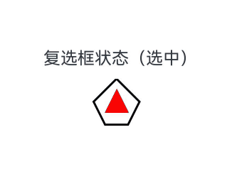

# 内容修改器 (ContentModifier)
<!--Kit: ArkUI-->
<!--Subsystem: ArkUI-->
<!--Owner: @liyi0309-->
<!--Designer: @liyi0309-->
<!--Tester: @lxl007-->
<!--Adviser: @Brilliantry_Rui-->

当开发者期望自定义组件的内容区时，比如Checkbox的内部显示一个五角星等场景时，可以使用此功能。

仅[Button](../reference/apis-arkui/arkui-ts/ts-basic-components-button.md)、[Checkbox](../reference/apis-arkui/arkui-ts/ts-basic-components-checkbox.md)、[DataPanel](../reference/apis-arkui/arkui-ts/ts-basic-components-datapanel.md)、[TextTimer](../reference/apis-arkui/arkui-ts/ts-basic-components-texttimer.md)、[Slider](../reference/apis-arkui/arkui-ts/ts-basic-components-slider.md)、[Select](../reference/apis-arkui/arkui-ts/ts-basic-components-select.md)、[Rating](../reference/apis-arkui/arkui-ts/ts-basic-components-rating.md)、[Radio](../reference/apis-arkui/arkui-ts/ts-basic-components-radio.md)、[Gauge](../reference/apis-arkui/arkui-ts/ts-basic-components-gauge.md)、[Toggle](../reference/apis-arkui/arkui-ts/ts-basic-components-toggle.md)、[TextClock](../reference/apis-arkui/arkui-ts/ts-basic-components-textclock.md)组件支持该能力。

使用ContentModifier自定义Checkbox样式，用五边形Checkbox替换默认Checkbox。选中时，五边形内部显示红色三角图案，标题显示“选中”；取消选中时，红色三角图案消失，标题显示“非选中”。

 <!-- @[checkbox_demo](https://gitcode.com/openharmony/applications_app_samples/blob/master/code/DocsSample/ArkUISample/Modifier/entry/src/main/ets/pages/MyCheckboxStyle.ets) -->
 
 ``` TypeScript
 import { hilog } from '@kit.PerformanceAnalysisKit';
 import { resourceManager } from '@kit.LocalizationKit';
 
 const DOMAIN = 0x0000;
 // xxx.ets
 class MyCheckboxStyle implements ContentModifier<CheckBoxConfiguration> {
   public selectedColor: Color = Color.White;
 
   constructor(selectedColor: Color) {
     this.selectedColor = selectedColor;
   }
 
   applyContent(): WrappedBuilder<[CheckBoxConfiguration]> {
     return wrapBuilder(buildCheckbox);
   }
 }
 
 @Builder
 function buildCheckbox(config: CheckBoxConfiguration) {
   Column({ space: 10 }) {
     Text() {
       Span(config.name)
       Span(config.selected ? $r('app.string.checked_context') : $r('app.string.unchecked_context'))
     }
     Shape() {
       // 五边形复选框样式
       Path()
         .width(200)
         .height(60)
         .commands('M100 0 L0 100 L50 200 L150 200 L200 100 Z')
         .fillOpacity(0)
         .strokeWidth(3)
       // 红色三角图案样式
       Path()
         .width(10)
         .height(10)
         .commands('M50 0 L100 100 L0 100 Z')
         .visibility(config.selected ? Visibility.Visible : Visibility.Hidden)
         .fill(config.selected ? (config.contentModifier as MyCheckboxStyle).selectedColor : Color.Black)
         .stroke((config.contentModifier as MyCheckboxStyle).selectedColor)
         .margin({ left: 11, top: 10 })
     }
     .width(300)
     .height(200)
     .viewPort({
       x: 0,
       y: 0,
       width: 310,
       height: 310
     })
     .strokeLineJoin(LineJoinStyle.Miter)
     .strokeMiterLimit(5)
     .onClick(() => {
       // 点击后，触发复选框点击状态变化
       if (config.selected) {
         config.triggerChange(false);
       } else {
         config.triggerChange(true);
       }
     })
     .margin({ left: 150 })
   }
 }
 
 @Entry
 @Component
 struct Index {
   private resmg: resourceManager.ResourceManager | undefined = this.getUIContext().getHostContext()?.resourceManager
   build() {
     Row() {
       Column() {
         //选中和不选中按钮
         Checkbox({ name: this.resmg?.getStringSync($r('app.string.checkbox_status').id), group: 'checkboxGroup' })
           .select(true)
           .contentModifier(new MyCheckboxStyle(Color.Red))
           .onChange((value: boolean) => {
             hilog.info(DOMAIN, 'testTag', 'Checkbox change is' + value);
           })
       }
       .width('100%')
     }
     .height('100%')
   }
 }
 ```


