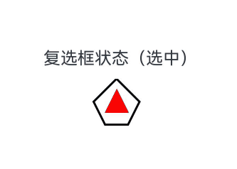

# 内容修改器 (ContentModifier)
<!--Kit: ArkUI-->
<!--Subsystem: ArkUI-->
<!--Owner: @liyi0309-->
<!--Designer: @liyi0309-->
<!--Tester: @lxl007-->
<!--Adviser: @Brilliantry_Rui-->

当开发者期望自定义组件的内容区时，比如Checkbox的内部显示一个五角星等场景时，可以使用此功能。

仅[Button](../reference/apis-arkui/arkui-ts/ts-basic-components-button.md)、[Checkbox](../reference/apis-arkui/arkui-ts/ts-basic-components-checkbox.md)、[DataPanel](../reference/apis-arkui/arkui-ts/ts-basic-components-datapanel.md)、[TextTimer](../reference/apis-arkui/arkui-ts/ts-basic-components-texttimer.md)、[Slider](../reference/apis-arkui/arkui-ts/ts-basic-components-slider.md)、[Select](../reference/apis-arkui/arkui-ts/ts-basic-components-select.md)、[Rating](../reference/apis-arkui/arkui-ts/ts-basic-components-rating.md)、[Radio](../reference/apis-arkui/arkui-ts/ts-basic-components-radio.md)、[Gauge](../reference/apis-arkui/arkui-ts/ts-basic-components-gauge.md)、[Toggle](../reference/apis-arkui/arkui-ts/ts-basic-components-toggle.md)、[TextClock](../reference/apis-arkui/arkui-ts/ts-basic-components-textclock.md)组件支持该能力。

使用ContentModifier自定义Checkbox样式，用五边形Checkbox替换默认Checkbox。选中时，五边形内部显示红色三角图案，标题显示“选中”；取消选中时，红色三角图案消失，标题显示“非选中”。

ArkTS-Dyn示例：

 <!-- @[checkbox_demo](https://gitcode.com/openharmony/applications_app_samples/blob/master/code/DocsSample/ArkUISample/Modifier/entry/src/main/ets/pages/MyCheckboxStyle.ets) -->
 
``` TypeScript
// 导入性能分析工具包，用于日志输出
import { hilog } from '@kit.PerformanceAnalysisKit';
// 导入资源管理工具包，用于获取本地化字符串资源
import { resourceManager } from '@kit.LocalizationKit';

// 定义日志域标识，用于区分不同模块的日志输出
const DOMAIN = 0x0000;

/**
 * 自定义Checkbox样式类
 * 用途：实现ContentModifier接口，用于自定义Checkbox的内容显示
 * 说明：将默认的Checkbox样式替换为五边形样式，选中时显示红色三角图案
 */
class MyCheckboxStyle implements ContentModifier<CheckBoxConfiguration> {
  // 选中状态时的填充颜色，默认为白色
  public selectedColor: Color = Color.White;

  /**
   * 构造函数
   * @param selectedColor - 选中时三角图案的颜色
   */
  constructor(selectedColor: Color) {
    this.selectedColor = selectedColor;
  }

  /**
   * 应用自定义内容构建器
   * @returns 返回包裹后的Builder函数，用于渲染自定义的Checkbox样式
   */
  applyContent(): WrappedBuilder<[CheckBoxConfiguration]> {
    return wrapBuilder(buildCheckbox);
  }
}

/**
 * 自定义Checkbox构建函数
 * 用途：定义五边形Checkbox的UI布局和交互逻辑
 * @param config - Checkbox配置对象，包含选中状态、名称等信息
 */
@Builder
function buildCheckbox(config: CheckBoxConfiguration) {
  // 使用Column垂直布局，间距为10
  Column({ space: 10 }) {
    // 显示Checkbox名称和选中状态文本
    Text() {
      // 显示Checkbox的名称（如"复选框状态"）
      Span(config.name)
      // 请将$r('app.string.checked_context')替换为实际资源文件，在本示例中该资源文件的value值为"（选中）"
      // 请将$r('app.string.unchecked_context')替换为实际资源文件，在本示例中该资源文件的value值为"（非选中）"
      // 根据选中状态动态显示"（选中）"或"（非选中）"
      Span(config.selected ? $r('app.string.checked_context') : $r('app.string.unchecked_context'))
    }
    // 使用Shape组件绘制五边形和三角图案
    Shape() {
      // 五边形复选框样式 - 绘制外边框
      Path()
        .width(200)    // 设置绘制区域的宽度
        .height(60)   // 设置绘制区域的高度
        // SVG路径命令：绘制五边形的五个顶点
        .commands('M100 0 L0 100 L50 200 L150 200 L200 100 Z')
        .fillOpacity(0)  // 填充透明度为0，只显示边框
        .strokeWidth(3)  // 边框宽度为3
      // 红色三角图案样式 - 绘制选中指示器
      Path()
        .width(10)   // 三角形绘制区域宽度
        .height(10)  // 三角形绘制区域高度
        // SVG路径命令：绘制三角形
        .commands('M50 0 L100 100 L0 100 Z')
        // 根据选中状态控制三角形的可见性
        .visibility(config.selected ? Visibility.Visible : Visibility.Hidden)
        // 选中时填充指定颜色，未选中时填充黑色
        .fill(config.selected ? (config.contentModifier as MyCheckboxStyle).selectedColor : Color.Black)
        // 边框颜色使用自定义样式中的颜色
        .stroke((config.contentModifier as MyCheckboxStyle).selectedColor)
        .margin({ left: 11, top: 10 })  // 调整三角形在五边形内的位置
    }
    .width(300)   // Shape组件总宽度
    .height(200)  // Shape组件总高度
    // 设置视口范围，定义绘图坐标系
    .viewPort({
      x: 0,
      y: 0,
      width: 310,   // 视口宽度
      height: 310   // 视口高度
    })
    .strokeLineJoin(LineJoinStyle.Miter)  // 设置线条连接样式为尖角
    .strokeMiterLimit(5)  // 设置尖角限制值
    /**
     * 点击事件回调
     * 用途：响应用户点击，切换Checkbox的选中状态
     * 说明：调用triggerChange方法通知系统状态变化
     */
    .onClick(() => {
      // 点击后，触发复选框点击状态变化
      if (config.selected) {
        config.triggerChange(false);  // 当前选中则取消选中
      } else {
        config.triggerChange(true);   // 当前未选中则设为选中
      }
    })
    .margin({ left: 150 })  // 左侧边距，使五边形居中显示
  }
}

/**
 * 主页面组件
 * 用途：展示自定义样式的Checkbox组件
 */
@Entry
@Component
struct Index {
  // 获取资源管理器实例，用于读取本地化字符串
  private resmg: resourceManager.ResourceManager | undefined = this.getUIContext().getHostContext()?.resourceManager
  
  build() {
    Row() {
      Column() {
        // 选中和不选中按钮
        // 请将$r('app.string.checkbox_status')替换为实际资源文件，在本示例中该资源文件的value值为"复选框状态"
        // 创建Checkbox组件，设置名称和所属组
        Checkbox({ name: this.resmg?.getStringSync($r('app.string.checkbox_status').id), group: 'checkboxGroup' })
          .select(true)  // 默认选中状态
          // 应用自定义样式，设置选中颜色为红色
          .contentModifier(new MyCheckboxStyle(Color.Red))
          /**
           * 选中状态变化回调
           * @param value - 变化后的选中状态，true表示选中，false表示未选中
           */
          .onChange((value: boolean) => {
            // 输出日志记录状态变化
            hilog.info(DOMAIN, 'testTag', 'Checkbox change is' + value);
          })
      }
      .width('100%')
    }
    .height('100%')
  }
}
```

ArkTS-Sta示例：

 <!-- @[checkbox_demo](https://gitcode.com/openharmony/applications_app_samples/blob/OpenHarmony_feature_sta_20260331/code/DocsSample/ArkUISample-Sta/Modifier/entry/src/main/ets/pages/MyCheckboxStyle.ets) -->
 
``` TypeScript
// 导入性能分析工具包，用于日志输出
import { hilog } from '@kit.PerformanceAnalysisKit';
// 导入资源管理工具包，用于获取本地化字符串资源
import { resourceManager } from '@kit.LocalizationKit';
// 从ArkUI工具包导入所需的组件和类型（ArkTS-Sta需要显式导入所有使用的组件）
import {
  Entry,
  Component,
  Checkbox,
  Column,
  ColumnOptions,
  Row,
  Text,
  Span,
  Shape,
  Path,
  Color,
  Visibility,
  LineJoinStyle,
  Builder,
  wrapBuilder,
  WrappedBuilder,
  ContentModifier,
  CheckBoxConfiguration,
  $r
} from '@kit.ArkUI';

// 定义日志域标识，用于区分不同模块的日志输出（ArkTS-Sta使用int类型）
const DOMAIN: int = 0x0000;

/**
 * 定义Builder函数类型
 * 用途：为wrapBuilder提供类型安全的Builder函数签名
 */
type BuilderCheckbox = @Builder(config: CheckBoxConfiguration) => void;

/**
 * 自定义Checkbox样式类
 * 用途：实现ContentModifier接口，用于自定义Checkbox的内容显示
 * 说明：将默认的Checkbox样式替换为五边形样式，选中时显示红色三角图案
 */
class MyCheckboxStyle implements ContentModifier<CheckBoxConfiguration> {
  // 选中状态时的填充颜色，默认为白色
  public selectedColor: Color = Color.White;

  /**
   * 构造函数
   * @param selectedColor - 选中时三角图案的颜色
   */
  constructor(selectedColor: Color) {
    this.selectedColor = selectedColor;
  }

  /**
   * 应用自定义内容构建器
   * @returns 返回包裹后的Builder函数，用于渲染自定义的Checkbox样式
   */
  applyContent(): WrappedBuilder<BuilderCheckbox> {
    return wrapBuilder(buildCheckbox);
  }
}

/**
 * 自定义Checkbox构建函数
 * 用途：定义五边形Checkbox的UI布局和交互逻辑
 * @param config - Checkbox配置对象，包含选中状态、名称等信息
 */
@Builder
function buildCheckbox(config: CheckBoxConfiguration): void {
  // 使用Column垂直布局，间距为10（ArkTS-Sta需要显式类型转换）
  Column({ space: 10 } as ColumnOptions) {
    // 显示Checkbox名称和选中状态文本
    Text() {
      // 显示Checkbox的名称（如"复选框状态"）
      Span(config.name)
      // 请将$r('app.string.checked_context')替换为实际资源文件，在本示例中该资源文件的value值为"（选中）"
      // 请将$r('app.string.unchecked_context')替换为实际资源文件，在本示例中该资源文件的value值为"（非选中）"
      // 根据选中状态动态显示"（选中）"或"（非选中）"
      Span(config.selected ? $r('app.string.checked_context') : $r('app.string.unchecked_context'))
    }
    // 使用Shape组件绘制五边形和三角图案
    Shape() {
      // 五边形复选框样式 - 绘制外边框
      Path()
        .width(200)    // 设置绘制区域的宽度
        .height(60)   // 设置绘制区域的高度
        // SVG路径命令：绘制五边形的五个顶点
        .commands('M100 0 L0 100 L50 200 L150 200 L200 100 Z')
        .fillOpacity(0)  // 填充透明度为0，只显示边框
        .strokeWidth(3)  // 边框宽度为3
      // 红色三角图案样式 - 绘制选中指示器
      Path()
        .width(10)   // 三角形绘制区域宽度
        .height(10)  // 三角形绘制区域高度
        // SVG路径命令：绘制三角形
        .commands('M50 0 L100 100 L0 100 Z')
        // 根据选中状态控制三角形的可见性
        .visibility(config.selected ? Visibility.Visible : Visibility.Hidden)
        // 选中时填充指定颜色，未选中时填充黑色
        .fill(config.selected ? (config.contentModifier as MyCheckboxStyle).selectedColor : Color.Black)
        // 边框颜色使用自定义样式中的颜色
        .stroke((config.contentModifier as MyCheckboxStyle).selectedColor)
        .margin({ left: 11, top: 10 })  // 调整三角形在五边形内的位置
    }
    .width(300)   // Shape组件总宽度
    .height(200)  // Shape组件总高度
    // 设置视口范围，定义绘图坐标系
    .viewPort({
      x: 0,
      y: 0,
      width: 310,   // 视口宽度
      height: 310   // 视口高度
    })
    .strokeLineJoin(LineJoinStyle.Miter)  // 设置线条连接样式为尖角
    .strokeMiterLimit(5)  // 设置尖角限制值
    /**
     * 点击事件回调
     * 用途：响应用户点击，切换Checkbox的选中状态
     * 说明：调用triggerChange方法通知系统状态变化
     */
    .onClick(() => {
      // 点击后，触发复选框点击状态变化
      if (config.selected) {
        config.triggerChange(false);  // 当前选中则取消选中
      } else {
        config.triggerChange(true);   // 当前未选中则设为选中
      }
    })
    .margin({ left: 150 })  // 左侧边距，使五边形居中显示
  }
}

/**
 * 主页面组件
 * 用途：展示自定义样式的Checkbox组件
 */
@Entry
@Component
struct Index {
  // 获取资源管理器实例，用于读取本地化字符串
  private resmg: resourceManager.ResourceManager | undefined = this.getUIContext().getHostContext()?.resourceManager;

  /**
   * 构建UI界面
   * 说明：ArkTS-Sta版本build方法需要显式声明返回类型void
   */
  build(): void {
    Row() {
      Column() {
        // 选中和不选中按钮
        // 请将$r('app.string.checkbox_status')替换为实际资源文件，在本示例中该资源文件的value值为"复选框状态"
        // 创建Checkbox组件，设置名称和所属组
        Checkbox({ name: this.resmg?.getStringSync($r('app.string.checkbox_status').id), group: 'checkboxGroup' })
          .select(true)  // 默认选中状态
          // 应用自定义样式，设置选中颜色为红色
          .contentModifier(new MyCheckboxStyle(Color.Red))
          /**
           * 选中状态变化回调
           * @param value - 变化后的选中状态，true表示选中，false表示未选中
           */
          .onChange((value: boolean) => {
            // 输出日志记录状态变化
            hilog.info(DOMAIN, 'testTag', 'Checkbox change is' + value);
          })
      }
      .width('100%')
    }
    .height('100%')
  }
}
```
 

