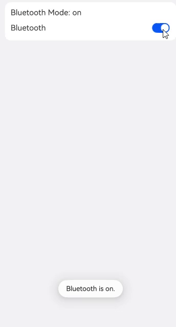

# 切换按钮 (Toggle)
<!--Kit: ArkUI-->
<!--Subsystem: ArkUI-->
<!--Owner: @houguobiao-->
<!--Designer: @houguobiao-->
<!--Tester: @lxl007-->
<!--Adviser: @Brilliantry_Rui-->


Toggle组件提供状态按钮样式、勾选框样式和开关样式，一般用于两种状态之间的切换。具体用法请参考[Toggle](../reference/apis-arkui/arkui-ts/ts-basic-components-toggle.md)。


## 创建切换按钮

Toggle通过调用[ToggleOptions](../reference/apis-arkui/arkui-ts/ts-basic-components-toggle.md#toggleoptions18对象说明)来创建，具体调用形式如下：

```ts
Toggle(options: { type: ToggleType, isOn?: boolean })
```

其中，ToggleType为开关类型，包括Button、Checkbox和Switch，isOn为切换按钮的状态。

API version 11开始，Checkbox默认样式由圆角方形变为圆形。

接口调用有以下两种形式：


- 创建不包含子组件的Toggle。
  当ToggleType为Checkbox或者Switch时，用于创建不包含子组件的Toggle：
  
  <!-- @[create_toggle_with_checkbox](https://gitcode.com/openharmony/applications_app_samples/blob/master/code/DocsSample/ArkUISample/ChooseComponent/entry/src/main/ets/pages/toggle/CreateToggle.ets) -->
  
  ``` TypeScript
  Toggle({ type: ToggleType.Checkbox, isOn: false }).id('toggle1') // 请开发者替换为实际的id
  Toggle({ type: ToggleType.Checkbox, isOn: true }).id('toggle2') // 请开发者替换为实际的id
  ```

  
  
  <!-- @[create_toggle_with_switch](https://gitcode.com/openharmony/applications_app_samples/blob/master/code/DocsSample/ArkUISample/ChooseComponent/entry/src/main/ets/pages/toggle/CreateToggle.ets) -->
  
  ``` TypeScript
  Toggle({ type: ToggleType.Switch, isOn: false }).id('toggle3') // 请开发者替换为实际的id
  Toggle({ type: ToggleType.Switch, isOn: true }).id('toggle4') // 请开发者替换为实际的id
  ```
  
    
  
- 创建包含子组件的Toggle。

  当ToggleType为Button时，只能包含一个子组件，如果子组件有文本设置，则相应的文本内容会显示在按钮上。

  <!-- @[create_a_toggle_that_contains_subcomponents](https://gitcode.com/openharmony/applications_app_samples/blob/master/code/DocsSample/ArkUISample/ChooseComponent/entry/src/main/ets/pages/toggle/CreateToggle.ets) -->
  
  ``` TypeScript
  Toggle({ type: ToggleType.Button, isOn: false }) {
    Text('status button')
      .fontColor('#182431')
      .fontSize(12)
  }.width(100).id('toggle5') // 请开发者替换为实际的id
  
  Toggle({ type: ToggleType.Button, isOn: true }) {
    Text('status button')
      .fontColor('#182431')
      .fontSize(12)
  }.width(100).id('toggle6') // 请开发者替换为实际的id
  ```

    


## 自定义样式

- 通过selectedColor属性设置Toggle打开选中后的背景颜色。

  <!-- @[custom_toggle](https://gitcode.com/openharmony/applications_app_samples/blob/master/code/DocsSample/ArkUISample/ChooseComponent/entry/src/main/ets/pages/toggle/ToggleCustomStyle.ets) -->
  
  ``` TypeScript
    Toggle({ type: ToggleType.Button, isOn: true }) {
      Text('status button')
        .fontColor('#182431')
        .fontSize(12)
    }.width(100)
    .selectedColor(Color.Pink)
  // ···
  
    Toggle({ type: ToggleType.Checkbox, isOn: true })
      .selectedColor(Color.Pink)
      // ···
    Toggle({ type: ToggleType.Switch, isOn: true })
      .selectedColor(Color.Pink)
      // ···
  ```

  

- 通过switchPointColor属性设置Switch类型的圆形滑块颜色，仅对type为ToggleType.Switch生效。

  <!-- @[custom_switch_point_color](https://gitcode.com/openharmony/applications_app_samples/blob/master/code/DocsSample/ArkUISample/ChooseComponent/entry/src/main/ets/pages/toggle/ToggleCustomStyle.ets) -->  
  
  ``` TypeScript
  Toggle({ type: ToggleType.Switch, isOn: false })
    .switchPointColor(Color.Pink)
    // ···
  Toggle({ type: ToggleType.Switch, isOn: true })
    .switchPointColor(Color.Pink)
    // ···
  ```

  


## 添加事件

除支持[通用事件](../reference/apis-arkui/arkui-ts/ts-component-general-events.md)外，Toggle还用于选中和取消选中后触发某些操作，可以绑定onChange事件来响应操作后的自定义行为。


<!-- @[create_toggle_with_event](https://gitcode.com/openharmony/applications_app_samples/blob/master/code/DocsSample/ArkUISample/ChooseComponent/entry/src/main/ets/pages/toggle/CreateToggle.ets) -->  

``` TypeScript
Toggle({ type: ToggleType.Switch, isOn: false })
  .onChange((isOn: boolean) => {
    if(isOn) {
      // 需要执行的操作
      // ···
    }
  })
```


## 场景示例

Toggle用于切换蓝牙开关状态。

<!-- @[the_example_of_bluetooth](https://gitcode.com/openharmony/applications_app_samples/blob/master/code/DocsSample/ArkUISample/ChooseComponent/entry/src/main/ets/pages/toggle/ToggleCaseExample.ets) --> 

``` TypeScript
// xxx.ets
import { promptAction } from '@kit.ArkUI';

@Entry
@Component
export struct ToggleSample {
  @State message: string = 'off';
  pathStack: NavPathStack = new NavPathStack();

  build() {
    NavDestination() {
      Column({ space: 8 }) {
        Column({ space: 8 }) {
          Text('Bluetooth Mode: ' + this.message)
            .id('message')
          Row() {
            Text('Bluetooth')
            Blank()
            Toggle({ type: ToggleType.Switch })
              .id('toggle') // 请开发者替换为实际的id
              .onChange((isOn: boolean) => {
                if (isOn) {
                  this.message = 'on';
                  promptAction.openToast({ 'message': 'Bluetooth is on.' });
                } else {
                  this.message = 'off';
                  promptAction.openToast({ 'message': 'Bluetooth is off.' });
                }
              })
          }.width('100%')
        }
        .alignItems(HorizontalAlign.Start)
        .backgroundColor('#fff')
        .borderRadius(12)
        .padding(12)
        .width('100%')
      }
      .width('100%')
      .height('100%')
      .padding({ left: 12, right: 12 })
    }
    .backgroundColor('#f1f2f3')
    // $r('app.string.xxx')需要替换为开发者所需的字符串资源文件
    .title($r('app.string.ToggleCaseExample_title'))
  }
}
```



  