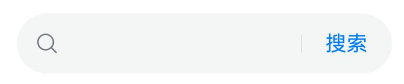
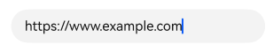
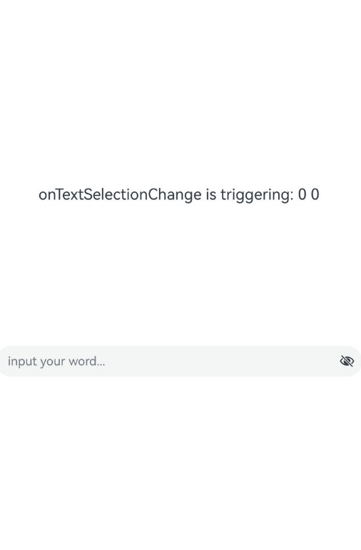
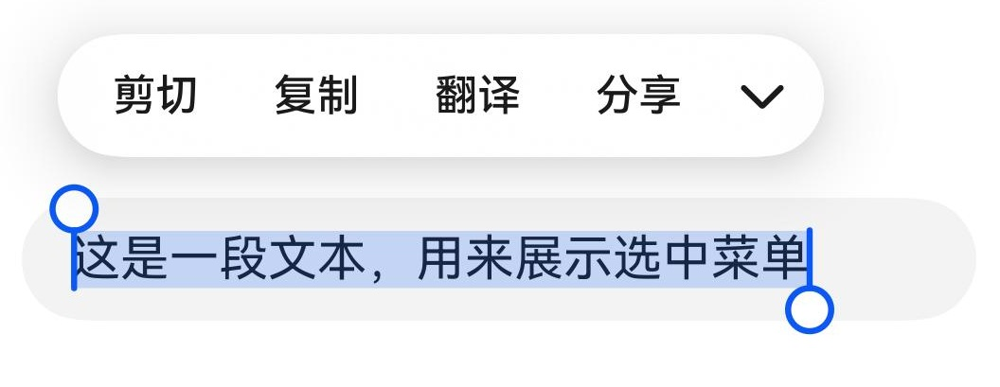
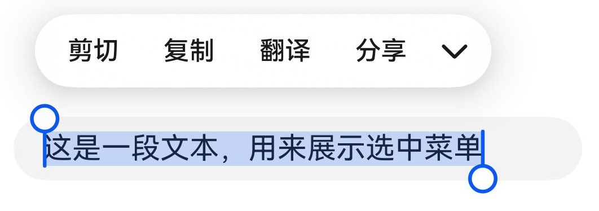
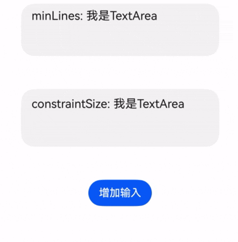

# 文本输入 (TextInput/TextArea/Search)
<!--Kit: ArkUI-->
<!--Subsystem: ArkUI-->
<!--Owner: @kangshihui-->
<!--Designer: @pssea-->
<!--Tester: @jiaoaozihao-->
<!--Adviser: @Brilliantry_Rui-->


TextInput、TextArea是输入框组件，用于响应用户输入，比如评论区的输入、聊天框的输入、表格的输入等，也可以结合其它组件构建功能页面，例如登录注册页面。具体用法请参考[TextInput](../reference/apis-arkui/arkui-ts/ts-basic-components-textinput.md)、[TextArea](../reference/apis-arkui/arkui-ts/ts-basic-components-textarea.md)。Search是特殊的输入框组件，称为搜索框，默认样式包含搜索图标。具体用法请参考[Search](../reference/apis-arkui/arkui-ts/ts-basic-components-search.md)。


>  **说明：**
>
>  仅支持单文本样式，若需实现富文本样式，建议使用[RichEditor](../reference/apis-arkui/arkui-ts/ts-basic-components-richeditor.md)组件。

## 创建输入框

TextInput是单行输入框，TextArea是多行输入框，Search是搜索框。通过以下接口创建这些组件。

```ts
TextInput(value?:{placeholder?: ResourceStr, text?: ResourceStr, controller?: TextInputController})
```

```ts
TextArea(value?:{placeholder?: ResourceStr, text?: ResourceStr, controller?: TextAreaController})
```

```ts
Search(options?:{placeholder?: ResourceStr, value?: ResourceStr, controller?: SearchController, icon?: string})
```

- 单行输入框。

  <!-- @[create_text_input](https://gitcode.com/openharmony/applications_app_samples/blob/master/code/DocsSample/ArkUISample/TextComponent/entry/src/main/ets/pages/textInput/CreatTextInput.ets) -->
  
  ``` TypeScript
  TextInput()
  ```

  


- 多行输入框。

  <!-- @[create_text_area](https://gitcode.com/openharmony/applications_app_samples/blob/master/code/DocsSample/ArkUISample/TextComponent/entry/src/main/ets/pages/textInput/CreatTextInput.ets) -->

  

- 多行输入框文字超出一行时会自动折行。

  <!-- @[create_text_area_example](https://gitcode.com/openharmony/applications_app_samples/blob/master/code/DocsSample/ArkUISample/TextComponent/entry/src/main/ets/pages/textInput/CreatTextInput.ets) -->


- 搜索框。

  <!-- @[create_text_search](https://gitcode.com/openharmony/applications_app_samples/blob/master/code/DocsSample/ArkUISample/TextComponent/entry/src/main/ets/pages/textInput/CreatTextInput.ets) -->

  

## 设置输入框类型

TextInput、TextArea和Search都支持设置输入框类型，通过type属性进行设置，但是各组件的枚举值略有不同。下面以单行输入框为例进行说明。

TextInput有以下类型可选择：Normal基本输入模式、Password密码输入模式、Email邮箱地址输入模式、Number纯数字输入模式、PhoneNumber电话号码输入模式、USER_NAME用户名输入模式、NEW_PASSWORD新密码输入模式、NUMBER_PASSWORD纯数字密码输入模式、<!--Del-->SCREEN_LOCK_PASSWORD锁屏应用密码输入模式、<!--DelEnd-->NUMBER_DECIMAL带小数点的数字输入模式、带URL的输入模式。通过[type](../reference/apis-arkui/arkui-ts/ts-basic-components-textinput.md#type)属性进行设置：

### 基本输入模式（默认类型）

<!-- @[set_password_input_type_1](https://gitcode.com/openharmony/applications_app_samples/blob/master/code/DocsSample/ArkUISample/TextComponent/entry/src/main/ets/pages/textInput/SetTextInputType.ets) -->


### 密码模式

包括Password密码输入模式、NUMBER_PASSWORD纯数字密码模式、NEW_PASSWORD新密码输入模式。

以下示例是Password密码输入模式的输入框。
<!-- @[set_password_input_type_2](https://gitcode.com/openharmony/applications_app_samples/blob/master/code/DocsSample/ArkUISample/TextComponent/entry/src/main/ets/pages/textInput/SetTextInputType.ets) -->


### 邮箱地址输入模式

邮箱地址输入模式的输入框，只能存在一个@符号。

<!-- @[set_email_input_type_3](https://gitcode.com/openharmony/applications_app_samples/blob/master/code/DocsSample/ArkUISample/TextComponent/entry/src/main/ets/pages/textInput/SetTextInputType.ets) -->


### 纯数字输入模式
纯数字输入模式的输入框，只能输入数字[0-9]。

<!-- @[set_number_input_type_4](https://gitcode.com/openharmony/applications_app_samples/blob/master/code/DocsSample/ArkUISample/TextComponent/entry/src/main/ets/pages/textInput/SetTextInputType.ets) -->


### 电话号码输入模式

电话号码输入模式的输入框，支持输入数字、空格、+ 、-、*、#、(、)，长度不限。

<!-- @[set_phonenumber_input_type_5](https://gitcode.com/openharmony/applications_app_samples/blob/master/code/DocsSample/ArkUISample/TextComponent/entry/src/main/ets/pages/textInput/SetTextInputType.ets) -->


### 带小数点的数字输入模式

带小数点的数字输入模式的输入框，只能输入数字[0-9]和小数点，只能存在一个小数点。
<!-- @[set_number_decimal_input_type_6](https://gitcode.com/openharmony/applications_app_samples/blob/master/code/DocsSample/ArkUISample/TextComponent/entry/src/main/ets/pages/textInput/SetTextInputType.ets) -->


### 带URL的输入模式

带URL的输入模式，无特殊限制。
<!-- @[set_url_input_type_7](https://gitcode.com/openharmony/applications_app_samples/blob/master/code/DocsSample/ArkUISample/TextComponent/entry/src/main/ets/pages/textInput/SetTextInputType.ets) -->



## 设置输入框多态样式

TextInput、TextArea支持设置输入框多态样式，通过[style](../reference/apis-arkui/arkui-ts/ts-basic-components-textarea.md#style10)属性进行设置。下面以多行输入框TextArea为例进行说明。

TextArea有以下2种类型可选择：默认风格，入参是TextContentStyle.DEFAULT；内联模式，也称内联输入风格，入参是TextContentStyle.INLINE。

### 默认风格

默认风格的输入框，在编辑态和非编辑态，样式没有区别。
<!-- @[textArea_style_default](https://gitcode.com/openharmony/applications_app_samples/blob/master/code/DocsSample/ArkUISample/TextComponent/entry/src/main/ets/pages/textInput/SetInputMultiTypeStyle.ets) -->


### 内联模式

内联模式，也称内联输入风格。内联模式的输入框在编辑态和非编辑态样式有明显区分。
<!-- @[textArea_style_inline](https://gitcode.com/openharmony/applications_app_samples/blob/master/code/DocsSample/ArkUISample/TextComponent/entry/src/main/ets/pages/textInput/SetInputMultiTypeStyle.ets) -->


## 自定义样式

- 设置无输入时的提示文本。

  <!-- @[custom_text_input_with_place_holder](https://gitcode.com/openharmony/applications_app_samples/blob/master/code/DocsSample/ArkUISample/TextComponent/entry/src/main/ets/pages/textInput/CustomTextInputStyle.ets) -->

  


- 设置输入框当前的文本内容。

  <!-- @[custom_text_input_with_place_holder_and_text](https://gitcode.com/openharmony/applications_app_samples/blob/master/code/DocsSample/ArkUISample/TextComponent/entry/src/main/ets/pages/textInput/CustomTextInputStyle.ets) -->

  

- 添加backgroundColor改变输入框的背景颜色。

  <!-- @[custom_text_input_background_color](https://gitcode.com/openharmony/applications_app_samples/blob/master/code/DocsSample/ArkUISample/TextComponent/entry/src/main/ets/pages/textInput/CustomTextInputStyle.ets) -->

  

  更丰富的样式可以结合[通用属性](../reference/apis-arkui/arkui-ts/ts-component-general-attributes.md)实现。


## 添加事件

文本框主要用于获取用户输入的信息，并将信息处理成数据进行上传，绑定onChange事件可以获取输入框内改变的文本内容，绑定onSubmit事件可以获取回车提交的文本信息，绑定onTextSelectionChange事件可以获取文本选中时手柄的位置信息或者编辑时光标的位置信息等等。用户也可以使用通用事件进行相应的交互操作。

>  **说明：**
>
>  在密码模式下，设置showPassword属性时，在onSecurityStateChange回调中，建议增加状态同步，具体详见如下示例。
>
> onWillInsert、onDidInsert、onWillDelete、onDidDelete回调仅支持系统输入法的场景。
>
> [onWillChange](../reference/apis-arkui/arkui-ts/ts-basic-components-textinput.md#onwillchange15)的回调时序晚于onWillInsert、onWillDelete，早于onDidInsert、onDidDelete。

<!-- @[TextInputAddEvent](https://gitcode.com/openharmony/applications_app_samples/blob/master/code/DocsSample/ArkUISample/TextComponent/entry/src/main/ets/pages/textInput/TextInputAddEvent.ets) -->



## 选中菜单

输入框中的文字被选中时会弹出包含剪切、复制、翻译、搜索的菜单。

TextInput:
<!-- @[select_textinput](https://gitcode.com/openharmony/applications_app_samples/blob/master/code/DocsSample/ArkUISample/TextComponent/entry/src/main/ets/pages/textInput/SelectMenu.ets) -->


TextArea:
<!-- @[select_textarea](https://gitcode.com/openharmony/applications_app_samples/blob/master/code/DocsSample/ArkUISample/TextComponent/entry/src/main/ets/pages/textInput/SelectMenu.ets) -->


## 禁用系统服务类菜单

从API version 20开始，支持使用[disableSystemServiceMenuItems](../reference/apis-arkui/arkts-apis-uicontext-textmenucontroller.md#disablesystemservicemenuitems20)方法屏蔽文本选择菜单中的所有系统服务菜单项。

<!-- @[DisableSystemServiceMenuItems](https://gitcode.com/openharmony/applications_app_samples/blob/master/code/DocsSample/ArkUISample/TextComponent/entry/src/main/ets/pages/textInput/disablemenu/DisableSystemServiceMenuItems.ets) -->


从API version 20开始，支持使用[disableMenuItems](../reference/apis-arkui/arkts-apis-uicontext-textmenucontroller.md#disablemenuitems20)方法屏蔽文本选择菜单中指定的系统服务菜单项。

<!-- @[DisableMenuItems](https://gitcode.com/openharmony/applications_app_samples/blob/master/code/DocsSample/ArkUISample/TextComponent/entry/src/main/ets/pages/textInput/disablemenu/DisableMenuItems.ets) -->


## 自动填充

输入框可以通过[contentType](../reference/apis-arkui/arkui-ts/ts-basic-components-textinput.md#contenttype12)属性设置自动填充类型。

支持的类型请参考[ContentType](../reference/apis-arkui/arkui-ts/ts-basic-components-textinput.md#contenttype12枚举说明)。
<!-- @[auto_fill](https://gitcode.com/openharmony/applications_app_samples/blob/master/code/DocsSample/ArkUISample/TextComponent/entry/src/main/ets/pages/textInput/AutoFill.ets) -->

## 设置属性

- 设置省略属性。

  输入框可以通过[ellipsisMode](../reference/apis-arkui/arkui-ts/ts-basic-components-textinput.md#ellipsismode18)属性设置省略位置。

  ellipsisMode属性需要配合overflow设置为TextOverflow.Ellipsis使用，单独设置ellipsisMode属性不生效。

  <!-- @[set_omission_property](https://gitcode.com/openharmony/applications_app_samples/blob/master/code/DocsSample/ArkUISample/TextComponent/entry/src/main/ets/pages/textInput/SetProperty.ets) -->
  

- 设置文本描边属性。

  从API version 20开始，输入框可以通过[strokeWidth](../reference/apis-arkui/arkui-ts/ts-basic-components-textinput.md#strokewidth20)和[strokeColor](../reference/apis-arkui/arkui-ts/ts-basic-components-textinput.md#strokecolor20)属性设置文本的描边宽度及颜色。

  <!-- @[set_stroke_property](https://gitcode.com/openharmony/applications_app_samples/blob/master/code/DocsSample/ArkUISample/TextComponent/entry/src/main/ets/pages/textInput/SetProperty.ets) -->
  

## 设置文本行间距

从API version 20开始，支持通过[lineSpacing](../reference/apis-arkui/arkui-ts/ts-basic-components-text.md#linespacing20)设置文本的行间距。如果不配置[LineSpacingOptions](../reference/apis-arkui/arkui-ts/ts-text-common.md#linespacingoptions20对象说明)时，首行上方和尾行下方默认会有行间距。如果onlyBetweenLines设置为true时，行间距仅适用于行与行之间，首行上方无额外行间距。

<!-- @[SetTextMargin](https://gitcode.com/openharmony/applications_app_samples/blob/master/code/DocsSample/ArkUISample/TextComponent/entry/src/main/ets/pages/textInput/SetTextMargin.ets) -->


## 键盘避让

键盘抬起后，具有滚动能力的容器组件在横竖屏切换时，才会生效键盘避让，若希望无滚动能力的容器组件也生效键盘避让，建议在组件外嵌套一层具有滚动能力的容器组件，比如[Scroll](../reference/apis-arkui/arkui-ts/ts-container-scroll.md)、[List](../reference/apis-arkui/arkui-ts/ts-container-list.md)、[Grid](../reference/apis-arkui/arkui-ts/ts-container-grid.md)。

<!-- @[keyboard_avoid](https://gitcode.com/openharmony/applications_app_samples/blob/master/code/DocsSample/ArkUISample/TextComponent/entry/src/main/ets/pages/textInput/KeyboardAvoidance.ets) -->


## 光标避让

[keyBoardAvoidMode](../reference/apis-arkui/arkts-apis-uicontext-e.md#keyboardavoidmode11)枚举中的OFFSET和RESIZE在键盘抬起后，不支持二次避让。如果想要支持光标位置在点击或者通过接口设置变化后发生二次避让，可以考虑使用OFFSET_WITH_CARET和RESIZE_CARET替换原有的OFFSET和RESIZE模式。<br>
对于滚动容器更推荐使用RESIZE_WITH_CARET，非滚动容器应该使用OFFSET_WITH_CARET。

<!-- @[cursor_avoid_part1](https://gitcode.com/openharmony/applications_app_samples/blob/master/code/DocsSample/ArkUISample/TextComponent/entry/src/main/ets/entryability/EntryAbility.ets) -->

<!-- @[cursor_avoid_part2](https://gitcode.com/openharmony/applications_app_samples/blob/master/code/DocsSample/ArkUISample/TextComponent/entry/src/main/ets/entryability/EntryAbility.ets) -->

<!-- @[cursor_avoid](https://gitcode.com/openharmony/applications_app_samples/blob/master/code/DocsSample/ArkUISample/TextComponent/entry/src/main/ets/pages/textInput/CursorAvoidance.ets) -->


## 相关实例

针对文本输入开发，有以下相关实例可供参考：

- [聊天实例应用（ArkTS）](https://gitcode.com/openharmony/applications_app_samples/tree/master/code/Solutions/IM/Chat#%E8%81%8A%E5%A4%A9%E5%AE%9E%E4%BE%8B%E5%BA%94%E7%94%A8)

## 常见问题

### 如何设置TextArea的文本最少展示行数并自适应高度

**问题现象**

设置TextArea的初始高度来控制最少文本展示行数，当输入文本超过初始高度时，TextArea的高度自适应。

**解决措施**

设置[minLines](../reference/apis-arkui/arkui-ts/ts-basic-components-textarea.md#minlines20)（从API version 20开始），或者设置height为"auto"，并使用[constraintSize](../reference/apis-arkui/arkui-ts/ts-universal-attributes-size.md#constraintsize)自行计算高度。

<!-- @[normal_question_text_example](https://gitcode.com/openharmony/applications_app_samples/blob/master/code/DocsSample/ArkUISample/TextComponent/entry/src/main/ets/pages/textInput/NormalQuestion.ets) -->

