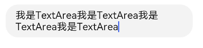
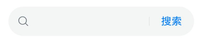
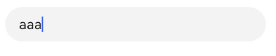
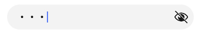
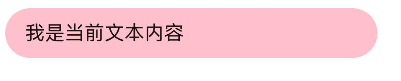
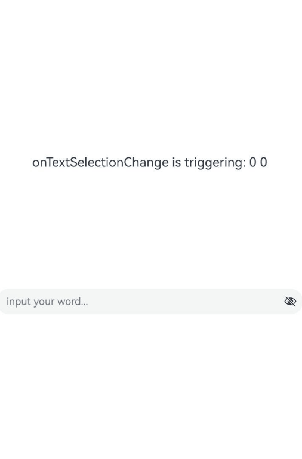
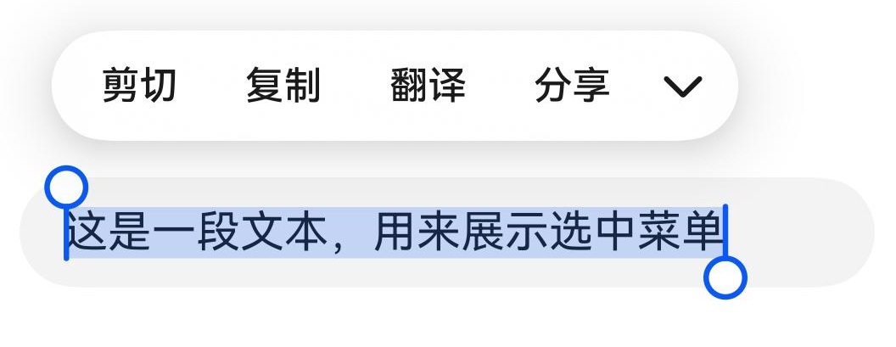
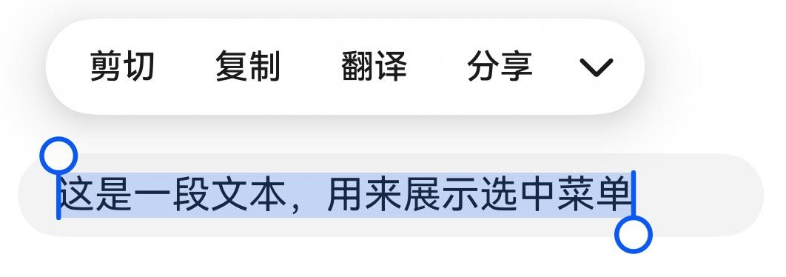
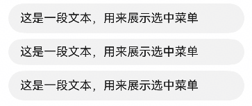
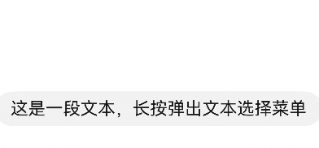

# 文本输入 (TextInput/TextArea/Search)
<!--Kit: ArkUI-->
<!--Subsystem: ArkUI-->
<!--Owner: @kangshihui-->
<!--Designer: @xiangyuan6-->
<!--Tester: @jiaoaozihao-->
<!--Adviser: @Brilliantry_Rui-->


TextInput、TextArea是输入框组件，用于响应用户输入，比如评论区的输入、聊天框的输入、表格的输入等，也可以结合其它组件构建功能页面，例如登录注册页面。具体用法请参考[TextInput](../reference/apis-arkui/arkui-ts/ts-basic-components-textinput.md)和[TextArea](../reference/apis-arkui/arkui-ts/ts-basic-components-textarea.md)组件的API文档。Search是特殊的输入框组件，称为搜索框，默认样式包含搜索图标。具体用法请参考[Search](../reference/apis-arkui/arkui-ts/ts-basic-components-search.md)组件的API文档。


>  **说明：**
>
>  仅支持单文本样式，若需实现富文本样式，建议使用[RichEditor](../reference/apis-arkui/arkui-ts/ts-basic-components-richeditor.md)组件。

## 创建输入框

TextInput是单行输入框，TextArea是多行输入框，Search是搜索框。通过以下接口创建这些组件。

- 单行输入框。

  ArkTS-Dyn示例：

  <!-- @[create_text_input](https://gitcode.com/openharmony/applications_app_samples/blob/master/code/DocsSample/ArkUISample/TextComponent/entry/src/main/ets/pages/textInput/CreatTextInput.ets) -->
  
  ``` TypeScript
  TextInput()
  ```

  ArkTS-Sta示例：

  <!-- @[create_text_input](https://gitcode.com/openharmony/applications_app_samples/blob/OpenHarmony_feature_sta_20260331/code/DocsSample/ArkUISample-Sta/TextComponent/entry/src/main/ets/pages/textInput/CreatTextInput.ets) -->

  ``` TypeScript
  import { TextInput } from '@kit.ArkUI';
  // ...
  TextInput()
  ```

  


- 多行输入框，文字超出一行时会自动折行。

  ArkTS-Dyn示例：

  <!-- @[create_text_area_example](https://gitcode.com/openharmony/applications_app_samples/blob/master/code/DocsSample/ArkUISample/TextComponent/entry/src/main/ets/pages/textInput/CreatTextInput.ets) -->
  
  ``` TypeScript
  /* 请将$r('app.string.CreatTextInput_textContent')替换为实际资源文件，在本示例中该资源文件的value值为
   * "我是TextArea我是TextArea我是TextArea我是TextArea"
   */
  TextArea({ text: $r('app.string.CreatTextInput_textContent') })
    .width(300)
  ```

  ArkTS-Sta示例：

  <!-- @[create_text_area_example](https://gitcode.com/openharmony/applications_app_samples/blob/OpenHarmony_feature_sta_20260331/code/DocsSample/ArkUISample-Sta/TextComponent/entry/src/main/ets/pages/textInput/CreatTextInput.ets) -->

  ``` TypeScript
  import { TextArea, $r } from '@kit.ArkUI';
  // ...
  /* 请将$r('app.string.CreatTextInput_textContent')替换为实际资源文件，在本示例中该资源文件的value值为
   * "我是TextArea我是TextArea我是TextArea我是TextArea"
   */
  TextArea({ text: $r('app.string.CreatTextInput_textContent') })
    .width(300)
  ```

  

- 搜索框。

  ArkTS-Dyn示例：

  <!-- @[create_text_search](https://gitcode.com/openharmony/applications_app_samples/blob/master/code/DocsSample/ArkUISample/TextComponent/entry/src/main/ets/pages/textInput/CreatTextInput.ets) -->
  
  ``` TypeScript
  Search()
    // 请将$r('app.string.Creat_TextInput_Content')替换为实际资源文件，在本示例中该资源文件的value值为"搜索"
    .searchButton($r('app.string.Creat_TextInput_Content'))
  ```

  ArkTS-Sta示例：

  <!-- @[create_text_search](https://gitcode.com/openharmony/applications_app_samples/blob/OpenHarmony_feature_sta_20260331/code/DocsSample/ArkUISample-Sta/TextComponent/entry/src/main/ets/pages/textInput/CreatTextInput.ets) -->

  ``` TypeScript
  import { Search, $r } from '@kit.ArkUI';
  // ...
  Search()
  // 请将$r('app.string.Creat_TextInput_Content')替换为实际资源文件，在本示例中该资源文件的value值为"搜索"
    .searchButton(this.getUIContext()
      .getHostContext()!.resourceManager.getStringSync($r('app.string.Creat_TextInput_Content').id) as string)
  ```

  

## 设置输入框类型

TextInput、TextArea和Search都支持设置输入框类型，通过type属性进行设置，但是各组件的枚举值略有不同。下面以单行输入框为例进行说明。

TextInput有以下类型可选择：Normal基本输入、Password密码输入、Email邮箱地址输入模式。通过[type](../reference/apis-arkui/arkui-ts/ts-basic-components-textinput.md#type)属性进行设置：

### 基本输入模式

ArkTS-Dyn示例：

<!-- @[set_password_input_type_1](https://gitcode.com/openharmony/applications_app_samples/blob/master/code/DocsSample/ArkUISample/TextComponent/entry/src/main/ets/pages/textInput/SetTextInputType.ets) -->

``` TypeScript
TextInput()
  .type(InputType.Normal)
```

ArkTS-Sta示例：

<!-- @[set_password_input_type_1](https://gitcode.com/openharmony/applications_app_samples/blob/OpenHarmony_feature_sta_20260331/code/DocsSample/ArkUISample-Sta/TextComponent/entry/src/main/ets/pages/textInput/SetTextInputType.ets) -->

``` TypeScript
import { TextInput, InputType } from '@kit.ArkUI';
// ...
TextInput()
  .type(InputType.Normal)
```



### 密码模式

包括Password密码输入模式、NUMBER_PASSWORD纯数字密码模式、NEW_PASSWORD新密码输入模式。

以下示例是Password密码输入模式的输入框。

ArkTS-Dyn示例：

<!-- @[set_password_input_type_2](https://gitcode.com/openharmony/applications_app_samples/blob/master/code/DocsSample/ArkUISample/TextComponent/entry/src/main/ets/pages/textInput/SetTextInputType.ets) -->

``` TypeScript
TextInput()
  .type(InputType.Password)
```

ArkTS-Sta示例：

<!-- @[set_password_input_type_2](https://gitcode.com/openharmony/applications_app_samples/blob/OpenHarmony_feature_sta_20260331/code/DocsSample/ArkUISample-Sta/TextComponent/entry/src/main/ets/pages/textInput/SetTextInputType.ets) -->

``` TypeScript
import { TextInput, InputType } from '@kit.ArkUI';
// ...
TextInput()
  .type(InputType.Password)
```



### 邮箱地址输入模式

邮箱地址输入模式的输入框，只能存在一个@符号。

ArkTS-Dyn示例：

<!-- @[set_email_input_type_3](https://gitcode.com/openharmony/applications_app_samples/blob/master/code/DocsSample/ArkUISample/TextComponent/entry/src/main/ets/pages/textInput/SetTextInputType.ets) -->

``` TypeScript
TextInput()
  .type(InputType.Email)
```

ArkTS-Sta示例：

<!-- @[set_email_input_type_3](https://gitcode.com/openharmony/applications_app_samples/blob/OpenHarmony_feature_sta_20260331/code/DocsSample/ArkUISample-Sta/TextComponent/entry/src/main/ets/pages/textInput/SetTextInputType.ets) -->

``` TypeScript
import { TextInput, InputType } from '@kit.ArkUI';
// ...
TextInput()
  .type(InputType.Email)
```


## 设置输入框样式
可以通过style、placeholder、backgroundColor、contentType等属性设置输入框样式。更丰富的样式可以结合[通用属性](../reference/apis-arkui/arkui-ts/ts-component-general-attributes.md)实现。

### 设置输入框多态样式

TextInput、TextArea支持设置输入框多态样式，通过[style](../reference/apis-arkui/arkui-ts/ts-basic-components-textarea.md#style10)属性进行设置。下面以多行输入框TextArea为例进行说明。

TextArea有以下2种类型可选择：默认风格，入参是TextContentStyle.DEFAULT；内联模式，也称内联输入风格，入参是TextContentStyle.INLINE。

- 默认风格的输入框，在编辑态和非编辑态，样式没有区别。

  ArkTS-Dyn示例：

  <!-- @[textArea_style_default](https://gitcode.com/openharmony/applications_app_samples/blob/master/code/DocsSample/ArkUISample/TextComponent/entry/src/main/ets/pages/textInput/SetInputMultiTypeStyle.ets) -->
  
  ``` TypeScript
  TextArea()
    .style(TextContentStyle.DEFAULT)
  ```

  ArkTS-Sta示例：

  <!-- @[textArea_style_default](https://gitcode.com/openharmony/applications_app_samples/blob/OpenHarmony_feature_sta_20260331/code/DocsSample/ArkUISample-Sta/TextComponent/entry/src/main/ets/pages/textInput/SetInputMultiTypeStyle.ets) -->
  
  ``` TypeScript
  TextArea()
    .style(TextContentStyle.DEFAULT)
  ```

  

- 内联模式，也称内联输入风格。内联模式的输入框在编辑态和非编辑态样式有明显区分。

  ArkTS-Dyn示例：

  <!-- @[textArea_style_inline](https://gitcode.com/openharmony/applications_app_samples/blob/master/code/DocsSample/ArkUISample/TextComponent/entry/src/main/ets/pages/textInput/SetInputMultiTypeStyle.ets) -->
  
  ``` TypeScript
  TextArea()
    .style(TextContentStyle.INLINE)
  ```

  ArkTS-Sta示例：

  <!-- @[textArea_style_inline](https://gitcode.com/openharmony/applications_app_samples/blob/OpenHarmony_feature_sta_20260331/code/DocsSample/ArkUISample-Sta/TextComponent/entry/src/main/ets/pages/textInput/SetInputMultiTypeStyle.ets) -->
  
  ``` TypeScript
  TextArea()
    .style(TextContentStyle.INLINE)
  ```

  

### 设置无输入时的提示文本

以下示例展示无输入时提示文本的效果。

ArkTS-Dyn示例：

<!-- @[custom_text_input_with_place_holder](https://gitcode.com/openharmony/applications_app_samples/blob/master/code/DocsSample/ArkUISample/TextComponent/entry/src/main/ets/pages/textInput/CustomTextInputStyle.ets) -->

``` TypeScript
// 请将$r('app.string.i_am_placeholder')替换为实际资源文件，在本示例中该资源文件的value值为"我是提示文本"
TextInput({ placeholder: $r('app.string.i_am_placeholder') })
```

ArkTS-Sta示例：

<!-- @[custom_text_input_with_place_holder](https://gitcode.com/openharmony/applications_app_samples/blob/OpenHarmony_feature_sta_20260331/code/DocsSample/ArkUISample-Sta/TextComponent/entry/src/main/ets/pages/textInput/CustomTextInputStyle.ets) -->

``` TypeScript
// 请将$r('app.string.i_am_placeholder')替换为实际资源文件，在本示例中该资源文件的value值为"我是提示文本"
TextInput({ placeholder: $r('app.string.i_am_placeholder') })
```


### 设置输入框当前的文本内容

以下示例展示输入框内当前输入文本效果。

ArkTS-Dyn示例：

<!-- @[custom_text_input_with_place_holder_and_text](https://gitcode.com/openharmony/applications_app_samples/blob/master/code/DocsSample/ArkUISample/TextComponent/entry/src/main/ets/pages/textInput/CustomTextInputStyle.ets) -->

``` TypeScript
TextInput({
  // 请将$r('app.string.i_am_placeholder')替换为实际资源文件，在本示例中该资源文件的value值为"我是提示文本"
  placeholder: $r('app.string.i_am_placeholder'),
  // 请将$r('app.string.i_am_current_text_content')替换为实际资源文件，在本示例中该资源文件的value值为"我是当前文本内容"
  text: $r('app.string.i_am_current_text_content')
})
```

ArkTS-Sta示例：

<!-- @[custom_text_input_with_place_holder_and_text](https://gitcode.com/openharmony/applications_app_samples/blob/OpenHarmony_feature_sta_20260331/code/DocsSample/ArkUISample-Sta/TextComponent/entry/src/main/ets/pages/textInput/CustomTextInputStyle.ets) -->

``` TypeScript
TextInput({
  // 请将$r('app.string.i_am_placeholder')替换为实际资源文件，在本示例中该资源文件的value值为"我是提示文本"
  placeholder: $r('app.string.i_am_placeholder'),
  // 请将$r('app.string.i_am_current_text_content')替换为实际资源文件，在本示例中该资源文件的value值为"我是当前文本内容"
  text: $r('app.string.i_am_current_text_content')
})
```


### 设置输入框背景颜色

以下示例展示设置输入框背景颜色效果。

ArkTS-Dyn示例：

<!-- @[custom_text_input_background_color](https://gitcode.com/openharmony/applications_app_samples/blob/master/code/DocsSample/ArkUISample/TextComponent/entry/src/main/ets/pages/textInput/CustomTextInputStyle.ets) -->

``` TypeScript
TextInput({
  // 请将$r('app.string.i_am_placeholder')替换为实际资源文件，在本示例中该资源文件的value值为"我是提示文本"
  placeholder: $r('app.string.i_am_placeholder'),
  // 请将$r('app.string.i_am_current_text_content')替换为实际资源文件，在本示例中该资源文件的value值为"我是当前文本内容"
  text: $r('app.string.i_am_current_text_content')
})
  .backgroundColor(Color.Pink)
```

ArkTS-Sta示例：

<!-- @[custom_text_input_background_color](https://gitcode.com/openharmony/applications_app_samples/blob/OpenHarmony_feature_sta_20260331/code/DocsSample/ArkUISample-Sta/TextComponent/entry/src/main/ets/pages/textInput/CustomTextInputStyle.ets) -->

``` TypeScript
TextInput({
  // 请将$r('app.string.i_am_placeholder')替换为实际资源文件，在本示例中该资源文件的value值为"我是提示文本"
  placeholder: $r('app.string.i_am_placeholder'),
  // 请将$r('app.string.i_am_current_text_content')替换为实际资源文件，在本示例中该资源文件的value值为"我是当前文本内容"
  text: $r('app.string.i_am_current_text_content')
})
  .backgroundColor(Color.Pink)
```



### 设置输入框自动填充类型

输入框可以通过[contentType](../reference/apis-arkui/arkui-ts/ts-basic-components-textinput.md#contenttype12)属性设置自动填充类型。

支持的类型请参考[ContentType](../reference/apis-arkui/arkui-ts/ts-basic-components-textinput.md#contenttype12枚举说明)。

ArkTS-Dyn示例：

<!-- @[auto_fill](https://gitcode.com/openharmony/applications_app_samples/blob/master/code/DocsSample/ArkUISample/TextComponent/entry/src/main/ets/pages/textInput/AutoFill.ets) -->

``` TypeScript
// 请将$r('app.string.Auto_Fill_PlaceHolder')替换为实际资源文件，在本示例中该资源文件的value值为"输入你的邮箱..."
TextInput({ placeholder: $r('app.string.Auto_Fill_PlaceHolder') })
  .width('95%')
  .height(40)
  .margin(20)
  .contentType(ContentType.EMAIL_ADDRESS)
```

ArkTS-Sta示例：

<!-- @[auto_fill](https://gitcode.com/openharmony/applications_app_samples/blob/OpenHarmony_feature_sta_20260331/code/DocsSample/ArkUISample-Sta/TextComponent/entry/src/main/ets/pages/textInput/AutoFill.ets) -->

``` TypeScript
// 请将$r('app.string.Auto_Fill_PlaceHolder')替换为实际资源文件，在本示例中该资源文件的value值为"输入你的邮箱..."
TextInput({ placeholder: $r('app.string.Auto_Fill_PlaceHolder') })
  .width('95%')
  .height(40)
  .margin(20)
  .contentType(ContentType.EMAIL_ADDRESS)
```

## 绑定文本输入框事件

文本框主要用于获取用户输入的信息，并将信息处理成数据进行上传，绑定[onChange](../reference/apis-arkui/arkui-ts/ts-basic-components-textinput.md#onchange)事件可以获取输入框内改变的文本内容，绑定[onSubmit](../reference/apis-arkui/arkui-ts/ts-basic-components-textinput.md#onsubmit)事件可以获取回车提交的文本信息，绑定[onTextSelectionChange](../reference/apis-arkui/arkui-ts/ts-basic-components-textinput.md#ontextselectionchange10)事件可以获取文本选中时手柄的位置信息或者编辑时光标的位置信息等等。用户也可以使用通用事件进行相应的交互操作。

>  **说明：**
>
>  在密码模式下，设置[showPassword](../reference/apis-arkui/arkui-ts/ts-basic-components-textinput.md#showpassword12)属性时，在[onSecurityStateChange](../reference/apis-arkui/arkui-ts/ts-basic-components-textinput.md#onsecuritystatechange12)回调中，建议增加状态同步，具体详见如下示例。
>
> [onWillInsert](../reference/apis-arkui/arkui-ts/ts-basic-components-textinput.md#onwillinsert12)、[onDidInsert](../reference/apis-arkui/arkui-ts/ts-basic-components-textinput.md#ondidinsert12)、[onWillDelete](../reference/apis-arkui/arkui-ts/ts-basic-components-textinput.md#onwilldelete12)、[onDidDelete](../reference/apis-arkui/arkui-ts/ts-basic-components-textinput.md#ondiddelete12)回调仅支持系统输入法的场景。
>
> [onWillChange](../reference/apis-arkui/arkui-ts/ts-basic-components-textinput.md#onwillchange15)的回调时序晚于[onWillInsert](../reference/apis-arkui/arkui-ts/ts-basic-components-textinput.md#onwillinsert12)、[onWillDelete](../reference/apis-arkui/arkui-ts/ts-basic-components-textinput.md#onwilldelete12)，早于[onDidInsert](../reference/apis-arkui/arkui-ts/ts-basic-components-textinput.md#ondidinsert12)、[onDidDelete](../reference/apis-arkui/arkui-ts/ts-basic-components-textinput.md#ondiddelete12)。

ArkTS-Dyn示例：

<!-- @[TextInputAddEvent](https://gitcode.com/openharmony/applications_app_samples/blob/master/code/DocsSample/ArkUISample/TextComponent/entry/src/main/ets/pages/textInput/TextInputAddEvent.ets) -->

``` TypeScript
import { hilog } from '@kit.PerformanceAnalysisKit';

const TAG = '[Sample_Textcomponent]';
const DOMAIN = 0xF811;
const BUNDLE = 'Textcomponent_';

@Entry
@Component
struct TextInputEventAdd {
  @State text: string = '';
  @State textStr1: string = '';
  @State textStr2: string = '';
  @State textStr3: string = '';
  @State textStr4: string = '';
  @State textStr5: string = '';
  @State textStr6: string = '';
  @State textStr7: string = '';
  @State textStr8: string = '';
  @State textStr9: string = '';
  @State passwordState: boolean = false;
  controller: TextInputController = new TextInputController();

  build() {
    Row() {
      Column() {
        Text(`${this.textStr1}\n${this.textStr2}\n${this.textStr3}
          \n${this.textStr4}\n${this.textStr5}\n${this.textStr6}
          \n${this.textStr7}\n${this.textStr8}\n${this.textStr9}`)
          .fontSize(20)
          .width('70%')
        TextInput({ text: this.text, placeholder: 'input your word...', controller: this.controller })
          .type(InputType.Password)
          .showPassword(this.passwordState)
          .onChange((value: string) => {
            // 文本内容发生变化时触发该回调
            hilog.info(DOMAIN, TAG, BUNDLE + 'onChange is triggering: ' + value);
            this.textStr1 = `onChange is triggering: ${value}`;
          })
          .onSubmit((enterKey: EnterKeyType, event: SubmitEvent) => {
            // 按下输入法回车键时触发该回调
            hilog.info(DOMAIN, TAG, BUNDLE + 'onSubmit is triggering: ' + enterKey + event.text);
            this.textStr2 = `onSubmit is triggering: ${enterKey} ${event.text}`;
          })
          .onTextSelectionChange((selectionStart: number, selectionEnd: number) => {
            // 文本选择的位置发生变化或编辑状态下光标位置发生变化时，触发该回调
            hilog.info(DOMAIN, TAG, BUNDLE + 'onTextSelectionChange is triggering: ' + selectionStart + selectionEnd);
            this.textStr3 = `onTextSelectionChange is triggering: ${selectionStart} ${selectionEnd}`;
          })
          .onSecurityStateChange((isShowPassword: boolean) => {
            // 密码显隐状态切换时，触发该回调
            hilog.info(DOMAIN, TAG, BUNDLE + 'onSecurityStateChange is triggering: ' + isShowPassword);
            this.passwordState = isShowPassword;
            this.textStr4 = `onSecurityStateChange is triggering: ${isShowPassword}`;
          })
          .onWillInsert((info: InsertValue) => {
            // 在将要输入时，触发该回调
            hilog.info(DOMAIN, TAG, BUNDLE + 'onWillInsert is triggering: ' + info.insertValue + info.insertOffset);
            this.textStr5 = `onWillInsert is triggering: ${info.insertValue} ${info.insertOffset}`;
            return true;
          })
          .onDidInsert((info: InsertValue) => {
            // 在输入完成时，触发该回调
            hilog.info(DOMAIN, TAG, BUNDLE + 'onDidInsert is triggering: ' + info.insertValue + info.insertOffset);
            this.textStr6 = `onDidInsert is triggering: ${info.insertValue} ${info.insertOffset}`;
          })
          .onWillDelete((info: DeleteValue) => {
            // 在将要删除时，触发该回调
            hilog.info(DOMAIN, TAG, BUNDLE + 'onWillDelete is triggering: ' + info.deleteValue + info.deleteOffset);
            this.textStr7 = `onWillDelete is triggering: ${info.deleteValue} ${info.deleteOffset}`;
            return true;
          })
          .onDidDelete((info: DeleteValue) => {
            // 在删除完成时，触发该回调
            hilog.info(DOMAIN, TAG, BUNDLE + 'onDidDelete is triggering: ' + info.deleteValue + info.deleteOffset);
            this.textStr8 = `onDidDelete is triggering: ${info.deleteValue} ${info.deleteOffset}`;
          })
          .onFocus(() => {
            // 绑定通用事件，输入框获焦时触发该回调
            hilog.info(DOMAIN, TAG, BUNDLE + 'onFocus is triggering');
            this.textStr9 = `onFocus is triggering`;
          })
      }.width('100%')
    }
    .height('100%')
  }
}
```

ArkTS-Sta示例：

<!-- @[TextInputAddEvent](https://gitcode.com/openharmony/applications_app_samples/blob/OpenHarmony_feature_sta_20260331/code/DocsSample/ArkUISample-Sta/TextComponent/entry/src/main/ets/pages/textInput/TextInputAddEvent.ets) -->

``` TypeScript
import { Entry, Component, Column, Row, Text, TextInput, InputType, TextInputController, EnterKeyType, SubmitEvent, InsertValue, DeleteValue } from '@kit.ArkUI';
import { State } from '@ohos.arkui.stateManagement';
import hilog from '@ohos.hilog';

const TAG = '[Sample_Textcomponent]';
const DOMAIN = 0xF811;
const BUNDLE = 'Textcomponent_';

@Entry
@Component
export struct TextInputEventAdd {
  @State text: string = '';
  @State textStr1: string = '';
  @State textStr2: string = '';
  @State textStr3: string = '';
  @State textStr4: string = '';
  @State textStr5: string = '';
  @State textStr6: string = '';
  @State textStr7: string = '';
  @State textStr8: string = '';
  @State textStr9: string = '';
  @State passwordState: boolean = false;
  controller: TextInputController = new TextInputController();

  build(): void {
    Row() {
      Column() {
        Text(`${this.textStr1}\n${this.textStr2}\n${this.textStr3}
          \n${this.textStr4}\n${this.textStr5}\n${this.textStr6}
          \n${this.textStr7}\n${this.textStr8}\n${this.textStr9}`)
          .fontSize(20)
        TextInput({ text: this.text, placeholder: 'input your word...', controller: this.controller })
          .type(InputType.Password)
          .showPassword(this.passwordState)
          .onChange((value: string) => {
            // 文本内容发生变化时触发该回调
            hilog.info(DOMAIN, TAG, BUNDLE + 'onChange is triggering: ' + value);
            this.textStr1 = `onChange is triggering: ${value}`;
          })
          .onSubmit((enterKey: EnterKeyType, event: SubmitEvent) => {
            // 按下输入法回车键时触发该回调
            hilog.info(DOMAIN, TAG, BUNDLE + 'onSubmit is triggering: ' + enterKey + event.text);
            this.textStr2 = `onSubmit is triggering: ${enterKey} ${event.text}`;
          })
          .onTextSelectionChange((selectionStart: int, selectionEnd: int) => {
            // 文本选择的位置发生变化或编辑状态下光标位置发生变化时，触发该回调
            hilog.info(DOMAIN, TAG, BUNDLE + 'onTextSelectionChange is triggering: ' + selectionStart + selectionEnd);
            this.textStr3 = `onTextSelectionChange is triggering: ${selectionStart} ${selectionEnd}`;
          })
          .onSecurityStateChange((isShowPassword: boolean) => {
            // 密码显隐状态切换时，触发该回调
            hilog.info(DOMAIN, TAG, BUNDLE + 'onSecurityStateChange is triggering: ' + isShowPassword);
            this.passwordState = isShowPassword;
            this.textStr4 = `onSecurityStateChange is triggering: ${isShowPassword}`;
          })
          .onWillInsert((info: InsertValue) => {
            // 在将要输入时，触发该回调
            hilog.info(DOMAIN, TAG, BUNDLE + 'onWillInsert is triggering: ' + info.insertValue + info.insertOffset);
            this.textStr5 = `onWillInsert is triggering: ${info.insertValue} ${info.insertOffset}`;
            return true;
          })
          .onDidInsert((info: InsertValue) => {
            // 在输入完成时，触发该回调
            hilog.info(DOMAIN, TAG, BUNDLE + 'onDidInsert is triggering: ' + info.insertValue + info.insertOffset);
            this.textStr6 = `onDidInsert is triggering: ${info.insertValue} ${info.insertOffset}`;
          })
          .onWillDelete((info: DeleteValue) => {
            // 在将要删除时，触发该回调
            hilog.info(DOMAIN, TAG, BUNDLE + 'onWillDelete is triggering: ' + info.deleteValue + info.deleteOffset);
            this.textStr7 = `onWillDelete is triggering: ${info.deleteValue} ${info.deleteOffset}`;
            return true;
          })
          .onDidDelete((info: DeleteValue) => {
            // 在删除完成时，触发该回调
            hilog.info(DOMAIN, TAG, BUNDLE + 'onDidDelete is triggering: ' + info.deleteValue + info.deleteOffset);
            this.textStr8 = `onDidDelete is triggering: ${info.deleteValue} ${info.deleteOffset}`;
          })
          .onFocus(() => {
            // 绑定通用事件，输入框获焦时触发该回调
            hilog.info(DOMAIN, TAG, BUNDLE + 'onFocus is triggering');
            this.textStr9 = `onFocus is triggering`;
          })
      }.width('100%')
    }
    .height('100%')
  }
}
```



## 文本菜单管理
TextInput与TextArea组件承载的内容类型为纯文本，不具备图片、混合内容等多类型Span的场景，因此仅提供系统文本菜单。可通过[editMenuOptions](../reference/apis-arkui/arkui-ts/ts-basic-components-textinput.md#editmenuoptions12)接口对系统菜单项进行定制，包括追加自定义菜单项、移除系统菜单项、修改菜单项内容及拦截菜单项点击事件，从而在系统菜单框架内实现菜单选项的自定义。

### 系统菜单

输入框中的文字被选中时会弹出包含剪切、复制、翻译、分享的菜单。

TextInput:

ArkTS-Dyn示例：

<!-- @[select_textinput](https://gitcode.com/openharmony/applications_app_samples/blob/master/code/DocsSample/ArkUISample/TextComponent/entry/src/main/ets/pages/textInput/SelectMenu.ets) -->

``` TypeScript
// 请将$r('app.string.show_selected_menu')替换为实际资源文件，在本示例中该资源文件的value值为"这是一段文本，用来展示选中菜单"
TextInput({ text: $r('app.string.show_selected_menu') })
```

ArkTS-Sta示例：

<!-- @[select_textinput](https://gitcode.com/openharmony/applications_app_samples/blob/OpenHarmony_feature_sta_20260331/code/DocsSample/ArkUISample-Sta/TextComponent/entry/src/main/ets/pages/textInput/SelectMenu.ets) -->

``` TypeScript
import { TextInput, $r } from '@kit.ArkUI';
// ...
// 请将$r('app.string.show_selected_menu')替换为实际资源文件，在本示例中该资源文件的value值为"这是一段文本，用来展示选中菜单"
TextInput({ text: $r('app.string.show_selected_menu') })
```



TextArea:

ArkTS-Dyn示例：

<!-- @[select_textarea](https://gitcode.com/openharmony/applications_app_samples/blob/master/code/DocsSample/ArkUISample/TextComponent/entry/src/main/ets/pages/textInput/SelectMenu.ets) -->

``` TypeScript
// 请将$r('app.string.show_selected_menu')替换为实际资源文件，在本示例中该资源文件的value值为"这是一段文本，用来展示选中菜单"
TextArea({ text: $r('app.string.show_selected_menu') })
```

ArkTS-Sta示例：

<!-- @[select_textarea](https://gitcode.com/openharmony/applications_app_samples/blob/OpenHarmony_feature_sta_20260331/code/DocsSample/ArkUISample-Sta/TextComponent/entry/src/main/ets/pages/textInput/SelectMenu.ets) -->

``` TypeScript
import { TextArea, $r } from '@kit.ArkUI';
// ...
// 请将$r('app.string.show_selected_menu')替换为实际资源文件，在本示例中该资源文件的value值为"这是一段文本，用来展示选中菜单"
TextArea({ text: $r('app.string.show_selected_menu') })
```



### 系统菜单中自定义菜单项
从API version 12开始，该示例通过[editMenuOptions](../reference/apis-arkui/arkui-ts/ts-basic-components-textinput.md#editmenuoptions12)接口实现了文本设置自定义菜单扩展项的文本内容、图标以及回调的功能；从API version 20开始，可以在[onPrepareMenu](../reference/apis-arkui/arkui-ts/ts-text-common.md#属性-1)回调中，进行菜单数据的设置。

ArkTS-Dyn示例：

<!-- @[editMenu_create](https://gitcode.com/openharmony/applications_app_samples/blob/master/code/DocsSample/ArkUISample/TextComponent/entry/src/main/ets/pages/textInput/SelectMenu.ets) -->

``` TypeScript
onCreateMenu = (menuItems: Array<TextMenuItem>) => {
  // $r('app.media.startIcon')需要替换为开发者所需的图像资源文件。
  // 从API version 23开始支持TextMenuItemId.autoFill
  const idsToFilter: TextMenuItemId[] = [
    TextMenuItemId.autoFill
  ]
  const items = menuItems.filter(item => !idsToFilter.some(id => id.equals(item.id)))
  let item1: TextMenuItem = {
    content: 'create1',
    icon: $r('app.media.startIcon'),
    id: TextMenuItemId.of('create1'),
  };
  let item2: TextMenuItem = {
    content: 'create2',
    id: TextMenuItemId.of('create2'),
    icon: $r('app.media.startIcon'),
  };
  items.push(item1);
  items.unshift(item2);
  return items;
}
onMenuItemClick = (menuItem: TextMenuItem, textRange: TextRange) => {
  if (menuItem.id.equals(TextMenuItemId.of('create2'))) {
    hilog.info(0x0000, 'testTag', '%{public}s', 'intercept id: create2 start:' + textRange.start + '; end:' + textRange.end);
    return true;
  }
  if (menuItem.id.equals(TextMenuItemId.of('prepare1'))) {
    hilog.info(0x0000, 'testTag', '%{public}s', 'intercept id: prepare1 start:' + textRange.start + '; end:' + textRange.end);
    return true;
  }
  if (menuItem.id.equals(TextMenuItemId.COPY)) {
    hilog.info(0x0000, 'testTag', '%{public}s', 'intercept COPY start:' + textRange.start + '; end:' + textRange.end);
    return true;
  }
  if (menuItem.id.equals(TextMenuItemId.SELECT_ALL)) {
    hilog.info(0x0000, 'testTag', '%{public}s', 'No interception SELECT_ALL start:' + textRange.start + '; end:' + textRange.end);
    return false;
  }
  return false;
}
// $r('app.media.startIcon')需要替换为开发者所需的图像资源文件。
onPrepareMenu = (menuItems: Array<TextMenuItem>) => {
  let item1: TextMenuItem = {
    content: 'prepare1_' + this.endIndex,
    icon: $r('app.media.startIcon'),
    id: TextMenuItemId.of('prepare1'),
  };
  menuItems.unshift(item1);
  return menuItems;
}
@State editMenuOptions: EditMenuOptions = {
  onCreateMenu: this.onCreateMenu,
  onMenuItemClick: this.onMenuItemClick,
  onPrepareMenu: this.onPrepareMenu
};
```

<!-- @[editMenu_textinput](https://gitcode.com/openharmony/applications_app_samples/blob/master/code/DocsSample/ArkUISample/TextComponent/entry/src/main/ets/pages/textInput/SelectMenu.ets) -->

``` TypeScript
// 请将$r('app.string.show_selected_menu')替换为实际资源文件，在本示例中该资源文件的value值为"这是一段文本，用来展示选中菜单"
TextInput({ text: $r('app.string.show_selected_menu') })
  .editMenuOptions(this.editMenuOptions)
  .onTextSelectionChange((selectionStart: number, selectionEnd: number) => {
    this.endIndex = selectionEnd;
  })
```

ArkTS-Sta示例：

<!-- @[editMenu_create](https://gitcode.com/openharmony/applications_app_samples/blob/OpenHarmony_feature_sta_20260331/code/DocsSample/ArkUISample-Sta/TextComponent/entry/src/main/ets/pages/textInput/SelectMenu.ets) -->

``` TypeScript
onCreateMenu: OnCreateMenuCallback = (menuItems: Array<TextMenuItem>) => {
  let item1: TextMenuItem = {
    content: 'create1',
    icon: $r('app.media.startIcon'),
    id: TextMenuItemId.of('create1'),
  };
  let item2: TextMenuItem = {
    content: 'create2',
    id: TextMenuItemId.of('create2'),
    icon: $r('app.media.startIcon'),
  };
  menuItems.push(item1);
  menuItems.unshift(item2);
  return menuItems;
}
onMenuItemClick: OnMenuItemClickCallback = (menuItem: TextMenuItem, textRange: TextRange) => {
  if (menuItem.id.equals(TextMenuItemId.of('create2'))) {
    hilog.info(0x0000, 'testTag', '%{public}s',
      'intercept id: create2 start:' + textRange.start + '; end:' + textRange.end);
    return true;
  }
  if (menuItem.id.equals(TextMenuItemId.of('prepare1'))) {
    hilog.info(0x0000, 'testTag', '%{public}s',
      'intercept id: prepare1 start:' + textRange.start + '; end:' + textRange.end);
    return true;
  }
  if (menuItem.id.equals(TextMenuItemId.COPY)) {
    hilog.info(0x0000, 'testTag', '%{public}s', 'intercept COPY start:' + textRange.start + '; end:' + textRange.end);
    return true;
  }
  if (menuItem.id.equals(TextMenuItemId.SELECT_ALL)) {
    hilog.info(0x0000, 'testTag', '%{public}s',
      'No interception SELECT_ALL start:' + textRange.start + '; end:' + textRange.end);
    return false;
  }
  return false;
}
// $r('app.media.startIcon')需要替换为开发者所需的图像资源文件。
onPrepareMenu: OnPrepareMenuCallback = (menuItems: Array<TextMenuItem>) => {
  let item1: TextMenuItem = {
    content: 'prepare1_' + this.endIndex,
    icon: $r('app.media.startIcon'),
    id: TextMenuItemId.of('prepare1'),
  };
  menuItems.unshift(item1);
  return menuItems;
}
@State editMenuOptions: EditMenuOptions = {
  onCreateMenu: this.onCreateMenu,
  onMenuItemClick: this.onMenuItemClick,
  onPrepareMenu: this.onPrepareMenu
} as EditMenuOptions;
```

<!-- @[editMenu_textinput](https://gitcode.com/openharmony/applications_app_samples/blob/OpenHarmony_feature_sta_20260331/code/DocsSample/ArkUISample-Sta/TextComponent/entry/src/main/ets/pages/textInput/SelectMenu.ets) -->

``` TypeScript
// 请将$r('app.string.show_selected_menu')替换为实际资源文件，在本示例中该资源文件的value值为"这是一段文本，用来展示选中菜单"
TextInput({ text: $r('app.string.show_selected_menu') })
  .editMenuOptions(this.editMenuOptions)
  .onTextSelectionChange((selectionStart: int, selectionEnd: int) => {
    this.endIndex = selectionEnd;
  })
```



### 系统菜单中屏蔽系统菜单项

从API version 20开始，支持使用[disableSystemServiceMenuItems](../reference/apis-arkui/arkts-apis-uicontext-textmenucontroller.md#disablesystemservicemenuitems20)方法屏蔽文本选择菜单中的所有系统服务菜单项。更多详见[disableSystemServiceMenuItems](../reference/apis-arkui/arkts-apis-uicontext-textmenucontroller.md#disablesystemservicemenuitems20)的API文档接口说明。以下示例只是完整示例工程中的一个示例，为了不影响工程其他页面示例效果，仅在页面的出现和消失生命周期中进行系统服务菜单的禁用和恢复，实际场景可自行选择其他时机，比如[UIAbility](../reference/apis-ability-kit/js-apis-app-ability-uiAbility.md)的[onCreate](../reference/apis-ability-kit/js-apis-app-ability-uiAbility.md#oncreate)和[onDestroy](../reference/apis-ability-kit/js-apis-app-ability-uiAbility.md#ondestroy)。ArkTS-Sta不支持此设置。

<!-- @[DisableSystemServiceMenuItems](https://gitcode.com/openharmony/applications_app_samples/blob/master/code/DocsSample/ArkUISample/TextComponent/entry/src/main/ets/pages/textInput/disablemenu/DisableSystemServiceMenuItems.ets) -->

``` TypeScript
import { TextMenuController } from '@kit.ArkUI';

@Entry
@Component
struct DisableSystemServiceMenuItem {
  aboutToAppear(): void {
    // 禁用所有系统服务菜单项
    TextMenuController.disableSystemServiceMenuItems(true)
  }

  aboutToDisappear(): void {
    // 页面消失时恢复系统服务菜单项
    TextMenuController.disableSystemServiceMenuItems(false)
  }

  build() {
    Row() {
      Column() {
        // 请将$r('app.string.ProhibitSelectMenu_content')替换为实际资源文件，在本示例中该资源文件的value值为"这是一个TextInput，长按弹出文本选择菜单"
        TextInput({ text: $r('app.string.ProhibitSelectMenu_content') })
          .height(60)
          .fontStyle(FontStyle.Italic)
          .fontWeight(FontWeight.Bold)
          .textAlign(TextAlign.Center)
          .caretStyle({ width: '4vp' })
          .editMenuOptions({
            onCreateMenu: (menuItems: Array<TextMenuItem>) => {
              // menuItems不包含被屏蔽的系统菜单项
              return menuItems
            },
            onMenuItemClick: (menuItem: TextMenuItem, textRange: TextRange) => {
              return false
            }
          })
      }.width('100%')
    }
    .height('100%')
  }
}
```


从API version 20开始，支持使用[disableMenuItems](../reference/apis-arkui/arkts-apis-uicontext-textmenucontroller.md#disablemenuitems20)方法屏蔽文本选择菜单中指定的系统服务菜单项。更多详见[disableMenuItems](../reference/apis-arkui/arkts-apis-uicontext-textmenucontroller.md#disablemenuitems20)的API文档接口说明。以下示例只是完整示例工程中的一个示例，为了不影响工程其他页面示例效果，仅在页面的出现和消失生命周期中进行系统服务菜单的禁用和恢复，实际场景可自行选择其他时机，比如[UIAbility](../reference/apis-ability-kit/js-apis-app-ability-uiAbility.md)的[onCreate](../reference/apis-ability-kit/js-apis-app-ability-uiAbility.md#oncreate)和[onDestroy](../reference/apis-ability-kit/js-apis-app-ability-uiAbility.md#ondestroy)。ArkTS-Sta不支持此设置。


<!-- @[DisableMenuItems](https://gitcode.com/openharmony/applications_app_samples/blob/master/code/DocsSample/ArkUISample/TextComponent/entry/src/main/ets/pages/textInput/disablemenu/DisableMenuItems.ets) -->

``` TypeScript
import { TextMenuController } from '@kit.ArkUI';

@Entry
@Component
struct DisableMenuItem {
  aboutToAppear(): void {
    // 禁用搜索，翻译和AI帮写
    TextMenuController.disableMenuItems([TextMenuItemId.SEARCH, TextMenuItemId.TRANSLATE, TextMenuItemId.AI_WRITER])
  }

  aboutToDisappear(): void {
    // 页面消失时恢复系统服务菜单项
    TextMenuController.disableMenuItems([])
  }

  build() {
    Row() {
      Column() {
        // 请将$r('app.string.ProhibitSelectMenu_content')替换为实际资源文件，在本示例中该资源文件的value值为"这是一个TextInput，长按弹出文本选择菜单"
        TextInput({ text: $r('app.string.ProhibitSelectMenu_content') })
          .height(60)
          .fontStyle(FontStyle.Italic)
          .fontWeight(FontWeight.Bold)
          .textAlign(TextAlign.Center)
          .caretStyle({ width: '4vp' })
          .editMenuOptions({
            onCreateMenu: (menuItems: Array<TextMenuItem>) => {
              // menuItems不包含搜索和翻译
              return menuItems;
            },
            onMenuItemClick: (menuItem: TextMenuItem, textRange: TextRange) => {
              return false
            }
          })
      }.width('100%')
    }
    .height('100%')
  }
}
```


### 在子窗口中显示文本菜单

TextInput组件通过设置[TextMenuShowMode](../reference/apis-arkui/arkui-ts/ts-text-common.md#textmenushowmode16)控制文本菜单在哪个窗口中渲染。主窗口模式下，菜单节点挂载到主窗口根节点，菜单可能被页面内容遮挡、受页面滚动影响；子窗口模式下，菜单节点挂载到独立子窗口的根节点，菜单浮在主窗口之上，不受页面布局影响。

ArkTS-Dyn示例：

<!-- @[set_menu_options_with_textmenushowmode](https://gitcode.com/openharmony/applications_app_samples/blob/master/code/DocsSample/ArkUISample/TextComponent/entry/src/main/ets/pages/textInput/TextMenuShowSubWindow.ets) -->

``` TypeScript
this.getUIContext()
  .getTextMenuController()
  .setMenuOptions(
    {
      showMode: TextMenuShowMode.PREFER_WINDOW
    }
  );
```

<!-- @[textmenushowmode_create_textinput](https://gitcode.com/openharmony/applications_app_samples/blob/master/code/DocsSample/ArkUISample/TextComponent/entry/src/main/ets/pages/textInput/TextMenuShowSubWindow.ets) -->

``` TypeScript
// 请将$r('app.string.Service_MenuItems_Text')替换为实际资源文件，在本示例中该资源文件的value值为"这是一段文本，长按弹出文本选择菜单"
TextInput({ text: $r('app.string.Service_MenuItems_Text') })
  .fontSize(20)
  .copyOption(CopyOptions.InApp)
  .textAlign(TextAlign.Center)
```


ArkTS-Sta示例：

<!-- @[set_menu_options_with_textmenushowmode](https://gitcode.com/openharmony/applications_app_samples/blob/OpenHarmony_feature_sta_20260331/code/DocsSample/ArkUISample-Sta/TextComponent/entry/src/main/ets/pages/textInput/TextMenuShowSubWindow.ets) --> 

``` TypeScript
this.getUIContext()
  .getTextMenuController()
  .setMenuOptions(
    {
      showMode: TextMenuShowMode.PREFER_WINDOW
    }
  );
```


<!-- @[textmenushowmode_create_text](https://gitcode.com/openharmony/applications_app_samples/blob/OpenHarmony_feature_sta_20260331/code/DocsSample/ArkUISample-Sta/TextComponent/entry/src/main/ets/pages/textInput/TextMenuShowSubWindow.ets) --> 

``` TypeScript
// 请将$r('app.string.Service_MenuItems_Text')替换为实际资源文件，在本示例中该资源文件的value值为"这是一段文本，长按弹出文本选择菜单"
TextInput({ text: $r('app.string.Service_MenuItems_Text')})
  .fontSize(15)
  .margin({ top: 100 })
  .copyOption(CopyOptions.InApp)
```




## 设置输入框避让

提供对键盘避让与光标避让两种场景示例。

## 键盘避让

键盘抬起后，具有滚动能力的容器组件在横竖屏切换时，才会生效键盘避让，若希望无滚动能力的容器组件也生效键盘避让，建议在组件外嵌套一层具有滚动能力的容器组件，比如[Scroll](../reference/apis-arkui/arkui-ts/ts-container-scroll.md)、[List](../reference/apis-arkui/arkui-ts/ts-container-list.md)、[Grid](../reference/apis-arkui/arkui-ts/ts-container-grid.md)。

ArkTS-Dyn示例：

<!-- @[keyboard_avoid](https://gitcode.com/openharmony/applications_app_samples/blob/master/code/DocsSample/ArkUISample/TextComponent/entry/src/main/ets/pages/textInput/KeyboardAvoidance.ets) -->

``` TypeScript
@Entry
@Component
struct KeyboardAvoid {
  placeHolderArr: string[] = ['1', '2', '3', '4', '5', '6', '7'];

  build() {
    Scroll() {
      Column() {
        ForEach(this.placeHolderArr, (placeholder: string) => {
          TextInput({ placeholder: 'TextInput ' + placeholder })
            .margin(30)
            // ···
        })
      }
    }
    .height('100%')
    .width('100%')
  }
}
```

ArkTS-Sta示例：

<!-- @[keyboard_avoid](https://gitcode.com/openharmony/applications_app_samples/blob/OpenHarmony_feature_sta_20260331/code/DocsSample/ArkUISample-Sta/TextComponent/entry/src/main/ets/pages/textInput/KeyboardAvoidance.ets) -->

``` TypeScript
import { Entry, Component, Column, Scroll, ForEach, TextInput } from '@kit.ArkUI';

@Entry
@Component
export struct KeyboardAvoid {
  placeHolderArr: string[] = ['1', '2', '3', '4', '5', '6', '7'];

  build(): void {
    Scroll() {
      Column() {
        ForEach(this.placeHolderArr, (placeholder: string) => {
          TextInput({ placeholder: 'TextInput ' + placeholder })
            .margin(30)
            // ...
        })
      }
    }
    .height('100%')
    .width('100%')
  }
}
```


## 光标避让

[keyBoardAvoidMode](../reference/apis-arkui/arkts-apis-uicontext-e.md#keyboardavoidmode11)枚举中的OFFSET和RESIZE在键盘抬起后，不支持二次避让。如果想要支持光标位置在点击或者通过接口设置变化后发生二次避让，可以考虑使用OFFSET_WITH_CARET和RESIZE_CARET替换原有的OFFSET和RESIZE模式。<br>

对于滚动容器更推荐使用RESIZE_WITH_CARET，非滚动容器应该使用OFFSET_WITH_CARET。

ArkTS-Sta不支持设置上述避让模式。

<!-- @[cursor_avoid_part1](https://gitcode.com/openharmony/applications_app_samples/blob/master/code/DocsSample/ArkUISample/TextComponent/entry/src/main/ets/entryability/EntryAbility.ets) -->

``` TypeScript
import { hilog } from '@kit.PerformanceAnalysisKit';
import { window } from '@kit.ArkUI';
import { KeyboardAvoidMode } from '@kit.ArkUI';
```

<!-- @[cursor_avoid_part2](https://gitcode.com/openharmony/applications_app_samples/blob/master/code/DocsSample/ArkUISample/TextComponent/entry/src/main/ets/entryability/EntryAbility.ets) -->

``` TypeScript
// Used in UIAbility
onWindowStageCreate(windowStage: window.WindowStage): void {
  // Main window is created, set main page for this ability
  hilog.info(0x0000, 'testTag', '%{public}s', 'Ability onWindowStageCreate');

  windowStage.loadContent('pages/Index', (err, data) => {
    let keyboardAvoidMode = windowStage.getMainWindowSync().getUIContext().getKeyboardAvoidMode();
    windowStage.getMainWindowSync().getUIContext().setKeyboardAvoidMode(KeyboardAvoidMode.OFFSET_WITH_CARET);
    if (err.code) {
      hilog.error(0x0000, 'testTag', 'Failed to load the content. Cause: %{public}s', JSON.stringify(err) ?? '');
      return;
    }
    hilog.info(0x0000, 'testTag', 'Succeeded in loading the content. Data: %{public}s', JSON.stringify(data) ?? '');
  });
}
```

<!-- @[cursor_avoid](https://gitcode.com/openharmony/applications_app_samples/blob/master/code/DocsSample/ArkUISample/TextComponent/entry/src/main/ets/pages/textInput/CursorAvoidance.ets) -->

``` TypeScript
@Entry
@Component
struct CursorAvoid {
  @State caretPosition: number = 600;
  areaController: TextAreaController = new TextAreaController();
  text = 'Most of us compare ourselves with anyone we think is happier — a relative, someone we know a lot,' +
    ' or someone we hardly know. As a result, what we do remember is anything that makes others happy, ' +
    'anything that makes ourselves unhappy,' +
    ' totally forgetting that there is something happy in our own life.\
    So the best way to destroy happiness is to look at something and focus on even the smallest flaw. ' +
    'It is the smallest flaw that would make us complain. And it is the complaint that leads to us becoming unhappy.\
    If one chooses to be happy, he will be blessed; if he chooses to be unhappy, he will be cursed. ' +
    'Happiness is just what you think will make you happy.' +
    'Most of us compare ourselves with anyone we think is happier — a relative, someone we know a lot, ' +
    'or someone we hardly know. As a result, what we do remember is anything that makes others happy, ' +
    'anything that makes ourselves unhappy, totally forgetting that there is something happy in our own life.\
  ';

  build() {
    Scroll() {
      Column() {
        Row() {
          Button('CaretPosition++: ' + this.caretPosition).onClick(() => {
            this.caretPosition += 1;
          }).fontSize(10)
          Button('CaretPosition--: ' + this.caretPosition).onClick(() => {
            this.caretPosition -= 1;
          }).fontSize(10)
          Button('SetCaretPosition: ').onClick(() => {
            this.areaController.caretPosition(this.caretPosition);
          }).fontSize(10)
        }

        TextArea({ text: this.text, controller: this.areaController })
          .width('100%')
          .fontSize('20fp')
      }
    }.width('100%').height('100%')
  }
}
```


<!--RP1--><!--RP1End-->