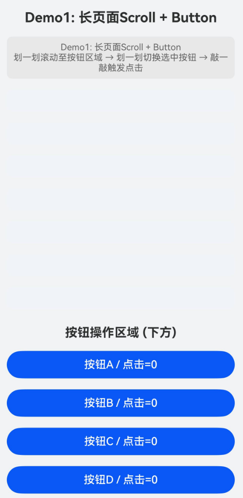
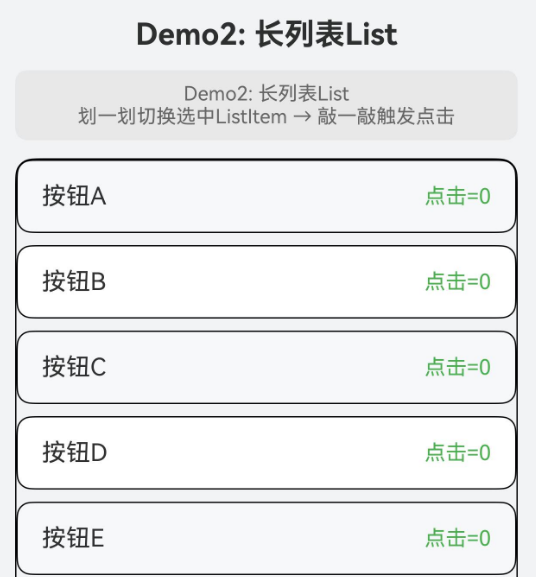
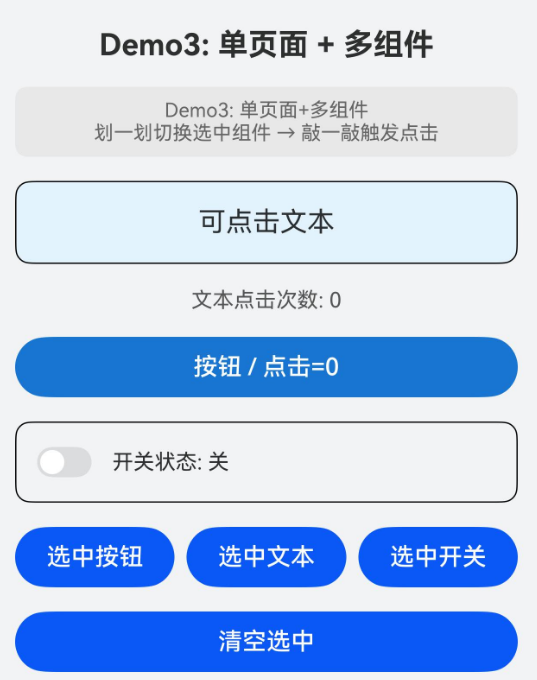
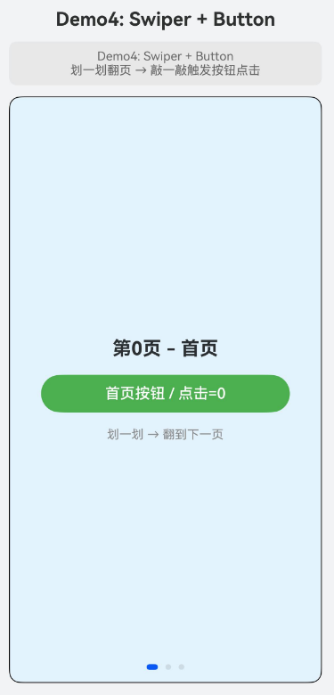

# 支持智慧手势输入事件
<!--Kit: ArkUI-->
<!--Subsystem: ArkUI-->
<!--Owner: @yihao-lin-->
<!--Designer: @piggyguy-->
<!--Tester: @songyanhong-->
<!--Adviser: @Brilliantry_Rui-->

从API版本26.0.0开始支持智慧手势。智慧手势指用户通过设备上的“敲一敲”，“划一划”和“翻腕”的隔空手势，实现对界面组件的选中、点击、滚动、翻页和返回等交互动作的能力。系统会根据用户的操作意图自动推断目标组件和执行动作，开发者也可接收当前手势的默认动作处理并进行自定义干预。

智慧手势交互依赖组件的[id](../reference/apis-arkui/arkui-ts/ts-universal-attributes-component-id.md#id)标识和[smartGestureShortcut](../reference/apis-arkui/arkui-ts/ts-universal-attributes-smart-gesture-shortcut.md#smartgestureshortcut)属性配置，系统据此识别可响应手势的组件。开发者通过[SmartGestureController](../reference/apis-arkui/arkts-apis-uicontext-smartgesturecontroller.md)获取控制器实例，使能手势、注册监听回调，并根据系统推断的手势意图动态决策最终执行的动作。

> **说明：**
>
> - 智慧手势的敲一敲和划一划操作需通过[enableSmartTapAndSlideGestures](../reference/apis-arkui/arkts-apis-uicontext-smartgesturecontroller.md#enablesmarttapandslidegestures)接口显式启用，关闭后组件侧的smartGestureShortcut配置仍会保留，但不会响应敲一敲和划一划手势。
> - 智慧手势的翻腕手势默认开启，不受到enableSmartTapAndSlideGestures接口影响。
> - 智慧手势仅可在Stage模型下使用。

## 基本概念

* 智慧手势：用户通过设备上的“敲一敲”，“划一划”和“翻腕”的隔空手势，实现对界面组件的选中、点击、滚动、翻页和返回等交互动作的能力。

* 操作意图（OperateIntention）：用户底层操作的语义分类，取值范围参考[OperateIntention](../reference/apis-arkui/arkui-ts/ts-appendix-enums.md#operateintention)。

* 执行动作（SmartGestureAction）：系统根据操作意图推断的最终执行动作，取值范围参考[SmartGestureAction](../reference/apis-arkui/arkui-ts/ts-appendix-enums.md#smartgestureaction)。

* 动作处理（ActionProposal）：开发者通过监听回调返回的具体操作类型，包括[ClickActionProposal](../reference/apis-arkui/arkts-apis-uicontext-smartgesturecontroller.md#clickactionproposal)、[SelectActionProposal](../reference/apis-arkui/arkts-apis-uicontext-smartgesturecontroller.md#selectactionproposal)、[ScrollActionProposal](../reference/apis-arkui/arkts-apis-uicontext-smartgesturecontroller.md#scrollactionproposal)、[PageSwitchActionProposal](../reference/apis-arkui/arkts-apis-uicontext-smartgesturecontroller.md#pageswitchactionproposal)、[BackPressActionProposal](../reference/apis-arkui/arkts-apis-uicontext-smartgesturecontroller.md#backpressactionproposal)、[NoneActionProposal](../reference/apis-arkui/arkts-apis-uicontext-smartgesturecontroller.md#noneactionproposal)类型。

* 手势处理结果（[GestureHandlingResolution](../reference/apis-arkui/arkts-apis-uicontext-smartgesturecontroller.md#gesturehandlingresolution)）：监听回调的返回值，声明是否消费本次手势以及选择何种动作处理。当isConsumed为true时消费手势，若同时设置了selectedProposal则以自定义动作处理替代系统默认动作；当isConsumed为false时不消费手势，系统将本次手势视为未处理。

* 选中态：组件成功进入选中态后会显示选中提示框，选中框样式根据设备有所不同。开发者可通过[requestSelected](../reference/apis-arkui/arkts-apis-uicontext-smartgesturecontroller.md#requestselected)主动请求组件进入选中态，通过[clearSelected](../reference/apis-arkui/arkts-apis-uicontext-smartgesturecontroller.md#clearselected)清空选中态。

## 交互流程

智慧手势的完整交互流程如下。

1. 使能手势：页面出现时调用[enableSmartTapAndSlideGestures](../reference/apis-arkui/arkts-apis-uicontext-smartgesturecontroller.md#enablesmarttapandslidegestures)启用敲一敲和划一划手势。

2. 标记组件：为需要响应智慧手势的组件设置[id](../reference/apis-arkui/arkui-ts/ts-universal-attributes-component-id.md#id)和[smartGestureShortcut](../reference/apis-arkui/arkui-ts/ts-universal-attributes-smart-gesture-shortcut.md#smartgestureshortcut)属性，声明其响应优先级和可选中能力。

3. 注册监听：调用[registerMonitor](../reference/apis-arkui/arkts-apis-uicontext-smartgesturecontroller.md#registermonitor)注册监听回调，在系统处理手势前接收手势意图并进行自定义决策。

4. 动态决策：在监听回调中，根据回调返回的具体操作类型ActionProposal和用户实际的操作意图，构造合适的ActionProposal，通过GestureHandlingResolution返回处理结果。

5. 关闭手势：页面消失时调用[clearMonitors](../reference/apis-arkui/arkts-apis-uicontext-smartgesturecontroller.md#clearmonitors)清空监听回调，并调用[enableSmartTapAndSlideGestures](../reference/apis-arkui/arkts-apis-uicontext-smartgesturecontroller.md#enablesmarttapandslidegestures)关闭手势使能。

## 智慧手势开发指导

下面描述了如何启用并监听智慧手势，以及如何动态决策智慧手势的响应行为。

### 启用并监听智慧手势

以下步骤展示了智慧手势最基础的接入流程：启用手势、标记目标组件、注册监听回调，并在回调中根据系统推断的动作类型进行动态决策。

1. 获取控制器并使能手势。

   在组件的[aboutToAppear](../reference/apis-arkui/arkui-ts/ts-custom-component-lifecycle.md#abouttoappear)生命周期中获取[SmartGestureController](../reference/apis-arkui/arkts-apis-uicontext-smartgesturecontroller.md)实例，并启用敲一敲和划一划手势。在[aboutToDisappear](../reference/apis-arkui/arkui-ts/ts-custom-component-lifecycle.md#abouttodisappear)中清空监听回调并关闭手势。

   <!-- @[smartgesture_case1_controller](https://gitcode.com/openharmony/applications_app_samples/blob/master/code/DocsSample/ArkUISample/SmartGesture/entry/src/main/ets/pages/Case1.ets) -->
   
   ``` TypeScript
   private controller = this.getUIContext().getSmartGestureController();
   // ...
   aboutToAppear(): void {
     this.controller.enableSmartTapAndSlideGestures(true);
     this.controller.registerMonitor(this.callback);
   }
   
   aboutToDisappear(): void {
     this.controller.clearMonitors();
     this.controller.enableSmartTapAndSlideGestures(false);
   }
   ```

2. 标记可响应手势的组件。

   为每个需要响应智慧手势的交互组件设置id和smartGestureShortcut属性。action设为GestureShortcut.PRIMARY表示该组件为首选响应目标，selectable设为true表示该组件可被选中。

   <!-- @[smartgesture_case1_button](https://gitcode.com/openharmony/applications_app_samples/blob/master/code/DocsSample/ArkUISample/SmartGesture/entry/src/main/ets/pages/Case1.ets) -->
   
   ``` TypeScript
   Button(`按钮A / 点击=${this.btn0Count}`)
     .id('btn_a')
     .width('100%')
     .smartGestureShortcut({ action: GestureShortcut.PRIMARY, enabled: true, selectable: true })
     .onClick(() => {
       this.btn0Count += 1;
       this.hint = '按钮A onClick 触发';
     })
   ```

3. 注册监听回调并动态决策。

   在监听回调中，将[BaseGestureHandlingProposal](../reference/apis-arkui/arkts-apis-uicontext-smartgesturecontroller.md#basegesturehandlingproposal)转换为[TargetedGestureProposal](../reference/apis-arkui/arkts-apis-uicontext-smartgesturecontroller.md#targetedgestureproposal)以获取系统推断的目标节点，根据action类型构造对应的ActionProposal并返回GestureHandlingResolution。

> **说明：**
>
> 多个监听回调按后注册先执行的顺序触发，某个回调消费手势后后续回调不再执行。
> 回调返回值必须是合法的GestureHandlingResolution实例，否则改写不生效。

   <!-- @[smartgesture_case1_proposal](https://gitcode.com/openharmony/applications_app_samples/blob/master/code/DocsSample/ArkUISample/SmartGesture/entry/src/main/ets/pages/Case1.ets) -->
   
   ``` TypeScript
   import {
     BaseGestureHandlingProposal,
     ClickActionProposal,
     GestureHandlingResolution,
     ScrollActionProposal,
     SelectActionProposal,
     TargetedGestureProposal,
   } from '@kit.ArkUI';
   // ...
     private callback = (proposal: BaseGestureHandlingProposal): GestureHandlingResolution => {
       let targetProposal = proposal as TargetedGestureProposal;
       let nodeId = targetProposal.node ? targetProposal.node.getId() : '';
       this.hint = `意图=${proposal.operateIntention}, 动作=${proposal.action}, 目标=${nodeId}`;
       const resolution = new GestureHandlingResolution(true);
   
       if (proposal.action === SmartGestureAction.CLICK) {
         if (nodeId) {
           const node = this.getUIContext().getFrameNodeById(nodeId);
           if (node) {
             resolution.selectedProposal = new ClickActionProposal(node);
           }
         }
       } else if (proposal.action === SmartGestureAction.SELECT) {
         if (nodeId) {
           const node = this.getUIContext().getFrameNodeById(nodeId);
           if (node) {
             resolution.selectedProposal = new SelectActionProposal(node);
           }
         }
       } else if (proposal.action === SmartGestureAction.SCROLL_FORWARD) {
         const node = this.getUIContext().getFrameNodeById('long_scroll');
         if (node) {
           resolution.selectedProposal = new ScrollActionProposal(node, 200);
         }
       }
   
       return resolution;
     };
   ```

**完整示例：**

该示例包含以下3步。
- 在aboutToAppear中启用智慧手势并注册监听回调，在aboutToDisappear中清空监听回调并关闭手势。
- 为滚动容器设置id，为底部4个按钮设置id和smartGestureShortcut属性。
- 在监听回调中，当action为CLICK时执行点击、为SELECT时执行选中、为SCROLL_FORWARD时会使当前页面向下滚动200vp。

> **说明：**
>
> ClickActionProposal遵循“先选中，再点击”语义，当节点尚未被选中时不会立即触发点击。

<!-- @[smartgesture_case1](https://gitcode.com/openharmony/applications_app_samples/blob/master/code/DocsSample/ArkUISample/SmartGesture/entry/src/main/ets/pages/Case1.ets) -->

``` TypeScript
import {
  BaseGestureHandlingProposal,
  ClickActionProposal,
  GestureHandlingResolution,
  ScrollActionProposal,
  SelectActionProposal,
  TargetedGestureProposal,
} from '@kit.ArkUI';

@Entry
@Component
struct Demo1 {
  private controller = this.getUIContext().getSmartGestureController();
  @State hint: string = 'Demo1: 长页面Scroll + Button\n划一划滚动至按钮区域 → 划一划切换选中按钮 → 敲一敲触发点击';
  @State btn0Count: number = 0;
  @State btn1Count: number = 0;
  @State btn2Count: number = 0;
  @State btn3Count: number = 0;

  private callback = (proposal: BaseGestureHandlingProposal): GestureHandlingResolution => {
    let targetProposal = proposal as TargetedGestureProposal;
    let nodeId = targetProposal.node ? targetProposal.node.getId() : '';
    this.hint = `意图=${proposal.operateIntention}, 动作=${proposal.action}, 目标=${nodeId}`;
    const resolution = new GestureHandlingResolution(true);

    if (proposal.action === SmartGestureAction.CLICK) {
      if (nodeId) {
        const node = this.getUIContext().getFrameNodeById(nodeId);
        if (node) {
          resolution.selectedProposal = new ClickActionProposal(node);
        }
      }
    } else if (proposal.action === SmartGestureAction.SELECT) {
      if (nodeId) {
        const node = this.getUIContext().getFrameNodeById(nodeId);
        if (node) {
          resolution.selectedProposal = new SelectActionProposal(node);
        }
      }
    } else if (proposal.action === SmartGestureAction.SCROLL_FORWARD) {
      const node = this.getUIContext().getFrameNodeById('long_scroll');
      if (node) {
        resolution.selectedProposal = new ScrollActionProposal(node, 200);
      }
    }

    return resolution;
  };

  aboutToAppear(): void {
    this.controller.enableSmartTapAndSlideGestures(true);
    this.controller.registerMonitor(this.callback);
  }

  aboutToDisappear(): void {
    this.controller.clearMonitors();
    this.controller.enableSmartTapAndSlideGestures(false);
  }

  build() {
    Scroll() {
      Column({ space: 16 }) {
        Text('Demo1: 长页面Scroll + Button')
          .fontSize(20)
          .fontWeight(FontWeight.Bold)
          .width('100%')
          .textAlign(TextAlign.Center)

        Text(this.hint)
          .fontSize(13)
          .fontColor('#666')
          .width('100%')
          .textAlign(TextAlign.Center)
          .padding(8)
          .borderRadius(8)
          .backgroundColor('#e8e8e8')

        ForEach([0, 1, 2, 3, 4, 5, 6], (item: number) => {
          Column() {
            Text()
              .fontSize(15)
              .width('100%')
              .padding(16)
              .borderRadius(8)
              .backgroundColor('#f0f4f8')
          }
        })

        Text('按钮操作区域 (下方)')
          .fontSize(18)
          .fontWeight(FontWeight.Bold)
          .width('100%')
          .textAlign(TextAlign.Center)
          .margin({ top: 8 })

        Button(`按钮A / 点击=${this.btn0Count}`)
          .id('btn_a')
          .width('100%')
          .smartGestureShortcut({ action: GestureShortcut.PRIMARY, enabled: true, selectable: true })
          .onClick(() => {
            this.btn0Count += 1;
            this.hint = '按钮A onClick 触发';
          })

        Button(`按钮B / 点击=${this.btn1Count}`)
          .id('btn_b')
          .width('100%')
          .smartGestureShortcut({ action: GestureShortcut.PRIMARY, enabled: true, selectable: true })
          .onClick(() => {
            this.btn1Count += 1;
            this.hint = '按钮B onClick 触发';
          })

        Button(`按钮C / 点击=${this.btn2Count}`)
          .id('btn_c')
          .width('100%')
          .smartGestureShortcut({ action: GestureShortcut.PRIMARY, enabled: true, selectable: true })
          .onClick(() => {
            this.btn2Count += 1;
            this.hint = '按钮C onClick 触发';
          })

        Button(`按钮D / 点击=${this.btn3Count}`)
          .id('btn_d')
          .width('100%')
          .smartGestureShortcut({ action: GestureShortcut.PRIMARY, enabled: true, selectable: true })
          .onClick(() => {
            this.btn3Count += 1;
            this.hint = '按钮D onClick 触发';
          })
      }
      .width('100%')
      .padding(16)
    }
    .id('long_scroll')
    .width('100%')
    .height('100%')
    .backgroundColor('#f1f3f5')
  }
}
```



### 长列表场景

当页面使用[List](../reference/apis-arkui/arkui-ts/ts-container-list.md)组件展示大量可选中列表项时，划一划手势可选中列表项，敲一敲手势可触发列表项的点击。滚动动作需要指定List组件作为滚动目标。

> **说明：**
>
> 长列表场景中ScrollActionProposal的distance参数应根据列表项高度合理设置，通常设为单个列表项的高度（如100vp），避免滚动过大导致用户错过内容。

<!-- @[smartgesture_case2](https://gitcode.com/openharmony/applications_app_samples/blob/master/code/DocsSample/ArkUISample/SmartGesture/entry/src/main/ets/pages/Case2.ets) -->

``` TypeScript
import {
  BaseGestureHandlingProposal,
  ClickActionProposal,
  GestureHandlingResolution,
  ScrollActionProposal,
  SelectActionProposal,
  TargetedGestureProposal,
} from '@kit.ArkUI';

@Entry
@Component
struct Demo2 {
  private controller = this.getUIContext().getSmartGestureController();
  @State hint: string = 'Demo2: 长列表List\n划一划切换选中ListItem → 敲一敲触发点击';
  @State clickCounts: number[] = [0, 0, 0, 0, 0, 0, 0, 0, 0, 0, 0, 0];
  private items: string[] = ['按钮A', '按钮B', '按钮C', '按钮D', '按钮E', '按钮F',
    '按钮G', '按钮H', '按钮I', '按钮J', '按钮K', '按钮L'];

  private callback = (proposal: BaseGestureHandlingProposal): GestureHandlingResolution => {
    let targetProposal = proposal as TargetedGestureProposal;
    let nodeId = targetProposal.node ? targetProposal.node.getId() : '';
    this.hint = `意图=${proposal.operateIntention}, 动作=${proposal.action}, 目标=${nodeId}`;
    const resolution = new GestureHandlingResolution(true);

    if (proposal.action === SmartGestureAction.CLICK) {
      if (nodeId) {
        const node = this.getUIContext().getFrameNodeById(nodeId);
        if (node) {
          resolution.selectedProposal = new ClickActionProposal(node);
        }
      }
    } else if (proposal.action === SmartGestureAction.SELECT) {
      if (nodeId) {
        const node = this.getUIContext().getFrameNodeById(nodeId);
        if (node) {
          resolution.selectedProposal = new SelectActionProposal(node);
        }
      }
    } else if (proposal.action === SmartGestureAction.SCROLL_FORWARD) {
      const node = this.getUIContext().getFrameNodeById('long_list');
      if (node) {
        resolution.selectedProposal = new ScrollActionProposal(node, 100);
      }
    }

    return resolution;
  };

  aboutToAppear(): void {
    this.controller.enableSmartTapAndSlideGestures(true);
    this.controller.registerMonitor(this.callback);
  }

  aboutToDisappear(): void {
    this.controller.clearMonitors();
    this.controller.enableSmartTapAndSlideGestures(false);
  }

  build() {
    Column({ space: 12 }) {
      Text('Demo2: 长列表List')
        .fontSize(20)
        .fontWeight(FontWeight.Bold)
        .width('100%')
        .textAlign(TextAlign.Center)

      Text(this.hint)
        .fontSize(13)
        .fontColor('#666')
        .width('100%')
        .textAlign(TextAlign.Center)
        .padding(8)
        .borderRadius(8)
        .backgroundColor('#e8e8e8')

      List({ space: 8 }) {
        ForEach(this.items, (item: string, index?: number) => {
          ListItem() {
            Row() {
              Text(item)
                .fontSize(16)
                .layoutWeight(1)
              Text(`点击=${this.clickCounts[index ?? 0]}`)
                .fontSize(14)
                .fontColor('#4caf50')
            }
            .width('100%')
            .padding({ left: 16, right: 16, top: 14, bottom: 14 })
            .borderRadius(10)
            .borderWidth(1)
            .backgroundColor(index! % 2 === 0 ? '#f6f8fa' : '#ffffff')
            .id(`list_item_${index}`)
            .smartGestureShortcut({ action: GestureShortcut.PRIMARY, enabled: true, selectable: true })
            .onClick(() => {
              const idx = index ?? 0;
              this.clickCounts[idx] += 1;
              this.hint = `${item} onClick 触发, 点击次数=${this.clickCounts[idx]}`;
            })
          }
        })
      }
      .id('long_list')
      .width('100%')
      .layoutWeight(1)
      .borderRadius(12)
      .borderWidth(1)
    }
    .width('100%')
    .height('100%')
    .padding(16)
    .backgroundColor('#f1f3f5')
  }
}
```



### 多组件类型场景手动控制选中态

在非滚动的单页面中，可能存在[Text](../reference/apis-arkui/arkui-ts/ts-basic-components-text.md)、[Button](../reference/apis-arkui/arkui-ts/ts-basic-components-button.md)、[Toggle](../reference/apis-arkui/arkui-ts/ts-basic-components-toggle.md)等多种类型的交互组件。此时不需要处理滚动和翻页动作，仅处理CLICK和SELECT。开发者可通过[requestSelected](../reference/apis-arkui/arkts-apis-uicontext-smartgesturecontroller.md#requestselected)主动请求某个组件进入选中态，通过[clearSelected](../reference/apis-arkui/arkts-apis-uicontext-smartgesturecontroller.md#clearselected)清空选中态。

该示例包含以下操作。
- 划一划手势选中Text、Button或Toggle组件，敲一敲手势触发选中组件的[onClick](../reference/apis-arkui/arkui-ts/ts-universal-events-click.md#onclick)事件。
- 通过“选中按钮”，“选中文本”和“选中开关”按钮调用requestSelected手动请求组件进入选中态。
- 通过“清空选中”按钮调用clearSelected清除当前选中态。

> **说明：**
>
> requestSelected仅当目标组件满足以下全部条件时请求才会生效：组件可以响应智慧手势（smartGestureShortcut中enabled为true）、组件在屏幕内可见、且组件绑定了onClick或绑定了单击手势[TapGesture](../reference/apis-arkui/arkui-ts/ts-basic-gestures-tapgesture.md)。

<!-- @[smartgesture_case3](https://gitcode.com/openharmony/applications_app_samples/blob/master/code/DocsSample/ArkUISample/SmartGesture/entry/src/main/ets/pages/Case3.ets) -->

``` TypeScript
import {
  BaseGestureHandlingProposal,
  ClickActionProposal,
  GestureHandlingResolution,
  SelectActionProposal,
  TargetedGestureProposal,
} from '@kit.ArkUI';

@Entry
@Component
struct Demo3 {
  private controller = this.getUIContext().getSmartGestureController();
  @State hint: string = 'Demo3: 单页面+多组件\n划一划切换选中组件 → 敲一敲触发点击';
  @State btnCount: number = 0;
  @State textClickCount: number = 0;
  @State toggleOn: boolean = false;
  @State sliderVal: number = 30;

  private callback = (proposal: BaseGestureHandlingProposal): GestureHandlingResolution => {
    let targetProposal = proposal as TargetedGestureProposal;
    let nodeId = targetProposal.node ? targetProposal.node.getId() : '';
    this.hint = `意图=${proposal.operateIntention}, 动作=${proposal.action}, 目标=${nodeId}`;
    const resolution = new GestureHandlingResolution(true);

    if (proposal.action === SmartGestureAction.CLICK) {
      if (nodeId) {
        const node = this.getUIContext().getFrameNodeById(nodeId);
        if (node) {
          resolution.selectedProposal = new ClickActionProposal(node);
        }
      }
    } else if (proposal.action === SmartGestureAction.SELECT) {
      if (nodeId) {
        const node = this.getUIContext().getFrameNodeById(nodeId);
        if (node) {
          resolution.selectedProposal = new SelectActionProposal(node);
        }
      }
    }

    return resolution;
  };

  aboutToAppear(): void {
    this.controller.enableSmartTapAndSlideGestures(true);
    this.controller.registerMonitor(this.callback);
  }

  aboutToDisappear(): void {
    this.controller.clearMonitors();
    this.controller.enableSmartTapAndSlideGestures(false);
  }

  build() {
    Scroll() {
      Column({ space: 16 }) {
        Text('Demo3: 单页面 + 多组件')
          .fontSize(20)
          .fontWeight(FontWeight.Bold)
          .width('100%')
          .textAlign(TextAlign.Center)

        Text(this.hint)
          .fontSize(13)
          .fontColor('#666')
          .width('100%')
          .textAlign(TextAlign.Center)
          .padding(8)
          .borderRadius(8)
          .backgroundColor('#e8e8e8')

        Text('可点击文本')
          .id('comp_text')
          .fontSize(18)
          .width('100%')
          .padding(16)
          .borderRadius(10)
          .borderWidth(1)
          .textAlign(TextAlign.Center)
          .backgroundColor('#e3f2fd')
          .smartGestureShortcut({ action: GestureShortcut.PRIMARY, enabled: true, selectable: true })
          .onClick(() => {
            this.textClickCount += 1;
            this.hint = `文本 onClick 触发, 点击=${this.textClickCount}`;
          })

        Row() {
          Text(`文本点击次数: ${this.textClickCount}`)
            .fontSize(14)
            .fontColor('#555')
        }.width('100%').justifyContent(FlexAlign.Center)

        Button(`按钮 / 点击=${this.btnCount}`)
          .id('comp_button')
          .width('100%')
          .backgroundColor('#1976d2')
          .smartGestureShortcut({ action: GestureShortcut.PRIMARY, enabled: true, selectable: true })
          .onClick(() => {
            this.btnCount += 1;
            this.hint = `按钮 onClick 触发, 点击=${this.btnCount}`;
          })

        Row() {
          Toggle({ type: ToggleType.Switch, isOn: this.toggleOn })
            .id('comp_toggle')
            .selectedColor('#4caf50')
            .smartGestureShortcut({ action: GestureShortcut.PRIMARY, enabled: true, selectable: true })
            .onChange((isOn: boolean) => {
              this.toggleOn = isOn;
              this.hint = `Toggle onChange → ${isOn ? '开' : '关'}`;
            })
          Text(`开关状态: ${this.toggleOn ? '开' : '关'}`)
            .fontSize(14)
            .margin({ left: 12 })
        }
        .width('100%')
        .padding(12)
        .borderRadius(10)
        .borderWidth(1)
        .justifyContent(FlexAlign.Start)

        Row({ space: 8 }) {
          Button('选中按钮').layoutWeight(1)
            .onClick(() => this.controller.requestSelected('comp_button'))
          Button('选中文本').layoutWeight(1)
            .onClick(() => this.controller.requestSelected('comp_text'))
          Button('选中开关').layoutWeight(1)
            .onClick(() => this.controller.requestSelected('comp_toggle'))
        }.width('100%')

        Button('清空选中')
          .width('100%')
          .onClick(() => {
            this.controller.clearSelected();
            this.hint = '选中已清空';
          })
      }
      .width('100%')
      .padding(16)
    }
    .width('100%')
    .height('100%')
    .backgroundColor('#f1f3f5')
  }
}
```



### Swiper组件翻页场景

当页面使用[Swiper](../reference/apis-arkui/arkui-ts/ts-container-swiper.md)组件展示多页内容时，划一划手势可翻页切换Swiper页面。此时需要使用[PageSwitchActionProposal](../reference/apis-arkui/arkts-apis-uicontext-smartgesturecontroller.md#pageswitchactionproposal)指定翻页目标容器和翻页数量。

该示例包含以下操作。
- 划一划手势可翻页切换Swiper页面，使用PageSwitchActionProposal指定翻页数量为1页。
- 敲一敲手势可点击当前页面的按钮。
- Swiper需设置loop为false以避免循环翻页导致手势意图混乱。

> **说明：**
>
> PageSwitchActionProposal的pageCount参数取值范围为[0, +∞)，单位为页，小于0时按0处理。默认方向为向前翻页（包括向右和向下）。

<!-- @[smartgesture_case4](https://gitcode.com/openharmony/applications_app_samples/blob/master/code/DocsSample/ArkUISample/SmartGesture/entry/src/main/ets/pages/Case4.ets) -->

``` TypeScript
import {
  BaseGestureHandlingProposal,
  ClickActionProposal,
  GestureHandlingResolution,
  PageSwitchActionProposal,
  SelectActionProposal,
  TargetedGestureProposal,
} from '@kit.ArkUI';

@Entry
@Component
struct Demo4 {
  private controller = this.getUIContext().getSmartGestureController();
  @State hint: string = 'Demo4: Swiper + Button\n划一划翻页 → 敲一敲触发按钮点击';
  @State page0Btn: number = 0;
  @State page1Btn: number = 0;
  @State page2Btn: number = 0;
  @State swiperIndex: number = 0;

  private callback = (proposal: BaseGestureHandlingProposal): GestureHandlingResolution => {
    let targetProposal = proposal as TargetedGestureProposal;
    let nodeId = targetProposal.node ? targetProposal.node.getId() : '';
    this.hint = `意图=${proposal.operateIntention}, 动作=${proposal.action}, 目标=${nodeId}`;
    const resolution = new GestureHandlingResolution(true);

    if (proposal.action === SmartGestureAction.CLICK) {
      if (nodeId) {
        const node = this.getUIContext().getFrameNodeById(nodeId);
        if (node) {
          resolution.selectedProposal = new ClickActionProposal(node);
        }
      }
    } else if (proposal.action === SmartGestureAction.SELECT) {
      if (nodeId) {
        const node = this.getUIContext().getFrameNodeById(nodeId);
        if (node) {
          resolution.selectedProposal = new SelectActionProposal(node);
        }
      }
    } else if (proposal.action === SmartGestureAction.PAGE_FORWARD) {
      const node = this.getUIContext().getFrameNodeById('demo_swiper');
      if (node) {
        resolution.selectedProposal = new PageSwitchActionProposal(node, 1);
      }
    }

    return resolution;
  };

  aboutToAppear(): void {
    this.controller.enableSmartTapAndSlideGestures(true);
    this.controller.registerMonitor(this.callback);
  }

  aboutToDisappear(): void {
    this.controller.clearMonitors();
    this.controller.enableSmartTapAndSlideGestures(false);
  }

  build() {
    Column({ space: 12 }) {
      Text('Demo4: Swiper + Button')
        .fontSize(20)
        .fontWeight(FontWeight.Bold)
        .width('100%')
        .textAlign(TextAlign.Center)

      Text(this.hint)
        .fontSize(13)
        .fontColor('#666')
        .width('100%')
        .textAlign(TextAlign.Center)
        .padding(8)
        .borderRadius(8)
        .backgroundColor('#e8e8e8')

      Swiper() {
        Column({ space: 16 }) {
          Text('第0页 - 首页')
            .fontSize(20)
            .fontWeight(FontWeight.Bold)
          Button(`首页按钮 / 点击=${this.page0Btn}`)
            .id('page0_btn')
            .width('80%')
            .backgroundColor('#4caf50')
            .smartGestureShortcut({ action: GestureShortcut.PRIMARY, enabled: true, selectable: true })
            .onClick(() => {
              this.page0Btn += 1;
              this.hint = `第0页按钮 onClick → 点击=${this.page0Btn}`;
            })
          Text('划一划 → 翻到下一页')
            .fontSize(13)
            .fontColor('#888')
        }
        .width('100%')
        .height('100%')
        .justifyContent(FlexAlign.Center)
        .backgroundColor('#e3f2fd')

        Column({ space: 16 }) {
          Text('第1页 - 设置')
            .fontSize(20)
            .fontWeight(FontWeight.Bold)
          Button(`设置按钮 / 点击=${this.page1Btn}`)
            .id('page1_btn')
            .width('80%')
            .backgroundColor('#ff9800')
            .smartGestureShortcut({ action: GestureShortcut.PRIMARY, enabled: true, selectable: true })
            .onClick(() => {
              this.page1Btn += 1;
              this.hint = `第1页按钮 onClick → 点击=${this.page1Btn}`;
            })
          Text('划一划 → 翻到下一页')
            .fontSize(13)
            .fontColor('#888')
        }
        .width('100%')
        .height('100%')
        .justifyContent(FlexAlign.Center)
        .backgroundColor('#fce4ec')

        Column({ space: 16 }) {
          Text('第2页 - 关于')
            .fontSize(20)
            .fontWeight(FontWeight.Bold)
          Button(`关于按钮 / 点击=${this.page2Btn}`)
            .id('page2_btn')
            .width('80%')
            .backgroundColor('#2196f3')
            .smartGestureShortcut({ action: GestureShortcut.PRIMARY, enabled: true, selectable: true })
            .onClick(() => {
              this.page2Btn += 1;
              this.hint = `第2页按钮 onClick → 点击=${this.page2Btn}`;
            })
          Text('划一划 → 翻到下一页')
            .fontSize(13)
            .fontColor('#888')
        }
        .width('100%')
        .height('100%')
        .justifyContent(FlexAlign.Center)
        .backgroundColor('#e8f5e9')
      }
      .id('demo_swiper')
      .width('100%')
      .layoutWeight(1)
      .loop(false)
      .index(0)
      .onChange((index: number) => {
        this.swiperIndex = index;
        this.hint = `Swiper onChange → 第${index}页`;
      })
      .borderRadius(12)
      .borderWidth(1)
    }
    .width('100%')
    .height('100%')
    .padding(16)
    .backgroundColor('#f1f3f5')
  }
}
```


