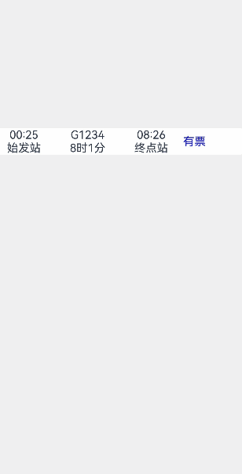

# 绑定全模态页面（bindContentCover）
<!--Kit: ArkUI-->
<!--Subsystem: ArkUI-->
<!--Owner: @CCFFWW-->
<!--Designer: @CCFFWW-->
<!--Tester: @lxl007-->
<!--Adviser: @HelloCrease-->

[全模态页面（bindContentCover）](../reference/apis-arkui/arkui-ts/ts-universal-attributes-modal-transition.md#bindcontentcover)是全屏模态形式的弹窗交互页面，完全覆盖底层父视图。适用于查看大图，全屏查看文稿等场景。

## 使用约束

全模态页面本质上是弹窗类组件，其交互层级默认为应用内顶层。

[Navigation](../reference/apis-arkui/arkui-ts/ts-basic-components-navigation.md)导航转场时，新push的页面层级无法超出全模态，其效果仍然显示在模态页面之下。针对此类场景，建议将模态页面的内容迁移至转场页面中实现。例如，在上述情况下，可以使用NavDestination来替代拉起的模态页面，新push的页面层级低于全模态。

## 生命周期

全模态页面提供了生命周期函数，用于通知应用程序该弹窗的生命周期状态。生命周期的触发顺序依次为：onWillAppear -> onAppear -> onWillDisappear -> onDisappear。

| 名称            |类型| 说明                       |
| ----------------- | ------ | ---------------------------- |
| onWillAppear    | () => void | 全模态页面显示（动画开始前）回调函数。 |
| onAppear    | () => void  | 全模态页面显示（动画结束后）回调函数。  |
| onWillDisappear | () => void | 全模态页面回退（动画开始前）回调函数。 |
| onDisappear |() => void  | 全模态页面回退（动画结束后）回调函数。     |

## 使用bindContentCover构建全屏模态内容覆盖半模态

全模态与半模态之间存在弹窗式的层级交互。后拉起的模态页面能够覆盖先前的模态页面。若开发者期望实现全屏转场，以覆盖半模态，并在全屏页面侧滑退出后，半模态页面仍保持显示，使用bindSheet结合bindContentCover将满足这一场景诉求。

详见[模态转场](arkts-modal-transition.md#使用bindcontentcover构建全屏模态转场效果)章节，了解使用bindContentCover构建全屏模态转场效果。

<!-- @[bindContentCover_demo](https://gitcode.com/openharmony/applications_app_samples/blob/master/code/DocsSample/ArkUISample/BindSheet/entry/src/main/ets/pages/bindContentCover/template6/BindContentCoverDemo.ets) -->

