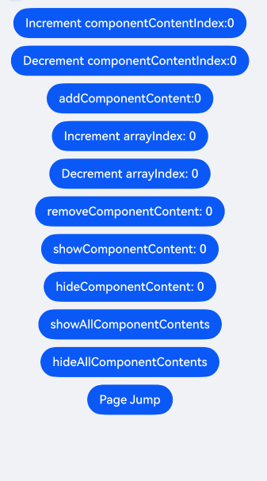
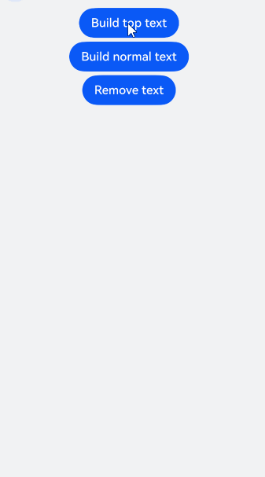

# 设置浮层（OverlayManager）
<!--Kit: ArkUI-->
<!--Subsystem: ArkUI-->
<!--Owner: @liyi0309-->
<!--Designer: @liyi0309-->
<!--Tester: @lxl007-->
<!--Adviser: @HelloCrease-->

浮层（OverlayManager）用于在页面（Page）之上展示自定义的UI内容，位于Dialog、Popup、Menu、BindSheet、BindContentCover和Toast等组件之下，展示范围为当前窗口的安全区内，适用于常驻悬浮等场景。

可以通过使用[UIContext](../reference/apis-arkui/arkts-apis-uicontext-uicontext.md)中的[getOverlayManager](../reference/apis-arkui/arkts-apis-uicontext-uicontext.md#getoverlaymanager12)方法获取当前UI上下文关联的[OverlayManager](../reference/apis-arkui/arkts-apis-uicontext-overlaymanager.md)对象，再通过该对象调用对应方法。

## 规格约束

* OverlayManager上节点的层级在Page页面层级之上，在Dialog、Popup、Menu、BindSheet、BindContentCover和Toast等组件之下。
* OverlayManager添加的节点显示和消失时没有默认动画。
* OverlayManager上节点安全区域内外的绘制方式与Page一致，键盘避让方式与Page一致。
* 推荐使用AppStorage存储与OverlayManager相关的属性，以避免页面切换时属性值变化导致业务错误。
* 当使用API version 19以下版本时，OverlayManager不支持侧滑（左滑/右滑）关闭，需在[onBackPress](../reference/apis-arkui/arkui-ts/ts-custom-component-lifecycle.md#onbackpress)中添加OverlayManager关闭的逻辑。API 19及以上版本可通过配置[OverlayManagerOptions](../reference/apis-arkui/arkts-apis-uicontext-i.md#overlaymanageroptions15)中的enableBackPressedEvent属性设置OverlayManager是否响应侧滑手势。
* OverlayManager中的事件机制优先被WrappedBuilder装饰的组件接收。若需实现浮层底部接收事件，可通过设置hitTestBehavior为HitTestMode.Transparent将事件传递至底层。

## 设置浮层

在OverlayManager上[新增指定节点（addComponentContent）](../reference/apis-arkui/arkts-apis-uicontext-overlaymanager.md#addcomponentcontent12)、[删除指定节点（removeComponentContent）](../reference/apis-arkui/arkts-apis-uicontext-overlaymanager.md#removecomponentcontent12)、[显示所有节点（showAllComponentContents）](../reference/apis-arkui/arkts-apis-uicontext-overlaymanager.md#showallcomponentcontents12)和[隐藏所有节点（hideAllComponentContents）](../reference/apis-arkui/arkts-apis-uicontext-overlaymanager.md#hideallcomponentcontents12)。

<!-- @[OverlayManager_Demo](https://gitcode.com/openharmony/applications_app_samples/blob/master/code/DocsSample/ArkUISample/DialogProject/entry/src/main/ets/pages/OverlayManager/OverlayManagerComponent.ets) -->

显示一个始终在屏幕左侧的悬浮球，点击可以弹出alertDialog弹窗。

<!-- @[OverlayManager_Demo2](https://gitcode.com/openharmony/applications_app_samples/blob/master/code/DocsSample/ArkUISample/DialogProject/entry/src/main/ets/pages/OverlayManager/OverlayManagerAlertDialog.ets) -->

从API version 18开始，可以通过调用UIContext中getOverlayManager方法获取OverlayManager对象，并利用该对象在指定层级上新增指定节点（[addComponentContentWithOrder](../reference/apis-arkui/arkts-apis-uicontext-overlaymanager.md#addcomponentcontentwithorder18)），层次高的浮层会覆盖在层级低的浮层之上。

<!-- @[OverlayManager_Demo3](https://gitcode.com/openharmony/applications_app_samples/blob/master/code/DocsSample/ArkUISample/DialogProject/entry/src/main/ets/pages/OverlayManager/OverlayManagerWithOrder.ets) -->

