# 景深组件 (DepthComponent，仅对系统应用开放)
<!--Kit: ArkUI-->
<!--Subsystem: ArkUI-->
<!--Owner: @houguobiao-->
<!--Designer: @houguobiao-->
<!--Tester: @lxl007-->
<!--Adviser: @Brilliantry_Rui-->

[DepthComponent](../reference/apis-arkui/arkui-ts/ts-basic-components-depthcomponent-sys.md)是一个景深组件，能够利用一张背景图和一张深度图（或自带深度信息的3D模型），把原本平面的内容渲染出立体的空间纵深感，可以简单理解为给平面背景加上“裸眼3D”效果。背景中各像素点依据深度图呈现距离相机远近不同的层次感；子组件（如文字、图标）可以借助空间效果融入这个立体场景，实现被背景物体遮挡、视觉倾斜等真实的空间交互。该组件从API版本26.0.0开始支持。

景深组件常用于壁纸、桌面、锁屏等需要营造立体纵深感与空间沉浸感的场景。

## 基本概念

景深组件把背景资源、深度图、相机、光照、空间效果等多层能力整合为一个组件。

| 能力层 | 组件中的体现 | 说明 |
| -------- | -------- | -------- |
| 背景资源 | [background](../reference/apis-arkui/arkui-ts/ts-basic-components-depthcomponent-sys.md#接口) | 作为景深场景底图的静态图片或3D模型，仅支持glTF和glb格式；图片资源引用方式请参考[加载图片资源](arkts-graphics-display.md#加载图片资源)。 |
| 深度图 | [depthMap](../reference/apis-arkui/arkui-ts/ts-basic-components-depthcomponent-sys.md#depthmap) | 一张黑白的灰度图像，用每个像素的明暗描述背景中该位置距相机的远近——越白越近、越黑越远；背景为静态图片时需设置且需与背景图分辨率一致，背景为3D模型时由模型自带、无需设置。 |
| 相机 | [camera](../reference/apis-arkui/arkui-ts/ts-basic-components-depthcomponent-sys.md#camera) | 配置观察景深场景的虚拟相机，决定从哪个位置与角度拍摄三维场景。 |
| 光照 | [light](../reference/apis-arkui/arkui-ts/ts-basic-components-depthcomponent-sys.md#light) | 定义照射景深场景的光照，为场景补充明暗与色彩，增强立体真实感。 |
| 空间效果 | [spatialEffect](../reference/apis-arkui/arkui-ts/ts-universal-attributes-spatial-effect-sys.md#spatialeffect) | 作用在子组件上的属性，通过设置子组件在三维空间中的位置和遮挡权重，使其与背景产生遮挡、倾斜等空间交互。 |

此外，理解景深组件还会用到几个最基础的图形学概念：

- **三维坐标**：用三个数字确定空间中一个点的位置，其中X表示左右、Y表示上下、Z表示前后。组件中相机的位置、子组件的摆放位置，都用三维坐标描述。

- **向量**：一组数字（常用三个），既能表示一个位置（“这个点在哪里”），也能表示一个方向（“朝哪个方向”）。相机位置position、光照方向direction，本质上都是三维向量。

- **透视投影**：离镜头近的物体看起来大、远的看起来小，即“近大远小”，与人眼看到的完全一致。景深组件正是通过模拟这种透视，让原本平面的背景产生远近层次与纵深感。

- **深度**：物体距相机的远近，是景深效果的核心（背景各像素的深度由深度图提供）；子组件同样有自己的深度，决定它处在背景的哪一层、是否被前面的背景遮挡。

各能力的详细参数与工作机制，见[实现原理](#实现原理)中按渲染管线阶段展开的对应小节。

## 实现原理

DepthComponent通过背景资源与深度图重建三维场景，并借助透视相机渲染出具有空间纵深感的内容。其核心是：依据深度图为背景的每个像素赋予空间深度（背景为3D模型时，深度信息由模型自身提供，无需单独设置深度图），再通过相机参数完成从三维空间到屏幕的投影变换；子组件则通过空间效果参与同一套三维变换，从而与背景产生遮挡、倾斜等真实的空间交互。

整体渲染流程如下：

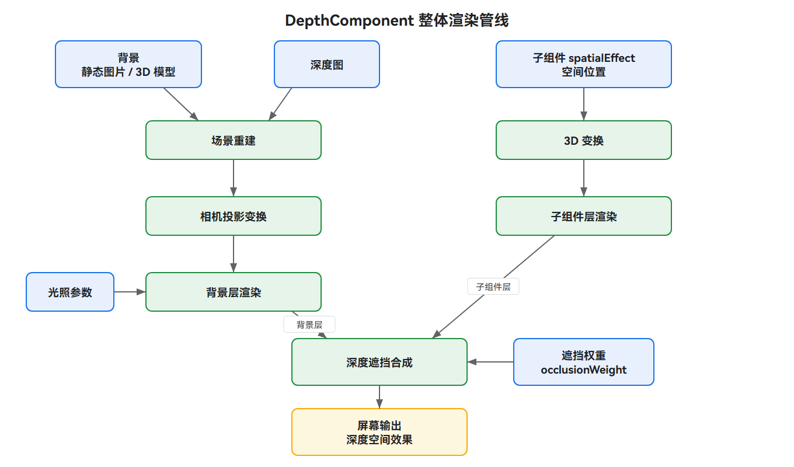

渲染过程主要包含以下几个阶段：

- **[重建场景](#重建场景)**：依据深度图[depthMap](../reference/apis-arkui/arkui-ts/ts-basic-components-depthcomponent-sys.md#depthmap)为背景的每个像素赋予空间深度，由一张平面背景重建出具有立体层次的场景。

- **[投影变换](#投影变换)**：背景与子组件统一经过相同的三维变换管线，完成从三维空间到屏幕像素坐标的投影。

- **[映射子组件空间](#映射子组件空间)**：子组件通过空间效果[spatialEffect](../reference/apis-arkui/arkui-ts/ts-universal-attributes-spatial-effect-sys.md#spatialeffect)设置自身在三维空间中的位置，并以两种坐标模式参与投影。

- **[合成深度遮挡](#合成深度遮挡)**：将子组件深度与背景对应位置的深度进行比较，按遮挡权重[SpatialEffectParams](../reference/apis-arkui/arkui-ts/ts-universal-attributes-spatial-effect-sys.md#spatialeffectparams)决定被背景遮挡的程度。

- **[计算光照](#计算光照)**：通过光照参数[light](../reference/apis-arkui/arkui-ts/ts-basic-components-depthcomponent-sys.md#light)为场景补充明暗效果，增强立体感。

### 重建场景

深度图depthMap记录了背景每个像素点距相机的距离（颜色越白越近，越黑越远）。组件依据深度图为背景的每个像素赋予空间深度，再结合相机参数（位置、旋转、视场角）确定每个像素在屏幕上的投影位置，从而由一张平面背景重建出具有立体层次的场景。

深度图的作用可简单理解为把一张平面背景“分层”，让每个像素带上远近信息，进而重建出立体场景，过程如下：

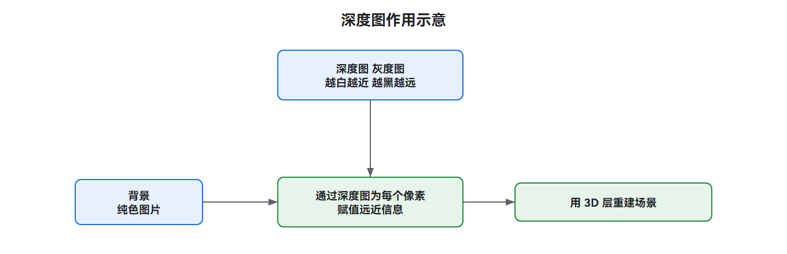

深度图的质量直接决定景深效果，精度不足时，背景各像素的远近关系会失真，导致立体层次错乱、物体边缘断层、子组件与背景的遮挡关系错误，整体纵深感被破坏。因此需要关注深度图的来源和精度。

- **来源**：深度图可通过多种途径获取，包括3D建模软件直接导出（精度最高）、基于ToF、结构光等技术原理的深度相机拍摄、AI（人工智能）深度估计模型从普通照片生成、手工绘制。不同来源的精度与可靠性差异较大，建模导出与专业深度相机采集的深度图通常质量最佳。

- **精度与边缘**：高精度深度图（如建模导出）在物体边缘处层次分明、过渡干脆，景深效果自然；精度较低的深度图（如部分AI生成结果）在物体边缘可能出现模糊或断层，导致景深过渡不自然、产生“分层”或“抠图感”。选择或制作深度图时应尽量保证物体边缘的清晰与连续。

- **视差与深度**：深度图本质记录的是物体距相机的距离；与之相关的视差与深度成反比——视差越大表示物体越近，常用于双目立体匹配。

高精度与低精度深度图在物体边缘与背景上的差异，可参考下图：

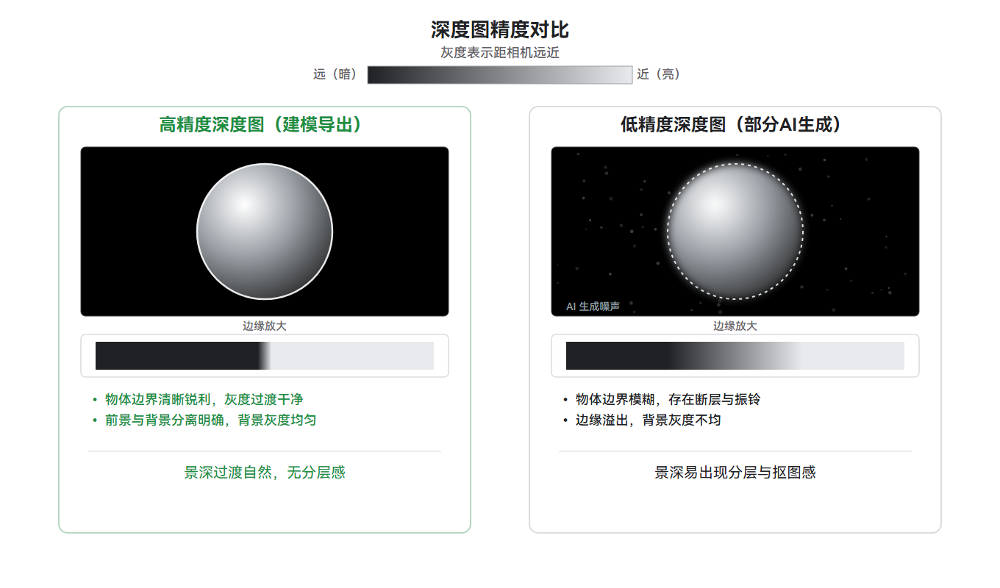

### 投影变换

相机参数[camera](../reference/apis-arkui/arkui-ts/ts-basic-components-depthcomponent-sys.md#camera)用于配置观察景深场景的虚拟相机，主要包括以下参数：

- **[position](../reference/apis-arkui/arkui-ts/ts-basic-components-depthcomponent-sys.md#depthcameraparams)**：相机自身的位置。决定“从哪个位置观察场景”，移动相机会改变看到的远近与角度。

- **[quaternion](../reference/apis-arkui/arkui-ts/ts-basic-components-depthcomponent-sys.md#depthcameraparams)**：相机的旋转（朝向），用四元数按(x, y, z, w)表示。决定“朝哪个方向看”。四元数是一种描述三维旋转的方式，相比直接用角度更平滑，可避免欧拉角旋转中的万向锁（两个旋转轴重合导致丢失一个旋转自由度）问题。

- **[yFov](../reference/apis-arkui/arkui-ts/ts-basic-components-depthcomponent-sys.md#depthcameraparams)**：垂直视场角（弧度）。即相机的视野范围，类似镜头能拍到多宽的画面，值越大视野越广。

- **[zNear](../reference/apis-arkui/arkui-ts/ts-basic-components-depthcomponent-sys.md#depthcameraparams)**：近裁剪面距离。离相机太近（小于该值）的物体会被裁掉、不显示，必须为正数。

- **[zFar](../reference/apis-arkui/arkui-ts/ts-basic-components-depthcomponent-sys.md#depthcameraparams)**：远裁剪面距离。离相机太远（大于该值）的物体会被裁掉、不显示，必须为正数。

- **[cameraBufferCrop](../reference/apis-arkui/arkui-ts/ts-basic-components-depthcomponent-sys.md#camerabuffercrop)**（可选，移轴裁剪）：在不改变相机位置与朝向的前提下，把“裁剪窗口”在背景图所在平面内平移并缩放，只截取画面的某个局部渲染到组件——这与摄影中移轴镜头“平移取景”的原理相通，故又称离轴渲染。常用于从一张高分辨率壁纸中截取并放大某一局部（连同其深度关系一起保留）。包含四个子参数：

  - **[bufferWidth](../reference/apis-arkui/arkui-ts/ts-basic-components-depthcomponent-sys.md#camerabuffercrop) / [bufferHeight](../reference/apis-arkui/arkui-ts/ts-basic-components-depthcomponent-sys.md#camerabuffercrop)**：基准图的宽、高（像素）。应与背景图的真实分辨率一致，作为裁剪坐标的参照系；不一致可能导致显示异常（如渲染位置偏移）。

  - **[cropOffset](../reference/apis-arkui/arkui-ts/ts-basic-components-depthcomponent-sys.md#cropoffset)**：裁剪窗口左上角相对于基准图左上角的偏移量（x、y像素）。改变它即可平移裁剪窗口，实现离轴取景。

  - **[cropScale](../reference/apis-arkui/arkui-ts/ts-basic-components-depthcomponent-sys.md#camerabuffercrop)**：裁剪窗口缩放比例，裁剪窗口基础大小为组件布局尺寸。小于1表示裁剪窗口更小、对应放大局部；大于1表示裁剪窗口更大、对应缩小内容。

未设置时，默认以组件布局尺寸为基准图、偏移 (0, 0)、缩放1.0，即渲染整图的默认映射；需要截取局部渲染时可参考[使用移轴裁剪渲染背景局部](#使用移轴裁剪渲染背景局部)示例。

其中yFov、zNear、zFar是后续示例里反复出现的核心参数：yFov控制视野广度，zNear与zFar共同圈定一个“可视范围”，只有距相机的距离落在 [zNear, zFar] 之间的物体才会被渲染出来。

各参数在成像中的关系可参考下图（侧视示意）：

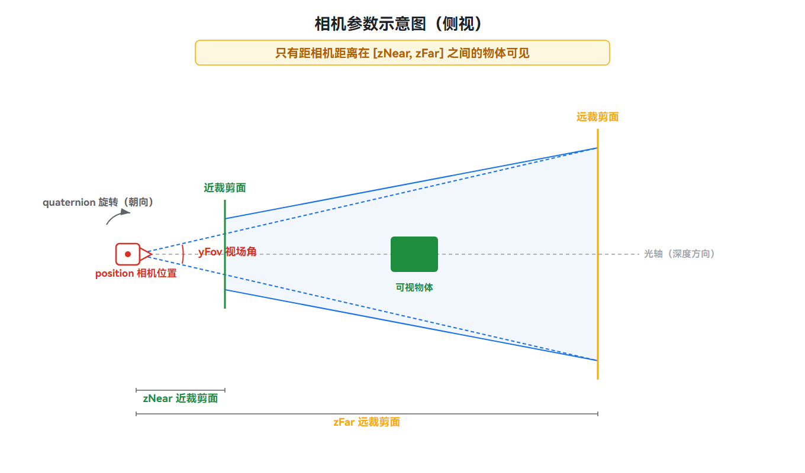

其中position、quaternion、yFov、zNear、zFar决定相机在空间中“看到”的范围，如上图（侧视）所示；而cameraBufferCrop控制的是在已成像的画面里截取哪个区域，属于正视图（图像平面）上的概念，其裁剪窗口的平移与缩放关系见下图（正视）：

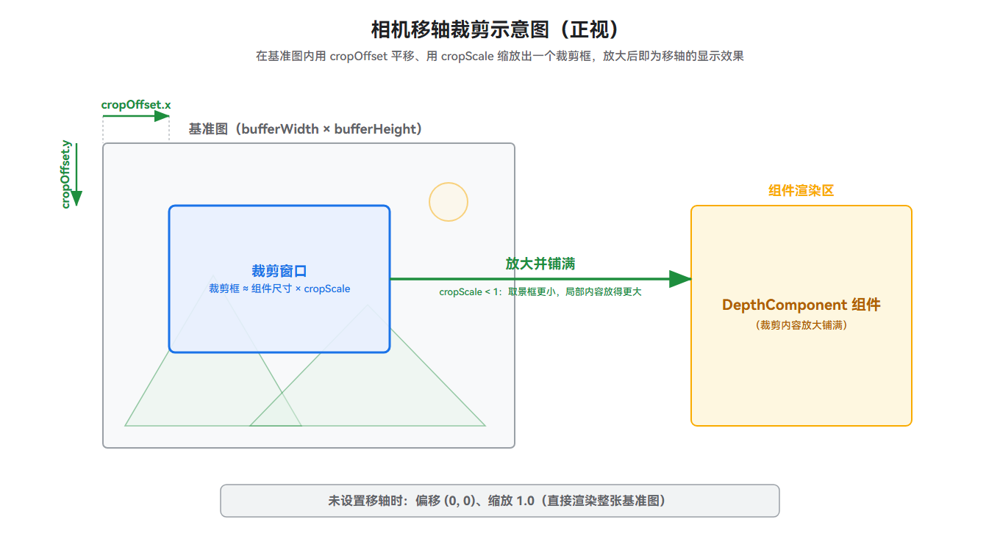

经过场景重建与相机设置后，背景与子组件统一经过相同的三维变换管线，相机依据position与quaternion将世界坐标变换到观察空间（“相机眼中的世界”），再结合yFov、zNear、zFar与组件宽高比进行透视投影、变换到裁剪空间，经透视除法得到归一化设备坐标（Normalized Device Coordinates，NDC），最后通过视口变换映射到屏幕像素坐标，过程如下：

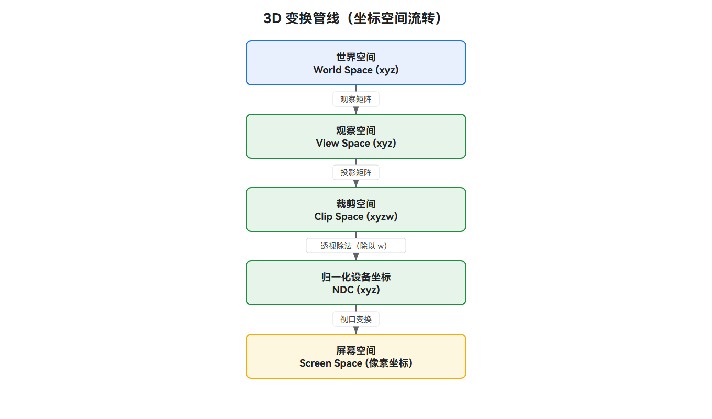

其中**透视除法**（除以w）是产生近大远小效果的关键步骤：裁剪空间中的坐标为四维向量 `(x, y, z, w)`，除以w后得到归一化设备坐标 `(x/w, y/w, z/w)`。w分量越大，表示物体距相机越远、投影尺寸越小；w分量越小，表示越近、投影尺寸越大。在透视投影中，w分量取观察空间Z坐标的相反值。

**相机移动**：相机在世界空间中移动时，所有物体相对它的位置都会改变——沿Z轴（前后）移动会改变物体的投影大小（近大远小），沿X轴（左右）或Y轴（上下）移动则让物体在屏幕上向相反方向移动。

### 映射子组件空间

子组件通过spatialEffect设置自身在三维空间中的位置，参与景深组件的三维变换，与背景产生遮挡、倾斜等空间交互。子组件空间效果由SpatialEffectParams定义，主要包括以下参数：

- **[position](../reference/apis-arkui/arkui-ts/ts-universal-attributes-spatial-effect-sys.md#spatialeffectparams)**：子组件在三维空间中的位置。支持两种写法——数值写法表示子组件的深度信息（决定其距相机的远近层次；示例中取负值表示子组件位于相机前方，绝对值越大距相机越远）；结构体类型用四个角（左上、右上、左下、右下）来定位组件，可表现倾斜摆放的效果。

- **[occlusionWeight](../reference/apis-arkui/arkui-ts/ts-universal-attributes-spatial-effect-sys.md#spatialeffectparams)**：遮挡权重。控制子组件被背景遮挡的程度，取值范围[0, 1]，默认值0；0表示不被遮挡，1表示完全被遮挡。

结构体类型用四个角定位组件时，可通过[positionMode](../reference/apis-arkui/arkui-ts/ts-universal-attributes-spatial-effect-sys.md#spatialpositionmode)指定角点使用的坐标模式（默认 `SpatialPositionMode.WORLD_XYZ`）：

<!--deprecated_code_no_check-->
``` TypeScript
// 伪代码：子组件空间效果参数结构
.spatialEffect({
  position: {
    leftTop: { x, y, z },      // 四角位置
    rightTop: { x, y, z },
    leftBottom: { x, y, z },
    rightBottom: { x, y, z },
    positionMode: SpatialPositionMode.WORLD_XYZ   // 坐标模式，默认WORLD_XYZ
  }
})
```

positionMode决定四角坐标使用的坐标系（详见[SpatialPositionMode](../reference/apis-arkui/arkui-ts/ts-universal-attributes-spatial-effect-sys.md#spatialpositionmode)），两种取值对比如下：

| 模式 | 坐标含义 | 屏幕运动 | 适用场景 |
| -------- | -------- | -------- | -------- |
| WORLD_XYZ（默认） | X、Y、Z均为世界坐标。 | 非线性（受透视除法影响）。 | 精确控制子组件在三维空间中的位置，如[实现文字倾斜与遮挡效果（2D图片背景）](#实现文字倾斜与遮挡效果2d图片背景)示例。 |
| NDC_XY_WORLD_Z | X、Y为归一化设备坐标，Z为世界坐标。 | 线性（XY直接对应屏幕）。 | 精确控制子组件在屏幕上的位置，动画轨迹更可控，示例见[使用NDC坐标实现可控的文字倾斜](#使用ndc坐标实现可控的文字倾斜)。 |

无论子组件在世界空间还是NDC中移动，观察效果一致——沿X轴对应屏幕水平移动、沿Y轴对应垂直移动、沿Z轴对应近大远小（靠近变大、远离变小），其中NDC的X、Y建议取值范围为[-1, 1]（NDC原点位于屏幕中心，X轴向右为正、Y轴向下为正，即左上角为(-1, -1)、右下角为(1, 1)）。由于透视投影的特性，子组件沿Z轴移动时投影尺寸会按距离比例缩放：距相机越近，相同位移引起的尺寸变化越明显。

详细说明请参考[空间效果](../reference/apis-arkui/arkui-ts/ts-universal-attributes-spatial-effect-sys.md)。

> **说明：** 
>
> 两个“position”的区别：相机参数里的position指“相机这台观察设备本身所在的位置”（决定从哪里看）；空间效果里的position指“子组件被摆放的位置”（决定被看的东西在哪里）。

### 合成深度遮挡

渲染子组件时，将其深度与背景对应位置的深度进行比较，并按遮挡权重 SpatialEffectParams（occlusionWeight，取值范围[0, 1]）决定被背景遮挡的程度，使子组件自然融入背景的空间层次。判定逻辑如下：

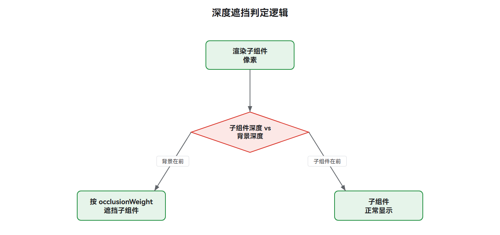

子组件在场景中位于背景的近处与远处之间，距相机更近的背景物体会遮挡子组件，空间层次关系示意如下：

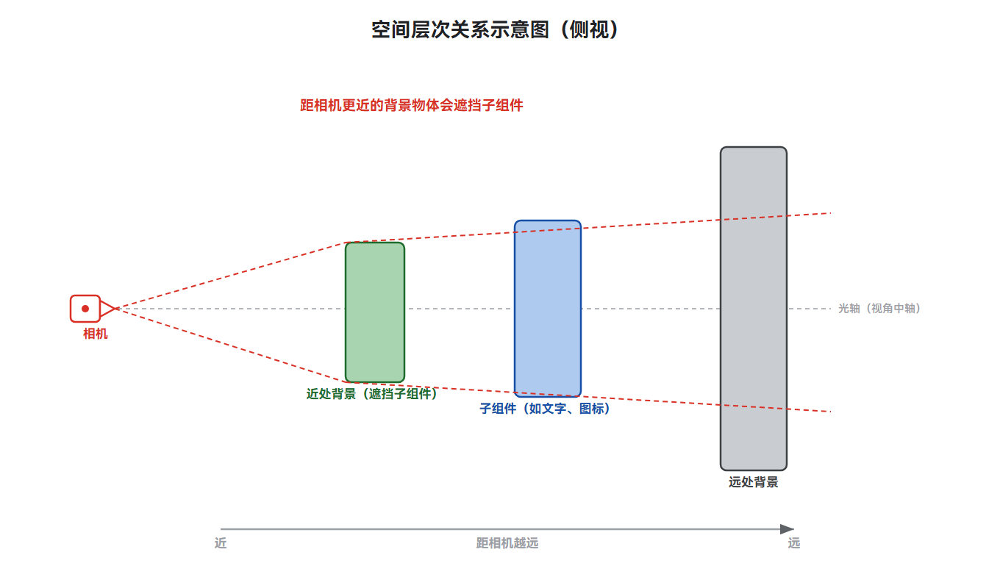

### 计算光照

光照参数 light定义照射景深场景的光照，渲染时依据光照方向与场景几何计算各像素明暗、再与背景颜色合成，为场景补充明暗与色彩、增强立体真实感，主要包括以下参数：

- **[direction](../reference/apis-arkui/arkui-ts/ts-basic-components-depthcomponent-sys.md#depthlightparams)**：光照方向。决定光从哪个方向照过来，影响物体哪一面被照亮、哪一面背光。

- **[color](../reference/apis-arkui/arkui-ts/ts-basic-components-depthcomponent-sys.md#depthlightparams)**：光照颜色。影响场景整体的色调。

- **[intensity](../reference/apis-arkui/arkui-ts/ts-basic-components-depthcomponent-sys.md#depthlightparams)**：光照强度。取值范围[0, +∞)，建议[0, 1]；设置为0时无光照。

各参数的作用可参考下图：

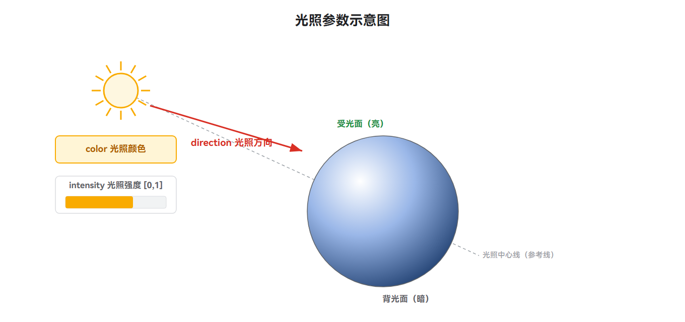

## 约束与限制

1. 本组件为系统接口，仅对系统应用开放，且仅可在Stage模型下使用。

2. 子组件需要设置空间效果后，才能与景深组件的背景产生交互效果。空间效果不支持[Web](../web/web-component-overview.md)、[XComponent](../reference/apis-arkui/arkui-ts/ts-basic-components-xcomponent.md)、[RichEditor](../reference/apis-arkui/arkui-ts/ts-basic-components-richeditor.md)、[RichText](../reference/apis-arkui/arkui-ts/ts-basic-components-richtext.md)、[Video](../reference/apis-arkui/arkui-ts/ts-media-components-video.md)、[Component3D](../reference/apis-arkui/arkui-ts/ts-basic-components-component3d.md)、[EmbeddedComponent](../reference/apis-arkui/arkui-ts/ts-container-embedded-component.md)组件。

3. 背景为静态图片时需要设置深度图，且深度图需要与背景图的分辨率保持一致；背景为3D模型时无需设置深度图。

4. 以图片作为背景时，相机参数更新不会引起背景的变化，仅影响子组件的空间渲染效果。不同位置、角度与视野观察已建好的场景时，子组件的投影大小、屏幕位置与可见区域随之改变。

   原因是：静态图片是一张已经拍摄完成的固定平面画面，没有真实立体结构。例如，当观察者左右移动头部时，墙上的一幅照片依旧是那幅照片，相机怎么调整它都不变。而子组件是在三维空间中独立渲染的立体元素，相机动了相当于"换个角度观察它们"，其投影大小、屏幕位置与遮挡关系都会随之改变，从而呈现立体感。对比之下，3D模型背景本身也是真实立体结构，相机会同时影响背景与子组件；若希望背景也随相机移动产生空间变化，应改用3D模型背景。

5. 相机的zNear和zFar必须为正数，且zNear应小于zFar。

6. 构造参数选项（[DepthComponentOptions](../reference/apis-arkui/arkui-ts/ts-basic-components-depthcomponent-sys.md#depthcomponentoptions)）中的render3DScale为3D渲染窗口的缩放比例，同时作用于宽度和高度，取值范围为(0.0, 1.0]，默认值1.0，超出该范围的值无效（继承之前的取值，未设置过时取默认值）。

7. 光照强度intensity取值范围为[0, +∞)，建议取值范围为[0, 1]，设置为0时无光照。

此外，景深与空间效果本质是模拟立体视觉与相对运动，使用不当时可能引发视觉疲劳甚至眩晕。开发时建议遵循以下原则：

- 关注无障碍与动效敏感：部分用户（如前庭功能敏感人群）对立体视差、相对位移等效果较为敏感，长时间或剧烈的景深变化可能引起不适。建议参考系统的“减弱动效”设置，为景深与空间效果提供可关闭或减弱的开关，在用户开启该设置时降低纵深感强度或停止空间位移。

- 景深强度宜克制：纵深感并非越强越好。过大的视场角（yFov）、过近的相机距离或过强的空间位移，会让背景过度拉伸、子组件位移幅度过大，反而破坏画面协调并加剧不适感。建议从温和的参数起步，优先保证内容的可读性与画面稳定。

- 兼顾渲染性能：景深渲染依赖GPU（图形处理器）对背景每个像素进行深度重建与投影计算，属于GPU密集型操作。深度图分辨率应与背景图保持一致，避免不必要的过大分辨率增加显存与算力开销；在动态调整相机或空间位置时，注意控制更新频率，避免每帧高频变更带来的性能压力。

## 场景示例

接入景深组件主要涉及五项配置：背景资源（构造参数 `background`）、深度图depthMap、相机参数camera、光照参数light，以及为子组件设置的空间效果 spatialEffect。

背景资源支持静态图片（2D）与3D模型两种形式，两者在色域、深度图、相机等方面的配置存在差异：

| 配置项 | 2D场景（静态图片背景） | 3D场景（3D模型背景） |
| -------- | -------- | -------- |
| 色域（[colorSpace](../reference/apis-arkui/arkui-ts/ts-basic-components-depthcomponent-sys.md#depthcomponentoptions)） | PixelMap自带色域无需设置；ResourceStr可按需设置。 | 按需设置；模型为sRGB时无需设置（默认sRGB），为其他色域（如Display P3、Adobe RGB等）时需通过colorSpace指定。 |
| 深度图（depthMap） | 必须设置，且需与背景图分辨率一致。 | 无需设置，3D模型自带深度信息。 |
| 相机参数（camera） | 不影响背景，仅影响子组件空间效果。 | 同时影响背景与子组件渲染效果。 |

接入的整体开发流程为：准备背景（及深度图）资源 → 创建DepthComponent并传入背景资源 → 按需设置深度图或色域 → 配置相机与光照参数 → 为子组件设置空间效果 → 编译构建并验证效果。

### 实现文字倾斜与遮挡效果（2D图片背景）

该场景以静态图片作为背景，配合深度图，通过为子组件Text配置空间效果，实现“文字视觉倾斜且部分内容被图片遮挡”的效果。

**准备资源**

静态图片背景需要准备两张资源：背景图（普通静态图片）与深度图（灰度图）。两者分辨率必须保持一致，深度图的灰度值表示背景各像素的远近（白色近、黑色远，详见[重建场景](#重建场景)中的深度图说明）。将资源放入应用的媒体资源目录后，通过 `$r('app.media.xxx')` 引用。

**配置景深组件**

景深组件的整体结构可以概括为：背景资源由构造参数传入、子组件声明在构造闭包内、深度图、相机、光照依次链式挂载在组件上。先用一段伪代码建立整体认识，再按“深度图 → 相机 → 光照”的顺序逐项填入真实参数。

<!--deprecated_code_no_check-->
``` TypeScript
// 伪代码：景深组件骨架
DepthComponent(背景资源) {
  子组件                            // 在闭包内声明，稍后为其设置空间效果
}
  .width('100%').height('100%')     // 铺满组件区域
  .depthMap(深度图)                  // ① 深度图：静态图片背景必须，3D模型无需
  .camera(相机参数)                  // ② 相机：虚拟观察点的位置/朝向/视野
  .light(光照参数)                   // ③ 光照：方向光的方向/颜色/强度
```

**设置深度图**

构造参数 `background` 传入静态图片资源后，需通过depthMap设置深度图；第二个参数为加载回调，可用于感知加载结果。

<!--deprecated_code_no_check-->
``` TypeScript
// 第 ① 步：传入背景资源，并设置深度图
DepthComponent($r('app.media.background')) {
  // 子组件在闭包内声明，稍后为其配置空间效果
}
  .width('100%')
  .height('100%')
  // 静态图片背景必须设置深度图，且需与背景图分辨率一致
  .depthMap($r('app.media.depth_map'), (error: BusinessError<void>) => {
    if (error && error.code !== 0) {
      console.error(`Depth map load failed: ${error.code} - ${error.message}`);
    } else {
      console.info('Depth map loaded successfully');
    }
  })
```

**设置相机参数**

camera定义虚拟观察点的位置（position）、朝向（quaternion）与视野范围（yFov、zNear/zFar）。静态图片背景下相机仅影响子组件的空间渲染。在上一步的DepthComponent上继续链式追加：

<!--deprecated_code_no_check-->
``` TypeScript
// 第 ② 步：链式追加相机参数
.camera({
  position: { x: 0, y: 0, z: 0 },
  quaternion: { x: 0, y: 0, z: 0, w: 1 },
  yFov: 1.05,
  zNear: 0.1,
  zFar: 100
})
```

**设置光照参数**

light为场景提供方向光的方向（direction）、颜色（color）与强度（intensity）。继续链式追加：

<!--deprecated_code_no_check-->
``` TypeScript
// 第 ③ 步：链式追加光照参数
.light({
  direction: { x: 0, y: 0, z: -1 },
  color: { red: 255, green: 255, blue: 255 },
  intensity: 1
})
```

**为子组件设置空间效果**

在DepthComponent构造闭包内声明的子组件，默认仍在背景平面上；为其设置spatialEffect后，才会进入三维空间，与背景产生前后遮挡关系。`position` 用四个角点（leftTop/rightTop/leftBottom/rightBottom）定义子组件在三维空间中的位置与倾斜形态；`occlusionWeight` 控制被背景遮挡的程度（0表示不遮挡，1表示完全遮挡）。

<!--deprecated_code_no_check-->
``` TypeScript
// 为子组件设置空间效果，使其进入三维场景并与背景产生遮挡关系
Text('Depth Component')
  .fontSize(100)
  .spatialEffect({
    // 通过四角坐标设置子组件在三维空间中的位置，形成倾斜形态
    position: {
      leftTop: { x: -0.355, y: 0.915, z: -1.941 },
      rightTop: { x: 0.483, y: 1.259, z: -2.295 },
      leftBottom: { x: -0.355, y: -0.281, z: -1.941 },
      rightBottom: { x: 0.483, y: 0.063, z: -2.295 }
    },
    // 遮挡权重，0表示不被遮挡，1表示完全被遮挡
    occlusionWeight: 0.5
  })
```

**完整代码**

将以上各步组合（并为组件补充 `onComplete`/`onError` 事件回调以感知背景加载结果，其中onComplete在背景资源加载成功时触发，onError在加载失败时触发），即可得到完整示例：

<!-- @[depth_component_2d](https://gitcode.com/openharmony/applications_app_samples/blob/master/code/DocsSample/ArkUISample/DepthComponentSample/entry/src/main/ets/pages/DepthComponent_2D.ets) -->
``` TypeScript
// xxx.ets
import { BusinessError } from '@kit.BasicServicesKit';

@Entry
@Component
struct DepthComponent2DExample {
  build() {
    Column() {
      // 请开发者替换为实际的资源文件
      DepthComponent($r('app.media.background')) {
        Text('Depth Component')
          .fontSize(100)
          .spatialEffect({
            // 通过四角坐标设置子组件在三维空间中的位置，形成倾斜形态
            position: {
              leftTop: { x: -0.355, y: 0.915, z: -1.941 },
              rightTop: { x: 0.483, y: 1.259, z: -2.295 },
              leftBottom: { x: -0.355, y: -0.281, z: -1.941 },
              rightBottom: { x: 0.483, y: 0.063, z: -2.295 }
            },
            // 遮挡权重，0表示不被遮挡，1表示完全被遮挡
            occlusionWeight: 0.5
          })
      }
      .width('100%')
      .height('100%')
      // 静态图片背景必须设置深度图，且需与背景图分辨率一致
      .depthMap($r('app.media.depth_map'), (error: BusinessError<void>) => {
        if (error && error.code !== 0) {
          console.error(`Depth map load failed: ${error.code} - ${error.message}`);
        } else {
          console.info('Depth map loaded successfully');
        }
      })
      // 设置相机参数
      .camera({
        position: { x: 0, y: 0, z: 0 },
        quaternion: { x: 0, y: 0, z: 0, w: 1 },
        yFov: 1.05,
        zNear: 0.1,
        zFar: 100
      })
      // 设置光照参数
      .light({
        direction: { x: 0, y: 0, z: -1 },
        color: { red: 255, green: 255, blue: 255 },
        intensity: 1
      })
      .onComplete((event: DepthComponentCompleteEvent) => {
        console.info(`Background loaded: ${event.componentWidth}x${event.componentHeight}`);
      })
      .onError((event: DepthComponentErrorEvent) => {
        console.error(`Background load failed: ${event.componentWidth}x${event.componentHeight}`);
        if (event.error) {
          console.error(`Error: ${event.error.code} - ${event.error.message}`);
        }
      })
    }
    .width('100%')
    .padding(16)
  }
}
```

**预期效果**

打开应用页面，DepthComponent加载背景图片与深度图成功后，文字“Depth Component”呈现视觉倾斜效果，且部分内容被背景中的物体遮挡。

   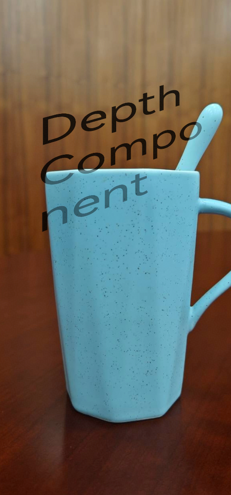

### 实现文字倾斜与遮挡效果（3D模型背景）

3D模型（glTF/glb）背景的接入流程与2D图片背景基本一致，整体结构相同，区别在于：背景资源是3D模型、构造参数可指定色域、3D模型自带深度信息故无需设置深度图。先看伪代码骨架：

<!--deprecated_code_no_check-->
``` TypeScript
// 伪代码：3D模型背景下的景深组件骨架
DepthComponent(3D模型, { colorSpace }) {     // 背景为模型，可指定色域
  子组件
}
  .width('100%').height('100%')
  .camera(相机参数)                          // 同时影响背景与子组件
  .light(光照参数)
// 3D模型自带深度信息，无需 .depthMap()
```

**设置色域**

本例模型为Display P3色域，需先导入 @kit.ArkGraphics2D模块，再通过colorSpace为渲染表面指定对应色域；模型为sRGB时无需设置、可跳过本步。

<!--deprecated_code_no_check-->
``` TypeScript
// 第 ① 步：导入色域模块，传入3D模型与色域
import { colorSpaceManager } from '@kit.ArkGraphics2D';

DepthComponent($r('app.media.model'), {
  colorSpace: colorSpaceManager.ColorSpace.DISPLAY_P3
}) {
  // 子组件在闭包内声明
}
  .width('100%')
  .height('100%')
```

**设置相机与光照参数**

相机、光照的配置方式与[2D图片背景示例](#实现文字倾斜与遮挡效果2d图片背景)完全一致，链式追加即可。区别在于：3D模型本身是真实立体结构，相机参数会同时影响背景与子组件的渲染效果（详见[约束与限制](#约束与限制)第4条）。

<!--deprecated_code_no_check-->
``` TypeScript
// 第 ② 步：链式追加相机与光照参数
.camera({
  position: { x: 0, y: 0, z: 0 },
  quaternion: { x: 0, y: 0, z: 0, w: 1 },
  yFov: 1.05,
  zNear: 0.1,
  zFar: 100
})
.light({
  direction: { x: 0, y: 0, z: -1 },
  color: { red: 255, green: 255, blue: 255 },
  intensity: 1
})
```

**为子组件设置空间效果**

子组件空间效果的配置与[2D图片背景示例](#实现文字倾斜与遮挡效果2d图片背景)完全一致：在构造闭包内为子组件设置spatialEffect，通过四角position定义其在三维空间中的位置与倾斜形态、用occlusionWeight控制被背景遮挡的程度。

**完整代码**

<!-- @[depth_component_3d](https://gitcode.com/openharmony/applications_app_samples/blob/master/code/DocsSample/ArkUISample/DepthComponentSample/entry/src/main/ets/pages/DepthComponent_3D.ets) -->
``` TypeScript
// xxx.ets
import { colorSpaceManager } from '@kit.ArkGraphics2D';

@Entry
@Component
struct DepthComponent3DExample {
  build() {
    Column() {
      // 请开发者替换为实际的3D模型资源文件（glTF/glb）
      DepthComponent($rawfile('model.glb'), {
        colorSpace: colorSpaceManager.ColorSpace.DISPLAY_P3
      }) {
        Text('Depth Component')
          .fontSize(100)
          .spatialEffect({
            // 通过四角坐标设置子组件在三维空间中的位置，形成倾斜形态
            position: {
              leftTop: { x: -0.355, y: 0.915, z: -1.941 },
              rightTop: { x: 0.483, y: 1.259, z: -2.295 },
              leftBottom: { x: -0.355, y: -0.281, z: -1.941 },
              rightBottom: { x: 0.483, y: 0.063, z: -2.295 }
            },
            // 遮挡权重，0表示不被遮挡，1表示完全被遮挡
            occlusionWeight: 0.5
          })
      }
      .width('100%')
      .height('100%')
      // 3D模型自带深度信息，无需设置depthMap
      .camera({
        position: { x: 0, y: 0, z: 0 },
        quaternion: { x: 0, y: 0, z: 0, w: 1 },
        yFov: 1.05,
        zNear: 0.1,
        zFar: 100
      })
      .light({
        direction: { x: 0, y: 0, z: -1 },
        color: { red: 255, green: 255, blue: 255 },
        intensity: 1
      })
      .onComplete((event: DepthComponentCompleteEvent) => {
        console.info(`Background loaded: ${event.componentWidth}x${event.componentHeight}`);
      })
      .onError((event: DepthComponentErrorEvent) => {
        console.error(`Background load failed: ${event.componentWidth}x${event.componentHeight}`);
        if (event.error) {
          console.error(`Error: ${event.error.code} - ${event.error.message}`);
        }
      })
    }
    .width('100%')
    .padding(16)
  }
}
```

**预期效果**

打开应用页面，DepthComponent加载3D模型成功后，文字“Depth Component”呈现视觉倾斜效果，且部分内容被模型遮挡。

   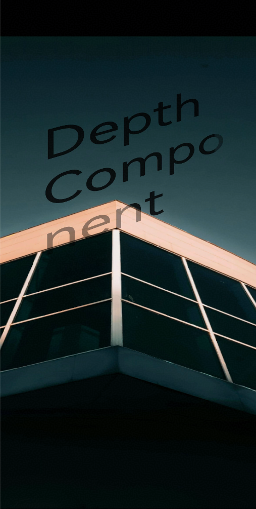

### 仅设置深度实现文字遮挡效果

前面的示例通过四角结构体（leftTop/rightTop/leftBottom/rightBottom）为子组件定位，可表现倾斜形态；当只需要让子组件按深度融入背景、无需倾斜时，空间效果position还支持通过数值写法直接给出子组件的深度信息。此时子组件保持在组件内的布局位置与平整形态，仅按该深度与背景产生前后遮挡关系。

**设置子组件空间效果**

<!--deprecated_code_no_check-->
``` TypeScript
// 为子组件设置空间效果：position直接给出深度（数值写法），
// 子组件不产生倾斜，仅按深度与背景产生遮挡
Text('Spatial Effect')
  .fontSize(100)
  .spatialEffect({
    position: -2.0,        // 数值写法：设置子组件深度信息
    occlusionWeight: 1.0   // 遮挡权重，0表示不被遮挡，1表示完全被遮挡
  })
```

**完整代码**

<!-- @[depth_component_depth](https://gitcode.com/openharmony/applications_app_samples/blob/master/code/DocsSample/ArkUISample/DepthComponentSample/entry/src/main/ets/pages/DepthComponent_Depth.ets) -->
``` TypeScript
// xxx.ets
@Entry
@Component
struct DepthComponentDepthExample {
  build() {
    Column() {
      // 请开发者替换为实际的资源文件
      DepthComponent($r('app.media.background')) {
        Text('Spatial Effect')
          .fontSize(100)
          .spatialEffect({
            position: -2.0,        // 数值写法：设置子组件深度信息
            occlusionWeight: 1.0   // 遮挡权重，0表示不被遮挡，1表示完全被遮挡
          })
      }
      .width('100%')
      .height('100%')
      .depthMap($r('app.media.depth_map')) // 请开发者替换为实际的资源文件
      .camera({
        position: { x: 0, y: 0, z: 0 },
        quaternion: { x: 0, y: 0, z: 0, w: 1 },
        yFov: 1.05,
        zNear: 0.1,
        zFar: 100
      })
      .light({
        direction: { x: 0, y: 0, z: -1 },
        color: { red: 255, green: 255, blue: 255 },
        intensity: 1
      })
    }
    .width('100%')
    .padding(16)
  }
}
```

**预期效果**

打开应用页面，文字“Spatial Effect”不发生倾斜，按深度-2.0处于背景的空间层次中；遮挡权重为1时，背景中距相机更近的物体会完全遮挡文字的相应部分。

   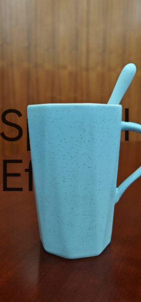

### 使用NDC坐标实现可控的文字倾斜

前面实现文字倾斜与遮挡效果的示例中，四角position的X、Y、Z均为世界坐标（默认 `WORLD_XYZ` 模式），会随相机视角一起经过透视投影；本例改用 `NDC_XY_WORLD_Z` 模式——X、Y分量使用归一化设备坐标（NDC，取值范围[-1, 1]，直接映射到屏幕、不经过透视除法），Z分量为世界坐标、控制深度（坐标模式的详细说明见[映射子组件空间](#映射子组件空间)）。

本例将四角XY直接设置为上窄下宽的梯形（顶边x取±0.2、底边x取±0.5），Z统一为-2.0，文字便在屏幕上呈现“上小下大”的倾斜形态：

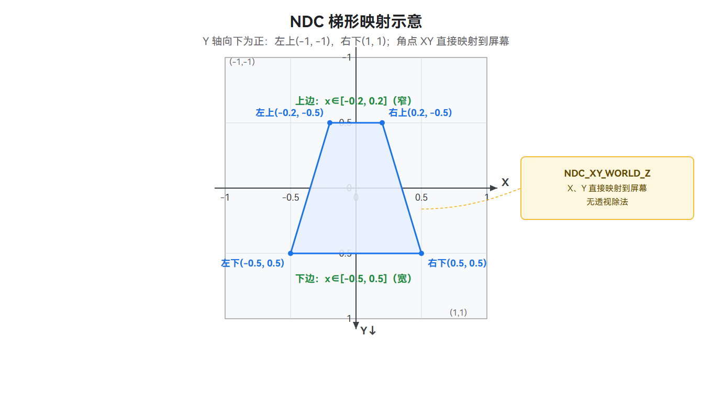

与世界坐标模式借助四角Z差异经透视投影产生倾斜（如[实现文字倾斜与遮挡效果（2D图片背景）](#实现文字倾斜与遮挡效果2d图片背景)示例）不同，NDC模式的倾斜完全由XY的屏幕形状决定——所见即所得；因此对XY做位置或形变动画时，屏幕上的变化是线性的、轨迹更可控，适合需要精确控制屏幕落点与形变的动画场景。

**设置子组件空间效果**

<!--deprecated_code_no_check-->
``` TypeScript
// 为子组件设置空间效果：X、Y为归一化设备坐标、直接映射屏幕，
// 四角XY设置为上窄下宽的梯形，Z统一控制深度
Text('NDC Mode')
  .fontSize(80)
  .fontColor(Color.White)
  .spatialEffect({
    position: {
      leftTop: { x: -0.2, y: -0.5, z: -2.0 },
      rightTop: { x: 0.2, y: -0.5, z: -2.0 },
      leftBottom: { x: -0.5, y: 0.5, z: -2.0 },
      rightBottom: { x: 0.5, y: 0.5, z: -2.0 },
      positionMode: SpatialPositionMode.NDC_XY_WORLD_Z
    }
  })
```

**完整代码**

<!-- @[depth_component_ndc](https://gitcode.com/openharmony/applications_app_samples/blob/master/code/DocsSample/ArkUISample/DepthComponentSample/entry/src/main/ets/pages/DepthComponent_NDC.ets) -->
``` TypeScript
// xxx.ets
@Entry
@Component
struct DepthComponentNdcExample {
  build() {
    Column() {
      // 请开发者替换为实际的资源文件
      DepthComponent($r('app.media.background')) {
        Text('NDC Mode')
          .textAlign(TextAlign.Center)
          .fontSize(120)
          .spatialEffect({
            position: {
              leftTop: { x: -0.2, y: -0.5, z: -2.0 },
              rightTop: { x: 0.2, y: -0.5, z: -2.0 },
              leftBottom: { x: -0.5, y: 0.5, z: -2.0 },
              rightBottom: { x: 0.5, y: 0.5, z: -2.0 },
              positionMode: SpatialPositionMode.NDC_XY_WORLD_Z,
            },
            occlusionWeight: 0.5   // 遮挡权重，0表示不被遮挡，1表示完全被遮挡
          })
          .borderWidth(3)
          .borderColor(Color.Red)
      }
      .width('100%')
      .height('100%')
      .depthMap($r('app.media.depth_map')) // 请开发者替换为实际的资源文件
      .camera({
        position: { x: 0, y: 0, z: 0 },
        quaternion: { x: 0, y: 0, z: 0, w: 1 },
        yFov: 1.05,
        zNear: 0.1,
        zFar: 100
      })
    }
    .width('100%')
    .padding(16)
  }
}
```

**预期效果**

打开应用页面，文字“NDC Mode”在屏幕上呈现上窄下宽（上小下大）的倾斜形态：四角X、Y直接映射到屏幕，顶边宽度（x从-0.2到0.2）约为底边宽度（x从-0.5到0.5）的40%；本例未设置遮挡权重，文字不会被背景物体遮挡。

   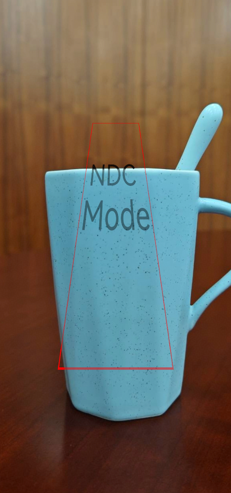


### 使用移轴裁剪渲染背景局部

前面的示例都让相机渲染整张背景图（默认以组件布局尺寸为基准图、偏移 (0, 0)、缩放1.0）。本示例通过相机的可选参数cameraBufferCrop（移轴裁剪，又称离轴渲染），在不移动、不转动相机的前提下，从背景图中截取一个局部并放大渲染——常用于在高分辨率壁纸中只取某一区域作为景深背景。

cameraBufferCrop在camera中的位置及其四个子参数如下：

<!--deprecated_code_no_check-->
``` TypeScript
// 伪代码：cameraBufferCrop在camera中的结构
.camera({
  position, quaternion, yFov, zNear, zFar,
  cameraBufferCrop: {              // 可选：移轴裁剪（离轴渲染）
    bufferWidth, bufferHeight,     // 基准图 = 背景图真实分辨率
    cropOffset: { x, y },          // 裁剪窗口左上角偏移：平移取景（离轴）
    cropScale                      // 裁剪窗口缩放：<1放大局部，>1缩小内容
  }
})
```

**设置移轴裁剪参数**

各子参数（bufferWidth/bufferHeight、cropOffset、cropScale）的含义见[投影变换](#投影变换)中的cameraBufferCrop说明。本例以背景图真实分辨率1262×2560为基准，把裁剪窗口左上角平移到 (100, 100)、缩放为组件尺寸的0.65倍，截取左上角局部并放大；窗口内的图像与深度关系会被一起渲染到组件。

<!--deprecated_code_no_check-->
``` TypeScript
// 配置移轴裁剪：以背景图真实分辨率为基准，截取左上角局部并放大
.camera({
  position: { x: 0, y: 0, z: 0 },
  quaternion: { x: 0, y: 0, z: 0, w: 1 },
  yFov: 1.05,
  zNear: 0.1,
  zFar: 100,
  cameraBufferCrop: {
    bufferWidth: 1262,                  // 基准图宽度，需与背景图实际宽度一致
    bufferHeight: 2560,                 // 基准图高度，需与背景图实际高度一致
    cropOffset: { x: 100.0, y: 100.0 }, // 裁剪窗口左上角偏移（离轴取景）
    cropScale: 0.65                     // 裁剪窗口为组件尺寸的0.65倍，对应放大局部
  }
})
```

**完整代码**

<!-- @[depth_component_crop](https://gitcode.com/openharmony/applications_app_samples/blob/master/code/DocsSample/ArkUISample/DepthComponentSample/entry/src/main/ets/pages/DepthComponent_Crop.ets) -->
``` TypeScript
// xxx.ets
@Entry
@Component
struct DepthComponentCropExample {
  build() {
    Column() {
      // 请开发者替换为实际的资源文件
      DepthComponent($r('app.media.background')) {
        Text('Spatial Effect')
          .fontSize(100)
          .spatialEffect({
            position: -10.0,      // 数值写法：设置子组件深度信息
            occlusionWeight: 1.0
          })
      }
      .width('100%')
      .height('100%')
      .depthMap($r('app.media.depth_map')) // 请开发者替换为实际的资源文件
      .camera({
        position: { x: 0, y: 0, z: 0 },
        quaternion: { x: 0, y: 0, z: 0, w: 1 },
        yFov: 1.05,
        zNear: 0.1,
        zFar: 100,
        cameraBufferCrop: {
          bufferWidth: 1262,       // 基准图宽度，需与背景图实际宽度一致
          bufferHeight: 2560,      // 基准图高度，需与背景图实际高度一致
          cropOffset: { x: 100.0, y: 100.0 },
          cropScale: 0.65
        }
      })
      .light({
        direction: { x: 0, y: 0, z: -1 },
        color: { red: 255, green: 255, blue: 255 },
        intensity: 1
      })
    }
    .width('100%')
    .padding(16)
  }
}
```

> **说明：**
>
> 本示例子组件采用空间效果position的数值写法（直接给出深度，决定子组件距相机的远近层次），写法与[仅设置深度实现文字遮挡效果](#仅设置深度实现文字遮挡效果)示例一致（该示例取-2.0，本例取-10.0），与四角结构体（leftTop/rightTop/leftBottom/rightBottom）定位、可表现倾斜的写法相对；两种写法详见[SpatialEffectParams](../reference/apis-arkui/arkui-ts/ts-universal-attributes-spatial-effect-sys.md#spatialeffectparams)。

**预期效果**

打开应用页面，DepthComponent以背景图左上角 (100, 100) 为起点截取一个约为组件尺寸0.65倍的局部，放大渲染为景深背景，文字“Spatial Effect”悬浮其上。

   
