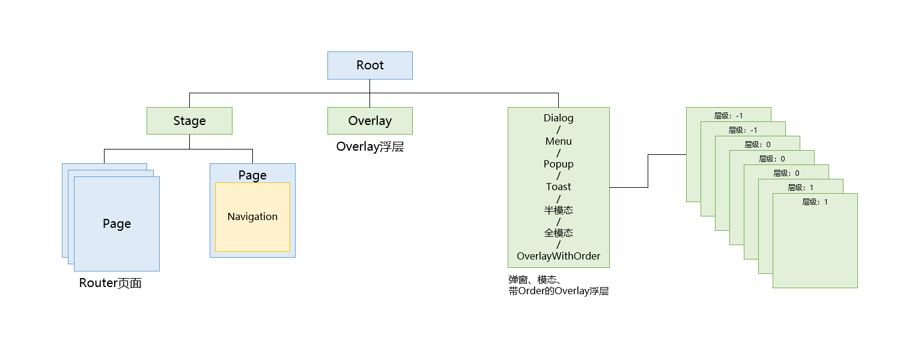
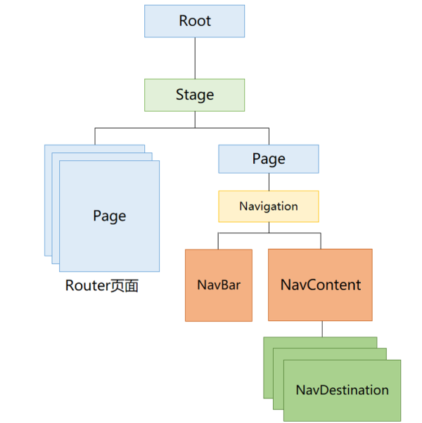
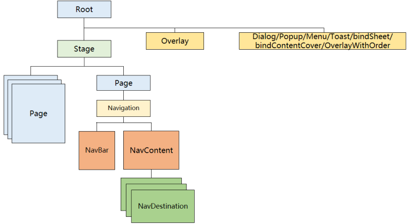
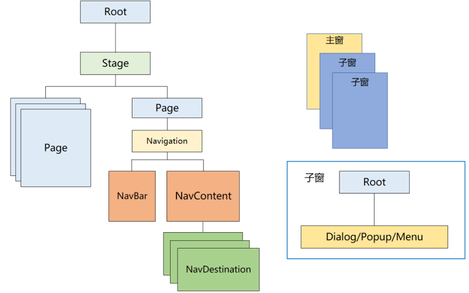

# 弹窗概述
<!--Kit: ArkUI-->
<!--Subsystem: ArkUI-->
<!--Owner: @houguobiao-->
<!--Designer: @houguobiao-->
<!--Tester: @lxl007-->
<!--Adviser: @Brilliantry_Rui-->
弹窗一般指打开应用时自动弹出或者用户行为操作时弹出的UI界面，用于短时间内展示用户需关注的信息或待处理的操作。

从ArkUI组件树层级上来看，Overlay浮层、弹窗、模态、带Order的Overlay浮层都挂载在Root节点下。弹窗、模态、带Order的Overlay浮层根据设置的层级（数字大小）进行逐层显示，并且全部显示在Overlay浮层上面。如图所示：

对于一个多页面应用，基本树结构如下所示。多个Page页面之间使用[Router](../reference/apis-arkui/js-apis-router.md)的接口进行跳转。[NavBar](../reference/apis-arkui/arkui-ts/ts-basic-components-navigation.md#navbar12)和[Navdestination](../reference/apis-arkui/arkui-ts/ts-basic-components-navdestination.md)组成的页面可以通过[Navigation](../reference/apis-arkui/arkui-ts/ts-basic-components-navigation.md)接口进行跳转。

而[Dialog](arkts-base-dialog-overview.md)、[Popup](arkts-popup-overview.md)、[Menu](arkts-menu-overview.md)、[OverlayManager](arkts-create-overlaymanager.md)、[Toast](arkts-create-toast.md)、[bindSheet](arkts-sheet-page.md)以及[bindContentCover](arkts-contentcover-page.md)的组件在结合路由、导航使用时存在如下几种显示模式。

 - 弹窗显示在当前应用窗口最上层，层级高于应用主窗内所有页面（默认行为）。

   如下图所示，触发弹窗显示时，弹窗层级要高于Page页面和Navigation页面，即如果弹窗组件没有被关闭的话，页面切换前后，弹窗组件都会显示在页面上方，而不会出现新的路由/导航页面覆盖在弹窗之上的情况。

   

   > **说明：** 
   >
   > 如果Popup或Menu等存在绑定组件的弹窗组件，在页面跳转后因为所绑定的组件不在新页面显示，系统内部会自动关闭对应弹窗组件。但因为弹窗组件显示同时受开发者配置的参数控制，例如当[Popup](arkts-popup-overview.md)的show参数设置为显示时，弹窗组件会覆盖在下一个页面上显示。

 - 弹窗显示在当前页面内，层级低于下一跳页面。

   当开发者期望弹窗是一个页面内的弹窗，即当路由/导航切换页面时，弹窗会被跳转的页面覆盖，随着页面切回原页面，弹窗仍然正常显示。此时弹窗层级如下图所示：

   

   页面级弹窗功能需要结合弹窗组件的页面级能力使用，当前支持页面级能力的有[Dialog](arkts-base-dialog-overview.md)和[bindSheet](arkts-sheet-page.md)。

 - 弹窗显示在独立窗口内，窗口层级高于应用所在窗口。

   在PC/2in1等设备上，开发者常期望弹窗的显示在应用窗口之外，此时需要借助子窗的能力。例如自定义弹窗可以通过[CustomDialogControllerOptions](../reference/apis-arkui/arkui-ts/ts-methods-custom-dialog-box.md#customdialogcontrolleroptions对象说明)中的showInSubwindow属性控制是否使用子窗功能。基于子窗显示的弹窗效果如下图所示。

   

   此时弹窗组件的显示层级受窗口的层级管理控制，会高于当前应用所在的窗口，低于系统窗口（如系统输入法、系统弹窗等）。

## 弹窗的种类

根据用户交互操作场景，弹窗可分为**模态弹窗**和**非模态弹窗**两种类型，其区别在于用户是否必须对其做出响应。

* **模态弹窗：** 为强交互形式，会中断用户当前的操作流程，要求用户必须做出响应才能继续其他操作，通常用于需要向用户传达重要信息的场景。
* **非模态弹窗：** 为弱交互形式，不会影响用户当前操作行为，用户可以不对其进行回应，通常都有时间限制，出现一段时间后会自动消失。一般用于告诉用户信息内容外还需要用户进行功能操作的场景。

> **说明：** 
>
> 当前模态弹窗通过设置指定属性变成非模态，例如AlertDialog，可以设置[isModal](../reference//apis-arkui/arkui-ts/ts-methods-alert-dialog-box.md#alertdialogparam对象说明)为false变成非模态，其他弹窗详见API说明。
>
> 不建议在非前台状态下，调用弹窗显示接口。
>
> 系统弹窗由系统弹出，出于安全考虑，不支持自定义样式。
>
> 系统弹窗出现时，调用非系统弹窗的显示接口（例如：promptAction的openCustomDialog、CustomDialogController的open等），禁止该类弹窗显示。

## 使用场景

开发者可根据实际应用场景选择合适的弹窗进行页面开发。

|弹窗名称 | 应用场景 |
| --- | --- |
| [弹出框（Dialog）](arkts-base-dialog-overview.md) | 当需要展示用户当前需要或必须关注的信息内容或操作时，例如二次退出应用等，应优先考虑使用此弹出框。 |
| [菜单（Menu/openMenu）](arkts-menu-overview.md)  | 当需要给用户提供可执行的操作时，例如长按图标展示操作选项等，应优先考虑使用此弹窗。 |
| [气泡提示（Popup/openPopup）](arkts-popup-overview.md)  | 当需要给用户提供提示时，例如点击一个问号图标弹出一段帮助提示等，应优先考虑使用此弹窗。 |
| [绑定模态页面（bindContentCover/bindSheet）](arkts-modal-overview.md)  | 当需要新的界面覆盖在旧的界面上，且旧的界面不消失的一种转场方式时，例如缩略图片点击后查看大图等，应优先考虑使用此弹窗。 |
|  [即时反馈（Toast）](arkts-create-toast.md)  | 当需要在一个小的窗口中提供用户当前操作的简单反馈时，例如提示文件保存成功等，应优先考虑使用此弹窗。 |
|  [设置浮层（OverlayManager）](arkts-create-overlaymanager.md)  | 当需要完全自定义内容、行为、样式时，可以使用浮层将UI展示在页面之上，例如音乐/语音播放悬浮球/胶囊等，应优先考虑使用此弹窗。 |

## 规格约束

* 多个弹窗组件先后弹出时，后弹出的组件的层级高于先弹出的层级，退出时按照层级从高到低的顺序逐次退出。
* 在移动设备中，子窗模式的弹窗当前无法超出主窗口。而在2in1设备上，使用模态类弹窗时，会出现需要超出主窗口显示的场景，开发者可以通过设置showInSubWindow为true实现超出主窗口的显示效果。如下图所示：

  

