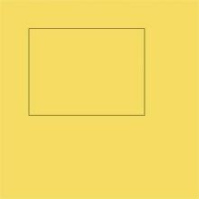
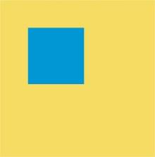
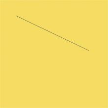
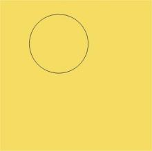
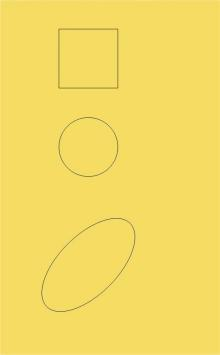
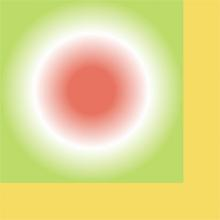
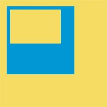

# 使用画布绘制自定义图形 (Canvas)
<!--Kit: ArkUI-->
<!--Subsystem: ArkUI-->
<!--Owner: @sd-wu-->
<!--Designer: @sunbees-->
<!--Tester: @liuli0427-->
<!--Adviser: @HelloCrease-->

Canvas提供画布组件，用于自定义绘制图形，开发者使用CanvasRenderingContext2D对象和OffscreenCanvasRenderingContext2D对象在Canvas组件上进行绘制，绘制对象可以是基础形状、文本、图片等。

## 使用画布组件绘制自定义图形

可以由以下三种形式在画布绘制自定义图形：

- 使用[CanvasRenderingContext2D](../reference/apis-arkui/arkui-ts/ts-canvasrenderingcontext2d.md)对象在Canvas画布上绘制。

<!-- @[canvasRenderingContext2D_start](https://gitcode.com/openharmony/applications_app_samples/blob/master/code/DocsSample/ArkUISample/CustomCanvas/entry/src/main/ets/pages/canvas/CanvasRenderingContext2D.ets) -->

  

- 离屏绘制是指将需要绘制的内容先绘制在缓存区，再将其转换成图片，一次性绘制到Canvas上，加快了绘制速度。过程为：
  1. 通过transferToImageBitmap方法将离屏画布最近渲染的图像创建为一个ImageBitmap对象。
  2. 通过CanvasRenderingContext2D对象的transferFromImageBitmap方法显示给定的ImageBitmap对象。

    具体使用参考[OffscreenCanvasRenderingContext2D](../reference/apis-arkui/arkui-ts/ts-offscreencanvasrenderingcontext2d.md)对象。

<!-- @[offScreenDrawing_start](https://gitcode.com/openharmony/applications_app_samples/blob/master/code/DocsSample/ArkUISample/CustomCanvas/entry/src/main/ets/pages/canvas/OffScreenDrawing.ets) -->

  

  >**说明：**
  >
  >在画布组件中，通过CanvasRenderingContext2D对象和OffscreenCanvasRenderingContext2D对象在Canvas组件上进行绘制时调用的接口相同，另外，接口参数如无特别说明，单位均为vp。

- 在Canvas上加载Lottie动画时，需要先按照如下方式下载Lottie。

<!-- @[lottie_start](https://gitcode.com/openharmony/applications_app_samples/blob/master/code/DocsSample/ArkUISample/CustomCanvas/entry/src/main/ets/pages/canvas/OffScreenDrawing.ets) -->

  具体接口请参考[lottie](https://gitcode.com/openharmony-tpc/lottieArkTS)。

## 初始化画布组件

onReady(event: () =&gt; void)是Canvas组件初始化完成时的事件回调，调用该事件后，可获取Canvas组件的确定宽高，进一步使用CanvasRenderingContext2D对象和OffscreenCanvasRenderingContext2D对象调用相关API进行图形绘制。

<!-- @[initCanvasComponent_start](https://gitcode.com/openharmony/applications_app_samples/blob/master/code/DocsSample/ArkUISample/CustomCanvas/entry/src/main/ets/pages/canvas/InitCanvasComponent.ets) -->

## 画布组件绘制方式

在Canvas组件生命周期接口onReady()调用之后，开发者可以直接使用canvas组件进行绘制。或者可以脱离Canvas组件和onReady()生命周期，单独定义Path2d对象构造理想的路径，并在onReady()调用之后使用Canvas组件进行绘制。

- 通过CanvasRenderingContext2D对象和OffscreenCanvasRenderingContext2D对象直接调用相关API进行绘制。

<!-- @[contextCallApi_start](https://gitcode.com/openharmony/applications_app_samples/blob/master/code/DocsSample/ArkUISample/CustomCanvas/entry/src/main/ets/pages/canvas/CanvasComponentDrawingMethod.ets) -->

  

- 先单独定义path2d对象构造理想的路径，再通过调用CanvasRenderingContext2D对象和OffscreenCanvasRenderingContext2D对象的stroke接口或者fill接口进行绘制，具体使用可以参考[Path2D](../reference/apis-arkui/arkui-ts/ts-components-canvas-path2d.md)对象。

<!-- @[definePath2d_start](https://gitcode.com/openharmony/applications_app_samples/blob/master/code/DocsSample/ArkUISample/CustomCanvas/entry/src/main/ets/pages/canvas/CanvasComponentDrawingMethod.ets) -->

  

## 画布组件常用方法

OffscreenCanvasRenderingContext2D对象和CanvasRenderingContext2D对象提供了大量的属性和方法，可以用来绘制文本、图形，处理像素等，是Canvas组件的核心。常用接口有[fill](../reference/apis-arkui/arkui-ts/ts-canvasrenderingcontext2d.md#fill)（对封闭路径进行填充）、[clip](../reference/apis-arkui/arkui-ts/ts-canvasrenderingcontext2d.md#clip)（设置当前路径为剪切路径）、[stroke](../reference/apis-arkui/arkui-ts/ts-canvasrenderingcontext2d.md#stroke)（进行边框绘制操作）等等，同时提供了[fillStyle](../reference/apis-arkui/arkui-ts/ts-canvasrenderingcontext2d.md#fillstyle)（指定绘制的填充色）、[globalAlpha](../reference/apis-arkui/arkui-ts/ts-canvasrenderingcontext2d.md#globalalpha)（设置透明度）与[strokeStyle](../reference/apis-arkui/arkui-ts/ts-canvasrenderingcontext2d.md#strokestyle)（设置描边的颜色）等属性修改绘制内容的样式。将通过以下几个方面简单介绍画布组件常见使用方法：

- 绘制基础形状。
  可以通过[arc](../reference/apis-arkui/arkui-ts/ts-canvasrenderingcontext2d.md#arc)（绘制弧线路径）、 [ellipse](../reference/apis-arkui/arkui-ts/ts-canvasrenderingcontext2d.md#ellipse)（绘制一个椭圆）、[rect](../reference/apis-arkui/arkui-ts/ts-canvasrenderingcontext2d.md#rect)（创建矩形路径）等接口绘制基础形状。

<!-- @[CanvasComponentBasicShapes_start](https://gitcode.com/openharmony/applications_app_samples/blob/master/code/DocsSample/ArkUISample/CustomCanvas/entry/src/main/ets/pages/canvas/CanvasComponentBasicShapes.ets) -->

  

- 绘制文本。

  可以通过[fillText](../reference/apis-arkui/arkui-ts/ts-canvasrenderingcontext2d.md#filltext)（文本填充）、[strokeText](../reference/apis-arkui/arkui-ts/ts-canvasrenderingcontext2d.md#stroketext)（文本描边）等接口进行文本绘制，示例中设置了font为50像素高加粗的"sans-serif"字体，然后调用fillText方法在(50, 100)处绘制文本"Hello World!"，设置strokeStyle为红色，lineWidth为2，font为50像素高加粗的"sans-serif"字体，然后调用strokeText方法在(50, 150)处绘制文本"Hello World!"的轮廓。

<!-- @[canvasComponentText_start](https://gitcode.com/openharmony/applications_app_samples/blob/master/code/DocsSample/ArkUISample/CustomCanvas/entry/src/main/ets/pages/canvas/CanvasComponentText.ets) -->
 

  

- 绘制文本边框。

  可以通过[measureText](../reference/apis-arkui/arkui-ts/ts-canvasrenderingcontext2d.md#measuretext)（文本测量）计算绘制文本的宽度和高度，使用测量的宽度和高度作为边框的尺寸。在示例中，设置textBaseline为'top'，font为30像素的"monospace"字体，通过measureText测量出文本的宽度和高度，然后调用fillText方法在(20, 100)处绘制文本"Hello World!"，并调用strokeRect方法在同一位置使用测量的宽度和高度绘制相应尺寸的边框。接着，设置font为60像素的粗体"sans-serif"字体，再次通过measureText测量文本的宽度和高度，接着调用fillText方法在(20, 150)处绘制文本"Hello World!"，并调用strokeRect方法在同一位置使用测量的宽度和高度绘制对应尺寸的边框。

<!-- @[canvasComponentTextBorder_start](https://gitcode.com/openharmony/applications_app_samples/blob/master/code/DocsSample/ArkUISample/CustomCanvas/entry/src/main/ets/pages/canvas/CanvasComponentTextBorder.ets) -->

  

- 使用自定义字体绘制文本。

  从API version 20开始，可以通过[getGlobalInstance](../reference/apis-arkgraphics2d/js-apis-graphics-text.md#getglobalinstance)获取应用全局字体管理器的实例，然后使用[loadfontsync](../reference/apis-arkgraphics2d/js-apis-graphics-text.md#loadfontsync)接口从设置的路径中加载自定义字体并通过[font](../reference/apis-arkui/arkui-ts/ts-canvasrenderingcontext2d.md#font)（设置文本绘制中的字体样式）接口设置文本绘制中的字体样式，接着通过[fillText](../reference/apis-arkui/arkui-ts/ts-canvasrenderingcontext2d.md#filltext)（绘制填充类文本）、[strokeText](../reference/apis-arkui/arkui-ts/ts-canvasrenderingcontext2d.md#stroketext)（绘制描边类文本）等接口进行文本绘制。

<!-- @[canvasComponentCustomFontsDrawText_start](https://gitcode.com/openharmony/applications_app_samples/blob/master/code/DocsSample/ArkUISample/CustomCanvas/entry/src/main/ets/pages/canvas/CanvasComponentCustomFontsDrawText.ets) -->

  

- 绘制图片和图像像素信息处理。

  可以通过[drawImage](../reference/apis-arkui/arkui-ts/ts-canvasrenderingcontext2d.md#drawimage)（图像绘制）、[putImageData](../reference/apis-arkui/arkui-ts/ts-canvasrenderingcontext2d.md#putimagedata)（使用[ImageData](../reference/apis-arkui/arkui-ts/ts-components-canvas-imagedata.md)数据填充新的矩形区域）等接口绘制图片，通过[createImageData](../reference/apis-arkui/arkui-ts/ts-canvasrenderingcontext2d.md#createimagedata)（创建新的ImageData 对象）、[getPixelMap](../reference/apis-arkui/arkui-ts/ts-canvasrenderingcontext2d.md#getpixelmap)（以当前canvas指定区域内的像素创建[PixelMap](../reference/apis-image-kit/arkts-apis-image-PixelMap.md)对象）、[getImageData](../reference/apis-arkui/arkui-ts/ts-canvasrenderingcontext2d.md#getimagedata)（以当前canvas指定区域内的像素创建ImageData对象）等接口进行图像像素信息处理。

<!-- @[CanvasComponentDrawingPictureAndImagePixel_start](https://gitcode.com/openharmony/applications_app_samples/blob/master/code/DocsSample/ArkUISample/CustomCanvas/entry/src/main/ets/pages/canvas/CanvasComponentDrawingPictureAndImagePixel.ets) -->

  

- 其他方法。

  Canvas中还提供其他类型的方法。渐变（[CanvasGradient](../reference/apis-arkui/arkui-ts/ts-components-canvas-canvasgradient.md)对象）相关的方法：[createLinearGradient](../reference/apis-arkui/arkui-ts/ts-canvasrenderingcontext2d.md#createlineargradient)（创建一个线性渐变色）、[createRadialGradient](../reference/apis-arkui/arkui-ts/ts-canvasrenderingcontext2d.md#createradialgradient)（创建一个径向渐变色）等。

<!-- @[canvasComponentOtherMethods_start](https://gitcode.com/openharmony/applications_app_samples/blob/master/code/DocsSample/ArkUISample/CustomCanvas/entry/src/main/ets/pages/canvas/CanvasComponentOtherMethods.ets) -->

  

## 使用状态变量驱动画布刷新

可以使用状态变量来驱动Canvas刷新，将变化的数据通过@Watch监听，并绑定自定义的draw()方法。当数据刷新时，@Watch绑定的方法会执行绘制逻辑，使Canvas刷新。

<!-- @[canvasContentUpdate_start](https://gitcode.com/openharmony/applications_app_samples/blob/master/code/DocsSample/ArkUISample/CustomCanvas/entry/src/main/ets/pages/canvas/CanvasContentUpdate.ets) -->

## 场景示例

- 绘制规则基础形状。

<!-- @[drawingRegularBaseShape_start](https://gitcode.com/openharmony/applications_app_samples/blob/master/code/DocsSample/ArkUISample/CustomCanvas/entry/src/main/ets/pages/canvas/DrawingRegularBaseShape.ets) -->

  

- 绘制不规则图形。

<!-- @[drawIrregularFigures_start](https://gitcode.com/openharmony/applications_app_samples/blob/master/code/DocsSample/ArkUISample/CustomCanvas/entry/src/main/ets/pages/canvas/DrawIrregularFigures.ets) -->

  

- 绘制可拖动的光标。

  可以通过[beginPath](../reference/apis-arkui/arkui-ts/ts-canvasrenderingcontext2d.md#beginpath)、[moveTo](../reference/apis-arkui/arkui-ts/ts-canvasrenderingcontext2d.md#moveto)、[lineTo](../reference/apis-arkui/arkui-ts/ts-canvasrenderingcontext2d.md#lineto)和[arc](../reference/apis-arkui/arkui-ts/ts-canvasrenderingcontext2d.md#arc)方法设置光标的位置，使用[stroke](../reference/apis-arkui/arkui-ts/ts-canvasrenderingcontext2d.md#stroke)和[fill](../reference/apis-arkui/arkui-ts/ts-canvasrenderingcontext2d.md#fill)方法绘制光标，将是否按下和位置变化通过@Watch监听，并绑定自定义的drawCursor()方法。当拖动光标时，@Watch绑定的方法会执行绘制逻辑，计算并更新光标的颜色和位置。

<!-- @[cursor_moving_canvas](https://gitcode.com/openharmony/applications_app_samples/blob/master/code/DocsSample/ArkUISample/CustomCanvas/entry/src/main/ets/pages/canvas/DrawDraggableCursor.ets) -->

  

## 相关实例

使用画布绘制自定义图形，有以下相关实例可供参考：

- [ArkTS组件集（ArkTS）（Full SDK）（API10）](https://gitcode.com/openharmony/applications_app_samples/tree/master/code/UI/ArkTsComponentCollection/ComponentCollection)

- [分布式五子棋（ArkTS）（Full SDK）（API9）](https://gitcode.com/openharmony/applications_app_samples/tree/master/code/Solutions/Game/DistributedDataGobang)

- [ArkTS时钟（ArkTS）(API9)](https://gitcode.com/openharmony/applications_app_samples/tree/master/code/Solutions/Tools/ArkTSClock)

- [Lottie动画](https://gitcode.com/openharmony/applications_app_samples/tree/master/code/Solutions/Game/Lottie)

- [自定义抽奖转盘（ArkTS）（API9）](https://gitcode.com/openharmony/codelabs/tree/master/ETSUI/CanvasComponent)
<!--RP1--><!--RP1End-->