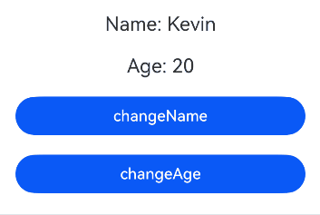

# 在ArkTS-Dyn中使用ArkTS-Sta的@BuilderParam（引用@Builder函数）
<!--Kit: ArkUI-->
<!--Subsystem: ArkUI-->
<!--Owner: @lixingchi1; @katabanga-->
<!--Designer: @lixingchi1; @katabanga-->
<!--Tester: @TerryTsao-->
<!--Adviser: @zhang_yixin13-->

## 概述

从API version 23开始，支持在ArkTS-Dyn中使用[\@Builder](./state-management/arkts-builder.md)函数初始化ArkTS-Sta自定义组件的\@BuilderParam成员属性。

在阅读本文档前，建议阅读：[\@BuilderParam](./state-management/arkts-builderparam.md#装饰器使用说明)。


## 使用限制

- 遵循ArkTS-Dyn自定义构建函数[限制条件](./state-management/arkts-builder.md#限制条件)；

- 遵循ArkTS-Sta \@BuilderParam装饰器[限制条件](./state-management/arkts-builderparam.md#限制条件)。


## 使用场景

ArkTS-Dyn @Builder函数初始化ArkTS-Sta自定义组件@BuilderParam成员属性，使用规格限制与非互操作场景相同。

其中，\@Builder的参数传递包括[按引用传递](./state-management/arkts-builder.md#按引用传递参数)与[按值传递](./state-management/arkts-builder.md#按值传递参数)，详见[参数传递规则](./state-management/arkts-builder.md#参数传递规则)。


### 按引用传递参数

ArkTS-Dyn使用\@Builder函数初始化ArkTS-Sta\@BuilderParam时，\@Builder仅在接收一个参数且该参数为对象字面量时为引用传递，其余情况均为按值传递。该对象字面量包含状态变量时，其变化会触发\@Builder内部UI刷新。在ArkTS-sta上下文中，引用传递参数的类型必须为interface才能触发UI刷新。

由于ArkTS-Sta不支持跨语言创建对象字面量，因此ArkTS-Sta创建对象字面量时，需要使用ArkTS-Sta侧的对象。

基于以下示例结构，说明在ArkTS-Dyn中使用\@Builder函数初始化ArkTS-Sta的\@BuilderParam字面量更新的场景。

```text
project/
├── entry/                                        # ArkTS-Dyn主模块
│   └── src/
│       └── main/
│           └── ets/
│               └── pages/
│                   └── BuilderParamByRef.ets     # @Builder初始化@BuilderParam
│
└── static_module/                                # ArkTS-Sta子模块
    └── src/
        └── main/
            └── ets/
                └── components/
                    └── StaBuilderParamByRef.ets  # 定义Person接口，定义@BuilderParam并引用传递
```

示例如下：

- 创建ArkTS-Sta子模块`static_module`，在`static_module/src/main/ets/components`目录创建并导出自定义组件以及`Person`接口。如何创建子模块参考共享包（[HAR](../quick-start/har-package.md)）说明。

<!-- @[DynInteropStaStaBuilderParamByRef](https://gitcode.com/openharmony/applications_app_samples/blob/OpenHarmony_feature_sta_20260331/code/DocsSample/ArkUISample-Sta/DynInteropStaUI/static_module/src/main/ets/components/StaBuilderParamByRef.ets) -->

``` TypeScript
// static_module/src/main/ets/components/StaBuilderParamByRef.ets
import { Component, Builder, BuilderParam, Column, Button } from '@ohos.arkui.component';
import { State, Observed } from '@ohos.arkui.stateManagement';

export interface IPerson { // ArkTS-Sta侧的对象字面量interface
  name: string;
  age: number;
}

@Component
export struct Child {
  @State name: string = 'Kevin';
  @State age: number = 20;

  @Builder
  myBuilder(person: IPerson): void {}

  // 使用@BuilderParam接收ArkTS-Dyn侧传递的@Builder函数
  @BuilderParam customBuilderParam: (person: IPerson) => void = this.myBuilder;

  build(): void {
    Column() {
      // 调用@BuilderParam定义的变量，传递ArkTS-Sta侧的对象字面量
      this.customBuilderParam({ name: this.name, age: this.age })
      Button('changeName')
        .onClick(() => {
          // 修改状态变量，触发@Builder内部UI刷新
          this.name += 'a';
        })
        .width(300)
        .margin(10)
      Button('changeAge')
        .onClick(() => {
          // 修改状态变量，触发@Builder内部UI刷新
          this.age += 1;
        })
        .width(300)
        .margin(10)
    }
    .width('100%')
  }
}
```

<!-- @[DynInteropStaBuilderParamIndexByRef](https://gitcode.com/openharmony/applications_app_samples/blob/OpenHarmony_feature_sta_20260331/code/DocsSample/ArkUISample-Sta/DynInteropStaUI/static_module/Index.ets) -->

``` TypeScript
// static_module/Index.ets
export { IPerson, Child } from './src/main/ets/components/StaBuilderParamByRef'; // 导出ArkTS-Sta侧的对象字面量interface和自定义组件
```

- 在ArkTS-Dyn主模块`entry`中引入ArkTS-Sta的自定义组件，传递\@Builder。且在`oh-package.json5`文件中配置子模块依赖。如何导入和使用子模块参考共享包（[HAR](../quick-start/har-package.md)）说明。

<!-- @[DynInteropStaBuilderParamByRef](https://gitcode.com/openharmony/applications_app_samples/blob/OpenHarmony_feature_sta_20260331/code/DocsSample/ArkUISample-Sta/DynInteropStaUI/entry/src/main/ets/pages/BuilderParamByRef.ets) -->

``` TypeScript
// entry/src/main/ets/pages/BuilderParamByRef.ets
import { IPerson, Child } from 'static_module'; // 引入ArkTS-Sta侧的IPerson接口与自定义组件

@Entry
@Component
struct Parent { // ArkTS-Dyn侧的自定义组件
  @Builder
  personInfo(person: IPerson) {
    Column() {
      Text(`Name: ${person.name}`)
        .fontSize(20) 
        .margin(10)
      Text(`Age: ${person.age}`)
        .fontSize(20) 
        .margin(10)
    }
  }

  build() {
    Column() {
      // 传递@Builder函数引用
      Child({ customBuilderParam: this.personInfo })
    }
    .width('100%')
  }
}
```

```json
// entry/oh-package.json5

"dependencies": {
  "static_module": "file:../static_module"
}
```

示例效果图：



### 按值传递参数

初始化\@BuilderParam的\@Builder函数默认按值传递，当传入状态变量时，其变化不会触发\@Builder内部UI刷新。

完整示例结构如下所示：

```text
project/
├── entry/                                          # ArkTS-Dyn主模块
│   └── src/
│       └── main/
│           └── ets/
│               └── pages/
│                   └── BuilderParamByValue.ets     # @Builder初始化@BuilderParam
│
└── static_module/                                  # ArkTS-Sta子模块
    └── src/
        └── main/
            └── ets/
                └── components/
                    └── StaBuilderParamByValue.ets  # 定义@BuilderParam并调用
```

下面的代码示例展示了使用ArkTS-Dyn的\@Builder函数给ArkTS-Sta自定义组件的\@BuilderParam赋值并显示UI。


- 创建ArkTS-Sta子模块`static_module`，在`static_module/src/main/ets/components`目录创建并导出自定义组件。如何创建子模块参考共享包（[HAR](../quick-start/har-package.md)）说明。

<!-- @[DynInteropStaStaBuilderParamByValue](https://gitcode.com/openharmony/applications_app_samples/blob/OpenHarmony_feature_sta_20260331/code/DocsSample/ArkUISample-Sta/DynInteropStaUI/static_module/src/main/ets/components/StaBuilderParamByValue.ets) -->

``` TypeScript
// static_module/src/main/ets/components/StaBuilderParamByValue.ets
import { Component, Builder, BuilderParam, Column } from '@ohos.arkui.component';

@Component
export struct ChildByValue { // ArkTS-Sta侧的自定义组件
  @Builder
  myBuilder(str: string): void {
  }

  // 使用@BuilderParam接收ArkTS-Dyn侧传递的@Builder函数
  @BuilderParam customBuilderParam: (input: string) => void = this.myBuilder;

  build(): void {
    Column() {
      this.customBuilderParam('Hello World!')
    }
  }
}
```

<!-- @[DynInteropStaBuilderParamIndexByValue](https://gitcode.com/openharmony/applications_app_samples/blob/OpenHarmony_feature_sta_20260331/code/DocsSample/ArkUISample-Sta/DynInteropStaUI/static_module/Index.ets) -->

``` TypeScript
// static_module/Index.ets
export { ChildByValue } from './src/main/ets/components/StaBuilderParamByValue';
```

- 在主模块`entry`的`oh-package.json5`文件中配置子模块依赖。

```json
// entry/oh-package.json5

"dependencies": {
  "static_module": "file:../static_module"
}
```

- 在ArkTS-Dyn主模块`entry`中引入ArkTS-Sta的自定义组件，且传递\@Builder。

<!-- @[DynInteropStaBuilderParamByValue](https://gitcode.com/openharmony/applications_app_samples/blob/OpenHarmony_feature_sta_20260331/code/DocsSample/ArkUISample-Sta/DynInteropStaUI/entry/src/main/ets/pages/BuilderParamByValue.ets) -->

``` TypeScript
// entry/src/main/ets/pages/BuilderParamByValue.ets
import { ChildByValue } from 'static_module'; // 引入ArkTS-Sta侧的自定义组件

@Entry
@Component
struct Parent {
  @Builder
  myText(input: string) { // ArkTS-Dyn侧的@Builder函数
    Text(input)
      .fontSize(20) 
      .margin(10)
  }

  build() {
    Column() {
      // 传递@Builder函数引用
      ChildByValue({ customBuilderParam: this.myText })
    }
  }
}
```

示例效果图：


