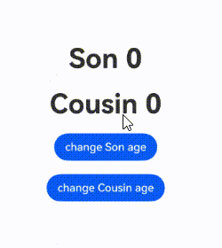

# 在ArkTS-Dyn中使用ArkTS-Sta的@ObservedV2和@Trace（类属性变化观测）

## 概述

从API version 23开始，支持从ArkTS-Dyn的自定义组件中调用或修改ArkTS-Sta的[ObservedV2与@Trace](./state-management-static/arkts-static-new-observedV2-and-trace.md)修饰类，数据变更实现UI刷新，通过调用[enableCompatibleObservedV2ForDynamic](../reference/apis-arkui/arkui-ts/ts-interop-compatible-ObservedV2.md#enableCompatibleObservedV2ForDynamic)方法即可。


## 使用限制

- 遵循ArkTS-Dyn @ObservedV2与@Trace的[使用限制](../ui/state-management/arkts-new-observedv2-and-trace.md#使用限制)；

- 遵循ArkTS-Sta @ObservedV2与@Trace的[使用限制](../ui/state-management-static/arkts-static-new-observedv2-and-trace.md#使用限制)；

- 不能在非UI线程中直接修改ArkTS-Dyn组件中使用的ArkTS-Sta @ObservedV2装饰的数据成员的值，否则会运行异常；

- 遵循[ArkTS-Sta互操作](../quick-start/arkts-interop-overview.md)规范，如不支持ArkTS-Sta对象继承ArkTS-Dyn对象。


## 使用场景

基于以下示例结构，说明在ArkTS-Dyn自定义组件中调用ArkTS-Sta @ObservedV2修饰的类的场景。

```text
project/
├── entry/                          # ArkTS-Dyn主模块
│   └── src/
│       └── main/
│           └── ets/
│               └── pages/
│                   └── Index.ets    # ArkTS-Dyn主模块入口页面，引入ArkTS-Sta @ObservedV2修饰的类
│
└── static_module/                   # ArkTS-Sta子模块
    └── src/
        └── main/
            └── ets/
                └── components/
                    └── MainPage.ets  # 导出ArkTS-Sta @ObservedV2修饰的类
```

示例如下：

- 创建ArkTS-Sta子模块`static_module`，在`static_module/src/main/ets/components`目录创建并导出自定义组件。如何创建子模块参考共享包（[HAR](../quick-start/har-package.md)）说明。

```TypeScript
'use static'

// static_module/src/main/ets/components/MainPage.ets
import { Entry, Text, Column, Component, Button, ClickEvent, enableCompatibleObservedV2ForDynamic } from '@ohos.arkui.component';
import { State, ObservedV2, Trace } from '@ohos.arkui.stateManagement';

// 导出ArkTS-Sta中实现的enableCompatibleObservedV2ForDynamic方法
export function setEnableCompatibleObservedV2ForDynamic(T: Object) {
  // 调用enableCompatibleObservedV2ForDynamic方法，使ArkTS-Sta @Trace修饰的属性在ArkTS-Dyn中可观测
  enableCompatibleObservedV2ForDynamic(T);
}

@ObservedV2
export class ObservedV2ForStatic { // 定义静态@ObservedV2装饰的类并导出
  @Trace name: string = '';
  @Trace age: number = 0;

  constructor(name: string, age: number) {
    this.name = name;
    this.age = age;
  }
}
```

```TypeScript
'use static'

// static_module/Index.ets
export { setEnableCompatibleObservedV2ForDynamic, ObservedV2ForStatic } from './src/main/ets/components/MainPage';
```

- 在主模块`entry`的`oh-package.json5`文件中配置子模块依赖。如何导入和使用子模块参考共享包（[HAR](../quick-start/har-package.md)）说明。

```json
// entry/oh-package.json5
"dependencies": {
  'static_module': 'file:../static_module'
}
```

- 在ArkTS-Dyn主模块`entry`中引入ArkTS-Sta组件。

```TypeScript
// entry/src/main/ets/pages/Index.ets
import { setEnableCompatibleObservedV2ForDynamic, ObservedV2ForStatic }  from 'static_module';

@Entry
@ComponentV2
export struct Index {
  // 使用@State修饰ArkTS-Sta @ObservedV2装饰的类
  person: ObservedV2ForStatic = new ObservedV2ForStatic('Tom', 9);

  aboutToAppear() {
    // 调用setEnableCompatibleObservedV2ForDynamic方法，使ArkTS-Sta @Trace修饰的属性在ArkTS-Dyn中可观测
    setEnableCompatibleObservedV2ForDynamic(this.person);
  }
  build() {
    Row() {
      Column() {
        Text(`name: ${this.person.name}`)
        Text(`age: ${this.person.age}`)
        Button('add age')
          .onClick(() => {
            this.person.age++; // 触发UI刷新
          })
      }
      .width('100%')
    }
    .height('100%')
  }
}
```

### 嵌套类场景

在嵌套类场景中，Pencil类位于Son类的最内层。Pencil类使用@ObservedV2装饰，其属性length使用@Trace装饰，因此length的变化能够被观测到。

- 创建ArkTS-Sta子模块`static_module`，并导出ArkTS-Sta自定义组件。如何创建子模块参考共享包（[HAR](../quick-start/har-package.md)）说明。
- 在`static_module/src/main/ets/components`目录创建并导出自定义组件嵌套类。

```TypeScript
'use static'

import { enableCompatibleObservedV2ForDynamic } from '@ohos.arkui.component';
import { ObservedV2, Trace } from '@ohos.arkui.stateManagement';
  
// 导出ArkTS-Sta中实现的enableCompatibleObservedV2ForDynamic方法
export function setEnableCompatibleObservedV2ForDynamic(T: Object) {
  // 调用enableCompatibleObservedV2ForDynamic方法，使ArkTS-Sta @Trace修饰的属性在ArkTS-Dyn中可观测
  enableCompatibleObservedV2ForDynamic(T);
}

@ObservedV2
export class Pencil {
  @Trace length: number = 21; // 当length变化时，会刷新关联的组件
}

@ObservedV2
export class Bag {
  width: number = 50;
  height: number = 60;
  @Trace pencil: Pencil = new Pencil();
}
@ObservedV2
export class Son {// 定义静态@ObservedV2装饰的类并导出
  age: number = 5;
  school: string = 'some';
  @Trace bag: Bag = new Bag();
}
```

```TypeScript
'use static'

// static_module/Index.ets
export { setEnableCompatibleObservedV2ForDynamic, Son } from './src/main/ets/components/MainPage';
```

- 在主模块`entry`的`oh-package.json5`文件中配置子模块依赖。如何导入和使用子模块参考共享包（[HAR](../quick-start/har-package.md)）说明。

```json
// entry/oh-package.json5
"dependencies": {
  'static_module': 'file:../static_module',
}
```

- ArkTS-Dyn中调用ArkTS-Sta的\@ObservedV2修饰的嵌套类。

```TypeScript
// entry/src/main/ets/pages/Index.ets
import { Son, setEnableCompatibleObservedV2ForDynamic } from 'static_module';

@Entry
@ComponentV2
struct Page {
  // 使用@State修饰ArkTS-Sta @ObservedV2装饰的类
  son: Son = new Son();
  renderTimes: number = 0;
  isRender(id: number): number {
    console.info(`id: ${id} renderTimes: ${this.renderTimes}`);
    this.renderTimes++;
    return 40;
  }
  aboutToAppear() {
    // 调用setEnableCompatibleObservedV2ForDynamic方法，使ArkTS-Sta @Trace修饰的属性在ArkTS-Dyn中可观测
    setEnableCompatibleObservedV2ForDynamic(this.son);
  }
  build() {
    Column() {
      Text('pencil length'+ this.son.bag.pencil.length) // UINode (1)
        .fontSize(this.isRender(1))
        .margin(10)
      Button('change length')
        .onClick((e) => {
          // 触发UI刷新
          this.son.bag.pencil.length += 100;
        })
        .margin(10)
    }
    .width('100%')
  }
}
```


### 继承类场景

@Trace支持在类的继承场景中使用，无论是在基类还是继承类中，只有被@Trace装饰的属性才具有被观测变化的能力。

- 创建ArkTS-Sta子模块`static_module`，并导出ArkTS-Sta自定义组件。如何创建子模块参考共享包（[HAR](../quick-start/har-package.md)）说明。
- 在`static_module/src/main/ets/components`目录创建并导出自定义继承类。

```ts
'use static'
import { enableCompatibleObservedV2ForDynamic } from '@ohos.arkui.component';
import { ObservedV2, Trace } from '@ohos.arkui.stateManagement';

// 导出ArkTS-Sta中实现的enableCompatibleObservedV2ForDynamic方法
export function setEnableCompatibleObservedV2ForDynamic(T: Object) {
  // 调用setEnableCompatibleObservedV2ForDynamic方法，使ArkTS-Sta @Trace修饰的属性在ArkTS-Dyn中可观测
  enableCompatibleObservedV2ForDynamic(T);
}

@ObservedV2
export class GrandFather {
  // 当age变化时，会刷新关联的组件
  @Trace age: number = 0;

  constructor(age: number) {
    this.age = age;
  }
}
@ObservedV2
export class Father extends GrandFather{
  constructor(father: number) {
    super(father);
  }
}
@ObservedV2
export class Uncle extends GrandFather {
  constructor(uncle: number) {
    super(uncle);
  }
}
@ObservedV2
export class Son extends Father { // 定义静态@ObservedV2装饰的类并导出
  constructor(son: number) {
    super(son);
  }
}
@ObservedV2
export class Cousin extends Uncle { // 定义静态@ObservedV2装饰的类并导出
  constructor(cousin: number) {
    super(cousin);
  }
}
```

```TypeScript
'use static'

// static_module/Index.ets
export { setEnableCompatibleObservedV2ForDynamic, Son, Cousin } from './src/main/ets/components/MainPage';
```

- 在主模块`entry`的`oh-package.json5`文件中配置子模块依赖。如何导入和使用子模块参考共享包（[HAR](../quick-start/har-package.md)）说明。

```json
// entry/oh-package.json5
"dependencies": {
  'static_module': 'file:../static_module',
}
```

- ArkTS-Dyn中调用ArkTS-Sta的\@ObservedV2修饰的继承类。

```ts
import { Son, Cousin, setEnableCompatibleObservedV2ForDynamic } from 'static_module';

@Entry
@ComponentV2
struct Index { // ArkTS-Dyn自定义组件
  // 创建ArkTS-Sta @ObservedV2装饰类的实例
  son: Son = new Son(0);
  cousin: Cousin = new Cousin(0);
  renderTimes: number = 0;

  isRender(id: number): number {
    console.info(`id: ${id} renderTimes: ${this.renderTimes}`);
    this.renderTimes++;
    return 40;
  }
  aboutToAppear() {
    // 调用setEnableCompatibleObservedV2ForDynamic方法，使ArkTS-Sta @Trace修饰的属性在ArkTS-Dyn中可观测
    setEnableCompatibleObservedV2ForDynamic(this.son);
    setEnableCompatibleObservedV2ForDynamic(this.cousin);
  }
  build() {
    Row() {
      Column() {
        // 显示Son.age属性
        Text(`Son ${this.son.age}`)
          .fontSize(this.isRender(1))
          .fontWeight(FontWeight.Bold)
          .margin(10)
        // 显示Cousin.age属性
        Text(`Cousin ${this.cousin.age}`)
          .fontSize(this.isRender(2))
          .fontWeight(FontWeight.Bold)
          .margin(10)
        Button('change Son age')
          .onClick((e) => {
            // 触发UI刷新
            this.son.age++;
          })
          .margin(10)
        Button('change Cousin age')
          .onClick((e) => {
            // 触发UI刷新
            this.cousin.age++;
          })
          .margin(10)
      }
      .width('100%')
    }
    .height('100%')
  }
}
```




## 常见问题

### 声明文件编译报错

由于ArkTS-Sta上下文中会将@Trace装饰的属性自动转换出getter和setter方法，需要删除。详见[互操作声明文件规范](./arkts-ui-interop-declaration-spec.md)。

`entry/src/main/ets/components/MainPage.ets`文件中@Trace的示例如下：

```TypeScript
'use static'

// static_module/src/main/ets/components/MainPage.ets
import { Entry, Text, Column, Component, Button, ClickEvent, enableCompatibleObservedV2ForDynamic } from '@ohos.arkui.component';
import { State, ObservedV2, Trace } from '@ohos.arkui.stateManagement';

export function setEnableCompatibleObservedV2ForDynamic(T: Object) {
  enableCompatibleObservedV2ForDynamic(T);
}

@ObservedV2
export class ObservedV2ForStatic {
  @Trace name: string = '';
  @Trace age: number = 0;

  constructor(name: string, age: number) {
    this.name = name;
    this.age = age;
  }
}
```

位于`static_module/build/default/intermediates/declgen/default/declgenV1/static_module/src/main/ets/components/MainPage.d.ets`的声明文件，修改前如下：

```TypeScript
import type { Record } from '../../../../../static.Record';

export declare function setEnableCompatibleObservedV2ForDynamic(T: Object): void;

@ObservedV2
export declare class ObservedV2ForStatic {
  @Trace
  public get name(): string;
  @Trace
  public set name(value: string);
  @Trace
  public get age(): number;
  @Trace
  public set age(value: number);
  public constructor(name: string, age: number); 
}
```

应按如下格式修改：

```TypeScript
import type { Record } from '../../../../../static.Record';

export declare function setEnableCompatibleObservedV2ForDynamic(T: Object): void;

@ObservedV2
export declare class ObservedV2ForStatic {
  @Trace
  name: string;
  @Trace
  age: number;
  public constructor(name: string, age: number); 
}
```

