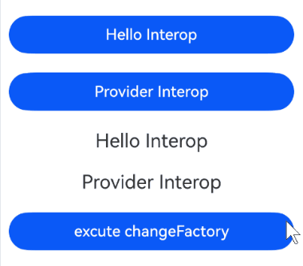

# 在ArkTS-Dyn中使用ArkTS-Sta管理组件拥有的状态
<!--Kit: ArkUI-->
<!--Subsystem: ArkUI-->
<!--Owner: @lixingchi1; @katabanga-->
<!--Designer: @lixingchi1; @katabanga-->
<!--Tester: @TerryTsao-->
<!--Adviser: @zhang_yixin13-->

## 概述

从API version 23开始，ArkTS-Dyn使用ArkTS-Sta管理组件拥有的状态，涉及状态管理V2交互的场景主要包括：

1. ArkTS-Sta子组件通过ArkTS-Dyn父组件初始化状态数据并进行状态绑定。

2. ArkTS-Sta子组件通过[@Consumer](../ui/state-management-static/arkts-static-new-provider-and-consumer.md)和ArkTS-Dyn祖先节点进行交互。


## 使用限制

- 遵循ArkTS-Dyn @Local的[使用限制](../ui/state-management/arkts-new-local.md#限制条件)；

- 遵循ArkTS-Dyn @Param的[使用限制](../ui/state-management/arkts-new-param.md#限制条件)；

- 遵循ArkTS-Dyn @Event的[使用限制](../ui/state-management/arkts-new-event.md#限制条件)；

- 遵循ArkTS-Dyn @Provider和@Consumer的[使用限制](../ui/state-management/arkts-new-provider-and-consumer.md#使用限制)；

- 遵循ArkTS-Sta @Local的[使用限制](../ui/state-management-static/arkts-static-new-local.md#限制条件)；

- 遵循ArkTS-Sta @Param的[使用限制](../ui/state-management-static/arkts-static-new-param.md#限制条件)；

- 遵循ArkTS-Sta @Event的[使用限制](../ui/state-management-static/arkts-static-new-event.md#限制条件)；

- 遵循ArkTS-Sta @Provider和@Consumer的[使用限制](../ui/state-management-static/arkts-static-new-provider-and-consumer.md#使用限制)。


## 使用场景

基于以下示例结构，说明在ArkTS-Dyn中与ArkTS-Sta状态管理V2变量进行互操作的场景。

```text
project/
├── entry/                                   # ArkTS-Dyn主模块
│   └── src/
│       └── main/
│           └── ets/
│               └── pages/
│                   └── StatemgmtV2.ets      # 在ArkTS-Dyn主模块中引入ArkTS-Sta自定义组件，并给其状态变量赋值
│
└── static_module/                           # ArkTS-Sta子模块
    └── src/
        └── main/
            └── ets/
                └── components/
                    └── StaStatemgmtV2.ets   # 定义ArkTS-Sta自定义组件，与ArkTS-Dyn状态变量互操作
```

示例如下：

- 创建ArkTS-Sta子模块`static_module`，在`static_module/src/main/ets/components`目录创建并导出自定义组件。如何创建子模块参考共享包（[HAR](../quick-start/har-package.md)）说明。

<!-- @[DynInteropStaStatemgmtV2StaStateMgmtV2](https://gitcode.com/openharmony/applications_app_samples/blob/OpenHarmony_feature_sta_20260331/code/DocsSample/ArkUISample-Sta/DynInteropStaState/static_module/src/main/ets/components/StaStatemgmtV2.ets) -->

``` TypeScript
// static_module/src/main/ets/components/StaStatemgmtV2.ets
import { Entry, ComponentV2, Column, Button, ClickEvent, Text, Color } from '@ohos.arkui.component';
import { Param, Consumer, Event } from '@ohos.arkui.stateManagement';

@ComponentV2
export struct MainPageV2 {
  // 通过@Param接收ArkTS-Dyn父组件传递的状态变量
  @Param paramMessage: string = 'static Param';
  // 通过@Consumer与ArkTS-Dyn父组件进行交互
  @Consumer() consumerMessage: string = 'static Consumer';
  // 通过@Event与ArkTS-Dyn父组件进行交互
  @Event changeFactory: () => void = () => {};

  build(): void {
    Column() {
      Text(this.paramMessage)
        .fontSize(20)
        .margin(10)
      Text(this.consumerMessage)
        .fontSize(20)
        .margin(10)
        .onClick((e: ClickEvent) => {
          // 通过@Consumer修改ArkTS-Dyn父组件的状态变量
          this.consumerMessage += '!';
        })
      Button('excute changeFactory')
        .onClick((e: ClickEvent) => {
          // 通过@Event修改ArkTS-Dyn父组件的状态变量
          this.changeFactory();
        })
        .width(300)
        .margin(10)
    }
    .width('100%')
  }
}
```

<!-- @[DynInteropStaStatemgmtV2Index](https://gitcode.com/openharmony/applications_app_samples/blob/OpenHarmony_feature_sta_20260331/code/DocsSample/ArkUISample-Sta/DynInteropStaState/static_module/Index.ets) -->

``` TypeScript
// static_module/Index.ets
export { MainPageV2 } from './src/main/ets/components/StaStatemgmtV2';
```

- 在主模块`entry`的`oh-package.json5`文件中配置子模块依赖。如何导入和使用子模块参考共享包（[HAR](../quick-start/har-package.md)）说明。

```json
// entry/oh-package.json5

"dependencies": {
  "static_module": "file:../static_module"
}
```

- 在ArkTS-Dyn主模块`entry`中引入ArkTS-Sta组件。

<!-- @[DynInteropStaStatemgmtV2](https://gitcode.com/openharmony/applications_app_samples/blob/OpenHarmony_feature_sta_20260331/code/DocsSample/ArkUISample-Sta/DynInteropStaState/entry/src/main/ets/pages/StatemgmtV2.ets) -->

``` TypeScript
// entry/src/main/ets/pages/StatemgmtV2.ets
import { MainPageV2 } from 'static_module';

@Entry
@ComponentV2
struct ParentComp {
  @Local localMessage: string = 'Hello Interop';
  @Provider() consumerMessage: string = 'Provider Interop';
  
  build() {
    Column() {
      Button(this.localMessage)
        .onClick(() => {
          // 通过@Local修改本组件的状态变量
          this.localMessage += '~';
        })
        .width(300)
        .margin(10)
      Button(this.consumerMessage)
        .onClick(() => {
          // 通过@Provider修改本组件的状态变量
          this.consumerMessage += '~';
        })
        .width(300)
        .margin(10)
      MainPageV2({
        paramMessage: this.localMessage,
        changeFactory: () => {
          // 子组件调用，通过@Event修改父组件的状态变量
          this.consumerMessage += '@Event';
        }
      })
    }
    .width('100%')
    .height('100%')
  }
}
```

示例效果图：


