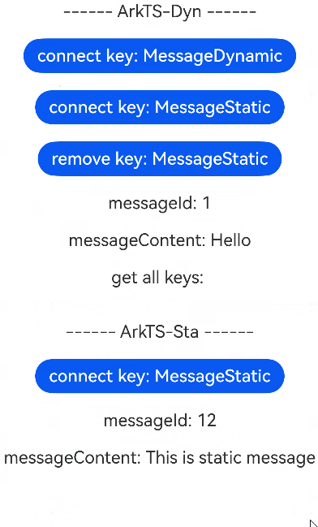
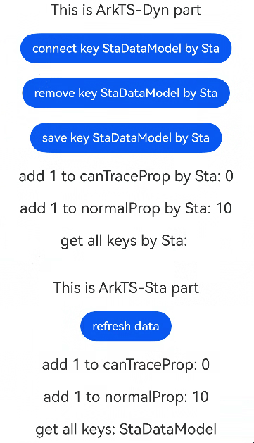

# 在ArkTS-Dyn中使用ArkTS-Sta管理应用拥有的状态

## 概述

从API version 23开始，支持AppStorageV2互操作，在ArkTS-Sta和ArkTS-Dyn上下文中使用[AppStorageV2](./state-management-static/arkts-static-appstoragev2.md)的场景。

不支持[PersistenceV2](./state-management-static/arkts-static-new-persistencev2.md)互操作，详见[ArkTS-Dyn和ArkTS-Sta的PersistenceV2不支持互操作](#arkts-dyn和arkts-sta的persistencev2不支持互操作)。


## 使用限制

- 遵循ArkTS-Dyn AppStorageV2的[使用限制](../ui/state-management/arkts-new-appstoragev2.md#使用限制)；

- 遵循ArkTS-Dyn PersistenceV2的[使用限制](../ui/state-management/arkts-new-persistencev2.md#使用限制)；

- 遵循ArkTS-Sta AppStorageV2的[使用限制](../ui/state-management-static/arkts-static-appstoragev2.md#使用限制)；

- 遵循ArkTS-Sta PersistenceV2的[使用限制](../ui/state-management-static/arkts-static-new-persistencev2.md#使用限制)。


## 使用场景

### 在ArkTS-Dyn模块调用AppStorageV2接口操作ArkTS-Sta模块

完整示例结构如下：

```text
project/
├── entry/                            # ArkTS-Dyn主模块
│   └── src/
│       └── main/
│           └── ets/
│               └── pages/
│                   └── Index.ets     # 使用ArkTS-Sta导出的数据模型
│
└── static_module/                    # ArkTS-Sta子模块
    └── src/
        └── main/
            └── ets/
                └── components/
                    └── MainPage.ets  # 声明ArkTS-Sta数据模型并使用AppStorageV2存储数据
```

示例如下：

- 创建ArkTS-Sta子模块`static_module`，在`static_module/src/main/ets/components`目录进行数据模型声明并初始化一个key为`MessageStatic`的`MessageModel`对象。如何创建子模块参考共享包（[HAR](../quick-start/har-package.md)）说明。

```TypeScript
'use static'

// static_module/src/main/ets/component/MainPage.ets
import {
  ComponentV2, Column, Text, Button, Divider, enableCompatibleObservedV2ForDynamic
} from '@ohos.arkui.component';
import { AppStorageV2, ObservedV2, Trace, Local } from '@ohos.arkui.stateManagement';

export const STATIC_KEY = 'MessageStatic';
export const DYNAMIC_KEY = 'MessageDynamic';
export const FONT_SIZE: int = 20;
export const MARGIN: int = 10;

// AppStorageV2所存储的数据模型
@ObservedV2
export class MessageModel {
  @Trace messageId: number;
  messageContent: string;

  constructor(messageId?: number, messageContent?: string) {
    this.messageId = messageId ?? 1;
    this.messageContent = messageContent ?? 'Hello';
  }
}

// 导出ArkTS-Sta中实现的enableCompatibleObservedV2ForDynamic方法
export function setEnableCompatibleObservedV2ForDynamic(T: Object) {
  // 调用enableCompatibleObservedV2ForDynamic方法，使ArkTS-Sta @Trace修饰的属性在ArkTS-Dyn中可观测
  enableCompatibleObservedV2ForDynamic(T);
}

@ComponentV2
export struct MainPage {
  // 使用connect在ArkTS-Sta模块的AppStorageV2中创建一个key为MessageStatic的MessageModel对象
  // 修改connect的返回值即可同步回AppStorageV2
  @Local message: MessageModel = AppStorageV2.connect<MessageModel>(
    Type.from<MessageModel>(),
    `${STATIC_KEY}`,
    () => new MessageModel(12, 'This is static message')
  )!;

  build() {
    Column() {
      Divider()
        .margin(`${MARGIN}`)

      Text('------ ArkTS-Sta ------')
        .fontSize(`${FONT_SIZE}`)
        .margin(`${MARGIN}`)

      // 在ArkTS-Sta模块调用connect函数, 会从ArkTS-Sta模块的AppStorageV2中获取key为MessageStatic的MessageModel的对象
      // 在ArkTS-Dyn模块中remove之后，回到ArkTS-Sta模块重新connect添加，修改ArkTS-Dyn模块的组件的messageId，可以发现在ArkTS-Sta模块数据已经不同步，在ArkTS-Dyn模块中重新connect之后，数据一致
      Button(`connect key: ${STATIC_KEY}`)
        .fontSize(`${FONT_SIZE}`)
        .margin(`${MARGIN}`)
        .onClick(() => {
          this.message = AppStorageV2.connect<MessageModel>(
            Type.from<MessageModel>(),
            `${STATIC_KEY}`,
            () => new MessageModel(22, 'This is reconnected static message')
          )!;
        })

      // 修改@Trace装饰的类属性，UI能同步刷新
      Text(`messageId: ${this.message.messageId}`)
        .fontSize(`${FONT_SIZE}`)
        .margin(`${MARGIN}`)
        .onClick(() => {
          this.message.messageId += 5;
        })

      // 修改非@Trace装饰的类属性，UI不会同步刷新，但修改的类属性已同步回AppStorageV2
      Text(`messageContent: ${this.message.messageContent}`)
        .fontSize(`${FONT_SIZE}`)
        .margin(`${MARGIN}`)
        .onClick(() => {
          this.message.messageContent += ' plus';
        })
    }
  }
}
```

- 对ArkTS-Sta模块`static_module/Index.ets`文件中的组件进行导出。

```TypeScript
'use static'

// static_module/Index.ets
export {
  MainPage, STATIC_KEY, DYNAMIC_KEY, FONT_SIZE, MARGIN, MessageModel, setEnableCompatibleObservedV2ForDynamic
} from './src/main/ets/components/MainPage';
```

- 在主模块的`entry/oh-package.json5`文件中配置子模块依赖。如何导入和使用子模块参考共享包（[HAR](../quick-start/har-package.md)）说明。

```json
// entry/oh-package.json5

"dependencies": {
  // 从根目录导入依赖模块
  "static_module": "file:../static_module"
}
```

- 在ArkTS-Dyn主模块的`entry/src/main/ets/pages/Index.ets`文件中进行数据存储并实现互操作方法。

```TypeScript
// entry/src/main/ets/pages/Index.ets

import { AppStorageV2 } from '@kit.ArkUI';
import {
  STATIC_KEY, DYNAMIC_KEY, FONT_SIZE, MARGIN, MessageModel, setEnableCompatibleObservedV2ForDynamic, MainPage
} from 'static_module';

@Entry
@ComponentV2
struct Index {
  // 声明一个MessageModel对象
  @Local staMessage: MessageModel = new MessageModel();
  @Local keys: string[] = [];

  aboutToAppear() {
    // 调用setEnableCompatibleObservedV2ForDynamic方法，使ArkTS-Sta @Trace修饰的属性在ArkTS-Dyn中可观测
    setEnableCompatibleObservedV2ForDynamic(this.staMessage);
  }

  build() {
    Column() {
      Text('------ ArkTS-Dyn ------')
        .fontSize(`${FONT_SIZE}`)
        .margin(`${MARGIN}`)

      // 使用connect在ArkTS-Dyn模块的AppStorageV2中创建一个key为MessageDynamic的MessageModel对象
      Button(`connect key: ${DYNAMIC_KEY}`)
        .fontSize(`${FONT_SIZE}`)
        .margin(`${MARGIN}`)
        .onClick(() => {
          const dynMessage: MessageModel = AppStorageV2.connect(
            MessageModel,
            `${DYNAMIC_KEY}`,
            () => new MessageModel(11, 'This is dynamic message')
          )!;
        })

      // 在ArkTS-Dyn模块调用connect函数, 会从ArkTS-Sta模块的AppStorageV2中获取key为MessageStatic的MessageModel的对象
      // 修改connect的返回值即可同步回ArkTS-Sta模块的AppStorageV2
      // 如果ArkTS-Sta模块的AppStorageV2中不存在key为MessageStatic的MessageModel的对象，则会在ArkTS-Dyn模块的AppStorageV2中创建一个key为MessageStatic的MessageModel对象
      // 在this.staMessage被重新赋值时，需要调用setEnableCompatibleObservedV2ForDynamic方法，使ArkTS-Sta @Trace修饰的属性可以在ArkTS-Dyn中重新被观测
      Button(`connect key: ${STATIC_KEY}`)
        .fontSize(`${FONT_SIZE}`)
        .margin(`${MARGIN}`)
        .onClick(() => {
          this.staMessage = AppStorageV2.connect(
            MessageModel,
            `${STATIC_KEY}`,
            () => new MessageModel(11, 'This message is connected in Dyn')
          )!;
          setEnableCompatibleObservedV2ForDynamic(this.staMessage);
        })

      // 在ArkTS-Dyn模块调用remove函数, 会从ArkTS-Dyn模块和ArkTS-Sta模块的AppStorageV2中删除key为MessageStatic的MessageModel的对象
      // remove之后，修改messageId，ArkTS-Dyn模块和ArkTS-Sta模块的组件能同步变化，因为remove只是从AppStorageV2删除，不会影响组件中已存在的数据
      Button(`remove key: ${STATIC_KEY}`)
        .fontSize(`${FONT_SIZE}`)
        .margin(`${MARGIN}`)
        .onClick(() => {
          AppStorageV2.remove(`${STATIC_KEY}`);
        })

      // 修改@Trace装饰的类属性，UI能同步刷新
      Text(`messageId: ${this.staMessage.messageId}`)
        .fontSize(`${FONT_SIZE}`)
        .margin(`${MARGIN}`)
        .onClick(() => {
          this.staMessage.messageId += 1;
        })

      // 修改非@Trace装饰的类属性，UI不会同步刷新，但修改的类属性已同步回AppStorageV2
      Text(`messageContent: ${this.staMessage.messageContent}`)
        .fontSize(`${FONT_SIZE}`)
        .margin(`${MARGIN}`)
        .onClick(() => {
          this.staMessage.messageContent += ' plus';
        })

      // connect或者remove操作后，查看AppStorageV2存储的MessageModel对象的所有key
      Text(`get all keys: ${this.keys}`)
        .fontSize(`${FONT_SIZE}`)
        .margin(`${MARGIN}`)
        .onClick(() => {
          this.keys = AppStorageV2.keys();
        })

      // 注册绑定互操作并调用ArkTS-Sta模块组件，初始化一个ArkTS-Sta对象
      MainPage()
    }
  }
}
```




### ArkTS-Dyn和ArkTS-Sta的PersistenceV2不支持互操作

ArkTS-Sta和ArkTS-Dyn的[PersistenceV2](state-management-static/arkts-static-new-persistencev2.md)由于序列化反序列化差异，不支持互操作。如果有场景必须在ArkTS-Dyn模块使用ArkTS-Sta模块的PersistenceV2或在ArkTS-Sta模块使用ArkTS-Dyn模块的PersistenceV2，从API version 23开始，可以通过在ArkTS-Sta模块或ArkTS-Dyn模块提供自定义对外接口封装PersistenceV2来实现相互使用。

完整示例结构如下：

```text
project/
├── entry/                  # ArkTS-Dyn主模块
│   └── src/
│       └── main/
│           └── ets/
│               └── pages/
│                   └── Index.ets
│
└── static_module/          # ArkTS-Sta子模块
    └── src/
        └── main/
            └── ets/
                └── components/
                    └── MainPage.ets
```

示例如下：

- 在ArkTS-Sta子模块的`static_module/src/main/ets/component/MainPage.ets`文件中进行接口实现。

```TypeScript
'use static'
// static_module/src/main/ets/components/MainPage.ets

import { Text, Column, ComponentV2, Button, ClickEvent, Divider } from '@ohos.arkui.component';
import { ObservedV2, Local, Trace, PersistenceV2 } from '@ohos.arkui.stateManagement';

// 接受序列化失败的回调
PersistenceV2.notifyOnError((key: string, reason: string, msg: string) => {
  console.error(`error key: ${key}, reason: ${reason}, message: ${msg}`);
});

// PersistenceV2存储的数据模型
@ObservedV2
export class StaDataModel {
  @Trace canTraceProp: int = 0;
  normalProp: int = 10;

  constructor(canTraceProp?: int, normalProp?: int) {
    this.canTraceProp = canTraceProp ?? 0;
    this.normalProp = normalProp ?? 10;
  }

  public toJson(): jsonx.JsonElement {
    const root = new jsonx.JsonElement();
    // 存储canTraceProp
    const canTracePropEle = new jsonx.JsonElement();
    canTracePropEle.setInteger(this.canTraceProp);
    root.setElement('canTraceProp', canTracePropEle);

    // 存储normalProp
    const normalPropEle = new jsonx.JsonElement();
    normalPropEle.setInteger(this.normalProp);
    root.setElement('normalProp', normalPropEle);

    return root;
  }

  public fromJson(json: jsonx.JsonElement): void {
    this.canTraceProp = json.getElement('canTraceProp').asInteger();
    this.normalProp = json.getElement('normalProp').asInteger();
  }
}

const toJsonStaDataModel = (staDataModel: StaDataModel) => {
  return staDataModel.toJson();
}

const fromJsonStaDataModel = (json: jsonx.JsonElement): StaDataModel => {
  const staDataModel = new StaDataModel();
  staDataModel.fromJson(json);
  return staDataModel;
}

function getStaDataModelObject(): StaDataModel {
  return PersistenceV2.connect(
    Type.from<StaDataModel>(),
    'StaDataModel',
    toJsonStaDataModel,
    fromJsonStaDataModel,
    (): StaDataModel => {
      return new StaDataModel();
    })!;
}

// 对外接口，对ArkTS-Sta模块canTraceProp的值进行累加
// 如果ArkTS-Sta模块的PersistenceV2中无key为StaDataModel的StaDataModel对象，则创建该对象
// 反之则获取该对象并与staDataModel关联，返回staDataModel的canTraceProp给调用者
export function canTracePropPlusInStatic(): int {
  const staDataModel = getStaDataModelObject();
  staDataModel.canTraceProp++;
  return staDataModel.canTraceProp;
}

// 对外接口，对ArkTS-Sta模块normalProp的值进行累加
// 如果ArkTS-Sta模块的PersistenceV2中无key为StaDataModel的StaDataModel对象，则创建该对象
// 反之则获取该对象并与staDataModel关联，返回staDataModel的normalProp给调用者
export function normalPropPlusInStatic(): int {
  const staDataModel = getStaDataModelObject();
  staDataModel.normalProp++;
  return staDataModel.normalProp;
}

// 对外接口，实现调用ArkTS-Sta模块的PersistenceV2.connect接口
export function connectInStatic(): StaDataModel {
  return PersistenceV2.connect(
    Type.from<StaDataModel>(),
    'StaDataModel',
    toJsonStaDataModel,
    fromJsonStaDataModel,
    (): StaDataModel => {
      return new StaDataModel();
    })!;
}

// 对外接口，实现调用ArkTS-Sta模块的PersistenceV2.save接口
export function saveInStatic(): void {
  PersistenceV2.save(Type.from<StaDataModel>());
}

// 对外接口，实现调用ArkTS-Sta模块的PersistenceV2.remove接口
export function removeInStatic(): void {
  PersistenceV2.remove(Type.from<StaDataModel>());
}

// 对外接口，实现调用ArkTS-Sta模块的PersistenceV2.keys接口
export function keysInStatic(): Array<string> {
  const result = PersistenceV2.keys();
  return result;
}

@ComponentV2
export struct MainPage {
  // 在PersistenceV2中创建一个key为StaDataModel的键值对（如果存在，则返回PersistenceV2中的数据），并且和prop关联
  // 对于需要换connect对象的localVar属性，需要加@Local修饰（不建议对属性换connect的对象）
  @Local localVar: StaDataModel = PersistenceV2.connect<StaDataModel>(
    Type.from<StaDataModel>(),
    toJsonStaDataModel,
    fromJsonStaDataModel,
    (): StaDataModel => {
      return new StaDataModel();
    })!;
  @Local keys: Array<string> = PersistenceV2.keys();

  build() {
    Column() {
      Divider()
        .margin(10)

      Text('This is ArkTS-Sta part')
        .fontSize(20)
        .margin(10)

      // 在ArkTS-Dyn模块调用connect接口重连后，重新与localVar关联，页面数据刷新
      Button('refresh data')
        .margin(10)
        .onClick((event: ClickEvent): void => {
          this.localVar = connectInStatic();
        })

      // 页面刷新，canTraceProp的值改变
      Text(`add 1 to canTraceProp: ${this.localVar.canTraceProp}`)
        .margin(10)
        .fontSize(20)
        .onClick(() => {
          this.localVar.canTraceProp++;
        })

      // 页面不刷新，但是normalProp的值改变了
      Text(`add 1 to normalProp: ${this.localVar.normalProp}`)
        .margin(10)
        .fontSize(20)
        .onClick(() => {
          this.localVar.normalProp++;
        })

      // 获取当前PersistenceV2里面的所有key
      Text(`get all keys: ${this.keys}`)
        .margin(10)
        .fontSize(20)
        .onClick(() => {
          // 刷新页面中的所有key
          this.keys = PersistenceV2.keys();
        })
    }
  }
}
```

- 对ArkTS-Sta子模块`static_module/Index.ets`文件中的接口进行导出。

```TypeScript
// static_module/Index.ets

export {
  MainPage, canTracePropPlusInStatic, normalPropPlusInStatic, connectInStatic, saveInStatic, removeInStatic,
  keysInStatic, StaDataModel
} from './src/main/ets/components/MainPage';
```

- 在子模块的`entry/oh-package.json5`文件中配置子模块依赖。

```json
// entry/oh-package.json5

"dependencies": {
  // 从根目录导入依赖模块。
  "static_module": "file:../static_module"
}
```

- 在ArkTS-Dyn模块的`entry/src/main/ets/pages/Index.ets`文件中调用ArkTS-Sta模块的自定义接口。

```TypeScript
// entry/src/main/ets/pages/Index.ets

import { PersistenceV2 } from '@kit.ArkUI';
import {
  MainPage, canTracePropPlusInStatic, normalPropPlusInStatic, connectInStatic, saveInStatic, removeInStatic,
  keysInStatic, StaDataModel
} from 'static_module';

@Entry
@ComponentV2
struct Index {
  // 承接ArkTS-Sta模块的数据
  @Local canTraceProp: number = 0;
  @Local normalProp: number = 10;
  @Local keys: string[] = [];

  build() {
    Column() {
      Text('This is ArkTS-Dyn part')
        .fontSize(20)
        .margin(10)

      // 在ArkTS-DynSta模块调用ArkTS-Sta模块的connect接口，返回一个key为StaDataModel的StaDataModel对象
      Button('connect key StaDataModel by Sta')
        .margin(10)
        .onClick(() => {
          const staModel: StaDataModel = connectInStatic();
          this.canTraceProp = staModel.canTraceProp;
          this.normalProp = staModel.normalProp;
        })

      // 在ArkTS-Dyn模块调用ArkTS-Sta模块的remove接口
      Button('remove key StaDataModel by Sta')
        .margin(10)
        .onClick(() => {
          removeInStatic();
        })

      // 在ArkTS-Dyn模块调用ArkTS-Sta模块的save接口
      Button('save key StaDataModel by Sta')
        .margin(10)
        .onClick(() => {
          saveInStatic();
        })

      // 在ArkTS-Sta模块调用ArkTS-Dyn模块的canTraceProp累加接口
      // this.canTraceProp被重新赋值，页面刷新
      Text(`add 1 to canTraceProp by Sta: ${this.canTraceProp}`)
        .margin(10)
        .fontSize(20)
        .onClick(() => {
          this.canTraceProp = canTracePropPlusInStatic();
        })

      // 在ArkTS-Dyn模块调用ArkTS-Sta模块的normalProp累加接口
      // this.normalProp被重新赋值，页面刷新
      Text(`add 1 to normalProp by Sta: ${this.normalProp}`)
        .margin(10)
        .fontSize(20)
        .onClick(() => {
          this.normalProp = normalPropPlusInStatic();
        })

      Text(`get all keys by Sta: ${this.keys}`)
        .margin(10)
        .fontSize(20)
        .onClick(() => {
          this.keys = keysInStatic();
        })

      // 调用ArkTS-Sta模块组件，初始化一个ArkTS-Sta对象
      MainPage()
    }
    .width('100%')
    .height('100%')
  }
}
```

