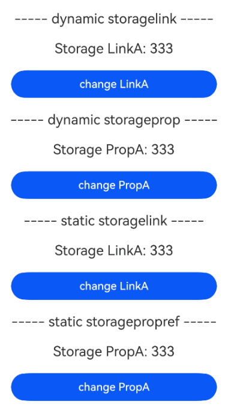
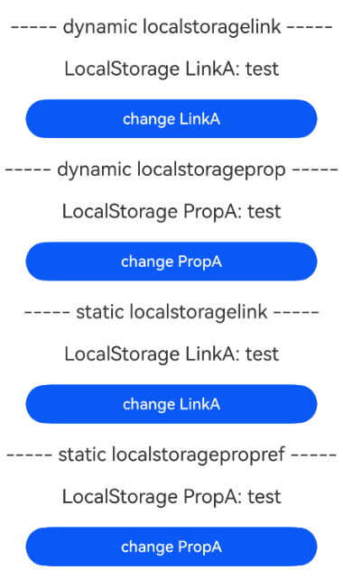
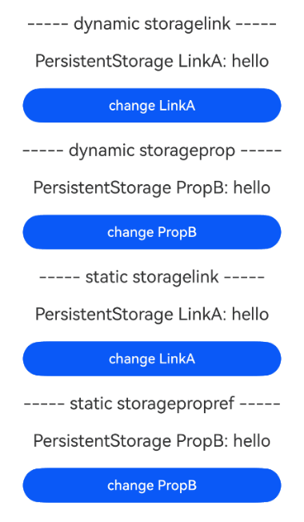
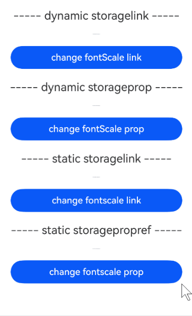

# 在ArkTS-Dyn中使用ArkTS-Sta管理应用拥有的状态
<!--Kit: ArkUI-->
<!--Subsystem: ArkUI-->
<!--Owner: @lixingchi1; @katabanga-->
<!--Designer: @lixingchi1; @katabanga-->
<!--Tester: @TerryTsao-->
<!--Adviser: @zhang_yixin13-->

## 概述

从API version 23开始，ArkTS-Dyn使用ArkTS-Sta管理应用拥有的状态，适用于使用[AppStorage](../ui/state-management/arkts-appstorage.md)，[LocalStorage](../ui/state-management/arkts-localstorage.md)，[PersistentStorage](../ui/state-management/arkts-persiststorage.md)，[Environment](../ui/state-management/arkts-environment.md)的场景。


## 使用限制

- 遵循ArkTS-Dyn AppStorage的[使用限制](./state-management/arkts-appstorage.md#限制条件)；

- 遵循ArkTS-Dyn LocalStorage的[使用限制](./state-management/arkts-localstorage.md#限制条件)；

- 遵循ArkTS-Dyn PersistentStorage的[使用限制](./state-management/arkts-persiststorage.md#限制条件)；

- 遵循ArkTS-Dyn Environment的[使用限制](./state-management/arkts-environment.md#限制条件)；

- 遵循ArkTS-Sta AppStorage的[使用限制](./state-management-static/arkts-static-appstorage.md#限制条件)；

- 遵循ArkTS-Sta LocalStorage的[使用限制](./state-management-static/arkts-static-localstorage.md#限制条件)；

- 遵循ArkTS-Sta PersistentStorage的[使用限制](./state-management-static/arkts-static-persiststorage.md#限制条件)；

- 遵循ArkTS-Sta Environment的[使用限制](./state-management-static/arkts-static-environment.md#限制条件)。

- 不支持[Environment.keys](../reference/apis-arkui/arkui-ts/ts-state-management-Static.md#keys-3)接口的互操作，ArkTS-Sta与ArkTS-Dyn的`Environment.keys()`返回值不互通。


## 使用场景

基于以下示例结构，说明ArkTS-Dyn使用ArkTS-Sta管理应用拥有的状态的场景。

```text
project/
├── entry/                                         # ArkTS-Dyn主模块
│   └── src/
│       └── main/
│           └── ets/
│               └── pages/
│                   └── StatemgmtV1AppStorage.ets  # ArkTS-Dyn主模块入口页面，导入并使用ArkTS-Sta自定义组件
│
└── static_module/                                 # ArkTS-Sta子模块
    └── src/
        └── main/
            └── ets/
                └── components/
                    └── StaAppStorage.ets          # 定义ArkTS-Sta自定义组件并导出
```

示例如下：

- 创建ArkTS-Sta子模块`static_module`，并导出ArkTS-Sta自定义组件。如何创建子模块参考共享包（[HAR](../quick-start/har-package.md)）说明。

<!-- @[DynInteropStaStatemgmtV1IndexAppStorage](https://gitcode.com/openharmony/applications_app_samples/blob/OpenHarmony_feature_sta_20260331/code/DocsSample/ArkUISample-Sta/DynInteropStaState/static_module/Index.ets) -->

``` TypeScript
// static_module/Index.ets
export { MainPage } from './src/main/ets/components/StaAppStorage'; // 导出ArkTS-Sta自定义组件
```

- 在主模块`entry`的`oh-package.json5`文件中配置子模块依赖。如何导入和使用子模块参考共享包（[HAR](../quick-start/har-package.md)）说明。

```json
// entry/oh-package.json5

"dependencies": {
  "static_module": "file:../static_module"
}
```


### 通过AppStorage接口进行交互

状态管理V1互操作支持通过ArkTS-Sta的[AppStorage接口](../reference/apis-arkui/arkui-ts/ts-state-management.md#appstorage)操作ArkTS-Dyn的AppStorage数据。

示例如下：

- 创建ArkTS-Sta子模块`static_module`，在ArkTS-Dyn中创建并导出自定义组件。

<!-- @[DynInteropStaStatemgmtV1StaAppStorage](https://gitcode.com/openharmony/applications_app_samples/blob/OpenHarmony_feature_sta_20260331/code/DocsSample/ArkUISample-Sta/DynInteropStaState/static_module/src/main/ets/components/StaAppStorage.ets) -->

``` TypeScript
// static_module/src/main/ets/components/StaAppStorage.ets
import { Component, Column, Button } from '@ohos.arkui.component';
import { AppStorage } from '@ohos.arkui.stateManagement';

let gPropA: number = 1;

@Component
export struct MainPage { // 定义ArkTS-Sta自定义组件
  build(): void {
    Column() {
      Button('change AppStorage')
        .onClick(() => {
          // 通过接口修改ArkTS-Dyn的AppStorage并同步更新ArkTS-Dyn组件
          AppStorage.setOrCreate('PropA', ++gPropA);
        })
        .width(300)
        .margin(10)
    }
    .width('100%')
  }
}
```

- 在ArkTS-Dyn模块中配置相关模块依赖后，导入ArkTS-Sta自定义组件。

<!-- @[DynInteropStaStatemgmtV1AppStorage](https://gitcode.com/openharmony/applications_app_samples/blob/OpenHarmony_feature_sta_20260331/code/DocsSample/ArkUISample-Sta/DynInteropStaState/entry/src/main/ets/pages/StatemgmtV1AppStorage.ets) -->

``` TypeScript
// entry/src/main/ets/pages/StatemgmtV1AppStorage.ets
import { MainPage } from 'static_module'; // 导入ArkTS-Sta自定义组件

@Entry
@Component
struct Index {
  // 初始化ArkTS-Dyn中的AppStorage数据
  @StorageLink('PropA') storageLink: number = 1;

  build() {
    Column() {
      MainPage()
      Text(`current value: ${this.storageLink}`)
        .fontSize(20)
        .margin(10)
    }
    .width('100%')
  }
}
```
示例效果图：


### ArkTS-Sta使用ArkTS-Dyn AppStorage中的数据

使用ArkTS-Sta自定义组件中的[\@StorageLink](../ui/state-management-static/arkts-static-appstorage.md#storagelink)与ArkTS-Dyn的AppStorage数据双向绑定；使用ArkTS-Sta自定义组件中的[\@StoragePropRef](../ui/state-management-static/arkts-static-appstorage.md#storagepropref)与ArkTS-Dyn的AppStorage数据单向绑定。

示例如下：

- 创建ArkTS-Sta子模块`static_module`，在`static_module/src/main/ets/components`目录创建并导出自定义组件。

<!-- @[DynInteropStaStatemgmtV1StaAppStorageData](https://gitcode.com/openharmony/applications_app_samples/blob/OpenHarmony_feature_sta_20260331/code/DocsSample/ArkUISample-Sta/DynInteropStaState/static_module/src/main/ets/components/StaAppStorageData.ets) -->

``` TypeScript
// static_module/src/main/ets/components/StaAppStorageData.ets
import { Component, Row, Column, Text, Button, ClickEvent } from '@ohos.arkui.component';
import { AppStorage, StorageLink, StoragePropRef } from '@ohos.arkui.stateManagement';

@Component
export struct AppStoragePage {
  // ArkTS-Sta绑定ArkTS-Dyn AppStorage数据
  @StorageLink('LinkA') appLink: string = 'staticA';
  @StoragePropRef('LinkA') appProp: string = 'staticA';

  build(): void {
    Row() {
      Column() {
        Text('----- static storagelink -----')
          .fontSize(20)
          .margin(10)
        Text(`Storage LinkA: ${this.appLink}`)
          .fontSize(20)
          .margin(10)
        Button('change LinkA')
          .onClick((e: ClickEvent) => {
            // 点击后同步更新ArkTS-Dyn和ArkTS-Sta中的Text组件
            this.appLink += 'b';
          })
          .width(300)
          .margin(10)
        Text('----- static storagepropref -----')
          .fontSize(20)
          .margin(10)
        Text(`Storage PropA: ${this.appProp}`)
          .fontSize(20)
          .margin(10)
        Button('change PropA')
          .onClick((e: ClickEvent) => {
            // 点击后仅更新当前Text组件
            this.appProp += 'b';
          })
          .width(300)
          .margin(10)
      }
    }
  }
}
```

- 在ArkTS-Dyn主模块中引入ArkTS-Sta组件。

<!-- @[DynInteropStaStatemgmtV1AppStorageData](https://gitcode.com/openharmony/applications_app_samples/blob/OpenHarmony_feature_sta_20260331/code/DocsSample/ArkUISample-Sta/DynInteropStaState/entry/src/main/ets/pages/StatemgmtV1AppStorageData.ets) -->

``` TypeScript
// entry/src/main/ets/pages/StatemgmtV1AppStorageData.ets
import { AppStoragePage } from 'static_module'; // 导入ArkTS-Sta自定义组件

// ArkTS-Dyn使用AppStorage，初始化key 'LinkA'
AppStorage.setOrCreate<string>('LinkA', '333');

@Entry
@Component
struct Index {
  @StorageLink('LinkA') appLink: string = 'dynamicA';
  @StorageProp('LinkA') appProp: string = 'dynamicA';

  build() {
    Column() {
      Text('----- dynamic storagelink -----')
        .fontSize(20)
        .margin(10)
      Text(`Storage LinkA: ${this.appLink}`)
        .fontSize(20)
        .margin(10)
      Button('change LinkA')
        .onClick((e: ClickEvent) => {
          // 点击后同步更新ArkTS-Dyn和ArkTS-Sta中的Text组件
          this.appLink += 'a';
        })
        .width(300)
        .margin(10)
      Text('----- dynamic storageprop -----')
        .fontSize(20)
        .margin(10)
      Text(`Storage PropA: ${this.appProp}`)
        .fontSize(20)
        .margin(10)
      Button('change PropA')
        .onClick((e: ClickEvent) => {
          // 点击后仅更新当前Text组件
          this.appProp += 'a';
        })
        .width(300)
        .margin(10)
      AppStoragePage()
    }
    .width('100%')
  }
}
```

示例效果图：



### ArkTS-Sta使用ArkTS-Dyn LocalStorage中的数据

使用ArkTS-Sta自定义组件中的\@StorageLink与ArkTS-Dyn的LocalStorage数据双向绑定；使用ArkTS-Sta自定义组件中的\@StoragePropRef与ArkTS-Dyn的LocalStorage数据单向绑定。

示例如下：

- 创建ArkTS-Sta子模块`static_module`，在`static_module/src/main/ets/components`目录创建并导出自定义组件。

<!-- @[DynInteropStaStatemgmtV1StaLocalStorage](https://gitcode.com/openharmony/applications_app_samples/blob/OpenHarmony_feature_sta_20260331/code/DocsSample/ArkUISample-Sta/DynInteropStaState/static_module/src/main/ets/components/StaLocalStorage.ets) -->

``` TypeScript
// static_module/src/main/ets/components/StaLocalStorage.ets
import { Component, Row, Column, Text, Button, ClickEvent } from '@ohos.arkui.component';
import { LocalStorage, LocalStorageLink, LocalStoragePropRef } from '@ohos.arkui.stateManagement';

@Component
export struct LocalStoragePage { // 定义ArkTS-Sta自定义组件
  // ArkTS-Sta绑定ArkTS-Dyn LocalStorage数据
  @LocalStorageLink('LinkA') localLink: string = 'staticA';
  @LocalStoragePropRef('LinkA') localProp: string = 'staticA';

  build(): void {
    Row() {
      Column() {
        Text('----- static localstoragelink -----')
          .fontSize(20)
          .margin(10)
        Text(`LocalStorage LinkA: ${this.localLink}`)
          .fontSize(20)
          .margin(10)
        Button('change LinkA')
          .onClick((e: ClickEvent) => {
            // 点击后同步更新ArkTS-Dyn和ArkTS-Sta中的Text组件
            this.localLink += 'b';
          })
          .width(300)
          .margin(10)
        Text('----- static localstoragepropref -----')
          .fontSize(20)
          .margin(10)
        Text(`LocalStorage PropA: ${this.localProp}`)
          .fontSize(20)
          .margin(10)
        Button('change PropA')
          .onClick((e: ClickEvent) => {
            // 点击后仅更新当前Text组件
            this.localProp += 'b';
          })
          .width(300)
          .margin(10)
      }
    }
  }
}
```

- 在ArkTS-Dyn主模块中引入ArkTS-Sta组件。

<!-- @[DynInteropStaStatemgmtV1LocalStorage](https://gitcode.com/openharmony/applications_app_samples/blob/OpenHarmony_feature_sta_20260331/code/DocsSample/ArkUISample-Sta/DynInteropStaState/entry/src/main/ets/pages/StatemgmtV1LocalStorage.ets) -->

``` TypeScript
// entry/src/main/ets/pages/StatemgmtV1LocalStorage.ets
import { LocalStoragePage } from 'static_module';

// 初始化ArkTS-Dyn中的LocalStorage数据
const para: Record<string, string> = { 'LinkA': 'test' };
const storageInst: LocalStorage = new LocalStorage(para);

@Entry(storageInst) // 传入LocalStorage实例
@Component
struct Index {
  // ArkTS-Dyn使用LocalStorage
  @LocalStorageLink('LinkA') localLink: string = 'dynamicA';
  @LocalStorageProp('LinkA') localProp: string = 'dynamicA';

  build() {
    Column() {
      Text('----- dynamic localstoragelink -----')
        .fontSize(20)
        .margin(10)
      Text(`LocalStorage LinkA: ${this.localLink}`)
        .fontSize(20)
        .margin(10)
      Button('change LinkA')
        .onClick((e: ClickEvent) => {
          // 点击后同步更新ArkTS-Dyn和ArkTS-Sta中的Text组件
          this.localLink += 'a';
        })
        .width(300)
        .margin(10)
      Text('----- dynamic localstorageprop -----')
        .fontSize(20)
        .margin(10)
      Text(`LocalStorage PropA: ${this.localProp}`)
        .fontSize(20)
        .margin(10)
      Button('change PropA')
        .onClick((e: ClickEvent) => {
          // 点击后仅更新当前Text组件
          this.localProp += 'a';
        })
        .width(300)
        .margin(10)
      LocalStoragePage()
    }
    .width('100%')
  }
}
```

示例效果图：



### ArkTS-Sta使用ArkTS-Dyn PersistentStorage中的数据

使用ArkTS-Sta自定义组件中的\@StorageLink与ArkTS-Dyn的PersistentStorage数据双向绑定；使用ArkTS-Sta自定义组件中的\@StoragePropRef与ArkTS-Dyn的PersistentStorage数据单向绑定。

示例如下：

- 创建ArkTS-Sta子模块`static_module`，在`static_module/src/main/ets/components`目录创建并导出自定义组件。

<!-- @[DynInteropStaStatemgmtV1StaPersistentStorage](https://gitcode.com/openharmony/applications_app_samples/blob/OpenHarmony_feature_sta_20260331/code/DocsSample/ArkUISample-Sta/DynInteropStaState/static_module/src/main/ets/components/StaPersistentStorage.ets) -->

``` TypeScript
// static_module/src/main/ets/components/StaPersistentStorage.ets
import { Component, Row, Column, Text, Button, ClickEvent } from '@ohos.arkui.component';
import { PersistentStorage, StorageLink, StoragePropRef } from '@ohos.arkui.stateManagement';

@Component
export struct PersistentStoragePage { // 定义ArkTS-Sta自定义组件
  // ArkTS-Sta绑定ArkTS-Dyn PersistentStorage数据
  @StorageLink('LinkA') persistLink: string = 'staticB';
  @StoragePropRef('LinkA') persistProp: string = 'staticB';

  build(): void {
    Row() {
      Column() {
        Text('----- static storagelink -----')
          .fontSize(20)
          .margin(10)
        // 退出应用后重新进入，修改保留
        Text(`PersistentStorage LinkA: ${this.persistLink}`)
          .fontSize(20)
          .margin(10)
        Button('change LinkA')
          .onClick((e: ClickEvent) => {
            // 点击后同步更新ArkTS-Dyn和ArkTS-Sta中的Text组件
            this.persistLink += 'b';
          })
          .width(300)
          .margin(10)
        Text('----- static storagepropref -----')
          .fontSize(20)
          .margin(10)
        // 退出应用后重新进入，同步为LinkA的值
        Text(`PersistentStorage PropB: ${this.persistProp}`)
          .fontSize(20)
          .margin(10)
        Button('change PropB')
          .onClick((e: ClickEvent) => {
            // 点击后仅更新当前Text组件
            this.persistProp += 'b';
          })
          .width(300)
          .margin(10)
      }
    }
  }
}
```

- 在ArkTS-Dyn主模块中引入ArkTS-Sta组件。

<!-- @[DynInteropStaStatemgmtV1PersistentStorage](https://gitcode.com/openharmony/applications_app_samples/blob/OpenHarmony_feature_sta_20260331/code/DocsSample/ArkUISample-Sta/DynInteropStaState/entry/src/main/ets/pages/StatemgmtV1PersistentStorage.ets) -->

``` TypeScript
// entry/src/main/ets/pages/StatemgmtV1PersistentStorage.ets
import { PersistentStoragePage } from 'static_module';

// ArkTS-Dyn使用PersistentStorage，初始化key 'LinkA'
PersistentStorage.persistProp('LinkA', 'hello');

@Entry
@Component
struct Index {
  // ArkTS-Dyn使用PersistentStorage
  @StorageLink('LinkA') persistLink: string = 'staticB';
  @StorageProp('LinkA') persistProp: string = 'staticB';

  build() {
    Column() {
      Text('----- dynamic storagelink -----')
        .fontSize(20)
        .margin(10)
      // 退出应用后重新进入，修改保留
      Text(`PersistentStorage LinkA: ${this.persistLink}`)
        .fontSize(20)
        .margin(10)
      Button('change LinkA')
        .onClick((e: ClickEvent) => {
          // 点击后同步更新ArkTS-Dyn和ArkTS-Sta中的Text组件
          this.persistLink += 'a';
        })
        .width(300)
        .margin(10)
      Text('----- dynamic storageprop -----')
        .fontSize(20)
        .margin(10)
      // 退出应用后重新进入，同步为LinkA的值
      Text(`PersistentStorage PropB: ${this.persistProp}`)
        .fontSize(20)
        .margin(10)
      Button('change PropB')
        .onClick((e: ClickEvent) => {
          // 点击后仅更新当前Text组件
          this.persistProp += 'a';
        })
        .width(300)
        .margin(10)
      PersistentStoragePage()
    }
    .width('100%')
  }
}
```

示例效果图：



### ArkTS-Sta使用ArkTS-Dyn Environment中的数据

使用ArkTS-Sta自定义组件中的\@StorageLink与ArkTS-Dyn的Environment数据双向绑定；使用ArkTS-Sta自定义组件中的\@StoragePropRef与ArkTS-Dyn的Environment数据单向绑定。

示例如下：

- 创建ArkTS-Sta子模块`static_module`，在`static_module/src/main/ets/components`目录创建并导出自定义组件。

<!-- @[DynInteropStaStatemgmtV1StaEnvironment](https://gitcode.com/openharmony/applications_app_samples/blob/OpenHarmony_feature_sta_20260331/code/DocsSample/ArkUISample-Sta/DynInteropStaState/static_module/src/main/ets/components/StaEnvironment.ets) -->

``` TypeScript
// static_module/src/main/ets/components/StaEnvironment.ets
import { Component, Row, Column, Text, Button, ClickEvent } from '@ohos.arkui.component';
import { Environment, StorageLink, StoragePropRef } from '@ohos.arkui.stateManagement';

@Component
export struct EnvironmentPage { // 定义ArkTS-Sta自定义组件
  // ArkTS-Sta绑定ArkTS-Dyn Environment数据
  @StorageLink('fontScale') fontScaleLink: number = 4.0;
  @StoragePropRef('fontScale') fontScaleProp: number = 4.0;

  build(): void {
    Row() {
      Column() {
        Text('----- static storagelink -----')
          .fontSize(20)
          .margin(10)
        Text(`Environment fontscale link: ${this.fontScaleLink}`)
          .fontSize(this.fontScaleLink)
          .margin(10)
        Button('change fontscale link')
          .onClick((e: ClickEvent) => {
            // 点击后同步更新ArkTS-Dyn和ArkTS-Sta中的Text组件，fontSize加2
            this.fontScaleLink += 2.0;
          })
          .width(300)
          .margin(10)
        Text('----- static storagepropref -----')
          .fontSize(20)
          .margin(10)
        Text(`Environment fontscale prop: ${this.fontScaleProp}`)
          .fontSize(this.fontScaleProp)
          .margin(10)
        Button('change fontscale prop')
          .onClick((e: ClickEvent) => {
            // 点击后仅更新当前Text组件，fontSize加2
            this.fontScaleProp += 2.0;
          })
          .width(300)
          .margin(10)
      }
    }
  }
}
```

- 在ArkTS-Dyn主模块中引入ArkTS-Sta组件。

<!-- @[DynInteropStaStatemgmtV1Environment](https://gitcode.com/openharmony/applications_app_samples/blob/OpenHarmony_feature_sta_20260331/code/DocsSample/ArkUISample-Sta/DynInteropStaState/entry/src/main/ets/pages/StatemgmtV1Environment.ets) -->

``` TypeScript
// entry/src/main/ets/pages/StatemgmtV1Environment.ets
import { EnvironmentPage } from 'static_module'; // 导入ArkTS-Sta自定义组件

// ArkTS-Dyn使用Environment，获取fontScale
Environment.envProp<number>('fontScale', 2.0);

@Entry
@Component
struct Index { // 定义ArkTS-Dyn主组件
  @StorageLink('fontScale') fontScaleLink: number = 3.0;
  @StorageProp('fontScale') fontScaleProp: number = 3.0;

  build() {
    Column() {
      Text('----- dynamic storagelink -----')
        .fontSize(20)
        .margin(10)
      Text(`Environment fontscale link: ${this.fontScaleLink}`)
        .fontSize(this.fontScaleLink)
        .margin(10)
      Button('change fontScale link')
        .onClick((e: ClickEvent) => {
          // 点击后同步更新ArkTS-Dyn和ArkTS-Sta中的Text组件
          this.fontScaleLink += 1.0;
        })
        .width(300)
        .margin(10)
      Text('----- dynamic storageprop -----')
        .fontSize(20)
        .margin(10)
      Text(`Environment fontscale prop: ${this.fontScaleProp}`)
        .fontSize(this.fontScaleProp)
        .margin(10)
      Button('change fontScale prop')
        .onClick((e: ClickEvent) => {
          // 点击后仅更新当前Text组件
          this.fontScaleProp += 1.0;
        })
        .width(300)
        .margin(10)
      EnvironmentPage()
    }
    .width('100%')
  }
}
```

示例效果图：

