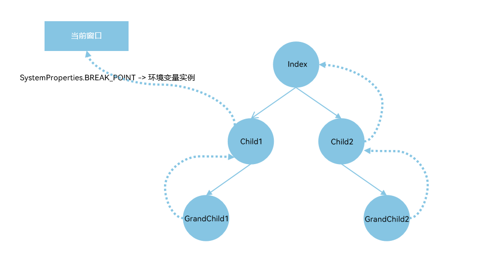

# \@Env：环境变量
<!--Kit: ArkUI-->
<!--Subsystem: ArkUI-->
<!--Owner: @liwenzhen3-->
<!--Designer: @s10021109-->
<!--Tester: @zhangwenhan-->
<!--Adviser: @zhang_yixin13-->

在多设备开发的场景中，开发者可以使用[\@Env](../reference/apis-arkui/arkui-ts/ts-env-system-property.md)装饰器监听系统环境变量的改变，并根据系统环境变量来进行相应的场景判断，以减少不同设备间的适配逻辑和重复开发。

>**说明：**
>
> 从API version 22开始，\@Env支持在[\@Component](./state-management/arkts-create-custom-components.md#component)和[\@ComponentV2](./state-management/arkts-create-custom-components.md#componentv2)中使用。
>
> 从API version 22开始，该装饰器支持在原子化服务中使用。

## 概述
\@Env是响应式系统环境变量装饰器，其功能包括：
- 根据入参读取相应的环境变量信息。目前仅支持[SystemProperties.BREAK_POINT](../reference/apis-arkui/arkui-ts/ts-env-system-property.md#systemproperties)，用于获取[窗口](../reference/apis-arkui/arkts-apis-window-Window.md)不同宽高阈值下对应的断点值信息。详情见[\@Env支持参数](#env支持参数)。
- 系统环境变量改变时，通知\@Env装饰变量的更新，并触发\@Env关联组件刷新，以实现界面内容的同步更新。
- \@Env装饰的变量不允许开发者初始化。\@Env会返回给开发者可观察的环境变量类（由[\@ObservedV2](./state-management/arkts-new-observedV2-and-trace.md)装饰，且其由属性[\@Trace](./state-management/arkts-new-observedV2-and-trace.md)装饰）的实例。开发者如果想监听环境变量的变化，可以使用[addMonitor](./state-management/arkts-new-addMonitor-clearMonitor.md)，具体示例见[在\@ComponentV2中使用\@Env](#在componentv2中使用env)。

## \@Env支持参数

@Env支持的参数请参考[SystemProperties枚举类型说明](../reference/apis-arkui/arkui-ts/ts-env-system-property.md#systemproperties)。

## \@Env和Environment能力对比
\@Env和[Environment](./state-management/arkts-environment.md)都是系统环境变量相关，但两者能力有较大的不同，具体能力对比见下表。

| 能力 | \@Env |Environment|
| ------------------ | ------------------ | ------------------ |
|起始API version|从API version 22开始支持。|从API version 7开始支持。|
|支持参数|仅支持SystemProperties.BREAK_POINT。| 支持`languageCode`等参数，详情见[Environment内置参数](./state-management/arkts-environment.md#environment内置参数)。|
|使用形式|\@Env为装饰器，可声明在\@Component或\@ComponentV2中，获取对应参数的环境变量信息。|通过[envProp](../reference/apis-arkui/arkui-ts/ts-state-management.md#envprop10)等接口获取当前应用的环境变量，并存入[AppStorage](./state-management/arkts-appstorage.md)中，开发者可通过AppStorage的接口访问系统环境变量的值，具体例子见[从ui中访问environment参数](./state-management/arkts-environment.md#从ui中访问environment参数)。|
|是否有响应式能力|有，当系统环境变量变化时，会通知\@Env装饰的环境变量的改变，并通知\@Env关联组件刷新。|无，系统环境变量变化时，不会通知Environment改变。|

## 限制条件
- \@Env仅支持在\@Component和\@ComponentV2中使用，否则会有编译时报错。如果开发者绕过编译时检查，则会有运行时报错。
  ```ts
  import { uiObserver } from '@kit.ArkUI';

  class Info {
    @Env(SystemProperties.BREAK_POINT) breakpoint: uiObserver.WindowSizeLayoutBreakpointInfo; // 错误用法，编译时报错
  }
  
  @Entry
  @Component
  struct Index {
    @Env(SystemProperties.BREAK_POINT) breakpoint: uiObserver.WindowSizeLayoutBreakpointInfo; // 正确用法
  
    build() {
    }
  }
  ```
- \@Env装饰的变量为只读属性，不允许开发者进行初始化或赋值操作，否则会有编译时报错。如果开发者绕过编译时检查，则会有运行时报错。
  ```ts
  import { uiObserver } from '@kit.ArkUI';
  
  @Entry
  @Component
  struct Index {
    @Env(SystemProperties.BREAK_POINT) breakpoint: uiObserver.WindowSizeLayoutBreakpointInfo =
      new uiObserver.WindowSizeLayoutBreakpointInfo(); // 错误用法，编译时报错
  
    build() {
      Column() {
        Text(`breakpoint height ${this.breakpoint.heightBreakpoint}`).fontSize(20)
        Text(`breakpoint width ${this.breakpoint.widthBreakpoint}`).fontSize(20)
        Button('change breakpoint').onClick(() => {
          this.breakpoint = new uiObserver.WindowSizeLayoutBreakpointInfo(); // 错误用法，编译时报错
        })
      }
    }
  }
  ```
- \@Env当前仅支持`SystemProperties.BREAK_POINT`参数。若使用不支持的参数，将触发编译时报错。
    ```ts
    import { uiObserver } from '@kit.ArkUI';

    @Entry
    @Component
    struct Index {
      @Env(SystemProperties.BREAK_POINT) breakpoint1: uiObserver.WindowSizeLayoutBreakpointInfo; // 正确写法
      @Env('unsupported_key') breakpoint2: uiObserver.WindowSizeLayoutBreakpointInfo; // 错误写法，@Env非法入参，编译时报错。
    
      build() {
        Text(`breakpoint2 width: ${this.breakpoint2.widthBreakpoint} height: ${this.breakpoint2.heightBreakpoint}`)
      }
    }
    ```
- \@Env装饰的变量类型仅能为`uiObserver.WindowSizeLayoutBreakpointInfo`类型。\@Env当前仅支持`SystemProperties.BREAK_POINT`参数，所以其装饰类型仅能为`uiObserver.WindowSizeLayoutBreakpointInfo`，否则会有编译时报错。
  ```ts
  import { uiObserver } from '@kit.ArkUI';

  @Entry
  @Component
  struct Index {
    @Env(SystemProperties.BREAK_POINT) breakpoint1: uiObserver.WindowSizeLayoutBreakpointInfo; // 正确写法
    @Env(SystemProperties.BREAK_POINT) breakpoint2: string; // 错误写法，@Env仅支持装饰WindowSizeLayoutBreakpointInfo类型
  
    build() {
    }
  }
  ```
- \@Env只能单独使用，不能和其他V1V2状态变量装饰器或@Require联用，否则会有编译时报错。
  ```ts
  @Env(SystemProperties.BREAK_POINT) breakpoint1: uiObserver.WindowSizeLayoutBreakpointInfo; // 正确写法
  @State @Env(SystemProperties.BREAK_POINT) breakpoint2: uiObserver.WindowSizeLayoutBreakpointInfo; // 错误写法，编译时报错
  @Require @Env(SystemProperties.BREAK_POINT) breakpoint3: uiObserver.WindowSizeLayoutBreakpointInfo; // 错误写法，编译时报错
  @Local @Env(SystemProperties.BREAK_POINT) breakpoint4: uiObserver.WindowSizeLayoutBreakpointInfo; // 错误写法，编译时报错
  ```
- \@Env装饰的变量在\@Component和\@ComponentV2传递遵循以下规则：
  - \@Env装饰的变量仅能用于初始化\@ComponentV2中@Param装饰的变量，否则会有编译时报错。
  - \@Env装饰的变量仅能用于初始化\@Component中常规变量，否则会有编译时报错。需要注意，通过[BuilderNode](../reference/apis-arkui/js-apis-arkui-builderNode.md)切换窗口，会导致\@Env依据新的窗口更新环境变量实例。在切换窗口的场景中，不建议开发者使用\@Env变量来初始化子组件的常规变量，否则会造成该常规变量无法被\@Env通知触发其关联UI组件刷新。具体示例可见[通过BuilderNode切换窗口](#通过buildernode切换窗口)。
  ```ts
  import { uiObserver } from '@kit.ArkUI';
  
  @Entry
  @Component
  struct Index {
    @Env(SystemProperties.BREAK_POINT) breakpoint: uiObserver.WindowSizeLayoutBreakpointInfo; // 正确写法
  
    build() {
      Column() {
        CompV2({ breakpoint: this.breakpoint }) // 正确写法
        Comp({ breakpoint: this.breakpoint }) // 正确写法
  
        CompV2Invalid({ breakpoint: this.breakpoint }) // 错误写法，@Env装饰的变量仅能初始化V2的@Param变量
        CompInvalid({ breakpoint: this.breakpoint }) // 错误写法，@Env装饰的变量仅能初始化V1的常规变量
      }
    }
  }
  
  @ComponentV2
  struct CompV2 {
    @Require @Param breakpoint: uiObserver.WindowSizeLayoutBreakpointInfo; // 正确写法
  
    build() {
    }
  }
  
  @ComponentV2
  struct CompV2Invalid {
    @Require breakpoint: uiObserver.WindowSizeLayoutBreakpointInfo; // 错误写法
  
    build() {
    }
  }
  
  @Component
  struct Comp {
    @Require breakpoint: uiObserver.WindowSizeLayoutBreakpointInfo; // 正确写法
  
    build() {
    }
  }
  
  @Component
  struct CompInvalid {
    @ObjectLink breakpoint: uiObserver.WindowSizeLayoutBreakpointInfo; // 错误写法
  
    build() {
    }
  }
  ```

## \@Env初始化流程

\@Env变量不允许开发者初始化，其值由框架根据当前窗口的环境变量自动提供，\@Env变量在被第一次读值的时候，会触发初始化。\@Env变量初始化遵循以下流程：

1. 从父组件中查找已有实例：
   - 向上递归查找父组件。
   - 如果某个父组件在同一窗口中已经初始化过相同key的\@Env变量，则直接复用该实例。
   - 若未找到，则继续向上查找，直到父组件为空。需要注意，向上查找父组件的流程会被`BuilderNode`打断。
2. 查找当前窗口的\@Env实例。
   - 如果在父组件中未找到对应的实例，则检查当前窗口是否已有相同key的\@Env变量实例。
   - 如存在，则复用该窗口内的\@Env实例。
3. 首次请求：创建新环境变量实例。
   - 若以上两步都无法得到实例，则说明当前窗口第一次读取该环境变量。
   - 框架会创建一个新的可观察环境变量实例并与当前窗口绑定，然后完成初始化。

流程图如下。


基于以下流程，下面示例中@Env在各个组件中的初始化如下图。



1. `Child1`初始化`@Env(SystemProperties.BREAK_POINT)`：
   - 递归查找直到父组件为空：向上查找父组件`Index`，没有\@Env对应的`SystemProperties.BREAK_POINT`实例。
   - 查找当前窗口：没有\@Env对应的`SystemProperties.BREAK_POINT`实例。
   - 创建`SystemProperties.BREAK_POINT`对应的可观察的环境变量实例，并和当前窗口绑定。
2. `GrandChild1`初始化`@Env(SystemProperties.BREAK_POINT)`：
   - 递归查找父组件，直到父组件为空：向上查找父组件`Child1`，查找到`Child1`有\@Env对应的`SystemProperties.BREAK_POINT`实例。
   - 复用`Child1`中\@Env对应的`SystemProperties.BREAK_POINT`实例。
3. `GrandChild2`初始化`@Env(SystemProperties.BREAK_POINT)`：
   - 递归查找直到父组件为空：向上查找父组件`Child2`和祖先节点`Index`，均没有\@Env对应的`SystemProperties.BREAK_POINT`实例。
   - 查找当前窗口：有\@Env对应的`SystemProperties.BREAK_POINT`实例。
   - 复用窗口中`SystemProperties.BREAK_POINT`对应的环境变量实例。

```TypeScript
import { uiObserver } from '@kit.ArkUI';

@Entry
@Component
struct Index {
  build() {
    Column() {
      Text(`Index`)
      Child1()
      Child2()
    }
    .height('100%')
    .width('100%')
  }
}

@Component
struct Child1 {
  @Env(SystemProperties.BREAK_POINT) breakpoint: uiObserver.WindowSizeLayoutBreakpointInfo;

  build() {
    Column() {
      Text(`Child1 breakpoint width: ${this.breakpoint.widthBreakpoint}`).fontSize(20)
      Text(`Child1 breakpoint height: ${this.breakpoint.heightBreakpoint}`).fontSize(20)
      GrandChild1()
    }
  }
}

@Component
struct Child2 {
  build() {
    Column() {
      GrandChild2()
    }
  }
}

@Component
struct GrandChild1 {
  @Env(SystemProperties.BREAK_POINT) breakpoint: uiObserver.WindowSizeLayoutBreakpointInfo;

  build() {
    Column() {
      Text(`GrandChild1 breakpoint width: ${this.breakpoint.widthBreakpoint}`).fontSize(20)
      Text(`GrandChild1 breakpoint height: ${this.breakpoint.heightBreakpoint}`).fontSize(20)
    }
  }
}


@Component
struct GrandChild2 {
  @Env(SystemProperties.BREAK_POINT) breakpoint: uiObserver.WindowSizeLayoutBreakpointInfo;

  build() {
    Column() {
      Text(`GrandChild2 breakpoint width: ${this.breakpoint.widthBreakpoint}`).fontSize(20)
      Text(`GrandChild2 breakpoint height: ${this.breakpoint.heightBreakpoint}`).fontSize(20)
    }
  }
}

```

## 使用场景
### 在\@ComponentV2中使用\@Env

下面的例子中：
- 在\@ComponentV2中声明\@Env，获取当前\@ComponentV2组件创建时所在窗口尺寸的布局断点信息，并用[addMonitor](./state-management/arkts-new-addMonitor-clearMonitor.md)监听`this.breakpoint`的属性的变化。
- 将\@Env装饰的变量传递给`CompV2`中[\@Param](./state-management/arkts-new-param.md)装饰的变量和`Comp`中的常规变量。
- 点击`Button('Landscape')`和`Button('Portrait')`切换横竖屏，`Index`、`CompV2`和`Comp`关联组件进行对应的刷新，`orientationChange`被触发监听回调。

```ts
import { uiObserver, UIUtils, window } from '@kit.ArkUI';
import { common } from '@kit.AbilityKit';

@Entry
@ComponentV2
struct Index {
  @Env(SystemProperties.BREAK_POINT) breakpoint: uiObserver.WindowSizeLayoutBreakpointInfo;

  private changeOrientation(isLandscape: boolean) {
    const context = this.getUIContext()?.getHostContext() as common.UIAbilityContext;
    window.getLastWindow(context).then((lastWindow) => {
      lastWindow.setPreferredOrientation(isLandscape ? window.Orientation.LANDSCAPE : window.Orientation.PORTRAIT);
    });
  }

  orientationChange(mon: IMonitor) {
    mon.dirty.forEach((path: string) => {
      console.info(`${path} changes from ${mon.value(path)?.before} to ${mon.value(path)?.now}`);
    })
  }

  aboutToAppear(): void {
    // @Env返回的对象实际上是@ObservedV2装饰的对象（其属性是@Trace装饰的），所以其属性的改变可以通过addMonitor监听
    UIUtils.addMonitor(this.breakpoint, ['widthBreakpoint', 'heightBreakpoint'], this.orientationChange);
  }

  build() {
    Column() {
      Text(`Index breakpoint width: ${this.breakpoint.widthBreakpoint}`).fontSize(20)
      Text(`Index breakpoint height: ${this.breakpoint.heightBreakpoint}`).fontSize(20)

      Button('Landscape').onClick(() => {
        this.changeOrientation(true);
      })

      Button('Portrait').onClick(() => {
        this.changeOrientation(false);
      })

      CompV2({ breakpoint: this.breakpoint })
      Comp({ breakpoint: this.breakpoint })
    }
  }
}

@ComponentV2
struct CompV2 {
  @Require @Param breakpoint: uiObserver.WindowSizeLayoutBreakpointInfo;

  build() {
    Column() {
      Text(`CompV2 breakpoint width: ${this.breakpoint.widthBreakpoint}`).fontSize(20)
      Text(`CompV2 breakpoint height: ${this.breakpoint.heightBreakpoint}`).fontSize(20)
    }
  }
}

@Component
struct Comp {
  @Require breakpoint: uiObserver.WindowSizeLayoutBreakpointInfo;

  build() {
    Column() {
      Text(`Comp breakpoint width: ${this.breakpoint.widthBreakpoint}`).fontSize(20)
      Text(`Comp breakpoint height: ${this.breakpoint.heightBreakpoint}`).fontSize(20)
    }
  }
}
```

### 在\@Component中使用\@Env

\@Env在\@Component中使用和其在\@ComponentV2中使用类似，示例如下。

```ts
import { uiObserver, UIUtils, window } from '@kit.ArkUI';
import { common } from '@kit.AbilityKit';

@Entry
@Component
struct Index {
  @Env(SystemProperties.BREAK_POINT) breakpoint: uiObserver.WindowSizeLayoutBreakpointInfo;

  private changeOrientation(isLandscape: boolean) {
    const context = this.getUIContext()?.getHostContext() as common.UIAbilityContext;
    window.getLastWindow(context).then((lastWindow) => {
      lastWindow.setPreferredOrientation(isLandscape ? window.Orientation.LANDSCAPE : window.Orientation.PORTRAIT);
    });
  }

  orientationChange(mon: IMonitor) {
    mon.dirty.forEach((path: string) => {
      console.info(`${path} changes from ${mon.value(path)?.before} to ${mon.value(path)?.now}`);
    })
  }

  aboutToAppear(): void {
    // @Env返回的对象实际上是@ObservedV2装饰的对象（其属性是@Trace装饰的），所以其属性的改变可以通过addMonitor监听
    UIUtils.addMonitor(this.breakpoint, ['widthBreakpoint', 'heightBreakpoint'], this.orientationChange);
  }

  build() {
    Column() {
      Text(`Index breakpoint width: ${this.breakpoint.widthBreakpoint}`).fontSize(20)
      Text(`Index breakpoint height: ${this.breakpoint.heightBreakpoint}`).fontSize(20)

      Button('Landscape').onClick(() => {
        this.changeOrientation(true);
      })

      Button('Portrait').onClick(() => {
        this.changeOrientation(false);
      })

      CompV2({ breakpoint: this.breakpoint })
      Comp({ breakpoint: this.breakpoint })
    }
  }
}

@ComponentV2
struct CompV2 {
  @Require @Param breakpoint: uiObserver.WindowSizeLayoutBreakpointInfo;

  build() {
    Column() {
      Text(`CompV2 breakpoint width: ${this.breakpoint.widthBreakpoint}`).fontSize(20)
      Text(`CompV2 breakpoint height: ${this.breakpoint.heightBreakpoint}`).fontSize(20)
    }
  }
}

@Component
struct Comp {
  @Require breakpoint: uiObserver.WindowSizeLayoutBreakpointInfo;

  build() {
    Column() {
      Text(`Comp breakpoint width: ${this.breakpoint.widthBreakpoint}`).fontSize(20)
      Text(`Comp breakpoint height: ${this.breakpoint.heightBreakpoint}`).fontSize(20)
    }
  }
}
```

### 通过BuilderNode切换窗口

\@Env用于展示\@Component/\@ComponentV2所在[窗口](../reference/apis-arkui/arkts-apis-window-Window.md)的环境变量信息。开发者通过BuilderNode切换@Component\@ComponentV2所在的窗口实例时，\@Env会根据新的窗口获取对应的环境变量信息，并触发关联的UI组件刷新。以`SystemProperties.BREAK_POINT`为例。
在下面的示例中：
1. 点击```Button('add node to tree')```，创建BuilderNode节点挂载到`NodeContainer`下。
2. 点击```Button('remove node from tree')```，将BuilderNode节点从`NodeContainer`上移除。
3. 点击```Button(`create sub window`)```，创建子窗并显示`SubWindow`窗口。
4. 点击`SubWindow`窗口内的```Button('add node to tree')```，将BuilderNode节点重新挂载到`SubWindow`内的`NodeContainer`下。
   - `ComponentUnderBuilderNode`在被挂载到新的窗口下时，会触发\@Env重新获取新的环境变量。
   - \@Env重新获取新的环境变量后，触发其关联组件的刷新。其中`ComponentUnderBuilderNode`中`@Env(SystemProperties.BREAK_POINT) breakpoint: uiObserver.WindowSizeLayoutBreakpointInfo`会通知`CompV2`内的`@Param breakpoint`刷新，但是并不会通知`Comp`内的常规变量`breakpoint`触发UI刷新。所以在切换窗口，\@Env重新获取环境变量的场景下，建议开发者不要将\@Env传递给常规变量，以避免常规变量不能被通知UI刷新的问题。

下面的示例包含了创建子窗的流程，具体可参考[管理应用窗口（Stage模型）](../windowmanager/application-window-stage.md)。

```Typescript
// EntryAbility.ets
import { UIAbility } from '@kit.AbilityKit';
import { hilog } from '@kit.PerformanceAnalysisKit';
import { window } from '@kit.ArkUI';

const DOMAIN = 0x0000;

export default class EntryAbility extends UIAbility {
  onWindowStageCreate(windowStage: window.WindowStage) {
    windowStage.loadContent('pages/Index', (err) => {
      if (err.code) {
        hilog.error(DOMAIN, 'testTag', 'Failed to load the content. Cause: %{public}s', JSON.stringify(err));
        return;
      }
      hilog.info(DOMAIN, 'testTag', 'Succeeded in loading the content.');
    })

    // 给Index页面传递windowStage
    AppStorage.setOrCreate('windowStage', windowStage);
  }
}
```

```Typescript
// Index.ets
import { BuilderNode, FrameNode, NodeController, uiObserver, window } from '@kit.ArkUI';
import { BusinessError } from '@kit.BasicServicesKit';
import { hilog } from '@kit.PerformanceAnalysisKit';

const DOMAIN = 0x0000;

let windowStage_: window.WindowStage | undefined = undefined;
let sub_windowClass: window.Window | undefined = undefined;
let globalBuilderNode: BuilderNode<[]> | undefined = undefined;

export class MyNodeController extends NodeController {
  private rootNode: FrameNode | null = null;
  private uiContext: UIContext | null = null;

  makeNode(uiContext: UIContext): FrameNode | null {
    this.rootNode = new FrameNode(uiContext);
    this.uiContext = uiContext;
    return this.rootNode;
  }

  addBuilderNode(): void {
    if (!globalBuilderNode && this.uiContext) {
      globalBuilderNode = new BuilderNode(this.uiContext);
      globalBuilderNode.build(wrapBuilder<[]>(buildComponent), undefined);
    }
    if (this.rootNode && globalBuilderNode) {
      this.rootNode.appendChild(globalBuilderNode.getFrameNode());
    }
  }

  removeBuilderNode(): void {
    if (this.rootNode && globalBuilderNode) {
      this.rootNode.removeChild(globalBuilderNode.getFrameNode());
    }
  }

  disposeNode(): void {
    if (this.rootNode && globalBuilderNode) {
      globalBuilderNode.dispose();
      globalBuilderNode = undefined;
    }
  }
}

@Builder
function buildComponent() {
  Column() {
    ComponentUnderBuilderNode()
  }
}

@Entry
@ComponentV2
struct Index {
  private nodeController: MyNodeController = new MyNodeController();

  private createSubWindow() {
    windowStage_ = AppStorage.get('windowStage');
    if (windowStage_ == null) {
      hilog.error(DOMAIN, 'testTag', 'Failed to create the subwindow. Cause: windowStage_ is null');
    } else {
      // 创建应用子窗口。
      windowStage_.createSubWindow('mySubWindow', (err: BusinessError, data) => {
        let errCode: number = err.code;
        if (errCode) {
          hilog.error(DOMAIN, 'testTag', 'Failed to create the subwindow. Cause: ' + JSON.stringify(err));
          return;
        }
        sub_windowClass = data;
        if (!sub_windowClass) {
          hilog.error(DOMAIN, 'testTag', 'sub_windowClass is null');
          return;
        }
        hilog.info(DOMAIN, 'testTag', 'Succeeded in creating the subwindow. Data: ' + JSON.stringify(data));
        // 子窗口创建成功后，设置子窗口的位置、大小及相关属性等。
        sub_windowClass.moveWindowTo(200, 1300, (err: BusinessError) => {
          let errCode: number = err.code;
          if (errCode) {
            hilog.error(DOMAIN, 'testTag', 'Failed to move the window. Cause:' + JSON.stringify(err));
            return;
          }
          hilog.info(DOMAIN, 'testTag', 'Succeeded in moving the window.');
        });
        sub_windowClass.resize(900, 1800, (err: BusinessError) => {
          let errCode: number = err.code;
          if (errCode) {
            hilog.error(DOMAIN, 'testTag', 'Failed to change the window size. Cause:' + JSON.stringify(err));
            return;
          }
          hilog.info(DOMAIN, 'testTag', 'Succeeded in changing the window size.');
        });
         // 为子窗口加载对应的目标页面。
        sub_windowClass.setUIContent('pages/SubWindow', (err: BusinessError) => {
          let errCode: number = err.code;
          if (errCode) {
            hilog.error(DOMAIN, 'testTag', 'Failed to load the content. Cause:' + JSON.stringify(err));
            return;
          }
          hilog.info(DOMAIN, 'testTag', 'Succeeded in loading the content.');
          if (!sub_windowClass) {
            hilog.error(DOMAIN, 'testTag', 'sub_windowClass is null');
            return;
          }
          sub_windowClass.showWindow((err: BusinessError) => {
            let errCode: number = err.code;
            if (errCode) {
              hilog.error(DOMAIN, 'testTag', 'Failed to show the window. Cause: ' + JSON.stringify(err));
              return;
            }
            hilog.info(DOMAIN, 'testTag', 'Succeeded in showing the window.');
          });
        });
      })
    }
  }

  private destroySubWindow() {
    if (!sub_windowClass) {
      console.error('sub_windowClass is null');
      return;
    }
    // 销毁子窗口。当不再需要子窗口时，可根据具体实现逻辑，使用destroy对其进行销毁。
    sub_windowClass.destroyWindow((err: BusinessError) => {
      let errCode: number = err.code;
      if (errCode) {
        console.error('Failed to destroy the window. Cause: ' + JSON.stringify(err));
        return;
      }
      console.info('Succeeded in destroying the window.');
    });
  }

  build() {
    Column({ space: 10 }) {
      Text(`Index`)
      // 第一步：创建globalBuilderNode，并将globalBuilderNode下的节点挂在NodeContainer的占位节点下
      Button('add node to tree').width(200).onClick(() => {
        this.nodeController.addBuilderNode();
      })
      // 第二步：从NodeContainer的占位节点下移除globalBuilderNode下的节点
      Button('remove node from tree').width(200).onClick(() => {
        this.nodeController.removeBuilderNode();
      })
      // 销毁globalBuilderNode下的节点
      Button('dispose node').width(200).onClick(() => {
        this.nodeController.disposeNode();
      })
      // 第三步：创建子窗
      Button(`create sub window`).width(200).onClick(() => {
        this.createSubWindow();
      })
      // 销毁子窗
      Button(`destroy sub window`).width(200).onClick(() => {
        this.destroySubWindow();
      })
      NodeContainer(this.nodeController).backgroundColor('#FFEEF0')
    }
    .width('100%')
    .height('100%')
  }
}

@Component
struct ComponentUnderBuilderNode {
  @Env(SystemProperties.BREAK_POINT) breakpoint: uiObserver.WindowSizeLayoutBreakpointInfo;

  build() {
    Column() {
      Text(`ComponentUnderBuilderNode breakpoint width: ${this.breakpoint.widthBreakpoint}`)
      Text(`ComponentUnderBuilderNode breakpoint height: ${this.breakpoint.heightBreakpoint}`)

      CompV2({ breakpoint: this.breakpoint })
      Comp({ breakpoint: this.breakpoint })
    }
  }
}

@ComponentV2
struct CompV2 {
  @Require @Param breakpoint: uiObserver.WindowSizeLayoutBreakpointInfo;

  build() {
    Column() {
      Text(`CompV2 breakpoint width: ${this.breakpoint.widthBreakpoint}`)
      Text(`CompV2 breakpoint height: ${this.breakpoint.heightBreakpoint}`)
    }
  }
}

@Component
struct Comp {
  @Require breakpoint: uiObserver.WindowSizeLayoutBreakpointInfo;

  build() {
    Column() {
      Text(`Comp breakpoint width: ${this.breakpoint.widthBreakpoint}`)
      Text(`Comp breakpoint height: ${this.breakpoint.heightBreakpoint}`)
    }
  }
}
```

```Typescript
// SubWindow.ets
import { MyNodeController } from './Index';

@Entry
@Component
struct SubWindow {
  private nodeController: MyNodeController = new MyNodeController();

  build() {
    Column({ space: 10 }) {
      Text(`SubWindow`)
      // 第四步：在第一步中已在创建globalBuilderNode。将globalBuilderNode下的节点挂子窗的NodeContainer的占位节点下
      Button('add node to tree').width(200).onClick(() => {
        this.nodeController.addBuilderNode();
      })
      Button('remove node from tree').width(200).onClick(() => {
        this.nodeController.removeBuilderNode();
      })
      Button('dispose node').width(200).onClick(() => {
        this.nodeController.disposeNode();
      })
      NodeContainer(this.nodeController).backgroundColor('#FFEEF0')
    }
    .height('100%')
    .width('100%')
    .backgroundColor('#0D9FFB')
  }
}
```

运行效果图如下。


可以使用lambda闭包函数将`ComponentUnderBuilderNode`中的\@Env向下传递。通过这种方式`ComponentUnderBuilderNode`中的\@Env可以收集到子组件`Comp`内组件的依赖，在切换窗口实例的时候触发`Comp`内组件的刷新。

具体示例如下。

```TypeScript
import { BuilderNode, FrameNode, NodeController, uiObserver, window } from '@kit.ArkUI';
import { BusinessError } from '@kit.BasicServicesKit';
import { hilog } from '@kit.PerformanceAnalysisKit';

const DOMAIN = 0x0000;

let windowStage_: window.WindowStage | undefined = undefined;
let sub_windowClass: window.Window | undefined = undefined;
let globalBuilderNode: BuilderNode<[]> | undefined = undefined;

export class MyNodeController extends NodeController {
  private rootNode: FrameNode | null = null;
  private uiContext: UIContext | null = null;

  makeNode(uiContext: UIContext): FrameNode | null {
    this.rootNode = new FrameNode(uiContext);
    this.uiContext = uiContext;
    return this.rootNode;
  }

  addBuilderNode(): void {
    if (!globalBuilderNode && this.uiContext) {
      globalBuilderNode = new BuilderNode(this.uiContext);
      globalBuilderNode.build(wrapBuilder<[]>(buildComponent), undefined);
    }
    if (this.rootNode && globalBuilderNode) {
      this.rootNode.appendChild(globalBuilderNode.getFrameNode());
    }
  }

  removeBuilderNode(): void {
    if (this.rootNode && globalBuilderNode) {
      this.rootNode.removeChild(globalBuilderNode.getFrameNode());
    }
  }

  disposeNode(): void {
    if (this.rootNode && globalBuilderNode) {
      globalBuilderNode.dispose();
      globalBuilderNode = undefined;
    }
  }
}

@Builder
function buildComponent() {
  Column() {
    ComponentUnderBuilderNode()
  }
}

@Entry
@ComponentV2
struct Index {
  private nodeController: MyNodeController = new MyNodeController();

  private createSubWindow() {
    windowStage_ = AppStorage.get('windowStage');
    if (windowStage_ == null) {
      hilog.error(DOMAIN, 'testTag', 'Failed to create the subwindow. Cause: windowStage_ is null');
    } else {
      // 创建应用子窗口。
      windowStage_.createSubWindow('mySubWindow', (err: BusinessError, data) => {
        let errCode: number = err.code;
        if (errCode) {
          hilog.error(DOMAIN, 'testTag', 'Failed to create the subwindow. Cause: ' + JSON.stringify(err));
          return;
        }
        sub_windowClass = data;
        if (!sub_windowClass) {
          hilog.error(DOMAIN, 'testTag', 'sub_windowClass is null');
          return;
        }
        hilog.info(DOMAIN, 'testTag', 'Succeeded in creating the subwindow. Data: ' + JSON.stringify(data));
        // 子窗口创建成功后，设置子窗口的位置、大小及相关属性等。
        sub_windowClass.moveWindowTo(200, 1300, (err: BusinessError) => {
          let errCode: number = err.code;
          if (errCode) {
            hilog.error(DOMAIN, 'testTag', 'Failed to move the window. Cause:' + JSON.stringify(err));
            return;
          }
          hilog.info(DOMAIN, 'testTag', 'Succeeded in moving the window.');
        });
        sub_windowClass.resize(900, 1800, (err: BusinessError) => {
          let errCode: number = err.code;
          if (errCode) {
            hilog.error(DOMAIN, 'testTag', 'Failed to change the window size. Cause:' + JSON.stringify(err));
            return;
          }
          hilog.info(DOMAIN, 'testTag', 'Succeeded in changing the window size.');
        });
         // 为子窗口加载对应的目标页面。
        sub_windowClass.setUIContent('pages/SubWindow', (err: BusinessError) => {
          let errCode: number = err.code;
          if (errCode) {
            hilog.error(DOMAIN, 'testTag', 'Failed to load the content. Cause:' + JSON.stringify(err));
            return;
          }
          hilog.info(DOMAIN, 'testTag', 'Succeeded in loading the content.');
          if (!sub_windowClass) {
            hilog.error(DOMAIN, 'testTag', 'sub_windowClass is null');
            return;
          }
          sub_windowClass.showWindow((err: BusinessError) => {
            let errCode: number = err.code;
            if (errCode) {
              hilog.error(DOMAIN, 'testTag', 'Failed to show the window. Cause: ' + JSON.stringify(err));
              return;
            }
            hilog.info(DOMAIN, 'testTag', 'Succeeded in showing the window.');
          });
        });
      })
    }
  }

  private destroySubWindow() {
    if (!sub_windowClass) {
      console.error('sub_windowClass is null');
      return;
    }
    // 销毁子窗口。当不再需要子窗口时，可根据具体实现逻辑，使用destroy对其进行销毁。
    sub_windowClass.destroyWindow((err: BusinessError) => {
      let errCode: number = err.code;
      if (errCode) {
        console.error('Failed to destroy the window. Cause: ' + JSON.stringify(err));
        return;
      }
      console.info('Succeeded in destroying the window.');
    });
  }

  build() {
    Column({ space: 10 }) {
      Text(`Index`)
      // 第一步：创建globalBuilderNode，并将globalBuilderNode下的节点挂在NodeContainer的占位节点下
      Button('add node to tree').width(200).onClick(() => {
        this.nodeController.addBuilderNode();
      })
      // 第二步：从NodeContainer的占位节点下移除globalBuilderNode下的节点
      Button('remove node from tree').width(200).onClick(() => {
        this.nodeController.removeBuilderNode();
      })
      // 销毁globalBuilderNode下的节点
      Button('dispose node').width(200).onClick(() => {
        this.nodeController.disposeNode();
      })
      // 第三步：创建子窗
      Button(`create sub window`).width(200).onClick(() => {
        this.createSubWindow();
      })
      // 销毁子窗
      Button(`destroy sub window`).width(200).onClick(() => {
        this.destroySubWindow();
      })
      NodeContainer(this.nodeController).backgroundColor('#FFEEF0')
    }
    .width('100%')
    .height('100%')
  }
}

@Component
struct ComponentUnderBuilderNode {
  @Env(SystemProperties.BREAK_POINT) breakpoint: uiObserver.WindowSizeLayoutBreakpointInfo;

  build() {
    Column() {
      Text(`ComponentUnderBuilderNode breakpoint width: ${this.breakpoint.widthBreakpoint}`)
      Text(`ComponentUnderBuilderNode breakpoint height: ${this.breakpoint.heightBreakpoint}`)

      CompV2({ breakpoint: this.breakpoint })
      // 通过lambda闭包函数，使得@Env可以关联到Comp内的组件
      Comp({ getEnv: () => this.breakpoint })
    }
  }
}

@ComponentV2
struct CompV2 {
  @Require @Param breakpoint: uiObserver.WindowSizeLayoutBreakpointInfo;

  build() {
    Column() {
      Text(`CompV2 breakpoint width: ${this.breakpoint.widthBreakpoint}`)
      Text(`CompV2 breakpoint height: ${this.breakpoint.heightBreakpoint}`)
    }
  }
}

@Component
struct Comp {
  // 通过lambda闭包函数获取父组件的@Env的实例
  @Require getEnv: () => uiObserver.WindowSizeLayoutBreakpointInfo;

  build() {
    Column() {
      Text(`Comp breakpoint width: ${this.getEnv().widthBreakpoint}`)
      Text(`Comp breakpoint height: ${this.getEnv().heightBreakpoint}`)
    }
  }
}
```

运行效果图如下。

