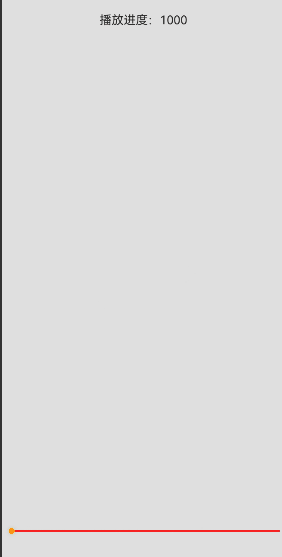

# 手势冲突处理
<!--Kit: ArkUI-->
<!--Subsystem: ArkUI-->
<!--Owner: @yihao-lin-->
<!--Designer: @piggyguy-->
<!--Tester: @songyanhong-->
<!--Adviser: @Brilliantry_Rui-->

手势冲突是指多个手势识别器在同一组件或重叠区域同时识别时产生竞争，导致识别结果不符合预期。常见冲突场景包括：
- 同一组件上的多手势（如按钮同时添加点击与长按手势）。
- 父子组件的同类型手势识别器。
- 系统默认手势与自定义手势（如scroll滑动手势与子组件点击手势冲突）。

干预手势处理可有效解决冲突，除控制组件响应热区和命中测试模式外，主要通过以下三种方式：[自定义手势判定](#自定义手势判定)、[手势并行动态控制](#手势并行动态控制)、[阻止手势参与识别](#阻止手势参与识别)。

## 自定义手势判定

自定义手势判定是指在系统判定阈值已满足的条件下，应用可自行判断是否应拦截该手势，使该手势识别失败，从而将识别成功的机会留给其他手势。

**图1** 自定义手势判定流程图


自定义手势判定涉及以下接口。

| **接口** | **说明** |
| ------- | -------------- |
|[onGestureJudgeBegin](../reference/apis-arkui/arkui-ts/ts-gesture-customize-judge.md#ongesturejudgebegin)|用于手势拦截，是通用事件。在手势满足系统触发阈值场景下，回调给应用判断是否拦截手势。|
|[onGestureRecognizerJudgeBegin](../reference/apis-arkui/arkui-ts/ts-gesture-blocking-enhancement.md#ongesturerecognizerjudgebegin)|用于手势拦截、获取手势识别器和设置手势识别器开闭状态。是onGestureJudgeBegin接口的能力扩展，可以代替onGestureJudgeBegin接口。<br>获取手势识别器时，会获取一次交互中手势响应链上的所有手势识别器，以及当前即将触发成功的手势识别器，此时可以设置手势的激活状态。|

以下示例中，Image和Stack两个组件位于同一区域。长按Stack组件的上半部分可触发挂载在Stack组件上的长按手势，长按Stack组件的下半部分则会响应Image组件的拖拽操作。

**图2** 示例图


1. Image组件设置拖拽。

   <!-- @[component_dragging](https://gitcode.com/openharmony/applications_app_samples/blob/master/code/DocsSample/ArkUISample/GestureConflict/entry/src/main/ets/Component/CustomGestures/CustomGestures.ets) -->
   
   ``` TypeScript
   //  $r('sys.media.ohos_app_icon') 需要替换为开发者所需的资源文件
   Image($r('sys.media.ohos_app_icon'))
     .draggable(true)
     .onDragStart(()=>{
     // ···
       //  $r('app.string.Allow_dragging_prompt') 需要替换为开发者所需的资源文件
       promptAction.showToast({ message: $r('app.string.Allow_dragging_prompt') });
     })
     .width('200vp').height('200vp')
   ```

2. Stack组件设置手势。

      <!-- @[set_gestures](https://gitcode.com/openharmony/applications_app_samples/blob/master/code/DocsSample/ArkUISample/GestureConflict/entry/src/main/ets/Component/CustomGestures/CustomGestures.ets) -->
      
      ``` TypeScript
      Stack() {}
      .width('200vp')
      .height('200vp')
      .hitTestBehavior(HitTestMode.Transparent)
      .gesture(GestureGroup(GestureMode.Parallel,
        LongPressGesture()
          .onAction((event: GestureEvent) => {
            // ···
            //  $r('app.string.Stop_dragging_prompt') 需要替换为开发者所需的资源文件
            promptAction.showToast({ message: $r('app.string.Stop_dragging_prompt')  });
          })
          .tag('longpress')
      ))
      ```

3. Stack组件设置拦截。

   <!-- @[set_interception](https://gitcode.com/openharmony/applications_app_samples/blob/master/code/DocsSample/ArkUISample/GestureConflict/entry/src/main/ets/Component/CustomGestures/CustomGestures.ets) -->
   
   ``` TypeScript
   .onGestureJudgeBegin((gestureInfo: GestureInfo, event: BaseGestureEvent) => {
     // 如果是长按类型手势，判断点击的位置是否在上半区
     if (gestureInfo.type == GestureControl.GestureType.LONG_PRESS_GESTURE) {
       if (event.fingerList.length > 0 && event.fingerList[0].localY < 100) {
         return GestureJudgeResult.CONTINUE;
       } else {
         return GestureJudgeResult.REJECT;
       }
     };
     return GestureJudgeResult.CONTINUE;
   })
   ```

4. 代码完整示例。

   <!-- @[custom_gestures](https://gitcode.com/openharmony/applications_app_samples/blob/master/code/DocsSample/ArkUISample/GestureConflict/entry/src/main/ets/Component/CustomGestures/CustomGestureDetermination.ets) -->
   
   ``` TypeScript
   import { PromptAction } from '@kit.ArkUI';
   
   @Entry
   @Component
   struct Index {
     scroller: Scroller = new Scroller();
     promptAction: PromptAction = this.getUIContext().getPromptAction();
   
     build() {
       Scroll(this.scroller) {
         Column({ space: 8 }) {
           //  $r('app.string.Drag_instructions') 需要替换为开发者所需的资源文件
           Text($r('app.string.Drag_instructions')).width('100%').fontSize(20).fontColor('0xffdd00')
           Stack({ alignContent: Alignment.Center }) {
             Column() {
               // 模拟上半区和下半区
               Stack().width('200vp').height('100vp').backgroundColor(Color.Red)
               Stack().width('200vp').height('100vp').backgroundColor(Color.Blue)
             }.width('200vp').height('200vp')
             // Stack的下半区是绑定了滑动手势的图像区域。
             //  $r('sys.media.ohos_app_icon') 需要替换为开发者所需的资源文件
             Image($r('sys.media.ohos_app_icon'))
               .draggable(true)
               .onDragStart(()=>{
                 //  $r('app.string.Allow_dragging_prompt') 需要替换为开发者所需的资源文件
                 this.promptAction.showToast({ message: $r('app.string.Allow_dragging_prompt') });
               })
               .width('200vp').height('200vp')
             // Stack的上半区是绑定了长按手势的浮动区域。
             Stack() {
             }
             .width('200vp')
             .height('200vp')
             .hitTestBehavior(HitTestMode.Transparent)
             .gesture(GestureGroup(GestureMode.Parallel,
               LongPressGesture()
                 .onAction((event: GestureEvent) => {
                   //  $r('app.string.Stop_dragging_prompt') 需要替换为开发者所需的资源文件
                   this.promptAction.showToast({ message: $r('app.string.Stop_dragging_prompt') });
                 })
                 .tag('longpress')
             ))
             .onGestureJudgeBegin((gestureInfo: GestureInfo, event: BaseGestureEvent) => {
               // 如果是长按类型手势，判断点击的位置是否在上半区
               if (gestureInfo.type == GestureControl.GestureType.LONG_PRESS_GESTURE) {
                 if (event.fingerList.length > 0 && event.fingerList[0].localY < 100) {
                   return GestureJudgeResult.CONTINUE;
                 } else {
                   return GestureJudgeResult.REJECT;
                 }
               };
               return GestureJudgeResult.CONTINUE;
             })
           }.width('100%')
         }.width('100%')
       }
     }
   }
   ```

   

## 手势并行动态控制

手势并行动态控制指的是手势已经成功识别，但是开发者仍然可以通过调用API接口控制手势回调是否能够响应。

**图3** 手势并行动态控制流程图


手势并行动态控制的前提是手势识别成功，如果手势不成功则不会产生手势回调响应。

1. 业务手势作业流：指真正触发UI变化的业务手势，比如使页面滚动的PanGesture，触发点击的TapGesture等。

2. 监听手势作业流：指在监听手势运行的过程中，应根据上下文的业务状态变化动态控制手势识别器的开闭，例如判断组件嵌套滚动过程中是否已滑至边缘。这一监听事件可借助一个使用[并行手势绑定方式](arkts-gesture-events-binding.md#parallelgesture并行手势绑定方法)的PanGesture实现，或者采用Touch事件来完成。

3. 设置手势并行：此步骤并非必需，典型场景是在嵌套滚动中，设置外部组件的滚动手势与内部的滚动手势并行。

4. 动态开闭手势：指通过手势识别器的setEnabled方法，控制手势是否响应用户回调。

手势并行动态控制涉及以下接口。

| **接口** | **说明** |
| ------- | -------------- |
|[shouldBuiltInRecognizerParallelWith](../reference/apis-arkui/arkui-ts/ts-gesture-blocking-enhancement.md#shouldbuiltinrecognizerparallelwith)|用于设置系统组件内置手势与其他手势并行。|
|[onGestureRecognizerJudgeBegin](../reference/apis-arkui/arkui-ts/ts-gesture-blocking-enhancement.md#ongesturerecognizerjudgebegin)|用于手势拦截，获取手势识别器，初始化手势识别器开闭状态。|
|[parallelGesture](arkts-gesture-events-binding.md#parallelgesture并行手势绑定方法)|可使开发者定义的手势，与比他优先级高的手势并行。|

以下示例是两个Scroll组件的嵌套滚动场景，使用手势控制的api去控制外部组件和内部组件的嵌套滚动联动。

1. 使用shouldBuiltInRecognizerParallelWith接口设置外部Scroll组件的PanGesture手势与内部Scroll组件的PanGesture手势并行。

   <!-- @[gesture_simultaneously](https://gitcode.com/openharmony/applications_app_samples/blob/master/code/DocsSample/ArkUISample/GestureConflict/entry/src/main/ets/Component/GestureAndMotionControl/GestureControl.ets) -->
   
   ``` TypeScript
   .shouldBuiltInRecognizerParallelWith((current: GestureRecognizer, others: Array<GestureRecognizer>) => {
     for (let i = 0; i < others.length; i++) {
       let target = others[i].getEventTargetInfo();
       if (target.getId() == 'inner' && others[i].isBuiltIn() && others[i].getType() == GestureControl.GestureType.PAN_GESTURE) { // 找到将要组成并行手势的识别器
         this.currentRecognizer = current; // 保存当前组件的识别器
         this.childRecognizer = others[i]; // 保存将要组成并行手势的识别器
         return others[i]; // 返回和当前手势将要组成并行手势的识别器
       };
     };
     return undefined;
   })
   ```

2. 使用onGestureRecognizerJudgeBegin接口获取到Scroll组件的PanGesture手势识别器，同时根据内外Scroll组件的边界条件，设置内外手势的开闭状态。

   <!-- @[gesture_openingclosing](https://gitcode.com/openharmony/applications_app_samples/blob/master/code/DocsSample/ArkUISample/GestureConflict/entry/src/main/ets/Component/GestureAndMotionControl/GestureControl.ets) -->
   
   ``` TypeScript
   .onGestureRecognizerJudgeBegin((event: BaseGestureEvent, current: GestureRecognizer,
     others: Array<GestureRecognizer>) => { // 在识别器即将要成功时，根据当前组件状态，设置识别器使能状态
     let target = current.getEventTargetInfo();
     if (target && target.getId() == 'outer' && current.isBuiltIn() && current.getType() == GestureControl.GestureType.PAN_GESTURE) {
       for (let i = 0; i < others.length; i++) {
         let target = others[i].getEventTargetInfo() as ScrollableTargetInfo;
         if (target instanceof ScrollableTargetInfo && target.getId() == 'inner') { // 找到响应链上对应并行的识别器
           let panEvent = event as PanGestureEvent;
           this.childRecognizer.setEnabled(true);
           this.currentRecognizer.setEnabled(false);
           if (target.isEnd()) { // 根据当前组件状态以及移动方向动态控制识别器使能状态
             if (panEvent && panEvent.offsetY < 0) {
               this.childRecognizer.setEnabled(false);
               this.currentRecognizer.setEnabled(true);
             };
           } else if (target.isBegin()) {
             if (panEvent.offsetY > 0) {
               this.childRecognizer.setEnabled(false);
               this.currentRecognizer.setEnabled(true);
             };
           };
         };
       };
     };
     return GestureJudgeResult.CONTINUE;
   })
   ```

3. 设置监听手势，监听Scroll组件状态，动态调整手势开闭状态，控制手势回调是否触发，从而控制Scroll是否滚动。

   <!-- @[listening_gestures](https://gitcode.com/openharmony/applications_app_samples/blob/master/code/DocsSample/ArkUISample/GestureConflict/entry/src/main/ets/Component/GestureAndMotionControl/GestureControl.ets) -->
   
   ``` TypeScript
   .parallelGesture( // 绑定一个Pan手势作为动态控制器
     PanGesture()
       .onActionUpdate((event: GestureEvent)=>{
         if (this.childRecognizer.getState() != GestureRecognizerState.SUCCESSFUL ||
           this.currentRecognizer.getState() != GestureRecognizerState.SUCCESSFUL) { // 如果识别器状态不是SUCCESSFUL，则不做控制
           return;
         };
         let target = this.childRecognizer.getEventTargetInfo() as ScrollableTargetInfo;
         let currentTarget = this.currentRecognizer.getEventTargetInfo() as ScrollableTargetInfo;
         if (target instanceof ScrollableTargetInfo && currentTarget instanceof ScrollableTargetInfo) {
           this.childRecognizer.setEnabled(true);
           this.currentRecognizer.setEnabled(false);
           if (target.isEnd()) { // 在移动过程中实时根据当前组件状态，控制识别器的开闭状态
             if ((event.offsetY - this.lastOffset) < 0) {
               this.childRecognizer.setEnabled(false);
               if (currentTarget.isEnd()) {
                 this.currentRecognizer.setEnabled(false);
               } else {
                 this.currentRecognizer.setEnabled(true);
               };
             };
           } else if (target.isBegin()) {
             if ((event.offsetY - this.lastOffset) > 0) {
               this.childRecognizer.setEnabled(false);
               if (currentTarget.isBegin()) {
                 this.currentRecognizer.setEnabled(false);
               } else {
                 this.currentRecognizer.setEnabled(true);
               };
             };
           };
         };
         this.lastOffset = event.offsetY;
       })
   )
   ```

4. 代码完整示例。

   <!-- @[gesture_motioncontrol](https://gitcode.com/openharmony/applications_app_samples/blob/master/code/DocsSample/ArkUISample/GestureConflict/entry/src/main/ets/Component/GestureAndMotionControl/GestureAndMotionControl.ets) -->
   
   ``` TypeScript
   // xxx.ets
   @Entry
   @Component
   struct FatherControlChild {
     scroller: Scroller = new Scroller();
     scroller2: Scroller = new Scroller();
     private arr: number[] = [0, 1, 2, 3, 4, 5, 6, 7, 8, 9];
     private childRecognizer: GestureRecognizer = new GestureRecognizer();
     private currentRecognizer: GestureRecognizer = new GestureRecognizer();
     private lastOffset: number = 0;
   
     build() {
       Stack({ alignContent: Alignment.TopStart }) {
         Scroll(this.scroller) { // 外部滚动容器
           Column() {
             Text('Scroll Area')
               .width('90%')
               .height(150)
               .backgroundColor(0xFFFFFF)
               .borderRadius(15)
               .fontSize(16)
               .textAlign(TextAlign.Center)
               .margin({ top: 10 })
             Scroll(this.scroller2) { // 内部滚动容器
               Column() {
                 Text('Scroll Area2')
                   .width('90%')
                   .height(150)
                   .backgroundColor(0xFFFFFF)
                   .borderRadius(15)
                   .fontSize(16)
                   .textAlign(TextAlign.Center)
                   .margin({ top: 10 })
                 Column() {
                   ForEach(this.arr, (item: number) => {
                     Text(item.toString())
                       .width('90%')
                       .height(150)
                       .backgroundColor(0xFFFFFF)
                       .borderRadius(15)
                       .fontSize(16)
                       .textAlign(TextAlign.Center)
                       .margin({ top: 10 })
                   }, (item: string) => item)
                 }.width('100%')
               }
             }
             .id('inner')
             .width('100%')
             .height(800)
           }.width('100%')
         }
         .id('outer')
         .height(600)
         .scrollable(ScrollDirection.Vertical) // 滚动方向纵向
         .scrollBar(BarState.On) // 滚动条常驻显示
         .scrollBarColor(Color.Gray) // 滚动条颜色
         .scrollBarWidth(10) // 滚动条宽度
         .edgeEffect(EdgeEffect.None)
         .shouldBuiltInRecognizerParallelWith((current: GestureRecognizer, others: Array<GestureRecognizer>) => {
           for (let i = 0; i < others.length; i++) {
             let target = others[i].getEventTargetInfo();
             if (target.getId() == 'inner' && others[i].isBuiltIn() &&
               others[i].getType() == GestureControl.GestureType.PAN_GESTURE) { // 找到将要组成并行手势的识别器
               this.currentRecognizer = current; // 保存当前组件的识别器
               this.childRecognizer = others[i]; // 保存将要组成并行手势的识别器
               return others[i]; // 返回和当前手势将要组成并行手势的识别器
             }
           }
           return undefined;
         })
         .onGestureRecognizerJudgeBegin((event: BaseGestureEvent, current: GestureRecognizer,
           others: Array<GestureRecognizer>) => { // 在识别器即将要成功时，根据当前组件状态，设置识别器使能状态
           let target = current.getEventTargetInfo();
           if (target && target.getId() == 'outer' && current.isBuiltIn() &&
             current.getType() == GestureControl.GestureType.PAN_GESTURE) {
             for (let i = 0; i < others.length; i++) {
               let target = others[i].getEventTargetInfo() as ScrollableTargetInfo;
               if (target instanceof ScrollableTargetInfo && target.getId() == 'inner') { // 找到响应链上对应并行的识别器
                 let panEvent = event as PanGestureEvent;
                 this.childRecognizer.setEnabled(true);
                 this.currentRecognizer.setEnabled(false);
                 if (target.isEnd()) { // 根据当前组件状态以及移动方向动态控制识别器使能状态
                   if (panEvent && panEvent.offsetY < 0) {
                     this.childRecognizer.setEnabled(false);
                     this.currentRecognizer.setEnabled(true);
                   }
                 } else if (target.isBegin()) {
                   if (panEvent.offsetY > 0) {
                     this.childRecognizer.setEnabled(false);
                     this.currentRecognizer.setEnabled(true);
                   }
                 }
               }
             }
           }
           return GestureJudgeResult.CONTINUE;
         })
         .parallelGesture( // 绑定一个Pan手势作为动态控制器
           PanGesture()
             .onActionUpdate((event: GestureEvent) => {
               if (this.childRecognizer?.getState() != GestureRecognizerState.SUCCESSFUL ||
                 this.currentRecognizer?.getState() != GestureRecognizerState.SUCCESSFUL) { // 如果识别器状态不是SUCCESSFUL，则不做控制
                 return;
               }
               let target = this.childRecognizer.getEventTargetInfo() as ScrollableTargetInfo;
               let currentTarget = this.currentRecognizer.getEventTargetInfo() as ScrollableTargetInfo;
               if (target instanceof ScrollableTargetInfo && currentTarget instanceof ScrollableTargetInfo) {
                 this.childRecognizer.setEnabled(true);
                 this.currentRecognizer.setEnabled(false);
                 if (target.isEnd()) { // 在移动过程中实时根据当前组件状态，控制识别器的开闭状态
                   if ((event.offsetY - this.lastOffset) < 0) {
                     this.childRecognizer.setEnabled(false);
                     if (currentTarget.isEnd()) {
                       this.currentRecognizer.setEnabled(false);
                     } else {
                       this.currentRecognizer.setEnabled(true);
                     };
                   };
                 } else if (target.isBegin()) {
                   if ((event.offsetY - this.lastOffset) > 0) {
                     this.childRecognizer.setEnabled(false)
                     if (currentTarget.isBegin()) {
                       this.currentRecognizer.setEnabled(false);
                     } else {
                       this.currentRecognizer.setEnabled(true);
                     };
                   };
                 };
               };
               this.lastOffset = event.offsetY;
             })
         )
       }.width('100%').height('100%').backgroundColor(0xDCDCDC)
     }
   }
   ```

## 阻止手势参与识别

手势识别基于[触摸测试](./arkts-interaction-basic-principles.md#触摸测试)的响应链结果进行，因此在用户按下时，通过控制响应链中手势识别器的参与状态，实现高效的动态干预手势处理。

从API version 20开始，可以结合[onTouchTestDone](../reference/apis-arkui/arkui-ts/ts-gesture-blocking-enhancement.md#ontouchtestdone20)接口来阻止手势参与识别。完成触摸测试后，系统通过该接口回调返回所有手势识别器对象。应用可根据类型、组件标识或关联组件信息筛选识别器，并通过调用[preventBegin](../reference/apis-arkui/arkui-ts/ts-gesture-common.md#preventbegin20)接口主动禁用特定识别器。

根据手势类型进行禁用：

   <!-- @[disable_gesturetype](https://gitcode.com/openharmony/applications_app_samples/blob/master/code/DocsSample/ArkUISample/GestureConflict/entry/src/main/ets/Component/PreventGestureRecognition/PreventIdentification.ets) -->
   
   ``` TypeScript
   .onTouchTestDone((event, recognizers) => {
     for (let i = 0; i < recognizers.length; i++) {
       let recognizer = recognizers[i];
       // 根据类型禁用所有滑动手势
       if (recognizer.getType() == GestureControl.GestureType.PAN_GESTURE) {
         recognizer.preventBegin();
       };
     };
   })
   ```

根据手势所归属的组件禁用：

组件需要提前通过通用属性[id](../reference/apis-arkui/arkui-ts/ts-universal-attributes-component-id.md#id)配置组件标识。

   <!-- @[component_disabled](https://gitcode.com/openharmony/applications_app_samples/blob/master/code/DocsSample/ArkUISample/GestureConflict/entry/src/main/ets/Component/PreventGestureRecognition/PreventIdentification.ets) -->
   
   ``` TypeScript
   .onTouchTestDone((event, recognizers) => {
     for (let i = 0; i < recognizers.length; i++) {
       let recognizer = recognizers[i];
       // 禁用掉标识为myID的组件上的所有手势
       if (recognizer.getEventTargetInfo().getId() == 'myID') {
         recognizer.preventBegin();
       };
     };
   })
   ```

根据是否系统内置手势禁用：

   <!-- @[builtIn_gestureDisable](https://gitcode.com/openharmony/applications_app_samples/blob/master/code/DocsSample/ArkUISample/GestureConflict/entry/src/main/ets/Component/PreventGestureRecognition/PreventIdentification.ets) -->
   
   ``` TypeScript
   .onTouchTestDone((event, recognizers) => {
     for (let i = 0; i < recognizers.length; i++) {
       let recognizer = recognizers[i];
       // 禁用掉所有系统内置的手势
       if (recognizer.isBuiltIn()) {
         recognizer.preventBegin();
       };
     };
   })
   ```

根据具体情况组合使用这些条件。

> **说明：**
>
> 系统由内向外执行节点上的onTouchTestDone回调。 

在NDK中onTouchTestDone与preventBegin对应的接口分别为[OH_ArkUI_SetTouchTestDoneCallback](../reference/apis-arkui/capi-native-gesture-h.md#oh_arkui_settouchtestdonecallback)和[OH_ArkUI_PreventGestureRecognizerBegin](../reference/apis-arkui/capi-native-gesture-h.md#oh_arkui_preventgesturerecognizerbegin)，它们的使用方式及功能与ArkTS接口一致。

以下通过一个简化的视频播放界面交互为例来说明具体的用法：

父容器（video_layer）绑定了多种手势：
- 点击：控制暂停/播放。
- 双击：切换全屏。
- 长按：快进。
- 上下滑动：调节亮度。
- 左右滑动：调整进度。

其内部下方的Slider组件（progress_layer）未绑定长按手势，导致用户长按Slider时会触发父容器的快进手势，不符合预期。

解决方案：在Slider上注册onTouchTestDone回调，通过该回调禁用非Slider组件的手势识别器，即可解决冲突。

以下为完整示例代码：

<!-- @[gesture_recognition](https://gitcode.com/openharmony/applications_app_samples/blob/master/code/DocsSample/ArkUISample/GestureConflict/entry/src/main/ets/Component/PreventGestureRecognition/PreventGestureRecognition.ets) -->

``` TypeScript
@Entry
@ComponentV2
struct Index {
  @Local progress: number = 496000; // 初始进度，秒
  @Local total: number = 27490000; // 总时长，秒
  @Local currentWidth: string = '100%';
  @Local currentHeight: string = '100%';
  private currentPosX: number = 0;
  private currentPosY: number = 0;
  private currentFullScreenState: boolean = true;
  private normalPlayTimer: number = -1;
  private isPlaying: boolean = true;
  private fastForwardTimer: number = -1;
  private context = this.getUIContext().getHostContext()

  aboutToAppear(): void {
    // 启动一个周期性定时器每隔一秒刷新一次进度
    this.startNormalPlayTimer();
  };

  startNormalPlayTimer(): void {
    if (this.normalPlayTimer != -1) {
      this.stopNormalPlayTimer()
    };
    this.normalPlayTimer = setInterval(() => {
      this.progress = this.progress + 1000
    }, 1000);
  };

  stopNormalPlayTimer(): void {
    if (this.normalPlayTimer == -1) {
      return;
    };
    clearInterval(this.normalPlayTimer);
    this.normalPlayTimer = -1;
  };

  startFastForwardTimer(): void {
    if (this.fastForwardTimer != -1) {
      this.stopFastForwardTimer();
    };
    this.fastForwardTimer = setInterval(() => {
      this.progress = this.progress + 100000;
    }, 100);
  };

  stopFastForwardTimer(): void {
    if (this.fastForwardTimer == -1) {
      return;
    };
    clearInterval(this.fastForwardTimer);
    this.fastForwardTimer = -1;
  };

  showMessage(message: string): void {
    this.getUIContext().getPromptAction().showToast({ message: message, alignment: Alignment.Center });
  };

  resetPosInfo(): void {
    this.currentPosX = 0;
    this.currentPosY = 0;
  };

  toggleFullScreenState(): void {
    this.currentFullScreenState = !this.currentFullScreenState;
    if (this.currentFullScreenState) {
      this.currentWidth = '100%';
      this.currentHeight = '100%';
    } else {
      this.currentWidth = '100%';
      this.currentHeight = '50%';
    };
    //  $r('app.string.Play_full_screen') 需要替换为开发者所需的资源文件
    //  $r('app.string.Exit_play_full_screen') 需要替换为开发者所需的资源文件
    this.showMessage(this.currentFullScreenState
      ? this.context!.resourceManager.getStringSync($r('app.string.Play_full_screen').id)
      : this.context!.resourceManager.getStringSync($r('app.string.Exit_play_full_screen').id));
  };

  togglePlayAndPause(): void {
    this.isPlaying = !this.isPlaying;
    if (!this.isPlaying) {
      this.stopNormalPlayTimer();
    } else {
      // 重新启动
      this.startNormalPlayTimer();
    };
    //  $r('app.string.stop_playing') 需要替换为开发者所需的资源文件
    //  $r('app.string.Continue_playing') 需要替换为开发者所需的资源文件
    this.showMessage(this.isPlaying
      ? this.context!.resourceManager.getStringSync($r('app.string.stop_playing').id)
      : this.context!.resourceManager.getStringSync($r('app.string.Continue_playing').id));
  };

  doFastForward(start: boolean): void {
    if (!start) { // 停止快进，恢复正常播放
      this.stopFastForwardTimer();
      this.startNormalPlayTimer();
      //  $r('app.string.Cancel_FastForwarding') 需要替换为开发者所需的资源文件
      this.showMessage(
        this.context!.resourceManager.getStringSync($r('app.string.Cancel_FastForwarding').id));
      return;
    };

    this.stopNormalPlayTimer();
    this.startFastForwardTimer();
    //  $r('app.string.Start_FastForwarding') 需要替换为开发者所需的资源文件
    this.showMessage(
      this.context!.resourceManager.getStringSync($r('app.string.Start_FastForwarding').id));
  };

  updateBrightness(start: boolean, event: BaseGestureEvent): void {
    let newY = event.fingerList[0].localY;
    if (start) {
      this.currentPosY = newY;
      //  $r('app.string.Start_adjusting_brightness') 需要替换为开发者所需的资源文件
      this.showMessage(this.context!.resourceManager
        .getStringSync($r('app.string.Start_adjusting_brightness').id));
      return;
    };
    let offsetY = newY - this.currentPosY;
    if (Math.abs(offsetY) > 10) {
      //  $r('app.string.Reduce_brightness') 需要替换为开发者所需的资源文件
      //  $r('app.string.Increase_brightness') 需要替换为开发者所需的资源文件
      this.showMessage((offsetY > 0)
        ? this.context!.resourceManager.getStringSync($r('app.string.Reduce_brightness').id)
        : this.context!.resourceManager.getStringSync($r('app.string.Increase_brightness').id))
      this.currentPosY = newY;
    };
  };

  updateProgress(start: boolean, event: BaseGestureEvent): void {
    let newX = event.fingerList[0].localX;
    if (start) {
      this.currentPosX = newX;
      //  $r('app.string.Adjust_schedule') 需要替换为开发者所需的资源文件
      this.showMessage(this.context!.resourceManager
        .getStringSync($r('app.string.Adjust_schedule').id));
      return;
    };
    let offsetX = newX - this.currentPosX;
    this.progress = Math.floor(this.progress + offsetX * 10000);
    this.currentPosX = newX;
  };

  build() {
    Stack({ alignContent: Alignment.Center }) {
      Column() {
        Column() {
          //  $r('app.string.Playback_progress') 需要替换为开发者所需的资源文件
          Text(this.context!.resourceManager.getStringSync($r('app.string.Playback_progress').id) + this.progress)
        }
        .width('100%').height('90%')

        Flex({ alignItems: ItemAlign.Center, justifyContent: FlexAlign.SpaceBetween }) {
          Slider({
            value: this.progress,
            min: 0,
            max: this.total,
            style: SliderStyle.OutSet
          })
            .onChange((value: number, mode: SliderChangeMode) => {
              this.progress = value;
            })
            .id('progress_layer')
            .onTouchTestDone((event, allRecognizers: Array<GestureRecognizer>) => {
              for (let i = 0; i < allRecognizers.length; i++) {
                let recognizer = allRecognizers[i];
                let inspectorInfo = recognizer.getEventTargetInfo().getId();
                if (inspectorInfo !== 'progress_layer') {
                  // 用户操作到进度条区域时，禁用掉所有非progress_layer上的手势
                  recognizer.preventBegin();
                };
              };
            })
            .margin({ left: 5 })
            .trackColor(Color.Blue)
            .blockColor(Color.Gray)
            .selectedColor(Color.White)
            .trackThickness(2)
            .flexShrink(1)
            .flexGrow(1)
        }
        .flexGrow(1)
        .flexShrink(1)
        .id('id_progress_view')
      }
    }
    .id('video_layer')
    .backgroundColor('#E0E0E0')
    .gesture(
      GestureGroup(GestureMode.Exclusive,
        PanGesture({ direction: PanDirection.Vertical, distance: 10 })
          .tag('pan_for_brightness_control')
          .onActionStart((event) => {
            this.updateBrightness(true, event);
          })
          .onActionUpdate((event) => {
            this.updateBrightness(false, event);
          }),
        PanGesture({ direction: PanDirection.Horizontal, distance: 10 })
          .tag('pan_for_play_progress_control')
          .onActionStart((event) => {
            this.updateProgress(true, event);
          })
          .onActionUpdate((event) => {
            this.updateProgress(false, event);
          }),

        LongPressGesture()
          .tag('long_press_for_fast_forward_control')
          .onAction(() => {
            this.doFastForward(true); // 开始快进
          })
          .onActionEnd(() => {
            this.doFastForward(false); // 停止快进
          })
          .onActionCancel(() => {
            this.doFastForward(false);
          }),

        TapGesture({ count: 2 })
          .tag('double_tap_on_video')
          .onAction(() => {
            this.toggleFullScreenState();
          }),

        TapGesture()
          .tag('single_tap_on_video')
          .onAction(() => {
            this.togglePlayAndPause();
          })
      )
    )
    .width(this.currentWidth)
    .height(this.currentHeight)
  }
}

```

