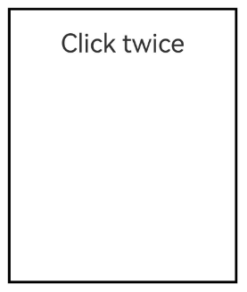
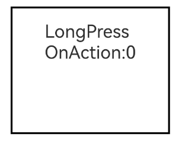
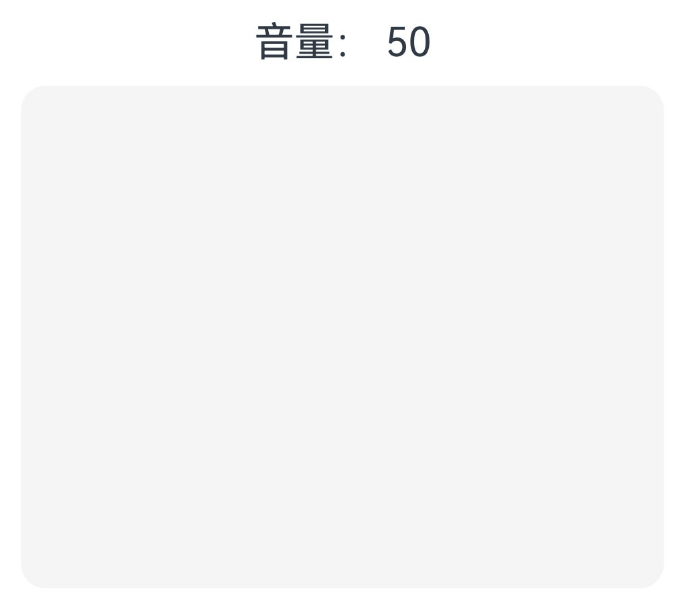

# 单一手势
<!--Kit: ArkUI-->
<!--Subsystem: ArkUI-->
<!--Owner: @jiangtao92-->
<!--Designer: @piggyguy-->
<!--Tester: @songyanhong-->
<!--Adviser: @HelloCrease-->

## 点击事件（onClick）

单击作为常用的手势，可以方便地使用[onClick](../reference/apis-arkui/arkui-ts/ts-universal-events-click.md#onclick)接口实现。尽管被称为事件，它实际上是基本手势类型，等同于将count配置为1的TapGesture，即单击手势。

onClick与其他手势类型相同，也会参与命中测试、响应链收集等过程。可以使用[干预手势处理](./arkts-interaction-development-guide-support-gesture.md#干预手势处理)机制对onClick的响应进行动态决策。


<!-- @[click_event](https://gitcode.com/openharmony/applications_app_samples/blob/master/code/DocsSample/ArkUISample/EventProject/entry/src/main/ets/pages/singlegesture/OnClickGesture.ets) -->

示例中，每点击5次，子组件的点击事件将临时禁用1次，确保父组件点击优先响应。


## 点击手势（TapGesture）


```ts
TapGesture(value?: TapGestureParameters)
```

点击手势支持单次点击和多次点击，参数定义参考[TapGesture](../reference/apis-arkui/arkui-ts/ts-basic-gestures-tapgesture.md)。

<!-- @[catch_click_twice_event](https://gitcode.com/openharmony/applications_app_samples/blob/master/code/DocsSample/ArkUISample/EventProject/entry/src/main/ets/pages/singlegesture/TapGesture.ets) -->

  


## 长按手势（LongPressGesture）


```ts
LongPressGesture(value?:{fingers?:number, repeat?:boolean, duration?:number})
```

长按手势用于触发长按手势事件，参数定义参考[LongPressGesture](../reference/apis-arkui/arkui-ts/ts-basic-gestures-longpressgesture.md)。

以在Text组件上绑定可以重复触发的长按手势为例：

<!-- @[catch_long_press_event](https://gitcode.com/openharmony/applications_app_samples/blob/master/code/DocsSample/ArkUISample/EventProject/entry/src/main/ets/pages/singlegesture/LongPressGesture.ets) -->





## 滑动手势（PanGesture）


```ts
PanGesture(value?: { fingers?: number; direction?: PanDirection; distance?: number } | PanGestureOptions)
```

滑动手势用于触发滑动手势事件，滑动达到最小滑动距离（默认值为5vp）时滑动手势识别成功，参数定义参考[PanGesture](../reference/apis-arkui/arkui-ts/ts-basic-gestures-pangesture.md)。

以下以实现一个简单的音量控制为例，可以通过滑动手势的回调函数处理多种不同的输入情况下的音量值增减的逻辑。
支持以下五种操作方式：
1、单指上下滑动；
2、按住鼠标左键上下滑动；
3、鼠标滚轮滚动；
4、单指按住触控板上下滑动；
5、使用触控板双指滑动。

<!-- @[sliding_gesture](https://gitcode.com/openharmony/applications_app_samples/blob/master/code/DocsSample/ArkUISample/EventProject/entry/src/main/ets/pages/singlegesture/PanCombinationGesture.ets) -->





>**说明：**
>
>大部分可滑动组件，如List、Grid、Scroll、Tab等组件是通过PanGesture实现滑动，在组件内部的子组件绑定[滑动手势（PanGesture）](#滑动手势pangesture)或者[滑动手势（SwipeGesture）](#快滑手势swipegesture)会导致手势竞争。
>
>当在子组件绑定PanGesture时，在子组件区域进行滑动仅触发子组件的PanGesture。如果需要父组件响应，需要通过修改手势绑定方法或者子组件向父组件传递消息进行实现，或者通过修改父子组件的PanGesture参数distance使得滑动更灵敏。当子组件绑定SwipeGesture时，由于PanGesture和SwipeGesture触发条件不同，需要修改PanGesture和SwipeGesture的参数以达到所需效果。
>
>不合理的阈值设置会导致滑动不跟手（响应时延慢）的问题。


## 捏合手势（PinchGesture）


```ts
PinchGesture(value?: { fingers?: number; distance?: number })
```

捏合手势用于触发捏合手势事件，参数定义参考[PinchGesture](../reference/apis-arkui/arkui-ts/ts-basic-gestures-pinchgesture.md)。

以在Column组件上绑定三指捏合手势为例，可以通过在捏合手势的函数回调中获取缩放比例，实现对组件的缩小或放大：

<!-- @[catch_pinch_gesture_event](https://gitcode.com/openharmony/applications_app_samples/blob/master/code/DocsSample/ArkUISample/EventProject/entry/src/main/ets/pages/singlegesture/PinchGesture.ets) -->


## 旋转手势（RotationGesture）


```ts
RotationGesture(value?: { fingers?: number; angle?: number })
```

旋转手势用于触发旋转手势事件，参数定义参考[RotationGesture](../reference/apis-arkui/arkui-ts/ts-basic-gestures-rotationgesture.md)。

以在Text组件上绑定旋转手势实现组件的旋转为例，可以通过在旋转手势的回调函数中获取旋转角度，从而实现组件的旋转：

<!-- @[catch_rotation_gesture_event](https://gitcode.com/openharmony/applications_app_samples/blob/master/code/DocsSample/ArkUISample/EventProject/entry/src/main/ets/pages/singlegesture/RotationGesture.ets) -->


## 快滑手势（SwipeGesture）


```ts
SwipeGesture(value?: { fingers?: number; direction?: SwipeDirection; speed?: number })
```

快滑手势用于触发快滑事件，当滑动速度大于100vp/s时可以识别成功，参数定义参考[SwipeGesture](../reference/apis-arkui/arkui-ts/ts-basic-gestures-swipegesture.md)。

以在Column组件上绑定快滑手势实现组件的旋转为例：

<!-- @[catch_swipe_gesture_event](https://gitcode.com/openharmony/applications_app_samples/blob/master/code/DocsSample/ArkUISample/EventProject/entry/src/main/ets/pages/singlegesture/SwipeGesture.ets) -->


>**说明：**
>
>当SwipeGesture和PanGesture同时绑定时，若二者是以默认方式或者互斥方式进行绑定时，会发生竞争。SwipeGesture的触发条件为滑动速度达到100vp/s，PanGesture的触发条件为滑动距离达到5vp，先达到触发条件的手势触发。可以通过修改SwipeGesture和PanGesture的参数以达到不同的效果。
