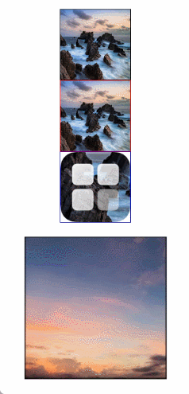
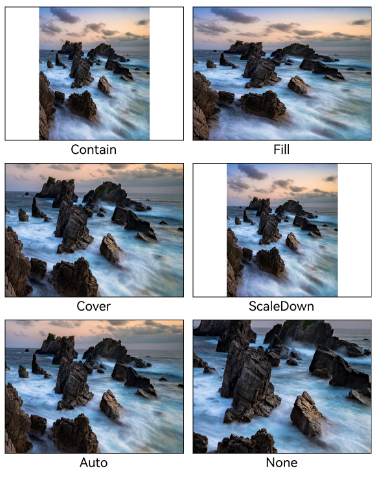
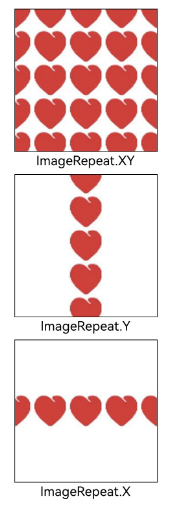
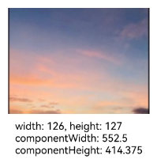

# 显示图片 (Image)
<!--Kit: ArkUI-->
<!--Subsystem: ArkUI-->
<!--Owner: @liyujie43-->
<!--Designer: @weixin_52725220-->
<!--Tester: @xiong0104-->
<!--Adviser: @HelloCrease-->

开发者经常需要在应用中显示一些图片，例如：按钮中的icon、网络图片、本地图片等。在应用中显示图片需要使用Image组件实现，Image支持多种图片格式，包括png、jpg、bmp、svg、gif和heif，不支持apng和svga格式，具体用法请参考[Image](../reference/apis-arkui/arkui-ts/ts-basic-components-image.md)组件。


Image通过调用接口来创建，接口调用形式如下：

```ts
Image(src: PixelMap | ResourceStr | DrawableDescriptor)
```


该接口通过图片数据源获取图片，支持本地图片和网络图片的渲染展示。其中，src是图片的数据源，加载方式请参考[加载图片资源](#加载图片资源)。

如果图片加载过程中出现白色块，请参考[Image白块问题解决方案](https://developer.huawei.com/consumer/cn/doc/best-practices/bpta-image-white-lump-solution)。如果图片加载时间过长，请参考[预置图片资源加载优化](https://developer.huawei.com/consumer/cn/doc/best-practices/bpta-texture-compression-improve-performance)。


## 加载图片资源

Image支持加载存档图、多媒体像素图和可绘制描述符三种类型。


### 存档图类型数据源

存档图类型的数据源可以分为本地资源、网络资源、Resource资源、媒体库资源和base64。

- 本地资源

  创建文件夹，将本地图片放入ets文件夹下的任意位置。

  Image组件引入本地图片路径，即可显示图片（根目录为ets文件夹）。不支持跨包、跨模块调用该Image组件。

  <!-- @[local_resource](https://gitcode.com/openharmony/applications_app_samples/blob/master/code/DocsSample/ArkUISample/ImageComponent/entry/src/main/ets/pages/LoadingResources.ets) -->
  
  ``` TypeScript
  //  'images/view.jpg' 需要替换为开发者所需的资源文件
  Image('images/view.jpg')
    .width(200)
  ```

  加载本地图片过程中，如果对图片进行修改或者替换，可能会引起应用崩溃。因此需要覆盖图片文件时，应该先删除该文件再重新创建一个同名文件。

- 网络资源

  引入网络图片需申请权限ohos.permission.INTERNET，具体申请方式请参考[声明权限](../security/AccessToken/declare-permissions.md)。此时，Image组件的src参数为网络图片的链接。

  当前Image组件仅支持加载简单网络图片。

  Image组件首次加载网络图片时，需要请求网络资源，非首次加载时，默认从缓存中直接读取图片，更多图片缓存设置请参考[setImageCacheCount](../reference/apis-arkui/js-apis-system-app.md#setimagecachecount7)、[setImageRawDataCacheSize](../reference/apis-arkui/js-apis-system-app.md#setimagerawdatacachesize7)、[setImageFileCacheSize](../reference/apis-arkui/js-apis-system-app.md#setimagefilecachesize7)。但是，这三个图片缓存接口并不灵活，且后续不继续演进，对于复杂情况，更推荐使用[ImageKnife](https://gitcode.com/openharmony-tpc/ImageKnife)。

  网络图片必须支持RFC 9113标准，否则会导致加载失败。如果下载的网络图片大于10MB或一次下载的网络图片数量较多，建议使用[HTTP](../network/http-request.md)工具提前预下载，提高图片加载性能，方便应用侧管理数据。

  在显示网络图片时，Image组件在机制上会依赖[缓存下载模块](../reference/apis-basic-services-kit/js-apis-request-cacheDownload.md)，开发者可参考[示例3下载与显示网络gif图片](../reference/apis-arkui/arkui-ts/ts-basic-components-image.md#示例3下载与显示网络gif图片)了解具体用法。
  
  缓存下载模块提供独立的预下载接口，允许应用开发者在创建Image组件前预下载所需图片。组件创建后，Image组件可直接从缓存下载模块中获取已下载的图片数据，从而加快图片的显示速度，优化加载体验，并有效避免网络图片加载延迟。网络缓存的位置位于应用根目录下的cache目录中。

  <!-- @[net_resource](https://gitcode.com/openharmony/applications_app_samples/blob/master/code/DocsSample/ArkUISample/ImageComponent/entry/src/main/ets/pages/LoadingResources.ets) -->
  
  ``` TypeScript
  //  $r('app.string.LoadingResources') 需要替换为开发者所需的资源文件
  Image($r('app.string.LoadingResources')) // 实际使用时请替换为真实地址
  ```

- Resource资源

  使用资源格式可以跨包/跨模块引入图片，resources文件夹下的图片都可以通过$r资源接口读取到并转换到Resource格式。

  **图1** resources  

  

  调用方式：

  <!-- @[resource_icon](https://gitcode.com/openharmony/applications_app_samples/blob/master/code/DocsSample/ArkUISample/ImageComponent/entry/src/main/ets/pages/LoadingResources.ets) -->
  
  ``` TypeScript
  //  $r('app.media.icon') 需要替换为开发者所需的资源文件
  Image($r('app.media.icon'))
  ```

  还可以将图片放在rawfile文件夹下。

  **图2** rawfile  

  

  调用方式：

  <!-- @[rawfile_resource](https://gitcode.com/openharmony/applications_app_samples/blob/master/code/DocsSample/ArkUISample/ImageComponent/entry/src/main/ets/pages/LoadingResources.ets) -->
  
  ``` TypeScript
  //  $rawfile('example1.png') 需要替换为开发者所需的资源文件
  Image($rawfile('example1.png'))
  ```

- 媒体库file://data/storage

  支持file://路径前缀的字符串，用于访问通过[选择器](../reference/apis-core-file-kit/js-apis-file-picker.md)提供的图片路径。

  1. 调用接口获取图库的照片url。

  <!-- @[media_libraryfile](https://gitcode.com/openharmony/applications_app_samples/blob/master/code/DocsSample/ArkUISample/ImageComponent/entry/src/main/ets/pages/LoadImageResources.ets) -->
  
  ``` TypeScript
  import { photoAccessHelper } from '@kit.MediaLibraryKit';
  import { BusinessError } from '@kit.BasicServicesKit';
  
  // ···
  @Entry
  @Component
  struct MediaLibraryFile {
    @State imgDatas: string[] = [];
    // 获取照片url集
    getAllImg() {
      try {
        let photoSelectOptions:photoAccessHelper.PhotoSelectOptions = new photoAccessHelper.PhotoSelectOptions();
        photoSelectOptions.MIMEType = photoAccessHelper.PhotoViewMIMETypes.IMAGE_TYPE;
        photoSelectOptions.maxSelectNumber = 5;
        let photoPicker:photoAccessHelper.PhotoViewPicker = new photoAccessHelper.PhotoViewPicker();
        photoPicker.select(photoSelectOptions).then((photoSelectResult:photoAccessHelper.PhotoSelectResult) => {
          this.imgDatas = photoSelectResult.photoUris;
          hilog.info(DOMAIN, TAG,'PhotoViewPicker.select successfully, photoSelectResult uri: ' + JSON.stringify(photoSelectResult));
        }).catch((err:Error) => {
          let message = (err as BusinessError).message;
          let code = (err as BusinessError).code;
          hilog.info(DOMAIN, TAG,`PhotoViewPicker.select failed with. Code: ${code}, message: ${message}`);
        });
      } catch (err) {
        let message = (err as BusinessError).message;
        let code = (err as BusinessError).code;
        hilog.info(DOMAIN, TAG,`PhotoViewPicker failed with. Code: ${code}, message: ${message}`);
      };
    };
  
    // aboutToAppear中调用上述函数，获取图库的所有图片url，存在imgDatas中
    async aboutToAppear() {
      this.getAllImg();
    };
    // 使用imgDatas的url加载图片。
    build() {
      Column() {
        Grid() {
          ForEach(this.imgDatas, (item:string) => {
            GridItem() {
              Image(item)
                .width(200)
            }
          }, (item:string):string => JSON.stringify(item))
        }
      }.width('100%').height('100%')
    }
  }
  ```

  2. 从媒体库获取的url格式通常如下。

  <!-- @[fileLibrary_format](https://gitcode.com/openharmony/applications_app_samples/blob/master/code/DocsSample/ArkUISample/ImageComponent/entry/src/main/ets/pages/LoadingResources.ets) -->
  
  ``` TypeScript
  //  'file://media/Photos/5' 需要替换为开发者所需的资源文件
  Image('file://media/Photos/5')
    .width(200)
  ```


- base64

  路径格式为data:image/[png|jpeg|bmp|webp|heif];base64,[base64 data]，其中[base64 data]为Base64字符串数据。

  Base64格式字符串可用于存储图片的像素数据，在网页上使用较为广泛。


### 多媒体像素图

PixelMap是图片解码后的像素图，具体用法请参考[图片开发指导](../media/image/image-overview.md)。以下示例将加载的网络图片返回的数据解码成PixelMap格式，再显示在Image组件上。


  <!-- @[multimedia_pixel](https://gitcode.com/openharmony/applications_app_samples/blob/master/code/DocsSample/ArkUISample/ImageComponent/entry/src/main/ets/pages/MultimediaPixelArt.ets) -->
  
  ``` TypeScript
  import { http } from '@kit.NetworkKit';
  import { image } from '@kit.ImageKit';
  import { BusinessError } from '@kit.BasicServicesKit';
  
  // ···
  @Entry
  @Component
  struct HttpExample {
    outData: http.HttpResponse | undefined = undefined;
    code: http.ResponseCode | number | undefined = undefined;
    @State image: PixelMap | undefined = undefined; //创建PixelMap状态变量。
  
    aboutToAppear(): void {
      http.createHttp().request('', //请填写一个具体的网络图片地址。
        (error: BusinessError, data: http.HttpResponse) => {
          if (error) {
            hilog.error(DOMAIN, TAG, `hello http request failed. Code: ${error.code}, message: ${error.message}`);
            return;
          };
          this.outData = data;
          //将网络地址成功返回的数据，编码转码成pixelMap的图片格式。
          if (http.ResponseCode.OK === this.outData.responseCode) {
            let imageData: ArrayBuffer = this.outData.result as ArrayBuffer;
            let imageSource: image.ImageSource = image.createImageSource(imageData);
            let options: image.DecodingOptions = {
              'desiredPixelFormat': image.PixelMapFormat.RGBA_8888,
            };
            imageSource.createPixelMap(options).then((pixelMap: PixelMap) => {
              this.image = pixelMap;
            });
          };
        });
    };
  
    build() {
      Column() {
        //显示图片
        Image(this.image)
          .height(100)
          .width(100)
      }
    }
  }
  ```

### 可绘制描述符

DrawableDescriptor是ArkUI提供的一种高级图片抽象机制，它通过将图片资源封装为可编程对象，实现了传统Image组件难以实现的动态组合与运行时控制功能。开发者可利用它实现图片的分层叠加（如徽章图标）、动态属性调整（如颜色滤镜）、复杂动画序列等高级效果，适用于需要灵活控制图片展现或实现复杂视觉交互的场景。详细使用方法，请参考[DrawableDescriptor](../../application-dev/reference/apis-arkui/js-apis-arkui-drawableDescriptor.md)。

通过DrawableDescriptor显示图片及动画的示例如下所示：

  <!-- @[drawable_descriptor](https://gitcode.com/openharmony/applications_app_samples/blob/master/code/DocsSample/ArkUISample/ImageComponent/entry/src/main/ets/pages/DrawableDescriptor.ets) -->




## 显示矢量图

Image组件可显示矢量图（SVG格式的图片），SVG标签文档请参考[SVG标签说明](../../application-dev/reference/apis-arkui/arkui-ts/ts-basic-svg.md)。

如果SVG图片没有原始大小，需要给Image组件设置宽高，否则不显示。SVG图片不支持通过image标签引用SVG格式和gif格式的本地其他图片。

SVG格式的图片可以使用fillColor属性改变图片的绘制颜色。


  <!-- @[svg_fillColor](https://gitcode.com/openharmony/applications_app_samples/blob/master/code/DocsSample/ArkUISample/ImageComponent/entry/src/main/ets/pages/DisplayVectorDiagram.ets) -->

  **图3** 原始图片  


  **图4** 设置绘制颜色后的SVG图片  


### 矢量图引用位图

如果Image加载的SVG图源中包含对本地位图的引用，则SVG图源的路径应当设置为以ets为根目录的工程路径，同时，本地位图的路径应设置为与SVG图源同级的相对路径。

Image加载的SVG图源路径设置方法如下所示：

  <!-- @[local_svg](https://gitcode.com/openharmony/applications_app_samples/blob/master/code/DocsSample/ArkUISample/ImageComponent/entry/src/main/ets/pages/DisplayVectorDiagram.ets) -->
SVG图源通过`<image>`标签的`xlink:href`属性指定本地位图路径，本地位图路径设置为跟SVG图源同级的相对路径：

```
<svg width="200" height="200">
  <image width="200" height="200" xlink:href="sky.png"></image>
</svg>
```
文件工程路径示例如图：


## 添加属性

给Image组件设置属性可以使图片显示更灵活，达到一些自定义的效果。以下是几个常用属性的使用示例，完整属性信息详见[Image](../reference/apis-arkui/arkui-ts/ts-basic-components-image.md)。

### 设置图片缩放类型

通过设置objectFit属性，可以使图片在高度和宽度确定的框内进行缩放。


  <!-- @[image_objectfit](https://gitcode.com/openharmony/applications_app_samples/blob/master/code/DocsSample/ArkUISample/ImageComponent/entry/src/main/ets/pages/SetImageZoomType.ets) -->




### 图片插值

当原图分辨率较低并放大显示时，图片会变得模糊并出现锯齿。这时可以使用interpolation属性对图片进行插值，以提高显示清晰度。


  <!-- @[image_interpolation](https://gitcode.com/openharmony/applications_app_samples/blob/master/code/DocsSample/ArkUISample/ImageComponent/entry/src/main/ets/pages/ImageInterpolation.ets) -->


### 设置图片重复样式

通过objectRepeat属性设置图片的重复样式方式，重复样式请参考[ImageRepeat](../reference/apis-arkui/arkui-ts/ts-appendix-enums.md#imagerepeat)枚举说明。


  <!-- @[image_repetitionstyle](https://gitcode.com/openharmony/applications_app_samples/blob/master/code/DocsSample/ArkUISample/ImageComponent/entry/src/main/ets/pages/SetImageRepetitionStyle.ets) -->




### 设置图片渲染模式

通过renderMode属性设置图片的渲染模式为原色或黑白。


  <!-- @[image_renderingmode](https://gitcode.com/openharmony/applications_app_samples/blob/master/code/DocsSample/ArkUISample/ImageComponent/entry/src/main/ets/pages/SetImageRenderingMode.ets) -->


### 设置图片解码尺寸

通过sourceSize属性设置图片解码尺寸，降低图片的分辨率。

原图尺寸为1280×960，该示例将图片解码为40×40和90×90两个尺寸。


  <!-- @[image_decodingsize](https://gitcode.com/openharmony/applications_app_samples/blob/master/code/DocsSample/ArkUISample/ImageComponent/entry/src/main/ets/pages/SetImageDecodingSize.ets) -->


### 为图片添加滤镜效果

通过colorFilter调整图片的像素颜色，为图片添加滤镜。


  <!-- @[image_filtereffect](https://gitcode.com/openharmony/applications_app_samples/blob/master/code/DocsSample/ArkUISample/ImageComponent/entry/src/main/ets/pages/AddFilterEffectsToImages.ets) -->


### 同步加载图片

一般情况下，图片加载流程会异步进行，以避免阻塞主线程，影响UI交互。但是特定情况下，图片刷新时会出现闪烁，这时可以使用syncLoad属性，使图片同步加载，从而避免出现闪烁。不建议图片加载较长时间时使用，会导致页面无法响应。


  <!-- @[synchronous_imageloading](https://gitcode.com/openharmony/applications_app_samples/blob/master/code/DocsSample/ArkUISample/ImageComponent/entry/src/main/ets/pages/DisplayVectorDiagram.ets) -->


## 事件调用

通过在Image组件上绑定onComplete事件，图片加载成功后可以获取图片的必要信息。如果图片加载失败，也可以通过绑定onError回调来获得结果。


  <!-- @[event_invocation](https://gitcode.com/openharmony/applications_app_samples/blob/master/code/DocsSample/ArkUISample/ImageComponent/entry/src/main/ets/pages/EventCall.ets) -->



## 相关实例

针对显示图片开发，有以下相关实例可供参考：

- [显示图片](https://gitcode.com/openharmony/applications_app_samples/tree/master/code/DocsSample/ArkUISample/ImageComponent)