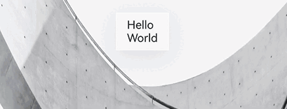
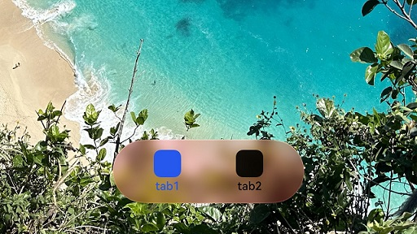
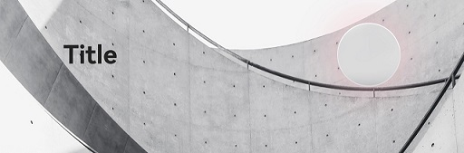

# 沉浸式系统材质视效
<!--Kit: ArkUI-->
<!--Subsystem: ArkUI-->
<!--Owner: @H-xinwei-->
<!--Designer: @zhanghaibo0-->
<!--Tester: @lxl007-->
<!--Adviser: @Brilliantry_Rui-->

本文介绍如何按场景定制沉浸式系统材质的视效，包括设置沉浸式系统材质反色、为沉浸式系统材质赋色、设置沉浸式系统材质交互效果以及设置沉浸式系统材质阴影效果。

> **说明：**
>
> 本文涉及的沉浸光感效果均需在材质生效范围内才会呈现。具体生效范围如下：
> - 通过[systemMaterial](../reference/apis-arkui/arkui-ts/ts-universal-attributes-image-effect.md#systemmaterial)为组件设置的沉浸式系统材质仅在Navigation/NavDestination标题栏子树，或横向Tabs中barPosition为BarPosition.End的底部TabBar子树中生效。
> - Slider、Toggle以及弹窗类组件不受此范围限制。弹窗类组件包括：Popup、Tips、Menu、BindSheet、AlertDialog、CustomDialog、ActionSheet、CalendarPickerDialog、DatePickerDialog、TextPickerDialog、TimePickerDialog、Toast、Select下拉菜单、AlphabetIndexer气泡弹窗。

## 设置沉浸式系统材质反色

当组件设置为透明度较高的沉浸式系统材质（如ULTRA_THIN或THIN）时，例如组件内的文字可能与背景色对比度不足，导致阅读体验不佳。开启[ImmersiveOptions](../reference/apis-arkui/arkts-apis-uimaterial.md#immersiveoptions)中的colorInvert自动反色功能后，组件子节点中的文字颜色会自动调整为沉浸式系统材质下方背景色的反色，确保文字始终可读。具体的使用限制请参见[colorInvert](../reference/apis-arkui/arkts-apis-uimaterial.md#immersiveoptions)参数说明。

如开启自动反色后文字颜色没有变化，排查步骤请参见[开启自动反色后文字颜色没有变化](arkts-immersive-light-sense-faq.md#开启自动反色后文字颜色没有变化)。

以下示例为自动反色的效果：材质下方的背景在黑白之间滚动变化，为TabBar组件设置colorInvert为true的ULTRA_THIN材质后，TabBar内的文字和图标颜色随背景自动反色，使文字与图标清晰可读。

```ts
import { uiMaterial } from '@kit.ArkUI';

@Component
struct ContentOne {
  build() {
    Scroll() {
      Column() {
        // $r('app.media.greyBackground')需要替换为开发者所需的图像资源文件
        Image($r('app.media.greyBackground'))
          .width('100%')
          .height('150%')
          .objectFit(ImageFit.Fill)
        // $r('app.media.greyBackground')需要替换为开发者所需的图像资源文件
        Image($r('app.media.greyBackground'))
          .width('100%')
          .height('150%')
          .objectFit(ImageFit.Fill)
      }
      .width('100%')
    }
    .width('100%')
    .height('100%')
  }
}

@Entry
@Component
struct PageMaterialReverse {
  build() {
    Column() {
      Tabs({ barPosition: BarPosition.End }) {
        TabContent() {
          ContentOne()
        }.tabBar(new BottomTabBarStyle($r('sys.media.ohos_icon_mask_svg'), "tab1")
        // BottomTabBarStyle样式支持反色，且设置支持反色的系统颜色资源
          .labelStyle({ selectedColor: $r('sys.color.brand'), unselectedColor: $r('sys.color.font_primary') })
          .iconStyle({ selectedColor: $r('sys.color.brand'), unselectedColor: $r('sys.color.font_primary') })
        )

        TabContent() {
          Column().width('100%').height('100%').backgroundColor(Color.Green)
        }.tabBar(new BottomTabBarStyle($r('sys.media.ohos_icon_mask_svg'), "tab2")
          .labelStyle({ selectedColor: $r('sys.color.brand'), unselectedColor: $r('sys.color.font_primary') })
          .iconStyle({ selectedColor: $r('sys.color.brand'), unselectedColor: $r('sys.color.font_primary') })
        )
      }
      .barFloatingStyle({
        adaptToHandedness: true,
        systemMaterial: new uiMaterial.ImmersiveMaterial(
          {
            style: uiMaterial.ImmersiveStyle.ULTRA_THIN,
            // 设置tabBar的材质为允许反色，且需配合ULTRA_THIN或THIN的style才能反色
            colorInvert: true,
          }
        )
      })
      .barOverlap(true)
      .height('100%')
    }
    .width('100%')
    .height('100%')
  }
}
```



## 为沉浸式系统材质赋色

通过[ImmersiveOptions](../reference/apis-arkui/arkts-apis-uimaterial.md#immersiveoptions)中的[materialColor](../reference/apis-arkui/arkts-apis-uimaterial.md#immersiveoptions)参数，可为材质滤镜再混合一层纯色效果，用于色调表达或降低折射的可见程度。该颜色需要带有一定的透明度，传入纯不透明颜色（如`Color.Red`或`'#FFFF0000'`）会遮挡材质滤镜效果。

> **说明：**
>
> materialColor参数对所有档位的算力设备均生效。在高算力和中算力设备上，该参数为材质滤镜再混合一层纯色效果；在低算力设备上，该参数作为背景色[backgroundColor](../reference/apis-arkui/arkui-ts/ts-universal-attributes-background.md#backgroundcolor)属性值。

以下示例为材质赋色的效果：为ULTRA_THIN材质组件设置半透明的materialColor后，材质在透出背景内容的同时呈现对应的色调。

```ts
import { uiMaterial } from '@kit.ArkUI';

@Entry
@Component
struct MaterialColorExample {
  build() {
    Column() {
      Tabs({ barPosition: BarPosition.End }) {
        TabContent() {
          // $r('app.media.invert')需要替换为开发者所需的图像资源文件
          Image($r('app.media.invert'))
            .width('100%')
            .height('100%')
            .objectFit(ImageFit.Cover)
        }.tabBar(new BottomTabBarStyle($r('sys.media.ohos_icon_mask_svg'), "tab1")
          .labelStyle({ selectedColor: $r('sys.color.brand'), unselectedColor: $r('sys.color.font_primary') })
          .iconStyle({ selectedColor: $r('sys.color.brand'), unselectedColor: $r('sys.color.font_primary') })
        )

        TabContent() {
          Column().width('100%').height('100%').backgroundColor(Color.Green)
        }.tabBar(new BottomTabBarStyle($r('sys.media.ohos_icon_mask_svg'), "tab2")
          .labelStyle({ selectedColor: $r('sys.color.brand'), unselectedColor: $r('sys.color.font_primary') })
          .iconStyle({ selectedColor: $r('sys.color.brand'), unselectedColor: $r('sys.color.font_primary') })
        )
      }
      .barFloatingStyle({
        adaptToHandedness: true,
        maskHeight: 0,
        systemMaterial: new uiMaterial.ImmersiveMaterial(
          {
            style: uiMaterial.ImmersiveStyle.ULTRA_THIN,
            // 设置材质赋色颜色
            materialColor: 'rgba(255, 0, 0, 0.2)',
          }
        )
      })
      .barOverlap(true)
      .height('100%')
    }
    .width('100%')
    .height('100%')
  }
}
```



## 设置沉浸式系统材质交互效果

沉浸式系统材质支持设置交互形变和点光源效果：

- **交互形变**：通过[interactive](../reference/apis-arkui/arkts-apis-uimaterial.md#immersiveoptions)开启交互形变，组件在按压时产生弹性形变，松手后自动恢复，增强交互的视觉反馈。
- **点光源**：通过[lightEffect](../reference/apis-arkui/arkts-apis-uimaterial.md#immersiveoptions)开启点光源，用户手指触摸组件时会产生流光跟随效果。lightEffect传入有效对象即启用，传入null或undefined则不启用；对象中的color字段自定义流光颜色，默认值为Color.White。

以下示例为交互形变与点光源的效果：设置interactive为true并传入lightEffect对象后，按压组件时产生弹性形变，手指触摸时产生流光跟随效果。

```ts
import { uiMaterial } from '@kit.ArkUI';

@Entry
@Component
struct MaterialColorExample {
  build() {
    Column() {
      Tabs({ barPosition: BarPosition.End }) {
        TabContent() {
          // $r('app.media.invert')需要替换为开发者所需的图像资源文件
          Image($r('app.media.invert'))
            .width('100%')
            .height('100%')
            .objectFit(ImageFit.Cover)
        }.tabBar(new BottomTabBarStyle($r('sys.media.ohos_icon_mask_svg'), "tab1")
          .labelStyle({ selectedColor: $r('sys.color.brand'), unselectedColor: $r('sys.color.font_primary') })
          .iconStyle({ selectedColor: $r('sys.color.brand'), unselectedColor: $r('sys.color.font_primary') })
        )

        TabContent() {
          Column().width('100%').height('100%').backgroundColor(Color.Green)
        }.tabBar(new BottomTabBarStyle($r('sys.media.ohos_icon_mask_svg'), "tab2")
          .labelStyle({ selectedColor: $r('sys.color.brand'), unselectedColor: $r('sys.color.font_primary') })
          .iconStyle({ selectedColor: $r('sys.color.brand'), unselectedColor: $r('sys.color.font_primary') })
        )
      }
      .barFloatingStyle({
        adaptToHandedness: true,
        maskHeight: 0,
        systemMaterial: new uiMaterial.ImmersiveMaterial({
          style: uiMaterial.ImmersiveStyle.ULTRA_THIN,
          // 开启可交互形变
          interactive: true,
          // 设置交互点光源效果为默认颜色
          lightEffect: {},
        }),
      })
      .barOverlap(true)
      .height('100%')
    }
    .width('100%')
    .height('100%')
  }
}
```


## 设置沉浸式系统材质阴影效果

沉浸式系统材质默认自带阴影效果（[applyShadow](../reference/apis-arkui/arkts-apis-uimaterial.md#immersiveoptions)为true），优先于[shadow](../reference/apis-arkui/arkui-ts/ts-universal-attributes-image-effect.md#shadow)通用属性，此时自定义的shadow设置不会生效。如需使用自定义阴影，将applyShadow置为false后再设置shadow，沉浸式系统材质的阴影效果即不生效。

将applyShadow置为false后设置自定义shadow（如粉色阴影）的效果，示例如下：

```ts
import { uiMaterial } from '@kit.ArkUI';

@Entry
@Component
struct CustomShadowExample {
  @Builder
  NavigationTitle() {
    Row() {
      Text("Title")
        .fontSize(20)
        .fontWeight(FontWeight.Bold)

      Column()
        .width(50)
        .height(50)
        .borderRadius(25)
        .justifyContent(FlexAlign.Center)
        .systemMaterial(new uiMaterial.ImmersiveMaterial({
          style: uiMaterial.ImmersiveStyle.ULTRA_THIN,
          applyShadow: false,
          interactive: true,
        }))
        .shadow({ radius: 100, color: Color.Pink })
    }
    .width('100%')
    .justifyContent(FlexAlign.SpaceBetween)
    .padding({ left: 50, right: 50, top: 20 })
  }

  build() {
    Column() {
      Navigation() {
        // 页面内容
        Image($r('app.media.invert'))
          .width('100%')
          .height('100%')
          .objectFit(ImageFit.Cover)
      }
      .title({ builder: this.NavigationTitle, height: '100%' })
      // $r('app.media.greyBackground')需要替换为开发者所需的图像资源文件
      .backgroundImage($r('app.media.greyBackground'))
      .backgroundImageSize({ width: '100%', height: '100%' })
    }.width('100%').height('100%')
  }
}
```


