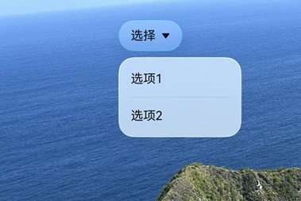
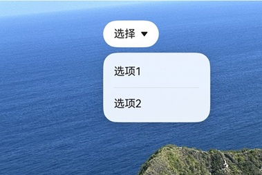
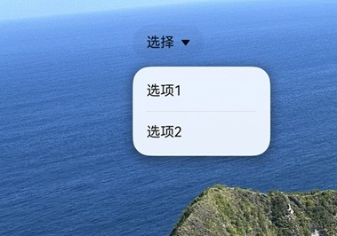

# 沉浸光感兼容性适配
<!--Kit: ArkUI-->
<!--Subsystem: ArkUI-->
<!--Owner: @H-xinwei-->
<!--Designer: @zhanghaibo0-->
<!--Tester: @lxl007-->
<!--Adviser: @Brilliantry_Rui-->

沉浸光感从API版本26.0.0开始支持。应用在接入沉浸光感时，如果需要兼容低版本，需要处理好两方面问题。一是应用级开启时，避免沉浸式系统材质属性冲突。二是组件级开启时，沉浸式系统材质接口在低版本上不可用，需要进行版本判断，在低版本上将材质设置为empty以显式清空材质效果，保持组件原有样式。

本文从应用级开启和组件级开启两个维度，提供沉浸式系统材质向低版本兼容的适配方案。

## 应用级开启的兼容性适配方案

应用级开关配置为default或enable模式时，支持应用级开启的组件会默认开启沉浸式系统材质。而组件在接入沉浸式系统材质前，通常已设置了背景色、背景模糊、阴影或边框等样式，这些属性与材质效果存在冲突（详见[ImmersiveMaterial](../reference/apis-arkui/arkts-apis-uimaterial.md#immersivematerial)），例如不透明的背景色会遮挡材质效果，导致材质无法正常呈现。

**兼容性适配方案：**

 通过[uiMaterial.getMaterialInfo()](../reference/apis-arkui/arkts-apis-uimaterial.md#uimaterialgetmaterialinfo)获取应用的材质配置信息[MaterialInfo](../reference/apis-arkui/arkts-apis-uimaterial.md#materialinfo)，根据其中的[MaterialState](../reference/apis-arkui/arkts-apis-uimaterial.md#materialstate)判断应用级沉浸式系统材质是否开启。如果组件支持应用级开启且沉浸式系统材质已开启，则将与材质冲突的属性清空，使其恢复默认值，确保材质效果正常呈现。

**示例：**

以下示例以支持应用级开启的Select组件为例，该组件在ENABLE模式下默认开启沉浸式系统材质。通过uiMaterial.getMaterialInfo()获取材质配置信息后，当状态为ENABLE（即沉浸式系统材质已开启）时，将backgroundColor置为undefined，避免白色背景遮挡材质效果；否则保持Color.White白色背景，保证材质未开启时的显示效果。

```ts
import { uiMaterial } from '@kit.ArkUI';
import { deviceInfo } from '@kit.BasicServicesKit';

@Entry
@Component
struct ComponentLevelCompatibility {
  build() {
    Stack({ alignContent: Alignment.Top }) {
      Column() {}
        .width('100%')
        .height('100%')
        // $r('app.media.invert')需要替换为开发者所需的图像资源文件
        .backgroundImage($r('app.media.invert'))

      Column() {
        Select([{ value: '选项1' }, { value: '选项2' }])
          .value('选择')
          // 应用级沉浸式系统材质开启时，将backgroundColor置为undefined，避免遮挡材质效果
          .backgroundColor(this.info.state === uiMaterial.MaterialState.ENABLE ? undefined :  Color.White)
      }
      .width(100)
      .height(100)
      .justifyContent(FlexAlign.Center)
    }
  }
}
```

应用级ENABLE模式下，Select呈现沉浸式系统材质样式：



应用级在非ENABLE模式下，Select按钮背景为白色，呈现默认样式：



## 组件级开启的兼容性适配方案

组件级开启通过[systemMaterial](../reference/apis-arkui/arkui-ts/ts-universal-attributes-image-effect.md#systemmaterial)属性为单个组件设置沉浸式系统材质，该属性及[ImmersiveMaterial](../reference/apis-arkui/arkts-apis-uimaterial.md#immersivematerial)类均从API版本26.0.0开始支持，在低版本上不可用。

**兼容性适配方案：**

通过[@ohos.deviceInfo (设备信息)](../reference/apis-basic-services-kit/js-apis-device-info.md)提供的deviceInfo.sdkApiVersion判断系统软件API版本是否不低于API版本26.0.0。不低于26.0.0时，通过systemMaterial为组件设置ImmersiveMaterial材质；低于26.0.0时，将systemMaterial设置为[uiMaterial.Material.empty](../reference/apis-arkui/arkts-apis-uimaterial.md#empty)，显式清空材质效果，使组件保持原有的背景色等样式设置，保证低版本上的显示效果。

**示例：**

以下以Select组件为例，通过deviceInfo.sdkApiVersion判断系统软件API版本：不低于26.0.0时，为组件设置材质样式为THIN的ImmersiveMaterial；低于26.0.0时，将systemMaterial设置为uiMaterial.Material.empty清空材质效果，组件保持原有样式。

```ts
import { uiMaterial } from '@kit.ArkUI';
import { deviceInfo } from '@kit.BasicServicesKit';

@Entry
@Component
struct ComponentLevelCompatibility {
  build() {
    Stack({ alignContent: Alignment.Top }) {
      // $r('app.media.invert')需要替换为开发者所需的图像资源文件
      Column() {}
        .width('100%')
        .height('100%')
        .backgroundImage($r('app.media.invert'))

      Column() {
        Select([{ value: '选项1' }, { value: '选项2' }])
          .value('选择')
          // API版本不低于26.0.0时，设置沉浸式系统材质；低于26.0.0时，设置为undefined，显式清空材质效果
          .systemMaterial(deviceInfo.sdkApiVersion >= 26 ?
            new uiMaterial.ImmersiveMaterial({ style: uiMaterial.ImmersiveStyle.THIN }) : undefined)
      }
      .width(100)
      .height(100)
      .justifyContent(FlexAlign.Center)
    }
  }
}
```

系统软件API版本低于26.0.0时，组件保持原有样式：



系统软件API版本26.0.0及以上时，组件呈现沉浸式系统材质效果：

