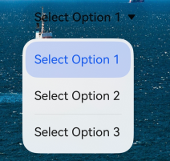
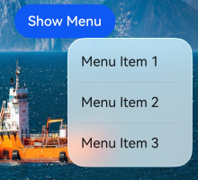
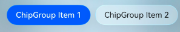
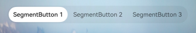
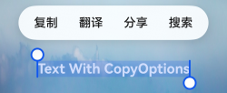
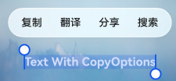

# 开启沉浸光感
<!--Kit: ArkUI-->
<!--Subsystem: ArkUI-->
<!--Owner: @H-xinwei-->
<!--Designer: @zhanghaibo0-->
<!--Tester: @lxl007-->
<!--Adviser: @Brilliantry_Rui-->

沉浸光感提供组件级和应用级两种接入方式，可按需选择：

- **组件级接入**：为单个组件精细控制沉浸式系统材质的开启与样式，无需任何全局配置即可生效（DISABLE模式除外），是为指定组件设置沉浸式系统材质最直接的方式，详见[组件级接入](#组件级接入)。

- **应用级接入**：通过[module.json5](../quick-start/module-configuration-file.md)统一配置，使支持沉浸式系统材质的组件批量默认开启沉浸式系统材质，或全局禁用沉浸式系统材质，适合希望系统性为应用接入沉浸光感的场景，详见[应用级接入](#应用级接入)。

两种接入方式的关系：应用级开关只决定哪些组件"默认开启"沉浸式系统材质以及是否全局禁用，不影响开发者主动通过systemMaterial设置的沉浸式系统材质（DISABLE模式除外）。如果只需为某个组件设置沉浸式系统材质，直接使用组件级方式即可；如需让组件批量开启沉浸式系统材质或全局禁用沉浸式系统材质，再配置应用级开关。

## 组件级接入

根据组件类型的不同，组件级设置方式分为两类：

1. 通过通用属性[systemMaterial](../reference/apis-arkui/arkui-ts/ts-universal-attributes-image-effect.md#systemmaterial)设置，适用于组件。
2. 通过组件options参数中的systemMaterial字段设置，适用于Toast、Popup、Tips、半模态、菜单等弹窗类组件。

如需单独关闭某个默认开启沉浸式系统材质的组件，应设置[uiMaterial.Material.empty](../reference/apis-arkui/arkts-apis-uimaterial.md#empty)，详见[关闭默认开启的组件沉浸式系统材质](#关闭默认开启的组件沉浸式系统材质)。

## 应用级接入

应用级开启指通过module.json5统一控制应用内支持沉浸式系统材质的组件是否默认开启沉浸式系统材质，可以系统性地开启沉浸式系统材质。

需要注意的是，应用级接入并非只有静态的材质观感：在高算力设备上，无论通过组件级接入还是应用级接入，[弹出框（Dialog）](arkts-base-dialog-overview.md)和[菜单控制](../reference/apis-arkui/arkui-ts/ts-universal-attributes-menu.md)的弹出过程都会自动附带形变、流光等沉浸式空间动效，无需开发者额外配置。

支持应用级沉浸式系统材质的组件和默认开启时使用的沉浸式系统材质参数如下所示：

弹窗与菜单类组件：

| 组件 | 默认材质样式ImmersiveStyle | 开关启用前的效果 | 开关启用后的效果 |
| --- | --- | --- | --- |
| [弹出框（Dialog）](arkts-base-dialog-overview.md) | ULTRA_THICK |  |  |
| [即时反馈（Toast）](arkts-create-toast.md) | THICK |  |  |
| [Select](../reference/apis-arkui/arkui-ts/ts-basic-components-select.md) | Select的下拉按钮使用的参数：ULTRA_THIN<br/>Select的下拉菜单使用的参数：THICK |  |  |
| [菜单控制](../reference/apis-arkui/arkui-ts/ts-universal-attributes-menu.md) | THICK |  |  |

内容与导航类组件：

| 组件 | 默认材质样式ImmersiveStyle | 开关启用前的效果 | 开关启用后的效果 |
| --- | --- | --- | --- |
| [AlphabetIndexer](../reference/apis-arkui/arkui-ts/ts-container-alphabet-indexer.md) | THICK |  |  |
| [Chip](../reference/apis-arkui/arkui-ts/ohos-arkui-advanced-Chip.md) | ULTRA_THIN |  |  |
| [ChipGroup](../reference/apis-arkui/arkui-ts/ohos-arkui-advanced-ChipGroup.md) | ULTRA_THIN |  |  |
| [Toggle](../reference/apis-arkui/arkui-ts/ts-basic-components-toggle.md) | 不涉及材质样式 |  |  |
| [Slider](../reference/apis-arkui/arkui-ts/ts-basic-components-slider.md) | 不涉及材质样式 |  |  |
| [SegmentButton](../reference/apis-arkui/arkui-ts/ohos-arkui-advanced-SegmentButton.md) | THIN |  |  |
| [SegmentButtonV2](../reference/apis-arkui/arkui-ts/ohos-arkui-advanced-SegmentButtonV2.md) | THIN |  |  |
| [Text](../reference/apis-arkui/arkui-ts/ts-basic-components-text.md)（设置[copyOption](../reference/apis-arkui/arkui-ts/ts-basic-components-text.md#copyoption9)后长按或双击触发的文本菜单） | THICK |  |  |

配置参数的name字段需为"ohos.arkui.UIMaterial.state"，value字段可以为default、enable和disable。使用此能力前，需要确保应用的[targetAPIVersion](../quick-start/app-configuration-file.md)不低于26.0.0。该配置仅在entry类型的module中生效。

以下示例展示如何在[module.json5](../quick-start/module-configuration-file.md)中配置enable模式：

<!-- @[MaterialStateConfig](https://gitcode.com/openharmony/applications_app_samples/blob/master/code/DocsSample/ArkUISample/ImmersiveLightSense/entry/src/main/module.json5) -->

```json5
{
  "module": {
    "name": "entry",
    "type": "entry",
    // ...
    "metadata": [{
      "name": "ohos.arkui.UIMaterial.state",
      "value": "enable"
    }],
    // ...
  }
}
```

[MaterialState](../reference/apis-arkui/arkts-apis-uimaterial.md#materialstate)提供应用级沉浸式系统材质配置的三种状态DEFAULT、ENABLE和DISABLE，分别对应json5配置中default、enable和disable三个value值。开发者可以通过[uiMaterial.getMaterialInfo()](../reference/apis-arkui/arkts-apis-uimaterial.md#uimaterialgetmaterialinfo)获取当前应用的沉浸式系统材质配置状态（即MaterialState），并根据配置状态决定组件行为。

不同[MaterialState](../reference/apis-arkui/arkts-apis-uimaterial.md#materialstate)下组件的沉浸式系统材质行为存在差异：在DEFAULT和ENABLE模式下，均可通过[systemMaterial](../reference/apis-arkui/arkui-ts/ts-universal-attributes-image-effect.md#systemmaterial)通用属性为[Button](../reference/apis-arkui/arkui-ts/ts-basic-components-button.md)等组件主动设置沉浸式系统材质（DISABLE模式下主动设置不生效）；此外，ENABLE模式下[Select](../reference/apis-arkui/arkui-ts/ts-basic-components-select.md)等组件会默认开启沉浸式系统材质，且材质样式的优先级高于组件自身的背景色、模糊、阴影和边框。如需单独关闭某个已默认开启沉浸式系统材质的组件，可设置[uiMaterial.Material.empty](../reference/apis-arkui/arkts-apis-uimaterial.md#empty)，详见[关闭默认开启的组件沉浸式系统材质](#关闭默认开启的组件沉浸式系统材质)。

## 关闭默认开启的组件沉浸式系统材质

在ENABLE模式下，部分组件会默认开启沉浸式系统材质。如需单独关闭某个组件的沉浸式系统材质，可以设置[uiMaterial.Material.empty](../reference/apis-arkui/arkts-apis-uimaterial.md#empty)。

需要注意的是，uiMaterial.Material.empty与将systemMaterial属性设置为undefined含义不同：undefined表示恢复为系统默认状态；uiMaterial.Material.empty是显式关闭材质效果。因此，要关闭一个默认开启沉浸式系统材质的组件，应使用uiMaterial.Material.empty。

此外，部分组件的沉浸式系统材质由多个独立接口控制。以Select为例，其下拉按钮的沉浸式系统材质通过systemMaterial设置，下拉菜单的沉浸式系统材质通过独立的menuSystemMaterial接口设置，两者相互独立、可分别开启或关闭。

如果需要全局禁用所有组件的沉浸式系统材质，可在module.json5中将metadata的value设置为"disable"，详见[应用级接入](#应用级接入)。