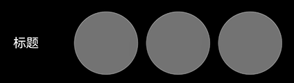

# 沉浸光感
<!--Kit: ArkUI-->
<!--Subsystem: ArkUI-->
<!--Owner: @H-xinwei-->
<!--Designer: @zhanghaibo0-->
<!--Tester: @lxl007-->
<!--Adviser: @Brilliantry_Rui-->

从API版本26.0.0开始，新增沉浸光感。沉浸光感是ArkUI提供的一套高品质视觉与动效体系，通过沉浸式系统材质（[ImmersiveMaterial](../reference/apis-arkui/arkts-apis-uimaterial.md#immersivematerial)）与空间动效的结合，为应用组件带来通透、精致的视觉表现。沉浸光感包含两部分能力：

- 沉浸式系统材质：通过影响组件的背景色[backgroundColor](../reference/apis-arkui/arkui-ts/ts-universal-attributes-background.md#backgroundcolor)、边框颜色[borderColor](../reference/apis-arkui/arkui-ts/ts-universal-attributes-border.md#bordercolor)、边框宽度[borderWidth](../reference/apis-arkui/arkui-ts/ts-universal-attributes-border.md#borderwidth)、阴影[shadow](../reference/apis-arkui/arkui-ts/ts-universal-attributes-image-effect.md#shadow)和材质滤镜[materialFilter](../reference/apis-arkui/arkui-ts/ts-universal-attributes-filter-effect.md#materialfilter23)，让组件呈现具有层次感和通透感的视觉表现。
- 空间动效：为部分组件（[Dialog](arkts-base-dialog-overview.md)和[菜单控制](../reference/apis-arkui/arkui-ts/ts-universal-attributes-menu.md)）的弹出过程增添形变、流光等动态表现，使动画更加灵动流畅。

沉浸光感能够自动根据设备的算力档位和用户在系统设置中配置的沉浸光感强弱，自适应地调整沉浸式系统材质和动效的表现程度，使应用在不同档位的设备上都能呈现最佳效果。

沉浸光感开发过程中的常见问题及解决措施，请参见[沉浸光感常见问题](arkts-immersive-light-sense-faq.md)。

## 沉浸式系统材质

沉浸式系统材质（[ImmersiveMaterial](../reference/apis-arkui/arkts-apis-uimaterial.md#immersivematerial)）是ArkUI提供的一种新型材质对象，可以通过[systemMaterial](../reference/apis-arkui/arkui-ts/ts-universal-attributes-image-effect.md#systemmaterial)接口、传入[ImmersiveOptions](../reference/apis-arkui/arkts-apis-uimaterial.md#immersiveoptions)参数，设置组件的系统材质，设置后会自动影响组件的背景色[backgroundColor](../reference/apis-arkui/arkui-ts/ts-universal-attributes-background.md#backgroundcolor)、边框颜色[borderColor](../reference/apis-arkui/arkui-ts/ts-universal-attributes-border.md#bordercolor)、边框宽度[borderWidth](../reference/apis-arkui/arkui-ts/ts-universal-attributes-border.md#borderwidth)、阴影[shadow](../reference/apis-arkui/arkui-ts/ts-universal-attributes-image-effect.md#shadow)和材质滤镜[materialFilter](../reference/apis-arkui/arkui-ts/ts-universal-attributes-filter-effect.md#materialfilter23)视觉效果。

沉浸式系统材质提供了五种材质样式[ImmersiveStyle](../reference/apis-arkui/arkts-apis-uimaterial.md#immersivestyle)，从薄到厚分别为：

| 样式 | 说明 | 适用场景 |
| --- | --- | --- |
| ULTRA_THIN | 超薄样式，材质层具有很强的透明效果。 | 需要高度透明的背景，如浮动工具栏。 |
| THIN | 薄样式，材质层具有较强的透明效果。 | 需要较强透明度的场景，如搜索框。 |
| REGULAR | 常规样式，材质层厚度常规。 | 通用场景。 |
| THICK | 厚样式，模糊效果强。 | 需要较强模糊背景的场景，如菜单。 |
| ULTRA_THICK | 超厚样式，模糊效果很强。 | 需要完全模糊背景的场景，如弹窗。 |

此外，沉浸式材质对象还支持配置以下属性：

- [materialColor](../reference/apis-arkui/arkts-apis-uimaterial.md#immersiveoptions)：材质层赋色。对于高算力和中算力设备，若不设置该参数或该参数为undefined，不额外混合纯色效果；若设置该参数为有效颜色值，该参数会为材质滤镜[materialFilter](../reference/apis-arkui/arkui-ts/ts-universal-attributes-filter-effect.md#materialfilter23)再混合一层纯色效果，若该颜色为纯不透明的颜色，会遮挡材质滤镜效果。对于低算力设备，若不设置该参数或该参数为undefined，生效低算力设备材质自带的背景色效果；若设置该参数为有效颜色值，该参数作为背景色[backgroundColor](../reference/apis-arkui/arkui-ts/ts-universal-attributes-background.md#backgroundcolor)属性值。
- [colorInvert](../reference/apis-arkui/arkts-apis-uimaterial.md#immersiveoptions)：设置了材质对象的节点的子树是否自动适配材质到背景色的反色。只有材质参数足够薄时才会自动反色。
- [applyShadow](../reference/apis-arkui/arkts-apis-uimaterial.md#immersiveoptions)：是否添加材质的阴影效果。当该参数为true时，材质中的阴影效果固定生效，优先于[shadow](../reference/apis-arkui/arkui-ts/ts-universal-attributes-image-effect.md#shadow)通用属性。当该参数为false时，[shadow](../reference/apis-arkui/arkui-ts/ts-universal-attributes-image-effect.md#shadow)通用属性生效，材质的阴影效果不生效。
- [interactive](../reference/apis-arkui/arkts-apis-uimaterial.md#immersiveoptions)：是否为设置材质的组件设置交互形变效果，启用后组件在按压时产生弹性形变。
- [lightEffect](../reference/apis-arkui/arkts-apis-uimaterial.md#immersiveoptions)：是否为设置材质的组件设置光感交互反馈效果。

## 亮点特征

- **高端精致的视觉品质**：沉浸光感通过材质滤镜[materialFilter](../reference/apis-arkui/arkui-ts/ts-universal-attributes-filter-effect.md#materialfilter23)、高光、阴影等多层效果叠加，为组件带来远超纯色背景的高端视觉表现，让应用界面更具质感。

- **自适应设备能力**：沉浸光感会根据设备算力自动调整效果表现，高算力设备呈现完整效果，中低算力设备自动降级，无需开发者手动适配，确保应用在各类设备上流畅运行。

- **极简接入**：通过应用级开关即可一键开启沉浸光感，[Dialog](arkts-base-dialog-overview.md)、[菜单控制](../reference/apis-arkui/arkui-ts/ts-universal-attributes-menu.md)、[Chip](../reference/apis-arkui/arkui-ts/ohos-arkui-advanced-Chip.md)等组件默认支持，无需额外代码改动即可获得高品质视觉效果。支持应用级开启的完整组件清单请参见[MaterialState](../reference/apis-arkui/arkts-apis-uimaterial.md#materialstate)。

- **深浅色自适应**：沉浸式系统材质能够根据系统的深浅色模式自动展现不同的效果，无需开发者额外处理。

- **智能反色保障可读性**：通过自动反色能力，当材质足够透明时，组件内的文字颜色会自动适配背景色，确保在任何场景下都具有良好的阅读体验。

- **丰富的交互反馈**：支持交互形变（[interactive](../reference/apis-arkui/arkts-apis-uimaterial.md#immersiveoptions)）和光感交互反馈（[lightEffect](../reference/apis-arkui/arkts-apis-uimaterial.md#immersiveoptions)），让用户的每一次交互都有细腻的视觉回馈。

## 开启沉浸光感

为组件接入沉浸式系统材质分为**应用级**和**组件级**两种方式，二者关系如下：

- **应用级**：通过[module.json5](../quick-start/module-configuration-file.md)配置全局开关，决定哪些组件"默认开启"材质，以及是否全局禁用。它只影响"默认开启"的组件范围，不影响开发者主动通过systemMaterial设置的材质（DISABLE模式除外），详见下文[应用级开启](#应用级开启)。

- **组件级**：通过[systemMaterial](../reference/apis-arkui/arkui-ts/ts-universal-attributes-image-effect.md#systemmaterial)通用属性，或弹窗类组件options参数中的systemMaterial字段，为单个组件设置材质。除DISABLE模式外，无需任何全局配置即可生效，是给指定组件加材质最直接的方式，详见下文[组件级开启](#组件级开启)。

> **说明：**
>
> 如果只想给某一个组件加上沉浸式系统材质，直接使用组件级方式即可，无需配置[module.json5](../quick-start/module-configuration-file.md)。应用级配置主要用于让一类组件批量默认开启材质，或全局禁用材质。

### 应用级开启

应用级开启指通过module.json5统一控制应用内支持沉浸式系统材质的组件是否默认开启系统材质。支持应用级沉浸式系统材质的组件包括：[弹出框Dialog](arkts-base-dialog-overview.md)、[即时反馈（Toast）](arkts-create-toast.md)、[AlphabetIndexer](../reference/apis-arkui/arkui-ts/ts-container-alphabet-indexer.md)、[ChipGroup](../reference/apis-arkui/arkui-ts/ohos-arkui-advanced-ChipGroup.md)、[Chip](../reference/apis-arkui/arkui-ts/ohos-arkui-advanced-Chip.md)、[Select](../reference/apis-arkui/arkui-ts/ts-basic-components-select.md)、[菜单控制](../reference/apis-arkui/arkui-ts/ts-universal-attributes-menu.md)、[Toggle](../reference/apis-arkui/arkui-ts/ts-basic-components-toggle.md)、[SegmentButton](../reference/apis-arkui/arkui-ts/ohos-arkui-advanced-SegmentButton.md)、[SegmentButtonV2](../reference/apis-arkui/arkui-ts/ohos-arkui-advanced-SegmentButtonV2.md)、[Slider](../reference/apis-arkui/arkui-ts/ts-basic-components-slider.md)、[SelectionMenu](../reference/apis-arkui/arkui-ts/ohos-arkui-advanced-SelectionMenu.md)、[Text](../reference/apis-arkui/arkui-ts/ts-basic-components-text.md)（设置[copyOption](../reference/apis-arkui/arkui-ts/ts-basic-components-text.md#copyoption9)后长按或双击触发的文本菜单）。

其中，name字段需为"ohos.arkui.UIMaterial.state"，value字段可以为default、enable和disable。使用此能力前，需要确保应用的[targetAPIVersion](../quick-start/app-configuration-file.md)不低于26.0.0。该配置仅在entry类型的module中生效。

以下示例展示如何在[module.json5](../quick-start/module-configuration-file.md)中配置enable模式：

<!-- @[MaterialStateConfig](https://gitcode.com/openharmony/applications_app_samples/blob/master/code/DocsSample/ArkUISample/ImmersiveLightSense/entry/src/main/module.json5) -->

``` JSON5
{
  "module": {
    "name": "entry",
    "type": "entry",
    // ...
    "metadata": [{
      "name": "ohos.arkui.UIMaterial.state",
      "value": "enable"
    }],
    // ...
  }
}
```

[MaterialState](../reference/apis-arkui/arkts-apis-uimaterial.md#materialstate)提供应用级沉浸式系统材质配置的三种状态DEFAULT、ENABLE和DISABLE，分别对应json5配置中default、enable和disable三个value值。开发者可以通过[uiMaterial.getMaterialInfo()](../reference/apis-arkui/arkts-apis-uimaterial.md#uimaterialgetmaterialinfo)获取当前应用的材质配置状态（即MaterialState），并根据配置状态决定组件行为。

以下示例展示如何通过配置[MaterialState](../reference/apis-arkui/arkts-apis-uimaterial.md#materialstate)调整组件系统材质行为：在DEFAULT和ENABLE模式下，均可通过[systemMaterial](../reference/apis-arkui/arkui-ts/ts-universal-attributes-image-effect.md#systemmaterial)通用属性为[Button](../reference/apis-arkui/arkui-ts/ts-basic-components-button.md)等组件主动设置沉浸式系统材质（DISABLE模式下主动设置不生效）；此外，ENABLE模式下[Select](../reference/apis-arkui/arkui-ts/ts-basic-components-select.md)等组件会默认开启沉浸式系统材质，且材质样式的优先级高于组件自身的背景色、模糊、阴影和边框。如需单独关闭某个已默认开启材质的组件，可设置[uiMaterial.Material.empty](../reference/apis-arkui/arkts-apis-uimaterial.md#empty)。

<!-- @[MaterialInfo](https://gitcode.com/openharmony/applications_app_samples/blob/master/code/DocsSample/ArkUISample/ImmersiveLightSense/entry/src/main/ets/pages/immersiveLightSense/MaterialInfo.ets) --> 

``` TypeScript
import { uiMaterial } from '@kit.ArkUI';

@Entry
@Component
struct MaterialInfoPage {
  private info: uiMaterial.MaterialInfo = uiMaterial.getMaterialInfo();

  build() {
    Column() {
      Text(`MaterialState: ${this.info.state}`)
        .fontSize(16)
        .margin({ bottom: 10 })
      Text(`MaterialType: ${this.info.type}`)
        .fontSize(16)
        .margin({ bottom: 20 })

      if (this.info.state === uiMaterial.MaterialState.ENABLE) {
        Button('使用沉浸式系统材质')
          .backgroundColor(Color.Transparent)
          .systemMaterial(new uiMaterial.ImmersiveMaterial({
            style: uiMaterial.ImmersiveStyle.ULTRA_THIN
          }))
          .fontColor(Color.Blue)
          .margin({ bottom: 10 })

        // Select组件默认开启沉浸式系统材质
        Select([{ value: '选项1' }, { value: '选项2' }])
          .value('选择')
          .margin({ bottom: 10 })

        // 单独关闭Select的沉浸式系统材质
        Select([{ value: '选项1' }, { value: '选项2' }])
          .value('选择（已关闭材质）')
          .systemMaterial(uiMaterial.Material.empty)
          // .menuSystemMaterial(uiMaterial.Material.empty)
      }
    }
    .width('100%')
    .height('100%')
    .justifyContent(FlexAlign.Center)
    // 请替换为实际资源文件
    .backgroundImage($r('app.media.img'))
    .backgroundImageSize(ImageSize.FILL)
  }
}
```


### 组件级开启

除了应用级开关，开发者还可以在组件级别精细控制沉浸式系统材质的开启。根据组件类型的不同，设置方式分为通过通用属性设置和通过独有接口设置两类。

1. 通过通用属性设置。
   
   所有支持通用属性的组件，均支持通过[systemMaterial](../reference/apis-arkui/arkui-ts/ts-universal-attributes-image-effect.md#systemmaterial)通用属性设置沉浸式系统材质。
   
   **Column组件示例**
   
   以下以Column组件作为示例，介绍如何通过通用属性开启沉浸式系统材质。
   
   <!-- @[ColumnMaterial](https://gitcode.com/openharmony/applications_app_samples/blob/master/code/DocsSample/ArkUISample/ImmersiveLightSense/entry/src/main/ets/pages/immersiveLightSense/ColumnMaterial.ets) -->
   
   ``` TypeScript
   import { uiMaterial } from '@kit.ArkUI';
   
   @Entry
   @Component
   struct ColumnMaterialPage {
     build() {
       Column() {
         Column() {
           Text('沉浸光感')
         }
         .width(328)
         .height(56)
         .borderRadius(28)
         .justifyContent(FlexAlign.Center)
         .systemMaterial(new uiMaterial.ImmersiveMaterial({
           style: uiMaterial.ImmersiveStyle.ULTRA_THIN,
         }))
       }
       .width('100%')
       .height('100%')
       .justifyContent(FlexAlign.Center)
       // 请替换为实际资源文件
       .backgroundImage($r('app.media.img'))
       .backgroundImageSize(ImageSize.FILL)
     }
   }
   ```
   
   
   
   **Column交互形变示例**
   
   以下示例为[Column](../reference/apis-arkui/arkui-ts/ts-container-column.md)组件同时设置ULTRA_THIN样式和[interactive](../reference/apis-arkui/arkts-apis-uimaterial.md#immersiveoptions)交互形变效果，用户按压时组件会产生弹性形变，松手后自动恢复，增强交互的视觉反馈。
   
   <!-- @[ButtonInteractive](https://gitcode.com/openharmony/applications_app_samples/blob/master/code/DocsSample/ArkUISample/ImmersiveLightSense/entry/src/main/ets/pages/immersiveLightSense/ButtonInteractive.ets) -->
   
   ``` TypeScript
   import { uiMaterial } from '@kit.ArkUI'
   
   @Entry
   @Component
   struct ButtonInteractivePage {
     build() {
       Stack() {
         // 请替换为实际资源文件
         Image($r('app.media.img'))
           .width('100%')
           .height('100%')
         Column() {
           Column() {
             Text('Context')
           }
           .margin({ bottom: 100 })
           .width(248)
           .height(56)
           .borderRadius(28)
           .justifyContent(FlexAlign.Center)
           .alignItems(HorizontalAlign.Center)
           .systemMaterial(new uiMaterial.ImmersiveMaterial({
             style: uiMaterial.ImmersiveStyle.ULTRA_THIN,
             interactive: true,
           }))
         }.height('100%').width('100%').justifyContent(FlexAlign.Center)
       }
     }
   }
   ```
   
   
   
   **光感交互反馈示例**
   
   以下示例为一组圆形Row组件同时开启[interactive](../reference/apis-arkui/arkts-apis-uimaterial.md#immersiveoptions)交互形变和[lightEffect](../reference/apis-arkui/arkts-apis-uimaterial.md#immersiveoptions)光感交互反馈，用户手指触摸组件时会产生流光跟随效果，按压时产生弹性形变。其中，lightEffect传入有效对象即启用光感交互反馈，传入null或undefined则不启用；对象中的color字段自定义流光颜色，默认值为Color.White，示例中lightEffect: { color: undefined }表示启用光感交互反馈并使用默认颜色。
   
   <!-- @[LightEffect](https://gitcode.com/openharmony/applications_app_samples/blob/master/code/DocsSample/ArkUISample/ImmersiveLightSense/entry/src/main/ets/pages/immersiveLightSense/LightEffect.ets) -->
   
   ``` TypeScript
   import { uiMaterial } from '@kit.ArkUI';
   
   @Entry
   @Component
   struct LightEffectPage {
     @State itemsKey: number[] = [0, 1, 2];
     @State circleRadius: number = 40;
     @State spaceValue: number = 10;
     @State myMaterial: uiMaterial.Material = new uiMaterial.ImmersiveMaterial({
       style: uiMaterial.ImmersiveStyle.ULTRA_THIN,
       interactive: true,
       lightEffect: { color: undefined },
     });
   
     build() {
       Column() {
         Row() {
           Text('标题')
             .flexGrow(2)
             .fontColor(Color.White)
           Row({ space: this.spaceValue }) {
             ForEach(this.itemsKey, (item: number, index: number) => {
               Row()
                 .width(this.circleRadius * 2)
                 .height(this.circleRadius * 2)
                 .borderRadius(this.circleRadius)
                 .systemMaterial(this.myMaterial)
             })
           }
         }
         .justifyContent(FlexAlign.End)
         .backgroundColor(Color.Black)
         .width('100%')
         .padding(20)
       }
       .height('100%')
       .width('100%')
     }
   }
   ```
   
   

2. 通过组件独有接口设置。

   弹窗类组件支持通过设置自身的systemMaterial属性开启沉浸式系统材质。
   
   **Toast示例**
   
   以下示例通过showToast的[ShowToastOptions](../reference/apis-arkui/js-apis-promptAction.md#showtoastoptions)参数设置THIN样式的沉浸式系统材质，Toast弹出时会呈现带有材质效果的半透明背景。未主动设置systemMaterial时，Toast默认采用style为THICK的材质，本示例将其改为THIN以展示更通透的效果。
   
   <!-- @[ToastMaterial](https://gitcode.com/openharmony/applications_app_samples/blob/master/code/DocsSample/ArkUISample/ImmersiveLightSense/entry/src/main/ets/pages/immersiveLightSense/ToastMaterial.ets) -->
   
   ``` TypeScript
   import { PromptAction, uiMaterial } from '@kit.ArkUI';
   import { BusinessError } from '@kit.BasicServicesKit';
   
   @Entry
   @Component
   struct ToastMaterialPage {
     promptAction: PromptAction = this.getUIContext().getPromptAction();
   
     build() {
       Column() {
         Button('showToast')
           .position({ x: 125, y: 300 })
           .onClick(() => {
             try {
               this.promptAction.showToast({
                 message: 'Message Info',
                 duration: 2000,
                 // 控制是否设置系统材质
                 systemMaterial: new uiMaterial.ImmersiveMaterial({
                   style: uiMaterial.ImmersiveStyle.THIN
                 })
               });
             } catch (error) {
               let message = (error as BusinessError).message;
               let code = (error as BusinessError).code;
               console.error(`showToast args error code is ${code}, message is ${message}`);
             };
           })
       }
       .width('100%')
       .height('100%')
       // 请开发者替换为实际资源文件
       .backgroundImage($r('app.media.img'))
       .backgroundImageSize({ width: '100%', height: '100%' })
     }
   }
   ```
   
   未设置系统材质时：
   
   
   
   设置系统材质后：
   
   
   
   **Popup示例**
   
   以下示例通过bindPopup的[PopupOptions](../reference/apis-arkui/arkui-ts/ts-universal-attributes-popup.md#popupoptions类型说明)参数设置THIN样式的沉浸式系统材质，气泡弹窗会呈现带有材质效果的半透明背景。
   
   <!-- @[PopupMaterial](https://gitcode.com/openharmony/applications_app_samples/blob/master/code/DocsSample/ArkUISample/ImmersiveLightSense/entry/src/main/ets/pages/immersiveLightSense/PopupMaterial.ets) -->
   
   ``` TypeScript
   import { uiMaterial } from '@kit.ArkUI';
   
   @Entry
   @Component
   struct PopupMaterialPage {
     @State handlePopup: boolean = false;
   
     build() {
       Flex({ direction: FlexDirection.Column }) {
         Button('PopupOptions')
           .onClick(() => {
             this.handlePopup = !this.handlePopup
           })
           .bindPopup(this.handlePopup!!, {
             message: 'This is a popup with PopupOptions',
             placement: Placement.Top,
             // 控制是否设置系统材质
             systemMaterial: new uiMaterial.ImmersiveMaterial({
               style: uiMaterial.ImmersiveStyle.THIN
             })
           })
           .position({ x: 100, y: 300 })
       }.width('100%')
       // 请开发者替换为实际资源文件
       .backgroundImage($r('app.media.img'))
       .backgroundImageSize({ width: '100%', height: '100%' })
     }
   }
   ```
   
   未设置系统材质时：
   
   
   
   设置系统材质后：
   
   
   
   **Tips示例**
   
   以下示例通过bindTips的[TipsOptions](../reference/apis-arkui/arkui-ts/ts-universal-attributes-tips.md#tipsoptions类型说明)参数设置THIN样式的沉浸式系统材质，悬浮提示会呈现带有材质效果的半透明背景。
   
   <!-- @[TipsMaterial](https://gitcode.com/openharmony/applications_app_samples/blob/master/code/DocsSample/ArkUISample/ImmersiveLightSense/entry/src/main/ets/pages/immersiveLightSense/TipsMaterial.ets) -->
   
   ``` TypeScript
   import { uiMaterial } from '@kit.ArkUI';
   
   @Entry
   @Component
   struct TipsMaterialPage {
     build() {
       Flex({ direction: FlexDirection.Column }) {
         Button('Hover Tips')
           .bindTips('悬浮气泡测试', {
             // 控制是否设置系统材质
             systemMaterial: new uiMaterial.ImmersiveMaterial({
               style: uiMaterial.ImmersiveStyle.THIN
             })
           })
           .position({ x: 100, y: 300 })
       }.width('100%').padding({ top: 5 })
       // 请开发者替换为实际资源文件
       .backgroundImage($r('app.media.img'))
       .backgroundImageSize({ width: '100%', height: '100%' })
     }
   }
   ```
   
   未设置系统材质时：
   
   
   
   设置系统材质后：
   
   
   
   **bindSheet示例**
   
   以下示例通过bindSheet的[SheetOptions](../reference/apis-arkui/arkui-ts/ts-universal-attributes-sheet-transition.md#sheetoptions)参数设置THICK样式的沉浸式系统材质，半模态页面会呈现带有模糊和材质效果的背景。
   
   <!-- @[SheetMaterial](https://gitcode.com/openharmony/applications_app_samples/blob/master/code/DocsSample/ArkUISample/ImmersiveLightSense/entry/src/main/ets/pages/immersiveLightSense/SheetMaterial.ets) -->
   
   ``` TypeScript
   import { uiMaterial } from '@kit.ArkUI';
   
   @Entry
   @Component
   struct SheetMaterialPage {
     @State isShow: boolean = false;
     @State sheetHeight: number = 300;
     @State myMaterial: SystemUiMaterial | undefined = new uiMaterial.ImmersiveMaterial({
       style: uiMaterial.ImmersiveStyle.ULTRA_THICK,
     });
   
     @Builder
     myBuilder() {
       Column({ space: 10 }) {
         Text('Text')
           .fontSize(20)
           .margin(10)
       }
       .width('100%')
       .height('100%')
     }
   
     build() {
       Stack() {
         // 请开发者替换为实际资源文件
         Image($r('app.media.startIcon'))
           .width('100%')
           .height('100%')
         Column() {
           Button('open Sheet')
             .onClick(() => {
               this.isShow = true;
             })
             .fontSize(20)
             .margin(10)
             .bindSheet($$this.isShow, this.myBuilder(), {
               height: this.sheetHeight,
               backgroundColor: Color.Transparent,
               systemMaterial: this.myMaterial // 从API版本26.0.0开始，新增systemMaterial属性
             })
         }
         .justifyContent(FlexAlign.Center)
         .width('100%')
         .height('100%')
       }
     }
   }
   ```
   
   
   
   **menu示例**
   
   以下示例通过bindMenu的[MenuOptions](../reference/apis-arkui/arkui-ts/ts-universal-attributes-menu.md#menuoptions10)参数设置THICK样式的沉浸式系统材质，弹出菜单会呈现带有材质效果的背景以及弹出动效。
   
   <!-- @[MenuMaterial](https://gitcode.com/openharmony/applications_app_samples/blob/master/code/DocsSample/ArkUISample/ImmersiveLightSense/entry/src/main/ets/pages/immersiveLightSense/MenuMaterial.ets) -->
   
   ``` TypeScript
   import { uiMaterial } from '@kit.ArkUI';
   
   @Entry
   @Component
   struct MenuMaterialPage {
     @Builder
     MyMenu() {
       Menu() {
         MenuItem({ startIcon: $r('app.media.startIcon'), content: '菜单选项' })
         MenuItem({ startIcon: $r('app.media.startIcon'), content: '菜单选项' })
         MenuItem({ startIcon: $r('app.media.startIcon'), content: '菜单选项' })
       }
     }
   
     build() {
       Stack() {
         Button('bindMenu with THICK material')
           .bindMenu(this.MyMenu, {
             systemMaterial: new uiMaterial.ImmersiveMaterial({
               style: uiMaterial.ImmersiveStyle.THICK
             })
           })
       }
       .height('100%')
       .width('100%')
       // 请替换为实际资源文件
       .backgroundImage($r('app.media.img'))
       .backgroundImageSize(ImageSize.Cover)
     }
   }
   ```
   
   未设置系统材质时：
   
   
   
   设置系统材质后：
   
   

3. 关闭组件的沉浸式系统材质。

   在ENABLE模式下，部分组件会默认开启沉浸式系统材质。如需单独关闭某个组件的沉浸式系统材质，可以设置[uiMaterial.Material.empty](../reference/apis-arkui/arkts-apis-uimaterial.md#empty)。

   需要注意的是，[uiMaterial.Material.empty](../reference/apis-arkui/arkts-apis-uimaterial.md#empty)与将systemMaterial属性设置为undefined含义不同：undefined表示恢复为系统默认状态；uiMaterial.Material.empty是显式关闭材质效果。因此，要关闭一个默认开启材质的组件，应使用uiMaterial.Material.empty。

   此外，部分组件的材质由多个独立接口控制。以[Select](../reference/apis-arkui/arkui-ts/ts-basic-components-select.md)为例，其下拉按钮的材质通过[systemMaterial](../reference/apis-arkui/arkui-ts/ts-universal-attributes-image-effect.md#systemmaterial)设置，下拉菜单的材质则通过独立的[menuSystemMaterial](../reference/apis-arkui/arkui-ts/ts-basic-components-select.md#menusystemmaterial)接口设置，两者相互独立、可分别开启或关闭。
   
   <!-- @[CloseMaterial](https://gitcode.com/openharmony/applications_app_samples/blob/master/code/DocsSample/ArkUISample/ImmersiveLightSense/entry/src/main/ets/pages/immersiveLightSense/CloseMaterial.ets) --> 
   
   ``` TypeScript
   import { uiMaterial } from '@kit.ArkUI';
   
   @Entry
   @Component
   struct CloseMaterialPage {
     build() {
       Column() {
         Text('关闭组件沉浸式系统材质')
           .fontSize(20)
           .fontWeight(FontWeight.Bold)
           .margin({ bottom: 30 })
   
         Text('默认开启沉浸式系统材质的Select：')
           .fontSize(16)
           .margin({ bottom: 10 })
   
         // Select组件默认开启沉浸式系统材质
         Select([{ value: '选项1' }, { value: '选项2' }])
           .value('选择')
           .margin({ bottom: 30 })
   
         Text('单独关闭沉浸式系统材质的Select：')
           .fontSize(16)
           .margin({ bottom: 10 })
   
         // 单独关闭Select组件的沉浸式系统材质
         Select([{ value: '选项' }])
           .value('选择')
           .systemMaterial(uiMaterial.Material.empty)
           // .menuSystemMaterial(uiMaterial.Material.empty)
       }
       .width('100%')
       .height('100%')
       .padding(20)
       .justifyContent(FlexAlign.Center)
     }
   }
   ```
   
   如果需要全局禁用所有组件的沉浸式系统材质，可在module.json5中将metadata的value设置为"disable"。

### 开启后的效果

沉浸式系统材质的效果会自动根据以下两个维度进行分档适配：

1. **设备算力档位**：设备算力的高、中、低由芯片决定。在高和中算力设备上，影响材质滤镜[materialFilter](../reference/apis-arkui/arkui-ts/ts-universal-attributes-filter-effect.md#materialfilter23)效果和阴影[shadow](../reference/apis-arkui/arkui-ts/ts-universal-attributes-image-effect.md#shadow)效果。在低算力设备上，影响背景色[backgroundColor](../reference/apis-arkui/arkui-ts/ts-universal-attributes-background.md#backgroundcolor)、边框颜色[borderColor](../reference/apis-arkui/arkui-ts/ts-universal-attributes-border.md#bordercolor)、边框宽度[borderWidth](../reference/apis-arkui/arkui-ts/ts-universal-attributes-border.md#borderwidth)、阴影[shadow](../reference/apis-arkui/arkui-ts/ts-universal-attributes-image-effect.md#shadow)效果。
2. **系统沉浸光感配置**：用户可以在设备的系统设置中选择沉浸光感的强弱，支持强、弱和均衡三档配置。配置为"强"时，材质的光感最为明亮，材质层的模糊、高光、阴影等效果最为丰富，组件呈现最佳的通透感和质感；配置为"弱"时，效果最为精简，仅保留基础的背景色和边框表现；配置为"均衡"时，效果在视觉品质与性能之间取得平衡。

为组件设置了沉浸式系统材质后，在高算力设备上，[Dialog](arkts-base-dialog-overview.md)和[菜单控制](../reference/apis-arkui/arkui-ts/ts-universal-attributes-menu.md)的弹出过程会自动附带形变、流光空间动效，使动画更加灵动流畅。动效无需开发者额外配置，由系统根据设备算力自动决定是否生效，在高算力设备上设置沉浸光感强度为强和均衡；在中算力设备上设置沉浸光感强度为强，自动生效，低算力设备不支持空间动效。

沉浸式系统材质在不同算力设备呈现的效果有差异，以下示例展示不同设备上材质样式的效果。

<!-- @[AllStyles](https://gitcode.com/openharmony/applications_app_samples/blob/master/code/DocsSample/ArkUISample/ImmersiveLightSense/entry/src/main/ets/pages/immersiveLightSense/AllStyles.ets) -->

``` TypeScript
import { uiMaterial } from '@kit.ArkUI';

@Entry
@Component
struct AllStylesPage {
  build() {
    Column() {
      Stack() {
        // 请替换为实际资源文件
        Image($r('app.media.img'))
          .width('100%')
          .height('100%')

        Column({ space: 30 }) {
          Column() {
            Text('ULTRA_THIN')
          }
          .width(328)
          .height(56)
          .borderRadius(28)
          .justifyContent(FlexAlign.Center)
          .alignItems(HorizontalAlign.Center)
          .systemMaterial(new uiMaterial.ImmersiveMaterial({
            style: uiMaterial.ImmersiveStyle.ULTRA_THIN,
          }))

          Column() {
            Text('THIN')
          }
          .width(328)
          .height(56)
          .borderRadius(28)
          .justifyContent(FlexAlign.Center)
          .alignItems(HorizontalAlign.Center)
          .systemMaterial(new uiMaterial.ImmersiveMaterial({
            style: uiMaterial.ImmersiveStyle.THIN,
          }))

          Column() {
            Text('REGULAR')
          }
          .width(328)
          .height(56)
          .borderRadius(28)
          .justifyContent(FlexAlign.Center)
          .alignItems(HorizontalAlign.Center)
          .systemMaterial(new uiMaterial.ImmersiveMaterial({
            style: uiMaterial.ImmersiveStyle.REGULAR,
          }))

          Column() {
            Text('THICK')
          }
          .width(328)
          .height(56)
          .borderRadius(28)
          .justifyContent(FlexAlign.Center)
          .alignItems(HorizontalAlign.Center)
          .systemMaterial(new uiMaterial.ImmersiveMaterial({
            style: uiMaterial.ImmersiveStyle.THICK,
          }))

          Column() {
            Text('ULTRA_THICK')
          }
          .width(328)
          .height(56)
          .borderRadius(28)
          .justifyContent(FlexAlign.Center)
          .alignItems(HorizontalAlign.Center)
          .systemMaterial(new uiMaterial.ImmersiveMaterial({
            style: uiMaterial.ImmersiveStyle.ULTRA_THICK,
          }))
        }
      }
      .height('90%')
      .width('90%')
    }
    .height('100%')
    .width('100%')
    .alignItems(HorizontalAlign.Center)
    .justifyContent(FlexAlign.Center)
  }
}
```

在低算力设备上表现：


在中算力设备上表现：


在高算力设备上表现：


<!-- @[MenuMaterial](https://gitcode.com/openharmony/applications_app_samples/blob/master/code/DocsSample/ArkUISample/ImmersiveLightSense/entry/src/main/ets/pages/immersiveLightSense/MenuMaterial.ets) -->

``` TypeScript
import { uiMaterial } from '@kit.ArkUI';

@Entry
@Component
struct MenuMaterialPage {
  @Builder
  MyMenu() {
    Menu() {
      MenuItem({ startIcon: $r('app.media.startIcon'), content: '菜单选项' })
      MenuItem({ startIcon: $r('app.media.startIcon'), content: '菜单选项' })
      MenuItem({ startIcon: $r('app.media.startIcon'), content: '菜单选项' })
    }
  }

  build() {
    Stack() {
      Button('bindMenu with THICK material')
        .bindMenu(this.MyMenu, {
          systemMaterial: new uiMaterial.ImmersiveMaterial({
            style: uiMaterial.ImmersiveStyle.THICK
          })
        })
    }
    .height('100%')
    .width('100%')
    // 请替换为实际资源文件
    .backgroundImage($r('app.media.img'))
    .backgroundImageSize(ImageSize.Cover)
  }
}
```

沉浸光感设置为强的效果：


沉浸光感设置为弱的效果：


沉浸光感设置为均衡的效果：


## 约束和限制

### 性能与功耗

沉浸式系统材质由材质滤镜、折射、高光、阴影等多层效果叠加而成，不合理的使用会显著增加GPU负载与功耗。在追求视觉效果的同时，建议遵循以下几点，避免引起性能与功耗问题。

1. 避免大面积使用

   材质影响的区域越大，需要处理的像素越多。应避免在单个超大尺寸区域上使用材质，也应避免在大量小区域上重复使用材质；优先将材质限定在需要凸显的卡片、工具栏等局部区域。
   
   ```ts
   // 正例：仅在需要凸显的局部容器上使用材质
   Column() {
     // ...整页内容
     Column() {
       Text('卡片')
     }
     .width(328)
     .height(120)
     .borderRadius(24)
     .systemMaterial(new uiMaterial.ImmersiveMaterial({
       style: uiMaterial.ImmersiveStyle.REGULAR,
     }))
   }
   
   // 反例：整页背景都套上材质，区域过大
   Column() {
     // ...整页内容
   }
   .width('100%')
   .height('100%')
   .systemMaterial(new uiMaterial.ImmersiveMaterial({
     style: uiMaterial.ImmersiveStyle.REGULAR,
   }))
   ```

2. 避免嵌套、层叠多个材质

   材质层叠会导致效果被重复计算，且视觉上相互干扰。同一子树中只需在最外层设置一次材质，内层节点不应再设置。
   
   ```ts
   // 正例：仅在最外层设置一次材质
   Column() {
     Column() {
       Text('内容')
     }
   }
   .systemMaterial(new uiMaterial.ImmersiveMaterial({
     style: uiMaterial.ImmersiveStyle.REGULAR,
   }))
   
   // 反例：外层和内层都设置了材质，相互嵌套
   Column() {
     Column() {
       Text('内容')
     }
     .systemMaterial(new uiMaterial.ImmersiveMaterial({
       style: uiMaterial.ImmersiveStyle.THIN,
     }))
   }
   .systemMaterial(new uiMaterial.ImmersiveMaterial({
     style: uiMaterial.ImmersiveStyle.REGULAR,
   }))
   ```

3. 避免与模糊一起使用

   沉浸式系统材质自带的材质滤镜（materialFilter）已包含背景模糊效果，再叠加backgroundBlurStyle、backgroundEffect等模糊属性属于重复处理，没有必要且增加额外开销。
   
   ```ts
   // 正例：仅使用沉浸式系统材质，由其提供模糊效果
   Column() {
     Text('内容')
   }
   .systemMaterial(new uiMaterial.ImmersiveMaterial({
     style: uiMaterial.ImmersiveStyle.THICK,
   }))
   
   // 反例：同时设置材质与背景模糊，重复处理
   Column() {
     Text('内容')
   }
   .systemMaterial(new uiMaterial.ImmersiveMaterial({
     style: uiMaterial.ImmersiveStyle.THICK,
   }))
   .backgroundBlurStyle(BlurStyle.COMPONENT_THICK)
   ```

4. Dialog与Menu等弹窗的空间动效应控制尺寸

   高算力设备上，沉浸光感强度设置为强和均衡，Dialog、Menu组件默认附带形变、流光等空间动效（参见上文空间动效相关说明）。弹窗面积越大，动效的逐帧绘制开销越高，应避免接近全屏的超大面积Dialog或Menu，保持弹窗尺寸在合理范围。

5. 视频和动图上方避免放置材质

   材质的折射、模糊效果需要实时采样其背后的内容。当背景是视频、动画图片等持续变化的内容时，材质层会被迫逐帧重新采样与计算，开销显著上升。应避免在视频、动图等动态内容上方叠加材质。
   
   ```ts
   // 反例：在视频上方叠加材质，材质需逐帧重算
   Stack() {
     Column() {
       // 视频
     }
       .width('100%')
       .height('100%')
     Column() {
       Text('浮层')
     }
     .systemMaterial(new uiMaterial.ImmersiveMaterial({
       style: uiMaterial.ImmersiveStyle.THIN,
     }))
   }
   ```

6. 避免对材质做长时间的动画

   对设置了材质的区域持续做属性动画（如反复改变尺寸、位置、透明度等），会让材质效果在每一帧重新计算，长时间运行会持续占用GPU。材质区域应尽量保持稳定；如确需动画，应缩短时长并避免无限循环。
   
   ```ts
   // 正例：材质区域保持稳定，不对其做长时间动画
   // 如确需动画，缩短时长且不使用无限循环
   
   // 反例：对材质区域做长时间、无限循环的尺寸动画
   animateTo({ duration: 3000, iterations: -1 }, () => {
     this.boxWidth = 400
   })
   ```

7. 避免为过多组件开启反色

   自动反色（colorInvert）会对材质子树中通过资源接口设置的颜色逐个计算反色。子树越大、参与反色的组件越多，计算量越高。应控制反色的作用范围，避免在包含大量文本、图标的大范围内整体开启反色。
   
   ```ts
   // 正例：缩小反色范围，仅对需要保证可读性的局部区域开启
   Column() {
     // ...多数内容不开启反色
     Column() {
       Text('标题').fontColor($r('app.color.text'))
     }
     .systemMaterial(new uiMaterial.ImmersiveMaterial({
       style: uiMaterial.ImmersiveStyle.THIN,
       colorInvert: true,
     }))
   }
   
   // 反例：在包含大量子项的列表外层开启反色，所有子项颜色都参与计算
   Column() {
     ForEach(this.largeList, (item: string) => {
       Text(item).fontColor($r('app.color.text'))
     })
   }
   .systemMaterial(new uiMaterial.ImmersiveMaterial({
     style: uiMaterial.ImmersiveStyle.THIN,
     colorInvert: true,
   }))
   ```

8. 在滚动列表或频繁回收的列表项中谨慎使用

   滚动过程中，每个材质项背后的内容都在持续变化，材质需要逐帧重新采样背景；可见的材质项越多，开销越大。避免给每个列表项都设置材质。如需列表整体具备材质质感，可在列表外层的稳定容器上设置一次，或仅在少数重点项上使用。
   
   ```ts
   // 正例：不在逐项上设置材质，滚动时无额外材质采样开销
   List() {
     ForEach(this.largeList, (item: string) => {
       ListItem() {
         Text(item)
       }
     })
   }
   
   // 反例：每个ListItem都设置材质，滚动时逐帧重算
   List() {
     ForEach(this.largeList, (item: string) => {
       ListItem() {
         Text(item)
       }
       .systemMaterial(new uiMaterial.ImmersiveMaterial({
         style: uiMaterial.ImmersiveStyle.THIN,
       }))
     })
   }
   ```

9. 运行时不要频繁变更材质参数或材质区域内部结构

   频繁修改style、materialColor等材质参数，或在材质区域内频繁增删子节点，都会触发材质效果重新计算。建议一次性确定材质参数并保持稳定，材质区域内部的子树结构也应尽量稳定。
   
   ```ts
   // 正例：材质参数一次性设置并保持稳定
   new uiMaterial.ImmersiveMaterial({
     style: uiMaterial.ImmersiveStyle.THIN,
     materialColor: '#80FF0000',
   })
   
   // 反例：在定时器中频繁修改材质颜色，反复触发材质重算
   setInterval(() => {
     this.materialColor = this.nextColor()
   }, 100)
   ```

10. 不要为材质额外叠加阴影

    沉浸式系统材质默认已通过applyShadow提供阴影，再额外设置通用shadow属性既与材质效果冲突，又造成重复绘制开销。如需自定义阴影，应将applyShadow置为false后再使用shadow，避免两套效果同时生效。
    
    ```ts
    // 正例：如需自定义阴影，先关闭材质自带阴影（applyShadow:false）
    Column() {
      Text('内容')
    }
    .systemMaterial(new uiMaterial.ImmersiveMaterial({
      style: uiMaterial.ImmersiveStyle.REGULAR,
      applyShadow: false,
    }))
    .shadow({ radius: 20, color: Color.Black })
    
    // 反例：材质（默认applyShadow为true）与自定义阴影同时存在，重复且冲突
    Column() {
      Text('内容')
    }
    .systemMaterial(new uiMaterial.ImmersiveMaterial({
      style: uiMaterial.ImmersiveStyle.REGULAR,
    }))
    .shadow({ radius: 20, color: Color.Black })
    ```

总体原则：把沉浸式系统材质作为一种"稀缺"视觉资源使用——控制面积与层数、远离持续变化的内容、保持材质区域稳定，即可在获得高品质观感的同时将性能与功耗影响降到最低。

### 属性冲突

设置沉浸式系统材质后，会影响组件的显示效果，具体说明参见[沉浸式系统材质](#沉浸式系统材质)。对于通过通用属性[systemMaterial](../reference/apis-arkui/arkui-ts/ts-universal-attributes-image-effect.md#systemmaterial)设置材质的场景，建议将[systemMaterial](../reference/apis-arkui/arkui-ts/ts-universal-attributes-image-effect.md#systemmaterial)放在其他样式属性之后设置，这样可以确保材质效果优先级正确；通过组件options参数设置材质时则无需关注设置顺序。

对于所有设置了沉浸式系统材质的组件，不建议同时设置背景色、背景模糊、阴影和边框样式。在DEFAULT模式下，Dialog、Toast等组件在未设置背景色、模糊参数和阴影参数时会默认开启沉浸式系统材质；如果开发者主动设置了这些属性，则沉浸式系统材质不会默认开启，需要开发者主动通过systemMaterial属性设置。

### 深浅色模式

沉浸式系统材质能够根据系统的深浅色模式自动适配，展现出不同的效果。在浅色模式下，材质呈现明亮通透的效果；在深色模式下，材质呈现沉稳深邃的效果。开发者无需为不同模式分别配置材质参数。

浅色模式下材质效果：


深色模式下材质效果：


### 自动反色

当组件设置为透明度较高的材质（如ULTRA_THIN或THIN）时，组件内的文字可能与背景色对比度不足，导致阅读体验不佳。此时可以开启[ImmersiveOptions](../reference/apis-arkui/arkts-apis-uimaterial.md#immersiveoptions)中的colorInvert自动反色功能。

开启colorInvert后，组件子节点中的文字颜色会自动适配材质到背景色的反色，确保文字始终可读。说明如下：

- 自动反色仅在材质足够薄时生效，材质样式为THIN或ULTRA_THIN。
- 自动反色与系统沉浸光感的强弱配置相关，材质越薄、沉浸光感越强，越容易符合反色要求。
- 自动反色仅对通过资源接口设置的颜色值生效，包括Text组件的[fontColor](../reference/apis-arkui/arkui-ts/ts-basic-components-text.md#fontcolor)，Button组件的[fontColor](../reference/apis-arkui/arkui-ts/ts-basic-components-button.md#fontcolor)，SymbolGlyph组件的[fontColor](../reference/apis-arkui/arkui-ts/ts-basic-components-symbolGlyph.md#fontcolor)，Image组件的[fillColor](../reference/apis-arkui/arkui-ts/ts-basic-components-image.md#fillcolor)，Search组件的[placeholderColor](../reference/apis-arkui/arkui-ts/ts-basic-components-search.md#placeholdercolor)、[fontColor](../reference/apis-arkui/arkui-ts/ts-basic-components-search.md#fontcolor10)、[searchIcon](../reference/apis-arkui/arkui-ts/ts-basic-components-search.md#searchicon10)中的图标颜色、[cancelButton](../reference/apis-arkui/arkui-ts/ts-basic-components-search.md#cancelbutton10)中的图标颜色、[caretStyle](../reference/apis-arkui/arkui-ts/ts-basic-components-search.md#caretstyle10)中的光标颜色，TabContent组件的[tabBar](../reference/apis-arkui/arkui-ts/ts-container-tabcontent.md#tabbar)属性使用[BottomTabBarStyle](../reference/apis-arkui/arkui-ts/ts-container-tabcontent.md#bottomtabbarstyle9)样式时其中的文本和图标颜色，以及Chip、ChipGroup、TextInput、TextArea、SegmentButton、Swiper等组件的颜色属性。完整生效属性清单请参见[colorInvert](../reference/apis-arkui/arkts-apis-uimaterial.md#immersiveoptions)参数说明。

<!-- @[ColorInvert](https://gitcode.com/openharmony/applications_app_samples/blob/master/code/DocsSample/ArkUISample/ImmersiveLightSense/entry/src/main/ets/pages/immersiveLightSense/ColorInvert.ets) -->

``` TypeScript
import { uiMaterial } from '@kit.ArkUI';

@Entry
@Component
struct ColorInvertPage {
  build() {
    Column() {
      Stack() {
        // 请替换为实际资源文件
        Image($r('app.media.img'))
          .width('100%')
          .height('100%')

        Column({ space: 20 }) {
          // 未开启自动反色，文字可能难以辨认
          Column() {
            Text('未开启反色')
              .fontColor(Color.White)
          }
          .width(280)
          .height(56)
          .borderRadius(28)
          .justifyContent(FlexAlign.Center)
          .systemMaterial(new uiMaterial.ImmersiveMaterial({
            style: uiMaterial.ImmersiveStyle.ULTRA_THIN,
            colorInvert: false,
          }))

          // 开启自动反色，文字颜色自动适配背景
          Column() {
            Text('开启反色')
              .fontColor(Color.White)
          }
          .width(280)
          .height(56)
          .borderRadius(28)
          .justifyContent(FlexAlign.Center)
          .systemMaterial(new uiMaterial.ImmersiveMaterial({
            style: uiMaterial.ImmersiveStyle.ULTRA_THIN,
            colorInvert: true,
          }))
        }
      }
      .width('100%')
      .height('100%')
    }
    .width('100%')
    .height('100%')
  }
}
```

反色开启前后对比：


<!--RP1--><!--RP1End-->
