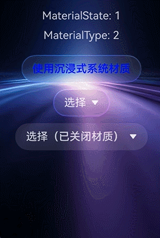
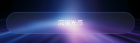
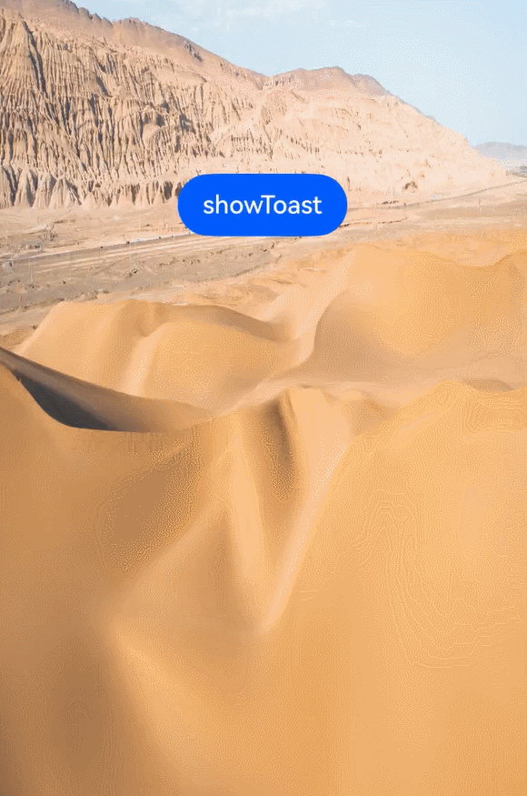
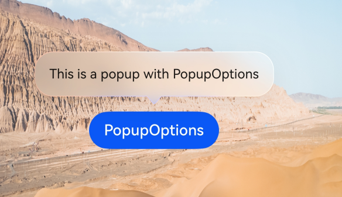
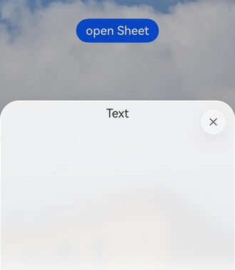
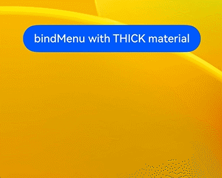
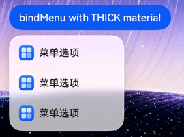
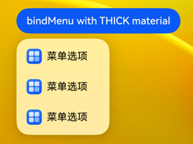
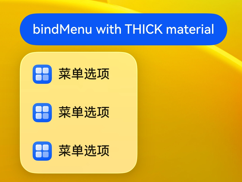
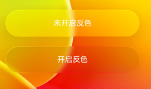

# 沉浸光感
<!--Kit: ArkUI-->
<!--Subsystem: ArkUI-->
<!--Owner: @H-xinwei-->
<!--Designer: @zhanghaibo0-->
<!--Tester: @lxl007-->
<!--Adviser: @Brilliantry_Rui-->

从API版本26.0.0开始，新增沉浸光感。沉浸光感是ArkUI提供的一套高品质视觉与动效体系，通过沉浸式系统材质（[ImmersiveMaterial](../reference/apis-arkui/arkts-apis-uimaterial.md#immersivematerial)）与空间动效的结合，为应用组件带来通透、精致的视觉表现。沉浸光感包含两部分能力：

- 沉浸式系统材质：通过影响组件的背景色[backgroundColor](../reference/apis-arkui/arkui-ts/ts-universal-attributes-background.md#backgroundcolor)、边框颜色[borderColor](../reference/apis-arkui/arkui-ts/ts-universal-attributes-border.md#bordercolor)、边框宽度[borderWidth](../reference/apis-arkui/arkui-ts/ts-universal-attributes-border.md#borderwidth)、阴影[shadow](../reference/apis-arkui/arkui-ts/ts-universal-attributes-image-effect.md#shadow)和材质滤镜[materialFilter](../reference/apis-arkui/arkui-ts/ts-universal-attributes-filter-effect.md#materialfilter23)，让组件呈现具有层次感和通透感的视觉表现。
- 空间动效：为组件的弹出过程增添形变、流光等动态表现，使动画更加灵动流畅。

沉浸光感能够自动根据设备的算力档位和用户在系统设置中配置的沉浸光感强弱，自适应地调整沉浸式系统材质和动效的表现程度，使应用在不同档位的设备上都能呈现最佳效果。

## 沉浸式系统材质

沉浸式系统材质（[ImmersiveMaterial](../reference/apis-arkui/arkts-apis-uimaterial.md#immersivematerial)）是ArkUI提供的一种新型材质对象，可以通过[systemMaterial](../reference/apis-arkui/arkui-ts/ts-universal-attributes-image-effect.md#systemmaterial)接口、传入[ImmersiveOptions](../reference/apis-arkui/arkts-apis-uimaterial.md#immersiveoptions)参数，设置组件的系统材质，设置后会自动影响组件的背景色、边框颜色、边框宽度、阴影和材质滤镜[materialFilter](../reference/apis-arkui/arkui-ts/ts-universal-attributes-filter-effect.md#materialfilter23)视觉效果。

沉浸式系统材质提供了五种材质样式[ImmersiveStyle](../reference/apis-arkui/arkts-apis-uimaterial.md#immersivestyle)，从薄到厚分别为：

| 样式 | 说明 | 适用场景 |
| --- | --- | --- |
| ULTRA_THIN | 超薄样式，材质层具有很强的透明效果。 | 需要高度透明的背景，如浮动工具栏。 |
| THIN | 薄样式，材质层具有较强的透明效果。 | 需要较强透明度的场景，如搜索框。 |
| REGULAR | 常规样式，材质层厚度常规。 | 通用场景。 |
| THICK | 厚样式，模糊效果强。 | 需要较强模糊背景的场景，如菜单。 |
| ULTRA_THICK | 超厚样式，模糊效果很强。 | 需要完全模糊背景的场景，如弹窗。 |

此外，沉浸式材质对象还支持配置以下属性：

- [materialColor](../reference/apis-arkui/arkts-apis-uimaterial.md#immersiveoptions)：材质层赋色，该参数会为材质滤镜[materialFilter](../reference/apis-arkui/arkui-ts/ts-universal-attributes-filter-effect.md#materialfilter23)再混合一层纯色效果。该颜色需要带一定的透明度值，不能为纯不透明的颜色，否则会将材质滤镜[materialFilter](../reference/apis-arkui/arkui-ts/ts-universal-attributes-filter-effect.md#materialfilter23)效果完全遮挡。
- [colorInvert](../reference/apis-arkui/arkts-apis-uimaterial.md#immersiveoptions)：设置了材质对象的节点的子树是否自动适配材质到背景色的反色。只有材质参数足够薄时才会自动反色。
- [applyShadow](../reference/apis-arkui/arkts-apis-uimaterial.md#immersiveoptions)：是否添加材质的阴影效果。当该参数为true时，材质中的阴影效果固定生效，优先于[shadow](../reference/apis-arkui/arkui-ts/ts-universal-attributes-image-effect.md#shadow)通用属性。当该参数为false时，[shadow](../reference/apis-arkui/arkui-ts/ts-universal-attributes-image-effect.md#shadow)通用属性生效，材质的阴影效果不生效。
- [interactive](../reference/apis-arkui/arkts-apis-uimaterial.md#immersiveoptions)：是否为设置材质的组件设置交互形变效果，启用后组件在按压时产生弹性形变。
- [lightEffect](../reference/apis-arkui/arkts-apis-uimaterial.md#immersiveoptions)：是否为设置材质的组件设置光感交互反馈效果。

## 亮点特征

- **高端精致的视觉品质**：沉浸光感通过材质滤镜[materialFilter](../reference/apis-arkui/arkui-ts/ts-universal-attributes-filter-effect.md#materialfilter23)、高光、阴影等多层效果叠加，为组件带来远超纯色背景的高端视觉表现，让应用界面更具质感。

- **自适应设备能力**：沉浸光感会根据设备算力自动调整效果表现，高档设备呈现完整效果，中低档设备自动降级，无需开发者手动适配，确保应用在各类设备上流畅运行。

- **极简接入**：通过应用级开关即可一键开启沉浸光感，Dialog、Menu、Chip等组件默认支持，无需额外代码改动即可获得高品质视觉效果。支持应用级开启的组件清单请参见[MaterialState](../reference/apis-arkui/arkts-apis-uimaterial.md#materialstate)。

- **深浅色自适应**：沉浸式系统材质能够根据系统的深浅色模式自动展现不同的效果，无需开发者额外处理。

- **智能反色保障可读性**：通过自动反色能力，当材质足够透明时，组件内的文字颜色会自动适配背景色，确保在任何场景下都具有良好的阅读体验。

- **丰富的交互反馈**：支持交互形变（[interactive](../reference/apis-arkui/arkts-apis-uimaterial.md#immersiveoptions)）和光感交互反馈（[lightEffect](../reference/apis-arkui/arkts-apis-uimaterial.md#immersiveoptions)），让用户的每一次交互都有细腻的视觉回馈。

## 开启沉浸光感

### 应用级开启

通过在[module.json5](../quick-start/module-configuration-file.md)中配置metadata，可以全局控制应用内沉浸式系统材质的开启状态。其中，name字段需为"ohos.arkui.UIMaterial.state"，value字段可以为default、enable和disable。使用此能力前，需要确保应用的[targetAPIVersion](../quick-start/app-configuration-file.md)不低于26.0.0。该配置仅在entry类型的module中生效。

以下示例展示如何在module.json5中配置enable模式：

<!-- @[MaterialStateConfig](https://gitcode.com/openharmony/applications_app_samples/blob/master/code/DocsSample/ArkUISample/ImmersiveLightSense/entry/src/main/module.json5) -->

``` JSON5
{
  "module": {
    "name": "entry",
    "type": "entry",
    // ...
    "metadata": [{
      "name": "ohos.arkui.UIMaterial.state",
      "value": "enable"
    }],
    // ...
  }
}
```

[MaterialState](../reference/apis-arkui/arkts-apis-uimaterial.md#materialstate)提供应用级沉浸式系统材质配置的三种状态DEFAULT、ENABLE和DISABLE，即对应json5配置中的三个value枚举值。

开发者可以通过[uiMaterial.getMaterialInfo()](../reference/apis-arkui/arkts-apis-uimaterial.md#uimaterialgetmaterialinfo)获取当前应用的材质配置状态，并根据配置状态决定组件行为。

以下示例展示如何通过配置[MaterialState](../reference/apis-arkui/arkts-apis-uimaterial.md#materialstate)调整组件系统材质行为：当配置为ENABLE时，[Button](../reference/apis-arkui/arkui-ts/ts-basic-components-button.md)组件可主动设置沉浸式系统材质，[Select](../reference/apis-arkui/arkui-ts/ts-basic-components-select.md)组件会默认开启沉浸式系统材质；如需单独关闭某个组件的沉浸式系统材质，可设置[uiMaterial.Material.empty](../reference/apis-arkui/arkts-apis-uimaterial.md#empty)。

<!-- @[MaterialInfo](https://gitcode.com/openharmony/applications_app_samples/blob/master/code/DocsSample/ArkUISample/ImmersiveLightSense/entry/src/main/ets/pages/immersiveLightSense/MaterialInfo.ets) -->

``` TypeScript
import { uiMaterial } from '@kit.ArkUI';

@Entry
@Component
struct MaterialInfoPage {
  private info: uiMaterial.MaterialInfo = uiMaterial.getMaterialInfo();

  build() {
    Column() {
      Text(`MaterialState: ${this.info.state}`)
        .fontSize(16)
        .margin({ bottom: 10 })
      Text(`MaterialType: ${this.info.type}`)
        .fontSize(16)
        .margin({ bottom: 20 })

      if (this.info.state === uiMaterial.MaterialState.ENABLE) {
        Button('使用沉浸式系统材质')
          .backgroundColor(Color.Transparent)
          .systemMaterial(new uiMaterial.ImmersiveMaterial({
            style: uiMaterial.ImmersiveStyle.ULTRA_THIN
          }))
          .fontColor(Color.Blue)
          .margin({ bottom: 10 })

        // Select组件默认开启沉浸式系统材质
        Select([{ value: '选项1' }, { value: '选项2' }])
          .value('选择')
          .margin({ bottom: 10 })

        // 单独关闭Select的沉浸式系统材质
        Select([{ value: '选项1' }, { value: '选项2' }])
          .value('选择（已关闭材质）')
          .systemMaterial(uiMaterial.Material.empty)
          // .menuSystemMaterial(uiMaterial.Material.empty)
      }
    }
    .width('100%')
    .height('100%')
    .justifyContent(FlexAlign.Center)
    // 请替换为实际资源文件
    .backgroundImage($r('app.media.img'))
    .backgroundImageSize(ImageSize.FILL)
  }
}
```



### 组件级开启

除了应用级开关，开发者还可以在组件级别精细控制沉浸式系统材质的开启。根据组件类型的不同，设置方式分为通过通用属性设置和通过独有接口设置两类。

1. 通过通用属性设置。
   
   所有支持通用属性的组件，均支持通过[systemMaterial](../reference/apis-arkui/arkui-ts/ts-universal-attributes-image-effect.md#systemmaterial)通用属性设置沉浸式系统材质。
   
   **Column组件示例**
   
   以下以Column组件作为示例，介绍如何通过通用属性开启沉浸式系统材质。
   
   <!-- @[ColumnMaterial](https://gitcode.com/openharmony/applications_app_samples/blob/master/code/DocsSample/ArkUISample/ImmersiveLightSense/entry/src/main/ets/pages/immersiveLightSense/ColumnMaterial.ets) -->
   
   
   
   **Button交互形变示例**
   
   以下示例为[Button](../reference/apis-arkui/arkui-ts/ts-basic-components-button.md)组件同时设置ULTRA_THIN样式和[interactive](../reference/apis-arkui/arkts-apis-uimaterial.md#immersiveoptions)交互形变效果，用户按压按钮时组件会产生弹性形变，松手后自动恢复，增强交互的视觉反馈。
   
   <!-- @[ButtonInteractive](https://gitcode.com/openharmony/applications_app_samples/blob/master/code/DocsSample/ArkUISample/ImmersiveLightSense/entry/src/main/ets/pages/immersiveLightSense/ButtonInteractive.ets) -->
   
   
   
   **光感交互反馈示例**
   
   以下示例为一组圆形Row组件同时开启[interactive](../reference/apis-arkui/arkts-apis-uimaterial.md#immersiveoptions)交互形变和[lightEffect](../reference/apis-arkui/arkts-apis-uimaterial.md#immersiveoptions)光感交互反馈，用户手指触摸组件时会产生流光跟随效果，按压时产生弹性形变。
   
   <!-- @[LightEffect](https://gitcode.com/openharmony/applications_app_samples/blob/master/code/DocsSample/ArkUISample/ImmersiveLightSense/entry/src/main/ets/pages/immersiveLightSense/LightEffect.ets) -->
   
   

2. 通过组件独有接口设置。

   弹窗类组件支持通过设置自身的systemMaterial属性开启沉浸式系统材质。
   
   **Toast示例**
   
   以下示例通过showToast的[ShowToastOptions](../reference/apis-arkui/js-apis-promptAction.md#showtoastoptions)参数设置THIN样式的沉浸式系统材质，Toast弹出时会呈现带有材质效果的半透明背景。
   
   <!-- @[ToastMaterial](https://gitcode.com/openharmony/applications_app_samples/blob/master/code/DocsSample/ArkUISample/ImmersiveLightSense/entry/src/main/ets/pages/immersiveLightSense/ToastMaterial.ets) -->
   
   未设置系统材质时：
   
   
   
   设置系统材质后：
   
   
   
   **Popup示例**
   
   以下示例通过bindPopup的[PopupOptions](../reference/apis-arkui/arkui-ts/ts-universal-attributes-popup.md#popupoptions类型说明)参数设置THIN样式的沉浸式系统材质，气泡弹窗会呈现带有材质效果的半透明背景。
   
   <!-- @[PopupMaterial](https://gitcode.com/openharmony/applications_app_samples/blob/master/code/DocsSample/ArkUISample/ImmersiveLightSense/entry/src/main/ets/pages/immersiveLightSense/PopupMaterial.ets) -->
   
   未设置系统材质时：
   
   
   
   设置系统材质后：
   
   
   
   **Tips示例**
   
   以下示例通过bindTips的[TipsOptions](../reference/apis-arkui/arkui-ts/ts-universal-attributes-tips.md#tipsoptions类型说明)参数设置THIN样式的沉浸式系统材质，悬浮提示会呈现带有材质效果的半透明背景。
   
   <!-- @[TipsMaterial](https://gitcode.com/openharmony/applications_app_samples/blob/master/code/DocsSample/ArkUISample/ImmersiveLightSense/entry/src/main/ets/pages/immersiveLightSense/TipsMaterial.ets) -->
   
   未设置系统材质时：
   
   
   
   设置系统材质后：
   
   
   
   **bindSheet示例**
   
   以下示例通过bindSheet的[SheetOptions](../reference/apis-arkui/arkui-ts/ts-universal-attributes-sheet-transition.md#sheetoptions)参数设置THICK样式的沉浸式系统材质，半模态页面会呈现带有模糊和材质效果的背景。
   
   <!-- @[SheetMaterial](https://gitcode.com/openharmony/applications_app_samples/blob/master/code/DocsSample/ArkUISample/ImmersiveLightSense/entry/src/main/ets/pages/immersiveLightSense/SheetMaterial.ets) -->
   
   
   
   **menu示例**
   
   以下示例通过bindMenu的[MenuOptions](../reference/apis-arkui/arkui-ts/ts-universal-attributes-menu.md#menuoptions10)参数设置THICK样式的沉浸式系统材质，弹出菜单会呈现带有材质效果的背景以及弹出动效。
   
   <!-- @[MenuMaterial](https://gitcode.com/openharmony/applications_app_samples/blob/master/code/DocsSample/ArkUISample/ImmersiveLightSense/entry/src/main/ets/pages/immersiveLightSense/MenuMaterial.ets) -->
   
   未设置系统材质时：
   
   
   
   设置系统材质后：
   
   

3. 关闭组件的沉浸式系统材质。

   在ENABLE模式下，部分组件会默认开启沉浸式系统材质。如需单独关闭某个组件的沉浸式系统材质，可以设置[uiMaterial.Material.empty](../reference/apis-arkui/arkts-apis-uimaterial.md#empty)。
   
   <!-- @[CloseMaterial](https://gitcode.com/openharmony/applications_app_samples/blob/master/code/DocsSample/ArkUISample/ImmersiveLightSense/entry/src/main/ets/pages/immersiveLightSense/CloseMaterial.ets) -->
   
   如果需要全局禁用所有组件的沉浸式系统材质，可在module.json5中将metadata的value设置为"disable"。
   
   <!-- @[MaterialStateConfig](https://gitcode.com/openharmony/applications_app_samples/blob/master/code/DocsSample/ArkUISample/ImmersiveLightSense/entry/src/main/module.json5) -->

### 开启后的效果

沉浸式系统材质的效果会自动根据以下两个维度进行分档适配：

1. **设备算力档位**：设备算力的高、中、低档由芯片决定。在高档和中档算力设备上，影响材质滤镜[materialFilter](../reference/apis-arkui/arkui-ts/ts-universal-attributes-filter-effect.md#materialfilter23)效果和阴影[shadow](../reference/apis-arkui/arkui-ts/ts-universal-attributes-image-effect.md#shadow)效果。在低档算力设备上，影响背景色[backgroundColor](../reference/apis-arkui/arkui-ts/ts-universal-attributes-background.md#backgroundcolor)、边框颜色[borderColor](../reference/apis-arkui/arkui-ts/ts-universal-attributes-border.md#bordercolor)、边框宽度[borderWidth](../reference/apis-arkui/arkui-ts/ts-universal-attributes-border.md#borderwidth)、阴影[shadow](../reference/apis-arkui/arkui-ts/ts-universal-attributes-image-effect.md#shadow)效果。
2. **系统沉浸光感配置**：用户可以在设备的系统设置中选择沉浸光感的强弱，支持强、弱和均衡三档配置。配置为"强"时，材质的光感最为明亮，材质层的模糊、高光、阴影等效果最为丰富，组件呈现最佳的通透感和质感；配置为"弱"时，效果最为精简，仅保留基础的背景色和边框表现；配置为"均衡"时，效果在视觉品质与性能之间取得平衡。

为组件设置了沉浸式系统材质后，在高档算力设备上，组件的弹出和消失过程会自动附带形变、流光等空间动效，使动画更加灵动流畅。动效无需开发者额外配置，由系统根据设备算力自动决定是否生效，在高档算力设备上自动生效，中低档算力设备不支持空间动效。

沉浸式系统材质在不同算力设备呈现的效果有差异，以下示例展示不同设备上材质样式的效果。

<!-- @[AllStyles](https://gitcode.com/openharmony/applications_app_samples/blob/master/code/DocsSample/ArkUISample/ImmersiveLightSense/entry/src/main/ets/pages/immersiveLightSense/AllStyles.ets) -->

在低档算力设备上表现：


在中档算力设备上表现：


在高档算力设备上表现：


<!-- @[MenuMaterial](https://gitcode.com/openharmony/applications_app_samples/blob/master/code/DocsSample/ArkUISample/ImmersiveLightSense/entry/src/main/ets/pages/immersiveLightSense/MenuMaterial.ets) -->

沉浸光感设置为强的效果：



沉浸光感设置为弱的效果：



沉浸光感设置为均衡的效果：



## 沉浸光感支持的组件

沉浸光感为ArkUI组件提供沉浸式系统材质和空间动效能力。当前支持沉浸光感的组件包括：[AlphabetIndexer](../reference/apis-arkui/arkui-ts/ts-container-alphabet-indexer.md)、[bindSheet](../reference/apis-arkui/arkui-ts/ts-universal-attributes-sheet-transition.md#bindsheet)、[Button](../reference/apis-arkui/arkui-ts/ts-basic-components-button.md)、[Chip](../reference/apis-arkui/arkui-ts/ohos-arkui-advanced-Chip.md)/[ChipGroup](../reference/apis-arkui/arkui-ts/ohos-arkui-advanced-ChipGroup.md)、[Dialog](./arkts-base-dialog-overview.md)、[List](../reference/apis-arkui/arkui-ts/ts-container-list.md)、[菜单控制](../reference/apis-arkui/arkui-ts/ts-universal-attributes-menu.md)、[Popup](../reference/apis-arkui/arkui-ts/ts-universal-attributes-popup.md)、[Search](../reference/apis-arkui/arkui-ts/ts-basic-components-search.md)、[Select](../reference/apis-arkui/arkui-ts/ts-basic-components-select.md)、[SegmentButton](../reference/apis-arkui/arkui-ts/ohos-arkui-advanced-SegmentButton.md)、[SelectionMenu](../reference/apis-arkui/arkui-ts/ohos-arkui-advanced-SelectionMenu.md)、[Slider](../reference/apis-arkui/arkui-ts/ts-basic-components-slider.md)、[Tabs](../reference/apis-arkui/arkui-ts/ts-container-tabs.md)、[Toast](./arkts-create-toast.md)、[Toggle](../reference/apis-arkui/arkui-ts/ts-basic-components-toggle.md)。

## 约束和限制

### 属性冲突

设置沉浸式系统材质后，会影响组件的显示效果，具体说明参见[沉浸式系统材质](#沉浸式系统材质)。对于通过通用属性[systemMaterial](../reference/apis-arkui/arkui-ts/ts-universal-attributes-image-effect.md#systemmaterial)设置材质的场景，建议将[systemMaterial](../reference/apis-arkui/arkui-ts/ts-universal-attributes-image-effect.md#systemmaterial)放在其他样式属性之后设置，这样可以确保材质效果优先级正确；通过组件options参数设置材质时则无需关注设置顺序。

对于所有设置了沉浸式系统材质的组件，不建议同时设置背景色、背景模糊、阴影和边框样式。在DEFAULT模式下，Dialog、Toast等组件在未设置背景色、模糊参数和阴影参数时会默认开启沉浸式系统材质；如果开发者主动设置了这些属性，则沉浸式系统材质不会默认开启，需要开发者主动通过systemMaterial属性设置。

### 深浅色模式

沉浸式系统材质能够根据系统的深浅色模式自动适配，展现出不同的效果。在浅色模式下，材质呈现明亮通透的效果；在深色模式下，材质呈现沉稳深邃的效果。开发者无需为不同模式分别配置材质参数。

浅色模式下材质效果：


深色模式下材质效果：


### 自动反色

当组件设置为透明度较高的材质（如ULTRA_THIN或THIN）时，组件内的文字可能与背景色对比度不足，导致阅读体验不佳。此时可以开启[ImmersiveOptions](../reference/apis-arkui/arkts-apis-uimaterial.md#immersiveoptions)中的colorInvert自动反色功能。

开启colorInvert后，组件子节点中的文字颜色会自动适配材质到背景色的反色，确保文字始终可读。说明如下：

- 自动反色仅在材质足够薄时生效，材质样式为THIN或ULTRA_THIN。
- 自动反色与系统沉浸光感的强弱配置相关，材质越薄、沉浸光感越强，越容易符合反色要求。
- 自动反色仅对通过资源接口设置的颜色值生效，包括Text组件的[fontColor](../reference/apis-arkui/arkui-ts/ts-basic-components-text.md#fontcolor)，Button组件的[fontColor](../reference/apis-arkui/arkui-ts/ts-basic-components-button.md#fontcolor)，SymbolGlyph组件的[fontColor](../reference/apis-arkui/arkui-ts/ts-basic-components-symbolGlyph.md#fontcolor)，Image组件的[fillColor](../reference/apis-arkui/arkui-ts/ts-basic-components-image.md#fillcolor)，Search组件的[placeholderColor](../reference/apis-arkui/arkui-ts/ts-basic-components-search.md#placeholdercolor)、[fontColor](../reference/apis-arkui/arkui-ts/ts-basic-components-search.md#fontcolor10)、[searchIcon](../reference/apis-arkui/arkui-ts/ts-basic-components-search.md#searchicon10)中的图标颜色、[cancelButton](../reference/apis-arkui/arkui-ts/ts-basic-components-search.md#cancelbutton10)中的图标颜色、[caretStyle](../reference/apis-arkui/arkui-ts/ts-basic-components-search.md#caretstyle10)中的光标颜色，TabContent组件的[tabBar](../reference/apis-arkui/arkui-ts/ts-container-tabcontent.md#tabbar)属性使用[BottomTabBarStyle](../reference/apis-arkui/arkui-ts/ts-container-tabcontent.md#bottomtabbarstyle9)样式时其中的文本和图标颜色。

<!-- @[ColorInvert](https://gitcode.com/openharmony/applications_app_samples/blob/master/code/DocsSample/ArkUISample/ImmersiveLightSense/entry/src/main/ets/pages/immersiveLightSense/ColorInvert.ets) -->

反色开启前后对比：



<!--RP1-->[ImmersiveLightSense](https://gitcode.com/openharmony/applications_app_samples/tree/master/code/DocsSample/ArkUISample/ImmersiveLightSense)<!--RP1End-->
