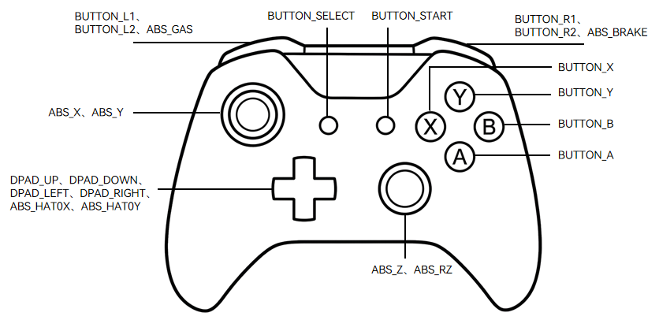
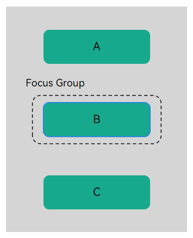
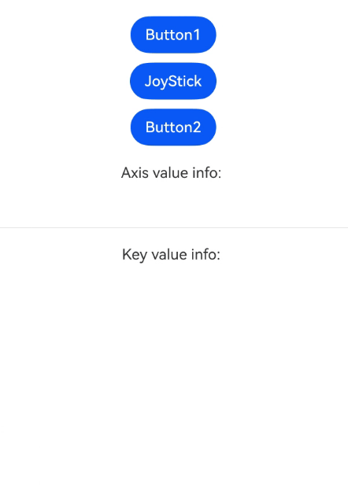

# 支持游戏手柄输入事件
<!--Kit: ArkUI-->
<!--Subsystem: ArkUI-->
<!--Owner: @yihao-lin-->
<!--Designer: @piggyguy-->
<!--Tester: @songyanhong-->
<!--Adviser: @Brilliantry_Rui-->

从API version 15开始，支持使用游戏手柄作为输入设备。当用户使用手柄进行操作时，系统会识别其输入行为并上报为按键事件或焦点轴事件。开发者可以通过注册相应的回调函数，接收并处理这些事件，进而实现与游戏手柄的交互逻辑。

由于不同品牌和型号的手柄在硬件设计与信号输出上存在差异，其上报的键值和轴值可能并不统一，开发者在处理交互逻辑时应注意进行兼容性适配。

下面以常见的游戏手柄为例，说明其按键及操纵杆的常见映射关系：按键通常被映射为离散的键值（方向键有时也可映射为轴值），操纵杆则映射为连续的轴值。[KeyCode](../reference/apis-input-kit/js-apis-keycode.md#keycode)针对游戏手柄提供了可支持的键值，[AxisModel](../reference/apis-arkui/arkui-ts/ts-appendix-enums.md#axismodel15)则提供了可支持的轴值。



## 处理按键输入

游戏手柄的按键输入会被上报为按键事件，其具体处理机制可参考[按键事件数据流](./arkts-interaction-development-guide-keyboard.md#按键事件数据流)。

为响应手柄的按键操作，开发者需要为组件绑定[onKeyEvent](../reference/apis-arkui/arkui-ts/ts-universal-events-key.md#onkeyevent)接口回调。当组件处于获焦状态时，手柄的按键操作会触发此回调，进而处理按键输入的相应逻辑。相关示例如下：
<!-- @[gamepad_common_key](https://gitcode.com/openharmony/applications_app_samples/blob/master/code/DocsSample/ArkUISample/InterAction/entry/src/main/ets/pages/gamepad/CommonKey.ets) -->

``` TypeScript
import { KeyCode } from '@kit.InputKit';

@Entry
@Component
struct CommonKey {
  build() {
    Column() {
      if (canIUse('SystemCapability.MultimodalInput.Input.Core')) {
        Button('JoyStick')
          .defaultFocus(true)
          .onKeyEvent((event: KeyEvent) => {
            if (event && event.type === KeyType.Down) {
              switch (event.keyCode) {
                case KeyCode.KEYCODE_BUTTON_SELECT:
                  console.info('trigger BUTTON_SELECT');
                  // 处理BUTTON_SELECT按键的输入逻辑
                  break;
                case KeyCode.KEYCODE_BUTTON_START:
                  console.info('trigger BUTTON_START');
                  // 处理BUTTON_START按键的输入逻辑
                  break;
                default:
                  console.info('trigger BUTTON_DEFAULT');
                  // 处理其他按键的输入逻辑
                  break;
              }
            }
          })
      }
    }
    .height('100%')
    .width('100%')
    .justifyContent(FlexAlign.Center)
  }
}
```

手柄的方向键输入在触发按键事件时也会带来默认的走焦效果。当开发者仅需利用方向键进行游戏内操作（如控制角色移动、旋转视角等）时，这种默认的走焦行为可能会干扰正常操作。使用焦点组可以解决这一问题。



如图所示，在没有焦点组的情况下，方向键操作会使焦点在组件A、B、C之间自由移动。当使用焦点组容器将特定组件包裹起来时，就可以在该容器内部独立控制焦点行为。通过[focusScopeId](../reference/apis-arkui/arkui-ts/ts-universal-attributes-focus.md#focusscopeid14)可以设置焦点组，并通过设置arrowStepOut参数为false来限制方向键走焦行为，以下示例展示了如何实现这一逻辑：
<!-- @[gamepad_direction_key](https://gitcode.com/openharmony/applications_app_samples/blob/master/code/DocsSample/ArkUISample/InterAction/entry/src/main/ets/pages/gamepad/DirectionKey.ets) -->

``` TypeScript
import { KeyCode } from '@kit.InputKit';

@Entry
@Component
struct DirectionKey {
  build() {
    Column({ space: 10 }) {
      if (canIUse('SystemCapability.MultimodalInput.Input.Core')) {
        Button('Button1')
        Column() {
          Button('JoyStick')
            .defaultFocus(true)
            .onKeyEvent((event: KeyEvent) => {
              if (event && event.type === KeyType.Down) {
                switch (event.keyCode) {
                  case KeyCode.KEYCODE_DPAD_UP:
                  case KeyCode.KEYCODE_DPAD_DOWN:
                  case KeyCode.KEYCODE_DPAD_LEFT:
                  case KeyCode.KEYCODE_DPAD_RIGHT:
                    console.info('trigger direction button');
                    break;
                  default:
                    console.info('trigger other button');
                    break;
                }
              }
            })
        }.focusScopeId('myGroup', true, false)

        Button('Button2')
      }
    }
    .height('100%')
    .width('100%')
    .justifyContent(FlexAlign.Center)
  }
}
```

此时使用方向键进行操作，焦点始终在JoyStick按钮处，方向键走焦行为被屏蔽。

## 处理操纵杆输入

游戏手柄的操纵杆输入会触发焦点轴事件，开发者可以为获焦的组件绑定[onFocusAxisEvent](../reference/apis-arkui/arkui-ts/ts-universal-events-focus_axis.md#onfocusaxisevent)接口回调，处理相应的事件逻辑。示例如下：
<!-- @[gamepad_joystick](https://gitcode.com/openharmony/applications_app_samples/blob/master/code/DocsSample/ArkUISample/InterAction/entry/src/main/ets/pages/gamepad/Joystick.ets) -->

``` TypeScript
@Entry
@Component
struct Joystick {
  build() {
    Column() {
      Button('JoyStick')
        .defaultFocus(true)
        .onFocusAxisEvent((event: FocusAxisEvent) => {
          let absX = event.axisMap.get(AxisModel.ABS_X);
          let absY = event.axisMap.get(AxisModel.ABS_Y);
          let absZ = event.axisMap.get(AxisModel.ABS_Z);
          let absRZ = event.axisMap.get(AxisModel.ABS_RZ);
          let absGas = event.axisMap.get(AxisModel.ABS_GAS);
          let absBrake = event.axisMap.get(AxisModel.ABS_BRAKE);
          // 处理操纵杆输入逻辑
          console.info(`absX: ${absX}, absY: ${absY}, absZ: ${absZ}, absRZ: ${absRZ}, absGas: ${absGas}, absBrake: ${absBrake}`);
        })
    }
    .height('100%')
    .width('100%')
    .justifyContent(FlexAlign.Center)
  }
}
```

## 示例

下面通过一个按键和操纵杆处理的综合示例来展示游戏手柄与应用的交互。
<!-- @[gamepad_sample](https://gitcode.com/openharmony/applications_app_samples/blob/master/code/DocsSample/ArkUISample/InterAction/entry/src/main/ets/pages/gamepad/GamepadSample.ets) -->

``` TypeScript
@Entry
@Component
struct GamepadSample {
  @State keyValue: string = '';
  @State keyEventType: string = '';
  @State axisValue: string = '';

  build() {
    Column({ space: 10 }) {
      Button('Button1')

      Column() {
        Button('JoyStick')
          .defaultFocus(true)
          .onFocusAxisEvent((event: FocusAxisEvent) => {
            let absX = event.axisMap.get(AxisModel.ABS_X);
            let absY = event.axisMap.get(AxisModel.ABS_Y);
            let absZ = event.axisMap.get(AxisModel.ABS_Z);
            let absRz = event.axisMap.get(AxisModel.ABS_RZ);
            let absGas = event.axisMap.get(AxisModel.ABS_GAS);
            let absBrake = event.axisMap.get(AxisModel.ABS_BRAKE);
            let absHat0X = event.axisMap.get(AxisModel.ABS_HAT0X);
            let absHat0Y = event.axisMap.get(AxisModel.ABS_HAT0Y);
            this.axisValue =
              'absX: ' + absX + '\nabsY: ' + absY + '\nabsZ: ' + absZ + '\nabsRz: ' + absRz + '\nabsGas: ' + absGas +
                '\nabsBrake: ' + absBrake + '\nabsHat0X: ' + absHat0X + '\nabsHat0Y: ' + absHat0Y;
          })
          .onKeyEvent((event: KeyEvent) => {
            if (event && event.type === KeyType.Down) {
              this.keyValue =
                'keyCode:' + event.keyCode + '\nkeyText:' + event.keyText + '\nintentionCode:' + event.intentionCode;
            }
          })
      }.focusScopeId('myGroup', true, false)

      Button('Button2')

      Text('Axis value info: ').margin({ top: 10 })
      Column() {
        Text(this.axisValue).padding(15)
      }.width('100%').alignItems(HorizontalAlign.Start).padding({ left: 40 })

      Divider()

      Text('Key value info: ').margin({ top: 10 })
      Column() {
        Text(this.keyValue).padding(15)
      }.width('100%').alignItems(HorizontalAlign.Start).padding({ left: 40 })

    }.height(300).width('100%').margin({ top: 30 })
  }
}
```



运行示例，分别使用游戏手柄进行以下操作：

1. 按压手柄操纵杆，可以观察到焦点轴事件的轴值上报。

2. 按下手柄按键，可以观察到按键事件的键值上报。

3. 使用方向键进行走焦，可以观察到走焦行为被屏蔽。