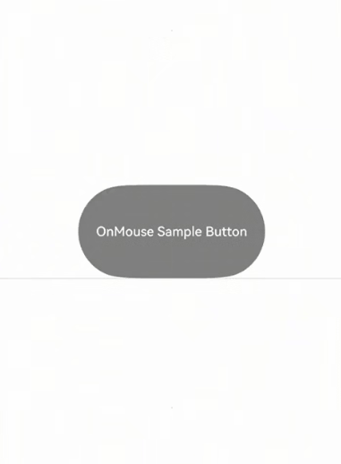
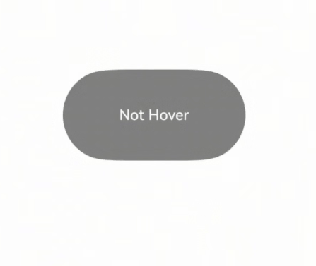
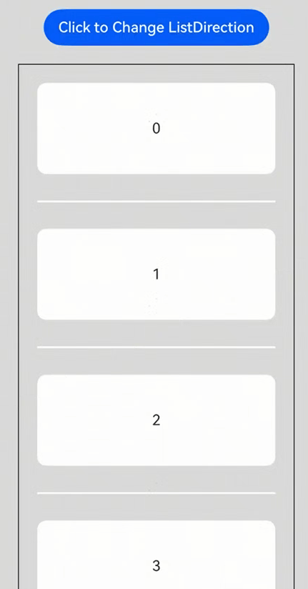

# 支持鼠标输入事件
<!--Kit: ArkUI-->
<!--Subsystem: ArkUI-->
<!--Owner: @jiangtao92-->
<!--Designer: @piggyguy-->
<!--Tester: @songyanhong-->
<!--Adviser: @HelloCrease-->


鼠标设备是2in1类型设备必不可少的输入设备，其特点是可以通过按键达成点击或滑动操作，也可以通过滚轮触发滑动，另外还有一些按键，这些分别通过MouseEvent及AxisEvent上报给应用。

>**说明：**
>
>所有单指可响应的触摸事件/手势事件，均可通过鼠标左键来操作和响应。
> - 例如当我们需要开发单击Button跳转页面的功能、且需要支持手指点击和鼠标左键点击，那么只绑定一个点击事件（onClick）就可以实现该效果；
> - 若需要针对手指和鼠标左键的点击实现不一样的效果，可以在onClick回调中，使用回调参数中的source字段判断当前触发事件的来源是手指还是鼠标。

## 处理鼠标移动

鼠标事件通过onMouse接口注册一个回调来接收，当鼠标事件发生时，会按照鼠标光标所在位置下的组件进行派发，派发过程同样遵循事件冒泡机制。

### onMouse

```ts
onMouse(event: (event?: MouseEvent) => void)
```

鼠标事件回调。每当鼠标指针在绑定该API的组件内产生行为（MouseAction）时，触发事件回调，参数为[MouseEvent](../reference/apis-arkui/arkui-ts/ts-universal-mouse-key.md#mouseevent对象说明)对象，表示触发此次的鼠标事件。该事件支持自定义冒泡设置，默认父子冒泡。常用于开发者自定义的鼠标行为逻辑处理。


开发者可以通过回调中的MouseEvent对象获取触发事件的坐标（displayX/displayY/windowX/windowY/x/y）、按键（[MouseButton](../reference/apis-arkui/arkui-ts/ts-appendix-enums.md#mousebutton8)）、行为（[MouseAction](../reference/apis-arkui/arkui-ts/ts-appendix-enums.md#mouseaction8)）、时间戳（[timestamp](../reference/apis-arkui/arkui-ts/ts-gesture-customize-judge.md#baseevent8)）、交互组件的区域（[EventTarget](../reference/apis-arkui/arkui-ts/ts-universal-events-click.md#eventtarget8)）、事件来源（[SourceType](../reference/apis-arkui/arkui-ts/ts-gesture-settings.md#sourcetype枚举说明8)）等。MouseEvent的回调函数stopPropagation用于设置当前事件是否阻止冒泡。

>**说明：**
>
>按键（MouseButton）的值：Left/Right/Middle/Back/Forward 均对应鼠标上的实体按键，当这些按键被按下或松开时触发这些按键的事件。None表示无按键，会出现在鼠标没有按键按下或松开的状态下，移动鼠标所触发的事件中。

```ts
// xxx.ets
@Entry
@Component
struct MouseExample {
  @State buttonText: string = '';
  @State columnText: string = '';
  @State text: string = 'OnMouse Sample Button';
  @State Color: Color = Color.Gray;

  build() {
    Column() {
      Button(this.text, { type: ButtonType.Capsule })
        .width(200)
        .height(100)
        .backgroundColor(this.Color)
        .onMouse((event?: MouseEvent) => { // 设置Button的onMouse回调
          if (event) {
            this.buttonText = 'Button onMouse:\n' + '' +
              'button = ' + event.button + '\n' +
              'action = ' + event.action + '\n' +
              'x,y = (' + event.x + ',' + event.y + ')' + '\n' +
              'windowXY=(' + event.windowX + ',' + event.windowY + ')';
          }
        })
      Divider()
      Text(this.buttonText).fontColor(Color.Green)
      Divider()
      Text(this.columnText).fontColor(Color.Red)
    }
    .width('100%')
    .height('100%')
    .justifyContent(FlexAlign.Center)
    .borderWidth(2)
    .borderColor(Color.Red)
    .onMouse((event?: MouseEvent) => { // Set the onMouse callback for the column.
      if (event) {
        this.columnText = 'Column onMouse:\n' + '' +
          'button = ' + event.button + '\n' +
          'action = ' + event.action + '\n' +
          'x,y = (' + event.x + ',' + event.y + ')' + '\n' +
          'windowXY=(' + event.windowX + ',' + event.windowY + ')';
      }
    })
  }
}
```

上面的示例中给Button绑定onMouse接口。在回调中，打印出鼠标事件的button/action等回调参数值。同时，在外层的Column容器上，也做相同的设置。整个过程可以分为以下两个动作：

1. 移动鼠标：当鼠标从Button外部移入Button的过程中，仅触发了Column的onMouse回调；当鼠标移入到Button内部后，由于onMouse事件默认是冒泡的，所以此时会同时响应Column的onMouse回调和Button的onMouse回调。此过程中，由于鼠标仅有移动动作没有点击动作，因此打印信息中的button均为0（MouseButton.None的枚举值）、action均为3（MouseAction.Move的枚举值）。

2. 点击鼠标：鼠标进入Button后进行了2次点击，分别是左键点击和右键点击。
   左键点击时：button = 1（MouseButton.Left的枚举值），按下时：action = 1（MouseAction.Press的枚举值），抬起时：action = 2（MouseAction.Release的枚举值）。

   右键点击时：button = 2（MouseButton.Right的枚举值），按下时：action = 1（MouseAction.Press的枚举值），抬起时：action = 2（MouseAction.Release的枚举值）。




如果需要阻止鼠标事件冒泡，可以通过调用stopPropagation方法进行设置。

```ts
// xxx.ets
@Entry
@Component
struct MouseExample {
  @State buttonText: string = '';
  @State columnText: string = '';
  @State text: string = 'OnMouse Sample Button';
  @State Color: Color = Color.Gray;

  build() {
    Column() {
      Button(this.text, { type: ButtonType.Capsule })
        .width(200)
        .height(100)
        .backgroundColor(this.Color)
        .onMouse((event?: MouseEvent) => { // 设置Button的onMouse回调
          if (event) {
            event.stopPropagation(); // 在Button的onMouse事件中设置阻止冒泡
            this.buttonText = 'Button onMouse:\n' + '' +
              'button = ' + event.button + '\n' +
              'action = ' + event.action + '\n' +
              'x,y = ' + '\n' + '(' + event.x + ',' + event.y + ')' + '\n' +
              'windowXY=' + '\n' + '(' + event.windowX + ',' + event.windowY + ')';
          }
        })
      Divider()
      Text(this.buttonText).fontColor(Color.Green)
      Divider()
      Text(this.columnText).fontColor(Color.Red)
    }
    .width('100%')
    .height('100%')
    .justifyContent(FlexAlign.Center)
    .borderWidth(2)
    .borderColor(Color.Red)
    .onMouse((event?: MouseEvent) => { // 设置Column的onMouse回调
      if (event) {
        this.columnText = 'Column onMouse:\n' + '' +
          'button = ' + event.button + '\n' +
          'action = ' + event.action + '\n' +
          'x,y = ' + '\n' + '(' + event.x + ',' + event.y + ')' + '\n' +
          'windowXY=' + '\n' + '(' + event.windowX + ',' + event.windowY + ')';
      }
    })
  }
}
```


在子组件（Button）的onMouse中，通过回调参数event调用stopPropagation回调方法（如下）即可阻止Button子组件的鼠标事件冒泡到父组件Column上。

### onHover

如果需要感知鼠标移入或移出控件范围，建议直接使用高级事件[onHover](../reference/apis-arkui/arkui-ts/ts-universal-events-hover.md#onhover)，建议避免直接处理鼠标move事件，以保持代码简洁。

```ts
onHover(event: (isHover: boolean) => void)
```

悬浮事件回调。参数isHover类型为boolean，表示鼠标进入组件或离开组件。该事件支持自定义冒泡设置，默认父子冒泡。


若组件绑定了该接口，当鼠标指针从组件外部进入到该组件的瞬间会触发事件回调，参数isHover等于true；鼠标指针离开组件的瞬间也会触发该事件回调，参数isHover等于false。


```ts
// xxx.ets
@Entry
@Component
struct MouseExample {
  @State hoverText: string = 'Not Hover';
  @State Color: Color = Color.Gray;

  build() {
    Column() {
      Button(this.hoverText)
        .width(200).height(100)
        .backgroundColor(this.Color)
        .onHover((isHover?: boolean) => { // 使用onHover接口监听鼠标是否悬浮在Button组件上
          if (isHover) {
            this.hoverText = 'Hovered!';
            this.Color = Color.Green;
          }
          else {
            this.hoverText = 'Not Hover';
            this.Color = Color.Gray;
          }
        })
    }.width('100%').height('100%').justifyContent(FlexAlign.Center)
  }
}
```

该示例创建了一个Button组件，初始背景色为灰色，内容为“Not Hover”。示例中的Button组件绑定了onHover回调，在该回调中将this.isHovered变量置为回调参数：isHover。

当鼠标从Button外移动到Button内的瞬间，回调响应，isHover值等于true，isHovered的值变为true，将组件的背景色改成Color.Green，内容变为“Hovered!”。

当鼠标从Button内移动到Button外的瞬间，回调响应，isHover值等于false，又将组件变成了初始的样式。




## 处理鼠标按键

当用户按下鼠标上的按键时，会产生鼠标按下事件，可以通过MouseEvent访问事件的一些重要信息，如发生时间，鼠标按键(MouseButton: 左键/右键等)，也可以通过**getModifierKeyState**接口获取到用户在使用鼠标时，物理键盘上的**ctrl/alt/shift**这几个修饰键的按下状态，可以通过组合判断它们的状态来实现一些便捷操作。

以下是一个通过处理鼠标按键实现快速多选的示例：

```typescript
class ListDataSource implements IDataSource {
  private list: number[] = [];
  private listeners: DataChangeListener[] = [];

  constructor(list: number[]) {
    this.list = list;
  }

  totalCount(): number {
    return this.list.length;
  }

  getData(index: number): number {
    return this.list[index];
  }

  registerDataChangeListener(listener: DataChangeListener): void {
    if (this.listeners.indexOf(listener) < 0) {
      this.listeners.push(listener);
    }
  }

  unregisterDataChangeListener(listener: DataChangeListener): void {
    const pos = this.listeners.indexOf(listener);
    if (pos >= 0) {
      this.listeners.splice(pos, 1);
    }
  }

  // 通知控制器数据删除
  notifyDataDelete(index: number): void {
    this.listeners.forEach(listener => {
      listener.onDataDelete(index);
    });
  }

  // 在指定索引位置删除一个元素
  public deleteItem(index: number): void {
    this.list.splice(index, 1);
    this.notifyDataDelete(index);
  }
}

@Entry
@Component
struct ListExample {
  private arr: ListDataSource = new ListDataSource([0, 1, 2, 3, 4, 5, 6, 7, 8, 9]);
  private allSelectedItems: Array<number> = []
  @State isSelected: boolean[] = []

  @Styles
  selectedStyle(): void {
    .backgroundColor(Color.Green)
  }

  isItemSelected(item: number): boolean {
    for (let i = 0; i < this.allSelectedItems.length; i++) {
      if (this.allSelectedItems[i] == item) {
        this.isSelected[item] = true;
        return true;
      }
    }
    this.isSelected[item] = false;
    return false;
  }

  build() {
    Column() {
      List({ space: 10, initialIndex: 0 }) {
        LazyForEach(this.arr, (index: number) => {
          ListItem() {
            Text('' + index)
              .width('100%')
              .height(100)
              .fontSize(16)
              .fontColor(this.isSelected[index] ? Color.White : Color.Black)
              .textAlign(TextAlign.Center)
          }
          .backgroundColor(Color.White)
          .selectable(true)
          .selected(this.isSelected[index])
          .stateStyles({
            selected: this.selectedStyle
          })
          .onMouse((event: MouseEvent) => {
            // 判断是否按下鼠标左键
            if (event.button == MouseButton.Left && event.action == MouseAction.Press) {
              // 判断之前是否已经时选中状态
              let isSelected: boolean = this.isItemSelected(index)
              // 判断修饰键状态
              let isCtrlPressing: boolean = false
              if (event.getModifierKeyState) {
                isCtrlPressing = event.getModifierKeyState(['Ctrl'])
              }
              // 如果没有按着ctrl键点鼠标，则强制清理掉其他选中的条目并只让当前条目选中
              if (!isCtrlPressing) {
                this.allSelectedItems = []
                for (let i = 0; i < this.isSelected.length; i++) {
                  this.isSelected[i] = false
                }
              }
              if (isSelected) {
                this.allSelectedItems.filter(item => item != index)
                this.isSelected[index] = false
              } else {
                this.allSelectedItems.push(index)
                this.isSelected[index] = true
              }
            }
          })
        }, (item: string) => item)
      }
      .listDirection(Axis.Vertical)
      .scrollBar(BarState.Off)
      .friction(0.6)
      .edgeEffect(EdgeEffect.Spring)
      .width('90%')
    }
    .width('100%')
    .height('100%')
    .backgroundColor(0xDCDCDC)
    .padding({ top: 5 })
  }
}
```


## 处理滚轮

鼠标的滚轮是一种可以产生纵向滚动量的输入设备，当用户滚动鼠标滚轮时，系统会产生纵向[轴事件](../reference/apis-arkui/arkui-ts/ts-universal-events-axis.md)上报，应用可在组件上通过[onAxisEvent](../reference/apis-arkui/arkui-ts/ts-universal-events-axis.md#onaxisevent)接口接收轴事件，轴事件中上报的坐标，为鼠标光标所在的位置，而滚轮上报的角度变化可从[BaseEvent](../reference/apis-arkui/arkui-ts/ts-gesture-customize-judge.md#baseevent8)的axisVertical获得。
鼠标滚轮轴事件的上报，每次都以[AxisAction](../reference/apis-arkui/arkui-ts/ts-appendix-enums.md#axisaction17).BEGIN类型开始，当停止滚动时以[AxisAction](../reference/apis-arkui/arkui-ts/ts-appendix-enums.md#axisaction17).End结束，慢速滚动时，会产生多段的BEGIN、END上报。当你处理axisVertical时，应确保理解它的数值含义与单位，其有以下特点： 
- 上报的数值单位为角度，为单次变化量，非总量。
- 上报数值大小受系统设置中对滚轮放大倍数设置的影响。
- 系统设置中的放大倍数通过AxisEvent中的scrollStep告知。
- 向前滚动，上报数值为负，向后滚动，上报数值为正。

如果使用滚动类组件，对于滚轮的响应，系统内部已实现，不需要额外处理。
如果使用[PanGesture](../reference/apis-arkui/arkui-ts/ts-basic-gestures-pangesture.md)，对于滚轮的响应，此时向前滚动，offsetY的上报数值为正，向后滚动，offsetY的上报数值为负。

> **说明：**
>
> 1. 滚轮产生的纵向轴值，一般情况下只能触发纵向滚动手势，无法触发横向滚动。
> 2. 系统会在发现鼠标指针下只有能够响应横向滚动的组件时，也可以触发横向滚动。
> 3. 但只要指针下有一个可以响应纵向滚动，则会优先处理纵向，不再处理横向。

以下是纵向和横向的List响应滚轮的示例：

```ts
// ListDataSource.ets
export class ListDataSource implements IDataSource {
  private list: number[] = [];
  private listeners: DataChangeListener[] = [];

  constructor(list: number[]) {
    this.list = list;
  }

  totalCount(): number {
    return this.list.length;
  }

  getData(index: number): number {
    return this.list[index];
  }

  registerDataChangeListener(listener: DataChangeListener): void {
    if (this.listeners.indexOf(listener) < 0) {
      this.listeners.push(listener);
    }
  }

  unregisterDataChangeListener(listener: DataChangeListener): void {
    const pos = this.listeners.indexOf(listener);
    if (pos >= 0) {
      this.listeners.splice(pos, 1);
    }
  }

  // 通知控制器数据删除
  notifyDataDelete(index: number): void {
    this.listeners.forEach(listener => {
      listener.onDataDelete(index);
    });
  }

  // 通知控制器添加数据
  notifyDataAdd(index: number): void {
    this.listeners.forEach(listener => {
      listener.onDataAdd(index);
    });
  }

  // 在指定索引位置删除一个元素
  public deleteItem(index: number): void {
    this.list.splice(index, 1);
    this.notifyDataDelete(index);
  }

  // 在指定索引位置插入一个元素
  public insertItem(index: number, data: number): void {
    this.list.splice(index, 0, data);
    this.notifyDataAdd(index);
  }
}
```

```ts
import { ListDataSource } from './ListDataSource';

@Entry
@Component
struct ListExample {
  private arr: ListDataSource = new ListDataSource([0, 1, 2, 3, 4, 5, 6, 7, 8, 9]);
  @State dir1: Axis = Axis.Vertical;

  build() {
    Column() {
      Button('Click to Change ListDirection')
        .margin(20)
        .onClick(() => {
          if (this.dir1 == Axis.Vertical) {
            this.dir1 = Axis.Horizontal
          } else {
            this.dir1 = Axis.Vertical
          }
        })
      List({ space: 20, initialIndex: 0 }) {
        LazyForEach(this.arr, (item: number) => {
          ListItem() {
            Text('' + item)
              .width('100%')
              .height(100)
              .fontSize(16)
              .textAlign(TextAlign.Center)
              .borderRadius(10)
              .backgroundColor(0xFFFFFF)
          }
          .margin(20)
          // 为ListItem绑定滑动手势，当在ListItem上滚动鼠标滚轮时，会优先触发ListItem的滑动手势
          .gesture(PanGesture({ direction: PanDirection.Vertical })
            .onActionStart(() => {
              console.info('Vertical PanGesture start is called');
            })
            .onActionUpdate(() => {
              console.info('Vertical PanGesture update is called');
            }))
        }, (item: number) => item.toString())
      }
      .borderWidth(1)
      .listDirection(this.dir1) // 排列方向
      .scrollBar(BarState.Off)
      .friction(0.6)
      .divider({
        strokeWidth: 2,
        color: 0xFFFFFF,
        startMargin: 20,
        endMargin: 20
      }) // 每行之间的分界线
      .edgeEffect(EdgeEffect.Spring) // 边缘效果设置为Spring
      .width('90%')
    }
    .width('100%')
    .height('100%')
    .backgroundColor(0xDCDCDC)
    .padding(20)
  }
}
```

