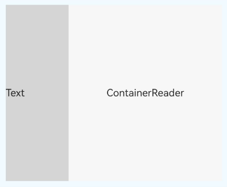
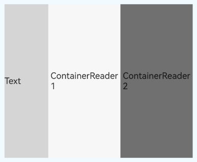
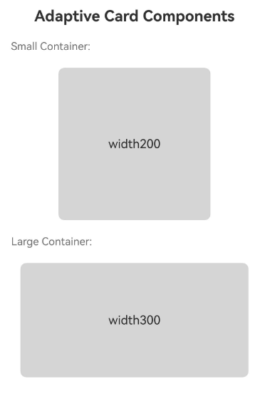
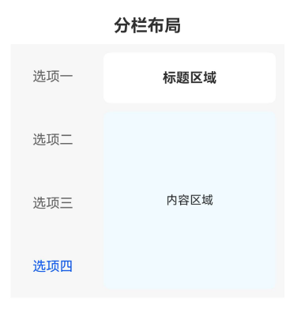
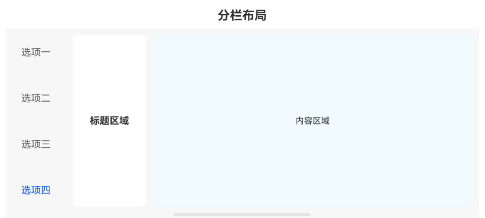

# 容器断点 (ContainerReader)
<!--Kit: ArkUI-->
<!--Subsystem: ArkUI-->
<!--Owner: @song-song-song-->
<!--Designer: @fenglinbailu-->
<!--Tester: @weixin_45530366-->
<!--Adviser: @Brilliantry_Rui-->


容器断点组件[ContainerReader](../reference/apis-arkui/arkui-ts/ts-container-containerreader.md)是ArkUI提供的一种响应式布局解决方案，从API版本26.0.0开始，允许开发者基于容器尺寸而非窗口尺寸实现自适应布局。与传统的窗口断点相比，容器断点提供了更细粒度的布局控制能力，使得组件能够在不同的容器尺寸下呈现不同的布局效果。

ContainerReader在实际开发中常用于[Flex](../reference/apis-arkui/arkui-ts/ts-container-flex.md)、[Row](../reference/apis-arkui/arkui-ts/ts-container-row.md)或[Column](../reference/apis-arkui/arkui-ts/ts-container-column.md)容器内部、[Navigation](../reference/apis-arkui/arkui-ts/ts-basic-components-navigation.md)以及[自定义组件](state-management/arkts-create-custom-components.md)内部场景，提供实时尺寸获取、断点值获取和自定义断点阈值核心功能。

## 能力范围

ContainerReader提供以下关键能力。

- **容器级尺寸感知**：基于组件自身实际尺寸确定断点值，而非窗口尺寸。适用于组件级响应式布局、嵌套布局场景和可复用组件开发。
- **双向绑定实时获取**：通过状态变量实时获取容器尺寸和断点信息。
- **宽度/高度双模式**：同时支持宽度断点和高度断点，满足不同维度的自适应需求。
- **自定义断点阈值**：通过[breakpointConfig](../reference/apis-arkui/arkui-ts/ts-container-containerreader.md#breakpointconfig)属性灵活配置不同尺寸区间对应的布局策略。


## 布局规格

从API版本26.0.0开始，[ContainerReader](../reference/apis-arkui/arkui-ts/ts-container-containerreader.md)组件在不同父容器类型下的布局规格如下。

> **说明：**
> - 当父容器为Flex组件、Row组件或Column组件时，ContainerReader会占满父容器剩余空间，Flex的弹性特性生效优先级不变。
> - 当父容器为其他容器类型时，ContainerReader会撑满父容器。
> - ContainerReader的尺寸由父容器和自身布局确定，不受子组件影响。

| 父容器类型 | 无兄弟节点 | 有兄弟节点 |
| ---------- | ---------- | ---------- |
| Flex、Row、Column | 撑满父容器。 | 撑满父容器剩余空间。 |
| 其他类型组件 | 撑满父组件。 | 撑满父组件。 |


[ContainerReader](../reference/apis-arkui/arkui-ts/ts-container-containerreader.md)作为子组件时，其尺寸由父容器决定。当父容器为Flex、Row或Column时，ContainerReader会根据父容器的布局方向自动撑满父容器剩余空间。

> **说明：** 
>
> 使用ContainerReader需要同时导入ContainerReaderAttribute，否则会导致编译报错。

<!-- @[FillTheSpace](https://gitcode.com/openharmony/applications_app_samples/blob/master/code/DocsSample/ArkUISample/ContainerReader/entry/src/main/ets/pages/layoutSpecifications/FillTheSpace.ets) -->

```ts
import {ContainerReader, ContainerReaderAttribute, Size} from '@kit.ArkUI';
@Entry
@Component
struct Example {
  @State containerSize: Size = { width: 0, height: 0 };
  @State widthBp: WidthBreakpoint = WidthBreakpoint.WIDTH_MD;
  build() {
    Flex({ direction: FlexDirection.Row }) {
      ContainerReader({
        size: this.containerSize!!,
        widthBreakpoint: this.widthBp!!
      }) {
        Column() {
          Text('Adaptive Content')
        }
        .width('100%')
        .height('100%')
      }
      .backgroundColor('#F7F7F7')
    }
    .padding(10)
    .width('100%')
    .height(200)
    .backgroundColor('#D5D5D5')
  }
}
```


[ContainerReader](../reference/apis-arkui/arkui-ts/ts-container-containerreader.md)作为Flex、Row或Column的子组件使用时，会优先为非ContainerReader类型的子组件测算尺寸，再结合父容器剩余空间与开发者设置为ContainerReader组件分配空间。这在固定内容与自适应内容并存的场景中较为适用。

> **说明：** 
>
> 使用ContainerReader需要同时导入ContainerReaderAttribute，否则会导致编译报错。

<!-- @[DivideRemainingSpace](https://gitcode.com/openharmony/applications_app_samples/blob/master/code/DocsSample/ArkUISample/ContainerReader/entry/src/main/ets/pages/layoutSpecifications/DivideRemainingSpace.ets) -->

```ts
import {ContainerReader, ContainerReaderAttribute, Size} from '@kit.ArkUI';
@Entry
@Component
struct Example {
  @State containerSize: Size = { width: 0, height: 0 };
  @State widthBp: WidthBreakpoint = WidthBreakpoint.WIDTH_MD;
  build() {
    Flex({ direction: FlexDirection.Row }) {
      Column() {
        Text('Text')
          .width(100)
          .height('100%')
      }
      .width(100)
      .height('100%')
      .backgroundColor('#D5D5D5')
      ContainerReader({
        size: this.containerSize!!,
        widthBreakpoint: this.widthBp!!
      }) {
        Column() {
          Text('ContainerReader')
        }
        .width('100%')
        .height('100%')
        .justifyContent(FlexAlign.Center)
      }
      .backgroundColor('#F7F7F7')
    }
    .width('100%')
    .height(300)
    .backgroundColor('#F0FAFF')
    .padding(10)
  }
}
```



当Flex、Row或Column容器中有多个[ContainerReader](../reference/apis-arkui/arkui-ts/ts-container-containerreader.md)子组件时，按开发者书写顺序第一个ContainerReader会占满剩余空间，此时其余ContainerReader组件的主轴大小为0。但开发者可以通过layoutWeight属性使多个ContainerReader平分剩余空间。

> **说明：** 
>
> 使用ContainerReader需要同时导入ContainerReaderAttribute，否则会导致编译报错。

<!-- @[DivideRemainingSpaceEqually](https://gitcode.com/openharmony/applications_app_samples/blob/master/code/DocsSample/ArkUISample/ContainerReader/entry/src/main/ets/pages/layoutSpecifications/DivideRemainingSpaceEqually.ets) -->

```ts
import {ContainerReader, ContainerReaderAttribute, Size} from '@kit.ArkUI';
@Entry
@Component
struct Example {
  @State containerSize: Size = { width: 0, height: 0 };
  @State widthBp: WidthBreakpoint = WidthBreakpoint.WIDTH_MD;
  @State containerSize1: Size = { width: 0, height: 0 };
  @State widthBp1: WidthBreakpoint = WidthBreakpoint.WIDTH_MD;
  build() {
    Flex({ direction: FlexDirection.Row }) {
      // 固定宽度的兄弟组件，优先测算
      Column() {
        Text('Text')
          .width(80)
          .height('100%')

      }
      .width(80)
      .height('100%')
      .backgroundColor('#D5D5D5')

      // 第一个ContainerReader，通过layoutWeight(1)分配1/2剩余空间
      ContainerReader({
        size: this.containerSize!!,
        widthBreakpoint: this.widthBp!!
      }) {
        Column() {
          Text('ContainerReader1')
        }
        .width('100%')
        .height('100%')
        .justifyContent(FlexAlign.Center)
      }
      .layoutWeight(1)
      .backgroundColor('#F7F7F7')

      // 第二个ContainerReader，同样layoutWeight(1)分配1/2剩余空间
      ContainerReader({
        size: this.containerSize1!!,
        widthBreakpoint: this.widthBp1!!
      }) {
        Column() {
          Text('ContainerReader2')
        }
        .width('100%')
        .height('100%')
        .justifyContent(FlexAlign.Center)
      }
      .layoutWeight(1)
      .backgroundColor('#707070')
    }
    .width('100%')
    .height(300)
    .backgroundColor('#F0FAFF')
    .padding(10)
  }
}
```




## 约束与限制

**状态变量要求**

ContainerReaderInfo的所有参数都必须通过状态变量进行双向绑定。

```ts
// 正确用法 - 使用!!触发双向绑定
@State containerSize: Size = { width: 0, height: 0 };
@State widthBp: WidthBreakpoint = WidthBreakpoint.WIDTH_MD;

ContainerReader({
  size: this.containerSize!!,
  widthBreakpoint: this.widthBp!!
})

// 错误用法1 - 未使用!!后缀，双向绑定不生效
ContainerReader({
  size: this.containerSize,
  widthBreakpoint: this.widthBp
})

// 错误用法2 - 使用非状态变量
const containerSize: Size = { width: 0, height: 0 };

ContainerReader({
  size: containerSize,  // 必须是@State修饰的状态变量
  widthBreakpoint: WidthBreakpoint.WIDTH_MD
})
```

**尺寸计算时机**

[ContainerReader](../reference/apis-arkui/arkui-ts/ts-container-containerreader.md)的尺寸由父容器和自身布局确定，不受子组件影响。在ContainerReader组件尺寸测算时，先根据父组件和自身设置确认自身尺寸，然后再做子组件的展开尺寸测算。为防止在节点未尺寸测算前的生命周期中使用ContainerReader组件双向绑定的size状态变量，需要给双向绑定状态变量一个初始值。

因此请确保，父容器有明确尺寸，含有ContainerReader组件的父容器不应依赖子节点确认自身大小，ContainerReader组件不依赖自身子节点大小确认尺寸。


## 获取ContainerReader容器尺寸

ContainerReader的主要接口包括ContainerReader和breakpointConfig。

- ContainerReader接口

   [ContainerReader](../reference/apis-arkui/arkui-ts/ts-container-containerreader.md)是实现容器断点的核心组件，其使用要求如下。[ContainerReaderInfo](../reference/apis-arkui/arkui-ts/ts-container-containerreader.md#containerreaderinfo)所有参数都必须通过状态变量进行双向绑定。ContainerReader通过双向绑定机制，将后端计算的尺寸和断点值实时更新到状态变量中。不能通过改变此处[ContainerReaderInfo](../reference/apis-arkui/arkui-ts/ts-container-containerreader.md#containerreaderinfo)的size来试图设置ContainerReader尺寸。在使用状态变量时需要添加[!!](state-management/arkts-new-binding.md)后缀，触发双向绑定更新。


- breakpointConfig属性

   通过[breakpointConfig](../reference/apis-arkui/arkui-ts/ts-container-containerreader.md#breakpointconfig)属性可以自定义断点阈值。断点数组必须为单调递增数组。其中，宽度断点最多支持5个，即数组最大长度为4；高度断点最多支持3个，即数组最大长度为2。断点区间为左闭右开区间`[breakpoint[i], breakpoint[i+1])`。宽度断点值单位为vp；高度断点值为组件高度与宽度的比值，无单位。

   **异常处理规则：**

   | 异常情况 | 处理方式 |
   | -------- | -------- |
   | 数组大小超过最大数量。 | 使用系统默认断点。 |
   | 数组非递增。 | 取递增结束的子数组。 |
   | 数组中存在异常值（非数字等）。 | 跳过异常值，只处理有效值。 |

   **示例：**

   ```ts
   // 示例1：数组超过最大长度[320, 600, 840, 1440, 2000, 3000]
   // 超过部分被忽略，使用系统默认：[320, 600, 840, 1440]
   .breakpointConfig({ width: [320, 600, 840, 1440, 2000, 3000] })

   // 示例2：数组非递增[100, 50, 300, 400]
   // 取递增结束的子数组：[100]
   .breakpointConfig({ width: [100, 50, 300, 400] })

   // 示例3：数组包含异常值[100, undefined, 300, 400]
   // 跳过异常值undefined，处理有效值：[100, 300, 400]
   .breakpointConfig({ width: [100, undefined, 300, 400] })
   ```


下面介绍容器断点的简单开发步骤。

1. 声明状态变量。

   首先需要声明用于存储容器尺寸和断点信息的状态变量并初始化，防止在未获取ContainerReader的大小和断点时使用造成异常。

   <!-- @[DevelopmentSteps](https://gitcode.com/openharmony/applications_app_samples/blob/master/code/DocsSample/ArkUISample/ContainerReader/entry/src/main/ets/pages/developmentSteps/DevelopmentSteps.ets) -->

   ```ts
   @State containerSize: Size = { width: 0, height: 0 };
   @State widthBp: WidthBreakpoint = WidthBreakpoint.WIDTH_MD;
   ```

2. 配置ContainerReader。

   将状态变量绑定到ContainerReader组件，使用`!!`后缀触发双向绑定更新。

   <!-- @[DevelopmentSteps](https://gitcode.com/openharmony/applications_app_samples/blob/master/code/DocsSample/ArkUISample/ContainerReader/entry/src/main/ets/pages/developmentSteps/DevelopmentSteps.ets) -->

   ```ts
   ContainerReader({
     size: this.containerSize!!,
     widthBreakpoint: this.widthBp!!
   }) {
     // 子组件内容
   }
   ```

3. 确定容器尺寸。

   情况一：ContainerReader不显式设置尺寸，它通过以下方式自动获取尺寸。
   - **撑满父容器**：当ContainerReader是父容器的唯一子组件时，自动撑满父容器。
   - **撑满剩余空间**：当父容器Flex、Row或Column有非ContainerReader类型的子组件时，ContainerReader占满剩余空间。
   - **按比例分配剩余空间**：当父容器Flex、Row或Column有多个ContainerReader子组件时，ContainerReader通过layoutWeight分配剩余空间。

   情况二：可以为ContainerReader设置布局约束等尺寸属性来约束其尺寸。当Flex、Row或Column容器中有多个ContainerReader子组件时，一般情况下按开发者书写顺序第一个ContainerReader会占满剩余空间，此时其余ContainerReader组件的主轴大小为0。当开发者给书写顺序靠前的ContainerReader设置了尺寸约束时，会按尺寸约束分配给ContainerReader空间，再将剩余空间分配给开发者写的下一个ContainerReader。

   以情况一的撑满父容器为例，Flex给子组件ContainerReader分配与Flex等大的空间。

   > **说明：** 
   >
   > 使用ContainerReader需要同时导入ContainerReaderAttribute，否则会导致编译报错。

   <!-- @[DevelopmentSteps](https://gitcode.com/openharmony/applications_app_samples/blob/master/code/DocsSample/ArkUISample/ContainerReader/entry/src/main/ets/pages/developmentSteps/DevelopmentSteps.ets) -->

   ```ts
   import {ContainerReader, ContainerReaderAttribute, Size} from '@kit.ArkUI';
   @Entry
   @Component
   struct Example {
     @State containerSize: Size = { width: 0, height: 0 };
     @State widthBp: WidthBreakpoint = WidthBreakpoint.WIDTH_MD;
     build() {
       Flex({ direction: FlexDirection.Row }) {
         ContainerReader({
           size: this.containerSize!!,
           widthBreakpoint: this.widthBp!!
         }) {
           Column() {
             Text('Adaptive Content')
           }
           .width('100%')
           .height('100%')
         }
         .backgroundColor('#F7F7F7')
       }
       .padding(10)
       .width('100%')
       .height(200)
       .backgroundColor('#D5D5D5')
     }
   }
   ```

   


## 实现独立断点

在同一组件中，可以同时使用多个ContainerReader组件，每个组件可以拥有独立的断点状态，实现更精细化的布局控制。

> **说明：** 
>
> 使用ContainerReader需要同时导入ContainerReaderAttribute，否则会导致编译报错。

<!-- @[IndependentBreakpoints](https://gitcode.com/openharmony/applications_app_samples/blob/master/code/DocsSample/ArkUISample/ContainerReader/entry/src/main/ets/pages/developmentDemo/IndependentBreakpoints.ets) -->

```ts
import {ContainerReader, ContainerReaderAttribute, Size} from '@kit.ArkUI';
@Entry
@Component
struct MultiContainerExample {
  // 左右两个ContainerReader各自拥有独立的状态变量，互不影响
  @State leftContainerSize: Size = { width: 0, height: 0 };
  @State rightContainerSize: Size = { width: 0, height: 0 };
  @State leftWidthBp: WidthBreakpoint = WidthBreakpoint.WIDTH_MD;
  @State rightWidthBp: WidthBreakpoint = WidthBreakpoint.WIDTH_MD;

  build() {
    Row({ space: 10 }) {
      // 左侧容器，独立感知自身尺寸和断点
      Flex({ direction: FlexDirection.Column }) {
        ContainerReader({
          size: this.leftContainerSize!!,
          widthBreakpoint: this.leftWidthBp!!
        }) {
          Column() {
            Text('Left Container')
          }
          .width('100%')
          .height('100%')
        }
        .width('100%')
        .height('100%')
        .backgroundColor('#F0FAFF')
      }
      .layoutWeight(1)
      .height(300)

      // 右侧容器，独立感知自身尺寸和断点
      Flex({ direction: FlexDirection.Column }) {
        ContainerReader({
          size: this.rightContainerSize!!,
          widthBreakpoint: this.rightWidthBp!!
        }) {
          Column() {
            Text('Right Container')
          }
          .width('100%')
          .height('100%')
        }
        .width('100%')
        .height('100%')
        .backgroundColor('#D5D5D5')
      }
      .layoutWeight(1)
      .height(300)
    }
    .width('100%')
    .padding(20)
  }
}
```


## 网格组件根据自身容器断点设置列数

在多设备开发中，网格组件（如[Grid](../reference/apis-arkui/arkui-ts/ts-container-grid.md)）可以根据自身容器尺寸设置不同的列数，实现自适应的列表布局。

> **说明：** 
>
> 使用ContainerReader需要同时导入ContainerReaderAttribute，否则会导致编译报错。

<!-- @[GridComponentAdaptiveColumnSettings](https://gitcode.com/openharmony/applications_app_samples/blob/master/code/DocsSample/ArkUISample/ContainerReader/entry/src/main/ets/pages/developmentDemo/GridComponentAdaptiveColumnSettings.ets) -->

```ts
// xxx.ets
import {ContainerReader, ContainerReaderAttribute, Size} from '@kit.ArkUI';
@Entry
@Component
struct GridBreakpointExample {
  @State containerSize: Size = { width: 0, height: 0 };
  @State widthBp: WidthBreakpoint = WidthBreakpoint.WIDTH_MD;
  @State bgColors: ResourceColor[] =
    ['#707070', '#004AAF', '#2787D9', '#F7F7F7', '#F0FAFF'];

  build() {
    Column({ space: 10 }) {
      Text('Grid with Container Breakpoint')
        .fontSize(20)
        .fontWeight(FontWeight.Bold)

      // ContainerReader包裹Grid，根据容器宽度断点动态调整列数
      Flex({ direction: FlexDirection.Column }) {
        ContainerReader({
          size: this.containerSize!!,
          widthBreakpoint: this.widthBp!!
        }) {
          Grid() {
            ForEach(this.bgColors, (color: ResourceColor, index?: number) => {
              GridItem() {
                Row() {
                  Text(`${index}`)
                }
                .width('100%')
                .height('50vp')
                .justifyContent(FlexAlign.Center)
              }
              .backgroundColor(color)
            })
          }
          // 根据断点值动态设置列模板
          .columnsTemplate(this.getColumnsTemplate())
          .columnsGap(10)
          .rowsGap(10)
          .width('100%')
          .height('100%')
        }
        .width('100%')
        .height(300)
        .backgroundColor('#FFFFFF')
      }
      .width('80%')
      .height(320)
      .padding(10)
      .backgroundColor('#D5D5D5')
      .border({ width: 1, color: '#D5D5D5' })
    }
    .width('100%')
    .padding(20)
  }

  // 根据宽度断点返回对应的列模板
  getColumnsTemplate(): string {
    if (this.widthBp === WidthBreakpoint.WIDTH_XS) {
      return '1fr';
    } else if (this.widthBp === WidthBreakpoint.WIDTH_SM) {
      return '1fr 1fr';
    } else if (this.widthBp === WidthBreakpoint.WIDTH_MD) {
      return '1fr 1fr 1fr';
    } else {
      return '1fr 1fr 1fr 1fr';
    }
  }
}
```


## 自定义组件根据容器断点自适应布局

开发者可以创建自定义组件，组件内部使用ContainerReader来实现自适应的内部布局，使组件在不同的使用场景下都能呈现最佳效果。

> **说明：** 
>
> 使用ContainerReader需要同时导入ContainerReaderAttribute，否则会导致编译报错。

<!-- @[CustomComponentAdaptiveLayout](https://gitcode.com/openharmony/applications_app_samples/blob/master/code/DocsSample/ArkUISample/ContainerReader/entry/src/main/ets/pages/developmentDemo/CustomComponentAdaptiveLayout.ets) -->

```ts
// xxx.ets
import {ContainerReader, ContainerReaderAttribute, Size} from '@kit.ArkUI';

// 自适应卡片组件，内部使用ContainerReader感知容器尺寸
@Component
struct AdaptiveCard {
  @State containerSize: Size = { width: 0, height: 0 };
  @State widthBp: WidthBreakpoint = WidthBreakpoint.WIDTH_MD;
  @Prop title: string = 'Card Title';
  @Prop content: string = 'Card content text';

  build() {
    ContainerReader({
      size: this.containerSize!!,
      widthBreakpoint: this.widthBp!!
    }) {
      Text('width' + this.containerSize?.width)
    }
    .width('100%')
    .height('100%')
    .backgroundColor('#D5D5D5')
    .border({ width: 1, color: '#D5D5D5', radius: 8 })
  }
}

// 使用不同尺寸的容器展示AdaptiveCard的自适应效果
@Entry
@Component
struct AdaptiveCardExample {
  build() {
    Column({ space: 20 }) {
      Text('Adaptive Card Components')
        .fontSize(20)
        .fontWeight(FontWeight.Bold)

      Text('Small Container:')
        .fontSize(14)
        .fontColor('#707070')
        .alignSelf(ItemAlign.Start)

      AdaptiveCard({
        title: 'Small Card',
        content: 'This card adapts to small containers with vertical layout.'
      })
        .width(200)
        .height(200)

      Text('Large Container:')
        .fontSize(14)
        .fontColor('#707070')
        .alignSelf(ItemAlign.Start)

      AdaptiveCard({
        title: 'Large Card',
        content: 'This card adapts to large containers with horizontal layout.'
      })
        .width(300)
        .height(150)
    }
    .width('100%')
    .padding(20)
  }
}
```




## 左右分栏布局自适应

在主从结构页面中，左侧为固定宽度的Tab标签，右侧为自适应的详情区域。右侧详情区域使用ContainerReader，根据剩余宽度自动切换布局：窄屏时上下排列，宽屏时左右排列。

> **说明：** 
>
> 使用ContainerReader需要同时导入ContainerReaderAttribute，否则会导致编译报错。

<!-- @[LeftOrRightSplitLayout](https://gitcode.com/openharmony/applications_app_samples/blob/master/code/DocsSample/ArkUISample/ContainerReader/entry/src/main/ets/pages/developmentDemo/LeftOrRightSplitLayout.ets) -->

```ts
// xxx.ets
import { ContainerReader, ContainerReaderAttribute, Size } from '@kit.ArkUI';

@Entry
@Component
struct SplitLayoutExample {
  @State containerSize: Size = { width: 0, height: 0 };
  @State widthBp: WidthBreakpoint = WidthBreakpoint.WIDTH_MD;
  @State currentTabIndex: number = 0;
  private menuItems: string[] = ['选项一', '选项二', '选项三', '选项四'];

  build() {
    Column() {
      Text('分栏布局')
        .fontSize(20)
        .fontWeight(FontWeight.Bold)
        .margin({ bottom: 10 })

      Flex({ direction: FlexDirection.Row }) {
        // 左侧：垂直方向的Tabs标签栏，固定宽度100
        Tabs({ barPosition: BarPosition.Start, index: this.currentTabIndex }) {
          ForEach(this.menuItems, (item: string, index?: number) => {
            TabContent() {
              // 右侧：ContainerReader感知TabContent区域宽度
              ContainerReader({
                size: this.containerSize!!,
                widthBreakpoint: this.widthBp!!
              }) {
                this.buildDetailContent()
              }
              .padding(10)
            }
            .tabBar(item)
          }, (item: string, index?: number) => `${index}`)
        }
        .onChange((index: number) => {
          this.currentTabIndex = index;
        })
        .vertical(true)
        .barWidth(100)
        .backgroundColor('#F7F7F7')
      }
      .width('100%')
      .height(300)
    }
    .width('100%')
    .padding(20)
  }

  // 根据断点切换详情区域布局
  @Builder
  buildDetailContent() {
    if (this.widthBp === WidthBreakpoint.WIDTH_XS || this.widthBp === WidthBreakpoint.WIDTH_SM) {
      // 窄屏：标题和内容上下排列
      Column({ space: 10 }) {
        Column() {
          Text('标题区域')
            .fontSize(16)
            .fontWeight(FontWeight.Bold)
        }
        .width('100%')
        .height(60)
        .backgroundColor('#FFFFFF')
        .borderRadius(8)
        .justifyContent(FlexAlign.Center)

        Column() {
          Text('内容区域')
            .fontSize(14)
        }
        .width('100%')
        .layoutWeight(1)
        .backgroundColor('#F0FAFF')
        .borderRadius(8)
        .justifyContent(FlexAlign.Center)
      }
      .width('100%')
      .height('100%')
    } else {
      // 宽屏：标题和内容左右排列
      Row({ space: 10 }) {
        Column() {
          Text('标题区域')
            .fontSize(16)
            .fontWeight(FontWeight.Bold)
        }
        .width(120)
        .height('100%')
        .backgroundColor('#FFFFFF')
        .borderRadius(8)
        .justifyContent(FlexAlign.Center)

        Column() {
          Text('内容区域')
            .fontSize(14)
        }
        .layoutWeight(1)
        .height('100%')
        .backgroundColor('#F0FAFF')
        .borderRadius(8)
        .justifyContent(FlexAlign.Center)
      }
      .width('100%')
      .height('100%')
    }
  }
}
```

窄屏时上下排列。



宽屏时左右排列。


