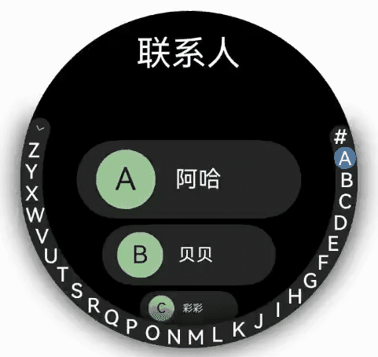

# 弧形列表 (ArcList)（圆形屏幕推荐使用）

<!--Kit: ArkUI-->
<!--Subsystem: ArkUI-->
<!--Owner: @rongShao-Z; @wind_-->
<!--Designer: @yangcan18-->
<!--Tester: @leiyuqian-->
<!--Adviser: @Brilliantry_Rui-->

从API version 18开始支持弧形列表。弧形列表是一种专为圆形屏幕设备设计的特殊列表，它能够以结构化、可滚动的形式高效展示信息。具体用法可参考ArcList。

使用弧形列表可以通过在ArcList组件中按垂直方向线性排列子组件ArcListItem，可以为弧形列表中的每一项提供独立视图。此外，可以使用循环渲染来迭代一组列表项，或结合任意数量的单个视图与ForEach结构，构建复杂的弧形列表。ArcList组件支持多种渲染控制方式，包括条件渲染、循环渲染和懒加载，以生成子组件。

## 创建弧形列表

ArcList可通过调用以下接口来创建。

<!-- @[arcList_create_start](https://gitcode.com/openharmony/applications_app_samples/blob/master/code/DocsSample/ArkUISample/ScrollableComponent/entry/src/main/ets/pages/arcList/ArcListCreate.ets) -->

``` TypeScript
ArcList({
  initialIndex: 2
}) {
  ArcListItem() {
    // ···
  }
  ArcListItem() {
    // ···
  }
// ···
}
```

>**说明：**
>
>ArcList的子组件必须是ArcListItem，ArcListItem必须配合ArcList来使用。

## 在弧形列表中显示数据

弧形列表视图垂直展示项目集合，当列表项超出屏幕范围时，提供滚动功能，这使得它非常适合展示大型数据集合。在最简单的弧形列表形式中，ArcList静态创建其列表项ArcListItem的内容。

<!-- @[arcListShow_start](https://gitcode.com/openharmony/applications_app_samples/blob/master/code/DocsSample/ArkUISample/ScrollableComponent/entry/src/main/ets/pages/arcList/ArcListShow.ets) -->

``` TypeScript
import { ArcList, ArcListItem, ArcListAttribute, ArcListItemAttribute, LengthMetrics } from '@kit.ArkUI';

@Entry
@Component
export struct ArcListShow {
  build() {
    NavDestination() {
      Column({ space: 12 }) {
        // ...
          ArcList({ initialIndex: 2 }) {
            ArcListItem() {
              Row() {
                Image($r('app.media.wlan')).width('99px').height('99px')
                  .borderRadius('50px').margin({ left: 7 })
                Column() {
                  Text($r('app.string.ArcListStyles_wlan')).fontSize('38px').fontColor('#FFFFFFFF')
                  Text($r('app.string.ArcListStyles_open')).fontSize('20px').fontColor('#FFFFFFFF')
                }.width('190px')

                Image($r('app.media.ic_settings_arrow')).width('92px').height('92px')
                  .borderRadius('50px')
              }
            }
            .borderRadius('65px')
            .width('414px')
            .height('129px')
            .backgroundColor('#26FFFFFF')

            ArcListItem() {
              Row() {
                Image($r('app.media.blueTooth')).width('99px').height('99px')
                  .borderRadius('50px').margin({ left: 7 })
                Column() {
                  Text($r('app.string.ArcListStyles_blue')).fontSize('38px').fontColor('#FFFFFFFF')
                  Text($r('app.string.ArcListStyles_open')).fontSize('20px').fontColor('#FFFFFFFF')
                }.width('190px')

                Image($r('app.media.ic_settings_arrow')).width('92px').height('92px')
                  .borderRadius('50px')
              }
            }
            .borderRadius('65px')
            .width('414px')
            .height('129px')
            .backgroundColor('#26FFFFFF')

            ArcListItem() {
              Row() {
                Image($r('app.media.mobileData')).width('99px').height('99px')
                  .borderRadius('50px').margin({ left: 7 })
                Column() {
                  Text($r('app.string.ArcListStyles_net')).fontSize('38px').fontColor('#FFFFFFFF')
                }.width('190px')

                Image($r('app.media.ic_settings_arrow')).width('92px').height('92px')
                  .borderRadius('50px')
              }
            }
            .borderRadius('65px')
            .width('414px')
            .height('129px')
            .backgroundColor('#26FFFFFF')

            ArcListItem() {
              Row() {
                Image($r('app.media.ic_settings_more_connections')).width('99px').height('99px')
                  .borderRadius('50px').margin({ left: 7 })
                Column() {
                  Text($r('app.string.ArcListStyles_connect')).fontSize('38px').fontColor('#FFFFFFFF')
                }.width('190px')

                Image($r('app.media.ic_settings_arrow')).width('92px').height('92px')
                  .borderRadius('50px')
              }
            }
            .borderRadius('65px')
            .width('414px')
            .height('129px')
            .backgroundColor('#26FFFFFF')

            ArcListItem() {
              Row() {
                Image($r('app.media.displayAndBrightness')).width('99px').height('99px')
                  .borderRadius('50px').margin({ left: 7 })
                Column() {
                  Text($r('app.string.ArcListStyles_light')).fontSize('38px').fontColor('#FFFFFFFF')
                }.width('190px')

                Image($r('app.media.ic_settings_arrow')).width('92px').height('92px')
                  .borderRadius('50px')
              }
            }
            .borderRadius('65px')
            .width('414px')
            .height('129px')
            .backgroundColor('#26FFFFFF')
          }
          .width('466px')
          .height('466px')
          .space(LengthMetrics.px(10))
          .borderRadius('233px')
          .backgroundColor(Color.Black)
        }
      // ...
    }
    .backgroundColor('#f1f2f3')
    // 请将$r('app.string.ArcListShow_title')替换为实际资源文件，在本示例中该资源文件的value值为"在弧形列表中显示数据"
    .title($r('app.string.ArcListShow_title'))
  }
}
```

  **图1** 显示弧形列表数据


## 迭代弧形列表内容

通常，应用会通过数据集合动态创建列表。采用循环渲染的方式，可以从数据源中迭代获取数据，在每次迭代过程中创建相应的组件，从而降低代码的复杂度。

ArkTS通过ForEach提供了组件的循环渲染能力。以简单的联系人列表为例，将联系人名称和头像数据以Contact类结构存储到contacts数组中，使用ForEach中嵌套的ArcListItem来代替多个平铺的、内容相似的ArcListItem，从而减少重复代码，使代码更加简洁高效。

<!-- @[arcListContentsTitle_start](https://gitcode.com/openharmony/applications_app_samples/blob/master/code/DocsSample/ArkUISample/ScrollableComponent/entry/src/main/ets/pages/arcList/ArcListContents.ets) -->

``` TypeScript
import { ArcList, ArcListAttribute, ArcListItemAttribute, ArcListItem, LengthMetrics } from '@kit.ArkUI';
import { util } from '@kit.ArkTS';
import { common } from '@kit.AbilityKit';

class Contact {
  key: string = util.generateRandomUUID(true);
  name: ResourceStr;
  icon: Resource;

  constructor(name: ResourceStr, icon: Resource) {
    this.name = name;
    this.icon = icon;
  }
}

@Entry
@Component
export struct ArcListContents {
  @State private contacts: Array<object> = [
    // 请将$r('app.string.xxx')替换为实际资源文件
    new Contact($r('app.string.name_xiaohong'), $r('app.media.ic_contact')),
    new Contact($r('app.string.name_xiaolan'), $r('app.media.ic_contact')),
    new Contact($r('app.string.name_xiaowang'), $r('app.media.ic_contact')),
    new Contact($r('app.string.name_xiaoli'), $r('app.media.ic_contact')),
    new Contact($r('app.string.name_xiaoming'), $r('app.media.ic_contact'))
  ];

  build() {
    NavDestination() {
      Column({ space: 12 }) {
        // ...
          ArcList({ initialIndex: 2 }) {
            ForEach(this.contacts, (item: Contact) => {
              ArcListItem() {
                Row() {
                  Image(item.icon)
                    .width(40)
                    .height(40)
                    .margin(10)
                    .backgroundColor('#FF9CC998')
                    .borderRadius(20)
                  Text(item.name).fontSize('38px').fontColor('#FFFFFFFF')
                }
                .width('100%')
                .justifyContent(FlexAlign.Start)
              }
              .borderRadius('65px')
              .width('410px')
              .height('130px')
              .backgroundColor('#26FFFFFF')
            }, (item: Contact) => JSON.stringify(item))
          }
          .space(LengthMetrics.px(10))
          .width('466px')
          .height('466px')
          .borderRadius('233px')
          .backgroundColor(Color.Black)
        }
        // ...
    }
    .backgroundColor('#f1f2f3')
    // 请将$r('app.string.ArcListContents_title')替换为实际资源文件，在本示例中该资源文件的value值为"迭代弧形列表内容"
    .title($r('app.string.ArcListContents_title'))
  }
}
```

  **图2** 迭代弧形列表内容


## 自定义弧形列表样式

### 自定义弧形列表标题

可以通过header参数为弧形列表添加自定义标题。

1. 首先，需要构造自定义标题组件customHeader。

   <!-- @[create_customHeader_start](https://gitcode.com/openharmony/applications_app_samples/blob/master/code/DocsSample/ArkUISample/ScrollableComponent/entry/src/main/ets/pages/arcList/ArcListStyles.ets) -->
   
   ``` TypeScript
   @Builder
   function customHeader() {
     Column() {
       Text($r('app.string.ArcListCrown_set'))
         .fontColor('#FFFFFFFF')
         .fontSize('19fp')
     }
   }
   ```

2. 由于header参数的类型是ComponentContent，所以需要对自定义标题组件进行封装。

   <!-- @[componentContent_start](https://gitcode.com/openharmony/applications_app_samples/blob/master/code/DocsSample/ArkUISample/ScrollableComponent/entry/src/main/ets/pages/arcList/ArcListStyles.ets) -->
   
   ``` TypeScript
   context: UIContext = this.getUIContext();
   arcListHeader: ComponentContent<Object> = new ComponentContent(this.context, wrapBuilder(customHeader));
   ```

3. 最后，通过header参数将arcListHeader设置到弧形列表中。

   <!-- @[arcListHeader_start](https://gitcode.com/openharmony/applications_app_samples/blob/master/code/DocsSample/ArkUISample/ScrollableComponent/entry/src/main/ets/pages/arcList/ArcListStyles.ets) -->
   
   ``` TypeScript
   ArcList({ header: this.arcListHeader }) {
     ArcListItem() {
       // ...
     }
     // ...
   
     ArcListItem() {
       // ...
     }
     // ...
   }
   ```

  **图3** 自定义弧形列表标题


### 设置弧形列表项间距

在初始化列表时，若需在列表项之间添加间距，可以通过space属性实现。例如，为在每个列表项的垂直方向上增加30px的间距。

<!-- @[arcListSpace_start](https://gitcode.com/openharmony/applications_app_samples/blob/master/code/DocsSample/ArkUISample/ScrollableComponent/entry/src/main/ets/pages/arcList/ArcListStyles.ets) -->

``` TypeScript
ArcList({ initialIndex: 2 }) {
  // ...
}
.space(LengthMetrics.px(30))
```

  **图4** 设置弧形列表项间距


### 列表项关闭自动缩放

在弧形列表中，列表项默认具有在接近上下两端时自动缩放的效果。然而，在某些情况下，可能不希望有这种缩放效果。此时，可以通过设置ArcListItem的autoScale属性为false来禁用该效果。例如，如图5所示，“网络”和“显示”两个列表项，在关闭了自动缩放属性后，无论它们所处的位置如何，都不会出现缩放效果。

<!-- @[arcListScale_start](https://gitcode.com/openharmony/applications_app_samples/blob/master/code/DocsSample/ArkUISample/ScrollableComponent/entry/src/main/ets/pages/arcList/ArcListStyles.ets) -->

``` TypeScript
ArcListItem() {
  // ...
}
.autoScale(false)
```

  **图5** 列表项关闭自动缩放


### 添加内置滚动条

当列表项的高度超过屏幕高度时，弧形列表能够沿垂直方向滚动。若用户需要快速定位，可拖动滚动条以迅速滑动列表，如图6所示。

在使用ArcList组件时，可以通过scrollBar属性来控制弧形列表滚动条的显示。scrollBar的取值类型为BarState，当设置为BarState.Auto时，表示滚动条将按需显示。在这种模式下，当用户触摸到滚动条区域时，滚动条会显示出来，支持上下拖拽以快速浏览内容，且在拖拽过程中滚动条会变粗。若用户不进行任何操作，滚动条将在2秒后自动消失。此外，还可以通过scrollBarWidth属性来设置滚动条在按压状态下的宽度，以及通过scrollBarColor属性来设置滚动条的颜色。

<!-- @[arcListBuiltInScrollBar_start](https://gitcode.com/openharmony/applications_app_samples/blob/master/code/DocsSample/ArkUISample/ScrollableComponent/entry/src/main/ets/pages/arcList/arcListBuiltInScrollerBar.ets) -->

``` TypeScript
ArcList({ header: this.arcListHeader }) {
  // ...
}
.scrollBar(BarState.Auto)
.scrollBarWidth(LengthMetrics.px(10))
.scrollBarColor(ColorMetrics.numeric(Color.White))
```

  **图6** 弧形列表的内置滚动条 


## 添加外置滚动条ArcScrollBar

弧形列表ArcList可与ArcScrollBar组件配合使用，为弧形列表添加外置滚动条。两者通过绑定同一个Scroller滚动控制器对象实现联动。

1. 首先，需要创建一个Scroller类型的对象arcListScroller。

   <!-- @[create_arcListScroller_start](https://gitcode.com/openharmony/applications_app_samples/blob/master/code/DocsSample/ArkUISample/ScrollableComponent/entry/src/main/ets/pages/arcList/ArcListAcrScrollBar.ets) -->
   
   ``` TypeScript
   private arcListScroller: Scroller = new Scroller();
   ```

2. 然后，弧形列表通过scroller参数绑定滚动控制器。

   <!-- @[bind_arcList_start](https://gitcode.com/openharmony/applications_app_samples/blob/master/code/DocsSample/ArkUISample/ScrollableComponent/entry/src/main/ets/pages/arcList/ArcListAcrScrollBar.ets) -->
   
   ``` TypeScript
   // 将arcListScroller用于初始化ArcList组件的scroller参数，完成arcListScroller与弧形列表的绑定。
   ArcList({ scroller: this.arcListScroller, header: this.arcListHeader }) {
     // ...
   }
   ```

3. 最后，弧形滚动条通过scroller参数绑定滚动控制器。

   <!-- @[bind_arcScrollBar_start](https://gitcode.com/openharmony/applications_app_samples/blob/master/code/DocsSample/ArkUISample/ScrollableComponent/entry/src/main/ets/pages/arcList/ArcListAcrScrollBar.ets) -->
   
   ``` TypeScript
   // 将arcListScroller用于初始化ArcScrollBar组件的scroller参数，完成arcListScroller与滚动条的绑定。
   ArcScrollBar({ scroller: this.arcListScroller })
   ```

  **图7** 弧形列表的外置滚动条 


>**说明：**
>
>弧形滚动条组件ArcScrollBar，还可配合其他可滚动组件使用，如List、Grid、Scroll、WaterFlow。

## 与弧形索引条ArcAlphabetIndexer联动

许多应用需要监测列表的滚动位置变动并作出响应，或通过调整滚动位置实现列表的快速定位。例如，在联系人列表滚动时，当列表滚动至不同首字母开头的联系人，外部索引条应更新至相应的字母位置。当用户选择外部索引条上的索引项时，列表应跳转至对应位置。为此，需使用弧形索引条组件ArcAlphabetIndexer。

如图8所示，当列表从联系人A滚动到联系人B时，外侧索引条也需要同步从选中A状态变成选中B状态，此场景可以通过监听ArcList组件的onScrollIndex事件来实现；当点击索引项C时，列表也需要跳转到联系人C，此场景可以通过监听ArcAlphabetIndexer的onSelect事件来实现。

在列表滚动时，根据列表此时所在的索引值位置centerIndex，重新计算字母索引条对应字母的位置indexerIndex。由于ArcAlphabetIndexer组件通过selected属性设置了选中项索引值，当indexerIndex变化时会触发ArcAlphabetIndexer组件重新渲染，从而显示为选中对应字母的状态。

在选中索引项时，根据此时选中项的索引值index，重新计算列表联系人对应的位置，然后通过列表绑定的滚动控制器arcListScroller的scrollToIndex方法控制列表跳转到对应的联系人位置。弧形列表ArcList可通过scroller参数绑定Scroller（滚动控制器）。


<!-- @[arcAlphabetIndexer_start](https://gitcode.com/openharmony/applications_app_samples/blob/master/code/DocsSample/ArkUISample/ScrollableComponent/entry/src/main/ets/pages/arcList/ArcListArcIndexerBar.ets) -->

``` TypeScript
import { ArcList, ArcListAttribute, ArcListItemAttribute, ArcListItem, LengthMetrics } from '@kit.ArkUI';
import { common } from '@kit.AbilityKit';

// ...
const alphabets: string[] = [
  '#', 'A', 'B', 'C', 'D', 'E', 'F', 'G', 'H', 'I', 'J', 'K', 'L', 'M', 'N',
  'O', 'P', 'Q', 'R', 'S', 'T', 'U', 'V', 'W', 'X', 'Y', 'Z'
];

@Entry
@Component
export struct ArcListArcIndexerBar {

  // ...
  // 索引条选中项索引
  @State indexerIndex: number = 0;
  // 列表绑定的滚动控制器
  private arcListScroller: Scroller = new Scroller();

  // ...

  build() {
    // ...
          Stack({alignContent: Alignment.End}) {
            ArcList({ initialIndex: 0, header:this.tabBar1, scroller:this.arcListScroller }) {
              // ...
            }
            // ...
            .onScrollIndex((firstIndex: number, lastIndex: number, centerIndex: number) => {
              // 根据列表滚动到的索引值，重新计算对应索引条的位置this.indexerIndex
              let contact = this.contacts[centerIndex] as Contact;
              let firstChar = contact.firstChar;
              this.indexerIndex = alphabets.indexOf(firstChar);
            })
            // ...
            // 弧形索引条组件
            ArcAlphabetIndexer({ arrayValue: alphabets, selected: this.indexerIndex})
              .selected(this.indexerIndex!!)
              .onSelect((index: number) => {
                // 选中索引项后，列表跳转到相应位置
                this.indexerIndex = index;
                const selectedLetter = alphabets[index];
                let targetIndex = -1;
                for (let i = 0; i < this.contacts.length; i++) {
                  const contact = this.contacts[i] as Contact;
                  if (contact.firstChar === selectedLetter) {
                    targetIndex = i;
                    break;
                  }
                }
                if (targetIndex >= 0) {
                  this.arcListScroller.scrollToIndex(targetIndex);
                }
              })
              // ...
          }
          // ...
  }
}
```


  **图8** 弧形列表与弧形索引条联动



## 响应列表项侧滑

ArcListItem的swipeAction属性可用于实现列表项的左右滑动功能。swipeAction属性方法初始化时存在必填SwipeActionOptions参数start和end。其中，start表示设置列表项右滑时起始端滑出的组件，end表示设置列表项左滑时尾端滑出的组件。

在联系人列表中，end参数表示设置ArcListItem左滑时尾端滑出自定义组件，即删除按钮。在初始化end方法时，将滑动列表项的索引传入删除按钮组件，当用户点击删除按钮时，可以根据数据索引来删除列表项对应的数据，从而实现侧滑删除功能。

1. 首先，实现尾端滑出组件的构建。

   <!-- @[create_SideSlip_start](https://gitcode.com/openharmony/applications_app_samples/blob/master/code/DocsSample/ArkUISample/ScrollableComponent/entry/src/main/ets/pages/arcList/ArcListSideSlip.ets) -->
   
   ``` TypeScript
   @Builder
   itemEnd(item: Contact) {
     // 构建尾端滑出组件
     Button({ type: ButtonType.Circle }) {
       Image($r('app.media.ic_public_delete_filled'))
         .width(20)
         .height(20)
     }
     .width(20)
     .height(20)
     .backgroundColor(Color.Black)
     .onClick(() => {
       this.getUIContext()?.animateTo({
         duration: 1000,
         curve: Curve.Smooth,
         iterations: 1,
         playMode: PlayMode.Normal,
       }, () => {
         // this.contacts为列表数据源，可根据实际场景构造，indexOf方法可获取将被删除数据在数据源中的索引
         let index = this.contacts.indexOf(item);
         // 从数据源删除指定数据项
         this.contacts.splice(index, 1);
       })
     })
   }
   ```


2. 然后，绑定swipeAction属性到可左滑的ArcListItem上。


   <!-- @[bind_swipeAction_start](https://gitcode.com/openharmony/applications_app_samples/blob/master/code/DocsSample/ArkUISample/ScrollableComponent/entry/src/main/ets/pages/arcList/ArcListSideSlip.ets) -->
   
   ``` TypeScript
   // 构建ArcList时，通过ForEach基于数据源this.contacts循环渲染ArcListItem
   ArcListItem() {
   // ···
   }
   .swipeAction({
     end: {
       // index为该ArcListItem在ArcList中的索引值。
       builder: () => {
         this.itemEnd(item);
       },
     }
   }) // 设置侧滑属性.
   ```


  **图9** 侧滑删除列表项


## 处理长列表

循环渲染适用于短列表，当构建具有大量列表项的长列表时，如果直接采用循环渲染方式，会一次性加载所有的列表元素，会导致页面启动时间过长，影响用户体验。因此，推荐使用数据懒加载（LazyForEach）方式实现按需迭代加载数据，从而提升列表性能。关于长列表按需加载优化的具体实现可参考数据懒加载章节中的示例。

当使用懒加载方式渲染列表时，为了减少列表滑动时出现白块，ArcList组件提供了cachedCount属性，该属性用于设置列表项缓存数，只在懒加载LazyForEach中生效。


<!-- @[arcLongList_start](https://gitcode.com/openharmony/applications_app_samples/blob/master/code/DocsSample/ArkUISample/ScrollableComponent/entry/src/main/ets/pages/arcList/ArcLongList.ets) -->

``` TypeScript
ArcList() {
  // ···
}.cachedCount(3)
```


>**说明：**
>
>- cachedCount的增加会增大UI的CPU、内存开销。使用时需要根据实际情况，综合性能和用户体验进行调整。
>
>- 列表使用数据懒加载时，除了显示区域的列表项和前后缓存的列表项，其他列表项会被销毁。

## 响应旋转表冠

手表设备上弧形列表在获焦的情况下可对旋转表冠做出响应，用户可通过旋转表冠的操作滑动列表，浏览列表项数据。弧形列表可通过下列焦点控制相关属性成为所在页面的默认焦点。

> **说明：**
>
> 仅设置默认焦点相关属性不能保证ArcList获焦。ArcList中还需包含可获焦的叶子节点组件，具体设置方式请参考设置组件是否可获焦。

<!-- @[arcListCrown_start](https://gitcode.com/openharmony/applications_app_samples/blob/master/code/DocsSample/ArkUISample/ScrollableComponent/entry/src/main/ets/pages/arcList/ArcListCrown.ets) -->

``` TypeScript
ArcList({
  initialIndex: 2,
}) {
// ···
}
// 设置弧形列表支持获焦
.focusable(true)
// 设置弧形列表支持点击获焦
.focusOnTouch(true)
// 设置弧形列表为所在页面上的默认焦点
.defaultFocus(true)
```

还可以通过digitalCrownSensitivity属性设置表冠响应事件的灵敏度，以应对不同量级的列表项数据。列表项数据较多时可以设置更高的响应事件灵敏度，数据较少时可以设置较低的响应事件灵敏度。

<!-- @[arcListCrownDigitalCrownSensitivity_start](https://gitcode.com/openharmony/applications_app_samples/blob/master/code/DocsSample/ArkUISample/ScrollableComponent/entry/src/main/ets/pages/arcList/ArcListCrown.ets) -->

``` TypeScript
ArcList({
  initialIndex: 2,
}) {
// ···
}
// ···
.digitalCrownSensitivity(CrownSensitivity.MEDIUM)
```
