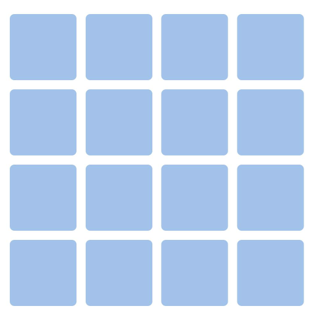
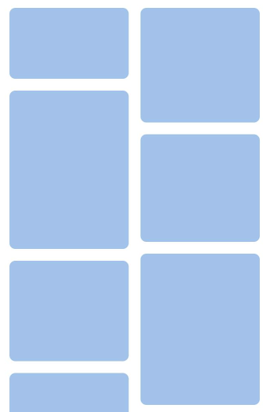
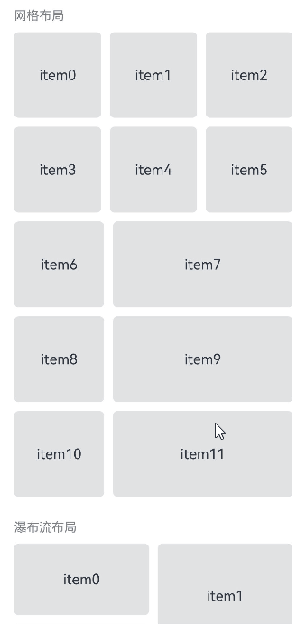
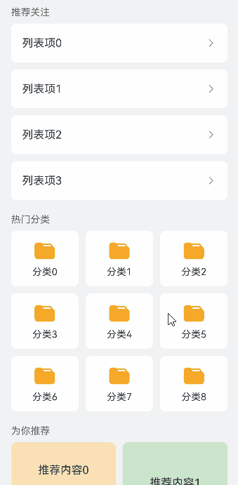

# 创建懒加载布局 (LazyColumnLayout/LazyVGridLayout/LazyVWaterFlowLayout)

<!--Kit: ArkUI-->
<!--Subsystem: ArkUI-->
<!--Owner: @yylong; @rongShao-Z; @yangcan18-->
<!--Designer: @yylong-->
<!--Tester: @huchuyun-->
<!--Adviser: @Brilliantry_Rui-->

ArkUI提供了[Scroll](../reference/apis-arkui/arkui-ts/ts-container-scroll.md)、[List](../reference/apis-arkui/arkui-ts/ts-container-list.md)、[Grid](../reference/apis-arkui/arkui-ts/ts-container-grid.md)、[WaterFlow](../reference/apis-arkui/arkui-ts/ts-container-waterflow.md)四种滚动类组件。其中，Scroll不支持懒加载，List、Grid、WaterFlow虽支持配合[LazyForEach](./rendering-control/arkts-rendering-control-lazyforeach.md)实现懒加载，但各自仅支持特定的布局模式。在实际业务场景中，一个滚动页面往往需要混合使用多种布局模式。例如，电商首页可能同时包含多列网格分类入口、瀑布流商品卡片、线性列表推荐；社交应用信息流可能同时包含文本列表、九宫格图片、视频卡片。此时单一滚动组件无法灵活适配，存在一定局限性。

懒加载布局容器是一类嵌套在可滚动父组件（Scroll、List、WaterFlow）内部，负责按需加载子组件的布局容器。这类容器本身不提供滚动能力，由父组件统一处理滚动。它仅创建和布局处于可滚动父组件可视区域内的子组件，并在帧间空闲时隙预加载可视区域上方和下方各半屏的内容，从而减少首帧渲染时间和内存开销。ArkUI提供了三种支持懒加载的布局容器组件：垂直线性布局[LazyColumnLayout](../reference/apis-arkui/arkui-ts/ts-container-lazycolumnlayout.md)、垂直网格布局[LazyVGridLayout](../reference/apis-arkui/arkui-ts/ts-container-lazyvgridlayout.md)、垂直瀑布流布局[LazyVWaterFlowLayout](../reference/apis-arkui/arkui-ts/ts-container-lazyvwaterflowlayout.md)。不同的懒加载布局容器提供不同的布局模式，开发者可以将多种类型的懒加载布局容器组合在同一个父组件中使用，灵活实现混合布局。

从API版本19开始，支持LazyVGridLayout。从API版本26.0.0开始，支持LazyColumnLayout和LazyVWaterFlowLayout。

## 使用场景

懒加载布局容器适用于以下典型场景。

- **混合布局页面**：一个滚动页面中需要同时展示多种布局方式的内容，如电商首页、社交应用信息流。List、Grid、WaterFlow分别支持线性、网格、瀑布流布局模式，通过懒加载布局容器可以将不同布局方式灵活组合在同一个可滚动父组件中，每个容器独立配置各自的布局参数（如分组、列数），所有区域共享父组件的统一滚动，无需额外处理滚动组件嵌套导致的手势冲突。

- **独立数据源管理**：页面中不同区域的数据来源不同，需要分别管理各自的数据。每个懒加载布局容器可以使用独立的数据源，不同业务模块的数据无需耦合在一起，降低数据管理的复杂度。

- **Scroll大量子组件场景优化**：Scroll组件作为通用滚动容器，本身不提供懒加载能力。通过在其中使用懒加载布局容器，可以实现子组件的按需加载，避免一次性创建所有子组件，保障大量子组件场景下的流畅体验。

## 能力对比

三种懒加载布局容器的能力对比如下。

| 能力 | LazyVGridLayout | LazyVWaterFlowLayout | LazyColumnLayout |
|------|-----------------|---------------------|-----------------|
| API起始版本 | 19 | 26.0.0 | 26.0.0 |
| 设置行间距 | 支持（[rowsGap](../reference/apis-arkui/arkui-ts/ts-container-lazyvgridlayout.md#rowsgap)） | 支持（[rowsGap](../reference/apis-arkui/arkui-ts/ts-container-lazyvwaterflowlayout.md#rowsgap)） | 支持（[space](../reference/apis-arkui/arkui-ts/ts-container-lazycolumnlayout.md#space)） |
| 设置列间距（[columnsGap](../reference/apis-arkui/arkui-ts/ts-container-lazyvgridlayout.md#columnsgap)） | 支持 | 支持 | 不支持 |
| 设置列数（[columnsTemplate](../reference/apis-arkui/arkui-ts/ts-container-lazyvgridlayout.md#columnstemplate)） | 支持 | 支持 | 不支持 |
| 设置子组件水平对齐方式（[alignItems](../reference/apis-arkui/arkui-ts/ts-container-lazycolumnlayout.md#alignitems)） | 不支持 | 不支持 | 支持 |
| 监听可视区域子组件索引变化（[onVisibleIndexesChange](../reference/apis-arkui/arkui-ts/ts-container-lazyvgridlayout.md#onvisibleindexeschange)） | 从API版本26.0.0开始支持 | 支持 | 支持 |
| 嵌套懒加载布局容器 | 不支持 | 不支持 | 支持 |
| 布局模式 | 垂直网格布局 | 垂直瀑布流布局 | 垂直线性布局 |
| 示例图 |  |  |  |

## 约束与限制

1. 三种懒加载布局容器的高度均默认自适应内容，不建议设置高度、高度约束或宽高比，设置后会导致显示异常。

2. 三种懒加载布局容器均需要配合可滚动父组件使用，不同容器支持的父组件范围有所差异。

   - LazyVGridLayout：API版本26.0.0之前，其父组件支持[WaterFlow](../reference/apis-arkui/arkui-ts/ts-container-waterflow.md)和[FlowItem](../reference/apis-arkui/arkui-ts/ts-container-flowitem.md)组件，并支持使用自定义组件或[NodeContainer](../reference/apis-arkui/arkui-ts/ts-basic-components-nodecontainer.md)组件封装后应用在WaterFlow或FlowItem中。从API版本26.0.0开始，其父组件新增支持[List](../reference/apis-arkui/arkui-ts/ts-container-list.md)、[Scroll](../reference/apis-arkui/arkui-ts/ts-container-scroll.md)和[LazyColumnLayout](../reference/apis-arkui/arkui-ts/ts-container-lazycolumnlayout.md)，同时新增支持使用自定义组件或[NodeContainer](../reference/apis-arkui/arkui-ts/ts-basic-components-nodecontainer.md)组件封装后应用在List、Scroll或LazyColumnLayout中。

   - LazyColumnLayout、LazyVWaterFlowLayout：其父组件仅限于[List](../reference/apis-arkui/arkui-ts/ts-container-list.md)、[Scroll](../reference/apis-arkui/arkui-ts/ts-container-scroll.md)、[WaterFlow](../reference/apis-arkui/arkui-ts/ts-container-waterflow.md)、[FlowItem](../reference/apis-arkui/arkui-ts/ts-container-flowitem.md)或[LazyColumnLayout](../reference/apis-arkui/arkui-ts/ts-container-lazycolumnlayout.md)，并支持使用自定义组件或[NodeContainer](../reference/apis-arkui/arkui-ts/ts-basic-components-nodecontainer.md)组件封装后应用在上述组件中。

3. 三种懒加载布局容器在不同父组件下的懒加载支持条件如下。

   - 在List组件下，要求List组件布局方向必须是竖直方向（即[listDirection](../reference/apis-arkui/arkui-ts/ts-container-list.md#listdirection)属性设置为Axis.Vertical），在非竖直方向的List中使用懒加载布局容器会导致应用崩溃。当List设置了[lanes](../reference/apis-arkui/arkui-ts/ts-container-list.md#lanes9)、[chainAnimation](../reference/apis-arkui/arkui-ts/ts-container-list.md#chainanimation)、[scrollSnapAlign](../reference/apis-arkui/arkui-ts/ts-container-list.md#scrollsnapalign10)属性中的任意一个时，懒加载布局容器的懒加载功能会失效。

   - 在Scroll组件下，要求Scroll组件布局方向必须是竖直方向（即[scrollable](../reference/apis-arkui/arkui-ts/ts-container-scroll.md#scrollable)属性设置为ScrollDirection.Vertical），在非竖直方向的Scroll中使用懒加载布局容器会导致应用崩溃。

   - 在WaterFlow组件下，要求WaterFlow组件布局方向必须是竖直方向（即[layoutDirection](../reference/apis-arkui/arkui-ts/ts-container-waterflow.md#layoutdirection)属性设置为FlexDirection.Column），在非竖直方向的WaterFlow中使用LazyColumnLayout或LazyVWaterFlowLayout会导致应用崩溃，使用LazyVGridLayout不会导致应用崩溃，但懒加载功能会失效。当WaterFlow为多列模式或分段布局中的多列分段时，三种懒加载布局容器的懒加载功能均会失效。此外，在布局方向为FlexDirection.ColumnReverse的WaterFlow组件下使用懒加载布局容器会导致显示异常。

## 创建懒加载网格布局 (LazyVGridLayout)

从API version 19开始，支持懒加载垂直网格布局[LazyVGridLayout](../reference/apis-arkui/arkui-ts/ts-container-lazyvgridlayout.md)，其适用于等宽等高的多列网格展示场景，如九宫格图片展示、功能入口图标，也适用于不等宽的多列网格展示场景，如按比例分配列宽的数据面板、设置页面。

### 创建LazyVGridLayout

以下以在[Scroll](../reference/apis-arkui/arkui-ts/ts-container-scroll.md)组件中为例，展示了LazyVGridLayout的创建方式。创建时，需要确保Scroll的布局方向为ScrollDirection.Vertical。

<!-- @[create_lazy_grid](https://gitcode.com/openharmony/applications_app_samples/blob/master/code/DocsSample/ArkUISample/ScrollableComponent/entry/src/main/ets/pages/lazyLayout/LazyVGridLayoutSample.ets) -->

``` TypeScript
Scroll() {
  LazyVGridLayout() {
    // 子组件
    // ...
  }
  // ...
}
.scrollable(ScrollDirection.Vertical)
```

### 设置列数

LazyVGridLayout组件提供了[columnsTemplate](../reference/apis-arkui/arkui-ts/ts-container-lazyvgridlayout.md#columnstemplate)属性用于设置当前网格布局的列数和每列尺寸占比。

columnsTemplate属性值是一个由多个空格和'数字+fr'间隔拼接的字符串，fr的个数即网格布局的列数，fr前面的数值大小用于计算该列在网格布局宽度上的占比，最终决定该列宽度。不设置时默认1列。设置为'0fr'时，该列的列宽为0，不显示子组件。设置为其他非法值时，子组件显示为固定1列。

**图1** 列数占比示例图


如上图所示，构建的是一个三行三列的网格布局，其在水平方向上分为四等份，第一列占一份，第二列占两份，第三列占一份。只要将columnsTemplate设置为'1fr 2fr 1fr'，即可实现上述网格布局。

<!-- @[lazy_grid_columns_template](https://gitcode.com/openharmony/applications_app_samples/blob/master/code/DocsSample/ArkUISample/ScrollableComponent/entry/src/main/ets/pages/lazyLayout/LazyVGridLayoutSample.ets) -->

``` TypeScript
LazyVGridLayout() {
  // 子组件
  // ...
}
.columnsTemplate('1fr 1fr 1fr') // 设置为3列，每列等宽
// ...
LazyVGridLayout() {
  // 子组件
  // ...
}
.columnsTemplate('1fr 2fr') // 设置为2列，第一列占1份，第二列占2份
```

columnsTemplate还支持通过repeat关键字自动计算列数，格式为`'repeat(auto-fit/auto-fill/auto-stretch, track-size)'`，其中repeat、auto-fit、auto-fill、auto-stretch为关键字，track-size为列宽，支持的单位包括px、vp、%或有效数字，默认单位为vp，track-size至少包含一个有效列宽。

| 模式 | 示例 | 说明 |
|------|------|------|
| auto-fit | `'repeat(auto-fit, 80vp)'` | 设置最小列宽，自动计算列数和实际列宽。仅支持一个有效列宽值。 |
| auto-fill | `'repeat(auto-fill, 80vp)'` | 设置固定列宽，自动计算列数。支持一个或多个有效列宽，如`'repeat(auto-fill, 20 80px)'`。 |
| auto-stretch | `'repeat(auto-stretch, 80vp)'` | 设置固定列宽，以[columnsGap](../reference/apis-arkui/arkui-ts/ts-container-lazyvgridlayout.md#columnsgap)为最小列间距，自动计算列数和实际列间距。仅支持一个有效列宽值，不支持单位%。 |

### 设置行列间距

在两个网格单元之间的垂直间距称为行间距，水平间距称为列间距，如下图所示。

**图2** 网格的行列间距示例图


LazyVGridLayout组件提供了[rowsGap](../reference/apis-arkui/arkui-ts/ts-container-lazyvgridlayout.md#rowsgap)和[columnsGap](../reference/apis-arkui/arkui-ts/ts-container-lazyvgridlayout.md#columnsgap)属性分别设置行间距和列间距。默认值均为LengthMetrics.vp(0)，设置为小于0的值时按默认值显示。

<!-- @[lazy_grid_gap](https://gitcode.com/openharmony/applications_app_samples/blob/master/code/DocsSample/ArkUISample/ScrollableComponent/entry/src/main/ets/pages/lazyLayout/LazyVGridLayoutSample.ets) -->

``` TypeScript
LazyVGridLayout() {
  // 子组件
  // ...
}
// ...
.rowsGap(LengthMetrics.vp(10))
.columnsGap(LengthMetrics.vp(10))
```

## 创建懒加载瀑布流布局 (LazyVWaterFlowLayout)

从API版本26.0.0开始，支持懒加载垂直瀑布流布局[LazyVWaterFlowLayout](../reference/apis-arkui/arkui-ts/ts-container-lazyvwaterflowlayout.md)，其适用于多列等宽但不等高的卡片展示场景，如图片展示、商品推荐。在瀑布流布局中，每个子节点都会放置在当前总高度最小的列。若多列总高度相同，则按照从左到右的顺序进行填充。

### 创建LazyVWaterFlowLayout

使用LazyVWaterFlowLayout前，需要通过`import { LazyVWaterFlowLayout } from '@kit.ArkUI'`导入该组件。

以下以在[Scroll](../reference/apis-arkui/arkui-ts/ts-container-scroll.md)组件中为例，展示了LazyVWaterFlowLayout的创建方式。创建时，需要确保Scroll的布局方向为ScrollDirection.Vertical。

<!-- @[create_lazy_water_flow](https://gitcode.com/openharmony/applications_app_samples/blob/master/code/DocsSample/ArkUISample/ScrollableComponent/entry/src/main/ets/pages/lazyLayout/LazyVWaterFlowLayoutSample.ets) -->

``` TypeScript
Scroll() {
  LazyVWaterFlowLayout() {
    // 子组件
    // ...
  }
  // ...
}
.scrollable(ScrollDirection.Vertical)
```

### 设置列数

LazyVWaterFlowLayout组件提供了[columnsTemplate](../reference/apis-arkui/arkui-ts/ts-container-lazyvwaterflowlayout.md#columnstemplate)属性用于设置当前瀑布流布局的列数和每列尺寸占比。

columnsTemplate属性值是一个由多个空格和'数字+fr'间隔拼接的字符串，fr的个数即瀑布流布局的列数，fr前面的数值大小用于计算该列在瀑布流布局宽度上的占比，最终决定该列宽度。不设置时默认1列。设置为'0fr'时，该列的列宽为0，不显示子组件。设置为其他非法值时，子组件显示为固定1列。

<!-- @[lazy_water_flow_columns_template](https://gitcode.com/openharmony/applications_app_samples/blob/master/code/DocsSample/ArkUISample/ScrollableComponent/entry/src/main/ets/pages/lazyLayout/LazyVWaterFlowLayoutSample.ets) -->

``` TypeScript
LazyVWaterFlowLayout() {
  // 子组件
  // ...
}
.columnsTemplate('1fr 1fr 1fr') // 设置为3列，每列等宽
// ...
LazyVWaterFlowLayout() {
  // 子组件
  // ...
}
.columnsTemplate('1fr 2fr') // 设置为2列，第一列占1份，第二列占2份
```

columnsTemplate还支持通过repeat关键字自动计算列数，格式为`'repeat(auto-fit/auto-fill/auto-stretch, track-size)'`，其中repeat、auto-fit、auto-fill、auto-stretch为关键字，track-size为列宽，支持的单位包括px、vp、%或有效数字，默认单位为vp，track-size至少包含一个有效列宽。

与LazyVGridLayout组件不同的是，LazyVWaterFlowLayout组件的columnsTemplate属性还支持设置为[ItemFillPolicy](../reference/apis-arkui/arkui-ts/ts-types.md#itemfillpolicy22)类型的枚举值，此时会根据组件宽度对应的[栅格容器断点](./arkts-layout-development-grid-layout.md#栅格容器断点)类型自动确定列数。例如，设置为ItemFillPolicy.BREAKPOINT_DEFAULT，组件宽度属于sm及更小的断点区间时LazyVWaterFlowLayout显示2列，属于md断点区间时显示3列，属于lg及更大的断点区间时显示5列，且每列均为1fr。

| 模式 | 示例 | 说明 |
|------|------|------|
| auto-fit | `'repeat(auto-fit, 80vp)'` | 设置最小列宽，自动计算列数和实际列宽。仅支持一个有效列宽值。 |
| auto-fill | `'repeat(auto-fill, 80vp)'` | 设置固定列宽，自动计算列数。支持一个或多个有效列宽，如`'repeat(auto-fill, 20 80px)'`。 |
| auto-stretch | `'repeat(auto-stretch, 80vp)'` | 设置固定列宽，以[columnsGap](../reference/apis-arkui/arkui-ts/ts-container-lazyvwaterflowlayout.md#columnsgap)为最小列间距，自动计算列数和实际列间距。仅支持一个有效列宽值，不支持单位%。 |
| 断点适配 | `ItemFillPolicy.BREAKPOINT_DEFAULT` | 根据组件宽度对应断点类型确定列数。 |

### 设置行列间距

在两个子组件之间的垂直间距称为行间距，水平间距称为列间距。

LazyVWaterFlowLayout组件提供了[rowsGap](../reference/apis-arkui/arkui-ts/ts-container-lazyvwaterflowlayout.md#rowsgap)和[columnsGap](../reference/apis-arkui/arkui-ts/ts-container-lazyvwaterflowlayout.md#columnsgap)属性分别设置行间距和列间距。默认值均为LengthMetrics.vp(0)，设置为小于0的值时按默认值显示。

<!-- @[lazy_water_flow_gap](https://gitcode.com/openharmony/applications_app_samples/blob/master/code/DocsSample/ArkUISample/ScrollableComponent/entry/src/main/ets/pages/lazyLayout/LazyVWaterFlowLayoutSample.ets) -->

``` TypeScript
LazyVWaterFlowLayout() {
  // 子组件
  // ...
}
// ...
.rowsGap(LengthMetrics.vp(10))
.columnsGap(LengthMetrics.vp(10))
```

## 创建懒加载线性布局 (LazyColumnLayout)

从API版本26.0.0开始，支持懒加载线性布局[LazyColumnLayout](../reference/apis-arkui/arkui-ts/ts-container-lazycolumnlayout.md)，其子元素在垂直方向依次排列，常用于单列列表场景，如消息列表、设置项列表。

### 创建LazyColumnLayout

使用LazyColumnLayout前，需要通过`import { LazyColumnLayout } from '@kit.ArkUI'`导入该组件。

以下以在[Scroll](../reference/apis-arkui/arkui-ts/ts-container-scroll.md)组件中为例，展示了LazyColumnLayout的创建方式。创建时，需要确保Scroll的布局方向为ScrollDirection.Vertical。

<!-- @[create_lazy_column](https://gitcode.com/openharmony/applications_app_samples/blob/master/code/DocsSample/ArkUISample/ScrollableComponent/entry/src/main/ets/pages/lazyLayout/LazyColumnLayoutSample.ets) -->

``` TypeScript
Scroll() {
  LazyColumnLayout() {
    // 子组件
    // ...
  }
  // ...
}
.scrollable(ScrollDirection.Vertical)
```

### 设置子组件间距

LazyColumnLayout组件提供了[space](../reference/apis-arkui/arkui-ts/ts-container-lazycolumnlayout.md#space)属性用于设置子组件在垂直方向上的间距。默认值为LengthMetrics.vp(0)，设置为小于0的值时按默认值显示。

<!-- @[lazy_column_space](https://gitcode.com/openharmony/applications_app_samples/blob/master/code/DocsSample/ArkUISample/ScrollableComponent/entry/src/main/ets/pages/lazyLayout/LazyColumnLayoutSample.ets) -->

``` TypeScript
LazyColumnLayout() {
  // 子组件
  // ...
}
.space(LengthMetrics.vp(10))
```

### 设置子组件对齐方式

LazyColumnLayout组件提供了[alignItems](../reference/apis-arkui/arkui-ts/ts-container-lazycolumnlayout.md#alignitems)属性用于设置子组件在水平方向上的对齐方式。未设置时，对齐方式默认值为HorizontalAlign.Center。

<!-- @[lazy_column_align_items](https://gitcode.com/openharmony/applications_app_samples/blob/master/code/DocsSample/ArkUISample/ScrollableComponent/entry/src/main/ets/pages/lazyLayout/LazyColumnLayoutSample.ets) -->

``` TypeScript
LazyColumnLayout() {
  // 子组件
  // ...
}
// ...
.alignItems(HorizontalAlign.Start)
```

### 嵌套懒加载布局容器

LazyColumnLayout支持嵌套使用LazyVGridLayout、LazyVWaterFlowLayout及其自身，以实现更复杂的混合布局。被嵌套的懒加载布局容器会作为LazyColumnLayout的子组件，在进入可视区域时按需加载。

<!-- @[lazy_column_nested](https://gitcode.com/openharmony/applications_app_samples/blob/master/code/DocsSample/ArkUISample/ScrollableComponent/entry/src/main/ets/pages/lazyLayout/LazyColumnLayoutNestedLazyLayout.ets) -->

``` TypeScript
Scroll() {
  LazyColumnLayout() {
    // ...

    // 区域一：线性布局
    LazyColumnLayout() {
      // ...
    }
    // ...

    // 区域二：网格布局
    LazyVGridLayout() {
      // ...
    }
    // ...

    // 区域三：瀑布流布局
    LazyVWaterFlowLayout() {
      // ...
    }
    // ...
  }
  // ...
}
.scrollable(ScrollDirection.Vertical)
```

## 监听可视区域变化

三种懒加载布局容器均支持通过[onVisibleIndexesChange](../reference/apis-arkui/arkui-ts/ts-container-lazyvgridlayout.md#onvisibleindexeschange)事件监听可视区域内子组件索引值的变化。在组件初始化时或可视区域内子组件的索引值发生变化时触发回调，返回可视区域内子组件的起始索引值和终止索引值。当懒加载布局容器内没有子组件或可视区域内无可见子组件时，start和end均返回-1。

以下示例分别展示了三种懒加载布局容器注册onVisibleIndexesChange事件回调的方式。

<!-- @[lazy_layout_on_visible_indexes_change](https://gitcode.com/openharmony/applications_app_samples/blob/master/code/DocsSample/ArkUISample/ScrollableComponent/entry/src/main/ets/pages/lazyLayout/LazyColumnLayoutNestedLazyLayout.ets) -->

``` TypeScript
// 区域一：线性布局
LazyColumnLayout() {
  // ...
}
.onVisibleIndexesChange((start: number, end: number) => {
  console.info('LazyColumnLayout visible indexes: start: ' + start + ', end: ' + end);
})
// ...

// 区域二：网格布局
LazyVGridLayout() {
  // ...
}
.onVisibleIndexesChange((start: number, end: number) => {
  console.info('LazyVGridLayout visible indexes: start: ' + start + ', end: ' + end);
})
// ...

// 区域三：瀑布流布局
LazyVWaterFlowLayout() {
  // ...
}
.onVisibleIndexesChange((start: number, end: number) => {
  console.info('LazyVWaterFlowLayout visible indexes: start: ' + start + ', end: ' + end);
  // ...
})
```

利用onVisibleIndexesChange回调，可以在即将触底时提前加载更多数据，实现无限滚动。以下示例展示了LazyVWaterFlowLayout配合LazyForEach实现无限滚动：通过在onVisibleIndexesChange回调中判断当前可视区域的终止索引值（end）是否接近数据源的总数量（totalCount），当剩余数据不足时，向数据源中追加新数据，从而在用户滚动到底部前提前完成数据加载，实现无缝滚动体验。

<!-- @[lazy_water_flow_load_data](https://gitcode.com/openharmony/applications_app_samples/blob/master/code/DocsSample/ArkUISample/ScrollableComponent/entry/src/main/ets/pages/lazyLayout/ListNestedLazyLayout.ets) -->

``` TypeScript
List({ space: 10 }) {
  // ...
  LazyVWaterFlowLayout() {
    LazyForEach(this.flowData, (item: number) => {
      // ...
    }, (item: number) => item.toString())
  }
  .columnsTemplate('1fr 1fr')
  .rowsGap(LengthMetrics.vp(10))
  .columnsGap(LengthMetrics.vp(10))
  .onVisibleIndexesChange((start: number, end: number) => {
    console.info('LazyVWaterFlowLayout visible indexes: start: ' + start + ', end: ' + end);
    // 滚动监听：即将触底时提前加载更多数据
    if (end + 20 >= this.flowData.totalCount()) {
      let currentCount = this.flowData.totalCount();
      for (let i = currentCount; i < currentCount + 100; i++) {
        this.flowData.pushData(i);
      }
    }
  })
}
.listDirection(Axis.Vertical)
```

## 混合布局

- 直接组合多种懒加载布局容器

通过将多种懒加载布局容器组合在同一个可滚动父组件中使用，可以灵活实现混合布局。

以下示例以[List](../reference/apis-arkui/arkui-ts/ts-container-list.md)组件作为可滚动父组件为例，在其中同时使用LazyVGridLayout和LazyVWaterFlowLayout，并为每个容器分别配置独立的列数和行列间距，实现了混合布局。

<!-- @[list_nested_lazy_layout](https://gitcode.com/openharmony/applications_app_samples/blob/master/code/DocsSample/ArkUISample/ScrollableComponent/entry/src/main/ets/pages/lazyLayout/ListNestedLazyLayout.ets) -->

``` TypeScript
import { LengthMetrics, LazyVWaterFlowLayout, LazyVWaterFlowLayoutAttribute } from '@kit.ArkUI';

class BasicDataSource<T> implements IDataSource {
  private listeners: DataChangeListener[] = [];
  protected dataArray: T[] = [];

  public totalCount(): number {
    return this.dataArray.length;
  }

  public getData(index: number): T {
    return this.dataArray[index];
  }

  registerDataChangeListener(listener: DataChangeListener): void {
    if (this.listeners.indexOf(listener) < 0) {
      this.listeners.push(listener);
    }
  }

  unregisterDataChangeListener(listener: DataChangeListener): void {
    const pos = this.listeners.indexOf(listener);
    if (pos >= 0) {
      this.listeners.splice(pos, 1);
    }
  }

  notifyDataReload(): void {
    this.listeners.forEach(listener => {
      listener.onDataReloaded();
    })
  }

  notifyDataAdd(index: number): void {
    this.listeners.forEach(listener => {
      listener.onDataAdd(index);
    })
  }

  notifyDataDelete(index: number): void {
    this.listeners.forEach(listener => {
      listener.onDataDelete(index);
    })
  }
}

class MyDataSource<T> extends BasicDataSource<T> {
  public pushData(data: T): void {
    this.dataArray.push(data);
    this.notifyDataAdd(this.dataArray.length - 1);
  }
}

@Entry
@Component
export struct ListNestedLazyLayout {
  // 网格区域数据源
  private gridData: MyDataSource<number> = new MyDataSource<number>();
  // 瀑布流区域数据源
  private flowData: MyDataSource<number> = new MyDataSource<number>();

  private itemHeight(index: number): number {
    return 80 + (index * 37 % 121)
  }

  aboutToAppear(): void {
    for (let i = 0; i < 6; i++) {
      this.gridData.pushData(i);
    }
    for (let i = 0; i < 100; i++) {
      this.flowData.pushData(i);
    }
  }

  build() {
    NavDestination() {
      Column() {
        List({ space: 10 }) {
          ListItem() {
            // 请将$r('app.string.list_nested_lazyLayout_grid')替换为实际资源文件
            // 在本示例中该资源文件的value值为"网格布局"
            Text($r('app.string.list_nested_lazyLayout_grid'))
              .fontSize(14)
              .fontColor(Color.Gray)
          }

          LazyVGridLayout() {
            LazyForEach(this.gridData, (item: number) => {
              Text('item' + item.toString())
                .height(96)
                .width('100%')
                .borderRadius(5)
                .backgroundColor('#ffe0e2e4')
                .textAlign(TextAlign.Center)
            }, (item: number) => item.toString())
          }
          .columnsTemplate('1fr 1fr 1fr')
          .rowsGap(LengthMetrics.vp(10))
          .columnsGap(LengthMetrics.vp(10))
          .onVisibleIndexesChange((start: number, end: number) => {
            console.info('LazyVGridLayout visible indexes: start: ' + start + ', end: ' + end);
          })

          LazyVGridLayout() {
            LazyForEach(this.gridData, (item: number) => {
              Text('item' + (this.gridData.totalCount() + item).toString())
                .height(96)
                .width('100%')
                .borderRadius(5)
                .backgroundColor('#ffe0e2e4')
                .textAlign(TextAlign.Center)
            }, (item: number) => item.toString())
          }
          .columnsTemplate('1fr 2fr')
          .rowsGap(LengthMetrics.vp(10))
          .columnsGap(LengthMetrics.vp(10))
          .margin({ bottom: 16 })
          .onVisibleIndexesChange((start: number, end: number) => {
            console.info('LazyVGridLayout visible indexes: start: ' + (this.gridData.totalCount() + start) + ', end: ' +
              (this.gridData.totalCount() + end));
          })

          ListItem() {
            // 请将$r('app.string.list_nested_lazyLayout_waterFlow')替换为实际资源文件
            // 在本示例中该资源文件的value值为"瀑布流布局"
            Text($r('app.string.list_nested_lazyLayout_waterFlow'))
              .fontSize(14)
              .fontColor(Color.Gray)
          }

          LazyVWaterFlowLayout() {
            LazyForEach(this.flowData, (item: number) => {
              Text('item' + item.toString())
                .height(this.itemHeight(item))
                .width('100%')
                .borderRadius(5)
                .backgroundColor('#ffe0e2e4')
                .textAlign(TextAlign.Center)
            }, (item: number) => item.toString())
          }
          .columnsTemplate('1fr 1fr')
          .rowsGap(LengthMetrics.vp(10))
          .columnsGap(LengthMetrics.vp(10))
          .onVisibleIndexesChange((start: number, end: number) => {
            console.info('LazyVWaterFlowLayout visible indexes: start: ' + start + ', end: ' + end);
            // 滚动监听：即将触底时提前加载更多数据
            if (end + 20 >= this.flowData.totalCount()) {
              let currentCount = this.flowData.totalCount();
              for (let i = currentCount; i < currentCount + 100; i++) {
                this.flowData.pushData(i);
              }
            }
          })
        }
        .listDirection(Axis.Vertical)
        .backgroundColor(Color.White)
        .borderRadius(12)
        .padding(12)
        .width('100%')
        .layoutWeight(1)
      }
      .width('100%')
      .height('100%')
      .padding({ left: 12, right: 12 })
    }
    .backgroundColor('#f1f2f3')
    // 请将$r('app.string.list_nested_lazyLayout_title')替换为实际资源文件
    // 在本示例中该资源文件的value值为"List嵌套懒加载布局容器"
    .title($r('app.string.list_nested_lazyLayout_title'))
  }
}
```

**图3** List嵌套懒加载布局容器效果示例图



- 通过LazyColumnLayout嵌套组合多种懒加载布局容器

利用LazyColumnLayout的嵌套能力，可以进一步实现更复杂的混合布局。例如，在一个页面中同时包含线性列表、网格和瀑布流三种排列方式的内容区域。

以下示例以[Scroll](../reference/apis-arkui/arkui-ts/ts-container-scroll.md)组件作为可滚动父组件为例，使用LazyColumnLayout作为主布局容器，嵌套LazyColumnLayout（线性列表区域）、LazyVGridLayout（网格区域）和LazyVWaterFlowLayout（瀑布流区域），实现了多种布局方式的混合展示。

<!-- @[lazy_column_nested_lazy_layout](https://gitcode.com/openharmony/applications_app_samples/blob/master/code/DocsSample/ArkUISample/ScrollableComponent/entry/src/main/ets/pages/lazyLayout/LazyColumnLayoutNestedLazyLayout.ets) -->

``` TypeScript
import {
  LengthMetrics,
  LazyVWaterFlowLayout,
  LazyVWaterFlowLayoutAttribute,
  LazyColumnLayout,
  LazyColumnLayoutAttribute
} from '@kit.ArkUI';

class BasicDataSource<T> implements IDataSource {
  private listeners: DataChangeListener[] = [];
  protected dataArray: T[] = [];

  public totalCount(): number {
    return this.dataArray.length;
  }

  public getData(index: number): T {
    return this.dataArray[index];
  }

  registerDataChangeListener(listener: DataChangeListener): void {
    if (this.listeners.indexOf(listener) < 0) {
      this.listeners.push(listener);
    }
  }

  unregisterDataChangeListener(listener: DataChangeListener): void {
    const pos = this.listeners.indexOf(listener);
    if (pos >= 0) {
      this.listeners.splice(pos, 1);
    }
  }

  notifyDataReload(): void {
    this.listeners.forEach(listener => {
      listener.onDataReloaded();
    })
  }

  notifyDataAdd(index: number): void {
    this.listeners.forEach(listener => {
      listener.onDataAdd(index);
    })
  }
}

class MyDataSource<T> extends BasicDataSource<T> {
  public pushData(data: T): void {
    this.dataArray.push(data);
    this.notifyDataAdd(this.dataArray.length - 1);
  }
}

@Entry
@Component
export struct LazyColumnLayoutNestedLazyLayout {
  // 线性列表区域数据源
  private listData: MyDataSource<number> = new MyDataSource<number>();
  // 网格区域数据源
  private gridData: MyDataSource<number> = new MyDataSource<number>();
  // 瀑布流区域数据源
  private flowData: MyDataSource<number> = new MyDataSource<number>();

  private itemHeight(index: number): number {
    return 80 + (index * 37 % 121)
  }

  private itemColor(index: number): string {
    const colors: string[] = ['#FFE0B2', '#C8E6C9', '#BBDEFB', '#F8BBD0', '#D1C4E9', '#FFF9C4']
    return colors[index % colors.length]
  }

  aboutToAppear(): void {
    for (let i = 0; i < 4; i++) {
      this.listData.pushData(i);
    }
    for (let i = 0; i < 9; i++) {
      this.gridData.pushData(i);
    }
    for (let i = 0; i < 100; i++) {
      this.flowData.pushData(i);
    }
  }

  build() {
    NavDestination() {
      Column() {
        Scroll() {
          LazyColumnLayout() {
            // 请将$r('app.string.lazyColumnLayout_nested_lazyLayout_following')替换为实际资源文件
            // 在本示例中该资源文件的value值为"推荐关注"
            Text($r('app.string.lazyColumnLayout_nested_lazyLayout_following'))
              .fontSize(14)
              .fontColor(Color.Gray)
              .margin({ bottom: 8 })

            // 区域一：线性布局
            LazyColumnLayout() {
              LazyForEach(this.listData, (item: number) => {
                Row() {
                  Text() {
                    // 请将$r('app.string.lazyColumnLayout_nested_lazyLayout_item')替换为实际资源文件
                    // 在本示例中该资源文件的value值为"列表项"
                    Span($r('app.string.lazyColumnLayout_nested_lazyLayout_item'))
                    Span(item.toString())
                  }

                  Blank()
                  SymbolGlyph($r('sys.symbol.chevron_forward'))
                    .fontColor([Color.Gray])
                }
                .width('100%')
                .height(56)
                .padding({ left: 16, right: 16 })
                .borderRadius(8)
                .backgroundColor(Color.White)
              }, (item: number) => item.toString())
            }
            .onVisibleIndexesChange((start: number, end: number) => {
              console.info('LazyColumnLayout visible indexes: start: ' + start + ', end: ' + end);
            })
            .space(LengthMetrics.vp(10))

            // 请将$r('app.string.lazyColumnLayout_nested_lazyLayout_popular')替换为实际资源文件
            // 在本示例中该资源文件的value值为"热门分类"
            Text($r('app.string.lazyColumnLayout_nested_lazyLayout_popular'))
              .fontSize(14)
              .fontColor(Color.Gray)
              .margin({ top: 12, bottom: 8 })

            // 区域二：网格布局
            LazyVGridLayout() {
              LazyForEach(this.gridData, (item: number) => {
                Column() {
                  SymbolGlyph($r('sys.symbol.folder_fill'))
                    .fontSize(32)
                    .fontColor([Color.Orange])
                  Text() {
                    // 请将$r('app.string.lazyColumnLayout_nested_lazyLayout_category')替换为实际资源文件
                    // 在本示例中该资源文件的value值为"分类"
                    Span($r('app.string.lazyColumnLayout_nested_lazyLayout_category'))
                    Span(item.toString())
                  }
                  .fontSize(14)
                  .margin({ top: 6 })
                }
                .width('100%')
                .height(80)
                .borderRadius(8)
                .backgroundColor(Color.White)
                .justifyContent(FlexAlign.Center)
              }, (item: number) => item.toString())
            }
            .onVisibleIndexesChange((start: number, end: number) => {
              console.info('LazyVGridLayout visible indexes: start: ' + start + ', end: ' + end);
            })
            .columnsTemplate('1fr 1fr 1fr')
            .rowsGap(LengthMetrics.vp(10))
            .columnsGap(LengthMetrics.vp(10))

            // 请将$r('app.string.lazyColumnLayout_nested_lazyLayout_recommend')替换为实际资源文件
            // 在本示例中该资源文件的value值为"为你推荐"
            Text($r('app.string.lazyColumnLayout_nested_lazyLayout_recommend'))
              .fontSize(14)
              .fontColor(Color.Gray)
              .margin({ top: 12, bottom: 8 })

            // 区域三：瀑布流布局
            LazyVWaterFlowLayout() {
              LazyForEach(this.flowData, (item: number) => {
                Text() {
                  // 请将$r('app.string.lazyColumnLayout_nested_lazyLayout_recommendation')替换为实际资源文件
                  // 在本示例中该资源文件的value值为"推荐内容"
                  Span($r('app.string.lazyColumnLayout_nested_lazyLayout_recommendation'))
                  Span(item.toString())
                }
                .height(this.itemHeight(item))
                .width('100%')
                .borderRadius(8)
                .backgroundColor(this.itemColor(item))
                .textAlign(TextAlign.Center)
              }, (item: number) => item.toString())
            }
            .onVisibleIndexesChange((start: number, end: number) => {
              console.info('LazyVWaterFlowLayout visible indexes: start: ' + start + ', end: ' + end);
              // 即将触底时加载更多数据
              if (end + 20 >= this.flowData.totalCount()) {
                let currentCount = this.flowData.totalCount();
                for (let i = currentCount; i < currentCount + 100; i++) {
                  this.flowData.pushData(i);
                }
              }
            })
            .columnsTemplate('1fr 1fr')
            .rowsGap(LengthMetrics.vp(10))
            .columnsGap(LengthMetrics.vp(10))
          }
          .alignItems(HorizontalAlign.Start)
        }
        .scrollable(ScrollDirection.Vertical)
        .padding(12)
        .width('100%')
        .layoutWeight(1)
      }
      .width('100%')
      .height('100%')
      .padding({ left: 12, right: 12 })
      .backgroundColor('#f1f2f3')
    }
    .backgroundColor('#f1f2f3')
    // 请将$r('app.string.lazyColumnLayout_nested_lazyLayout_title')替换为实际资源文件
    // 在本示例中该资源文件的value值为"LazyColumnLayout嵌套懒加载布局容器"
    .title($r('app.string.lazyColumnLayout_nested_lazyLayout_title'))
  }
}
```

在上面的示例中，整个页面仅使用一个Scroll组件提供滚动能力，由LazyColumnLayout作为主布局容器统一管理三个区域的排列。三个区域分别使用独立的LazyForEach数据源（listData、gridData、flowData），数据互不耦合，独立管理。滚动时，所有区域共享同一个Scroll的手势，无需额外的手势处理逻辑。每个区域中的子组件仅在进入可视区域时才会被创建和渲染，从而保障了页面的流畅体验。

**图4** LazyColumnLayout嵌套懒加载布局容器效果示例图


