# 动态布局 (DynamicLayout)
<!--Kit: ArkUI-->
<!--Subsystem: ArkUI-->
<!--Owner: @zju_ljz-->
<!--Designer: @lanshouren-->
<!--Tester: @liuli0427-->
<!--Adviser: @Brilliantry_Rui-->

## 概述

从API version 24开始，支持动态布局容器组件[DynamicLayout](../reference/apis-arkui/arkui-ts/ts-container-dynamiclayout.md)。DynamicLayout支持在运行时动态切换不同的布局算法，同时保持子组件的状态不变。通过DynamicLayout，开发者可以灵活实现同一种内容在不同场景下的多种布局展示。DynamicLayout组件支持的布局算法类包括[RowLayoutAlgorithm](../reference/apis-arkui/js-apis-arkui-layoutAlgorithm.md#rowlayoutalgorithm)、[ColumnLayoutAlgorithm](../reference/apis-arkui/js-apis-arkui-layoutAlgorithm.md#columnlayoutalgorithm)、[StackLayoutAlgorithm](../reference/apis-arkui/js-apis-arkui-layoutAlgorithm.md#stacklayoutalgorithm)、[GridLayoutAlgorithm](../reference/apis-arkui/js-apis-arkui-layoutAlgorithm.md#gridlayoutalgorithm)和自定义布局算法类[CustomLayoutAlgorithm](../reference/apis-arkui/js-apis-arkui-layoutAlgorithm.md#customlayoutalgorithm)。

## 约束与限制
1. 布局算法类使用[@ObservedV2](./state-management/arkts-new-observedV2-and-trace.md)装饰，不支持[@State](./state-management/arkts-state.md)装饰器。
2. 切换布局算法时，子组件的状态（如输入框内容、滚动位置等）保持不变。
3. 在自定义布局算法的[onMeasure](../reference/apis-arkui/js-apis-arkui-layoutAlgorithm.md#onmeasure)和[onLayout](../reference/apis-arkui/js-apis-arkui-layoutAlgorithm.md#onlayout)方法中不允许修改状态变量，避免不可预期的行为。

## 创建DynamicLayout

通过传入[LayoutAlgorithm](../reference/apis-arkui/js-apis-arkui-layoutAlgorithm.md#layoutalgorithm-1)类型入参，创建[DynamicLayout](../reference/apis-arkui/arkui-ts/ts-container-dynamiclayout.md#接口)组件并设置布局算法。[LayoutAlgorithm](../reference/apis-arkui/js-apis-arkui-layoutAlgorithm.md#layoutalgorithm-1)类型变量支持赋值具体的布局算法类对象，包括[内置布局算法](#内置布局算法)和[自定义布局算法](#自定义布局算法)。

<!-- @[CreateDynamicLayout](https://gitcode.com/openharmony/applications_app_samples/blob/master/code/DocsSample/ArkUISample/DynamicLayout/entry/src/main/ets/pages/basic/CreateDynamicLayout.ets) -->

``` TypeScript
import {
  DynamicLayout, DynamicLayoutAttribute,RowLayoutAlgorithm, ColumnLayoutAlgorithm, LayoutAlgorithm
} from '@kit.ArkUI';

@Entry
@ComponentV2
struct CreateDynamicLayout {
  @Local algorithm: LayoutAlgorithm = new RowLayoutAlgorithm();

  build() {
    Column({ space: 10 }) {
      DynamicLayout(this.algorithm) {
        Text('Item 1')
          .fontSize(16)
          .backgroundColor(0xF5DEB3)
          .padding(10)
        Text('Item 2')
          .fontSize(16)
          .backgroundColor(0xD2B48C)
          .padding(10)
        Text('Item 3')
          .fontSize(16)
          .backgroundColor(0xF5DEB3)
          .padding(10)
      }
      .width('100%')
      .height(150)
      .backgroundColor(0xEFEFEF)

      Button('切换为Column布局')
        .fontSize(16)
        .onClick(() => {
          this.algorithm = new ColumnLayoutAlgorithm();
        })
    }
    .width('100%')
    .padding(20)
  }
}
```

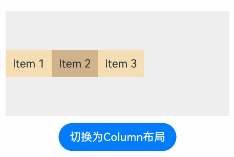

## 内置布局算法

线性布局算法[RowLayoutAlgorithm](../reference/apis-arkui/js-apis-arkui-layoutAlgorithm.md#rowlayoutalgorithm)和[ColumnLayoutAlgorithm](../reference/apis-arkui/js-apis-arkui-layoutAlgorithm.md#columnlayoutalgorithm)具有自适应拉伸、缩放的能力，可以用于界面元素自适应布局的场景。堆叠布局算法[StackLayoutAlgorithm](../reference/apis-arkui/js-apis-arkui-layoutAlgorithm.md#stacklayoutalgorithm)具有较强的页面层叠、位置定位能力，可以用于广告、卡片层叠等页面场景。网格布局算法[GridLayoutAlgorithm](../reference/apis-arkui/js-apis-arkui-layoutAlgorithm.md#gridlayoutalgorithm)具有较好的规律结构，适合展示同类项目集合，例如显示图片、视频、音乐、新闻、商品等。

### RowLayoutAlgorithm

[RowLayoutAlgorithm](../reference/apis-arkui/js-apis-arkui-layoutAlgorithm.md#rowlayoutalgorithm)是水平方向线性布局算法，子组件沿水平方向依次排列。该算法支持设置子组件间距、子组件在主轴（水平方向）上的对齐方式、在交叉轴（垂直方向）上的对齐方式，以及是否反转子组件的排列方向。该布局算法与[Row](../reference/apis-arkui/arkui-ts/ts-container-row.md)组件布局效果一致，详细效果说明请参考[线性布局（Row/Column）](./arkts-layout-development-linear.md)。下述示例通过修改RowLayoutAlgorithm对象的space、justifyContent、alignItems和isReverse成员变量，调整子组件间距、主轴（水平方向）对齐方式、交叉轴（竖直方向）对齐方式和排列方向。

从API version 24开始，新增[RowLayoutAlgorithm](../reference/apis-arkui/js-apis-arkui-layoutAlgorithm.md#rowlayoutalgorithm)的[space](../reference/apis-arkui/js-apis-arkui-layoutAlgorithm.md#属性)、[justifyContent](../reference/apis-arkui/js-apis-arkui-layoutAlgorithm.md#属性)、[alignItems](../reference/apis-arkui/js-apis-arkui-layoutAlgorithm.md#属性)、[isReverse](../reference/apis-arkui/js-apis-arkui-layoutAlgorithm.md#属性)属性。

<!-- @[RowLayoutAlgorithm](https://gitcode.com/openharmony/applications_app_samples/blob/master/code/DocsSample/ArkUISample/DynamicLayout/entry/src/main/ets/pages/linearlayout/RowLayoutAlgorithm.ets) -->

``` TypeScript
import {
  DynamicLayout, DynamicLayoutAttribute, RowLayoutAlgorithm, LengthMetrics
} from '@kit.ArkUI';

@Entry
@ComponentV2
struct RowLayoutExample {
  @Local algorithm: RowLayoutAlgorithm = new RowLayoutAlgorithm({
    space: LengthMetrics.vp(10),
    alignItems: VerticalAlign.Top,
    justifyContent: FlexAlign.Start,
    isReverse: false
  });

  build() {
    Column({ space: 10 }) {
      DynamicLayout(this.algorithm) {
        Text('Item 1')
          .width(80)
          .height(40)
          .fontSize(14)
          .backgroundColor(0xF5DEB3)
        Text('Item 2')
          .width(80)
          .height(40)
          .fontSize(14)
          .backgroundColor(0xD2B48C)
        Text('Item 3')
          .width(80)
          .height(40)
          .fontSize(14)
          .backgroundColor(0xF5DEB3)
      }
      .width('100%')
      .height(80)
      .backgroundColor(0xEFEFEF)

      Row({ space: 10 }) {
        Button('修改间距')
          .fontSize(14)
          .onClick(() => {
            this.algorithm.space = LengthMetrics.vp(20);
          })
        Button('反转排列')
          .fontSize(14)
          .onClick(() => {
            this.algorithm.isReverse = !this.algorithm.isReverse;
          })
      }

      Row({ space: 10 }) {
        Button('竖直居中')
          .fontSize(14)
          .onClick(() => {
            this.algorithm.alignItems = VerticalAlign.Center;
          })
        Button('水平居中')
          .fontSize(14)
          .onClick(() => {
            this.algorithm.justifyContent = FlexAlign.Center;
          })
      }
    }
    .padding(20)
  }
}
```


### ColumnLayoutAlgorithm

[ColumnLayoutAlgorithm](../reference/apis-arkui/js-apis-arkui-layoutAlgorithm.md#columnlayoutalgorithm)是垂直方向线性布局算法，子组件沿垂直方向依次排列。该算法支持设置子组件间距、子组件在主轴（垂直方向）上的对齐方式、在交叉轴（水平方向）上的对齐方式，以及是否反转子组件的排列方向。该布局算法与[Column](../reference/apis-arkui/arkui-ts/ts-container-column.md)组件布局效果一致，详细效果说明请参考[线性布局（Row/Column）](./arkts-layout-development-linear.md)。下述示例通过修改ColumnLayoutAlgorithm的space、justifyContent、alignItems和isReverse属性，调整子组件间距、主轴（竖直方向）对齐方式、交叉轴（水平方向）对齐方式和排列方向。

从API version 24开始，新增[ColumnLayoutAlgorithm](../reference/apis-arkui/js-apis-arkui-layoutAlgorithm.md#columnlayoutalgorithm)的[space](../reference/apis-arkui/js-apis-arkui-layoutAlgorithm.md#属性-1)、[justifyContent](../reference/apis-arkui/js-apis-arkui-layoutAlgorithm.md#属性-1)、[alignItems](../reference/apis-arkui/js-apis-arkui-layoutAlgorithm.md#属性-1)、[isReverse](../reference/apis-arkui/js-apis-arkui-layoutAlgorithm.md#属性-1)属性。

<!-- @[ColumnLayoutAlgorithm](https://gitcode.com/openharmony/applications_app_samples/blob/master/code/DocsSample/ArkUISample/DynamicLayout/entry/src/main/ets/pages/linearlayout/ColumnLayoutAlgorithm.ets) -->

``` TypeScript
import {
  DynamicLayout, DynamicLayoutAttribute, ColumnLayoutAlgorithm, LengthMetrics
} from '@kit.ArkUI';

@Entry
@ComponentV2
struct ColumnLayoutExample {
  @Local algorithm: ColumnLayoutAlgorithm = new ColumnLayoutAlgorithm({
    space: LengthMetrics.vp(10),
    alignItems: HorizontalAlign.Start,
    justifyContent: FlexAlign.Start,
    isReverse: false
  });

  build() {
    Column({ space: 10 }) {
      DynamicLayout(this.algorithm) {
        Text('Item 1')
          .width('80%')
          .height(40)
          .fontSize(14)
          .backgroundColor(0xF5DEB3)
        Text('Item 2')
          .width('80%')
          .height(40)
          .fontSize(14)
          .backgroundColor(0xD2B48C)
        Text('Item 3')
          .width('80%')
          .height(40)
          .fontSize(14)
          .backgroundColor(0xF5DEB3)
      }
      .width('100%')
      .height(200)
      .backgroundColor(0xEFEFEF)

      Row({ space: 10 }) {
        Button('修改间距')
          .fontSize(14)
          .onClick(() => {
            this.algorithm.space = LengthMetrics.vp(20);
          })
        Button('反转排列')
          .fontSize(14)
          .onClick(() => {
            this.algorithm.isReverse = !this.algorithm.isReverse;
          })
      }

      Row({ space: 10 }) {
        Button('竖直居中')
          .fontSize(14)
          .onClick(() => {
            this.algorithm.justifyContent = FlexAlign.Center;
          })
        Button('水平居中')
          .fontSize(14)
          .onClick(() => {
            this.algorithm.alignItems = HorizontalAlign.Center;
          })
      }
    }
    .padding(20)
  }
}
```
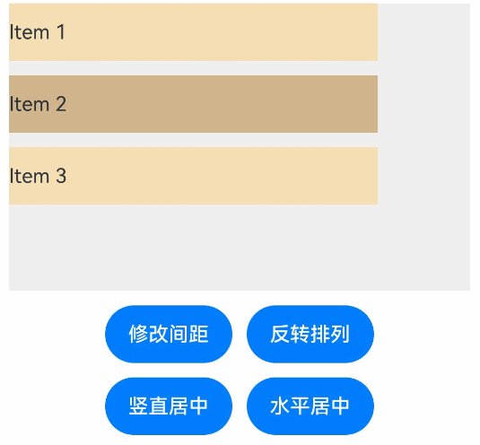

### StackLayoutAlgorithm

[StackLayoutAlgorithm](../reference/apis-arkui/js-apis-arkui-layoutAlgorithm.md#stacklayoutalgorithm)是堆叠布局算法，子组件堆叠排列，后添加的子组件覆盖先添加的子组件。该算法支持通过alignContent设置子组件在容器中的九宫格对齐位置，子组件可以通过[layoutGravity](../reference/apis-arkui/arkui-ts/ts-universal-attributes-location.md#layoutgravity20)属性单独设置自己的对齐方式，优先级高于容器的alignContent。该布局算法与[Stack](../reference/apis-arkui/arkui-ts/ts-container-stack.md)组件布局效果一致，详细效果说明请参考[堆叠布局](./arkts-layout-development-stack-layout.md)。下述示例通过修改[StackLayoutAlgorithm](../reference/apis-arkui/js-apis-arkui-layoutAlgorithm.md#stacklayoutalgorithm)的[alignContent](../reference/apis-arkui/js-apis-arkui-layoutAlgorithm.md#属性-2)属性，调整子组件在容器中的九宫格对齐位置。

从API version 24开始，新增[StackLayoutAlgorithm](../reference/apis-arkui/js-apis-arkui-layoutAlgorithm.md#stacklayoutalgorithm)的[alignContent](../reference/apis-arkui/js-apis-arkui-layoutAlgorithm.md#属性-2)属性。

<!-- @[StackLayoutAlgorithm](https://gitcode.com/openharmony/applications_app_samples/blob/master/code/DocsSample/ArkUISample/DynamicLayout/entry/src/main/ets/pages/stacklayout/StackLayoutAlgorithm.ets) -->

``` TypeScript
import {
  DynamicLayout, DynamicLayoutAttribute, StackLayoutAlgorithm
} from '@kit.ArkUI';

@Entry
@ComponentV2
struct StackLayoutExample {
  @Local algorithm: StackLayoutAlgorithm = new StackLayoutAlgorithm({
    alignContent: LocalizedAlignment.CENTER
  });

  build() {
    Column() {
      DynamicLayout(this.algorithm) {
        Text('第一层')
          .fontSize(14)
          .width(150)
          .height(150)
          .backgroundColor(0xD2B48C)
          .layoutGravity(LocalizedAlignment.TOP_START)

        Text('第二层')
          .fontSize(14)
          .width(150)
          .height(150)
          .backgroundColor(0xF5DEB3)
          .layoutGravity(LocalizedAlignment.CENTER)

        Text('第三层')
          .fontSize(14)
          .width(100)
          .height(100)
          .backgroundColor(0x8B4513)
      }
      .width(250)
      .height(250)
      .backgroundColor(0xEFEFEF)

      Row({ space: 10 }) {
        Button('顶部居中')
          .fontSize(14)
          .onClick(() => {
            this.algorithm.alignContent = LocalizedAlignment.TOP;
          })
        Button('居中对齐')
          .fontSize(14)
          .onClick(() => {
            this.algorithm.alignContent = LocalizedAlignment.CENTER;
          })
        Button('底部居中')
          .fontSize(14)
          .onClick(() => {
            this.algorithm.alignContent = LocalizedAlignment.BOTTOM;
          })
      }
      .margin({ top: 20 })
    }
    .width('100%')
  }
}
```
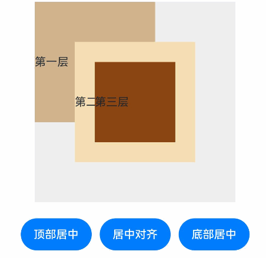

### GridLayoutAlgorithm

[GridLayoutAlgorithm](../reference/apis-arkui/js-apis-arkui-layoutAlgorithm.md#gridlayoutalgorithm)是垂直方向网格布局算法。该算法支持通过[columnsTemplate](../reference/apis-arkui/arkui-ts/ts-container-lazyvgridlayout.md#columnstemplate)或[ItemFillPolicy](../reference/apis-arkui/arkui-ts/ts-types.md#itemfillpolicy22)设置列数，设置[ItemFillPolicy](../reference/apis-arkui/arkui-ts/ts-types.md#itemfillpolicy22)为BREAKPOINT_DEFAULT时行为与[Grid](../reference/apis-arkui/arkui-ts/ts-container-grid.md)一致，行数由子节点数量和列数决定。该算法支持通过[LengthMetrics](../reference/apis-arkui/js-apis-arkui-graphics.md#lengthmetrics12)设置行间距和列间距，通过[align](../reference/apis-arkui/arkui-ts/ts-universal-attributes-location.md#align20)设置组件在网格中的对齐方式。下述示例修改GridLayoutAlgorithm的columnsTemplate属性调整网格列数。

从API version 24开始，新增[GridLayoutAlgorithm](../reference/apis-arkui/js-apis-arkui-layoutAlgorithm.md#gridlayoutalgorithm)的[columnsTemplate](../reference/apis-arkui/js-apis-arkui-layoutAlgorithm.md#属性-3)属性。

<!-- @[GridLayoutAlgorithm](https://gitcode.com/openharmony/applications_app_samples/blob/master/code/DocsSample/ArkUISample/DynamicLayout/entry/src/main/ets/pages/gridlayout/GridLayoutAlgorithm.ets) -->

``` TypeScript
import {
  DynamicLayout, DynamicLayoutAttribute, GridLayoutAlgorithm, LengthMetrics
} from '@kit.ArkUI';

export class GridDataSource implements IDataSource {
  private list: string[] = [];
  private listeners: DataChangeListener[] = [];

  constructor(list: string[]) {
    this.list = list;
  }

  totalCount(): number {
    return this.list.length;
  }

  getData(index: number): string {
    return this.list[index];
  }

  registerDataChangeListener(listener: DataChangeListener): void {
    if (this.listeners.indexOf(listener) < 0) {
      this.listeners.push(listener);
    }
  }

  unregisterDataChangeListener(listener: DataChangeListener): void {
    const pos = this.listeners.indexOf(listener);
    if (pos >= 0) {
      this.listeners.splice(pos, 1);
    }
  }

  // 通知控制器数据位置变化
  notifyDataMove(from: number, to: number): void {
    this.listeners.forEach(listener => {
      listener.onDataMove(from, to);
    })
  }

  // 交换元素位置
  public swapItem(from: number, to: number): void {
    let temp: string = this.list[from];
    this.list[from] = this.list[to];
    this.list[to] = temp;
    this.notifyDataMove(from, to);
  }
}

@Entry
@ComponentV2
struct GridLayoutExample {
  numbers: GridDataSource = new GridDataSource([]);
  @Local flag: boolean = false
  @Local gridLayoutAlgorithm: GridLayoutAlgorithm = new GridLayoutAlgorithm({
    columnsTemplate: '1fr 1fr 1fr',
    columnsGap: LengthMetrics.vp(10),
    rowsGap: LengthMetrics.vp(10)
  })

  aboutToAppear() {
    let list: string[] = [];
    for (let i = 0; i < 4; i++) {
      for (let j = 0; j < 3; j++) {
        list.push((i * 3 + j).toString());
      }
    }
    this.numbers = new GridDataSource(list);
  }

  build() {
    Column({ space: 10 }) {
      DynamicLayout(this.gridLayoutAlgorithm) {
        LazyForEach(this.numbers, (day: string) => {
          GridItem() {
            Text(day)
              .fontSize(16)
              .backgroundColor(0xF9CF93)
              .width('100%')
              .height(80)
              .textAlign(TextAlign.Center)
          }
        }, (index: number) => index.toString())
      }.width('100%')
      Button('change gridLayoutAlgorithm columns').onClick(() => {
        this.flag = !this.flag
        if (this.flag) {
          this.gridLayoutAlgorithm.columnsTemplate = '1fr 1fr'
        } else {
          this.gridLayoutAlgorithm.columnsTemplate = '1fr 1fr 1fr'
        }
      })
    }
  }
}
```
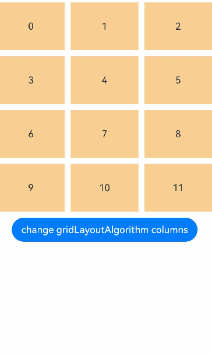

## 自定义布局算法

自定义布局算法通过继承[CustomLayoutAlgorithm](../reference/apis-arkui/js-apis-arkui-layoutAlgorithm.md#customlayoutalgorithm)类，重写[onMeasure](../reference/apis-arkui/js-apis-arkui-layoutAlgorithm.md#onmeasure)和[onLayout](../reference/apis-arkui/js-apis-arkui-layoutAlgorithm.md#onlayout)方法实现。开发者可以根据具体业务需求，自定义子组件的大小测量和位置排列，实现内置布局算法无法满足的个性化布局效果，如瀑布流、标签云等不规则布局。

### 自定义布局算法实现指导

通过调用[FrameNode](../reference/apis-arkui/js-apis-arkui-frameNode.md#framenode-1)的[getChildrenCount()](../reference/apis-arkui/js-apis-arkui-frameNode.md#getchildrencount12)和[getChild()](../reference/apis-arkui/js-apis-arkui-frameNode.md#getchild12)方法，开发者可以获取所有子组件FrameNode。在onMeasure方法中，调用[measure()](../reference/apis-arkui/js-apis-arkui-frameNode.md#measure12)方法可以自定义测量子组件大小。在onLayout方法中，调用[getMeasuredSize()](../reference/apis-arkui/js-apis-arkui-frameNode.md#getmeasuredsize12)可以获取子组件测量后的尺寸，调用[layout()](../reference/apis-arkui/js-apis-arkui-frameNode.md#layout12)方法可以自定义排列子组件位置。下述示例展示如何重写[onMeasure](../reference/apis-arkui/js-apis-arkui-layoutAlgorithm.md#onmeasure)和[onLayout](../reference/apis-arkui/js-apis-arkui-layoutAlgorithm.md#onlayout)方法，调用[FrameNode](../reference/apis-arkui/js-apis-arkui-frameNode.md#framenode-1)的相关方法实现水平方向线性布局的效果。

<!-- @[CustomLayoutBasic](https://gitcode.com/openharmony/applications_app_samples/blob/master/code/DocsSample/ArkUISample/DynamicLayout/entry/src/main/ets/pages/customlayout/CustomLayoutBasic.ets) -->

``` TypeScript
import {
  DynamicLayout, DynamicLayoutAttribute, CustomLayoutAlgorithm, FrameNode, LayoutConstraint, Position, LayoutAlgorithm
} from '@kit.ArkUI';

// 自定义布局算法类
class MyCustomLayout extends CustomLayoutAlgorithm {
  onMeasure(self: FrameNode, constraint: LayoutConstraint): void {
    // 1. 获取子组件数量
    const childCount = self.getChildrenCount();
    let totalWidth = 0;
    let maxHeight = 0;
    // 2. 遍历子组件，进行测量
    for (let i = 0; i < childCount; i++) {
      const child = self.getChild(i);
      if (child) {
        // 3. 创建子组件的布局约束
        const childConstraint: LayoutConstraint = {
          maxSize: { width: 150, height: 150},
          minSize: { width: 150, height: 150},
          percentReference: constraint.percentReference
        };
        // 4. 测量子组件
        child.measure(childConstraint);
        // 5. 获取子组件测量后的尺寸
        const childSize = child.getMeasuredSize();
        totalWidth += childSize.width;
        maxHeight = Math.max(maxHeight, childSize.height);
      }
    }
    const measuredSize: Size = {
      width: Math.min(totalWidth, constraint.maxSize.width),
      height: Math.min(maxHeight, constraint.maxSize.height)
    };
    // 6. 设置自身的测量尺寸
    self.setMeasuredSize(measuredSize);
  }

  onLayout(self: FrameNode, position: Position): void {
    // 1. 获取子组件数量
    const childCount = self.getChildrenCount();
    let offsetX = 0;
    // 2. 遍历子组件，设置布局位置
    for (let i = 0; i < childCount; i++) {
      const child = self.getChild(i);
      if (child) {
        // 3. 获取子组件测量后的尺寸
        const childSize = child.getMeasuredSize();
        const childPosition: Position = {
          x: offsetX,
          y: 0
        };
        // 4. 设置子组件的布局位置
        child.layout(childPosition);
        // 5. 更新偏移量
        offsetX += childSize.width;
      }
    }
    // 6. 设置自身的布局位置
    self.setLayoutPosition(position);
  }
}

@Entry
@ComponentV2
struct CustomLayoutBasic {
  @Local algorithm: LayoutAlgorithm = new MyCustomLayout()
  build() {
    Column({ space: 10 }) {
      DynamicLayout(this.algorithm) {
        Text('Item 1')
          .fontSize(14)
          .backgroundColor(0xF5DEB3)
        Text('Item 2')
          .fontSize(14)
          .backgroundColor(0xD2B48C)
        Text('Item 3')
          .fontSize(14)
          .backgroundColor(0xF5DEB3)
        Text('Item 4')
          .fontSize(14)
          .backgroundColor(0xD2B48C)
      }
      .width('100%')
      .height(200)
      .backgroundColor(0xEFEFEF)
    }
    .padding(20)
  }
}
```
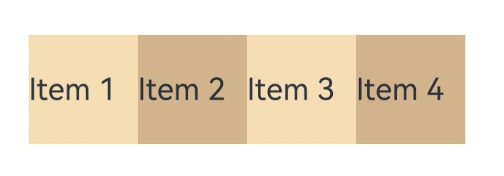

### 瀑布流布局

下述示例实现了自定义瀑布流布局算法，将子组件按列排列，每列中的子组件依次堆叠，适用于商品展示的场景。

<!-- @[WaterFlowLayout](https://gitcode.com/openharmony/applications_app_samples/blob/master/code/DocsSample/ArkUISample/DynamicLayout/entry/src/main/ets/pages/customlayout/WaterFlowLayout.ets) -->

``` TypeScript
import {
  DynamicLayout, DynamicLayoutAttribute, CustomLayoutAlgorithm, LayoutAlgorithm, FrameNode, LayoutConstraint, Position
} from '@kit.ArkUI';

// 瀑布流布局算法
class WaterfallLayout extends CustomLayoutAlgorithm {
  private columnCount: number = 2;
  private columnGap: number = 10;
  private rowGap: number = 10;

  onMeasure(self: FrameNode, constraint: LayoutConstraint): void {
    const childCount = self.getChildrenCount();
    const columnWidth = (constraint.maxSize.width - (this.columnCount - 1) * this.columnGap) / this.columnCount;
    // 记录每列的当前高度
    const columnHeights: number[] = new Array(this.columnCount).fill(0);
    for (let i = 0; i < childCount; i++) {
      const child = self.getChild(i);
      if (child) {
        // 通过将minSize和maxSize设置为相同值来约束子组件宽度
        const childConstraint: LayoutConstraint = {
          maxSize: {
            width: columnWidth,
            height: constraint.maxSize.height
          },
          minSize: {
            width: columnWidth,
            height: 0
          },
          percentReference: constraint.percentReference
        };
        child.measure(childConstraint);
        // 找到当前高度最小的列
        const minColumn = columnHeights.indexOf(Math.min(...columnHeights));
        columnHeights[minColumn] += child.getMeasuredSize().height + this.rowGap;
      }
    }
    const maxHeight = Math.max(...columnHeights);
    self.setMeasuredSize({
      width: constraint.maxSize.width,
      height: maxHeight
    });
  }

  onLayout(self: FrameNode, position: Position): void {
    const childCount = self.getChildrenCount();
    const measuredSize = self.getMeasuredSize();
    const columnWidth = (measuredSize.width - (this.columnCount - 1) * this.columnGap) / this.columnCount;
    // 记录每列的当前Y坐标
    const columnYs: number[] = new Array(this.columnCount).fill(0);
    for (let i = 0; i < childCount; i++) {
      const child = self.getChild(i);
      if (child) {
        const childSize = child.getMeasuredSize();
        // 找到当前Y坐标最小的列
        const minColumn = columnYs.indexOf(Math.min(...columnYs));
        const x = minColumn * (columnWidth + this.columnGap);
        const y = columnYs[minColumn];
        child.layout({ x, y });
        columnYs[minColumn] += childSize.height + this.rowGap;
      }
    }
    self.setLayoutPosition(position);
  }
}

@Entry
@ComponentV2
struct WaterfallLayoutExample {
  @Local algorithm: LayoutAlgorithm = new WaterfallLayout();

  // 商品数据
  private products: Product[] = [
    { id: '1', name: '时尚运动鞋', price: '¥399', height: 180, image: '商品图' },
    { id: '2', name: '休闲双肩包', price: '¥259', height: 220, image: '商品图' },
    { id: '3', name: '无线蓝牙耳机', price: '¥599', height: 150, image: '商品图' },
    { id: '4', name: '智能手表', price: '¥1299', height: 200, image: '商品图' },
    { id: '5', name: '太阳眼镜', price: '¥199', height: 130, image: '商品图' },
    { id: '6', name: '便携充电宝', price: '¥129', height: 170, image: '商品图' },
    { id: '7', name: '机械键盘', price: '¥459', height: 160, image: '商品图' },
    { id: '8', name: '游戏鼠标', price: '¥189', height: 140, image: '商品图' },
    { id: '9', name: '高清显示器', price: '¥1599', height: 210, image: '商品图' },
    { id: '10', name: '智能音箱', price: '¥299', height: 190, image: '商品图' }
  ];

  // 商品卡片组件
  @Builder ProductCard(product: Product) {
    Column() {
      Text(product.image)
        .fontSize(18)
        .margin({ bottom: 8 })
      Text(product.name)
        .fontSize(14)
        .fontWeight(FontWeight.Medium)
        .fontColor(0x333333)
        .margin({ bottom: 4 })
        .maxLines(1)
        .textOverflow({ overflow: TextOverflow.Ellipsis })
      Text(product.price)
        .fontSize(16)
        .fontColor(0xFF6B35)
        .fontWeight(FontWeight.Bold)
    }
    .width('100%')
    .padding(12)
    .backgroundColor(0xFAFAFA)
    .borderRadius(8)
    .border({ width: 1, color: 0xE0E0E0 })
    .height(product.height)
    .justifyContent(FlexAlign.Center)
  }

  build() {
    Column() {
      Text('商品列表 - 瀑布流布局')
        .fontSize(18)
        .fontWeight(FontWeight.Bold)
        .margin({ bottom: 20 })

      Scroll() {
        DynamicLayout(this.algorithm) {
          ForEach(this.products, (product: Product) => {
            this.ProductCard(product)
          })
        }
        .width('100%')
        .backgroundColor(0xEFEFEF)
        .borderRadius(12)
        .padding(10)
      }
      .scrollable(ScrollDirection.Vertical)
      .scrollBar(BarState.Auto)
      .edgeEffect(EdgeEffect.Spring)
      .width('100%')
      .layoutWeight(1)

      Text('商品卡片自动分配到高度最小的列')
        .fontSize(14)
        .fontColor(Color.Gray)
        .margin({ top: 12 })
    }
    .padding(20)
    .width('100%')
    .height('100%')
  }
}

// 商品数据模型
interface Product {
  id: string;
  name: string;
  price: string;
  height: number;
  image: string;
}
```

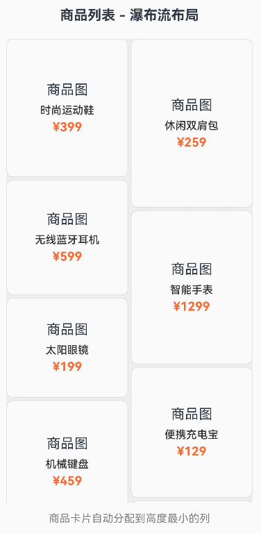

### 网格布局

下述示例实现一个自定义网格布局算法，将子组件按网格排列，同一行的子组件高度保持一致。

<!-- @[GridLayout](https://gitcode.com/openharmony/applications_app_samples/blob/master/code/DocsSample/ArkUISample/DynamicLayout/entry/src/main/ets/pages/customlayout/GridLayout.ets) -->

``` TypeScript
import {
  DynamicLayout, DynamicLayoutAttribute, CustomLayoutAlgorithm, LayoutAlgorithm, FrameNode, LayoutConstraint, Position
} from '@kit.ArkUI';

// 2x2网格布局算法
export class GridLayout extends CustomLayoutAlgorithm {
  private gap: number = 12;
  private itemHeights: number[] = [];

  onMeasure(self: FrameNode, constraint: LayoutConstraint): void {
    const childCount = self.getChildrenCount();
    const columns = 2;
    const itemWidth = (constraint.maxSize.width - (columns - 1) * this.gap) / columns;
    this.itemHeights = [];

    // 第一遍测量：获取每个子组件的理想高度
    for (let i = 0; i < childCount; i++) {
      const child = self.getChild(i);
      if (child) {
        const childConstraint: LayoutConstraint = {
          maxSize: { width: itemWidth, height: Number.MAX_VALUE },
          minSize: { width: itemWidth, height: 0 },
          percentReference: constraint.percentReference
        };
        child.measure(childConstraint);
        this.itemHeights.push(child.getMeasuredSize().height);
      }
    }

    // 计算每行的最大高度
    const rows = Math.ceil(childCount / columns);
    const rowHeights: number[] = [];
    for (let r = 0; r < rows; r++) {
      let maxRowHeight = 0;
      for (let c = 0; c < columns; c++) {
        const index = r * columns + c;
        if (index < this.itemHeights.length && this.itemHeights[index] > maxRowHeight) {
          maxRowHeight = this.itemHeights[index];
        }
      }
      rowHeights.push(maxRowHeight);
    }

    // 计算总高度
    const totalHeight = rowHeights.reduce((sum, h) => sum + h, 0) + (rows - 1) * this.gap;

    // 第二遍测量：使用每行的统一高度重新测量子组件
    for (let i = 0; i < childCount; i++) {
      const child = self.getChild(i);
      if (child) {
        const row = Math.floor(i / columns);
        const rowHeight = rowHeights[row];
        const childConstraint: LayoutConstraint = {
          maxSize: { width: itemWidth, height: rowHeight },
          minSize: { width: itemWidth, height: rowHeight },
          percentReference: constraint.percentReference
        };
        child.measure(childConstraint);
      }
    }

    self.setMeasuredSize({
      width: constraint.maxSize.width,
      height: totalHeight
    });
  }

  onLayout(self: FrameNode, position: Position): void {
    const childCount = self.getChildrenCount();
    const measuredSize = self.getMeasuredSize();
    const columns = 2;
    const itemWidth = (measuredSize.width - (columns - 1) * this.gap) / columns;

    // 重新计算每行的最大高度
    const rows = Math.ceil(childCount / columns);
    const rowHeights: number[] = [];
    for (let r = 0; r < rows; r++) {
      let maxRowHeight = 0;
      for (let c = 0; c < columns; c++) {
        const index = r * columns + c;
        if (index < this.itemHeights.length && this.itemHeights[index] > maxRowHeight) {
          maxRowHeight = this.itemHeights[index];
        }
      }
      rowHeights.push(maxRowHeight);
    }

    for (let i = 0; i < childCount; i++) {
      const child = self.getChild(i);
      if (child) {
        const row = Math.floor(i / columns);
        const col = i % columns;
        const x = col * (itemWidth + this.gap);
        const y = row === 0 ? 0 : rowHeights.slice(0, row).reduce((sum, h) => sum + h, 0) + row * this.gap;
        child.layout({ x, y });
      }
    }

    self.setLayoutPosition(position);
  }
}

@Entry
@ComponentV2
struct GridLayoutExample {
  @Local algorithm: LayoutAlgorithm = new GridLayout();

  build() {
    Column() {
      Text('网格布局示例')
        .fontSize(18)
        .margin({ bottom: 20 })

      DynamicLayout(this.algorithm) {
        ForEach(['卡片1', '卡片2', '卡片3', '卡片4'], (title: string, index: number) => {
          Column() {
            Text(title)
              .fontSize(16)
              .fontWeight(FontWeight.Bold)
              .fontColor(0x333333)
              .margin({ bottom: 8 })
            Text('内容区域')
              .fontSize(12)
              .fontColor(0x666666)
          }
          .width('100%')
          .padding(12)
          .backgroundColor(0xFAFAFA)
          .borderRadius(8)
          .border({ width: 1, color: 0xE0E0E0 })
        })
      }
      .width('100%')
      .backgroundColor(0xEFEFEF)
      .borderRadius(12)
      .padding(12)

      Text('同一行的子组件高度保持一致')
        .fontSize(14)
        .fontColor(Color.Gray)
        .margin({ top: 20 })
    }
    .padding(20)
    .width('100%')
  }
}
```

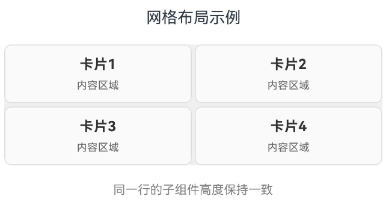

### 标签云布局

下述示例实现一个自定义标签云布局，标签自动换行排列，适合展示搜索历史、热门标签、技能标签等不规则布局的场景。

<!-- @[TagCloudLayout](https://gitcode.com/openharmony/applications_app_samples/blob/master/code/DocsSample/ArkUISample/DynamicLayout/entry/src/main/ets/pages/customlayout/TagCloudLayout.ets) -->

``` TypeScript
import {
  DynamicLayout, DynamicLayoutAttribute, CustomLayoutAlgorithm, LayoutAlgorithm, FrameNode, LayoutConstraint, Position
} from '@kit.ArkUI';

// 标签云布局算法
class TagCloudLayout extends CustomLayoutAlgorithm {
  private horizontalGap: number = 12;
  private verticalGap: number = 12;

  onMeasure(self: FrameNode, constraint: LayoutConstraint): void {
    const childCount = self.getChildrenCount();
    const maxWidth = constraint.maxSize.width;

    let currentLineWidth = 0;
    let totalHeight = 0;
    let maxLineWidth = 0;
    let currentLineHeight = 0;

    for (let i = 0; i < childCount; i++) {
      const child = self.getChild(i);
      if (child) {
        // 测量子组件，不限制宽高
        const childConstraint: LayoutConstraint = {
          maxSize: { width: maxWidth, height: Number.MAX_VALUE },
          minSize: { width: 0, height: 0 },
          percentReference: constraint.percentReference
        };
        child.measure(childConstraint);
        const childSize = child.getMeasuredSize();

        // 检查是否需要换行
        if (currentLineWidth + childSize.width > maxWidth && currentLineWidth > 0) {
          // 换行前，累加上一行的高度
          totalHeight += currentLineHeight + this.verticalGap;
          currentLineWidth = childSize.width + this.horizontalGap;
          currentLineHeight = childSize.height;
          maxLineWidth = Math.max(maxLineWidth, currentLineWidth - this.horizontalGap);
        } else {
          // 继续当前行
          currentLineWidth += childSize.width + this.horizontalGap;
          currentLineHeight = Math.max(currentLineHeight, childSize.height);
          maxLineWidth = Math.max(maxLineWidth, currentLineWidth - this.horizontalGap);
        }
      }
    }
    // 累加最后一行的高度
    totalHeight += currentLineHeight;

    self.setMeasuredSize({
      width: Math.min(maxLineWidth, maxWidth),
      height: totalHeight
    });
  }

  onLayout(self: FrameNode, position: Position): void {
    const childCount = self.getChildrenCount();
    const measuredSize = self.getMeasuredSize();
    const maxWidth = measuredSize.width;

    let currentX = 0;
    let currentY = 0;
    let currentLineHeight = 0;

    for (let i = 0; i < childCount; i++) {
      const child = self.getChild(i);
      if (child) {
        const childSize = child.getMeasuredSize();
        // 检查是否需要换行
        if (currentX + childSize.width > maxWidth && currentX > 0) {
          // 换行
          currentY += currentLineHeight + this.verticalGap;
          currentX = 0;
          currentLineHeight = 0;
        }
        // 布局子组件
        child.layout({ x: currentX, y: currentY })
        // 更新位置
        currentX += childSize.width + this.horizontalGap;
        currentLineHeight = Math.max(currentLineHeight, childSize.height);
      }
    }
    self.setLayoutPosition(position);
  }
}

@Entry
@ComponentV2
struct TagCloudExample {
  @Local algorithm: LayoutAlgorithm = new TagCloudLayout();

  // 热门标签数据
  private tags: string[] = [
    '标签1', '标签标签标签', '标签2', '标签标签', '标签标签标',
    '标签标签标', '标签标签标签标签', '标签标签', '标签标签',
    '标签标', '标签标签', '标签标签', '标签标签标签',
    '标签标', '标签标签', '标签标签', '标签标签标'
  ];

  // 标签组件
  @Builder TagItem(tag: string, index: number) {
    Text(tag)
      .fontSize(14)
      .fontColor([0xFF6B6B, 0x4ECDC4, 0x45B7D1, 0xFFA07A, 0x98D8C8, 0xF7DC6F][index % 6])
      .padding({ left: 12, right: 12, top: 8, bottom: 8 })
      .backgroundColor(0xF5F5F5)
      .borderRadius(16)
      .border({ width: 1, color: 0xE0E0E0 })
  }

  build() {
    Column() {
      Text('热门话题 - 标签云布局')
        .fontSize(18)
        .fontWeight(FontWeight.Bold)
        .margin({ bottom: 20 })

      Scroll() {
        DynamicLayout(this.algorithm) {
          ForEach(this.tags, (tag: string, index: number) => {
            this.TagItem(tag, index)
          }, (tag: string, index: number) => `${index}_${tag}`)
        }
        .width('100%')
        .padding(16)
      }
      .scrollable(ScrollDirection.Vertical)
      .scrollBar(BarState.Auto)
      .edgeEffect(EdgeEffect.Spring)
      .width('100%')

      Text('标签自动换行，紧凑排列')
        .fontSize(14)
        .fontColor(Color.Gray)
        .margin({ top: 12 })
    }
    .padding(20)
    .width('100%')
    .height('100%')
  }
}
```

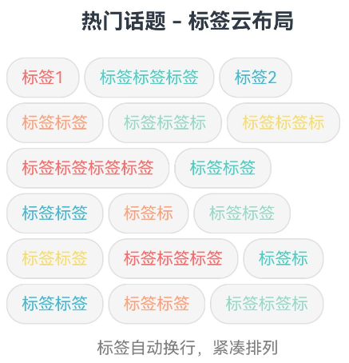

## 切换布局算法

DynamicLayout在切换布局算法时会保持子组件的状态不变，比如输入框内容、开关状态、进度条值等。下述示例展示[TextInput](../reference/apis-arkui/arkui-ts/ts-basic-components-textinput.md#接口)、[Toggle](../reference/apis-arkui/arkui-ts/ts-basic-components-toggle.md#接口)、[Slider](../reference/apis-arkui/arkui-ts/ts-basic-components-slider.md#接口)和[CheckBox](../reference/apis-arkui/arkui-ts/ts-basic-components-checkbox.md#checkbox-1)组件在布局切换过程中保持状态，同时使用[animateTo](../reference/apis-arkui/arkts-apis-uicontext-uicontext.md#animateto)为布局切换添加平滑的动画效果。

<!-- @[ReserveChildState](https://gitcode.com/openharmony/applications_app_samples/blob/master/code/DocsSample/ArkUISample/DynamicLayout/entry/src/main/ets/pages/responsivelayout/ReserveChildState.ets) -->

``` TypeScript
import {
  DynamicLayout, DynamicLayoutAttribute, ColumnLayoutAlgorithm, LayoutAlgorithm, curves, LengthMetrics,
  GridLayoutAlgorithm
} from '@kit.ArkUI';

@Entry
@ComponentV2
struct StatePreservationExample {
  @Local algorithm: LayoutAlgorithm = new ColumnLayoutAlgorithm({
    space: LengthMetrics.vp(12)
  });

  build() {
    Column() {
      Text('布局切换状态保持示例')
        .fontSize(18)
        .margin({ bottom: 20 })

      // 使用animateTo为布局切换添加动画效果
      DynamicLayout(this.algorithm) {
        // 子组件1：带输入框的卡片
        Column() {
          Text('输入框')
            .fontSize(14)
            .fontWeight(FontWeight.Bold)
            .fontColor(0x333333)
            .margin({ bottom: 8 })
          TextInput({ placeholder: '请输入' })
            .width('100%')
            .height(36)
            .fontSize(12)
        }
        .width('100%')
        .padding(12)
        .backgroundColor(0x80F0F0F0)
        .borderRadius(8)

        // 子组件2：带开关的卡片
        Column() {
          Text('开关')
            .fontSize(14)
            .fontWeight(FontWeight.Bold)
            .fontColor(0x333333)
            .margin({ bottom: 8 })
          Toggle({ type: ToggleType.Switch, isOn: true })
            .selectedColor(0xD4D4D4)
            .height(26)
            .width(52)
        }
        .width('100%')
        .padding(12)
        .backgroundColor(0x80F0F0F0)
        .borderRadius(8)

        // 子组件3：带进度条的卡片
        Column() {
          Text('进度条')
            .fontSize(14)
            .fontWeight(FontWeight.Bold)
            .fontColor(0x333333)
            .margin({ bottom: 8 })
          Slider({ value: 60, min: 0, max: 100 })
            .width('100%')
            .trackColor(0xD4D4D4)
            .selectedColor(0xD4D4D4)
            .height(36)
        }
        .width('100%')
        .padding(12)
        .backgroundColor(0x80F0F0F0)
        .borderRadius(8)

        // 子组件4：带复选框的卡片
        Column() {
          Text('复选框')
            .fontSize(14)
            .fontWeight(FontWeight.Bold)
            .fontColor(0x333333)
            .margin({ bottom: 8 })
          Row() {
            Checkbox({ name: 'check1' })
              .select(false)
              .selectedColor(0xD4D4D4)
            Text('记住密码')
              .fontSize(12)
              .fontColor(0x333333)
              .margin({ left: 8 })
          }
          .height(36)
        }
        .width('100%')
        .padding(12)
        .backgroundColor(0x80F0F0F0)
        .borderRadius(8)
      }
      .width('100%')
      .borderRadius(12)
      .padding(12)

      Row({ space: 10 }) {
        Button('列表布局')
          .onClick(() => {
            this.getUIContext()?.animateTo({ duration: 300, curve: curves.springMotion() }, () => {
              this.algorithm = new ColumnLayoutAlgorithm({
                space: LengthMetrics.vp(12)
              });
            });
          })
        Button('网格布局')
          .onClick(() => {
            this.getUIContext()?.animateTo({ duration: 300, curve: curves.springMotion() }, () => {
              this.algorithm = new GridLayoutAlgorithm({
                columnsTemplate: '1fr 1fr',
                columnsGap: LengthMetrics.vp(10),
                rowsGap: LengthMetrics.vp(10)
              });
            });
          })
      }
      .margin({ top: 20 })

      Text('切换布局后，子组件状态保持不变')
        .fontSize(14)
        .fontColor(Color.Gray)
        .margin({ top: 12 })
    }
    .padding(20)
    .width('100%')
  }
}
```

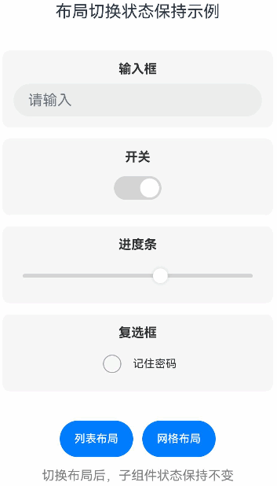

DynamicLayout支持以下几种方式触发重新布局：

- 通过状态变量切换布局算法。

  开发者使用[@Local](./state-management/arkts-new-local.md)装饰器修饰布局算法变量，可以实现运行时动态切换布局。

  <!-- @[ChangeLayoutAlgorithm](https://gitcode.com/openharmony/applications_app_samples/blob/master/code/DocsSample/ArkUISample/DynamicLayout/entry/src/main/ets/pages/responsivelayout/ChangeLayoutAlgorithm.ets) -->

  ``` TypeScript
  import {
    DynamicLayout, DynamicLayoutAttribute, RowLayoutAlgorithm, ColumnLayoutAlgorithm,
    StackLayoutAlgorithm, GridLayoutAlgorithm, LayoutAlgorithm, LengthMetrics
  } from '@kit.ArkUI';

  @Entry
  @ComponentV2
  struct LayoutSwitchExample {
    @Local algorithm: LayoutAlgorithm = new RowLayoutAlgorithm({
      space: LengthMetrics.vp(10),
      alignItems: VerticalAlign.Center
    });
    @Local childWidth: string = '20%'
    @Local childHeight: string = '20%'

    build() {
      Column() {
        // 使用状态变量控制布局算法
        DynamicLayout(this.algorithm) {
          Text('Item 1')
            .width(this.childWidth)
            .height(this.childHeight)
            .fontSize(14)
            .textAlign(TextAlign.Center)
            .backgroundColor(0xF5DEB3)
            .borderRadius(8)
            .layoutGravity(LocalizedAlignment.TOP_START)
          Text('Item 2')
            .width(this.childWidth)
            .height(this.childHeight)
            .fontSize(14)
            .textAlign(TextAlign.Center)
            .backgroundColor(0xF5DEB3)
            .borderRadius(8)
            .layoutGravity(LocalizedAlignment.TOP_END)
          Text('Item 3')
            .width(this.childWidth)
            .height(this.childHeight)
            .fontSize(14)
            .textAlign(TextAlign.Center)
            .backgroundColor(0xF5DEB3)
            .borderRadius(8)
            .layoutGravity(LocalizedAlignment.BOTTOM_START)
          Text('Item 4')
            .width(this.childWidth)
            .height(this.childHeight)
            .fontSize(14)
            .textAlign(TextAlign.Center)
            .backgroundColor(0xF5DEB3)
            .borderRadius(8)
            .layoutGravity(LocalizedAlignment.BOTTOM_END)
        }
        .width(300)
        .height(280)
        .backgroundColor(0xEFEFEF)
        .borderRadius(12)
        .padding(10)

        Column({ space: 10 }) {
          Row({ space: 10 }) {
            Button('Row布局')
              .onClick(() => {
                this.algorithm = new RowLayoutAlgorithm({
                  space: LengthMetrics.vp(10),
                  alignItems: VerticalAlign.Center
                });
                this.childWidth = '20%'
                this.childHeight = '20%'
              })
            Button('Column布局')
              .onClick(() => {
                this.algorithm = new ColumnLayoutAlgorithm({
                  space: LengthMetrics.vp(10),
                  alignItems: HorizontalAlign.Center
                });
                this.childWidth = '20%'
                this.childHeight = '20%'
              })
          }
          Row({ space: 10 }) {
            Button('Stack布局')
              .onClick(() => {
                this.algorithm = new StackLayoutAlgorithm({
                  alignContent: LocalizedAlignment.CENTER
                });
                this.childWidth = '20%'
                this.childHeight = '20%'
              })
            Button('Grid布局')
              .onClick(() => {
                this.algorithm = new GridLayoutAlgorithm({
                  columnsTemplate: '1fr 1fr',
                  rowsGap: LengthMetrics.vp(5),
                  columnsGap: LengthMetrics.vp(5)
                });
                this.childWidth = '100%'
                this.childHeight = '50%'
              })
          }
        }
        .margin({ top: 20 })
      }
      .padding(20)
    }
  }
  ```

  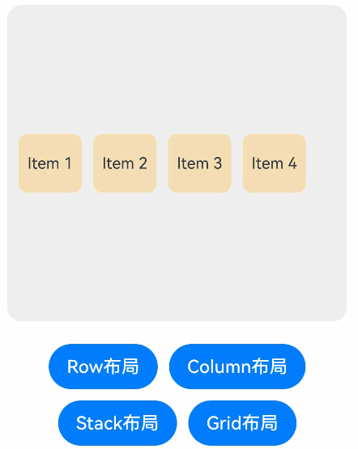

- 通过条件运算符切换布局算法。

  开发者可以使用条件运算符，根据状态变量的值选择合适的布局算法。

  <!-- @[ChangeLayoutWithConditionVariable](https://gitcode.com/openharmony/applications_app_samples/blob/master/code/DocsSample/ArkUISample/DynamicLayout/entry/src/main/ets/pages/responsivelayout/ChangeLayoutWithConditionVariable.ets) -->

  ``` TypeScript
  import { 
    DynamicLayout, DynamicLayoutAttribute, RowLayoutAlgorithm, ColumnLayoutAlgorithm, LengthMetrics 
  } from '@kit.ArkUI';

  @Entry
  @ComponentV2
  struct ConditionalLayoutExample {
    @Local isHorizontal: boolean = true;

    build() {
      Column() {
        // 使用三元运算符根据条件选择布局算法
        DynamicLayout(
          this.isHorizontal
            ? new RowLayoutAlgorithm({ space: LengthMetrics.vp(10) })
            : new ColumnLayoutAlgorithm({ space: LengthMetrics.vp(10) })
        ) {
          Text('Item 1')
            .width(80)
            .height(40)
            .fontSize(14)
            .backgroundColor(0xF5DEB3)
          Text('Item 2')
            .width(80)
            .height(40)
            .fontSize(14)
            .backgroundColor(0xD2B48C)
          Text('Item 3')
            .width(80)
            .height(40)
            .fontSize(14)
            .backgroundColor(0xF5DEB3)
        }
        .width('100%')
        .height(150)
        .backgroundColor(0xEFEFEF)

        Button('切换方向')
          .onClick(() => {
            this.isHorizontal = !this.isHorizontal;
          })
      }
      .padding(20)
    }
  }
  ```

  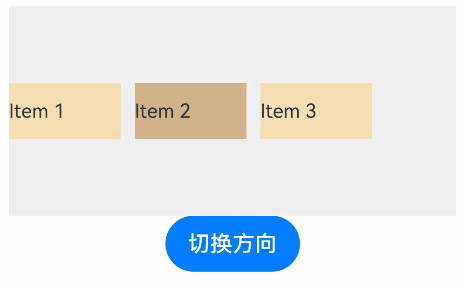

- 通过修改算法属性触发重新布局。

  布局算法类使用[@ObservedV2](./state-management/arkts-new-observedV2-and-trace.md)装饰，布局算法成员属性使用[@Trace](./state-management/arkts-new-observedV2-and-trace.md)装饰，修改属性值可以触发DynamicLayout组件重新布局。

  <!-- @[ChangeAlgorithmProperties](https://gitcode.com/openharmony/applications_app_samples/blob/master/code/DocsSample/ArkUISample/DynamicLayout/entry/src/main/ets/pages/responsivelayout/ChangeAlgorithmProperties.ets) -->

  ``` TypeScript
  import {
    DynamicLayout, DynamicLayoutAttribute, RowLayoutAlgorithm, LengthMetrics
  } from '@kit.ArkUI';

  @Entry
  @ComponentV2
  struct PropertyChangeExample {
    @Local algorithm: RowLayoutAlgorithm = new RowLayoutAlgorithm({
      space: LengthMetrics.vp(10),
      justifyContent: FlexAlign.Start
    });

    build() {
      Column() {
        DynamicLayout(this.algorithm) {
          Text('Item 1')
            .width(60)
            .height(40)
            .fontSize(14)
            .backgroundColor(0xF5DEB3)
          Text('Item 2')
            .width(60)
            .height(40)
            .fontSize(14)
            .backgroundColor(0xD2B48C)
          Text('Item 3')
            .width(60)
            .height(40)
            .fontSize(14)
            .backgroundColor(0xF5DEB3)
        }
        .width('100%')
        .height(80)
        .backgroundColor(0xEFEFEF)

        Row({ space: 10 }) {
          Button('增加间距')
            .fontSize(14)
            .onClick(() => {
              // 修改space属性触发重新布局
              const currentSpace = this.algorithm.space?.value;
              this.algorithm.space = LengthMetrics.vp(currentSpace as number + 5);
            })
          Button('居中对齐')
            .fontSize(14)
            .onClick(() => {
              // 修改justifyContent属性触发重新布局
              this.algorithm.justifyContent = FlexAlign.Center;
            })
          Button('两端对齐')
            .fontSize(14)
            .onClick(() => {
              this.algorithm.justifyContent = FlexAlign.SpaceBetween;
            })
        }
        .margin({ top: 20 })
      }
      .padding(20)
    }
  }
  ```

  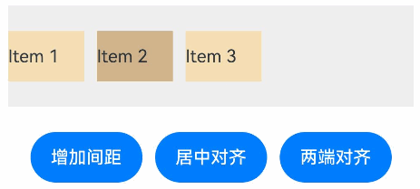

- 响应式布局算法切换。

  开发者可以结合[mediaquery](../reference/apis-arkui/arkts-apis-uicontext-mediaquery.md)接口监听屏幕方向变化，自动切换商品列表的布局方式。竖屏时使用列表视图（每行一个商品），横屏时使用网格视图（2x2网格布局）。

  此示例在运行前需要在工程配置文件[module.json5](../quick-start/module-configuration-file.md)中的abilities字段里配置"orientation": "auto_rotation"。

  <!-- @[ChangeLayoutWithMediaQuery](https://gitcode.com/openharmony/applications_app_samples/blob/master/code/DocsSample/ArkUISample/DynamicLayout/entry/src/main/ets/pages/responsivelayout/ChangeLayoutWithMediaQuery.ets) -->

  ``` TypeScript
  import {
    DynamicLayout, DynamicLayoutAttribute, ColumnLayoutAlgorithm, LayoutAlgorithm, LengthMetrics, mediaquery,
    GridLayoutAlgorithm
  } from '@kit.ArkUI';

  // 商品数据模型
  interface Product {
    id: string;
    name: string;
    price: string;
    image: string;
  }

  @Entry
  @ComponentV2
  struct ProductListExample {
    @Local algorithm: LayoutAlgorithm = new ColumnLayoutAlgorithm({
      space: LengthMetrics.vp(12)
    });
    @Local currentOrientation: string = '竖屏';
    // 商品数据
    private products: Product[] = [
      { id: '1', name: '智能手机 Pro', price: '¥5999', image: '商品' },
      { id: '2', name: '无线耳机', price: '¥899', image: '商品' },
      { id: '3', name: '智能手表', price: '¥1999', image: '商品' },
      { id: '4', name: '平板电脑', price: '¥3999', image: '商品' }
    ];

    // 监听横屏事件
    listener: mediaquery.MediaQueryListener = this.getUIContext().getMediaQuery().matchMediaSync('(orientation: landscape)');

    // 当满足媒体查询条件时，触发回调
    onOrientationChange(mediaQueryResult: mediaquery.MediaQueryResult) {
      if (mediaQueryResult.matches) {
        // 横屏：使用2x2网格布局
        this.algorithm = new GridLayoutAlgorithm({
          columnsTemplate: '1fr 1fr',
          columnsGap: LengthMetrics.vp(10),
          rowsGap: LengthMetrics.vp(10)
        });
        this.currentOrientation = '横屏';
      } else {
        // 竖屏：使用列表布局（每行一个商品）
        this.algorithm = new ColumnLayoutAlgorithm({
          space: LengthMetrics.vp(12)
        });
        this.currentOrientation = '竖屏';
      }
    }

    aboutToAppear() {
      // 绑定回调函数
      this.listener.on('change', (mediaQueryResult: mediaquery.MediaQueryResult) => {
        this.onOrientationChange(mediaQueryResult);
      });
    }

    aboutToDisappear() {
      // 解绑listener中注册的回调函数
      this.listener.off('change');
    }

    // 商品卡片组件
    @Builder ProductCard(product: Product) {
      Row() {
        Text(product.image)
          .fontSize(20)
          .margin({ right: 12 })
        Column() {
          Text(product.name)
            .fontSize(16)
            .fontWeight(FontWeight.Medium)
            .fontColor(0x333333)
            .margin({ bottom: 4 })
          Text(product.price)
            .fontSize(18)
            .fontColor(0xFF6B35)
            .fontWeight(FontWeight.Bold)
        }
        .alignItems(HorizontalAlign.Start)
        .layoutWeight(1)
        .margin({ right: 12 })
        Button('购买')
          .fontSize(14)
          .height(32)
      }
      .width('100%')
      .padding(16)
      .backgroundColor(0xFAFAFA)
      .borderRadius(8)
      .border({ width: 1, color: 0xE0E0E0 })
    }

    build() {
      Column() {
        // 标题栏
        Row() {
          Text('商品列表')
            .fontSize(20)
            .fontWeight(FontWeight.Bold)
            .fontColor(0x333333)
          Blank()
          Text(`${this.currentOrientation}`)
            .fontSize(12)
            .fontColor(0x999999)
            .padding({ left: 8, right: 8, top: 4, bottom: 4 })
            .backgroundColor(0xF0F0F0)
            .borderRadius(4)
        }
        .width('100%')
        .padding({ left: 16, right: 16, top: 12, bottom: 12 })
        .backgroundColor(Color.White)

        // 商品列表
        Scroll() {
          DynamicLayout(this.algorithm) {
            ForEach(this.products, (product: Product) => {
              this.ProductCard(product)
            })
          }
          .width('100%')
          .layoutWeight(1)
          .padding(12)
        }
        .layoutWeight(1)
        .width('100%')
        .backgroundColor(0xF5F5F5)

        // 提示信息
        Text('旋转设备可查看不同布局效果')
          .fontSize(12)
          .fontColor(0x999999)
          .textAlign(TextAlign.Center)
          .padding(12)
          .width('100%')
          .backgroundColor(Color.White)
      }
      .width('100%')
      .height('100%')
    }
  }
  ```

  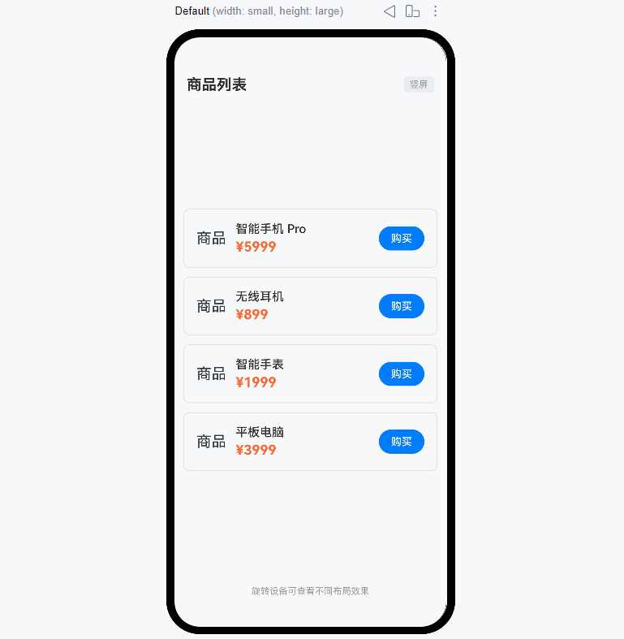

